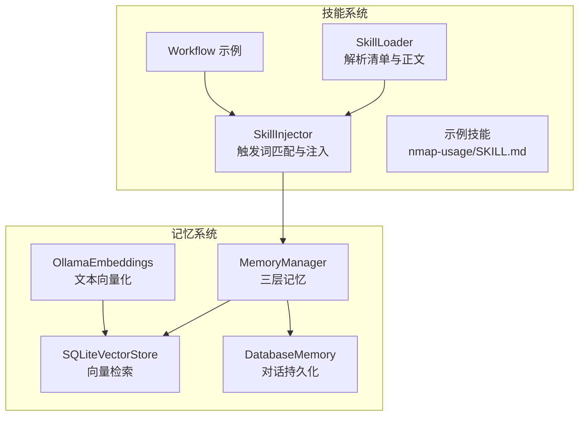
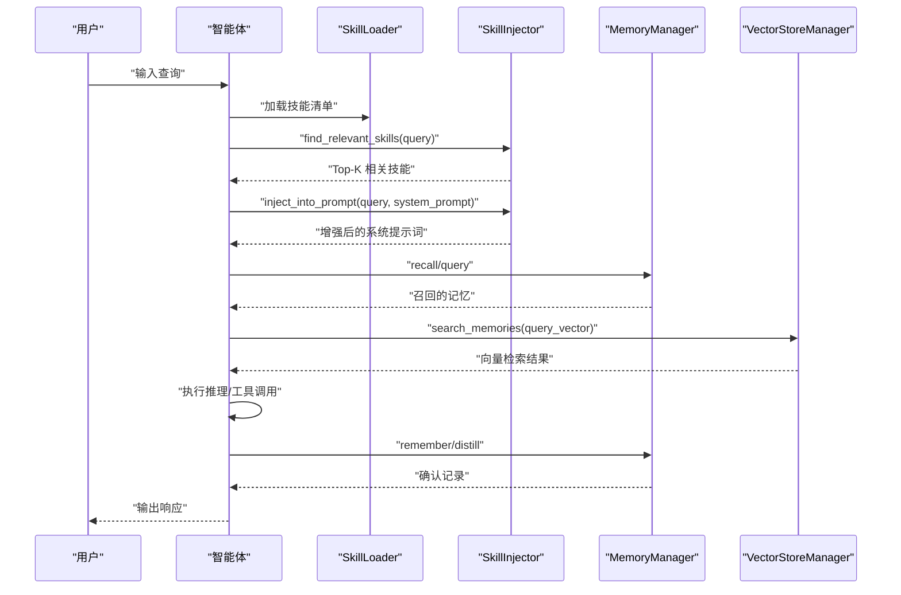
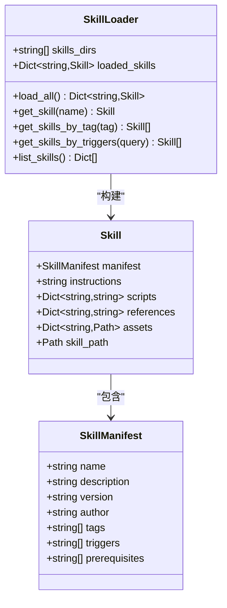
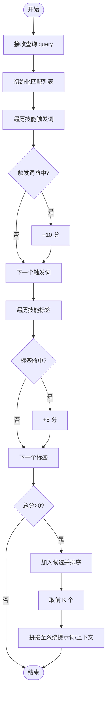
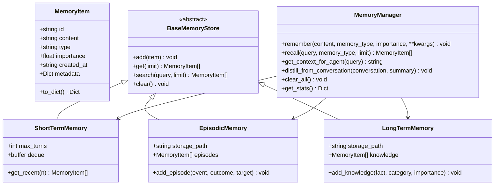
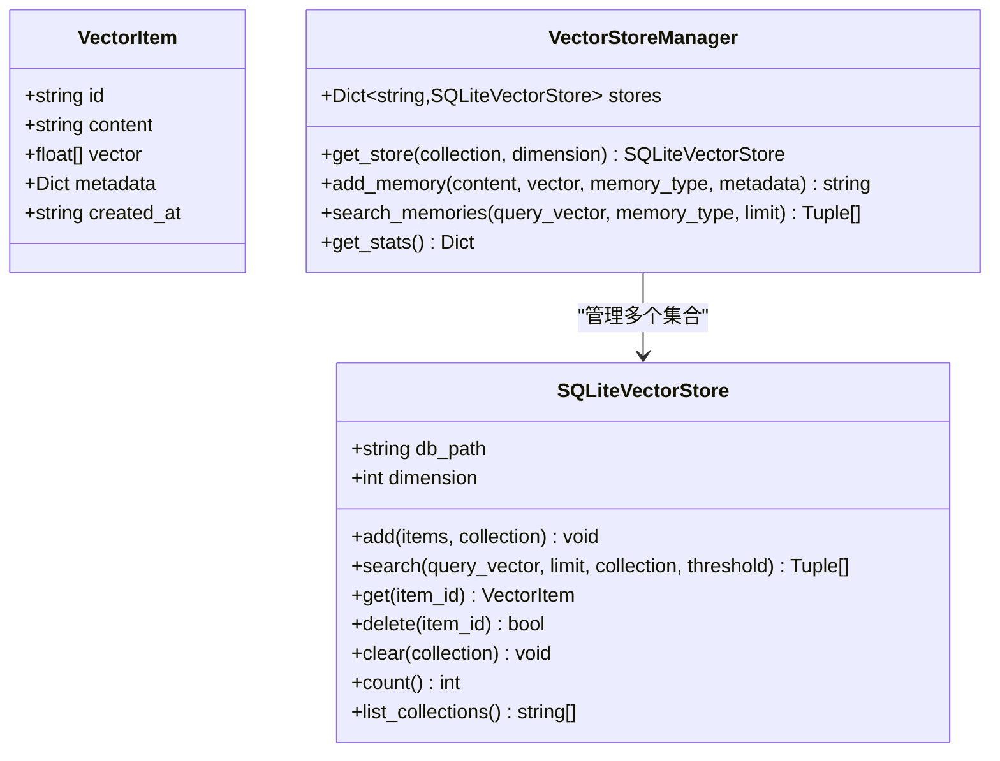
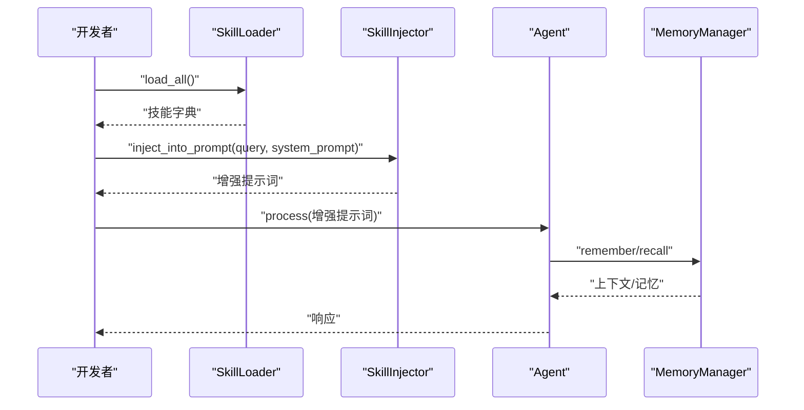
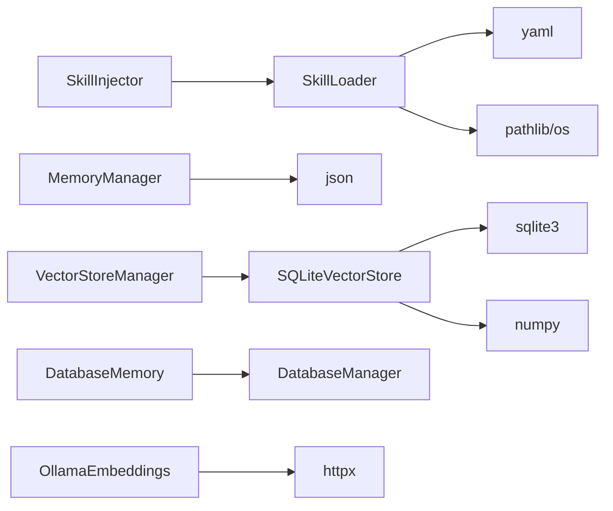

# 技能与记忆系统

<cite>
**本文引用的文件**
- [skills/loader.py](file://skills/loader.py)
- [skills/injector.py](file://skills/injector.py)
- [skills/workflow.py](file://skills/workflow.py)
- [skills/base/nmap-usage/SKILL.md](file://skills/base/nmap-usage/SKILL.md)
- [core/memory/manager.py](file://core/memory/manager.py)
- [core/memory/vector_store.py](file://core/memory/vector_store.py)
- [core/memory/database_memory.py](file://core/memory/database_memory.py)
- [utils/embeddings.py](file://utils/embeddings.py)
- [docs/SKILLS_AND_MEMORY.md](file://docs/SKILLS_AND_MEMORY.md)
- [docs/design-paradigms/skill-plugin-system.md](file://docs/design-paradigms/skill-plugin-system.md)
- [core/agents/base.py](file://core/agents/base.py)
</cite>

## 目录
1. [简介](#简介)
2. [项目结构](#项目结构)
3. [核心组件](#核心组件)
4. [架构总览](#架构总览)
5. [详细组件分析](#详细组件分析)
6. [依赖关系分析](#依赖关系分析)
7. [性能考量](#性能考量)
8. [故障排查指南](#故障排查指南)
9. [结论](#结论)
10. [附录](#附录)

## 简介
本文件系统性阐述 Secbot 的“技能与记忆”两大核心能力：技能系统负责以 Markdown 清单驱动的知识注入与上下文增强；记忆系统提供短期、情节与长期三层记忆架构，并支持向量检索与持久化。文档覆盖架构设计、实现机制、工作流程、集成方式、性能优化与最佳实践，帮助开发者快速理解与扩展。

## 项目结构
围绕技能与记忆系统的关键文件组织如下：
- 技能系统
  - 加载器：解析 SKILL.md 清单与正文，构建技能对象
  - 注入器：基于触发词与标签匹配，将相关技能注入到系统提示词或上下文
  - 工作流示例：演示从加载到注入再到 Agent 执行的完整流程
  - 示例技能：nmap-usage 技能用于端到端验证
- 记忆系统
  - 三层记忆：短期（会话上下文）、情节（跨会话事件）、长期（持久知识）
  - 向量存储：SQLite + sqlite-vec/sqlite-vss，支持 ANN 近似最近邻检索
  - 数据库存储：对话记忆封装，便于与数据库层集成
  - 嵌入服务：Ollama 向量化接口，支撑向量检索

图表来源
- [skills/loader.py](file://skills/loader.py#L39-L182)
- [skills/injector.py](file://skills/injector.py#L12-L141)
- [skills/workflow.py](file://skills/workflow.py#L1-L86)
- [skills/base/nmap-usage/SKILL.md](file://skills/base/nmap-usage/SKILL.md#L1-L102)
- [core/memory/manager.py](file://core/memory/manager.py#L223-L325)
- [core/memory/vector_store.py](file://core/memory/vector_store.py#L30-L297)
- [core/memory/database_memory.py](file://core/memory/database_memory.py#L14-L38)
- [utils/embeddings.py](file://utils/embeddings.py#L11-L80)

章节来源
- [docs/SKILLS_AND_MEMORY.md](file://docs/SKILLS_AND_MEMORY.md#L1-L141)

## 核心组件
- 技能加载器（SkillLoader）
  - 支持多目录扫描，解析 SKILL.md 的 YAML frontmatter 与正文，构建 Skill 对象
  - 提供按名称、标签、触发词的查询方法
- 技能注入器（SkillInjector）
  - 基于触发词与标签进行匹配，计算得分并取 Top-K
  - 将相关技能注入到系统提示词末尾或生成专用“技能上下文”
- 记忆管理器（MemoryManager）
  - 短期记忆：会话内上下文（deque，自动截断）
  - 情节记忆：跨会话事件（JSON 文件持久化）
  - 长期记忆：持久知识（JSON 文件持久化）
  - 提供召回、上下文拼接、蒸馏摘要等能力
- 向量存储（SQLiteVectorStore + VectorStoreManager）
  - SQLite 表结构存储向量与元数据，优先使用 sqlite-vec 的 ANN 索引
  - 不具备 ANN 函数时回退为余弦相似度纯量计算
- 数据库存储（DatabaseMemory）
  - 对话记忆封装，对接数据库管理器
- 嵌入服务（OllamaEmbeddings）
  - 异步调用 Ollama 生成文本向量，支持批量与单条

章节来源
- [skills/loader.py](file://skills/loader.py#L39-L182)
- [skills/injector.py](file://skills/injector.py#L12-L141)
- [core/memory/manager.py](file://core/memory/manager.py#L223-L325)
- [core/memory/vector_store.py](file://core/memory/vector_store.py#L30-L297)
- [core/memory/database_memory.py](file://core/memory/database_memory.py#L14-L38)
- [utils/embeddings.py](file://utils/embeddings.py#L11-L80)

## 架构总览
技能与记忆系统通过“加载—匹配—注入—执行—记录”的闭环协作，提升智能体的上下文质量与知识复用效率。

图表来源
- [skills/loader.py](file://skills/loader.py#L129-L182)
- [skills/injector.py](file://skills/injector.py#L20-L84)
- [core/memory/manager.py](file://core/memory/manager.py#L235-L308)
- [core/memory/vector_store.py](file://core/memory/vector_store.py#L246-L297)

## 详细组件分析

### 技能加载器（SkillLoader）
- 清单解析
  - 使用正则匹配 YAML frontmatter 与正文，frontmatter 采用安全解析
  - 若缺失清单，自动以技能名与内容片段填充默认清单
- 资源加载
  - scripts、references、assets 子目录按文件名读取内容或路径
- 查询接口
  - 按名称精确获取
  - 按标签过滤
  - 按触发词模糊匹配（大小写不敏感）

图表来源
- [skills/loader.py](file://skills/loader.py#L14-L182)

章节来源
- [skills/loader.py](file://skills/loader.py#L39-L182)
- [skills/base/nmap-usage/SKILL.md](file://skills/base/nmap-usage/SKILL.md#L1-L102)

### 技能注入器（SkillInjector）
- 触发词匹配算法
  - 触发词命中 +10 分，标签命中 +5 分，按分数降序取前 K（默认 3）
- 提示词增强
  - 将相关技能 instructions 拼接到系统提示词末尾，使用明确分隔标记
  - 可生成专用“技能上下文”文本，便于注入到 Agent 上下文
- 与智能体集成
  - 提供集成器在 before/after 钩子中自动注入与记录使用情况
  - 支持函数扩展方式挂载到现有 Agent

图表来源
- [skills/injector.py](file://skills/injector.py#L20-L84)

章节来源
- [skills/injector.py](file://skills/injector.py#L12-L141)
- [docs/design-paradigms/skill-plugin-system.md](file://docs/design-paradigms/skill-plugin-system.md#L24-L42)

### 记忆管理系统（MemoryManager）
- 三层记忆
  - 短期记忆：deque，限制最大回合数，自动截断
  - 情节记忆：JSON 文件持久化，支持按事件添加与检索
  - 长期记忆：JSON 文件持久化，支持知识添加与检索
- 上下文拼接
  - 根据查询召回三类记忆，按类型分段输出，便于注入到 Agent 上下文
- 蒸馏与统计
  - 支持从对话摘要蒸馏情节记忆
  - 提供统计接口查看各类记忆数量

图表来源
- [core/memory/manager.py](file://core/memory/manager.py#L16-L325)

章节来源
- [core/memory/manager.py](file://core/memory/manager.py#L223-L325)

### 向量存储与检索（SQLiteVectorStore + VectorStoreManager）
- 数据结构
  - vector_items 表存储向量、内容与元数据
  - vector_items_ann 虚拟表用于 ANN 检索（若 sqlite-vec 可用）
  - collections 表用于集合管理
- 检索策略
  - 优先使用 sqlite-vec 的 ANN 接口
  - 未安装时回退为纯量余弦相似度计算
- 管理器职责
  - 统一管理多集合，按维度选择或创建存储实例
  - 提供添加与检索接口，支持按类型或全局检索

图表来源
- [core/memory/vector_store.py](file://core/memory/vector_store.py#L15-L297)

章节来源
- [core/memory/vector_store.py](file://core/memory/vector_store.py#L30-L297)

### 数据库存储（DatabaseMemory）
- 封装数据库管理器，提供保存对话的能力
- 与智能体会话绑定，支持按 agent 类型与 session_id 归档

章节来源
- [core/memory/database_memory.py](file://core/memory/database_memory.py#L14-L38)

### 嵌入服务（OllamaEmbeddings）
- 异步调用 Ollama 生成文本向量
- 支持批量与单条嵌入，异常处理包含连接与空向量校验

章节来源
- [utils/embeddings.py](file://utils/embeddings.py#L11-L80)

### 技能工作流程集成
- 初始化：加载技能目录，解析清单与正文，缓存到内存
- 匹配：提取查询中的触发词与标签，评分排序，取前 K
- 注入：将技能内容拼接到系统提示词或生成专用上下文
- 执行：智能体使用增强提示词进行推理
- 后处理：记录本次会话使用的技能，便于日志与统计

图表来源
- [skills/workflow.py](file://skills/workflow.py#L1-L86)
- [skills/injector.py](file://skills/injector.py#L42-L84)
- [core/memory/manager.py](file://core/memory/manager.py#L235-L308)

章节来源
- [skills/workflow.py](file://skills/workflow.py#L1-L86)

## 依赖关系分析
- 技能系统
  - SkillLoader 依赖 YAML 解析与文件系统
  - SkillInjector 依赖 SkillLoader 与日志
  - 工作流示例展示与 Agent 的集成方式
- 记忆系统
  - MemoryManager 依赖 JSON 序列化与文件系统
  - VectorStoreManager 依赖 SQLite 与 numpy
  - DatabaseMemory 依赖数据库模型与管理器
- 嵌入服务
  - OllamaEmbeddings 依赖 HTTP 客户端与配置

图表来源
- [skills/loader.py](file://skills/loader.py#L6-L11)
- [skills/injector.py](file://skills/injector.py#L5-L9)
- [core/memory/manager.py](file://core/memory/manager.py#L6-L13)
- [core/memory/vector_store.py](file://core/memory/vector_store.py#L6-L12)
- [core/memory/database_memory.py](file://core/memory/database_memory.py#L5-L11)
- [utils/embeddings.py](file://utils/embeddings.py#L5-L8)

## 性能考量
- 技能系统
  - 加载策略：仅在初始化或热更新时加载，避免重复 IO
  - 匹配策略：触发词与标签预处理为小写，减少比较开销
  - 注入策略：仅注入 Top-K 技能，控制上下文长度
- 记忆系统
  - 短期记忆：deque 自动截断，空间复杂度 O(N)
  - 情节/长期记忆：JSON 文件读写，注意 I/O 频率与并发
  - 向量检索：优先启用 sqlite-vec ANN；未安装时回退纯量计算，相似度排序成本 O(N)
- 嵌入服务
  - 批量嵌入优于逐条调用，降低网络往返
  - 超时与重试策略需结合 Ollama 服务稳定性调整

[本节为通用性能建议，不直接分析具体文件]

## 故障排查指南
- 技能加载失败
  - 检查 SKILL.md 是否存在且 frontmatter 格式正确
  - 查看日志中“解析 frontmatter 失败”或“加载技能失败”的错误
- 技能未被注入
  - 确认查询中包含触发词或标签
  - 检查 SkillInjector 的匹配逻辑与 Top-K 数量
- 记忆未生效
  - 确认调用 remember/recall 的 memory_type 正确
  - 检查 JSON 文件路径是否存在与权限
- 向量检索异常
  - 确认 sqlite-vec 是否安装；未安装时为纯量相似度计算
  - 检查向量维度与存储维度是否一致
- 嵌入服务不可用
  - 确认 Ollama 服务地址与模型配置正确
  - 关注超时与空向量错误

章节来源
- [skills/loader.py](file://skills/loader.py#L53-L65)
- [skills/injector.py](file://skills/injector.py#L20-L41)
- [core/memory/manager.py](file://core/memory/manager.py#L94-L119)
- [core/memory/vector_store.py](file://core/memory/vector_store.py#L80-L88)
- [utils/embeddings.py](file://utils/embeddings.py#L63-L70)

## 结论
Secbot 的技能与记忆系统通过“清单驱动 + 上下文增强 + 三层记忆 + 向量检索”的组合，实现了可扩展、可维护的知识管理与上下文保留能力。技能系统以 OpenAI Agent Skills 标准为蓝本，注入器提供灵活的匹配与注入策略；记忆系统兼顾实时性与持久性，并通过向量检索提升知识召回质量。建议在生产环境中结合批量嵌入、ANN 索引与合理的 Top-K 控制，持续优化性能与效果。

[本节为总结性内容，不直接分析具体文件]

## 附录
- 新技能创建步骤
  - 在 skills 目录下新建技能子目录，编写 SKILL.md（含清单与正文）
  - 可选：在 scripts/references/assets 下放置脚本、参考与资源
  - 使用 SkillLoader 加载并验证
- 现有技能优化
  - 增加更丰富的触发词与标签，提升匹配准确率
  - 将复杂流程拆分为多个技能，便于组合与复用
- 技能系统维护
  - 定期清理无效或过时技能
  - 对高价值技能提高 Top-K 权重或优先级
- 记忆系统维护
  - 定期清理 JSON 文件，避免过大
  - 对向量集合进行周期性重建以提升检索精度
- 最佳实践
  - 技能注入与记忆上下文拼接应保持明确分隔，避免混淆
  - 在 Agent 生命周期中使用 before/after 钩子或函数扩展，避免侵入核心逻辑
  - 对外暴露统一的工厂函数与集成器，便于在 CLI/API 中挂载

章节来源
- [docs/SKILLS_AND_MEMORY.md](file://docs/SKILLS_AND_MEMORY.md#L1-L141)
- [docs/design-paradigms/skill-plugin-system.md](file://docs/design-paradigms/skill-plugin-system.md#L24-L42)
- [core/agents/base.py](file://core/agents/base.py#L17-L125)