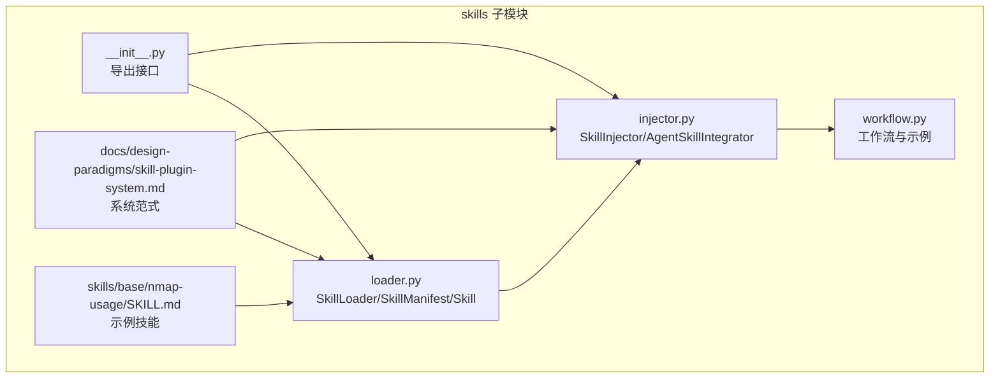
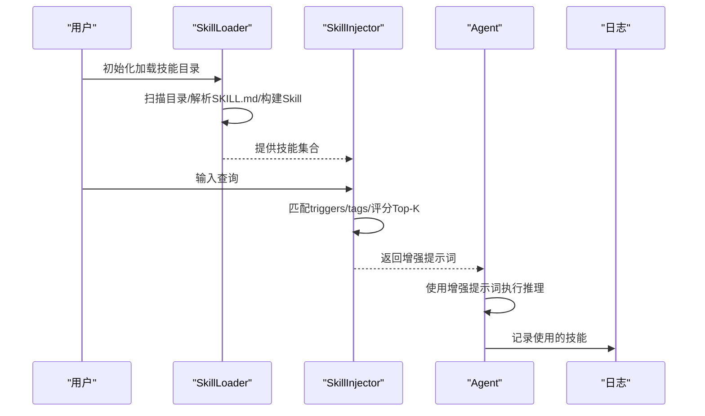
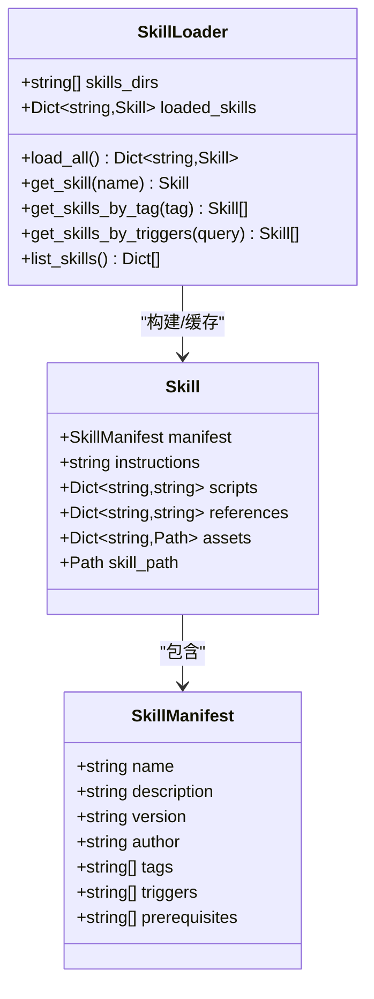
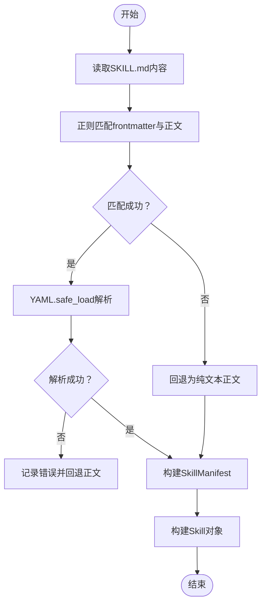
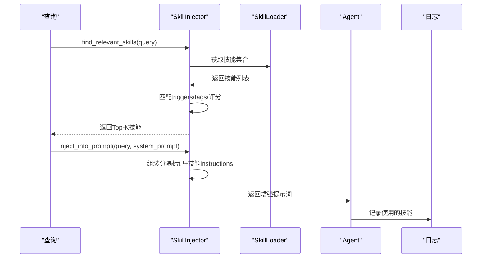
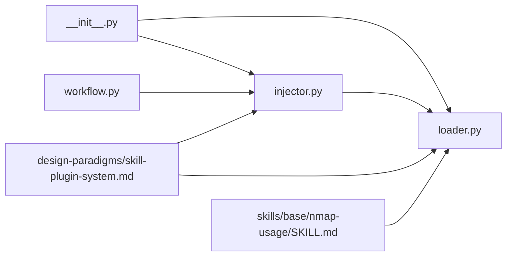

# 技能加载器

<cite>
**本文引用的文件**
- [skills/loader.py](file://skills/loader.py)
- [skills/injector.py](file://skills/injector.py)
- [skills/workflow.py](file://skills/workflow.py)
- [skills/__init__.py](file://skills/__init__.py)
- [docs/design-paradigms/skill-plugin-system.md](file://docs/design-paradigms/skill-plugin-system.md)
- [skills/base/nmap-usage/SKILL.md](file://skills/base/nmap-usage/SKILL.md)
</cite>

## 目录
1. [简介](#简介)
2. [项目结构](#项目结构)
3. [核心组件](#核心组件)
4. [架构总览](#架构总览)
5. [详细组件分析](#详细组件分析)
6. [依赖关系分析](#依赖关系分析)
7. [性能考量](#性能考量)
8. [故障排查指南](#故障排查指南)
9. [结论](#结论)
10. [附录](#附录)

## 简介
本文件面向Secbot的“技能加载器”组件，系统性阐述SkillLoader类的实现机制与数据模型，覆盖以下关键点：
- 技能文件扫描与发现算法
- SKILL.md的YAML frontmatter解析与验证
- Markdown正文分离与指令提取
- SkillManifest与Skill的数据结构设计及字段语义
- 技能目录结构规范与文件组织
- 错误处理与日志策略
- 性能优化建议与最佳实践

## 项目结构
技能加载器位于skills子模块，核心文件包括：
- loader.py：定义Skill、SkillManifest数据类与SkillLoader加载器
- injector.py：提供SkillInjector与AgentSkillIntegrator，负责技能检索与注入
- workflow.py：给出技能系统的工作流与使用示例
- __init__.py：导出公开API
- docs/design-paradigms/skill-plugin-system.md：系统范式与约定
- skills/base/nmap-usage/SKILL.md：示例技能文件

图表来源
- [skills/loader.py](file://skills/loader.py#L1-L182)
- [skills/injector.py](file://skills/injector.py#L1-L141)
- [skills/workflow.py](file://skills/workflow.py#L1-L86)
- [skills/__init__.py](file://skills/__init__.py#L1-L18)
- [docs/design-paradigms/skill-plugin-system.md](file://docs/design-paradigms/skill-plugin-system.md#L1-L42)
- [skills/base/nmap-usage/SKILL.md](file://skills/base/nmap-usage/SKILL.md#L1-L102)

章节来源
- [skills/loader.py](file://skills/loader.py#L1-L182)
- [skills/injector.py](file://skills/injector.py#L1-L141)
- [skills/workflow.py](file://skills/workflow.py#L1-L86)
- [skills/__init__.py](file://skills/__init__.py#L1-L18)
- [docs/design-paradigms/skill-plugin-system.md](file://docs/design-paradigms/skill-plugin-system.md#L1-L42)
- [skills/base/nmap-usage/SKILL.md](file://skills/base/nmap-usage/SKILL.md#L1-L102)

## 核心组件
- SkillManifest：描述技能清单，包含name、description、version、author、tags、triggers、prerequisites等字段
- Skill：描述技能单元，包含manifest、instructions以及可选的scripts、references、assets
- SkillLoader：负责扫描技能目录、解析SKILL.md、构建Skill对象并缓存
- SkillInjector：根据用户查询匹配技能，将相关技能注入到系统提示词
- AgentSkillIntegrator：将技能系统集成到Agent生命周期中，提供before/after钩子

章节来源
- [skills/loader.py](file://skills/loader.py#L14-L37)
- [skills/injector.py](file://skills/injector.py#L12-L141)

## 架构总览
技能系统的运行流程分为“初始化加载—查询匹配—提示词注入—Agent执行—后处理记录”五个阶段，整体架构如下：

图表来源
- [skills/loader.py](file://skills/loader.py#L129-L145)
- [skills/injector.py](file://skills/injector.py#L20-L40)
- [skills/injector.py](file://skills/injector.py#L42-L69)
- [skills/workflow.py](file://skills/workflow.py#L6-L28)

## 详细组件分析

### SkillLoader：技能加载器
- 职责
  - 扫描多个技能根目录，遍历每个子目录，定位SKILL.md
  - 解析YAML frontmatter为字典，分离Markdown正文为instructions
  - 可选扫描scripts/references/assets目录，将内容或路径存入Skill
  - 缓存为name->Skill字典，提供按名称、标签、触发词查询与概览列表
- 关键算法
  - 正则匹配frontmatter与正文：使用多行/单行匹配，确保跨平台换行兼容
  - YAML解析：异常捕获，失败时回退为纯文本正文
  - 目录扫描：glob遍历scripts/references/assets，读取文件内容或保存路径
  - 缓存策略：首次加载后常驻内存，减少重复IO
- 数据结构
  - SkillManifest：name、description、version、author、tags、triggers、prerequisites
  - Skill：manifest、instructions、scripts、references、assets、skill_path

图表来源
- [skills/loader.py](file://skills/loader.py#L14-L37)
- [skills/loader.py](file://skills/loader.py#L39-L182)

章节来源
- [skills/loader.py](file://skills/loader.py#L39-L182)

### SKILL.md解析流程与验证
- frontmatter解析
  - 使用正则一次性切分YAML frontmatter与正文
  - YAML.safe_load解析失败时记录错误并回退为纯文本正文
- 字段默认值与回退
  - 当frontmatter缺失时，自动以目录名为name，正文前200字符为description
- 正文分离
  - instructions为frontmatter之后的Markdown正文，直接拼接到系统提示词或上下文

图表来源
- [skills/loader.py](file://skills/loader.py#L53-L65)
- [skills/loader.py](file://skills/loader.py#L74-L94)

章节来源
- [skills/loader.py](file://skills/loader.py#L53-L94)

### Skill与SkillManifest字段语义与验证规则
- name
  - 必填且唯一，作为缓存键；若frontmatter缺失，回退为目录名
- description
  - 必填；用于匹配与注入时的描述文本；缺失时回退为正文片段
- version
  - 默认"1.0.0"；建议遵循语义化版本
- author
  - 可选；用于归属标识
- tags
  - 可选；用于按标签检索；匹配时忽略大小写
- triggers
  - 可选；用于按触发词检索；匹配时忽略大小写；权重高于tag
- prerequisites
  - 可选；用于前置条件检查（由上层逻辑使用）

章节来源
- [skills/loader.py](file://skills/loader.py#L14-L37)
- [skills/loader.py](file://skills/loader.py#L78-L94)
- [docs/design-paradigms/skill-plugin-system.md](file://docs/design-paradigms/skill-plugin-system.md#L11-L15)

### 技能目录结构规范
- 目录约定
  - 每个技能一个目录，至少包含SKILL.md
  - 可选目录：scripts/（脚本）、references/（参考文档）、assets/（资源）
- SKILL.md格式
  - YAML frontmatter + Markdown正文
  - frontmatter字段建议：name、description（必填）、version、author、tags、triggers、prerequisites
- scripts目录
  - 放置可执行脚本，文件名即键，文件内容即值
- references目录
  - 放置参考文档，文件名即键，文件内容即值
- assets目录
  - 放置二进制或静态资源，文件名即键，文件路径即值

章节来源
- [docs/design-paradigms/skill-plugin-system.md](file://docs/design-paradigms/skill-plugin-system.md#L5-L9)
- [docs/design-paradigms/skill-plugin-system.md](file://docs/design-paradigms/skill-plugin-system.md#L11-L15)
- [skills/loader.py](file://skills/loader.py#L42-L45)
- [skills/loader.py](file://skills/loader.py#L100-L120)
- [skills/base/nmap-usage/SKILL.md](file://skills/base/nmap-usage/SKILL.md#L1-L12)

### SkillInjector与AgentSkillIntegrator：按需注入
- 匹配策略
  - 触发词权重高于标签；Top-K返回（当前实现为Top-3）
- 注入位置
  - 在调用LLM前，将技能instructions拼接到系统提示词末尾，或作为独立“技能上下文”块
  - 使用明确分隔标记，避免与主提示混淆
- 生命周期
  - before_process：注入增强提示词并记录本次使用的技能
  - after_process：可选记录使用的技能名称
- 与Agent集成
  - 通过函数扩展Agent，不侵入核心process逻辑

图表来源
- [skills/injector.py](file://skills/injector.py#L20-L40)
- [skills/injector.py](file://skills/injector.py#L42-L69)
- [skills/injector.py](file://skills/injector.py#L86-L114)
- [skills/workflow.py](file://skills/workflow.py#L6-L28)

章节来源
- [skills/injector.py](file://skills/injector.py#L12-L141)
- [skills/workflow.py](file://skills/workflow.py#L1-L86)

## 依赖关系分析
- 模块导出
  - skills/__init__.py统一导出Skill、SkillManifest、SkillLoader、SkillInjector、AgentSkillIntegrator、integrate_skills_with_agent
- 组件耦合
  - SkillLoader与SkillInjector双向协作：Loader提供技能集合，Injector消费并匹配
  - AgentSkillIntegrator封装SkillInjector，提供Agent生命周期钩子
- 外部依赖
  - 正则表达式用于frontmatter解析
  - YAML库用于frontmatter解析
  - loguru用于日志记录

图表来源
- [skills/__init__.py](file://skills/__init__.py#L7-L17)
- [skills/injector.py](file://skills/injector.py#L9)
- [skills/loader.py](file://skills/loader.py#L1-L12)
- [docs/design-paradigms/skill-plugin-system.md](file://docs/design-paradigms/skill-plugin-system.md#L1-L42)
- [skills/base/nmap-usage/SKILL.md](file://skills/base/nmap-usage/SKILL.md#L1-L12)

章节来源
- [skills/__init__.py](file://skills/__init__.py#L1-L18)
- [skills/injector.py](file://skills/injector.py#L9)
- [skills/loader.py](file://skills/loader.py#L1-L12)

## 性能考量
- IO与缓存
  - 加载器在初始化阶段一次性扫描并缓存技能，后续查询无需重复IO
  - 建议在应用启动时预热加载器，避免首次请求延迟
- 正则与YAML解析
  - frontmatter解析采用一次正则匹配，复杂度线性于文件长度
  - YAML解析失败时快速回退，避免阻塞
- 匹配效率
  - 当前匹配为线性扫描，适合中小规模技能集
  - 若技能数量增长，可考虑建立倒排索引（triggers/tags）以提升查询性能
- 内容读取
  - scripts/references按需读取为字符串，assets仅保存路径，降低内存占用
- 并发与异步
  - 当前为同步实现；如需高并发场景，可考虑异步读取与缓存更新策略

## 故障排查指南
- frontmatter解析失败
  - 现象：日志出现“解析 frontmatter 失败”并回退为正文
  - 排查：检查SKILL.md的YAML语法是否正确，frontmatter是否以三横线包裹
- 技能文件缺失
  - 现象：日志警告“技能文件不存在”
  - 排查：确认技能目录结构与SKILL.md路径
- 加载异常
  - 现象：日志出现“加载技能失败”
  - 排查：检查编码（UTF-8）、文件权限、磁盘空间
- 匹配不到技能
  - 现象：注入后提示词未变化
  - 排查：确认triggers/tags是否合理，查询是否包含触发词或标签
- 日志级别
  - 控制台在初始化阶段可能降级，交互开始后恢复；可通过日志配置调整

章节来源
- [skills/loader.py](file://skills/loader.py#L62-L64)
- [skills/loader.py](file://skills/loader.py#L71)
- [skills/loader.py](file://skills/loader.py#L125-L127)
- [skills/injector.py](file://skills/injector.py#L18)
- [utils/logger.py](file://utils/logger.py#L1-L42)

## 结论
SkillLoader与SkillInjector共同构成了Secbot的技能系统：前者负责稳定、高效的技能加载与缓存，后者负责基于查询的按需注入。通过清晰的目录约定、严格的frontmatter解析与完善的日志策略，系统实现了可扩展、可维护、易集成的技能管理能力。建议在生产环境中结合倒排索引与异步加载进一步优化性能，并完善前置条件校验与权限控制。

## 附录
- 示例技能文件：skills/base/nmap-usage/SKILL.md
- 系统范式文档：docs/design-paradigms/skill-plugin-system.md
- 导出接口：skills/__init__.py