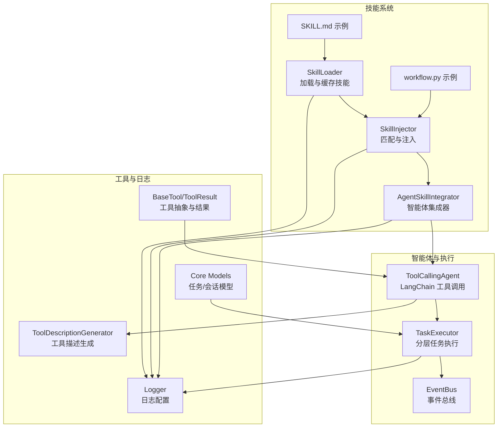
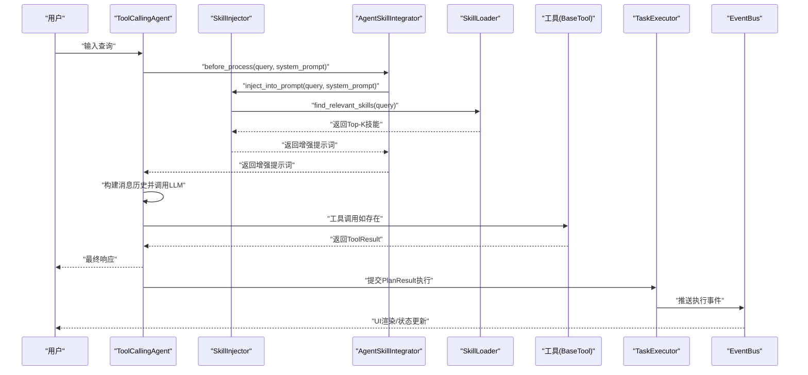
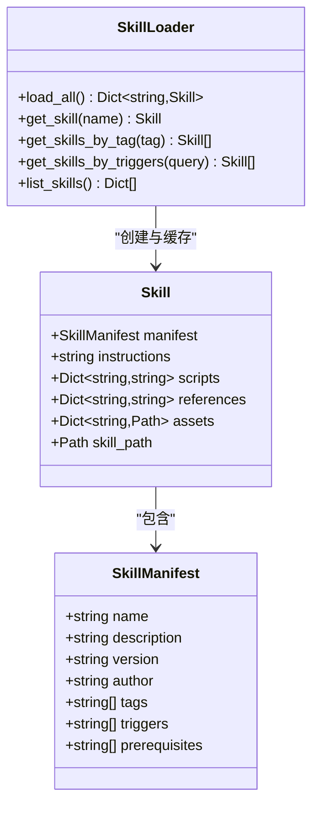
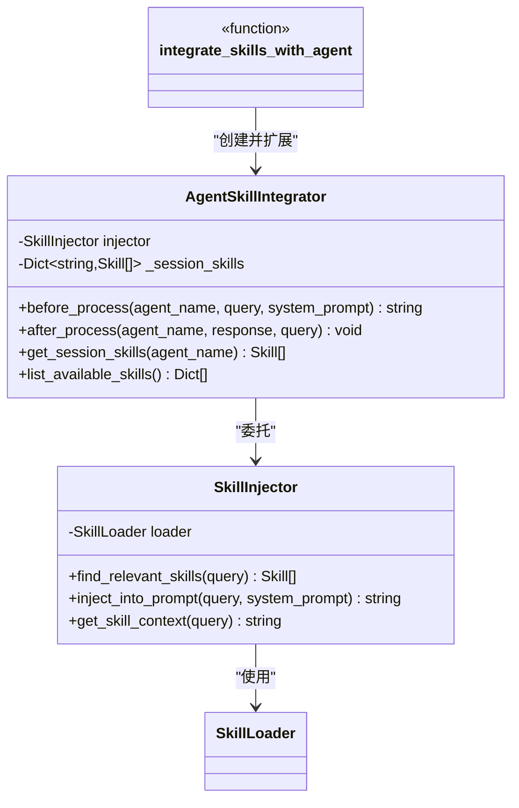
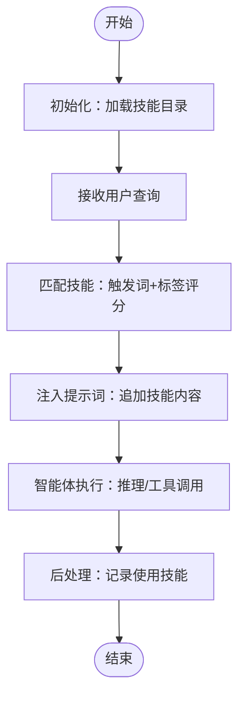
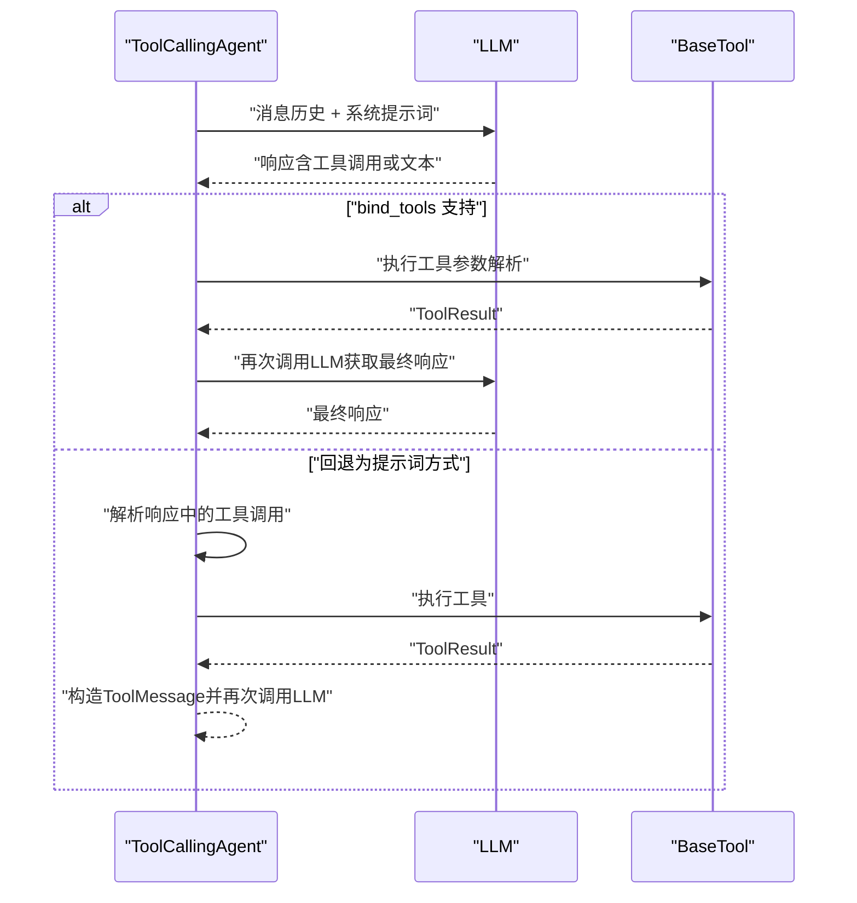
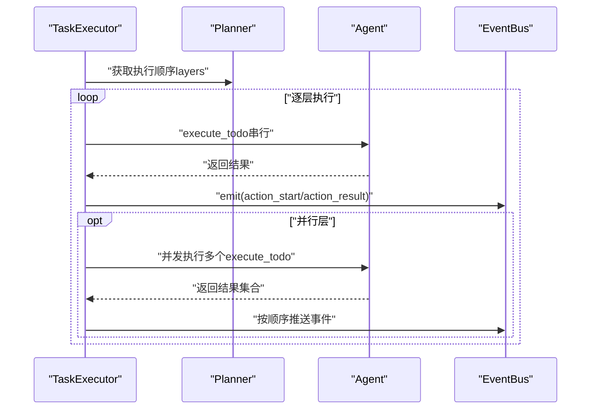
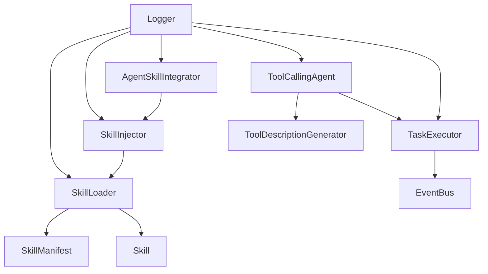

# 技能工作流程

<cite>
**本文引用的文件**
- [skills/__init__.py](file://skills/__init__.py)
- [skills/loader.py](file://skills/loader.py)
- [skills/injector.py](file://skills/injector.py)
- [skills/workflow.py](file://skills/workflow.py)
- [skills/base/nmap-usage/SKILL.md](file://skills/base/nmap-usage/SKILL.md)
- [core/agents/base.py](file://core/agents/base.py)
- [core/agents/tool_calling_agent.py](file://core/agents/tool_calling_agent.py)
- [core/executor.py](file://core/executor.py)
- [utils/event_bus.py](file://utils/event_bus.py)
- [utils/logger.py](file://utils/logger.py)
- [utils/tool_caller.py](file://utils/tool_caller.py)
- [tools/base.py](file://tools/base.py)
- [core/models.py](file://core/models.py)
- [docs/design-paradigms/skill-plugin-system.md](file://docs/design-paradigms/skill-plugin-system.md)
</cite>

## 目录
1. [引言](#引言)
2. [项目结构](#项目结构)
3. [核心组件](#核心组件)
4. [架构总览](#架构总览)
5. [详细组件分析](#详细组件分析)
6. [依赖分析](#依赖分析)
7. [性能考虑](#性能考虑)
8. [故障排查指南](#故障排查指南)
9. [结论](#结论)
10. [附录](#附录)

## 引言
本文件围绕 Secbot 的“技能工作流程”组件，系统化阐述技能生命周期管理（注册、激活、执行、停用）、技能使用记录追踪、与智能体系统的集成机制、效果评估体系、版本与兼容性管理以及维护最佳实践。文档以代码为依据，结合可视化图示帮助读者快速理解并落地实施。

## 项目结构
技能工作流程主要分布在 skills 子模块，并与智能体、工具、事件总线等核心模块协同工作。关键文件与职责如下：
- skills/loader.py：技能清单解析、技能加载与缓存、按标签/触发词检索
- skills/injector.py：技能匹配与注入、与智能体生命周期钩子集成
- skills/workflow.py：技能工作流示例与调用演示
- skills/base/nmap-usage/SKILL.md：技能示例（Markdown + YAML frontmatter）
- core/agents/tool_calling_agent.py：LangChain 工具调用智能体，承载工具执行与结果处理
- core/executor.py：分层任务执行器，负责按计划分层串并行执行
- utils/event_bus.py：事件总线，支撑 UI 与 Agent 的解耦通信
- utils/logger.py：统一日志配置
- utils/tool_caller.py：工具描述生成器，辅助智能体系统提示词增强
- tools/base.py：工具抽象与结果模型
- core/models.py：任务与会话数据模型
- docs/design-paradigms/skill-plugin-system.md：设计范式文档，说明技能目录约定、注入策略与与智能体集成方式

图表来源
- [skills/loader.py](file://skills/loader.py#L39-L182)
- [skills/injector.py](file://skills/injector.py#L12-L141)
- [skills/workflow.py](file://skills/workflow.py#L1-L86)
- [skills/base/nmap-usage/SKILL.md](file://skills/base/nmap-usage/SKILL.md#L1-L102)
- [core/agents/tool_calling_agent.py](file://core/agents/tool_calling_agent.py#L75-L506)
- [core/executor.py](file://core/executor.py#L17-L179)
- [utils/event_bus.py](file://utils/event_bus.py#L68-L187)
- [utils/tool_caller.py](file://utils/tool_caller.py#L10-L119)
- [tools/base.py](file://tools/base.py#L9-L36)
- [core/models.py](file://core/models.py#L23-L137)

章节来源
- [skills/__init__.py](file://skills/__init__.py#L1-L18)
- [skills/loader.py](file://skills/loader.py#L39-L182)
- [skills/injector.py](file://skills/injector.py#L12-L141)
- [skills/workflow.py](file://skills/workflow.py#L1-L86)
- [skills/base/nmap-usage/SKILL.md](file://skills/base/nmap-usage/SKILL.md#L1-L102)
- [core/agents/tool_calling_agent.py](file://core/agents/tool_calling_agent.py#L75-L506)
- [core/executor.py](file://core/executor.py#L17-L179)
- [utils/event_bus.py](file://utils/event_bus.py#L68-L187)
- [utils/tool_caller.py](file://utils/tool_caller.py#L10-L119)
- [tools/base.py](file://tools/base.py#L9-L36)
- [core/models.py](file://core/models.py#L23-L137)
- [docs/design-paradigms/skill-plugin-system.md](file://docs/design-paradigms/skill-plugin-system.md#L1-L42)

## 核心组件
- 技能清单与加载
  - SkillManifest：封装技能清单（名称、描述、版本、作者、标签、触发词、前置条件等）
  - Skill：封装技能实体（清单 + 指令正文 + 可选脚本/参考/资源）
  - SkillLoader：扫描技能目录、解析 SKILL.md（frontmatter + instructions）、缓存技能、按名称/标签/触发词检索
- 技能注入与集成
  - SkillInjector：根据查询匹配技能（触发词+标签加权），注入到系统提示词或上下文
  - AgentSkillIntegrator：在智能体生命周期钩子中自动注入与记录使用情况
  - integrate_skills_with_agent：为现有智能体扩展技能能力（函数扩展，不侵入核心逻辑）
- 工作流示例
  - workflow.py：展示初始化、查询匹配、提示词注入、Agent 执行、后处理的完整流程
- 智能体与工具
  - ToolCallingAgent：LangChain 工具调用智能体，支持多厂商推理后端，工具绑定与回退策略
  - TaskExecutor：按计划分层执行（串行/并行），事件推送，支持线性流式渲染
  - EventBus：事件总线，支持同步/异步订阅与发射
  - ToolDescriptionGenerator：生成工具描述，增强系统提示词
  - BaseTool/ToolResult：工具抽象与结果模型
- 日志与模型
  - Logger：统一日志配置与级别控制
  - Core Models：任务、会话、消息等数据模型

章节来源
- [skills/loader.py](file://skills/loader.py#L14-L182)
- [skills/injector.py](file://skills/injector.py#L12-L141)
- [skills/workflow.py](file://skills/workflow.py#L1-L86)
- [core/agents/tool_calling_agent.py](file://core/agents/tool_calling_agent.py#L75-L506)
- [core/executor.py](file://core/executor.py#L17-L179)
- [utils/event_bus.py](file://utils/event_bus.py#L68-L187)
- [utils/tool_caller.py](file://utils/tool_caller.py#L10-L119)
- [tools/base.py](file://tools/base.py#L9-L36)
- [utils/logger.py](file://utils/logger.py#L1-L51)
- [core/models.py](file://core/models.py#L23-L137)

## 架构总览
技能工作流程在“智能体处理链路”中扮演“上下文增强”的角色：在推理前将相关技能注入系统提示词或上下文，使智能体具备针对任务的“专用知识”。工具调用智能体负责执行具体工具，任务执行器负责按计划分层调度，事件总线负责 UI 渲染与状态反馈。

图表来源
- [skills/injector.py](file://skills/injector.py#L93-L98)
- [skills/injector.py](file://skills/injector.py#L42-L69)
- [skills/loader.py](file://skills/loader.py#L157-L168)
- [core/agents/tool_calling_agent.py](file://core/agents/tool_calling_agent.py#L271-L506)
- [core/executor.py](file://core/executor.py#L46-L134)
- [utils/event_bus.py](file://utils/event_bus.py#L121-L182)

## 详细组件分析

### 组件A：技能加载与清单（SkillLoader/SkillManifest/Skill）
- 设计要点
  - 采用“目录 + SKILL.md（YAML frontmatter + Markdown 正文）”的约定，frontmatter 解析为 SkillManifest，正文作为 instructions
  - 支持可选目录：scripts/references/assets，用于存放脚本、参考与资源
  - 缓存策略：一次性加载并以 name 为键缓存，提供按名称/标签/触发词检索接口
- 关键复杂度
  - 加载：O(N)（N 为技能目录数），解析 frontmatter 为 O(M)（M 为文件大小）
  - 检索：按标签/触发词线性扫描，平均 O(K)（K 为已加载技能数）

图表来源
- [skills/loader.py](file://skills/loader.py#L14-L182)

章节来源
- [skills/loader.py](file://skills/loader.py#L39-L182)

### 组件B：技能注入与智能体集成（SkillInjector/AgentSkillIntegrator）
- 设计要点
  - SkillInjector：对查询进行触发词与标签匹配，计算加权得分，返回 Top-K 技能；支持注入到系统提示词或生成技能上下文
  - AgentSkillIntegrator：在智能体生命周期钩子 before_process 与 after_process 中分别注入与记录使用技能；提供会话级技能缓存与可用技能列表
  - integrate_skills_with_agent：通过函数扩展的方式为现有智能体注入技能能力，无需修改基类
- 关键复杂度
  - 匹配：对每个技能扫描触发词/标签，整体 O(Q×K)，Q 为查询词数，K 为技能数

图表来源
- [skills/injector.py](file://skills/injector.py#L12-L141)

章节来源
- [skills/injector.py](file://skills/injector.py#L12-L141)

### 组件C：工作流与调用示例（workflow.py）
- 设计要点
  - 展示完整的技能工作流：初始化加载、查询匹配、提示词注入、智能体执行、后处理记录
  - 提供手动注入与集成到智能体两种使用方式的示例

图表来源
- [skills/workflow.py](file://skills/workflow.py#L6-L28)

章节来源
- [skills/workflow.py](file://skills/workflow.py#L1-L86)

### 组件D：智能体与工具调用（ToolCallingAgent）
- 设计要点
  - 支持多厂商推理后端，优先使用 bind_tools 绑定工具；若模型不支持，则回退为提示词方式解析工具调用
  - 统一提取响应内容，处理空响应与异常场景
  - 工具包装为 LangChain 工具，支持同步/异步执行
- 关键复杂度
  - 工具调用解析：JSON/正则匹配，近似 O(P)（P 为响应长度）

图表来源
- [core/agents/tool_calling_agent.py](file://core/agents/tool_calling_agent.py#L271-L506)

章节来源
- [core/agents/tool_calling_agent.py](file://core/agents/tool_calling_agent.py#L75-L506)

### 组件E：分层任务执行与事件总线（TaskExecutor/EventBus）
- 设计要点
  - TaskExecutor：按计划分层执行（串行层与并行层），并发使用 gather，完成后按顺序推送事件
  - EventBus：支持同步/异步事件订阅与发射，提供多种事件类型（规划、推理、执行、报告、交互控制等）
- 关键复杂度
  - 并行层：O(M) 并发任务，M 为层内任务数；事件推送为 O(M)

图表来源
- [core/executor.py](file://core/executor.py#L46-L134)
- [utils/event_bus.py](file://utils/event_bus.py#L68-L187)

章节来源
- [core/executor.py](file://core/executor.py#L17-L179)
- [utils/event_bus.py](file://utils/event_bus.py#L68-L187)

### 组件F：工具描述与日志（ToolDescriptionGenerator/Logger）
- 设计要点
  - ToolDescriptionGenerator：生成工具描述文本，增强系统提示词，提升工具调用准确性
  - Logger：统一日志输出，支持控制台与文件双通道，初始化阶段静默控制台日志

章节来源
- [utils/tool_caller.py](file://utils/tool_caller.py#L10-L119)
- [utils/logger.py](file://utils/logger.py#L1-L51)

## 依赖分析
- 组件耦合与内聚
  - SkillLoader 与 SkillInjector 高内聚，通过 SkillManifest/Skill 解耦技能清单与使用逻辑
  - AgentSkillIntegrator 与 SkillInjector 解耦，通过 before/after 钩子接入智能体生命周期
  - ToolCallingAgent 与 TaskExecutor 通过 EventBus 解耦，事件驱动 UI 渲染
- 外部依赖
  - LangChain 工具绑定与消息模型
  - Loguru 日志框架
  - YAML 解析与正则匹配

图表来源
- [skills/loader.py](file://skills/loader.py#L39-L182)
- [skills/injector.py](file://skills/injector.py#L12-L141)
- [utils/tool_caller.py](file://utils/tool_caller.py#L10-L119)
- [core/executor.py](file://core/executor.py#L17-L179)
- [utils/event_bus.py](file://utils/event_bus.py#L68-L187)
- [utils/logger.py](file://utils/logger.py#L1-L51)

章节来源
- [skills/loader.py](file://skills/loader.py#L39-L182)
- [skills/injector.py](file://skills/injector.py#L12-L141)
- [utils/tool_caller.py](file://utils/tool_caller.py#L10-L119)
- [core/executor.py](file://core/executor.py#L17-L179)
- [utils/event_bus.py](file://utils/event_bus.py#L68-L187)
- [utils/logger.py](file://utils/logger.py#L1-L51)

## 性能考虑
- 技能加载与缓存
  - 建议在应用启动时一次性加载技能并缓存，避免重复 IO；对大型技能库可考虑懒加载或增量刷新策略
- 匹配与注入
  - 匹配算法为线性扫描，可通过预构建倒排索引（触发词->技能集）降低查询复杂度
  - 注入提示词时注意长度限制，必要时裁剪或分块
- 工具调用与执行
  - 并行层并发执行可显著缩短总耗时；注意工具执行的幂等性与资源竞争
  - 事件推送按顺序进行，确保 UI 渲染一致性
- 日志与可观测性
  - 控制台日志在初始化阶段降噪，生产环境开启详细日志；对高频事件采用采样策略

## 故障排查指南
- 技能加载失败
  - 检查 SKILL.md frontmatter 是否为合法 YAML；确认技能目录权限与编码
  - 关注加载器错误日志，定位具体技能路径
- 技能未注入
  - 确认查询中包含触发词或标签；检查 SkillInjector 的匹配逻辑与 Top-K 数量
  - 验证集成钩子是否正确挂载（before_process）
- 工具调用失败
  - 检查工具是否存在且名称匹配；查看工具参数解析与 JSON/正则匹配结果
  - 若模型不支持工具绑定，确认回退逻辑是否生效
- 执行异常
  - TaskExecutor 对并发异常进行捕获并记录；检查异常堆栈与工具返回的 ToolResult
- 事件未推送
  - 确认 EventBus 订阅者是否正确注册；检查事件类型与迭代序号

章节来源
- [skills/loader.py](file://skills/loader.py#L125-L127)
- [skills/injector.py](file://skills/injector.py#L20-L40)
- [core/agents/tool_calling_agent.py](file://core/agents/tool_calling_agent.py#L295-L313)
- [core/executor.py](file://core/executor.py#L90-L101)
- [utils/event_bus.py](file://utils/event_bus.py#L121-L156)

## 结论
技能工作流程通过“清单化 + 按需注入”的方式，将领域知识无缝融入智能体推理过程，配合工具调用与分层执行，形成从“意图识别—上下文增强—工具执行—结果反馈”的闭环。通过事件总线与日志体系，系统实现了良好的可观测性与可维护性。建议在实践中持续完善技能版本管理、兼容性检查与效果评估，以保障长期稳定运行。

## 附录

### 技能使用记录追踪与评估
- 执行次数统计
  - 在 AgentSkillIntegrator.after_process 中记录会话使用的技能名称，可用于统计 Top-N 技能
- 成功率评估
  - 结合 TaskExecutor 的执行结果与工具返回的 ToolResult.success，统计各技能的成功率
- 性能指标收集
  - 记录技能注入耗时、工具调用耗时、总响应时间；结合 EventBus 事件的时序进行分析
- 使用频率分析
  - 基于会话历史与技能使用记录，分析不同技能在不同场景下的使用频次与效果

章节来源
- [skills/injector.py](file://skills/injector.py#L100-L105)
- [core/executor.py](file://core/executor.py#L142-L179)
- [utils/event_bus.py](file://utils/event_bus.py#L161-L182)

### 技能版本管理与兼容性
- 版本字段
  - SkillManifest.version 用于标识技能版本；建议采用语义化版本
- 兼容性检查
  - 前置条件（prerequisites）用于约束技能使用环境；执行前校验授权目标与网络访问
- 升级迁移策略
  - 旧技能迁移：保留旧版本并新增版本；在集成层按版本选择最优技能
  - 兼容性回退：当新技能引入破坏性变更时，提供降级策略与过渡期

章节来源
- [skills/loader.py](file://skills/loader.py#L86-L94)
- [skills/base/nmap-usage/SKILL.md](file://skills/base/nmap-usage/SKILL.md#L7-L11)
- [docs/design-paradigms/skill-plugin-system.md](file://docs/design-paradigms/skill-plugin-system.md#L11-L28)

### 维护最佳实践
- 目录与命名
  - 严格遵循“技能目录 + SKILL.md + 可选 scripts/references/assets”
- 清单字段
  - 必填：name、description；建议：version、tags、triggers、prerequisites
- 注入策略
  - 明确分隔标记（如“=== RELEVANT SKILLS ===”）；避免与主提示混淆
- 集成方式
  - 优先使用 AgentSkillIntegrator 的钩子或 integrate_skills_with_agent 函数扩展
- 监控与日志
  - 开启详细日志；对高频事件进行采样；定期清理日志与缓存

章节来源
- [docs/design-paradigms/skill-plugin-system.md](file://docs/design-paradigms/skill-plugin-system.md#L1-L42)
- [skills/workflow.py](file://skills/workflow.py#L30-L57)