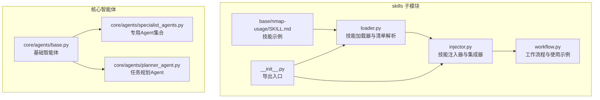
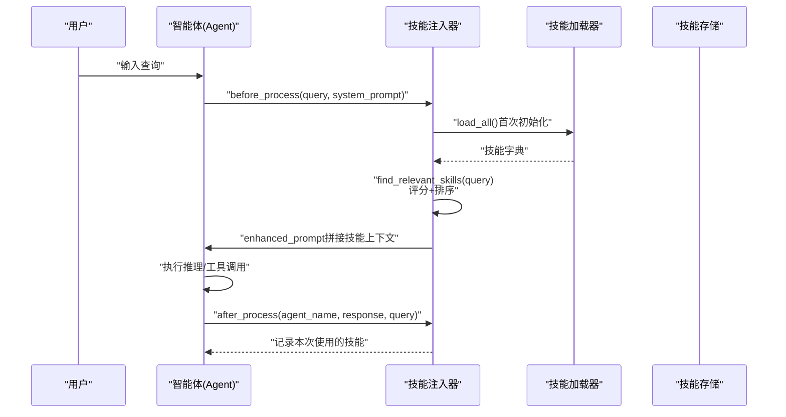
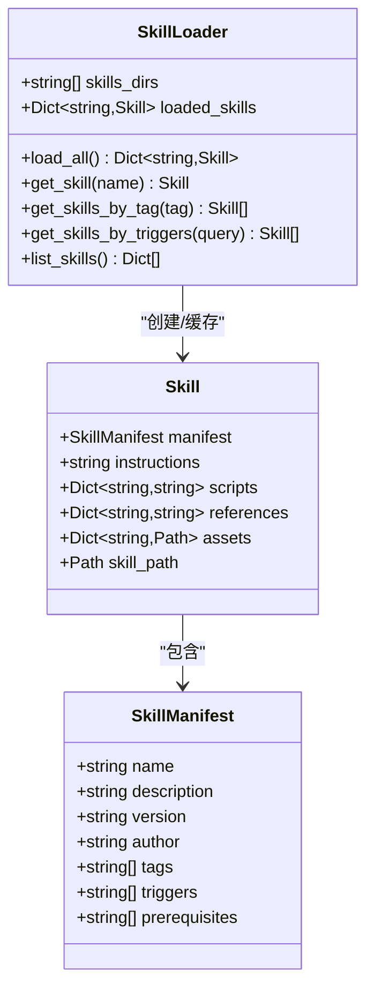
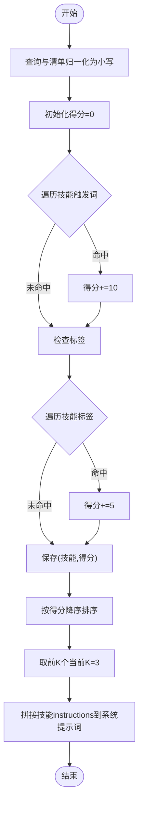
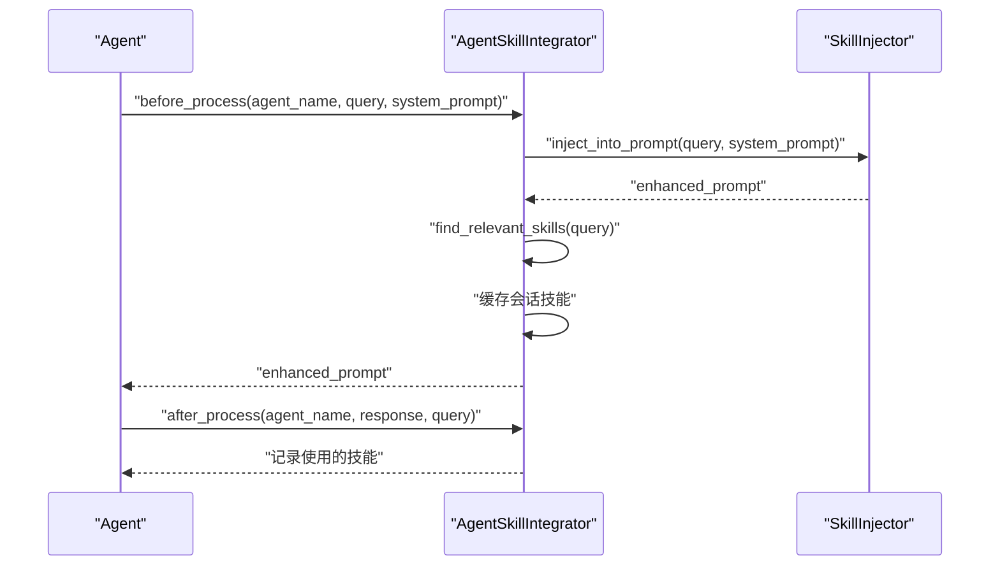
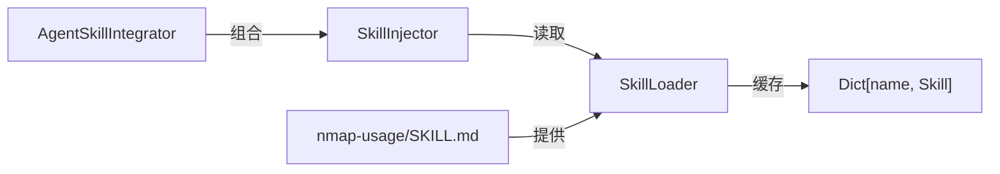

# 技能注入器

<cite>
**本文档引用的文件**
- [skills/injector.py](file://skills/injector.py)
- [skills/loader.py](file://skills/loader.py)
- [skills/__init__.py](file://skills/__init__.py)
- [skills/workflow.py](file://skills/workflow.py)
- [skills/base/nmap-usage/SKILL.md](file://skills/base/nmap-usage/SKILL.md)
- [docs/design-paradigms/skill-plugin-system.md](file://docs/design-paradigms/skill-plugin-system.md)
- [core/agents/base.py](file://core/agents/base.py)
- [core/agents/specialist_agents.py](file://core/agents/specialist_agents.py)
- [core/agents/planner_agent.py](file://core/agents/planner_agent.py)
</cite>

## 目录
1. [简介](#简介)
2. [项目结构](#项目结构)
3. [核心组件](#核心组件)
4. [架构总览](#架构总览)
5. [组件详解](#组件详解)
6. [依赖关系分析](#依赖关系分析)
7. [性能考量](#性能考量)
8. [故障排查指南](#故障排查指南)
9. [结论](#结论)
10. [附录](#附录)

## 简介
本文件为 Secbot 技能注入器组件的深度技术文档，围绕“按需注入、按需匹配、上下文增强”的核心机制展开，系统阐述以下内容：
- 触发词匹配策略与评分排序
- 关键词提取与归一化处理
- 相似度计算与阈值设定（当前实现为精确子串匹配）
- 技能查找机制（标签过滤、触发词模糊匹配、Top-K 选取）
- 提示词增强技术（动态拼接、上下文融合、多技能协同优先级）
- 最佳实践（触发词设计、技能组合策略、性能优化、调试方法）
- 与智能体的集成接口与使用示例

## 项目结构
技能注入器位于 skills 子模块，配合技能加载器与工作流示例共同构成完整的“技能目录约定 + 清单解析 + 按需注入”体系。

**图表来源**
- [skills/loader.py](file://skills/loader.py#L1-L182)
- [skills/injector.py](file://skills/injector.py#L1-L141)
- [skills/workflow.py](file://skills/workflow.py#L1-L86)
- [skills/base/nmap-usage/SKILL.md](file://skills/base/nmap-usage/SKILL.md#L1-L102)
- [skills/__init__.py](file://skills/__init__.py#L1-L18)
- [core/agents/base.py](file://core/agents/base.py#L1-L125)
- [core/agents/specialist_agents.py](file://core/agents/specialist_agents.py#L1-L247)
- [core/agents/planner_agent.py](file://core/agents/planner_agent.py#L1-L837)

**章节来源**
- [skills/__init__.py](file://skills/__init__.py#L1-L18)
- [skills/workflow.py](file://skills/workflow.py#L1-L86)

## 核心组件
- 技能加载器：扫描技能目录，解析 SKILL.md 的 YAML frontmatter 与正文，构建 Skill 对象并缓存；提供按名称、标签、触发词的查询接口。
- 技能注入器：接收用户查询，基于触发词与标签进行评分排序，取 Top-K（当前实现为取前 3）并将技能 instructions 动态拼接到系统提示词或上下文块。
- 智能体集成器：在 Agent 生命周期的“处理前/后”钩子中自动注入技能，记录会话使用的技能，便于审计与统计。
- 技能示例：以 nmap-usage 为例，展示触发词、标签、前置条件与技能正文的组织方式。

**章节来源**
- [skills/loader.py](file://skills/loader.py#L14-L182)
- [skills/injector.py](file://skills/injector.py#L12-L141)
- [skills/base/nmap-usage/SKILL.md](file://skills/base/nmap-usage/SKILL.md#L1-L102)

## 架构总览
技能注入器与加载器解耦，通过 SkillManifest 的 triggers/tags 字段实现“关键词 in 查询”的匹配；注入器在 Agent 的系统提示词中追加“技能上下文”，避免与主提示混淆。

**图表来源**
- [skills/injector.py](file://skills/injector.py#L86-L141)
- [skills/loader.py](file://skills/loader.py#L129-L145)

## 组件详解

### 技能加载器（SkillLoader）
- 目录约定：每个技能为一个目录，包含 SKILL.md；可选 scripts/references/assets 子目录。
- 清单解析：使用正则一次性拆分 frontmatter 与正文，frontmatter 转换为 SkillManifest 字段（name/description/version/author/tags/triggers/prerequisites）。
- 缓存策略：加载后以 name 为键缓存至内存字典，提供 get_skill/name/tag/trigger 查询与 list_skills 概要。
- 归一化处理：frontmatter 解析失败时回退为默认清单；路径大小写与编码统一采用 UTF-8。

**图表来源**
- [skills/loader.py](file://skills/loader.py#L14-L182)

**章节来源**
- [skills/loader.py](file://skills/loader.py#L14-L182)
- [docs/design-paradigms/skill-plugin-system.md](file://docs/design-paradigms/skill-plugin-system.md#L5-L22)

### 技能注入器（SkillInjector）
- 触发词匹配策略：将查询与技能的 triggers/tags 做“子串包含”匹配，分别赋予不同权重（当前实现为触发词+10、标签+5）。
- 评分与排序：累计得分后按降序排序，取前 K（当前实现为 3）。
- 提示词增强：将相关技能 instructions 以“=== RELEVANT SKILLS ===”分隔块追加到系统提示词末尾；同时提供“技能上下文”字符串以便在其他位置融合。
- 归一化处理：查询与清单均转为小写后比较，确保大小写不敏感。

**图表来源**
- [skills/injector.py](file://skills/injector.py#L20-L84)

**章节来源**
- [skills/injector.py](file://skills/injector.py#L20-L84)

### 智能体集成器（AgentSkillIntegrator）
- 生命周期钩子：before_process 在调用 LLM 前注入技能；after_process 记录本次使用的技能名称。
- 会话状态：以 agent_name 为键缓存会话中使用的技能列表，便于审计与统计。
- 工厂扩展：通过函数扩展的方式为任意 Agent 注入“_enhance_prompt_with_skills”能力，无需修改基类。

**图表来源**
- [skills/injector.py](file://skills/injector.py#L86-L141)

**章节来源**
- [skills/injector.py](file://skills/injector.py#L86-L141)

### 技能示例（nmap-usage）
- 触发词与标签：示例技能定义了 triggers 与 tags，便于在查询中被匹配。
- 指令正文：技能正文为 Markdown，注入时直接拼接到系统提示词或上下文块。

**章节来源**
- [skills/base/nmap-usage/SKILL.md](file://skills/base/nmap-usage/SKILL.md#L1-L102)

### 工作流程与使用示例
- 初始化：加载 ./skills 下所有技能，解析 frontmatter 与 instructions，缓存到内存。
- 匹配：接收用户查询，提取触发词与标签，评分排序，返回 Top-K。
- 注入：将技能 instructions 追加到系统提示词末尾，形成增强提示词。
- 执行：Agent 使用增强提示词进行推理。
- 后处理：记录本次使用的技能，便于审计与统计。

**章节来源**
- [skills/workflow.py](file://skills/workflow.py#L1-L86)

## 依赖关系分析
- 组件内聚与耦合
  - SkillLoader 与 Skill 为强内聚的数据结构；SkillInjector 依赖 SkillLoader 的缓存结果，二者通过 SkillManifest 的字段进行松耦合交互。
  - AgentSkillIntegrator 与 SkillInjector 为组合关系，前者封装 Agent 生命周期钩子，后者负责具体注入逻辑。
- 外部依赖
  - 日志：使用 loguru 记录加载、匹配与注入过程。
  - 正则：frontmatter 解析使用 DOTALL 正则一次性拆分 YAML 与正文。
  - 类型：typing 提供类型提示，保证接口契约清晰。

**图表来源**
- [skills/loader.py](file://skills/loader.py#L129-L145)
- [skills/injector.py](file://skills/injector.py#L15-L18)
- [skills/base/nmap-usage/SKILL.md](file://skills/base/nmap-usage/SKILL.md#L1-L102)

**章节来源**
- [skills/injector.py](file://skills/injector.py#L1-L141)
- [skills/loader.py](file://skills/loader.py#L1-L182)

## 性能考量
- 时间复杂度
  - 初始化：加载所有技能为 O(N)，N 为技能总数；frontmatter 解析为 O(M)，M 为技能文件大小。
  - 匹配：对每个查询遍历所有技能，时间复杂度 O(N·T)，T 为平均触发词/标签数量；排序为 O(N log N)。
  - 当前 Top-K 为常数（K=3），因此整体近似 O(N·T)。
- 空间复杂度
  - 缓存技能对象与清单，空间复杂度 O(N)。
- 优化建议
  - 预热缓存：在应用启动时预加载技能，避免首次请求的冷启动开销。
  - 分片与增量：按标签/领域分片缓存，减少全量扫描；支持增量更新与失效。
  - 前缀树/倒排索引：对触发词建立索引，将匹配复杂度降至 O(T + log N)。
  - 向量化与阈值：引入嵌入相似度（见“相似度计算与阈值”建议），在大规模技能库中结合阈值剪枝。
  - 并行化：对多个查询或技能解析进行并行处理（注意线程安全与锁竞争）。

[本节为通用性能讨论，不直接分析具体文件]

## 故障排查指南
- frontmatter 解析失败
  - 现象：日志出现解析错误，返回 None。
  - 排查：确认 SKILL.md 使用三短横线包裹的 YAML frontmatter；检查编码是否为 UTF-8。
- 技能未被匹配
  - 现象：注入后系统提示词未变化。
  - 排查：核对查询是否包含技能的 triggers/tags；确认大小写不敏感匹配生效；检查技能是否成功加载（日志）。
- 注入位置异常
  - 现象：技能 instructions 未出现在预期位置。
  - 排查：确认使用的是 inject_into_prompt 或 get_skill_context；检查分隔标记是否被正确拼接。
- 集成后 Agent 未生效
  - 现象：调用 _enhance_prompt_with_skills 无效。
  - 排查：确认已通过 integrate_skills_with_agent 为 Agent 注入；检查 before_process 是否在调用 LLM 前执行。

**章节来源**
- [skills/loader.py](file://skills/loader.py#L53-L65)
- [skills/injector.py](file://skills/injector.py#L42-L84)
- [skills/injector.py](file://skills/injector.py#L121-L141)

## 结论
技能注入器通过“目录约定 + 清单解析 + 按需注入”的模式，实现了与 Agent 的解耦集成与高效的技能增强。当前实现以触发词与标签的子串匹配为基础，具备良好的可维护性与可扩展性。建议在大规模场景中引入向量化相似度与索引优化，以进一步提升匹配效率与准确性。

[本节为总结性内容，不直接分析具体文件]

## 附录

### 相似度计算与阈值设定（建议方案）
- 当前实现：关键词子串匹配（触发词+10、标签+5），Top-K=3。
- 建议方案：
  - 文本向量化：对查询与技能 instructions 计算嵌入向量，使用余弦相似度。
  - 阈值设定：根据业务场景设置相似度阈值（如 0.7），仅注入高于阈值的技能。
  - 多路召回：触发词/标签召回 + 语义相似度召回，合并去重后按分数排序。
  - 动态权重：结合技能热度、时效性、领域相关性调整最终分数。

[本节为概念性建议，不直接映射到具体源码]

### 触发词设计原则
- 唯一性与代表性：触发词应能准确代表技能核心意图，避免歧义。
- 覆盖性：覆盖用户常用表达与变体，必要时提供同义词集合。
- 粒度适中：过细导致匹配成本上升，过粗导致误匹配增多。

[本节为通用设计建议]

### 技能组合策略
- 优先级：按风险等级、资源占用、依赖关系排序；高风险步骤在同一资源上串行。
- 上下文融合：将多个技能 instructions 按主题分组，避免信息冗余与冲突。
- 会话追踪：记录每轮使用的技能，便于回放与审计。

[本节为通用策略建议]

### 与智能体的集成接口
- 工厂函数：integrate_skills_with_agent(agent, skill_dirs) 为 Agent 注入 _enhance_prompt_with_skills 与 _skill_integrator。
- 生命周期钩子：Agent 在 before_process 中调用注入，在 after_process 中记录使用情况。
- 系统提示词增强：inject_into_prompt(query, system_prompt) 返回增强后的提示词。

**章节来源**
- [skills/injector.py](file://skills/injector.py#L121-L141)
- [core/agents/base.py](file://core/agents/base.py#L17-L125)
- [core/agents/specialist_agents.py](file://core/agents/specialist_agents.py#L32-L247)
- [core/agents/planner_agent.py](file://core/agents/planner_agent.py#L20-L837)