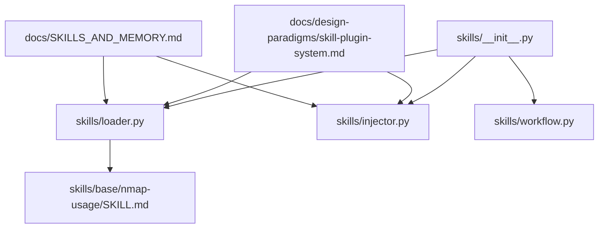
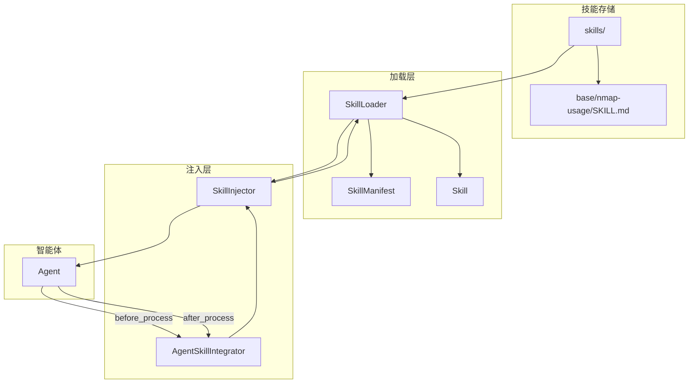
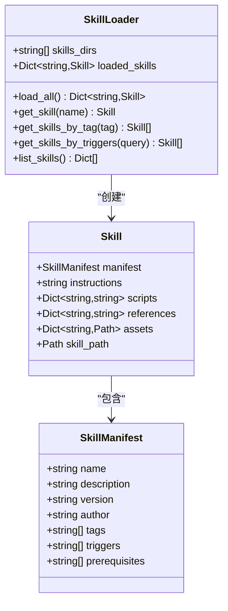
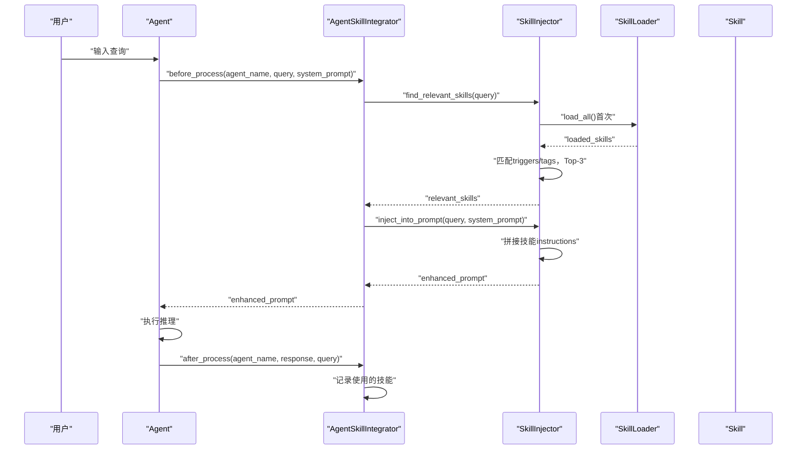
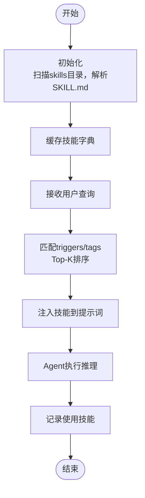
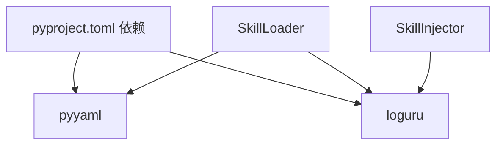

# 技能管理系统

<cite>
**本文引用的文件列表**
- [skills/__init__.py](file://skills/__init__.py)
- [skills/loader.py](file://skills/loader.py)
- [skills/injector.py](file://skills/injector.py)
- [skills/workflow.py](file://skills/workflow.py)
- [skills/base/nmap-usage/SKILL.md](file://skills/base/nmap-usage/SKILL.md)
- [docs/design-paradigms/skill-plugin-system.md](file://docs/design-paradigms/skill-plugin-system.md)
- [docs/SKILLS_AND_MEMORY.md](file://docs/SKILLS_AND_MEMORY.md)
- [pyproject.toml](file://pyproject.toml)
</cite>

## 目录
1. [简介](#简介)
2. [项目结构](#项目结构)
3. [核心组件](#核心组件)
4. [架构总览](#架构总览)
5. [组件详解](#组件详解)
6. [依赖关系分析](#依赖关系分析)
7. [性能与可扩展性](#性能与可扩展性)
8. [故障排查指南](#故障排查指南)
9. [结论](#结论)
10. [附录](#附录)

## 简介
本文件面向Secbot的“技能管理系统”，系统性阐述技能加载器、技能数据模型、技能注入器以及与智能体的集成机制。重点覆盖：
- SkillLoader类的设计与实现：目录扫描、Markdown frontmatter解析、YAML清单提取、资源文件组织与缓存。
- 技能数据模型：SkillManifest清单结构、Skill技能单元属性与文件组织规范。
- 技能注入器：触发词匹配算法、相关技能查找策略、Top-K选择、提示词增强与上下文注入。
- 工作流程：技能生命周期管理、使用记录追踪、效果评估与智能体集成。
- 开发与扩展：新技能创建规范、Markdown格式要求、脚本与资源文件组织、最佳实践与性能优化建议。

## 项目结构
技能系统位于skills目录，核心文件包括：
- loader.py：技能加载器与数据模型定义
- injector.py：技能注入器与智能体集成器
- workflow.py：工作流示例与使用说明
- base/nmap-usage/SKILL.md：示例技能清单与说明
- docs/design-paradigms/skill-plugin-system.md：设计范式与约定
- docs/SKILLS_AND_MEMORY.md：技能与记忆系统的整合说明

图表来源
- [skills/__init__.py](file://skills/__init__.py#L1-L18)
- [skills/loader.py](file://skills/loader.py#L1-L182)
- [skills/injector.py](file://skills/injector.py#L1-L141)
- [skills/workflow.py](file://skills/workflow.py#L1-L86)
- [skills/base/nmap-usage/SKILL.md](file://skills/base/nmap-usage/SKILL.md#L1-L102)
- [docs/design-paradigms/skill-plugin-system.md](file://docs/design-paradigms/skill-plugin-system.md#L1-L42)
- [docs/SKILLS_AND_MEMORY.md](file://docs/SKILLS_AND_MEMORY.md#L1-L141)

章节来源
- [skills/__init__.py](file://skills/__init__.py#L1-L18)
- [skills/loader.py](file://skills/loader.py#L1-L182)
- [skills/injector.py](file://skills/injector.py#L1-L141)
- [skills/workflow.py](file://skills/workflow.py#L1-L86)
- [skills/base/nmap-usage/SKILL.md](file://skills/base/nmap-usage/SKILL.md#L1-L102)
- [docs/design-paradigms/skill-plugin-system.md](file://docs/design-paradigrams/skill-plugin-system.md#L1-L42)
- [docs/SKILLS_AND_MEMORY.md](file://docs/SKILLS_AND_MEMORY.md#L1-L141)

## 核心组件
- SkillLoader：扫描技能目录，解析SKILL.md的YAML frontmatter与正文，构建Skill对象并缓存；支持按名称、标签、触发词检索。
- Skill：技能单元，包含清单、指令正文、脚本、参考文档、资源文件等。
- SkillManifest：技能清单，包含name、description、version、author、tags、triggers、prerequisites等字段。
- SkillInjector：根据用户查询匹配相关技能，Top-K排序，将技能注入到系统提示词或上下文块。
- AgentSkillIntegrator：将技能系统集成到智能体生命周期，before/after钩子记录使用情况。
- 工作流示例：展示从加载、匹配、注入到执行与记录的完整流程。

章节来源
- [skills/loader.py](file://skills/loader.py#L14-L182)
- [skills/injector.py](file://skills/injector.py#L12-L141)
- [skills/workflow.py](file://skills/workflow.py#L1-L86)

## 架构总览
技能系统采用“加载-匹配-注入-记录”的流水线式架构，与智能体解耦并通过函数扩展或钩子接入。

图表来源
- [skills/loader.py](file://skills/loader.py#L39-L182)
- [skills/injector.py](file://skills/injector.py#L12-L141)
- [skills/workflow.py](file://skills/workflow.py#L1-L86)

## 组件详解

### 技能加载器：SkillLoader
- 目录扫描与缓存
  - 支持多技能根目录，默认扫描["./skills"]。
  - 遍历每个子目录，若存在SKILL.md则加载为Skill对象，缓存为name->Skill字典。
- Markdown frontmatter解析
  - 使用正则一次性拆分YAML frontmatter与正文，支持多行与换行。
  - frontmatter解析失败时回退为仅正文，自动生成基础清单。
- 资源文件组织
  - 可选scripts/、references/、assets/目录，加载脚本内容、参考文档与资源路径，便于按名引用。
- 查询接口
  - get_skill(name)：按名称获取。
  - get_skills_by_tag(tag)：按标签过滤。
  - get_skills_by_triggers(query)：按触发词模糊匹配（大小写不敏感）。
  - list_skills()：输出技能概要列表。

图表来源
- [skills/loader.py](file://skills/loader.py#L14-L182)

章节来源
- [skills/loader.py](file://skills/loader.py#L39-L182)
- [skills/base/nmap-usage/SKILL.md](file://skills/base/nmap-usage/SKILL.md#L1-L102)
- [docs/design-paradigms/skill-plugin-system.md](file://docs/design-paradigms/skill-plugin-system.md#L5-L28)

### 技能数据模型
- SkillManifest（清单）
  - 字段：name、description、version、author、tags、triggers、prerequisites。
  - 用途：驱动匹配、注入与展示。
- Skill（技能单元）
  - 字段：manifest、instructions、scripts、references、assets、skill_path。
  - 用途：承载技能的全部信息，供注入器使用。

章节来源
- [skills/loader.py](file://skills/loader.py#L14-L37)
- [docs/design-paradigms/skill-plugin-system.md](file://docs/design-paradigrams/skill-plugin-system.md#L11-L16)

### 技能注入器：SkillInjector与AgentSkillIntegrator
- 触发词匹配算法
  - 将查询转为小写，遍历技能清单的triggers与tags，分别赋予不同权重（triggers优先级更高）。
  - 计算得分并排序，取Top-K（当前实现为Top-3）。
- 提示词增强
  - 将相关技能instructions拼接到系统提示词末尾，使用明确分隔标记，避免与主提示混淆。
  - 提供独立的“技能上下文”文本获取方法，便于调试与日志。
- 智能体集成
  - AgentSkillIntegrator在Agent的before_process阶段注入，在after_process阶段记录使用技能，支持按会话追踪。
  - 提供工厂函数integrate_skills_with_agent，通过函数扩展方式为任意Agent注入技能能力。

图表来源
- [skills/injector.py](file://skills/injector.py#L86-L141)
- [skills/injector.py](file://skills/injector.py#L20-L84)
- [skills/loader.py](file://skills/loader.py#L129-L145)

章节来源
- [skills/injector.py](file://skills/injector.py#L12-L141)
- [skills/workflow.py](file://skills/workflow.py#L1-L86)
- [docs/design-paradigms/skill-plugin-system.md](file://docs/design-paradigrams/skill-plugin-system.md#L24-L42)

### 技能工作流程与生命周期
- 初始化：扫描skills目录，解析SKILL.md，缓存到内存。
- 查询匹配：接收用户查询，提取触发词与标签，评分排序，返回Top-K技能。
- 提示词注入：将技能instructions追加到系统提示词，形成增强提示。
- Agent执行：使用增强提示进行推理。
- 后处理：记录本轮使用的技能，便于日志与统计。

图表来源
- [skills/workflow.py](file://skills/workflow.py#L6-L28)
- [skills/injector.py](file://skills/injector.py#L20-L84)

章节来源
- [skills/workflow.py](file://skills/workflow.py#L1-L86)
- [skills/injector.py](file://skills/injector.py#L86-L141)

## 依赖关系分析
- 技能系统依赖
  - YAML解析：pyyaml
  - 日志：loguru
  - 正则：re
  - 路径：pathlib.Path
- 与项目其他模块的关系
  - 与智能体解耦：通过before/after钩子或函数扩展接入，不侵入核心process逻辑。
  - 与记忆系统可组合：可与记忆系统共同构建上下文，提升Agent表现。

图表来源
- [pyproject.toml](file://pyproject.toml#L43-L56)
- [skills/loader.py](file://skills/loader.py#L6-L11)
- [skills/injector.py](file://skills/injector.py#L5-L7)

章节来源
- [pyproject.toml](file://pyproject.toml#L29-L67)
- [skills/loader.py](file://skills/loader.py#L6-L11)
- [skills/injector.py](file://skills/injector.py#L5-L7)

## 性能与可扩展性
- 加载性能
  - 技能仅在首次使用时加载并缓存，后续查询无需重复IO。
  - 建议控制技能数量与大小，避免过大的scripts/references/assets影响内存占用。
- 匹配性能
  - 当前实现为线性扫描，适合中小规模技能库；大规模场景可考虑索引化（如按触发词建立倒排索引）。
- 注入策略
  - 分离“系统提示词增强”与“技能上下文块”，减少LLM上下文污染风险。
- 可扩展点
  - 支持外部扩展：通过工具注册机制（参见工具系统）扩展技能来源。
  - 与记忆系统结合：在提示词中融合短期/长期记忆，提升上下文质量。

[本节为通用性能讨论，不直接分析特定文件]

## 故障排查指南
- frontmatter解析失败
  - 现象：日志报错并回退为仅正文。
  - 处理：检查YAML语法，确保frontmatter闭合且字段合法。
- 技能文件缺失
  - 现象：警告“技能文件不存在”。
  - 处理：确认目录结构与SKILL.md命名一致。
- 匹配不到技能
  - 现象：返回空或低相关技能。
  - 处理：检查triggers/tags是否合理，必要时增加更多关键词。
- 注入后提示词异常
  - 现象：LLM响应异常或上下文混乱。
  - 处理：确认分隔标记与注入位置，避免与主提示混淆。

章节来源
- [skills/loader.py](file://skills/loader.py#L53-L65)
- [skills/loader.py](file://skills/loader.py#L67-L127)
- [skills/injector.py](file://skills/injector.py#L42-L69)

## 结论
Secbot的技能管理系统以Markdown为中心，通过SkillLoader实现标准化加载与缓存，SkillInjector提供高效的触发词匹配与提示词增强，AgentSkillIntegrator将技能无缝集成到智能体生命周期。配合设计范式与文档规范，系统具备良好的可维护性、可扩展性与可复用性。

[本节为总结性内容，不直接分析特定文件]

## 附录

### 新技能创建规范与最佳实践
- 目录与文件
  - 每个技能一个目录，至少包含SKILL.md；可选scripts/、references/、assets/。
- SKILL.md格式
  - YAML frontmatter：name、description（必填）、version、author、tags、triggers、prerequisites。
  - 正文：技能说明与操作指南，建议结构化组织（标题、步骤、示例）。
- 触发词与标签
  - 触发词应简洁明确，覆盖常见表达；标签用于分类与检索。
- 脚本与资源
  - 脚本建议最小化，优先使用外部工具；资源文件命名清晰，便于引用。
- 最佳实践
  - 保持技能粒度适中，避免过度复杂；提供可验证的示例与输出格式。
  - 与记忆系统结合，提升上下文质量与一致性。

章节来源
- [docs/design-paradigms/skill-plugin-system.md](file://docs/design-paradigms/skill-plugin-system.md#L5-L16)
- [docs/SKILLS_AND_MEMORY.md](file://docs/SKILLS_AND_MEMORY.md#L9-L41)

### 与智能体集成示例
- 手动注入：使用SkillInjector直接增强提示词。
- 自动集成：通过integrate_skills_with_agent为Agent扩展技能能力，自动在before_process阶段注入并在after_process阶段记录使用情况。

章节来源
- [skills/workflow.py](file://skills/workflow.py#L30-L57)
- [skills/injector.py](file://skills/injector.py#L121-L141)