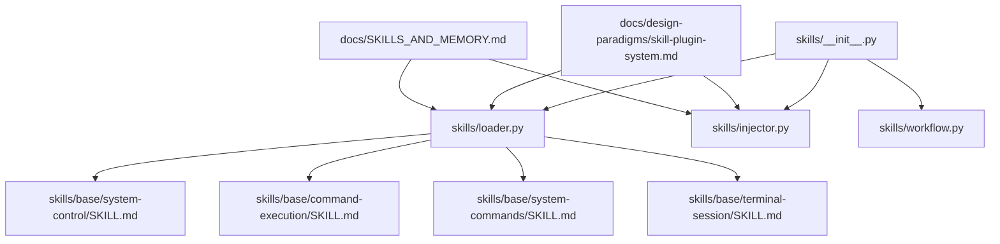
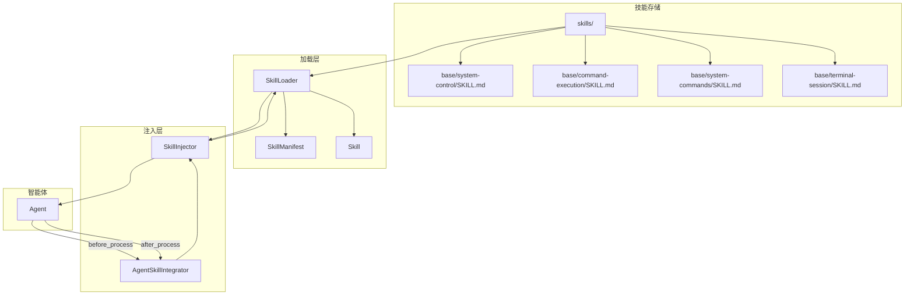
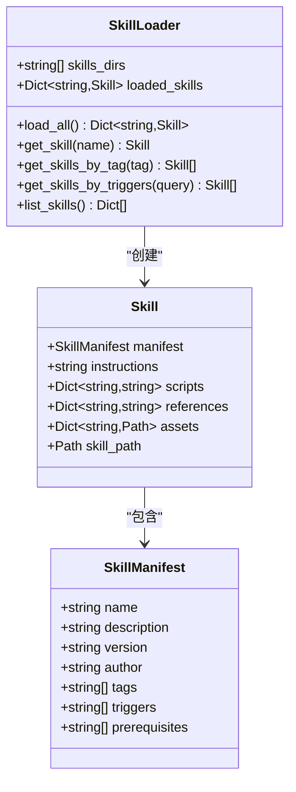
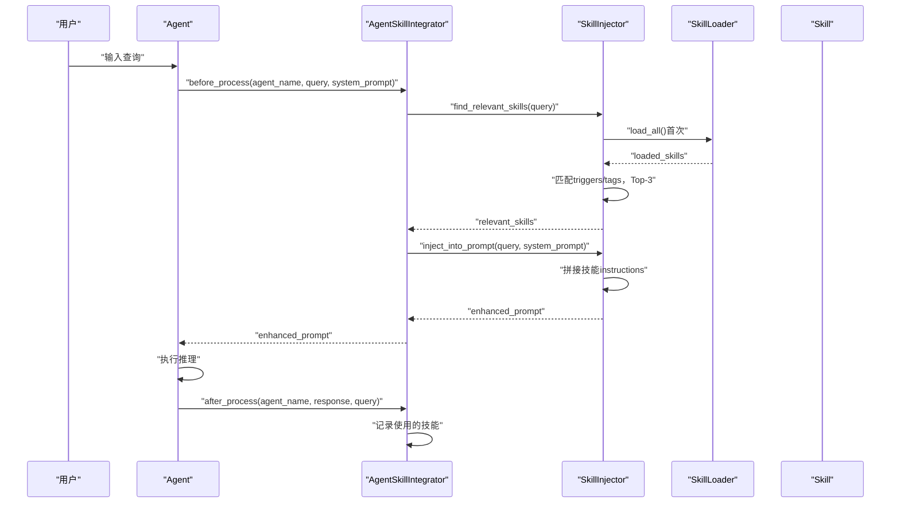
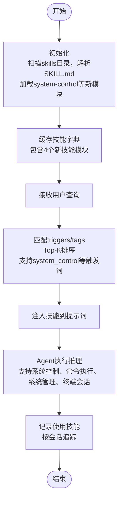
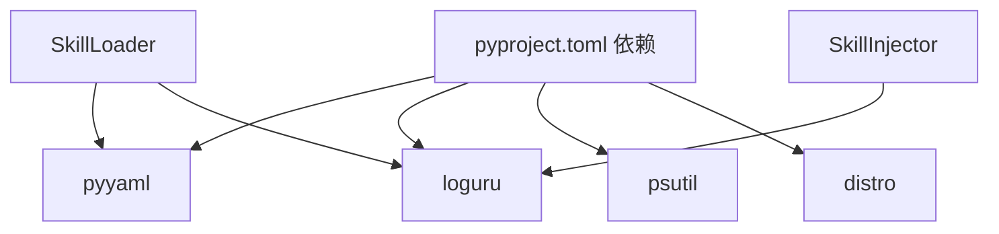

# 技能管理系统

<cite>
**本文引用的文件列表**
- [skills/__init__.py](file://skills/__init__.py)
- [skills/loader.py](file://skills/loader.py)
- [skills/injector.py](file://skills/injector.py)
- [skills/workflow.py](file://skills/workflow.py)
- [skills/base/system-control/SKILL.md](file://skills/base/system-control/SKILL.md)
- [skills/base/command-execution/SKILL.md](file://skills/base/command-execution/SKILL.md)
- [skills/base/system-commands/SKILL.md](file://skills/base/system-commands/SKILL.md)
- [skills/base/terminal-session/SKILL.md](file://skills/base/terminal-session/SKILL.md)
- [docs/design-paradigms/skill-plugin-system.md](file://docs/design-paradigms/skill-plugin-system.md)
- [docs/SKILLS_AND_MEMORY.md](file://docs/SKILLS_AND_MEMORY.md)
- [pyproject.toml](file://pyproject.toml)
</cite>

## 更新摘要
**所做更改**
- 新增完整的系统控制技能模块介绍
- 添加命令执行技能模块详细说明
- 补充系统命令技能模块内容
- 增加终端会话技能模块说明
- 更新技能系统架构图以反映新增模块
- 扩展技能工作流程示例
- 完善技能开发最佳实践

## 目录
1. [简介](#简介)
2. [项目结构](#项目结构)
3. [核心组件](#核心组件)
4. [架构总览](#架构总览)
5. [组件详解](#组件详解)
6. [新增技能模块](#新增技能模块)
7. [技能工作流程](#技能工作流程)
8. [依赖关系分析](#依赖关系分析)
9. [性能与可扩展性](#性能与可扩展性)
10. [故障排查指南](#故障排查指南)
11. [结论](#结论)
12. [附录](#附录)

## 简介
本文件面向Secbot的"技能管理系统"，系统性阐述技能加载器、技能数据模型、技能注入器以及与智能体的集成机制。重点覆盖：
- SkillLoader类的设计与实现：目录扫描、Markdown frontmatter解析、YAML清单提取、资源文件组织与缓存。
- 技能数据模型：SkillManifest清单结构、Skill技能单元属性与文件组织规范。
- 技能注入器：触发词匹配算法、相关技能查找策略、Top-K选择、提示词增强与上下文注入。
- 工作流程：技能生命周期管理、使用记录追踪、效果评估与智能体集成。
- 开发与扩展：新技能创建规范、Markdown格式要求、脚本与资源文件组织、最佳实践与性能优化建议。

**更新** 新增四个完整的技能模块：system-control（系统控制）、command-execution（命令执行）、system-commands（系统命令）、terminal-session（终端会话），提供统一的系统控制、命令执行、系统管理和终端会话功能。

## 项目结构
技能系统位于skills目录，核心文件包括：
- loader.py：技能加载器与数据模型定义
- injector.py：技能注入器与智能体集成器
- workflow.py：工作流示例与使用说明
- base/system-control/SKILL.md：系统控制技能清单与说明
- base/command-execution/SKILL.md：命令执行技能清单与说明
- base/system-commands/SKILL.md：系统命令技能清单与说明
- base/terminal-session/SKILL.md：终端会话技能清单与说明
- docs/design-paradigms/skill-plugin-system.md：设计范式与约定
- docs/SKILLS_AND_MEMORY.md：技能与记忆系统的整合说明

**图表来源**
- [skills/__init__.py](file://skills/__init__.py#L1-L18)
- [skills/loader.py](file://skills/loader.py#L1-L182)
- [skills/injector.py](file://skills/injector.py#L1-L141)
- [skills/workflow.py](file://skills/workflow.py#L1-L86)
- [skills/base/system-control/SKILL.md](file://skills/base/system-control/SKILL.md#L1-L433)
- [skills/base/command-execution/SKILL.md](file://skills/base/command-execution/SKILL.md#L1-L216)
- [skills/base/system-commands/SKILL.md](file://skills/base/system-commands/SKILL.md#L1-L274)
- [skills/base/terminal-session/SKILL.md](file://skills/base/terminal-session/SKILL.md#L1-L229)
- [docs/design-paradigms/skill-plugin-system.md](file://docs/design-paradigms/skill-plugin-system.md#L1-L42)
- [docs/SKILLS_AND_MEMORY.md](file://docs/SKILLS_AND_MEMORY.md#L1-L141)

**章节来源**
- [skills/__init__.py](file://skills/__init__.py#L1-L18)
- [skills/loader.py](file://skills/loader.py#L1-L182)
- [skills/injector.py](file://skills/injector.py#L1-L141)
- [skills/workflow.py](file://skills/workflow.py#L1-L86)
- [docs/design-paradigms/skill-plugin-system.md](file://docs/design-paradigms/skill-plugin-system.md#L1-L42)
- [docs/SKILLS_AND_MEMORY.md](file://docs/SKILLS_AND_MEMORY.md#L1-L141)

## 核心组件
- SkillLoader：扫描技能目录，解析SKILL.md的YAML frontmatter与正文，构建Skill对象并缓存；支持按名称、标签、触发词检索。
- Skill：技能单元，包含清单、指令正文、脚本、参考文档、资源文件等。
- SkillManifest：技能清单，包含name、description、version、author、tags、triggers、prerequisites等字段。
- SkillInjector：根据用户查询匹配相关技能，Top-K排序，将技能注入到系统提示词或上下文块。
- AgentSkillIntegrator：将技能系统集成到智能体生命周期，before/after钩子记录使用情况。
- 工作流示例：展示从加载、匹配、注入到执行与记录的完整流程。

**章节来源**
- [skills/loader.py](file://skills/loader.py#L14-L182)
- [skills/injector.py](file://skills/injector.py#L12-L141)
- [skills/workflow.py](file://skills/workflow.py#L1-L86)

## 架构总览
技能系统采用"加载-匹配-注入-记录"的流水线式架构，与智能体解耦并通过函数扩展或钩子接入。

**图表来源**
- [skills/loader.py](file://skills/loader.py#L39-L182)
- [skills/injector.py](file://skills/injector.py#L12-L141)
- [skills/workflow.py](file://skills/workflow.py#L1-L86)

## 组件详解

### 技能加载器：SkillLoader
- 目录扫描与缓存
  - 支持多技能根目录，默认扫描["./skills"]。
  - 遍历每个子目录，若存在SKILL.md则加载为Skill对象，缓存为name->Skill字典。
- Markdown frontmatter解析
  - 使用正则一次性拆分YAML frontmatter与正文，支持多行与换行。
  - frontmatter解析失败时回退为仅正文，自动生成基础清单。
- 资源文件组织
  - 可选scripts/、references/、assets/目录，加载脚本内容、参考文档与资源路径，便于按名引用。
- 查询接口
  - get_skill(name)：按名称获取。
  - get_skills_by_tag(tag)：按标签过滤。
  - get_skills_by_triggers(query)：按触发词模糊匹配（大小写不敏感）。
  - list_skills()：输出技能概要列表。

**图表来源**
- [skills/loader.py](file://skills/loader.py#L14-L182)

**章节来源**
- [skills/loader.py](file://skills/loader.py#L39-L182)
- [docs/design-paradigms/skill-plugin-system.md](file://docs/design-paradigms/skill-plugin-system.md#L5-L28)

### 技能数据模型
- SkillManifest（清单）
  - 字段：name、description、version、author、tags、triggers、prerequisites。
  - 用途：驱动匹配、注入与展示。
- Skill（技能单元）
  - 字段：manifest、instructions、scripts、references、assets、skill_path。
  - 用途：承载技能的全部信息，供注入器使用。

**章节来源**
- [skills/loader.py](file://skills/loader.py#L14-L37)
- [docs/design-paradigms/skill-plugin-system.md](file://docs/design-paradigms/skill-plugin-system.md#L11-L16)

### 技能注入器：SkillInjector与AgentSkillIntegrator
- 触发词匹配算法
  - 将查询转为小写，遍历技能清单的triggers与tags，分别赋予不同权重（triggers优先级更高）。
  - 计算得分并排序，取Top-K（当前实现为Top-3）。
- 提示词增强
  - 将相关技能instructions拼接到系统提示词末尾，使用明确分隔标记，避免与主提示混淆。
  - 提供独立的"技能上下文"文本获取方法，便于调试与日志。
- 智能体集成
  - AgentSkillIntegrator在Agent的before_process阶段注入，在after_process阶段记录使用技能，支持按会话追踪。
  - 提供工厂函数integrate_skills_with_agent，通过函数扩展方式为任意Agent注入技能能力。

**图表来源**
- [skills/injector.py](file://skills/injector.py#L86-L141)
- [skills/injector.py](file://skills/injector.py#L20-L84)
- [skills/loader.py](file://skills/loader.py#L129-L145)

**章节来源**
- [skills/injector.py](file://skills/injector.py#L12-L141)
- [skills/workflow.py](file://skills/workflow.py#L1-L86)
- [docs/design-paradigms/skill-plugin-system.md](file://docs/design-paradigms/skill-plugin-system.md#L24-L42)

## 新增技能模块

### 系统控制技能：system-control
提供统一的系统操作界面，整合文件管理、进程控制、系统信息和命令执行功能。

**核心功能**
- 文件操作：list_files、read_file、write_file、create_directory、delete_file、copy_file、move_file、get_file_info
- 进程操作：list_processes、get_process_info、kill_process
- 系统信息：get_cpu_info、get_memory_info、get_disk_info、get_network_info
- 命令执行：execute_command
- 环境变量：get_env、set_env、list_env
- 路径操作：get_current_directory、change_directory、path_exists

**安全测试工作流**
- 初始侦察：系统概览、网络配置、磁盘检查、当前位置
- 进程分析：进程列表、可疑进程检测、进程详情、恶意进程终止
- 文件系统探索：用户目录浏览、关键文件读取、发现结果记录
- 网络调查：网络接口检查、网络命令执行
- 权限提升：用户检查、管理员权限验证、服务权限检查

**章节来源**
- [skills/base/system-control/SKILL.md](file://skills/base/system-control/SKILL.md#L1-L433)

### 命令执行技能：command-execution
专注于渗透测试中的系统命令执行技术和最佳实践。

**Windows命令**
- 网络发现：ipconfig、netstat、arp、nslookup
- 进程管理：tasklist、taskkill
- 文件系统：dir、attrib
- 用户组管理：net user、whoami、net localgroup

**Linux命令**
- 网络发现：ip addr、netstat、ss、arp、dig
- 进程管理：ps、kill、pstree
- 文件系统：find、locate
- 用户组管理：id、cat /etc/passwd、cat /etc/group

**安全测试命令**
- 枚举：nmap服务版本检测、OS检测、漏洞脚本
- Web测试：curl基本操作、POST请求、SSL测试
- Shell：反向shell、Web shell上传测试

**最佳实践**
- 避免检测：编码命令、限制输出可见性、清理历史
- 错误处理：检查返回码、重定向stderr、使用超时
- 跨平台：使用便携命令、先在隔离环境测试

**章节来源**
- [skills/base/command-execution/SKILL.md](file://skills/base/command-execution/SKILL.md#L1-L216)

### 系统命令技能：system-commands
提供系统级命令参考和安全评估用例。

**文件操作**
- 列表文件：list_files（支持递归）
- 读取文件：read_file（支持编码）
- 写入文件：write_file
- 文件信息：get_file_info
- 目录操作：创建、删除、复制、移动

**进程操作**
- 列出进程：list_processes（支持按名称过滤）
- 获取进程信息：get_process_info
- 终止进程：kill_process
- 常见进程枚举：任务管理器、网络连接、隐藏进程、服务进程

**系统信息**
- CPU信息：get_cpu_info
- 内存信息：get_memory_info
- 磁盘信息：get_disk_info
- 网络信息：get_network_info

**安全评估用例**
- 系统侦察：基本信息收集、磁盘扫描、进程检查
- 恶意软件分析：进程检查、可疑进程、磁盘扫描
- 权限提升检查：用户上下文、管理员权限、服务检查
- 持久性检测：启动位置、注册表autorun、crontab检查
- 凭据搜索：SAM数据库、密码文件、浏览器凭据

**环境变量和路径操作**
- 环境变量：get_env、set_env、list_env
- 路径操作：get_current_directory、change_directory、path_exists

**章节来源**
- [skills/base/system-commands/SKILL.md](file://skills/base/system-commands/SKILL.md#L1-L274)

### 终端会话技能：terminal-session
提供持久化终端会话管理，支持状态保持和多命令操作。

**会话操作**
- 打开会话：open（可选工作目录）
- 执行命令：exec（支持超时）
- 读取输出：read（查看会话输出缓冲区）
- 关闭会话：close
- 列出会话：list（查看所有活动会话）

**实用工作流**
- 基础侦察会话：启动会话、导航、运行扫描、检查结果、清理
- 多步利用：启动会话、下载工具、设置权限、执行工具、检查输出
- Windows Active Directory枚举：启动会话、用户检查、域用户枚举、域管理员组检查、BloodHound执行

**会话管理技巧**
- 自动会话选择：只有一个活动会话时可省略session_id
- 空闲超时：10分钟自动清理
- 工作目录持久化：Windows使用cd，Linux使用cd
- 环境变量：Windows使用set，Linux使用export

**常见安全测试序列**
- 服务枚举：网络连接、进程检查、服务检查
- 凭据搜索：密码文件、配置文件、注册表检查
- 权限提升检查：sudo权限、SUID文件、计划任务

**故障排除**
- 命令卡住：增加超时、使用read检查、关闭并重新打开会话
- 输出截断：使用read获取完整缓冲区、缓冲区限制200KB
- 会话不存在：使用list查看活动会话、会话可能已超时

**章节来源**
- [skills/base/terminal-session/SKILL.md](file://skills/base/terminal-session/SKILL.md#L1-L229)

## 技能工作流程

### 初始化阶段
- 扫描skills目录，解析SKILL.md，缓存到内存
- 加载system-control、command-execution、system-commands、terminal-session等新模块
- 支持多技能根目录扫描

### 查询匹配阶段
- 接收用户查询，提取触发词（triggers）和标签（tags）
- 评分排序，返回Top-3相关技能
- 新增技能模块的触发词：system_control、execute_command、system_info、terminal_session

### 提示词注入阶段
- 将技能内容追加到系统提示词
- 生成增强的提示词
- 分离"系统提示词增强"与"技能上下文块"

### Agent执行
- 使用增强后的提示词进行推理
- 新增技能模块支持：系统控制、命令执行、系统管理、终端会话

### 后处理
- 记录使用的技能到会话
- 支持按会话追踪使用情况

**图表来源**
- [skills/workflow.py](file://skills/workflow.py#L6-L28)
- [skills/injector.py](file://skills/injector.py#L20-L84)

**章节来源**
- [skills/workflow.py](file://skills/workflow.py#L1-L86)
- [skills/injector.py](file://skills/injector.py#L86-L141)

## 依赖关系分析
- 技能系统依赖
  - YAML解析：pyyaml
  - 日志：loguru
  - 正则：re
  - 路径：pathlib.Path
- 与项目其他模块的关系
  - 与智能体解耦：通过before/after钩子或函数扩展接入，不侵入核心process逻辑。
  - 与记忆系统可组合：可与记忆系统共同构建上下文，提升Agent表现。
  - 新增系统控制模块依赖：psutil（系统信息获取）、distro（系统信息）

**图表来源**
- [pyproject.toml](file://pyproject.toml#L43-L56)
- [skills/loader.py](file://skills/loader.py#L6-L11)
- [skills/injector.py](file://skills/injector.py#L5-L7)

**章节来源**
- [pyproject.toml](file://pyproject.toml#L29-L67)
- [skills/loader.py](file://skills/loader.py#L6-L11)
- [skills/injector.py](file://skills/injector.py#L5-L7)

## 性能与可扩展性
- 加载性能
  - 技能仅在首次使用时加载并缓存，后续查询无需重复IO。
  - 建议控制技能数量与大小，避免过大的scripts/references/assets影响内存占用。
  - 新增技能模块优化：system-control模块包含大量功能，建议按需使用。
- 匹配性能
  - 当前实现为线性扫描，适合中小规模技能库；大规模场景可考虑索引化（如按触发词建立倒排索引）。
  - 新增技能模块：4个技能模块，触发词匹配算法仍适用。
- 注入策略
  - 分离"系统提示词增强"与"技能上下文块"，减少LLM上下文污染风险。
  - 新增技能模块：system-control提供大量操作选项，注意控制注入内容长度。
- 可扩展点
  - 支持外部扩展：通过工具注册机制（参见工具系统）扩展技能来源。
  - 与记忆系统结合：在提示词中融合短期/长期记忆，提升上下文质量。
  - 新增技能模块：可继续扩展更多系统管理功能。

## 故障排查指南
- frontmatter解析失败
  - 现象：日志报错并回退为仅正文。
  - 处理：检查YAML语法，确保frontmatter闭合且字段合法。
- 技能文件缺失
  - 现象：警告"技能文件不存在"。
  - 处理：确认目录结构与SKILL.md命名一致。
- 匹配不到技能
  - 现象：返回空或低相关技能。
  - 处理：检查triggers/tags是否合理，必要时增加更多关键词。
- 注入后提示词异常
  - 现象：LLM响应异常或上下文混乱。
  - 处理：确认分隔标记与注入位置，避免与主提示混淆。
- 新增技能模块问题
  - system-control：检查prerequisites授权，验证操作权限。
  - command-execution：确认跨平台命令兼容性。
  - system-commands：注意权限要求，某些操作需要管理员权限。
  - terminal-session：检查会话超时和资源清理。

**章节来源**
- [skills/loader.py](file://skills/loader.py#L53-L65)
- [skills/loader.py](file://skills/loader.py#L67-L127)
- [skills/injector.py](file://skills/injector.py#L42-L69)

## 结论
Secbot的技能管理系统以Markdown为中心，通过SkillLoader实现标准化加载与缓存，SkillInjector提供高效的触发词匹配与提示词增强，AgentSkillIntegrator将技能无缝集成到智能体生命周期。新增的system-control、command-execution、system-commands、terminal-session四个技能模块提供了完整的系统控制、命令执行、系统管理和终端会话功能，配合设计范式与文档规范，系统具备良好的可维护性、可扩展性与可复用性。

## 附录

### 新技能创建规范与最佳实践
- 目录与文件
  - 每个技能一个目录，至少包含SKILL.md；可选scripts/、references/、assets/。
- SKILL.md格式
  - YAML frontmatter：name、description（必填）、version、author、tags、triggers、prerequisites。
  - 正文：技能说明与操作指南，建议结构化组织（标题、步骤、示例）。
- 触发词与标签
  - 触发词应简洁明确，覆盖常见表达；标签用于分类与检索。
- 脚本与资源
  - 脚本建议最小化，优先使用外部工具；资源文件命名清晰，便于引用。
- 最佳实践
  - 保持技能粒度适中，避免过度复杂；提供可验证的示例与输出格式。
  - 与记忆系统结合，提升上下文质量与一致性。
  - 新增技能模块：遵循system-control的统一接口设计模式。

**章节来源**
- [docs/design-paradigms/skill-plugin-system.md](file://docs/design-paradigms/skill-plugin-system.md#L5-L16)
- [docs/SKILLS_AND_MEMORY.md](file://docs/SKILLS_AND_MEMORY.md#L9-L41)

### 与智能体集成示例
- 手动注入：使用SkillInjector直接增强提示词。
- 自动集成：通过integrate_skills_with_agent为Agent扩展技能能力，自动在before_process阶段注入并在after_process阶段记录使用情况。
- 新增技能模块集成：system-control等新模块可直接通过SkillLoader加载和注入。

**章节来源**
- [skills/workflow.py](file://skills/workflow.py#L30-L57)
- [skills/injector.py](file://skills/injector.py#L121-L141)

### 新增技能模块使用指南
- system-control：适用于需要统一系统操作的场景，支持文件、进程、系统信息、命令执行一体化操作。
- command-execution：专注于渗透测试中的命令执行，提供Windows和Linux命令参考及最佳实践。
- system-commands：提供系统级命令参考，支持安全评估用例和权限检查。
- terminal-session：适用于需要持久化会话的场景，支持状态保持和多命令操作。

**章节来源**
- [skills/base/system-control/SKILL.md](file://skills/base/system-control/SKILL.md#L1-L433)
- [skills/base/command-execution/SKILL.md](file://skills/base/command-execution/SKILL.md#L1-L216)
- [skills/base/system-commands/SKILL.md](file://skills/base/system-commands/SKILL.md#L1-L274)
- [skills/base/terminal-session/SKILL.md](file://skills/base/terminal-session/SKILL.md#L1-L229)