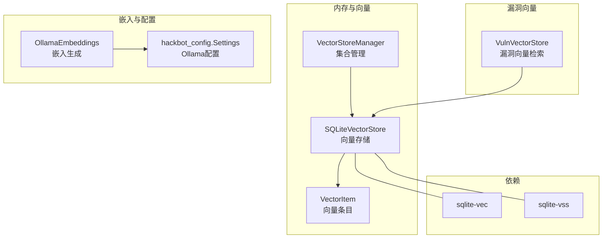
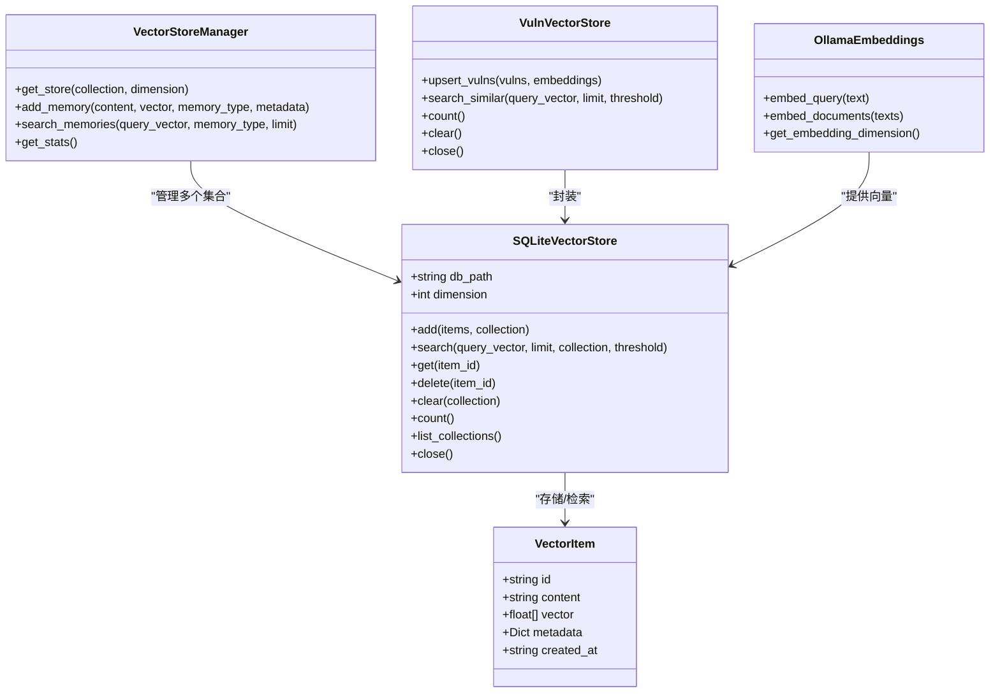
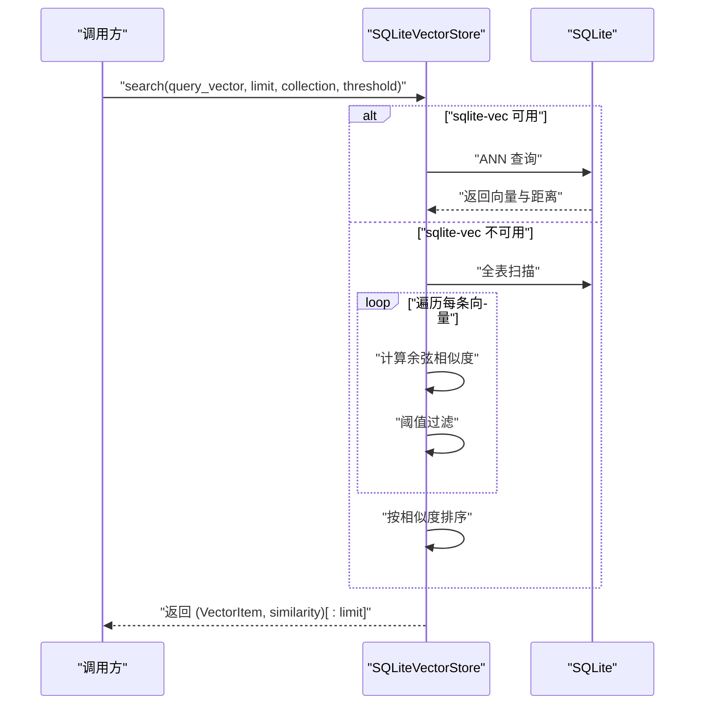
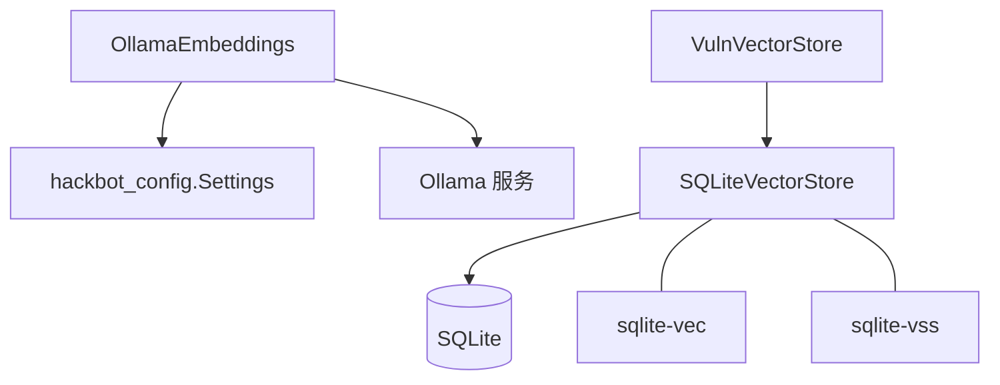
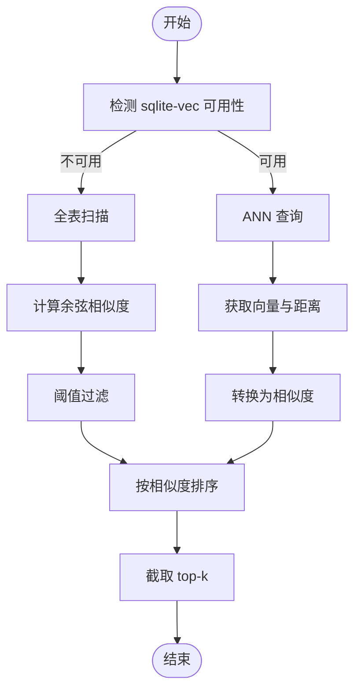

# 向量存储系统

<cite>
**本文引用的文件**
- [core/memory/vector_store.py](file://core/memory/vector_store.py)
- [core/memory/manager.py](file://core/memory/manager.py)
- [core/memory/database_memory.py](file://core/memory/database_memory.py)
- [core/vuln_db/vuln_vector_store.py](file://core/vuln_db/vuln_vector_store.py)
- [utils/embeddings.py](file://utils/embeddings.py)
- [hackbot_config/__init__.py](file://hackbot_config/__init__.py)
- [uv.lock](file://uv.lock)
- [uv.toml](file://uv.toml)
- [README_CN.md](file://README_CN.md)
</cite>

## 目录
1. [简介](#简介)
2. [项目结构](#项目结构)
3. [核心组件](#核心组件)
4. [架构总览](#架构总览)
5. [组件详解](#组件详解)
6. [依赖关系分析](#依赖关系分析)
7. [性能考量](#性能考量)
8. [故障排查指南](#故障排查指南)
9. [结论](#结论)
10. [附录](#附录)

## 简介
本文件为 Secbot 向量存储系统的技术文档，聚焦于基于 SQLite 的向量检索实现，涵盖 sqlite-vec/sqlite-vss 的集成、嵌入向量管理、相似度计算机制、数据结构与索引策略、检索流程与过滤机制，以及在智能体中的应用场景与配置参数、性能优化与扩展策略。文档同时提供代码级架构图与序列图，帮助读者从高层到细节全面理解系统。

## 项目结构
向量存储相关的核心代码位于 core/memory 与 core/vuln_db 两个子模块，配合 utils/embeddings 提供嵌入生成能力，hackbot_config 提供 Ollama 相关配置，uv.lock/uv.toml 描述 sqlite-vec/sqlite-vss 依赖与版本约束。

**图表来源**
- [core/memory/vector_store.py](file://core/memory/vector_store.py#L30-L78)
- [core/memory/vector_store.py](file://core/memory/vector_store.py#L239-L296)
- [core/vuln_db/vuln_vector_store.py](file://core/vuln_db/vuln_vector_store.py#L18-L30)
- [utils/embeddings.py](file://utils/embeddings.py#L11-L17)
- [hackbot_config/__init__.py](file://hackbot_config/__init__.py#L162-L180)
- [uv.lock](file://uv.lock#L3630-L3649)

**章节来源**
- [core/memory/vector_store.py](file://core/memory/vector_store.py#L1-L297)
- [core/vuln_db/vuln_vector_store.py](file://core/vuln_db/vuln_vector_store.py#L1-L107)
- [utils/embeddings.py](file://utils/embeddings.py#L1-L80)
- [hackbot_config/__init__.py](file://hackbot_config/__init__.py#L162-L180)
- [uv.lock](file://uv.lock#L3630-L3649)

## 核心组件
- VectorItem：向量存储的基本单元，包含 id、content、vector、metadata、created_at。
- SQLiteVectorStore：基于 SQLite 的向量存储与检索，支持 sqlite-vec/sqlite-vss 的 ANN 索引与降级纯量计算。
- VectorStoreManager：多集合统一管理器，按集合名与维度缓存与复用存储实例。
- VulnVectorStore：面向漏洞库的向量检索封装，提供 upsert 与相似度检索。
- OllamaEmbeddings：异步生成文本嵌入，对接 Ollama Embedding API。
- hackbot_config.Settings：提供 Ollama 基础地址与模型配置。

**章节来源**
- [core/memory/vector_store.py](file://core/memory/vector_store.py#L15-L28)
- [core/memory/vector_store.py](file://core/memory/vector_store.py#L30-L78)
- [core/memory/vector_store.py](file://core/memory/vector_store.py#L239-L296)
- [core/vuln_db/vuln_vector_store.py](file://core/vuln_db/vuln_vector_store.py#L18-L30)
- [utils/embeddings.py](file://utils/embeddings.py#L11-L17)
- [hackbot_config/__init__.py](file://hackbot_config/__init__.py#L162-L180)

## 架构总览
向量存储系统围绕 SQLite 展开，通过 sqlite-vec/sqlite-vss 提供 ANN 搜索能力；当缺失 ANN 函数时，自动降级为纯量余弦相似度计算。嵌入生成由 Ollama 提供，配置通过 hackbot_config.Settings 注入。VulnVectorStore 在 SQLiteVectorStore 之上提供漏洞领域的元数据与检索封装。

**图表来源**
- [core/memory/vector_store.py](file://core/memory/vector_store.py#L15-L28)
- [core/memory/vector_store.py](file://core/memory/vector_store.py#L30-L78)
- [core/memory/vector_store.py](file://core/memory/vector_store.py#L239-L296)
- [core/vuln_db/vuln_vector_store.py](file://core/vuln_db/vuln_vector_store.py#L18-L30)
- [utils/embeddings.py](file://utils/embeddings.py#L11-L17)

## 组件详解

### SQLiteVectorStore：向量存储与检索
- 数据结构
  - vector_items 表：存储 id、content、vector（BLOB，float32）、metadata、created_at。
  - collections 表：存储集合名、描述与配置。
  - vector_items_ann 虚拟表：当 sqlite-vec 可用时，使用 vec0 引擎按维度创建 ANN 索引。
- 索引与降级
  - 通过 _has_function("vec_ann") 检测 sqlite-vec 是否可用；可用则创建 ANN 虚拟表；否则记录警告并走纯量计算路径。
- 相似度与检索
  - ANN 路径：使用 ANN 查询返回距离，转换为相似度。
  - 纯量路径：对每个向量计算余弦相似度，阈值过滤后排序。
- 常用操作
  - add：批量插入或覆盖写入。
  - search：支持 limit、collection、threshold 参数。
  - get/delete/clear/count/list_collections：基本 CRUD 与统计。
  - close：释放连接。

**图表来源**
- [core/memory/vector_store.py](file://core/memory/vector_store.py#L124-L175)

**章节来源**
- [core/memory/vector_store.py](file://core/memory/vector_store.py#L45-L78)
- [core/memory/vector_store.py](file://core/memory/vector_store.py#L124-L175)
- [core/memory/vector_store.py](file://core/memory/vector_store.py#L177-L217)

### VectorStoreManager：多集合管理
- 按 collection:dimension 缓存 SQLiteVectorStore 实例，避免重复初始化。
- add_memory：为不同记忆类型（如 short_term）创建带前缀的 id，自动选择对应 store。
- search_memories：支持按集合或全局检索，全局检索时合并各集合结果并整体排序。

**章节来源**
- [core/memory/vector_store.py](file://core/memory/vector_store.py#L239-L296)

### VulnVectorStore：漏洞向量检索封装
- upsert_vulns：将漏洞对象与其嵌入写入向量库，metadata 包含漏洞关键字段。
- search_similar：基于 SQLiteVectorStore.search 返回元数据与相似度，补充 _content 与 _id。

**章节来源**
- [core/vuln_db/vuln_vector_store.py](file://core/vuln_db/vuln_vector_store.py#L18-L30)
- [core/vuln_db/vuln_vector_store.py](file://core/vuln_db/vuln_vector_store.py#L35-L66)
- [core/vuln_db/vuln_vector_store.py](file://core/vuln_db/vuln_vector_store.py#L72-L93)

### 嵌入生成与配置
- OllamaEmbeddings：异步调用 /api/embeddings，支持单文本与批量生成，异常处理与日志记录完善。
- hackbot_config.Settings：提供 ollama_base_url、ollama_embedding_model 等配置项。

**章节来源**
- [utils/embeddings.py](file://utils/embeddings.py#L11-L80)
- [hackbot_config/__init__.py](file://hackbot_config/__init__.py#L162-L180)

## 依赖关系分析
- sqlite-vec 与 sqlite-vss：通过 uv.lock 明确版本，sqlite-vec 用于 ANN 索引，sqlite-vss 为向量存储扩展。
- Ollama：通过 utils/embeddings 与 hackbot_config 配置对接，生成与向量存储维度一致的嵌入。
- 内存与数据库记忆：core/memory 提供三层记忆与数据库记忆封装，向量存储可作为长期记忆的补充。

**图表来源**
- [utils/embeddings.py](file://utils/embeddings.py#L11-L17)
- [hackbot_config/__init__.py](file://hackbot_config/__init__.py#L162-L180)
- [uv.lock](file://uv.lock#L3630-L3649)
- [core/memory/vector_store.py](file://core/memory/vector_store.py#L61-L67)

**章节来源**
- [uv.lock](file://uv.lock#L3630-L3649)
- [uv.toml](file://uv.toml#L5-L7)
- [utils/embeddings.py](file://utils/embeddings.py#L11-L80)
- [hackbot_config/__init__.py](file://hackbot_config/__init__.py#L162-L180)

## 性能考量
- ANN 索引优先：当 sqlite-vec 可用时，优先使用 ANN 虚拟表，显著降低检索复杂度。
- 纯量计算降级：sqlite-vec 不可用时自动走全表扫描与余弦相似度计算，适合小规模数据。
- 向量维度：构造 SQLiteVectorStore 时指定 dimension，确保 ANN 索引维度一致。
- 过滤阈值：search 支持 threshold，可在纯量路径下减少结果集大小。
- 批量写入：add 支持批量 VectorItem，减少事务次数。
- 连接管理：VectorStoreManager 按集合与维度缓存实例，避免重复连接；注意适时调用 close 释放连接。

[本节为通用性能建议，不直接分析具体文件]

## 故障排查指南
- sqlite-vec 未安装导致 ANN 不可用
  - 现象：初始化时记录 sqlite-vec 未安装警告，走纯量计算。
  - 处理：安装 sqlite-vec 并重启服务，确认 _has_function("vec_ann") 返回 True。
- 数据库文件锁定
  - 现象：SQLite 报错 database is locked。
  - 处理：确保所有连接已关闭，避免并发写入冲突。
- 权限问题
  - 现象：无法写入数据库文件。
  - 处理：检查数据目录写权限。
- Ollama 连接失败
  - 现象：embeddings 抛出连接错误。
  - 处理：确认 Ollama 服务运行与网络可达，检查 ollama_base_url 与模型配置。

**章节来源**
- [core/memory/vector_store.py](file://core/memory/vector_store.py#L61-L67)
- [docs/SQLITE_SETUP.md](file://docs/SQLITE_SETUP.md#L149-L167)
- [utils/embeddings.py](file://utils/embeddings.py#L63-L70)
- [hackbot_config/__init__.py](file://hackbot_config/__init__.py#L169-L173)

## 结论
Secbot 的向量存储系统以 SQLite 为核心，结合 sqlite-vec/sqlite-vss 提供 ANN 检索能力，并在不可用时优雅降级至纯量计算。通过 VectorStoreManager 统一管理多集合，VulnVectorStore 为漏洞领域提供专用封装，OllamaEmbeddings 提供稳定的嵌入生成能力。该架构在轻量部署与灵活扩展之间取得平衡，适用于智能体的语义检索与知识关联场景。

[本节为总结性内容，不直接分析具体文件]

## 附录

### 向量检索工作流程（算法流程图）

**图表来源**
- [core/memory/vector_store.py](file://core/memory/vector_store.py#L124-L175)

### 配置参数与环境变量
- Ollama 相关
  - ollama_base_url：Ollama 服务地址，默认 http://localhost:11434。
  - ollama_embedding_model：嵌入模型，默认 nomic-embed-text。
  - ollama_model：推理模型（与向量存储无直接关系）。
- 数据库路径
  - DATABASE_URL：SQLite 数据库 URL，默认 sqlite:///./data/secbot.db。
- 其他
  - LOG_LEVEL、LOG_FILE 等日志配置。

**章节来源**
- [hackbot_config/__init__.py](file://hackbot_config/__init__.py#L162-L180)
- [hackbot_config/__init__.py](file://hackbot_config/__init__.py#L224-L234)

### 代码示例（路径指引）
- 构建与查询向量索引
  - 添加向量：参见 [add 方法](file://core/memory/vector_store.py#L98-L122)
  - 搜索向量：参见 [search 方法](file://core/memory/vector_store.py#L124-L175)
  - 管理多集合：参见 [VectorStoreManager](file://core/memory/vector_store.py#L239-L296)
- 漏洞向量检索
  - 写入漏洞与嵌入：参见 [upsert_vulns](file://core/vuln_db/vuln_vector_store.py#L35-L66)
  - 语义相似度检索：参见 [search_similar](file://core/vuln_db/vuln_vector_store.py#L72-L93)
- 嵌入生成
  - 单文本嵌入：参见 [embed_query](file://utils/embeddings.py#L18-L28)
  - 批量嵌入：参见 [embed_documents](file://utils/embeddings.py#L30-L61)

### 在智能体中的应用场景
- 语义理解：通过向量检索召回与用户问题语义相近的历史经验或知识片段，辅助系统提示词与上下文注入。
- 信息检索：在大规模知识库中快速定位相关内容，减少全文扫描成本。
- 知识关联：结合 metadata（如漏洞来源、严重级别、CVSS 分数）进行二次过滤与排序，提升检索精度。

[本节为概念性说明，不直接分析具体文件]