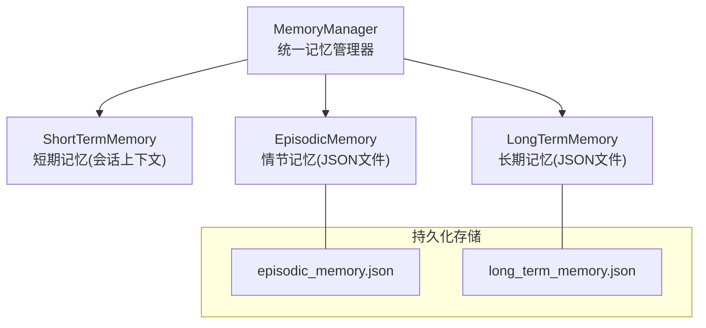
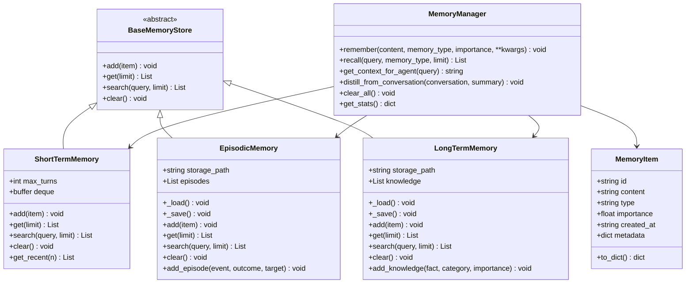
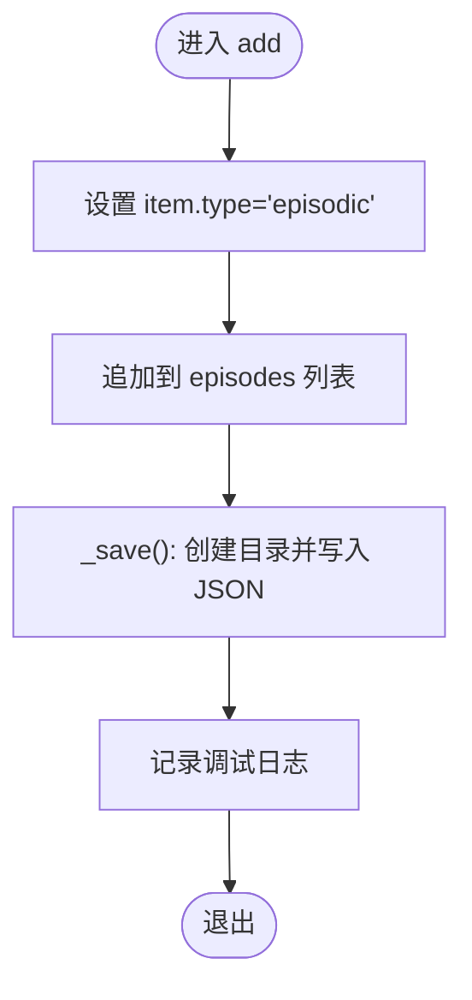
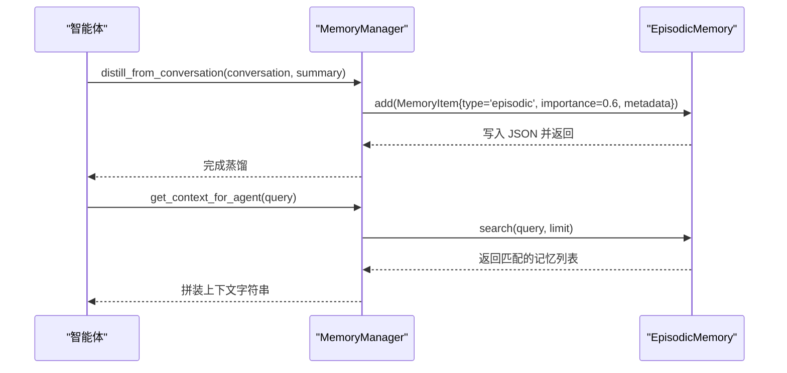
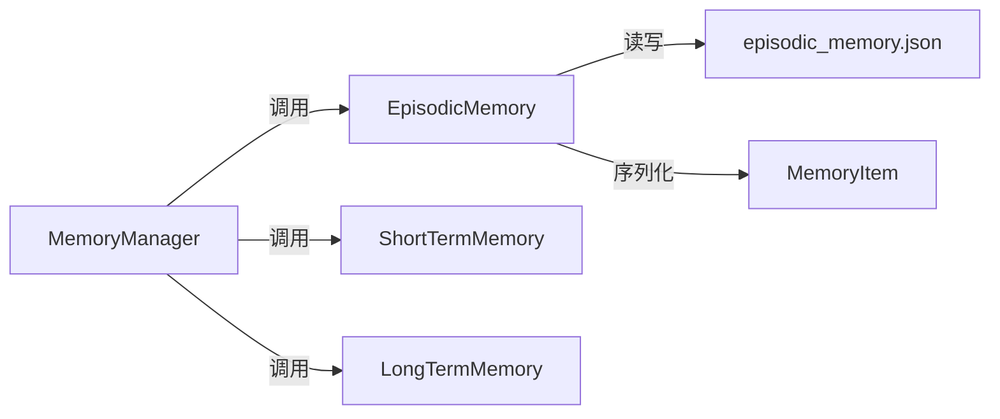

# 情节记忆系统

<cite>
**本文引用的文件**
- [core/memory/manager.py](file://core/memory/manager.py)
- [core/memory/__init__.py](file://core/memory/__init__.py)
- [docs/SKILLS_AND_MEMORY.md](file://docs/SKILLS_AND_MEMORY.md)
- [core/agents/base.py](file://core/agents/base.py)
- [core/attack_chain/exploitation.py](file://core/attack_chain/exploitation.py)
- [core/attack_chain/post_exploitation.py](file://core/attack_chain/post_exploitation.py)
</cite>

## 目录
1. [简介](#简介)
2. [项目结构](#项目结构)
3. [核心组件](#核心组件)
4. [架构总览](#架构总览)
5. [详细组件分析](#详细组件分析)
6. [依赖分析](#依赖分析)
7. [性能考虑](#性能考虑)
8. [故障排查指南](#故障排查指南)
9. [结论](#结论)
10. [附录](#附录)

## 简介
本文件围绕 Secbot 的情节记忆系统进行深入技术说明，重点解析 EpisodicMemory 类的设计与实现，涵盖以下方面：
- 基于 JSON 文件的持久化存储策略与文件系统管理
- 事件片段管理与跨会话经验积累机制
- 情节记忆的数据模型（事件描述、结果记录、目标追踪、元数据）
- 存储策略（序列化、异常处理、路径创建）
- 在智能体学习中的作用（经验总结、模式识别、行为优化）
- 提供事件添加接口、查询方法与清理策略，并结合具体代码示例展示如何记录与检索重要事件经验，以及如何利用情节记忆改善智能体决策能力

## 项目结构
情节记忆系统位于核心模块 core/memory 中，采用三层记忆架构（短期、情节、长期），其中 EpisodicMemory 负责跨会话事件与经验的持久化存储。

图表来源
- [core/memory/manager.py](file://core/memory/manager.py#L223-L229)
- [core/memory/manager.py](file://core/memory/manager.py#L86-L92)
- [core/memory/manager.py](file://core/memory/manager.py#L154-L161)

章节来源
- [core/memory/manager.py](file://core/memory/manager.py#L1-L325)
- [core/memory/__init__.py](file://core/memory/__init__.py#L1-L30)

## 核心组件
- MemoryItem：记忆条目的数据模型，包含唯一标识、内容、类型、重要度、创建时间与元数据字典，并提供 to_dict 序列化方法。
- BaseMemoryStore：抽象基类，定义 add/get/search/clear 四大接口。
- ShortTermMemory：短期记忆，基于双端队列，支持自动截断与最近 N 条检索。
- EpisodicMemory：情节记忆，基于 JSON 文件的持久化存储，支持事件片段添加、查询与清理。
- LongTermMemory：长期记忆，持久化知识库，支持事实添加与检索。
- MemoryManager：统一入口，提供 remember/recall/get_context_for_agent/distill_from_conversation 等高层接口。

章节来源
- [core/memory/manager.py](file://core/memory/manager.py#L16-L28)
- [core/memory/manager.py](file://core/memory/manager.py#L31-L48)
- [core/memory/manager.py](file://core/memory/manager.py#L51-L84)
- [core/memory/manager.py](file://core/memory/manager.py#L86-L152)
- [core/memory/manager.py](file://core/memory/manager.py#L154-L221)
- [core/memory/manager.py](file://core/memory/manager.py#L223-L325)

## 架构总览
情节记忆系统采用“三层记忆 + 统一管理器”的架构，其中 EpisodicMemory 通过 JSON 文件实现跨会话持久化，配合 MemoryManager 的上下文拼装与蒸馏能力，为智能体提供“过去经验+当前上下文+长期知识”的综合决策依据。

图表来源
- [core/memory/manager.py](file://core/memory/manager.py#L16-L28)
- [core/memory/manager.py](file://core/memory/manager.py#L31-L48)
- [core/memory/manager.py](file://core/memory/manager.py#L51-L84)
- [core/memory/manager.py](file://core/memory/manager.py#L86-L152)
- [core/memory/manager.py](file://core/memory/manager.py#L154-L221)
- [core/memory/manager.py](file://core/memory/manager.py#L223-L325)

## 详细组件分析

### EpisodicMemory 设计与实现
- 存储介质：JSON 文件，默认路径为 ./data/episodic_memory.json。首次实例化时自动尝试加载已有数据，若文件不存在则创建空列表。
- 写入策略：每次 add 后立即写回文件，确保跨会话一致性；写入前保证目录存在。
- 查询策略：大小写不敏感的子串匹配，支持限制返回条数。
- 清理策略：清空内存与持久化数据，日志记录。
- 便捷接口：add_episode 用于快速记录“事件-结果-目标”三元组，便于经验沉淀。

图表来源
- [core/memory/manager.py](file://core/memory/manager.py#L121-L125)
- [core/memory/manager.py](file://core/memory/manager.py#L106-L119)

章节来源
- [core/memory/manager.py](file://core/memory/manager.py#L86-L152)

### 数据模型与元数据结构
- MemoryItem 字段
  - id：UUID 唯一标识
  - content：记忆内容文本
  - type：记忆类型（short_term/episodic/long_term）
  - importance：重要度（0~1）
  - created_at：UTC 时间戳
  - metadata：任意键值对，用于承载事件结果、目标、类别等扩展信息
- 典型元数据示例
  - 情节记忆：{"outcome": "...", "target": "..."}
  - 长期记忆：{"category": "..."}
  - 会话蒸馏：{"conversation_length": N}

章节来源
- [core/memory/manager.py](file://core/memory/manager.py#L16-L28)
- [core/memory/manager.py](file://core/memory/manager.py#L143-L151)
- [core/memory/manager.py](file://core/memory/manager.py#L210-L220)
- [core/memory/manager.py](file://core/memory/manager.py#L300-L309)

### 存储策略与异常处理
- 文件系统管理
  - 加载：若文件存在则读取并反序列化为 MemoryItem 列表
  - 保存：先确保目录存在，再写入 JSON，缩进格式化，非 ASCII 字符保留
- 异常处理
  - 加载失败：记录警告日志
  - 保存失败：记录错误日志
- 性能考量
  - 每次写入均为全量覆盖，适合中小规模数据；大规模频繁写入可考虑批量合并或异步落盘

章节来源
- [core/memory/manager.py](file://core/memory/manager.py#L94-L104)
- [core/memory/manager.py](file://core/memory/manager.py#L106-L119)

### 在智能体学习中的作用
- 经验总结：通过 distill_from_conversation 将对话摘要作为情节记忆，形成“经验+长度”的索引线索
- 模式识别：基于 add_episode 记录的事件-结果-目标组合，辅助识别成功/失败模式与目标特征
- 行为优化：get_context_for_agent 将短期、情节、长期记忆整合为上下文，指导智能体在多轮交互中复用过往经验

图表来源
- [core/memory/manager.py](file://core/memory/manager.py#L299-L309)
- [core/memory/manager.py](file://core/memory/manager.py#L270-L297)
- [core/memory/manager.py](file://core/memory/manager.py#L131-L136)

章节来源
- [core/memory/manager.py](file://core/memory/manager.py#L270-L297)
- [core/memory/manager.py](file://core/memory/manager.py#L299-L309)

### 事件添加接口、查询方法与清理策略
- 添加接口
  - add(item)：通用添加，自动设置 type
  - add_episode(event, outcome, target)：事件片段专用添加
  - remember(content, memory_type, importance, **kwargs)：统一入口添加
- 查询方法
  - get(limit)：按时间倒序返回若干条
  - search(query, limit)：大小写不敏感子串匹配
  - recall(query, memory_type, limit)：按类型或全量召回
- 清理策略
  - clear()：清空并持久化
  - clear_all()：清空三类记忆
- 上下文组装
  - get_context_for_agent(query)：将短期、情节、长期记忆按类型分段输出

章节来源
- [core/memory/manager.py](file://core/memory/manager.py#L121-L141)
- [core/memory/manager.py](file://core/memory/manager.py#L143-L151)
- [core/memory/manager.py](file://core/memory/manager.py#L231-L248)
- [core/memory/manager.py](file://core/memory/manager.py#L127-L136)
- [core/memory/manager.py](file://core/memory/manager.py#L250-L268)
- [core/memory/manager.py](file://core/memory/manager.py#L311-L316)
- [core/memory/manager.py](file://core/memory/manager.py#L270-L297)

### 使用示例与最佳实践
- 记录一次扫描经验
  - 使用 remember 记录“目标端口开放”等事件，设置 memory_type="episodic"，并附加 target 等元数据
  - 参考路径：[docs/SKILLS_AND_MEMORY.md](file://docs/SKILLS_AND_MEMORY.md#L84-L90)
- 从对话蒸馏经验
  - 使用 distill_from_conversation 将会话摘要作为情节记忆，便于后续检索
  - 参考路径：[docs/SKILLS_AND_MEMORY.md](file://docs/SKILLS_AND_MEMORY.md#L98-L102)
- 获取智能体上下文
  - 使用 get_context_for_agent 将近期上下文、过往经验与知识整合，构建提示词
  - 参考路径：[docs/SKILLS_AND_MEMORY.md](file://docs/SKILLS_AND_MEMORY.md#L95-L96)
- 在代理流程中集成
  - 在代理处理循环中，先获取上下文，再将新消息作为短期记忆存入
  - 参考路径：[docs/SKILLS_AND_MEMORY.md](file://docs/SKILLS_AND_MEMORY.md#L126-L137)

章节来源
- [docs/SKILLS_AND_MEMORY.md](file://docs/SKILLS_AND_MEMORY.md#L77-L103)
- [docs/SKILLS_AND_MEMORY.md](file://docs/SKILLS_AND_MEMORY.md#L115-L139)

## 依赖分析
- 模块内聚性
  - EpisodicMemory 与 MemoryItem 高度内聚，围绕 JSON 持久化展开
  - MemoryManager 作为门面，聚合三类记忆，提供高层 API
- 外部依赖
  - 文件系统：os、json、pathlib（隐含于 os.makedirs）
  - 日志：loguru
- 潜在循环依赖
  - 当前文件未见循环导入；注意在其他模块中使用 EpisodicMemory 时避免反向耦合

图表来源
- [core/memory/manager.py](file://core/memory/manager.py#L223-L229)
- [core/memory/manager.py](file://core/memory/manager.py#L86-L92)
- [core/memory/manager.py](file://core/memory/manager.py#L154-L161)

章节来源
- [core/memory/manager.py](file://core/memory/manager.py#L1-L325)

## 性能考虑
- I/O 模式
  - 每次 add 触发一次完整 JSON 写入，适合中小规模数据；若频繁写入，可考虑批处理或延迟写入策略
- 查询复杂度
  - search 为线性遍历，时间复杂度 O(N)，N 为记忆条目数；可通过索引或向量检索扩展
- 内存占用
  - 短期记忆使用固定容量的双端队列，自动截断，内存稳定
- 建议
  - 大规模场景可引入向量存储（如 SQLiteVectorStore）进行相似度检索，与 JSON 存储互补

## 故障排查指南
- 无法加载/保存 JSON
  - 检查存储路径权限与父目录是否存在
  - 查看警告/错误日志定位异常
- 查询无结果
  - 确认查询关键词大小写不敏感特性
  - 检查记忆类型是否正确（episodic vs short_term vs long_term）
- 记忆未持久化
  - 确认 add 后未发生异常导致保存失败
  - 检查文件是否被外部程序锁定

章节来源
- [core/memory/manager.py](file://core/memory/manager.py#L94-L104)
- [core/memory/manager.py](file://core/memory/manager.py#L106-L119)
- [core/memory/manager.py](file://core/memory/manager.py#L131-L136)

## 结论
EpisodicMemory 通过简洁可靠的 JSON 文件持久化，实现了跨会话的经验积累与检索。配合 MemoryManager 的上下文拼装与蒸馏能力，为智能体提供了“经验+上下文+知识”的综合决策支撑。对于大规模与高频写入场景，建议结合向量检索与批量写入策略进一步优化性能与可靠性。

## 附录
- 与智能体生命周期的集成点
  - 在代理初始化时注入 MemoryManager
  - 在每轮处理前调用 get_context_for_agent 获取上下文
  - 将新消息作为短期记忆存入，或将关键经验作为情节记忆存入
- 攻击链中的应用
  - 在漏洞利用与后渗透阶段，使用 add_episode 记录“目标-利用类型-结果”，便于后续模式识别与策略优化
  - 参考路径：[core/attack_chain/exploitation.py](file://core/attack_chain/exploitation.py#L14-L34)、[core/attack_chain/post_exploitation.py](file://core/attack_chain/post_exploitation.py#L14-L34)

章节来源
- [core/agents/base.py](file://core/agents/base.py#L20-L33)
- [core/attack_chain/exploitation.py](file://core/attack_chain/exploitation.py#L14-L34)
- [core/attack_chain/post_exploitation.py](file://core/attack_chain/post_exploitation.py#L14-L34)