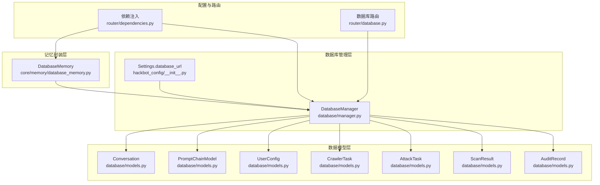
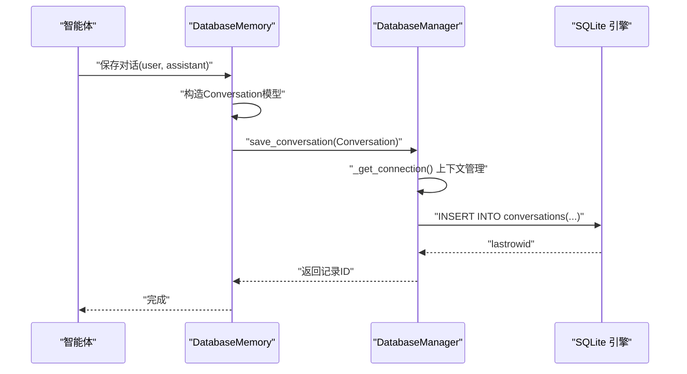
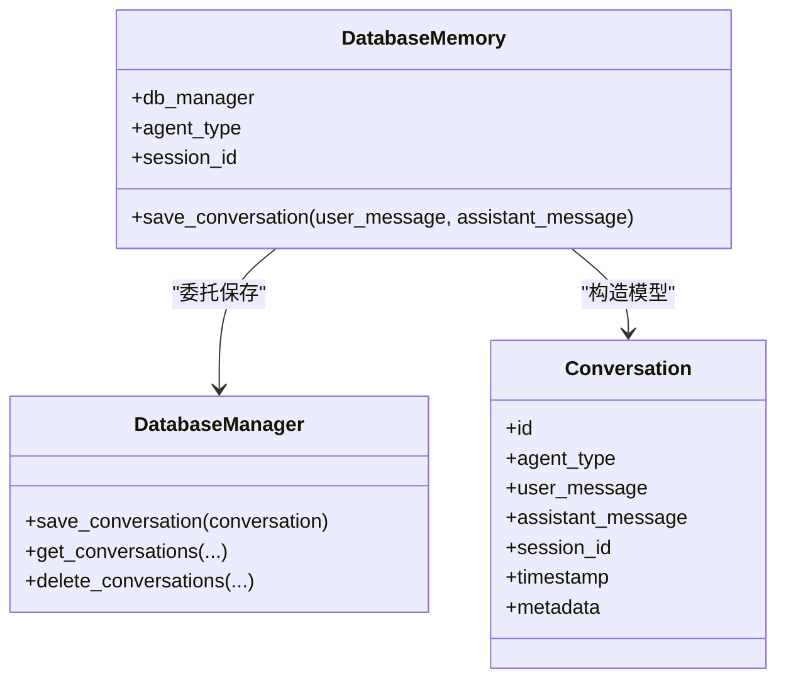
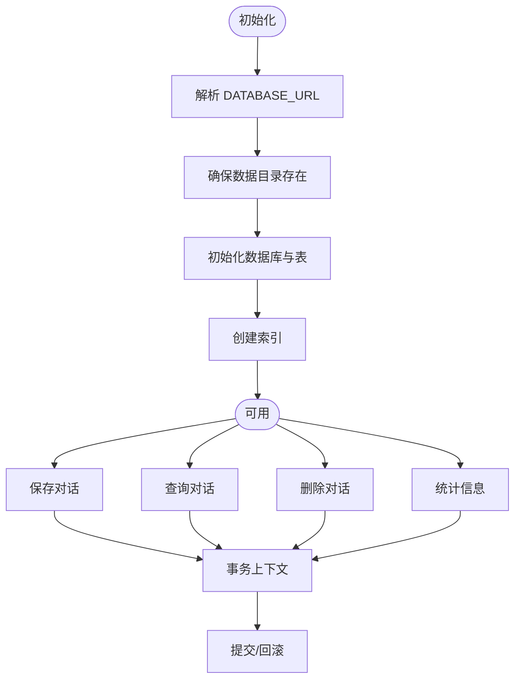
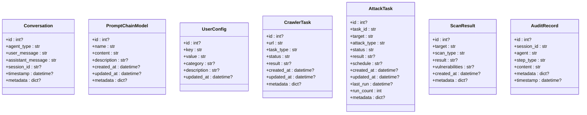
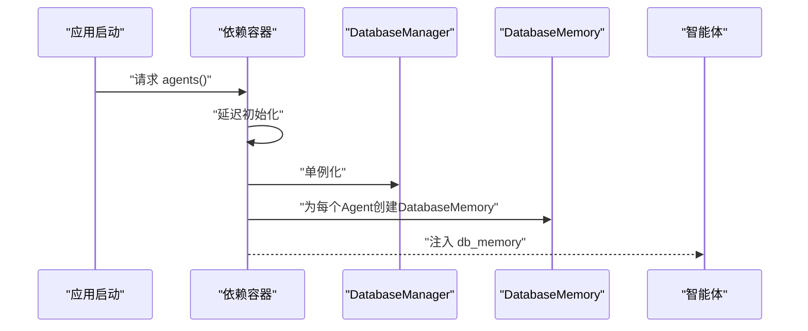
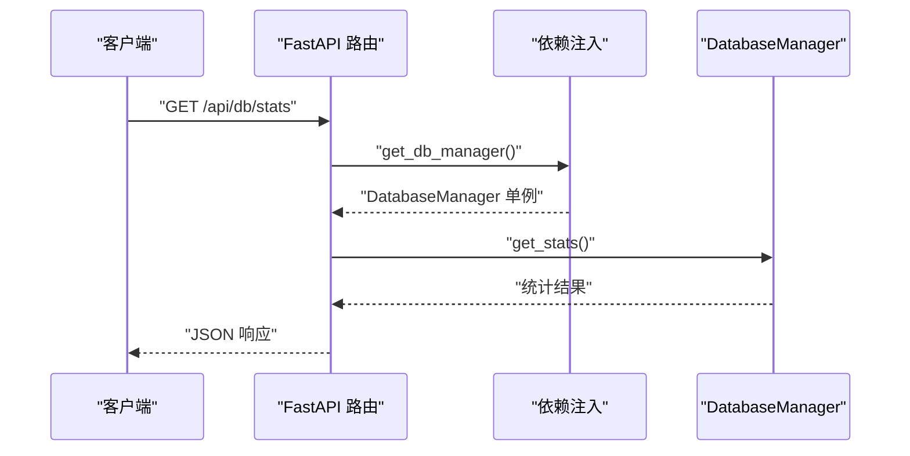
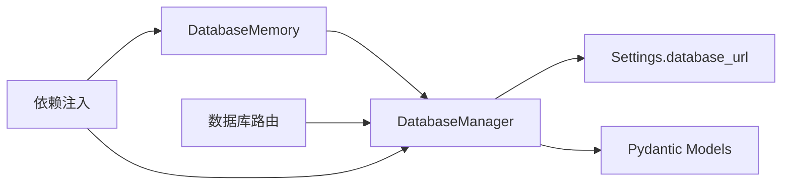

# 数据库内存存储

<cite>
**本文引用的文件**
- [core/memory/database_memory.py](file://core/memory/database_memory.py)
- [database/models.py](file://database/models.py)
- [database/manager.py](file://database/manager.py)
- [hackbot_config/__init__.py](file://hackbot_config/__init__.py)
- [docs/DATABASE_GUIDE.md](file://docs/DATABASE_GUIDE.md)
- [docs/SQLITE_SETUP.md](file://docs/SQLITE_SETUP.md)
- [router/database.py](file://router/database.py)
- [router/dependencies.py](file://router/dependencies.py)
- [tests/test_sqlite_connection.py](file://tests/test_sqlite_connection.py)
- [tests/test_db_connection.py](file://tests/test_db_connection.py)
</cite>

## 目录
1. [简介](#简介)
2. [项目结构](#项目结构)
3. [核心组件](#核心组件)
4. [架构总览](#架构总览)
5. [组件详解](#组件详解)
6. [依赖关系分析](#依赖关系分析)
7. [性能考量](#性能考量)
8. [故障排查指南](#故障排查指南)
9. [结论](#结论)
10. [附录](#附录)

## 简介
本文件面向Secbot的“数据库内存存储”能力，聚焦于基于SQLite的对话记忆持久化方案。文档从架构设计、表结构与数据模型、ORM映射机制、配置与连接管理、事务处理、性能优化与迁移策略等方面进行系统化说明，并提供与文件存储的对比分析与实践示例路径，帮助开发者在保持一致性的同时实现可扩展、可维护的记忆存储。

## 项目结构
围绕数据库内存存储的关键文件与职责如下：
- 数据模型层：定义对话、提示词链、用户配置、爬虫任务、攻击任务、扫描结果、审计留痕等实体。
- 数据库管理层：负责SQLite连接、表初始化、CRUD操作、索引管理、统计信息与事务控制。
- 记忆封装层：为智能体提供简洁的对话记忆保存接口，屏蔽底层细节。
- 配置与路由：提供数据库路径解析、单例化依赖注入、HTTP接口暴露。
- 文档与测试：提供使用指南、CLI命令、备份与清理策略，以及连接与功能测试样例。

**图示来源**
- [core/memory/database_memory.py](file://core/memory/database_memory.py#L14-L37)
- [database/manager.py](file://database/manager.py#L26-L204)
- [database/models.py](file://database/models.py#L9-L89)
- [hackbot_config/__init__.py](file://hackbot_config/__init__.py#L35-L43)
- [router/dependencies.py](file://router/dependencies.py#L49-L89)
- [router/database.py](file://router/database.py#L17-L91)

**章节来源**
- [core/memory/database_memory.py](file://core/memory/database_memory.py#L1-L38)
- [database/manager.py](file://database/manager.py#L26-L204)
- [database/models.py](file://database/models.py#L1-L90)
- [hackbot_config/__init__.py](file://hackbot_config/__init__.py#L35-L43)
- [router/dependencies.py](file://router/dependencies.py#L49-L89)
- [router/database.py](file://router/database.py#L17-L91)

## 核心组件
- DatabaseMemory：为智能体提供对话记忆保存接口，内部构造并委托DatabaseManager完成持久化。
- DatabaseManager：SQLite管理器，负责数据库初始化、表结构创建、索引、CRUD、统计与事务控制。
- 数据模型：基于Pydantic的BaseModel，定义各业务实体字段、可选字段与元数据结构。
- 配置与依赖：通过Settings解析DATABASE_URL，提供单例化依赖注入，确保全局一致性。
- 路由与CLI：提供统计、历史查询、清空等接口，便于运维与调试。

**章节来源**
- [core/memory/database_memory.py](file://core/memory/database_memory.py#L14-L37)
- [database/manager.py](file://database/manager.py#L26-L204)
- [database/models.py](file://database/models.py#L9-L89)
- [hackbot_config/__init__.py](file://hackbot_config/__init__.py#L223-L226)
- [router/dependencies.py](file://router/dependencies.py#L49-L89)
- [router/database.py](file://router/database.py#L17-L91)

## 架构总览
数据库内存存储采用“三层封装”思路：
- 应用层（智能体）：通过DatabaseMemory保存对话，无需关心数据库细节。
- 适配层（DatabaseManager）：负责SQLite连接、表初始化、索引、事务与查询构建。
- 模型层（Pydantic）：统一数据结构与序列化，保证跨层数据契约清晰。

**图示来源**
- [core/memory/database_memory.py](file://core/memory/database_memory.py#L28-L37)
- [database/manager.py](file://database/manager.py#L60-L74)
- [database/manager.py](file://database/manager.py#L207-L228)

**章节来源**
- [core/memory/database_memory.py](file://core/memory/database_memory.py#L28-L37)
- [database/manager.py](file://database/manager.py#L60-L74)
- [database/manager.py](file://database/manager.py#L207-L228)

## 组件详解

### DatabaseMemory（对话记忆封装）
- 角色：为智能体提供简洁的对话保存接口，内部将字符串消息封装为Conversation模型并调用DatabaseManager保存。
- 关键点：
  - 保存时自动填充agent_type、session_id、timestamp。
  - 通过传入的DatabaseManager实例完成持久化，解耦智能体与数据库实现。

**图示来源**
- [core/memory/database_memory.py](file://core/memory/database_memory.py#L14-L37)
- [database/manager.py](file://database/manager.py#L207-L228)
- [database/models.py](file://database/models.py#L9-L18)

**章节来源**
- [core/memory/database_memory.py](file://core/memory/database_memory.py#L14-L37)

### DatabaseManager（SQLite管理器）
- 数据库初始化与路径解析：
  - 优先从Settings.database_url解析（支持sqlite:///路径）。
  - 支持相对路径（以项目根目录为基准）与绝对路径。
  - 首次运行自动创建目录与表结构。
- 表结构与索引：
  - conversations：会话对话历史，包含会话索引与时间索引。
  - prompt_chains：提示词链，唯一键name。
  - user_configs：用户配置，唯一键key。
  - crawler_tasks、attack_tasks、scan_results、audit_trail：对应业务表，均具备常用查询索引。
- ORM映射与序列化：
  - 使用sqlite3.Row作为行工厂，便于字典式访问。
  - metadata等复杂字段以JSON字符串存储，读取时反序列化为Python对象。
- 事务与错误处理：
  - 通过上下文管理器自动commit/rollback，异常时记录日志并抛出。
- 查询与统计：
  - 提供分页、过滤、排序、聚合统计等方法，满足历史查询与运维需求。

**图示来源**
- [database/manager.py](file://database/manager.py#L29-L58)
- [database/manager.py](file://database/manager.py#L75-L203)
- [database/manager.py](file://database/manager.py#L207-L278)
- [database/manager.py](file://database/manager.py#L685-L718)

**章节来源**
- [database/manager.py](file://database/manager.py#L29-L58)
- [database/manager.py](file://database/manager.py#L75-L203)
- [database/manager.py](file://database/manager.py#L207-L278)
- [database/manager.py](file://database/manager.py#L685-L718)

### 数据模型（Pydantic）
- Conversation：对话记录，包含agent_type、user_message、assistant_message、session_id、timestamp、metadata。
- PromptChainModel：提示词链，包含name唯一标识、content、description、created_at、updated_at、metadata。
- UserConfig：用户配置，key唯一、value、category、description、updated_at。
- CrawlerTask、AttackTask、ScanResult、AuditRecord：分别对应爬虫任务、攻击任务、扫描结果、审计留痕的结构化字段。

**图示来源**
- [database/models.py](file://database/models.py#L9-L89)

**章节来源**
- [database/models.py](file://database/models.py#L9-L89)

### 配置与依赖注入
- DATABASE_URL解析：支持sqlite:///相对/绝对路径，相对路径以项目根目录为基准。
- 单例化依赖：通过router/dependencies.py的延迟初始化容器，确保DatabaseManager与智能体共享同一实例。
- 审计留痕：在依赖注入中为智能体附加DatabaseMemory实例，贯穿会话生命周期。

**图示来源**
- [hackbot_config/__init__.py](file://hackbot_config/__init__.py#L35-L43)
- [router/dependencies.py](file://router/dependencies.py#L49-L89)

**章节来源**
- [hackbot_config/__init__.py](file://hackbot_config/__init__.py#L35-L43)
- [router/dependencies.py](file://router/dependencies.py#L49-L89)

### 路由与运维接口
- 统计接口：/api/db/stats 返回各表记录数与任务状态分布。
- 历史接口：/api/db/history 支持按agent与session过滤、分页查询。
- 清空接口：/api/db/history 支持按agent与session清理。

**图示来源**
- [router/database.py](file://router/database.py#L20-L35)
- [router/dependencies.py](file://router/dependencies.py#L142-L144)

**章节来源**
- [router/database.py](file://router/database.py#L20-L35)
- [router/dependencies.py](file://router/dependencies.py#L142-L144)

## 依赖关系分析
- DatabaseMemory依赖DatabaseManager与Conversation模型。
- DatabaseManager依赖Settings解析数据库路径，依赖sqlite3与json进行连接、索引与序列化。
- 路由层通过依赖注入获取DatabaseManager，避免直接导入造成循环依赖。
- 文档与测试文件提供使用示例与验证脚本，确保接口稳定性。

**图示来源**
- [core/memory/database_memory.py](file://core/memory/database_memory.py#L8-L26)
- [database/manager.py](file://database/manager.py#L22-L23)
- [hackbot_config/__init__.py](file://hackbot_config/__init__.py#L223-L226)
- [router/dependencies.py](file://router/dependencies.py#L142-L144)

**章节来源**
- [core/memory/database_memory.py](file://core/memory/database_memory.py#L8-L26)
- [database/manager.py](file://database/manager.py#L22-L23)
- [hackbot_config/__init__.py](file://hackbot_config/__init__.py#L223-L226)
- [router/dependencies.py](file://router/dependencies.py#L142-L144)

## 性能考量
- 索引设计：针对常用查询字段建立索引（如conversations.session_id、timestamp），提升分页与过滤性能。
- 连接管理：使用上下文管理器确保连接及时释放，减少锁竞争与资源泄漏。
- 事务控制：所有写操作在事务中执行，异常自动回滚，保证一致性。
- 数据清理：提供按时间与会话清理接口，避免历史数据膨胀影响查询性能。
- 并发特性：SQLite支持多读单写，适合单机部署；如需更高并发，需评估外部数据库方案（本项目明确使用SQLite）。

**章节来源**
- [database/manager.py](file://database/manager.py#L176-L203)
- [database/manager.py](file://database/manager.py#L60-L74)
- [database/manager.py](file://database/manager.py#L280-L307)
- [docs/SQLITE_SETUP.md](file://docs/SQLITE_SETUP.md#L146-L147)

## 故障排查指南
- 数据库文件锁定：检查是否存在其他进程占用，确保连接正确关闭。
- 权限问题：确认数据库文件所在目录具有写权限。
- 数据库损坏：使用备份恢复，或删除数据库文件后重启自动重建。
- 连接测试：使用提供的测试脚本验证SQLite连接与基本功能。

**章节来源**
- [docs/SQLITE_SETUP.md](file://docs/SQLITE_SETUP.md#L151-L169)
- [tests/test_sqlite_connection.py](file://tests/test_sqlite_connection.py#L24-L129)
- [tests/test_db_connection.py](file://tests/test_db_connection.py#L23-L68)

## 结论
Secbot的数据库内存存储以SQLite为核心，结合Pydantic模型与上下文事务管理，提供了稳定、可扩展的记忆持久化能力。通过合理的索引设计、连接与事务管理、以及完善的运维接口，系统能够在单机场景下高效支撑对话历史、提示词链、用户配置与各类任务记录的管理。对于大规模数据与高并发需求，建议评估外部数据库方案；但在当前项目中，SQLite足以满足现有业务规模与性能要求。

## 附录

### 数据库配置选项与连接管理
- DATABASE_URL：支持sqlite:///相对/绝对路径，相对路径以项目根目录为基准。
- 默认路径：若未配置，使用项目根目录/data/secbot.db。
- 连接池与事务：通过上下文管理器自动commit/rollback，异常记录日志并抛出。

**章节来源**
- [hackbot_config/__init__.py](file://hackbot_config/__init__.py#L35-L43)
- [hackbot_config/__init__.py](file://hackbot_config/__init__.py#L223-L226)
- [database/manager.py](file://database/manager.py#L29-L58)
- [database/manager.py](file://database/manager.py#L60-L74)

### 事务处理机制
- 写操作封装在事务中，异常自动回滚，保证一致性。
- 读操作同样通过连接上下文管理，确保资源释放。

**章节来源**
- [database/manager.py](file://database/manager.py#L60-L74)
- [database/manager.py](file://database/manager.py#L207-L228)

### 与文件存储的对比分析
- 性能差异：SQLite在结构化查询、索引与事务方面优于纯文件存储，尤其在大数据量与复杂过滤场景。
- 扩展性考虑：SQLite为单机文件数据库，适合单实例部署；如需分布式或更高并发，需迁移到关系型数据库。
- 迁移策略：由于项目明确使用SQLite，迁移至其他数据库类型不在支持范围内；可通过备份与恢复策略在不同SQLite版本间切换。

**章节来源**
- [docs/SQLITE_SETUP.md](file://docs/SQLITE_SETUP.md#L169-L170)

### 使用示例（代码示例路径）
- 使用DatabaseManager保存/查询对话与统计信息：[示例路径](file://docs/DATABASE_GUIDE.md#L122-L144)
- 使用DatabaseMemory保存对话与获取历史：[示例路径](file://docs/DATABASE_GUIDE.md#L146-L161)
- CLI命令查看统计、历史与清空对话：[示例路径](file://docs/DATABASE_GUIDE.md#L68-L110)
- SQLite连接与功能测试：[示例路径](file://tests/test_sqlite_connection.py#L24-L129)