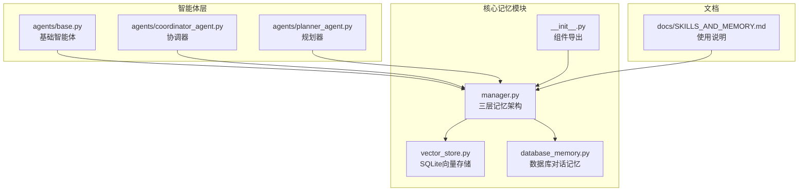
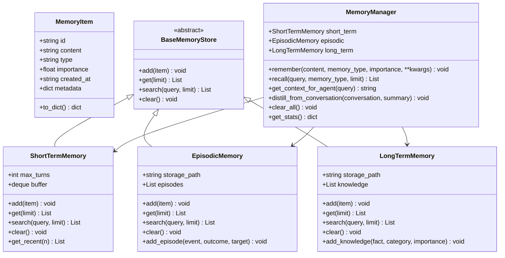
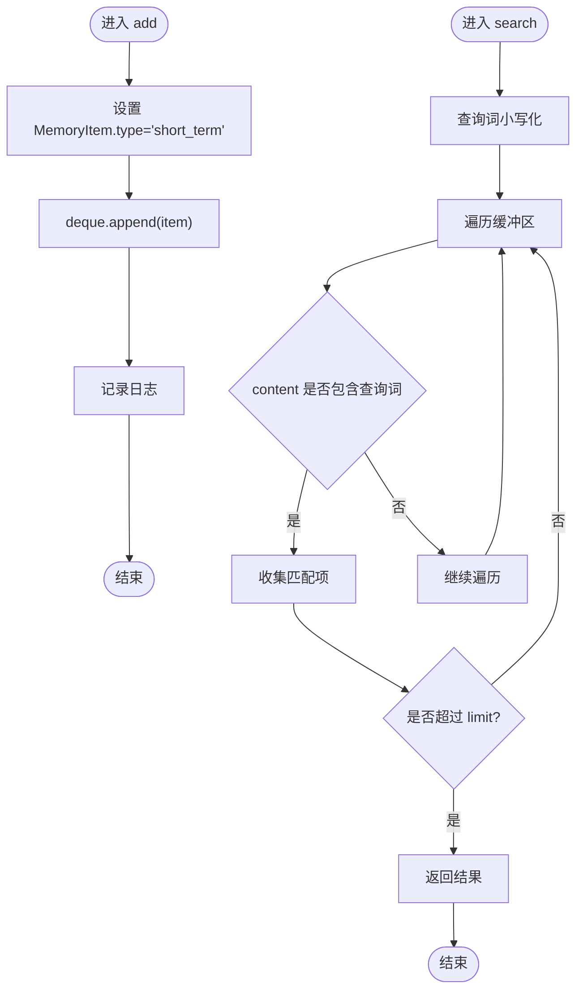
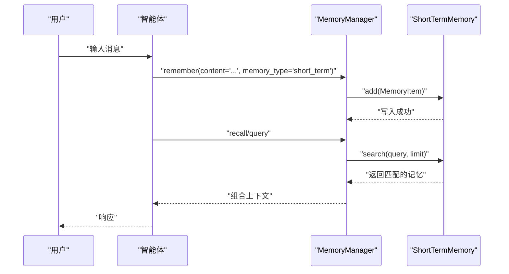
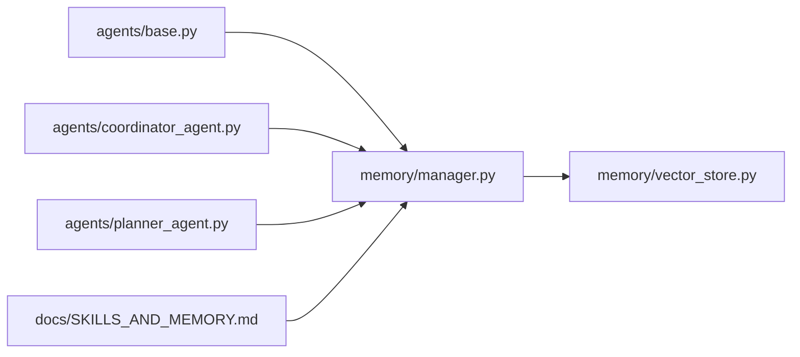

# 短期记忆系统

<cite>
**本文引用的文件**
- [core/memory/manager.py](file://core/memory/manager.py)
- [core/memory/__init__.py](file://core/memory/__init__.py)
- [core/memory/vector_store.py](file://core/memory/vector_store.py)
- [core/memory/database_memory.py](file://core/memory/database_memory.py)
- [docs/SKILLS_AND_MEMORY.md](file://docs/SKILLS_AND_MEMORY.md)
- [core/agents/base.py](file://core/agents/base.py)
- [core/agents/coordinator_agent.py](file://core/agents/coordinator_agent.py)
- [core/agents/planner_agent.py](file://core/agents/planner_agent.py)
</cite>

## 目录
1. [简介](#简介)
2. [项目结构](#项目结构)
3. [核心组件](#核心组件)
4. [架构总览](#架构总览)
5. [详细组件分析](#详细组件分析)
6. [依赖分析](#依赖分析)
7. [性能考虑](#性能考虑)
8. [故障排查指南](#故障排查指南)
9. [结论](#结论)
10. [附录](#附录)

## 简介
本文件聚焦 Secbot 的短期记忆系统，围绕 ShortTermMemory 类展开，系统性阐述其设计理念、实现机制与工程实践。短期记忆采用基于双端队列(deque)的循环缓冲区设计，结合最大轮次(max_turns)限制，实现会话上下文的高效管理与内存效率优化。文档同时覆盖短期记忆在智能体对话中的作用、生命周期管理、配置参数、使用场景与性能调优建议，并通过序列图与流程图直观展示关键工作流。

## 项目结构
短期记忆系统位于核心模块 core/memory 下，主要文件包括：
- manager.py：定义三层记忆架构与短期记忆实现
- vector_store.py：向量存储与检索（与短期记忆互补）
- database_memory.py：数据库对话记忆封装
- __init__.py：导出短期记忆与向量存储相关组件
- docs/SKILLS_AND_MEMORY.md：技能与记忆系统的使用说明与示例

**图表来源**
- [core/memory/manager.py](file://core/memory/manager.py#L1-L325)
- [core/memory/vector_store.py](file://core/memory/vector_store.py#L1-L297)
- [core/memory/database_memory.py](file://core/memory/database_memory.py#L1-L38)
- [core/memory/__init__.py](file://core/memory/__init__.py#L1-L30)
- [core/agents/base.py](file://core/agents/base.py#L1-L125)
- [core/agents/coordinator_agent.py](file://core/agents/coordinator_agent.py#L1-L335)
- [core/agents/planner_agent.py](file://core/agents/planner_agent.py#L1-L837)
- [docs/SKILLS_AND_MEMORY.md](file://docs/SKILLS_AND_MEMORY.md#L1-L141)

**章节来源**
- [core/memory/manager.py](file://core/memory/manager.py#L1-L325)
- [core/memory/__init__.py](file://core/memory/__init__.py#L1-L30)

## 核心组件
- MemoryItem：记忆条目数据结构，包含标识、内容、类型、重要度、时间戳与元数据
- BaseMemoryStore：记忆存储抽象基类，定义 add/get/search/clear 四大接口
- ShortTermMemory：短期记忆实现，基于 deque 的循环缓冲区，支持最大轮次限制与最近消息获取
- EpisodicMemory/LongTermMemory：情节记忆与长期记忆（与短期记忆互补）
- MemoryManager：统一记忆管理器，协调三类记忆并提供上下文拼装与蒸馏能力
- DatabaseMemory：将对话保存到数据库，供智能体使用
- SQLiteVectorStore/VectorStoreManager：基于 sqlite-vec/sqlite-vss 的向量存储与检索

**章节来源**
- [core/memory/manager.py](file://core/memory/manager.py#L16-L84)
- [core/memory/manager.py](file://core/memory/manager.py#L51-L84)
- [core/memory/manager.py](file://core/memory/manager.py#L223-L325)
- [core/memory/database_memory.py](file://core/memory/database_memory.py#L14-L38)
- [core/memory/vector_store.py](file://core/memory/vector_store.py#L15-L297)

## 架构总览
短期记忆在三层记忆架构中承担“会话上下文”的角色，与情节记忆、长期记忆协同工作。短期记忆通过 MemoryManager 提供统一入口，既可直接使用，也可与向量存储配合实现更丰富的检索能力。

**图表来源**
- [core/memory/manager.py](file://core/memory/manager.py#L16-L325)

## 详细组件分析

### ShortTermMemory 设计与实现
- 数据结构设计
  - 使用 collections.deque 并设置 maxlen，实现固定容量的循环缓冲区，超出容量时自动丢弃最旧元素
  - 通过 MemoryItem 统一承载消息内容与元信息，保证与上层智能体的消息模型一致
- 最大轮次限制
  - 构造函数接受 max_turns 参数，默认值为 10，用于控制短期记忆的最大容量
  - deque 的 maxlen 属性确保内存占用随轮次增长而稳定
- 内存效率优化
  - deque 基于数组的双端扩展，append 操作为 O(1)，适合高频的会话消息追加
  - 通过限制容量避免无限增长，降低峰值内存压力
- 消息队列管理
  - add：标准化 MemoryItem 的 type 字段为 short_term，并追加到缓冲区
  - get：支持 limit 参数，返回最近的若干条记忆
  - search：基于内容关键字的线性检索，返回前 limit 条匹配项
  - clear：清空缓冲区
  - get_recent：便捷方法，返回最近 n 条或全部短期记忆
- 上下文窗口控制
  - get 与 search 均支持 limit 参数，便于在提示词构建时裁剪上下文长度
  - MemoryManager.get_context_for_agent 会优先取最近的短期记忆作为“Recent Context”

**图表来源**
- [core/memory/manager.py](file://core/memory/manager.py#L58-L74)

**章节来源**
- [core/memory/manager.py](file://core/memory/manager.py#L51-L84)

### 生命周期管理
- 自动清理机制
  - 通过 deque 的 maxlen 实现自动淘汰最旧消息，无需显式清理
  - clear 方法可用于主动清空短期记忆
- 内存回收策略
  - 与 Python 的垃圾回收配合，短期记忆对象在超出作用域后自动释放
  - 通过 MemoryManager.get_stats 可观测短期记忆条目数量
- 性能监控
  - 日志记录短期记忆条目数量变化，便于运行时观察
  - get_stats 提供三类记忆的统计信息，便于整体评估

**章节来源**
- [core/memory/manager.py](file://core/memory/manager.py#L76-L84)
- [core/memory/manager.py](file://core/memory/manager.py#L318-L324)

### 在智能体对话中的作用
- 会话上下文维护
  - 智能体在对话过程中将每轮消息作为 MemoryItem 写入短期记忆，确保后续处理能够引用最近的上下文
  - MemoryManager.get_context_for_agent 将短期记忆与其他类型记忆整合，形成结构化的上下文字符串
- 对话历史管理
  - 智能体自身维护 _conversation 列表，短期记忆与该列表相互独立，互不干扰
  - clear_memory 仅清空智能体自身的对话历史，持久记忆需由调用方决定是否清空
- 实时信息检索
  - 通过 recall/search 可对短期记忆进行关键字检索，辅助智能体快速定位相关信息

**图表来源**
- [core/memory/manager.py](file://core/memory/manager.py#L231-L268)
- [core/agents/base.py](file://core/agents/base.py#L91-L101)

**章节来源**
- [core/agents/base.py](file://core/agents/base.py#L24-L26)
- [core/agents/base.py](file://core/agents/base.py#L91-L101)
- [core/memory/manager.py](file://core/memory/manager.py#L270-L297)

### 配置参数与使用场景
- 配置参数
  - max_turns：短期记忆最大轮次，默认 10，可通过构造函数调整
  - limit：get/search/clear_all 等接口的限制参数，用于控制返回数量或范围
- 使用场景
  - 会话上下文：在单次会话中维护最近的 N 轮对话
  - 关键字检索：基于内容关键字快速定位近期信息
  - 上下文拼装：为智能体构建结构化上下文字符串
- 性能调优建议
  - 合理设置 max_turns：根据对话复杂度与内存预算权衡
  - 适度使用 limit：在 recall/search 中限制返回数量，降低检索开销
  - 结合向量检索：对大体量上下文可考虑与 SQLiteVectorStore 配合，实现更高效的相似度检索

**章节来源**
- [core/memory/manager.py](file://core/memory/manager.py#L54-L56)
- [core/memory/manager.py](file://core/memory/manager.py#L63-L67)
- [core/memory/manager.py](file://core/memory/manager.py#L69-L74)
- [docs/SKILLS_AND_MEMORY.md](file://docs/SKILLS_AND_MEMORY.md#L77-L103)

### 代码示例路径
以下为在不同智能体场景中使用短期记忆的示例路径（不直接展示代码内容）：
- 基础使用与上下文拼装
  - [示例：记忆与上下文拼装](file://docs/SKILLS_AND_MEMORY.md#L79-L103)
- 智能体集成与会话上下文
  - [示例：智能体集成与短期记忆](file://docs/SKILLS_AND_MEMORY.md#L115-L141)
- 协调器与子智能体的会话摘要
  - [示例：append_turn_to_session_context](file://core/agents/coordinator_agent.py#L215-L237)
- 规划器的任务规划与上下文
  - [示例：规划器上下文构建](file://core/agents/planner_agent.py#L453-L476)

**章节来源**
- [docs/SKILLS_AND_MEMORY.md](file://docs/SKILLS_AND_MEMORY.md#L77-L141)
- [core/agents/coordinator_agent.py](file://core/agents/coordinator_agent.py#L215-L237)
- [core/agents/planner_agent.py](file://core/agents/planner_agent.py#L453-L476)

## 依赖分析
短期记忆系统与智能体层、文档与向量存储存在耦合关系：
- 与智能体层
  - 基础智能体维护对话历史列表，短期记忆与之并行存在
  - 协调器与规划器在执行过程中可调用 MemoryManager 获取上下文
- 与文档
  - SKILLS_AND_MEMORY.md 提供使用说明与示例，指导如何在智能体中集成短期记忆
- 与向量存储
  - vector_store.py 提供向量检索能力，可与短期记忆互补，实现更复杂的检索策略

**图表来源**
- [core/agents/base.py](file://core/agents/base.py#L1-L125)
- [core/agents/coordinator_agent.py](file://core/agents/coordinator_agent.py#L1-L335)
- [core/agents/planner_agent.py](file://core/agents/planner_agent.py#L1-L837)
- [core/memory/manager.py](file://core/memory/manager.py#L1-L325)
- [core/memory/vector_store.py](file://core/memory/vector_store.py#L1-L297)
- [docs/SKILLS_AND_MEMORY.md](file://docs/SKILLS_AND_MEMORY.md#L1-L141)

**章节来源**
- [core/agents/base.py](file://core/agents/base.py#L24-L26)
- [core/agents/coordinator_agent.py](file://core/agents/coordinator_agent.py#L225-L236)
- [core/agents/planner_agent.py](file://core/agents/planner_agent.py#L453-L476)
- [docs/SKILLS_AND_MEMORY.md](file://docs/SKILLS_AND_MEMORY.md#L77-L103)

## 性能考虑
- 时间复杂度
  - add：O(1)
  - get：O(n)，其中 n 为缓冲区长度（通常较小）
  - search：O(n)，线性遍历缓冲区
- 空间复杂度
  - O(max_turns)，受 maxlen 限制
- 优化建议
  - 适当增大 max_turns 以容纳更长上下文，但需关注内存占用
  - 在 recall/search 中合理设置 limit，避免返回过多冗余信息
  - 对于大规模上下文检索，可结合向量存储实现相似度检索，减少线性扫描成本

[本节为通用性能讨论，不直接分析具体文件]

## 故障排查指南
- 症状：短期记忆未生效或为空
  - 检查是否正确调用 remember 并指定 memory_type='short_term'
  - 确认智能体在处理后确实调用了 remember('...', 'short_term')
- 症状：上下文过长导致性能下降
  - 调整 max_turns 或在 recall/search 中设置 limit
  - 使用 get_recent 或限制返回数量
- 症状：日志中无短期记忆条目数变化
  - 检查日志级别配置，确认 debug 级别已启用
  - 确认 add 流程正常执行

**章节来源**
- [core/memory/manager.py](file://core/memory/manager.py#L58-L61)
- [core/memory/manager.py](file://core/memory/manager.py#L63-L67)
- [core/memory/manager.py](file://core/memory/manager.py#L69-L74)

## 结论
短期记忆系统通过 deque 循环缓冲区与最大轮次限制，实现了高效、可控的会话上下文管理。它与情节记忆、长期记忆共同构成三层记忆架构，在智能体对话中发挥着维护上下文、管理历史与实时检索的关键作用。结合合理的配置与性能调优，短期记忆能够在保证响应质量的同时，有效控制内存与计算开销。

[本节为总结性内容，不直接分析具体文件]

## 附录
- 相关文件与路径
  - [core/memory/manager.py](file://core/memory/manager.py#L1-L325)
  - [core/memory/__init__.py](file://core/memory/__init__.py#L1-L30)
  - [core/memory/vector_store.py](file://core/memory/vector_store.py#L1-L297)
  - [core/memory/database_memory.py](file://core/memory/database_memory.py#L1-L38)
  - [docs/SKILLS_AND_MEMORY.md](file://docs/SKILLS_AND_MEMORY.md#L1-L141)
  - [core/agents/base.py](file://core/agents/base.py#L1-L125)
  - [core/agents/coordinator_agent.py](file://core/agents/coordinator_agent.py#L1-L335)
  - [core/agents/planner_agent.py](file://core/agents/planner_agent.py#L1-L837)

[本节为概览性内容，不直接分析具体文件]