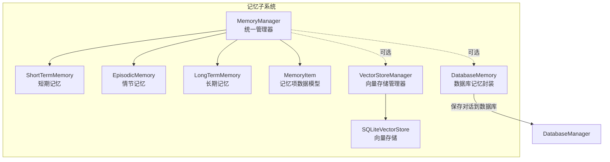
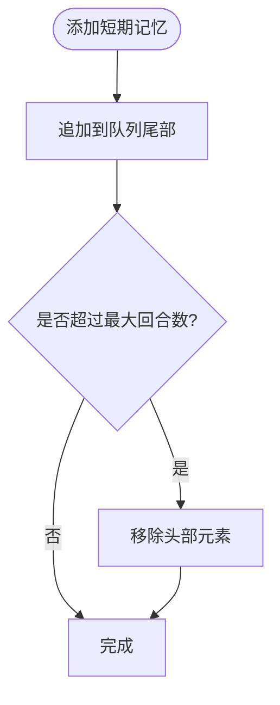
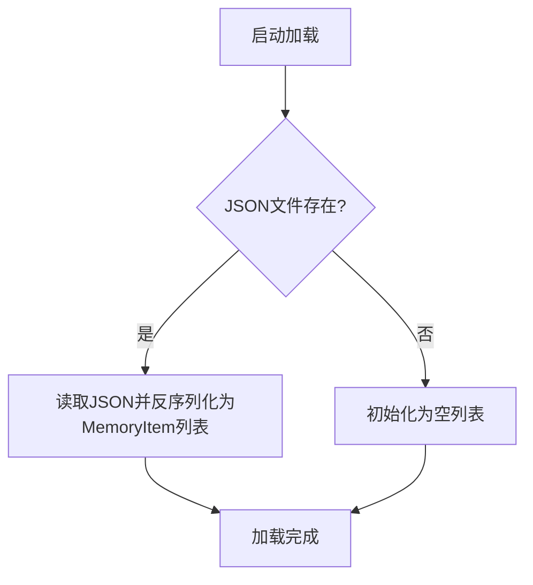
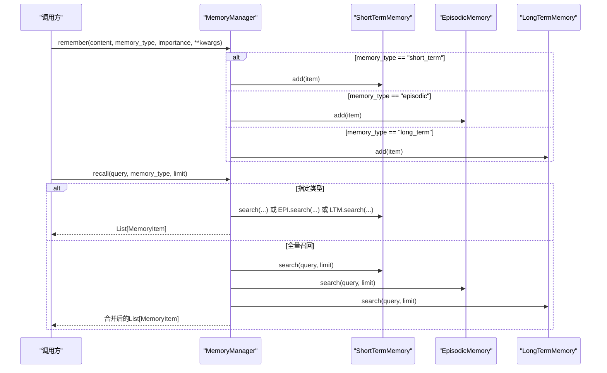
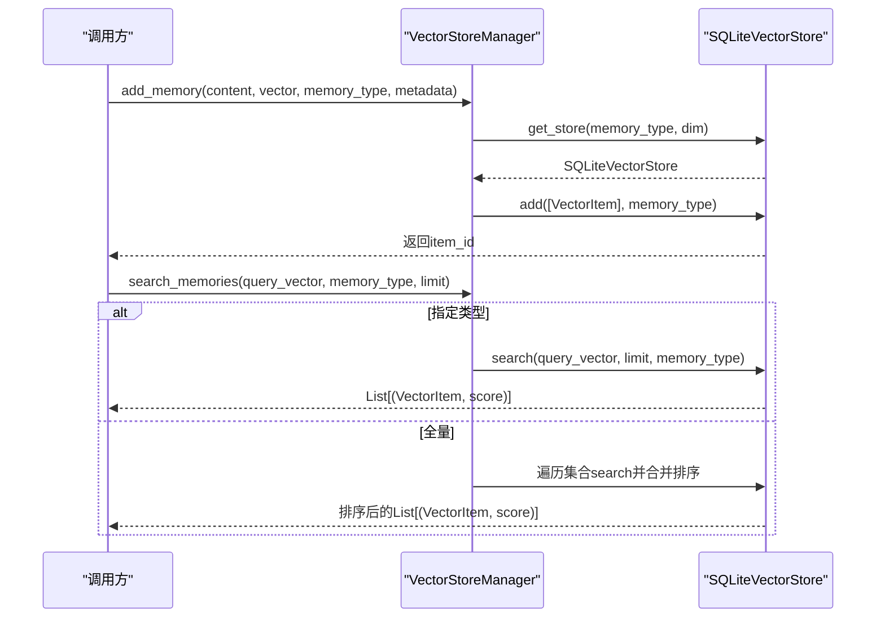
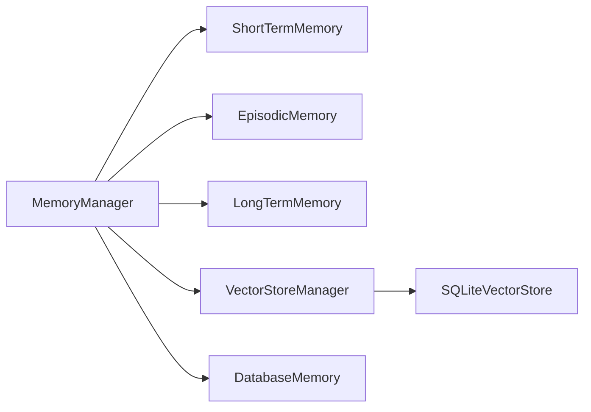

# 记忆管理器核心

<cite>
**本文引用的文件**
- [manager.py](file://core/memory/manager.py)
- [__init__.py](file://core/memory/__init__.py)
- [vector_store.py](file://core/memory/vector_store.py)
- [database_memory.py](file://core/memory/database_memory.py)
- [SKILLS_AND_MEMORY.md](file://docs/SKILLS_AND_MEMORY.md)
- [base.py](file://core/agents/base.py)
- [DATABASE_GUIDE.md](file://docs/DATABASE_GUIDE.md)
</cite>

## 目录
1. [简介](#简介)
2. [项目结构](#项目结构)
3. [核心组件](#核心组件)
4. [架构总览](#架构总览)
5. [组件详解](#组件详解)
6. [依赖关系分析](#依赖关系分析)
7. [性能考量](#性能考量)
8. [故障排查指南](#故障排查指南)
9. [结论](#结论)
10. [附录](#附录)

## 简介
本文件聚焦Secbot记忆管理器的核心组件，系统性解析MemoryManager类的三层记忆架构（短期记忆、情节记忆、长期记忆）统一管理机制，深入剖析MemoryItem数据模型的设计要点（id生成、内容存储、类型标识、重要性评分、元数据管理），并详细说明统一接口设计（remember、recall、get_context_for_agent等）的实现原理与使用场景。同时，结合向量存储模块与数据库记忆封装，给出记忆类型选择策略、重要性权重机制、配置选项、性能优化建议与最佳实践，并通过具体代码示例展示如何在智能体中集成与使用记忆管理器。

## 项目结构
围绕记忆系统的相关文件主要位于core/memory目录，对外通过core/memory/__init__.py统一导出，文档在docs目录中提供了使用示例与集成说明。



图表来源
- [manager.py](file://core/memory/manager.py#L223-L325)
- [vector_store.py](file://core/memory/vector_store.py#L30-L297)
- [database_memory.py](file://core/memory/database_memory.py#L14-L38)
- [__init__.py](file://core/memory/__init__.py#L6-L29)

章节来源
- [__init__.py](file://core/memory/__init__.py#L1-L30)

## 核心组件
- MemoryManager：三层记忆的统一入口，负责记忆的添加、召回、上下文拼装、蒸馏与统计。
- MemoryItem：记忆项的数据模型，包含id、content、type、importance、created_at、metadata等字段。
- ShortTermMemory：短期记忆，基于队列缓冲区，支持最大回合数限制与最近N条检索。
- EpisodicMemory：情节记忆，跨会话事件与经验，基于JSON文件持久化。
- LongTermMemory：长期记忆，持久化知识，基于JSON文件持久化。
- SQLiteVectorStore / VectorStoreManager：可选的向量存储方案，支持向量检索与多集合管理。
- DatabaseMemory：可选的数据库记忆封装，将对话保存至数据库。

章节来源
- [manager.py](file://core/memory/manager.py#L16-L325)
- [vector_store.py](file://core/memory/vector_store.py#L15-L297)
- [database_memory.py](file://core/memory/database_memory.py#L14-L38)

## 架构总览
三层记忆架构遵循“当前会话上下文（短期）—跨会话经验（情节）—持久知识（长期）”的层次化设计，MemoryManager作为统一协调者，既可直接使用文本检索，也可配合向量存储实现更高效的相似度检索；同时提供与数据库记忆的桥接，满足不同场景下的持久化需求。

```mermaid
classDiagram
class MemoryItem {
+string id
+string content
+string type
+float importance
+string created_at
+dict metadata
+to_dict() dict
}
class BaseMemoryStore {
<<abstract>>
+add(item) void
+get(limit) MemoryItem[]
+search(query, limit) MemoryItem[]
+clear() void
}
class ShortTermMemory {
+int max_turns
+buffer deque
+add(item) void
+get(limit) MemoryItem[]
+search(query, limit) MemoryItem[]
+clear() void
+get_recent(n) MemoryItem[]
}
class EpisodicMemory {
+string storage_path
+episodes MemoryItem[]
+add(item) void
+get(limit) MemoryItem[]
+search(query, limit) MemoryItem[]
+clear() void
+add_episode(event, outcome, target) void
-_load() void
-_save() void
}
class LongTermMemory {
+string storage_path
+knowledge MemoryItem[]
+add(item) void
+get(limit) MemoryItem[]
+search(query, limit) MemoryItem[]
+clear() void
+add_knowledge(fact, category, importance) void
-_load() void
-_save() void
}
class MemoryManager {
+remember(content, memory_type, importance, **kwargs) void
+recall(query, memory_type, limit) MemoryItem[]
+get_context_for_agent(query) string
+distill_from_conversation(conversation, summary) void
+clear_all() void
+get_stats() dict
}
class SQLiteVectorStore {
+add(items, collection) void
+search(query_vector, limit, collection, threshold) List
+get(item_id) VectorItem
+delete(item_id) bool
+clear(collection) void
+count() int
+list_collections() str[]
+close() void
}
class VectorStoreManager {
+get_store(collection, dimension) SQLiteVectorStore
+add_memory(content, vector, memory_type, metadata) string
+search_memories(query_vector, memory_type, limit) List
+get_stats() dict
}
class DatabaseMemory {
+save_conversation(user_message, assistant_message) void
}
MemoryManager --> ShortTermMemory
MemoryManager --> EpisodicMemory
MemoryManager --> LongTermMemory
MemoryManager --> MemoryItem
VectorStoreManager --> SQLiteVectorStore
DatabaseMemory -->|"依赖"| DatabaseManager
```

图表来源
- [manager.py](file://core/memory/manager.py#L16-L325)
- [vector_store.py](file://core/memory/vector_store.py#L15-L297)
- [database_memory.py](file://core/memory/database_memory.py#L14-L38)

## 组件详解

### MemoryItem 数据模型
- 字段设计
  - id：全局唯一标识，采用UUID生成，确保去重与可追踪。
  - content：记忆内容字符串，作为检索与上下文拼装的基础。
  - type：记忆类型标识，取值为“short_term”、“episodic”、“long_term”，用于区分存储与检索范围。
  - importance：重要性评分，范围[0,1]，用于排序与筛选，影响召回优先级与上下文权重。
  - created_at：UTC时间戳，记录创建时间，便于排序与统计。
  - metadata：字典类型的元数据，承载分类、来源、附加属性等扩展信息。
- 序列化：提供to_dict方法，便于持久化与传输。
- 复杂度与性能
  - 字符串匹配与过滤：O(N)遍历，N为对应存储中的记忆条目数。
  - 时间复杂度受存储规模与limit限制，建议配合向量检索降低线性扫描成本。

章节来源
- [manager.py](file://core/memory/manager.py#L16-L28)

### BaseMemoryStore 抽象层
- 规范统一接口：add、get、search、clear，保证各记忆存储实现的一致性。
- 异步设计：面向I/O密集型（文件/数据库）场景，采用async/await提升并发能力。

章节来源
- [manager.py](file://core/memory/manager.py#L31-L49)

### ShortTermMemory（短期记忆）
- 存储介质：内存中的双端队列（deque），支持最大回合数限制，自动截断超出部分。
- 查询策略：大小写无关的子串匹配，支持limit限制返回数量。
- 最近N条：提供get_recent便捷方法，便于快速获取最新上下文。
- 适用场景：当前会话的上下文保留、临时状态、近期交互摘要。



图表来源
- [manager.py](file://core/memory/manager.py#L51-L84)

章节来源
- [manager.py](file://core/memory/manager.py#L51-L84)

### EpisodicMemory（情节记忆）
- 存储介质：JSON文件，按条目序列化持久化，启动时自动加载。
- 查询策略：大小写无关的子串匹配，支持limit限制返回数量。
- 特殊方法：
  - add_episode：便捷添加事件片段，设置固定重要性与元数据（如outcome、target）。
- 适用场景：跨会话的经验与事件记录，如某次扫描结果、攻击尝试与结果等。



图表来源
- [manager.py](file://core/memory/manager.py#L86-L152)

章节来源
- [manager.py](file://core/memory/manager.py#L86-L152)

### LongTermMemory（长期记忆）
- 存储介质：JSON文件，持久化知识库。
- 查询策略：大小写无关的子串匹配，支持limit限制返回数量。
- 特殊方法：
  - add_knowledge：便捷添加知识，支持分类与重要性评分。
- 适用场景：通用知识、规则、模式与经验总结。

章节来源
- [manager.py](file://core/memory/manager.py#L154-L221)

### MemoryManager（统一记忆管理器）
- 统一入口：持有三个记忆存储实例，提供统一的remember/recall/get_context_for_agent等方法。
- remember
  - 根据memory_type路由到对应存储，支持传入任意metadata关键字参数。
- recall
  - 支持按类型召回或全量召回，内部分别调用各存储的search，最后合并返回。
- get_context_for_agent
  - 将召回的记忆按类型分组，生成结构化上下文字符串，便于注入到智能体提示词中。
- distill_from_conversation
  - 将对话摘要转化为情节记忆，便于后续检索与复用。
- clear_all / get_stats
  - 提供清空与统计能力，便于运维与监控。



图表来源
- [manager.py](file://core/memory/manager.py#L231-L268)

章节来源
- [manager.py](file://core/memory/manager.py#L223-L325)

### 向量存储模块（可选）
- SQLiteVectorStore
  - 基于sqlite-vec/sqlite-vss的向量检索，支持BLOB向量存储与ANN索引。
  - 提供add/search/get/delete/clear/count/list_collections等操作。
  - 当sqlite-vec不可用时回退为纯量计算（余弦相似度）。
- VectorStoreManager
  - 统一管理多个集合（collection），按维度动态创建存储实例。
  - 提供add_memory与search_memories，支持按类型或全量检索。



图表来源
- [vector_store.py](file://core/memory/vector_store.py#L239-L297)

章节来源
- [vector_store.py](file://core/memory/vector_store.py#L30-L297)

### 数据库记忆封装（可选）
- DatabaseMemory
  - 基于DatabaseManager保存对话，便于与数据库历史记录一致化管理。
  - 适用于需要将记忆与对话历史统一存储的场景。

章节来源
- [database_memory.py](file://core/memory/database_memory.py#L14-L38)

## 依赖关系分析
- 内聚性
  - MemoryManager与各记忆存储之间通过BaseMemoryStore抽象耦合，内聚良好。
  - 向量存储与数据库记忆作为可选扩展，不改变核心接口。
- 耦合度
  - MemoryManager对三种存储实现强依赖，但通过统一接口隔离了具体实现差异。
  - 向量存储与数据库记忆通过各自管理器与MemoryManager弱耦合。
- 外部依赖
  - 文件系统（JSON持久化）、SQLite（向量存储）、loguru（日志）。
- 循环依赖
  - 未发现循环依赖，模块边界清晰。



图表来源
- [manager.py](file://core/memory/manager.py#L223-L325)
- [vector_store.py](file://core/memory/vector_store.py#L239-L297)
- [database_memory.py](file://core/memory/database_memory.py#L14-L38)

## 性能考量
- 文本检索
  - 短期/情节/长期记忆均采用线性扫描与子串匹配，时间复杂度O(N)。
  - 建议在大规模数据场景下引入向量检索（SQLiteVectorStore），通过相似度阈值与limit控制召回规模。
- I/O优化
  - JSON文件读写建议批量操作，避免频繁落盘；必要时使用异步写入。
- 内存占用
  - 短期记忆使用deque并限制max_turns，防止无限增长。
  - 长期/情节记忆建议定期清理不必要条目，控制文件体积。
- 向量检索
  - sqlite-vec可用时启用ANN索引；不可用时采用余弦相似度回退，注意性能差异。
  - 向量维度与集合数量会影响查询性能，建议按需拆分集合与维度。
- 日志与可观测性
  - 利用get_stats输出各存储计数，辅助容量规划与异常定位。

[本节为通用性能建议，不直接分析具体文件]

## 故障排查指南
- JSON持久化失败
  - 现象：加载/保存情节/长期记忆时报错。
  - 排查：检查storage_path权限、磁盘空间、文件格式；查看日志warning/error。
- 向量存储初始化失败
  - 现象：sqlite-vec未安装导致ANN不可用，回退为纯量计算。
  - 排查：确认sqlite-vec/sqlite-vss安装；检查vec_ann函数可用性。
- 回调结果为空
  - 现象：recall返回空列表。
  - 排查：确认query大小写无关匹配逻辑；检查limit是否过小；确认记忆类型是否正确。
- 上下文拼装为空
  - 现象：get_context_for_agent返回空字符串。
  - 排查：确认recall返回非空；检查类型分组逻辑。
- 数据库对话保存异常
  - 现象：save_conversation失败。
  - 排查：确认DatabaseManager可用；检查会话ID与agent类型一致性。

章节来源
- [manager.py](file://core/memory/manager.py#L94-L104)
- [manager.py](file://core/memory/manager.py#L162-L172)
- [manager.py](file://core/memory/manager.py#L174-L187)
- [vector_store.py](file://core/memory/vector_store.py#L80-L88)
- [database_memory.py](file://core/memory/database_memory.py#L28-L37)

## 结论
Secbot记忆管理器以MemoryManager为核心，构建了短期、情节与长期三层记忆的统一管理体系。MemoryItem作为数据载体，提供灵活的元数据与重要性评分机制；MemoryManager通过统一接口实现记忆的添加、召回与上下文拼装，并可选接入向量存储与数据库记忆，满足不同场景下的检索与持久化需求。结合本文提供的配置建议、性能优化与最佳实践，可在实际智能体集成中获得稳定、可扩展且高性能的记忆能力。

[本节为总结性内容，不直接分析具体文件]

## 附录

### 统一接口与使用场景
- remember
  - 场景：记录新发现、新结论、新对话片段。
  - 选择策略：新发现用episodic，临时上下文用short_term，通用知识用long_term。
- recall
  - 场景：根据关键词检索相关记忆，支持按类型或全量召回。
- get_context_for_agent
  - 场景：将记忆拼装为结构化上下文，注入智能体提示词。
- distill_from_conversation
  - 场景：将长对话摘要化为情节记忆，便于后续检索。

章节来源
- [manager.py](file://core/memory/manager.py#L231-L297)
- [SKILLS_AND_MEMORY.md](file://docs/SKILLS_AND_MEMORY.md#L77-L141)

### 记忆类型选择策略与重要性权重
- 类型选择
  - short_term：当前会话上下文，临时性强，无需持久化。
  - episodic：跨会话事件与经验，强调“发生了什么+结果如何”。
  - long_term：通用知识与规则，强调“应该怎么做”。
- 重要性权重
  - importance越高，越容易在召回中被优先展示；可用于上下文权重分配。
  - 建议：关键发现（如漏洞、策略变更）设为较高权重；常规信息设为中低权重。

章节来源
- [manager.py](file://core/memory/manager.py#L16-L28)
- [manager.py](file://core/memory/manager.py#L231-L248)

### 配置选项与最佳实践
- 配置项
  - ShortTermMemory.max_turns：短期记忆最大回合数，默认10。
  - EpisodicMemory.storage_path / LongTermMemory.storage_path：JSON文件路径。
  - VectorStoreManager：按集合与维度管理向量存储。
  - DatabaseMemory：依赖DatabaseManager，统一保存对话。
- 最佳实践
  - 将短期记忆用于当前轮次上下文，定期清理。
  - 将情节记忆用于事件与经验沉淀，设置合理重要性与元数据。
  - 将长期记忆用于知识库建设，定期归档与清理。
  - 在大规模检索场景引入向量存储，结合阈值与limit控制召回质量与性能。
  - 使用get_stats监控各存储规模，制定容量与清理策略。

章节来源
- [manager.py](file://core/memory/manager.py#L54-L56)
- [manager.py](file://core/memory/manager.py#L89-L92)
- [manager.py](file://core/memory/manager.py#L157-L160)
- [vector_store.py](file://core/memory/vector_store.py#L242-L253)
- [database_memory.py](file://core/memory/database_memory.py#L17-L26)

### 在智能体中的集成示例
- 基础智能体与记忆
  - 智能体可将self.memory替换为MemoryManager实例，实现对话历史与记忆的统一管理。
- 示例流程
  - 加载技能与记忆管理器。
  - 根据用户输入召回相关记忆并拼装上下文。
  - 构建提示词并处理请求。
  - 将用户输入作为短期记忆保存，以便后续上下文使用。

章节来源
- [base.py](file://core/agents/base.py#L20-L26)
- [base.py](file://core/agents/base.py#L121-L124)
- [SKILLS_AND_MEMORY.md](file://docs/SKILLS_AND_MEMORY.md#L115-L141)