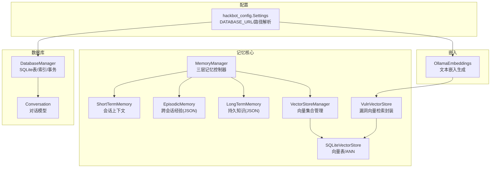
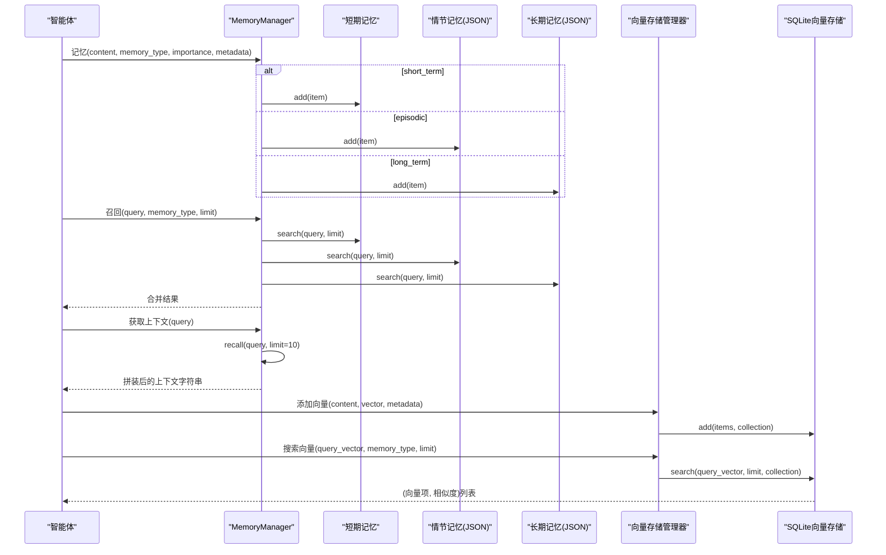
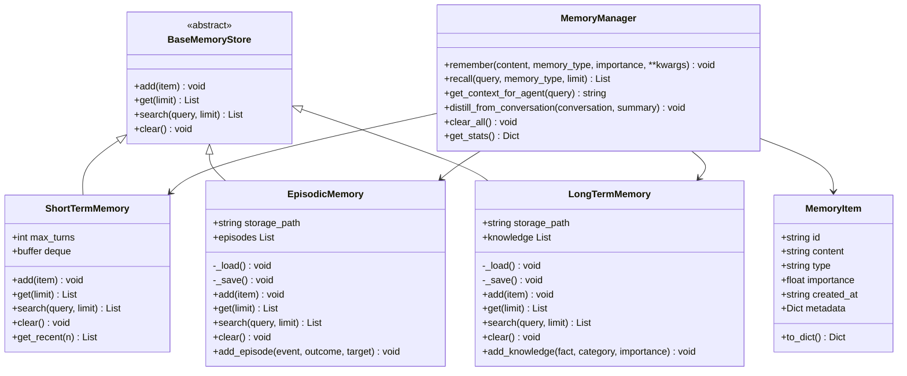
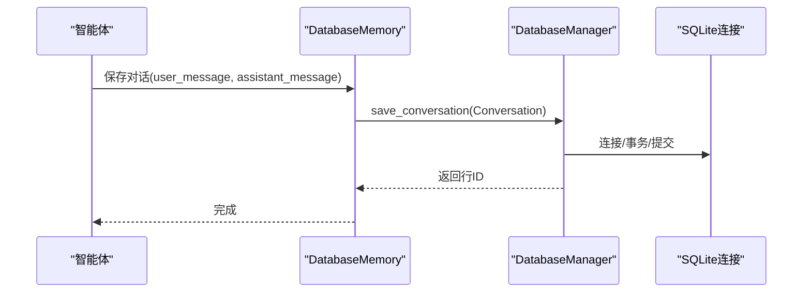
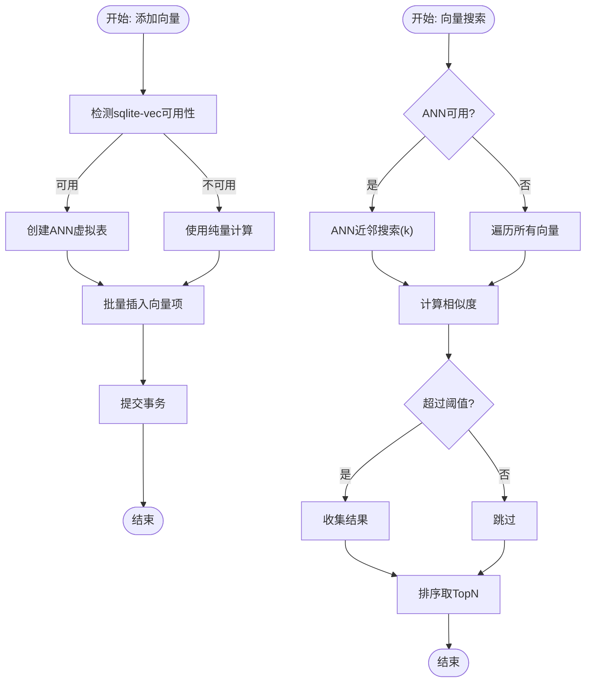
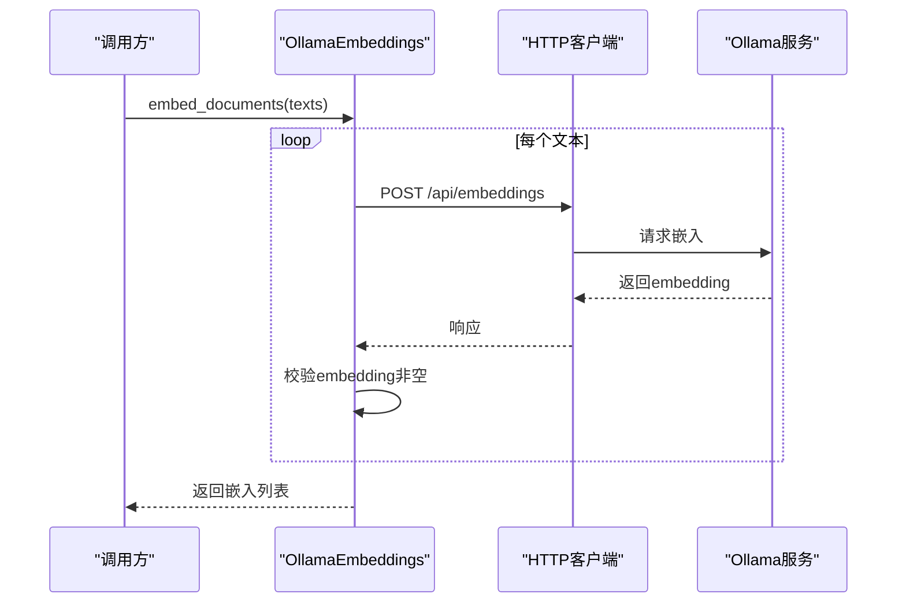
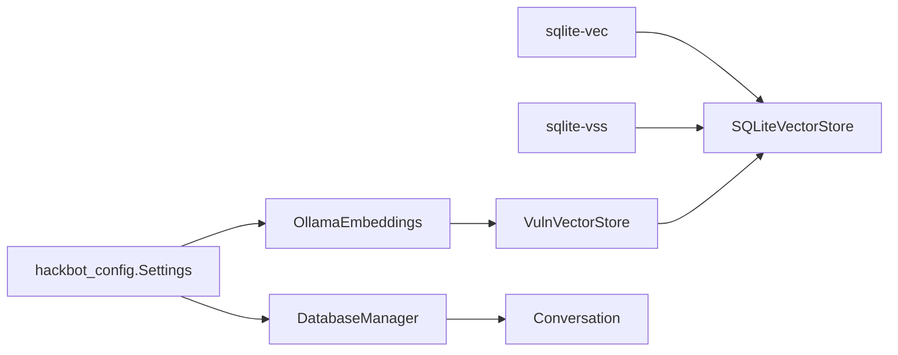

# 记忆管理系统

<cite>
**本文引用的文件**
- [core/memory/manager.py](file://core/memory/manager.py)
- [core/memory/vector_store.py](file://core/memory/vector_store.py)
- [core/memory/database_memory.py](file://core/memory/database_memory.py)
- [core/vuln_db/vuln_vector_store.py](file://core/vuln_db/vuln_vector_store.py)
- [database/manager.py](file://database/manager.py)
- [database/models.py](file://database/models.py)
- [utils/embeddings.py](file://utils/embeddings.py)
- [hackbot_config/__init__.py](file://hackbot_config/__init__.py)
- [docs/SKILLS_AND_MEMORY.md](file://docs/SKILLS_AND_MEMORY.md)
- [uv.lock](file://uv.lock)
</cite>

## 目录
1. [简介](#简介)
2. [项目结构](#项目结构)
3. [核心组件](#核心组件)
4. [架构总览](#架构总览)
5. [组件详解](#组件详解)
6. [依赖关系分析](#依赖关系分析)
7. [性能与优化](#性能与优化)
8. [故障排查指南](#故障排查指南)
9. [结论](#结论)
10. [附录](#附录)

## 简介
本文件面向Secbot的记忆管理系统，系统采用“三层记忆架构”与“向量检索增强”的混合方案，覆盖会话上下文、跨会话经验与持久知识，并通过SQLite向量扩展实现本地化的语义检索。文档围绕以下目标展开：
- 深入解释MemoryManager类的架构与职责边界
- 详述短期、情节与长期记忆的存储策略与生命周期
- 说明数据库内存存储（对话历史）与知识持久化方案
- 全面阐述向量存储系统（sqlite-vec/sqlite-vss）的集成、嵌入管理与相似度搜索
- 提供配置与优化建议、故障恢复与最佳实践

## 项目结构
与记忆系统相关的关键模块分布如下：
- 核心记忆：core/memory/manager.py、core/memory/vector_store.py、core/memory/database_memory.py
- 漏洞向量检索：core/vuln_db/vuln_vector_store.py
- 数据库存储：database/manager.py、database/models.py
- 嵌入生成：utils/embeddings.py
- 配置与路径：hackbot_config/__init__.py
- 文档与使用示例：docs/SKILLS_AND_MEMORY.md
- 向量扩展依赖：uv.lock 中 sqlite-vec 与 sqlite-vss

**图表来源**
- [core/memory/manager.py](file://core/memory/manager.py#L223-L325)
- [core/memory/vector_store.py](file://core/memory/vector_store.py#L30-L297)
- [core/memory/database_memory.py](file://core/memory/database_memory.py#L14-L38)
- [core/vuln_db/vuln_vector_store.py](file://core/vuln_db/vuln_vector_store.py#L18-L107)
- [database/manager.py](file://database/manager.py#L26-L203)
- [database/models.py](file://database/models.py#L9-L18)
- [utils/embeddings.py](file://utils/embeddings.py#L11-L80)
- [hackbot_config/__init__.py](file://hackbot_config/__init__.py#L35-L44)

**章节来源**
- [core/memory/manager.py](file://core/memory/manager.py#L1-L325)
- [core/memory/vector_store.py](file://core/memory/vector_store.py#L1-L297)
- [core/memory/database_memory.py](file://core/memory/database_memory.py#L1-L38)
- [core/vuln_db/vuln_vector_store.py](file://core/vuln_db/vuln_vector_store.py#L1-L107)
- [database/manager.py](file://database/manager.py#L1-L719)
- [database/models.py](file://database/models.py#L1-L90)
- [utils/embeddings.py](file://utils/embeddings.py#L1-L80)
- [hackbot_config/__init__.py](file://hackbot_config/__init__.py#L1-L250)
- [docs/SKILLS_AND_MEMORY.md](file://docs/SKILLS_AND_MEMORY.md#L1-L141)
- [uv.lock](file://uv.lock#L3630-L3649)

## 核心组件
- MemoryManager：三层记忆的统一入口，负责记忆创建、召回、上下文拼装、蒸馏与清理
- ShortTermMemory：会话内上下文，基于双端队列自动截断
- EpisodicMemory/LongTermMemory：跨会话经验与持久知识，基于JSON文件持久化
- VectorStoreManager/SQLiteVectorStore：基于SQLite的向量存储，支持sqlite-vec/sqlite-vss的ANN加速
- VulnVectorStore：面向漏洞库的向量检索封装
- DatabaseManager/Conversation：对话历史的数据库持久化
- OllamaEmbeddings：文本嵌入生成接口
- hackbot_config.Settings：数据库路径与嵌入模型等配置解析

**章节来源**
- [core/memory/manager.py](file://core/memory/manager.py#L223-L325)
- [core/memory/vector_store.py](file://core/memory/vector_store.py#L30-L297)
- [core/memory/database_memory.py](file://core/memory/database_memory.py#L14-L38)
- [core/vuln_db/vuln_vector_store.py](file://core/vuln_db/vuln_vector_store.py#L18-L107)
- [database/manager.py](file://database/manager.py#L26-L203)
- [utils/embeddings.py](file://utils/embeddings.py#L11-L80)
- [hackbot_config/__init__.py](file://hackbot_config/__init__.py#L162-L246)

## 架构总览
三层记忆与向量检索协同工作，MemoryManager作为中枢协调：
- 短期记忆用于当前会话上下文，快速检索与拼装
- 情节记忆与长期记忆用于跨会话经验与知识沉淀，支持JSON持久化
- 向量存储用于语义检索与相似度匹配，支持sqlite-vec/sqlite-vss加速
- 数据库存储用于对话历史与审计留痕等结构化数据

**图表来源**
- [core/memory/manager.py](file://core/memory/manager.py#L231-L316)
- [core/memory/vector_store.py](file://core/memory/vector_store.py#L98-L175)
- [core/memory/vector_store.py](file://core/memory/vector_store.py#L255-L286)

## 组件详解

### MemoryManager 与三层记忆
- MemoryItem：统一的记忆条目，包含内容、类型、重要度、时间戳与元数据
- BaseMemoryStore：抽象接口，定义add/get/search/clear
- ShortTermMemory：基于deque，支持最大回合数限制，自动截断；提供最近N条访问
- EpisodicMemory/LongTermMemory：基于JSON文件，支持加载/保存；提供add/get/search/clear与便捷方法（如add_episode/add_knowledge）

**图表来源**
- [core/memory/manager.py](file://core/memory/manager.py#L16-L325)

**章节来源**
- [core/memory/manager.py](file://core/memory/manager.py#L16-L325)

### 数据库内存存储（对话历史）
- DatabaseMemory：封装对话保存，接收用户消息与助手消息，写入数据库
- DatabaseManager：负责SQLite数据库初始化、表结构与索引、事务与异常处理
- Conversation模型：对话记录的数据模型

**图表来源**
- [core/memory/database_memory.py](file://core/memory/database_memory.py#L28-L38)
- [database/manager.py](file://database/manager.py#L207-L228)
- [database/models.py](file://database/models.py#L9-L18)

**章节来源**
- [core/memory/database_memory.py](file://core/memory/database_memory.py#L1-L38)
- [database/manager.py](file://database/manager.py#L26-L203)
- [database/models.py](file://database/models.py#L1-L90)

### 向量存储系统（sqlite-vec/sqlite-vss）
- VectorItem：向量项数据结构，包含id/content/vector/metadata/created_at
- SQLiteVectorStore：向量表与集合管理，支持sqlite-vec/sqlite-vss的ANN虚拟表；提供add/search/get/delete/clear/count/list_collections
- VectorStoreManager：多集合统一管理，按维度与集合名缓存存储实例
- VulnVectorStore：面向漏洞库的封装，将漏洞实体与嵌入写入向量库并支持相似度检索

**图表来源**
- [core/memory/vector_store.py](file://core/memory/vector_store.py#L45-L175)
- [core/memory/vector_store.py](file://core/memory/vector_store.py#L239-L297)

**章节来源**
- [core/memory/vector_store.py](file://core/memory/vector_store.py#L1-L297)
- [core/vuln_db/vuln_vector_store.py](file://core/vuln_db/vuln_vector_store.py#L1-L107)

### 嵌入生成与配置
- OllamaEmbeddings：通过HTTP调用Ollama生成文本嵌入，支持单文本与批量
- hackbot_config.Settings：解析DATABASE_URL确定数据库路径，提供Ollama嵌入模型与基础URL等配置

**图表来源**
- [utils/embeddings.py](file://utils/embeddings.py#L30-L70)
- [hackbot_config/__init__.py](file://hackbot_config/__init__.py#L162-L180)

**章节来源**
- [utils/embeddings.py](file://utils/embeddings.py#L1-L80)
- [hackbot_config/__init__.py](file://hackbot_config/__init__.py#L162-L246)

## 依赖关系分析
- 向量扩展依赖：项目声明了sqlite-vec与sqlite-vss，用于启用sqlite-vec的ANN虚拟表与sqlite-vss的向量存储能力
- 存储耦合：MemoryManager与VectorStoreManager解耦，通过集合维度隔离不同类型的向量
- 数据库耦合：DatabaseManager集中管理表结构、索引与事务，避免分散的SQL管理

**图表来源**
- [uv.lock](file://uv.lock#L3630-L3649)
- [core/memory/vector_store.py](file://core/memory/vector_store.py#L61-L67)
- [utils/embeddings.py](file://utils/embeddings.py#L14-L16)
- [core/vuln_db/vuln_vector_store.py](file://core/vuln_db/vuln_vector_store.py#L28-L29)
- [database/manager.py](file://database/manager.py#L29-L58)
- [hackbot_config/__init__.py](file://hackbot_config/__init__.py#L35-L44)

**章节来源**
- [uv.lock](file://uv.lock#L3630-L3649)
- [core/memory/vector_store.py](file://core/memory/vector_store.py#L61-L67)
- [utils/embeddings.py](file://utils/embeddings.py#L14-L16)
- [core/vuln_db/vuln_vector_store.py](file://core/vuln_db/vuln_vector_store.py#L28-L29)
- [database/manager.py](file://database/manager.py#L29-L58)
- [hackbot_config/__init__.py](file://hackbot_config/__init__.py#L35-L44)

## 性能与优化
- 向量搜索优化
  - 优先安装sqlite-vec/sqlite-vss以启用ANN虚拟表，显著提升大规模向量的近邻搜索性能
  - 设置合理的阈值与TopK，避免返回过多低质量结果
  - 按集合与维度隔离向量，减少无关扫描范围
- 存储容量管理
  - JSON持久化（情节/长期记忆）建议定期归档与清理，避免文件膨胀
  - 向量存储可通过clear按集合清理，或在高负载场景下重建集合
- 数据库性能
  - 对会话ID与时间戳建立索引，有助于对话历史查询
  - 使用上下文管理器与事务，保证一致性与原子性
- 嵌入性能
  - 批量生成嵌入，减少HTTP往返次数
  - 合理设置超时与重试策略，避免阻塞主线程

[本节为通用性能建议，不直接分析具体文件]

## 故障排查指南
- 向量搜索无结果或缓慢
  - 检查sqlite-vec/sqlite-vss是否安装；若未安装，系统退化为纯量计算
  - 调整相似度阈值与TopK参数
  - 确认集合与维度匹配
- 嵌入生成失败
  - 检查Ollama服务连通性与模型可用性
  - 查看超时与异常日志
- JSON持久化异常
  - 检查文件权限与目录存在性
  - 关注保存/加载过程中的异常日志
- 数据库异常
  - 关注事务回滚与连接关闭逻辑
  - 确认索引与表结构初始化成功

**章节来源**
- [core/memory/vector_store.py](file://core/memory/vector_store.py#L80-L88)
- [utils/embeddings.py](file://utils/embeddings.py#L63-L70)
- [core/memory/manager.py](file://core/memory/manager.py#L94-L120)
- [database/manager.py](file://database/manager.py#L60-L74)

## 结论
Secbot的记忆管理系统通过“三层记忆架构”与“向量检索增强”，实现了从会话上下文到跨会话经验再到持久知识的完整闭环，并结合SQLite本地化能力与sqlite-vec/sqlite-vss加速，兼顾易部署与高性能。配合数据库对话历史与配置驱动的嵌入生成，系统在安全性、可维护性与扩展性方面具备良好平衡。

[本节为总结性内容，不直接分析具体文件]

## 附录

### 记忆系统生命周期管理
- 创建：通过MemoryManager.remember写入短期/情节/长期记忆
- 更新：JSON持久化支持覆盖写入；向量存储使用INSERT OR REPLACE
- 删除：短期记忆清空队列；JSON持久化清空并落盘；向量存储按集合清空
- 清理：定期归档/清理JSON文件与向量集合，保持系统整洁

**章节来源**
- [core/memory/manager.py](file://core/memory/manager.py#L231-L316)
- [core/memory/vector_store.py](file://core/memory/vector_store.py#L196-L210)

### 配置与路径
- 数据库路径解析：支持DATABASE_URL与相对路径，确保读写一致
- 嵌入模型与基础URL：通过配置中心统一管理

**章节来源**
- [hackbot_config/__init__.py](file://hackbot_config/__init__.py#L35-L44)
- [hackbot_config/__init__.py](file://hackbot_config/__init__.py#L162-L180)

### 最佳实践与使用示例
- 在智能体处理流程中，先获取相关技能，再拼接记忆上下文，最后将新消息写入短期记忆
- 对话历史建议通过DatabaseMemory统一保存，便于审计与回放
- 漏洞库向量检索建议预构建集合，定期刷新嵌入

**章节来源**
- [docs/SKILLS_AND_MEMORY.md](file://docs/SKILLS_AND_MEMORY.md#L115-L141)
- [core/memory/database_memory.py](file://core/memory/database_memory.py#L28-L38)
- [core/vuln_db/vuln_vector_store.py](file://core/vuln_db/vuln_vector_store.py#L35-L66)