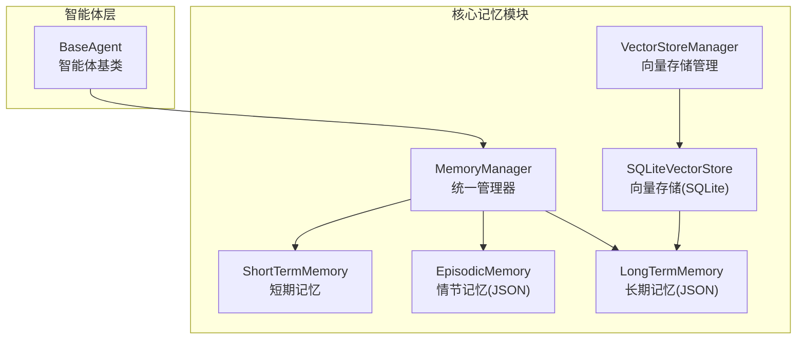
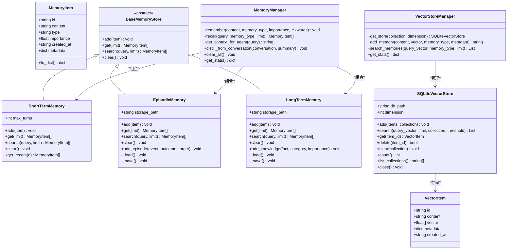
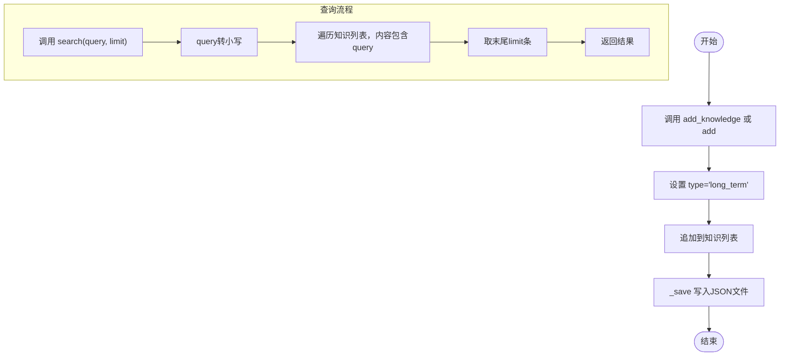
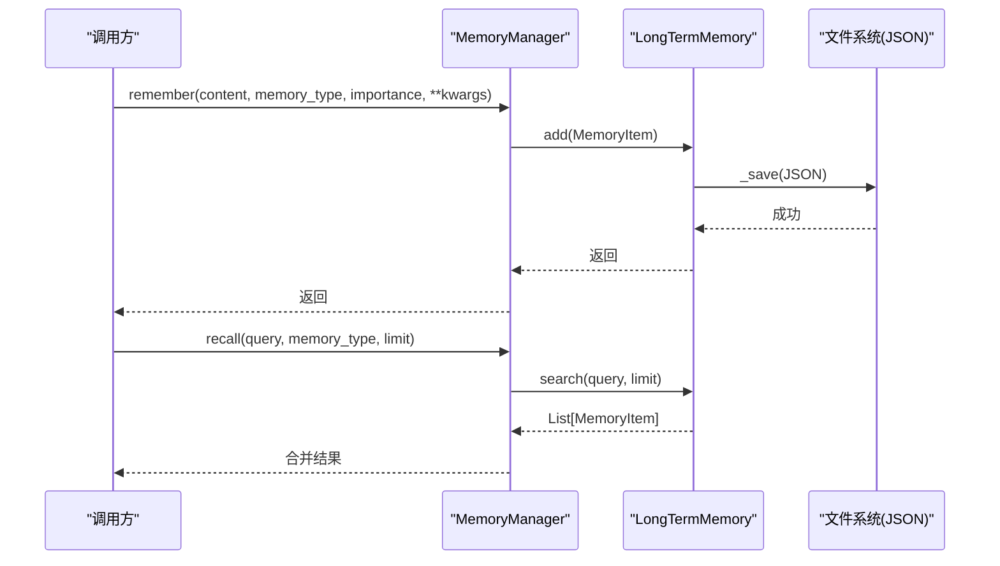
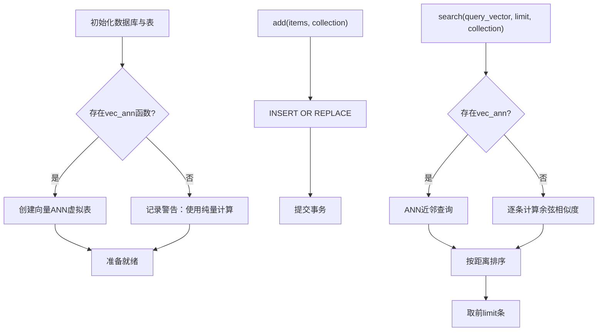
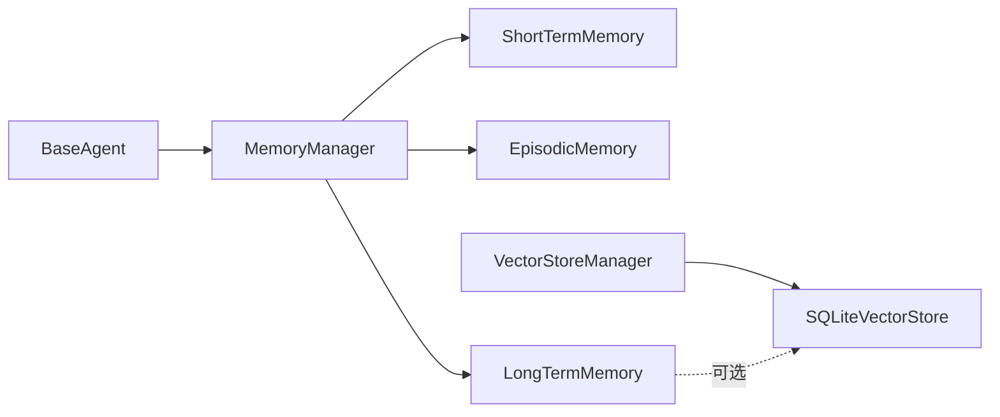

# 长期记忆系统

<cite>
**本文引用的文件**
- [core/memory/manager.py](file://core/memory/manager.py)
- [core/memory/vector_store.py](file://core/memory/vector_store.py)
- [core/memory/database_memory.py](file://core/memory/database_memory.py)
- [core/agents/base.py](file://core/agents/base.py)
- [docs/SKILLS_AND_MEMORY.md](file://docs/SKILLS_AND_MEMORY.md)
</cite>

## 目录
1. [简介](#简介)
2. [项目结构](#项目结构)
3. [核心组件](#核心组件)
4. [架构总览](#架构总览)
5. [详细组件分析](#详细组件分析)
6. [依赖关系分析](#依赖关系分析)
7. [性能考量](#性能考量)
8. [故障排查指南](#故障排查指南)
9. [结论](#结论)
10. [附录](#附录)

## 简介
本文件针对Secbot的长期记忆系统进行深入技术说明，重点围绕LongTermMemory类的设计理念与实现细节展开，涵盖以下方面：
- 基于JSON文件的知识持久化存储与文件组织策略
- 知识分类管理与重要性评估机制
- 长期模式积累与检索优化
- 存储架构与版本管理建议
- 在智能体知识体系中的作用与集成路径
- 知识添加接口、分类管理与查询优化策略
- 实际使用示例与最佳实践

## 项目结构
长期记忆系统位于Python核心模块core/memory中，采用三层记忆架构（短期、情节、长期）与向量存储补充方案并存的设计。核心文件如下：
- core/memory/manager.py：三层记忆架构与MemoryManager统一入口
- core/memory/vector_store.py：SQLite向量存储（sqlite-vec/sqlite-vss）与向量检索
- core/memory/database_memory.py：对话记忆的数据库封装
- core/agents/base.py：智能体基类，承载记忆集成点
- docs/SKILLS_AND_MEMORY.md：技能与记忆系统文档，包含使用示例与架构说明

图表来源
- [core/memory/manager.py](file://core/memory/manager.py#L223-L325)
- [core/memory/vector_store.py](file://core/memory/vector_store.py#L30-L297)
- [core/agents/base.py](file://core/agents/base.py#L17-L34)

章节来源
- [core/memory/manager.py](file://core/memory/manager.py#L1-L325)
- [core/memory/vector_store.py](file://core/memory/vector_store.py#L1-L297)
- [core/memory/database_memory.py](file://core/memory/database_memory.py#L1-L38)
- [core/agents/base.py](file://core/agents/base.py#L1-L125)
- [docs/SKILLS_AND_MEMORY.md](file://docs/SKILLS_AND_MEMORY.md#L64-L141)

## 核心组件
- MemoryItem：记忆单元的数据结构，包含唯一ID、内容、类型、重要性、创建时间与元数据。
- BaseMemoryStore：记忆存储抽象基类，定义add/get/search/clear等统一接口。
- ShortTermMemory：会话内短期上下文，基于双向队列自动截断。
- EpisodicMemory：跨会话事件与经验，基于JSON文件持久化。
- LongTermMemory：持久化知识库，基于JSON文件持久化，支持分类与重要性标注。
- MemoryManager：三层记忆的统一入口，提供remember/recall/get_context_for_agent等高层接口。
- SQLiteVectorStore/VectorStoreManager：SQLite向量存储与管理，支持向量检索与集合管理。

章节来源
- [core/memory/manager.py](file://core/memory/manager.py#L16-L49)
- [core/memory/manager.py](file://core/memory/manager.py#L51-L84)
- [core/memory/manager.py](file://core/memory/manager.py#L86-L152)
- [core/memory/manager.py](file://core/memory/manager.py#L154-L221)
- [core/memory/manager.py](file://core/memory/manager.py#L223-L325)
- [core/memory/vector_store.py](file://core/memory/vector_store.py#L15-L297)

## 架构总览
长期记忆系统采用三层记忆架构与向量检索互补的方案：
- 短期记忆：会话上下文，容量有限，自动截断
- 情节记忆：跨会话事件与经验，JSON文件持久化
- 长期记忆：持久化知识库，JSON文件持久化，支持分类与重要性
- 向量检索：SQLite向量存储，支持相似度检索与集合管理

图表来源
- [core/memory/manager.py](file://core/memory/manager.py#L16-L325)
- [core/memory/vector_store.py](file://core/memory/vector_store.py#L15-L297)

## 详细组件分析

### LongTermMemory：长期记忆核心
- 数据结构
  - 基于MemoryItem，扩展字段：分类(category)、重要性(importance)、创建时间(created_at)、元数据(metadata)
  - JSON文件存储，文件组织策略：按会话/任务维度可扩展，当前默认路径为data/long_term_memory.json
- 存储与加载
  - 加载：启动时读取JSON文件，构造MemoryItem列表
  - 保存：新增/清理后立即写回JSON文件，确保一致性
- 查询与检索
  - 支持全文检索（大小写不敏感）
  - 支持限制返回数量
- 知识管理
  - add_knowledge接口：便捷添加带分类与重要性的知识
  - 元数据管理：支持任意键值对，便于分类与过滤

图表来源
- [core/memory/manager.py](file://core/memory/manager.py#L154-L221)

章节来源
- [core/memory/manager.py](file://core/memory/manager.py#L154-L221)

### EpisodicMemory：情节记忆（跨会话事件）
- 文件组织：data/episodic_memory.json
- 特性：事件片段化存储，支持outcome、target等元数据
- 使用场景：跨会话的经验沉淀与摘要

章节来源
- [core/memory/manager.py](file://core/memory/manager.py#L86-L152)

### ShortTermMemory：短期记忆（会话上下文）
- 容量：固定最大轮次数，超出自动截断
- 使用场景：当前会话的上下文保留与快速检索

章节来源
- [core/memory/manager.py](file://core/memory/manager.py#L51-L84)

### MemoryManager：统一记忆管理器
- remember：根据类型分派到对应存储
- recall：支持按类型检索或全量检索
- get_context_for_agent：按类型优先级拼装上下文字符串
- distill_from_conversation：从对话蒸馏出情节记忆
- clear_all：清空所有记忆
- get_stats：统计各类型记忆数量

图表来源
- [core/memory/manager.py](file://core/memory/manager.py#L231-L268)

章节来源
- [core/memory/manager.py](file://core/memory/manager.py#L223-L325)

### SQLiteVectorStore：向量检索补充
- 用途：为长期记忆提供语义相似度检索能力
- 特性：SQLite本地存储，支持sqlite-vec/sqlite-vss功能检测与降级
- 管理：VectorStoreManager按集合维度管理多个SQLiteVectorStore实例

图表来源
- [core/memory/vector_store.py](file://core/memory/vector_store.py#L45-L175)

章节来源
- [core/memory/vector_store.py](file://core/memory/vector_store.py#L30-L297)

### DatabaseMemory：对话记忆数据库封装
- 用途：将智能体对话保存至数据库，供后续检索与分析
- 集成点：与DatabaseManager协作，按会话与智能体类型归档

章节来源
- [core/memory/database_memory.py](file://core/memory/database_memory.py#L14-L38)

## 依赖关系分析
- MemoryManager依赖ShortTermMemory、EpisodicMemory、LongTermMemory
- LongTermMemory与EpisodicMemory均依赖JSON文件I/O
- VectorStoreManager依赖SQLiteVectorStore，后者依赖sqlite3与numpy
- BaseAgent作为智能体基类，可将MemoryManager注入为记忆组件

图表来源
- [core/memory/manager.py](file://core/memory/manager.py#L223-L229)
- [core/memory/vector_store.py](file://core/memory/vector_store.py#L239-L297)
- [core/agents/base.py](file://core/agents/base.py#L20-L34)

章节来源
- [core/memory/manager.py](file://core/memory/manager.py#L223-L325)
- [core/memory/vector_store.py](file://core/memory/vector_store.py#L239-L297)
- [core/agents/base.py](file://core/agents/base.py#L17-L34)

## 性能考量
- JSON文件I/O
  - 优点：实现简单、可移植性强
  - 潜在瓶颈：大文件顺序扫描与全文检索效率较低
  - 优化建议：引入索引字段、分片存储、定期压缩与增量备份
- 向量检索
  - 优点：相似度检索高效，适合大规模知识库
  - 注意：需要sqlite-vec/sqlite-vss扩展，否则退化为逐条计算
- 内存占用
  - ShortTermMemory使用固定长度队列，内存可控
  - 长期记忆JSON加载到内存，建议控制单文件规模或拆分

## 故障排查指南
- JSON文件读写失败
  - 现象：加载/保存长期/情节记忆时出现警告或错误
  - 排查：确认文件路径存在、权限可读写、编码为UTF-8
- 向量检索异常
  - 现象：vec_ann函数不存在导致降级为纯量计算
  - 排查：安装sqlite-vec/sqlite-vss扩展或接受性能退化
- 记忆未生效
  - 现象：调用remember后recall无结果
  - 排查：确认memory_type正确、查询大小写不敏感、limit设置合理

章节来源
- [core/memory/manager.py](file://core/memory/manager.py#L162-L187)
- [core/memory/vector_store.py](file://core/memory/vector_store.py#L80-L88)

## 结论
Secbot的长期记忆系统以三层记忆架构为核心，结合JSON文件持久化与SQLite向量检索，形成兼顾易用性与扩展性的知识管理体系。LongTermMemory通过分类与重要性标注实现知识的有序积累，配合MemoryManager的统一接口，为智能体提供稳定的知识支撑。建议在生产环境中引入索引与分片策略，并结合向量检索提升大规模知识库的查询效率。

## 附录

### 长期记忆在智能体知识体系中的作用
- 领域知识积累：通过add_knowledge持续沉淀规则与经验
- 规则提取：从对话摘要与经验中提炼可复用规则
- 智能决策支持：基于检索到的历史经验与规则辅助决策

章节来源
- [docs/SKILLS_AND_MEMORY.md](file://docs/SKILLS_AND_MEMORY.md#L64-L141)

### 知识添加接口与分类管理
- add_knowledge：便捷添加带分类与重要性的知识
- 元数据管理：通过metadata扩展分类、来源、标签等信息
- 重要性评估：importance字段用于影响检索权重与优先级

章节来源
- [core/memory/manager.py](file://core/memory/manager.py#L210-L221)

### 查询优化策略
- 前缀/关键词索引：在JSON结构中增加索引字段，减少全量扫描
- 分片存储：按主题/项目拆分文件，降低单文件规模
- 向量检索：对高频查询与语义检索使用SQLiteVectorStore
- 增量备份：定期备份JSON文件，防止意外丢失

章节来源
- [core/memory/manager.py](file://core/memory/manager.py#L154-L221)
- [core/memory/vector_store.py](file://core/memory/vector_store.py#L124-L175)

### 使用示例（路径指引）
- 初始化与使用MemoryManager：参见文档示例
- 在智能体中集成：参考BaseAgent与MemoryManager的组合方式

章节来源
- [docs/SKILLS_AND_MEMORY.md](file://docs/SKILLS_AND_MEMORY.md#L77-L141)
- [core/agents/base.py](file://core/agents/base.py#L20-L34)