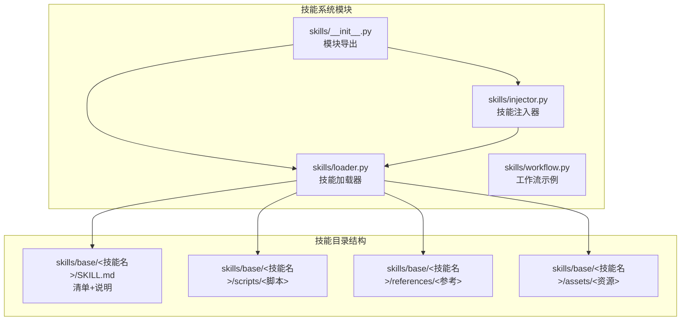
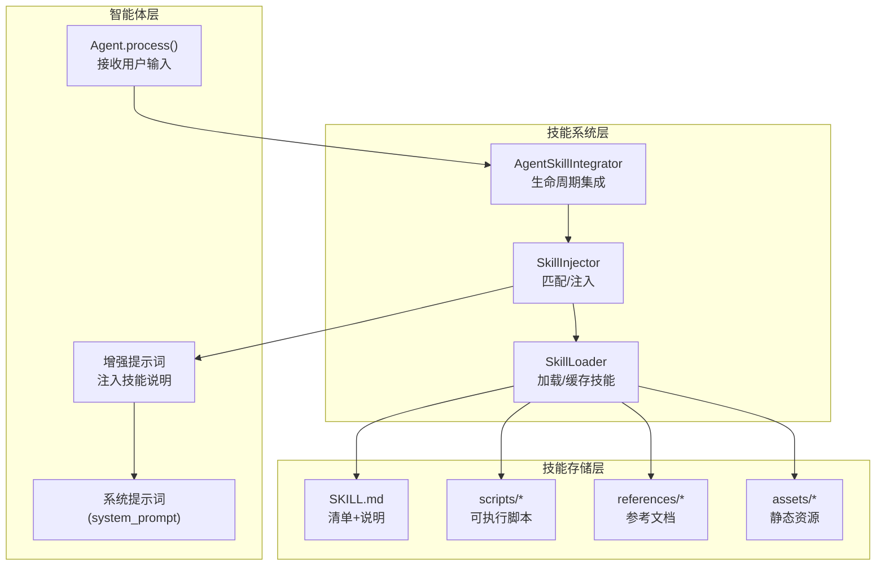
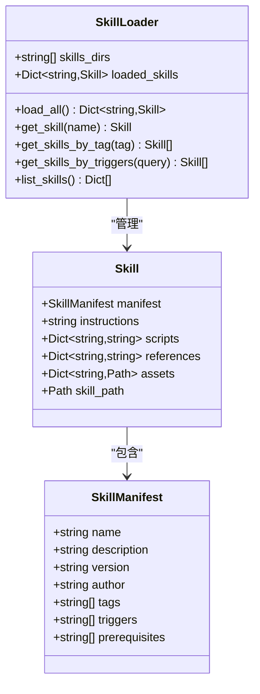
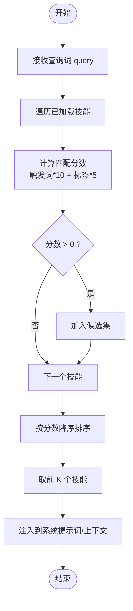
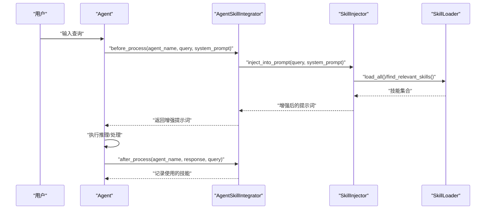

# 技能系统增强

<cite>
**本文档引用的文件**
- [skills/__init__.py](file://skills/__init__.py)
- [skills/loader.py](file://skills/loader.py)
- [skills/injector.py](file://skills/injector.py)
- [skills/workflow.py](file://skills/workflow.py)
- [skills/base/nmap-usage/SKILL.md](file://skills/base/nmap-usage/SKILL.md)
- [skills/base/system-commands/SKILL.md](file://skills/base/system-commands/SKILL.md)
- [skills/base/command-execution/SKILL.md](file://skills/base/command-execution/SKILL.md)
- [docs/SKILLS_AND_MEMORY.md](file://docs/SKILLS_AND_MEMORY.md)
- [docs/design-paradigms/skill-plugin-system.md](file://docs/design-paradigms/skill-plugin-system.md)
- [core/agents/base.py](file://core/agents/base.py)
</cite>

## 目录
1. [简介](#简介)
2. [项目结构](#项目结构)
3. [核心组件](#核心组件)
4. [架构总览](#架构总览)
5. [详细组件分析](#详细组件分析)
6. [依赖关系分析](#依赖关系分析)
7. [性能考虑](#性能考虑)
8. [故障排除指南](#故障排除指南)
9. [结论](#结论)

## 简介
本文件系统化梳理并增强 Hackbot 的技能系统，围绕基于 Markdown 的技能管理、OpenAI Agent Skills 标准兼容、按需注入机制以及与智能体生命周期的集成方式进行深入分析。通过模块化设计与清晰的数据结构，技能系统实现了“声明式技能 + 动态注入”的能力扩展模式，既保证了可维护性，又提升了在安全测试场景中的灵活性与可复用性。

## 项目结构
技能系统位于 `skills/` 目录，采用“目录 + SKILL.md”标准组织技能，辅以可选的 `scripts/`、`references/`、`assets/` 子目录。核心模块包括：
- `loader.py`: 技能清单解析与加载
- `injector.py`: 技能匹配与注入
- `workflow.py`: 工作流示例与使用说明
- `__init__.py`: 模块导出入口

**图表来源**
- [skills/__init__.py:1-18](file://skills/__init__.py#L1-L18)
- [skills/loader.py:1-182](file://skills/loader.py#L1-L182)
- [skills/injector.py:1-141](file://skills/injector.py#L1-L141)
- [skills/workflow.py:1-86](file://skills/workflow.py#L1-L86)

**章节来源**
- [skills/__init__.py:1-18](file://skills/__init__.py#L1-L18)
- [skills/loader.py:1-182](file://skills/loader.py#L1-L182)
- [skills/injector.py:1-141](file://skills/injector.py#L1-L141)
- [skills/workflow.py:1-86](file://skills/workflow.py#L1-L86)

## 核心组件
- 技能清单与数据模型
  - `SkillManifest`: 描述技能的元数据（名称、描述、版本、作者、标签、触发词、前置条件）
  - `Skill`: 技能实体，包含清单、说明、脚本、参考、资源与路径
- 技能加载器
  - 支持多目录扫描，解析每个技能目录下的 `SKILL.md`（YAML frontmatter + Markdown 正文）
  - 可选加载 `scripts/`、`references/`、`assets/` 下的内容
  - 提供按名称、标签、触发词查询与技能列表
- 技能注入器
  - 基于查询词与技能清单的触发词/标签进行评分匹配，Top-K 返回
  - 将相关技能说明注入到系统提示词末尾或生成独立上下文块
  - 提供智能体集成器，贯穿 Agent 生命周期的 before/after 钩子
- 工作流与使用示例
  - 展示从加载、匹配、注入到执行与后处理的完整流程
  - 提供手动使用与集成到智能体两种方式

**章节来源**
- [skills/loader.py:14-37](file://skills/loader.py#L14-L37)
- [skills/loader.py:39-182](file://skills/loader.py#L39-L182)
- [skills/injector.py:12-141](file://skills/injector.py#L12-L141)
- [skills/workflow.py:1-86](file://skills/workflow.py#L1-L86)

## 架构总览
技能系统采用“加载器 + 注入器 + 集成器”的分层架构，与智能体解耦并通过钩子接入其生命周期。

**图表来源**
- [skills/injector.py:86-141](file://skills/injector.py#L86-L141)
- [skills/loader.py:39-182](file://skills/loader.py#L39-L182)
- [core/agents/base.py:77-89](file://core/agents/base.py#L77-L89)

## 详细组件分析

### 组件一：技能加载器（SkillLoader）
- 职责
  - 扫描多个技能根目录，遍历子目录并定位 `SKILL.md`
  - 解析 YAML frontmatter 为清单，正文作为技能说明
  - 可选读取 `scripts/`、`references/`、`assets/` 并缓存到技能对象
  - 提供按名称、标签、触发词查询与技能概览列表
- 数据结构
  - `SkillManifest`: name/description/version/author/tags/triggers/prerequisites
  - `Skill`: manifest/instructions/scripts/references/assets/skill_path
- 性能与复杂度
  - 初始化阶段一次性加载并缓存，时间复杂度近似 O(N)，N 为技能数量
  - 查询接口为 O(N) 遍历，可通过索引优化进一步提升

**图表来源**
- [skills/loader.py:14-37](file://skills/loader.py#L14-L37)
- [skills/loader.py:39-182](file://skills/loader.py#L39-L182)

**章节来源**
- [skills/loader.py:14-37](file://skills/loader.py#L14-L37)
- [skills/loader.py:39-182](file://skills/loader.py#L39-L182)

### 组件二：技能注入器（SkillInjector）
- 职责
  - 基于查询词与技能清单的 triggers/tags 进行评分匹配，Top-K 返回
  - 将相关技能说明注入到系统提示词末尾，或生成独立上下文块
  - 提供上下文文本获取方法
- 匹配策略
  - 触发词命中 +10，标签命中 +5，按分数降序取前 K（当前实现取前 3）
- 注入位置
  - 使用明确分隔标记（如 `=== RELEVANT SKILLS ===`），避免与主提示混淆

**图表来源**
- [skills/injector.py:20-41](file://skills/injector.py#L20-L41)
- [skills/injector.py:42-84](file://skills/injector.py#L42-L84)

**章节来源**
- [skills/injector.py:12-141](file://skills/injector.py#L12-L141)

### 组件三：智能体技能集成器（AgentSkillIntegrator）
- 职责
  - 在 Agent 生命周期的 before/after 阶段集成技能注入
  - 记录会话中使用的技能，便于日志与统计
  - 提供工厂函数与集成函数，扩展 Agent 的能力
- 集成方式
  - 通过函数扩展（如 `agent._enhance_prompt_with_skills`）而非修改基类
  - 保持与现有 CLI/API 的兼容性

**图表来源**
- [skills/injector.py:86-141](file://skills/injector.py#L86-L141)
- [skills/loader.py:129-145](file://skills/loader.py#L129-L145)

**章节来源**
- [skills/injector.py:86-141](file://skills/injector.py#L86-L141)

### 组件四：工作流与使用示例（workflow.py）
- 展示从加载、匹配、注入到执行与后处理的完整流程
- 提供手动使用与集成到智能体两种方式
- 包含触发示例与注入效果示意

**章节来源**
- [skills/workflow.py:1-86](file://skills/workflow.py#L1-L86)

### 技能示例与最佳实践
- nmap-usage 技能
  - 覆盖扫描技巧、端口选择、服务检测、OS 检测、输出格式与 NSE 脚本
  - 触发词：scan、port、network、nmap、recon
- system-commands 技能
  - 文件操作、进程管理、系统信息、环境变量、路径操作等
  - 触发词：system_info、process、file、disk、network、memory
- command-execution 技能
  - Windows/Linux 命令、网络发现、进程管理、文件系统、用户组、安全测试命令
  - 触发词：execute_command、run、shell、cmd、bash、command

**章节来源**
- [skills/base/nmap-usage/SKILL.md:1-102](file://skills/base/nmap-usage/SKILL.md#L1-L102)
- [skills/base/system-commands/SKILL.md:1-274](file://skills/base/system-commands/SKILL.md#L1-L274)
- [skills/base/command-execution/SKILL.md:1-216](file://skills/base/command-execution/SKILL.md#L1-L216)

## 依赖关系分析
- 模块内聚与耦合
  - `loader.py` 与 `injector.py` 通过 `SkillLoader` 与 `Skill` 类型耦合，职责清晰
  - `injector.py` 与 `workflow.py` 通过使用示例形成弱耦合
- 外部依赖
  - YAML 解析、正则表达式、文件系统路径操作
  - 日志框架（loguru）用于调试与运行时信息
- 潜在循环依赖
  - 当前未发现循环导入；若未来扩展，应避免在 `loader.py` 中引入 `injector.py` 的直接依赖

**图表来源**
- [skills/loader.py:1-182](file://skills/loader.py#L1-L182)
- [skills/injector.py:1-141](file://skills/injector.py#L1-L141)
- [skills/workflow.py:1-86](file://skills/workflow.py#L1-L86)

**章节来源**
- [skills/loader.py:1-182](file://skills/loader.py#L1-L182)
- [skills/injector.py:1-141](file://skills/injector.py#L1-L141)
- [skills/workflow.py:1-86](file://skills/workflow.py#L1-L86)

## 性能考虑
- 加载阶段
  - 一次性加载并缓存技能清单与内容，避免重复 IO
  - 多目录扫描时注意磁盘访问开销，可限制扫描深度或启用增量加载
- 匹配阶段
  - 当前实现为线性扫描，技能数量较大时可考虑构建倒排索引（按触发词/标签）
  - Top-K 选择可调整阈值与权重，减少注入数量以降低提示词长度
- 注入阶段
  - 明确分隔标记有助于后续解析与裁剪
  - 控制注入技能数量，避免超过 LLM 上下文窗口
- 日志与可观测性
  - 关键节点增加日志，便于定位性能瓶颈与错误来源

## 故障排除指南
- 技能未生效
  - 检查技能目录结构是否符合“目录 + SKILL.md”
  - 确认 `SKILL.md` frontmatter 是否包含必需字段（name/description）
  - 验证触发词与标签是否与查询匹配
- 注入异常
  - 确认注入位置分隔标记是否存在
  - 检查系统提示词长度是否超出模型上下文
- 集成问题
  - 确认已正确调用 `integrate_skills_with_agent` 并扩展了 `_enhance_prompt_with_skills`
  - 检查 Agent 生命周期钩子是否在 before/after 阶段正确调用

**章节来源**
- [skills/injector.py:42-84](file://skills/injector.py#L42-L84)
- [skills/injector.py:121-141](file://skills/injector.py#L121-L141)
- [docs/design-paradigms/skill-plugin-system.md:24-34](file://docs/design-paradigms/skill-plugin-system.md#L24-L34)

## 结论
技能系统通过“声明式技能 + 动态注入”的设计，在不侵入智能体核心逻辑的前提下，提供了强大的能力扩展机制。结合 OpenAI Agent Skills 标准与清晰的生命周期集成，系统在安全测试场景中具备良好的可维护性与可复用性。建议在未来引入索引优化、上下文裁剪与更细粒度的权限控制，以进一步提升性能与安全性。