# 攻击测试器系统

<cite>
**本文档引用的文件**
- [scanner/attack_tester.py](file://scanner/attack_tester.py)
- [scanner/port_scanner.py](file://scanner/port_scanner.py)
- [scanner/service_detector.py](file://scanner/service_detector.py)
- [scanner/vulnerability_scanner.py](file://scanner/vulnerability_scanner.py)
- [tools/pentest/security/attack_test_tool.py](file://tools/pentest/security/attack_test_tool.py)
- [tools/pentest/security/port_scan_tool.py](file://tools/pentest/security/port_scan_tool.py)
- [tools/pentest/security/service_detect_tool.py](file://tools/pentest/security/service_detect_tool.py)
- [tools/pentest/security/recon_tool.py](file://tools/pentest/security/recon_tool.py)
- [core/attack_chain/reconnaissance.py](file://core/attack_chain/reconnaissance.py)
- [router/tools.py](file://router/tools.py)
- [tools/base.py](file://tools/base.py)
- [README.md](file://README.md)
- [tests/scanner/test_port_scanner.py](file://tests/scanner/test_port_scanner.py)
- [tests/scanner/test_service_detector.py](file://tests/scanner/test_service_detector.py)
- [tests/scanner/test_vulnerability_scanner.py](file://tests/scanner/test_vulnerability_scanner.py)
</cite>

## 目录
1. [简介](#简介)
2. [项目结构](#项目结构)
3. [核心组件](#核心组件)
4. [架构概览](#架构概览)
5. [详细组件分析](#详细组件分析)
6. [依赖关系分析](#依赖关系分析)
7. [性能考量](#性能考量)
8. [故障排除指南](#故障排除指南)
9. [结论](#结论)

## 简介

攻击测试器系统是一个基于Python的自动化渗透测试框架，专注于提供多种攻击测试能力。该系统通过模块化的架构设计，实现了从信息收集到攻击测试的完整流程，为安全研究人员和渗透测试人员提供了强大的工具支持。

系统的核心特点包括：
- 多种攻击测试类型：SQL注入、XSS跨站脚本、暴力破解、DoS拒绝服务
- 模块化设计：清晰的组件分离和职责划分
- 异步处理：高效的并发处理能力
- 安全性考虑：高敏感度工具需要用户确认机制
- 完整的测试覆盖：包含单元测试和集成测试

## 项目结构

攻击测试器系统采用分层架构设计，主要分为以下几个层次：

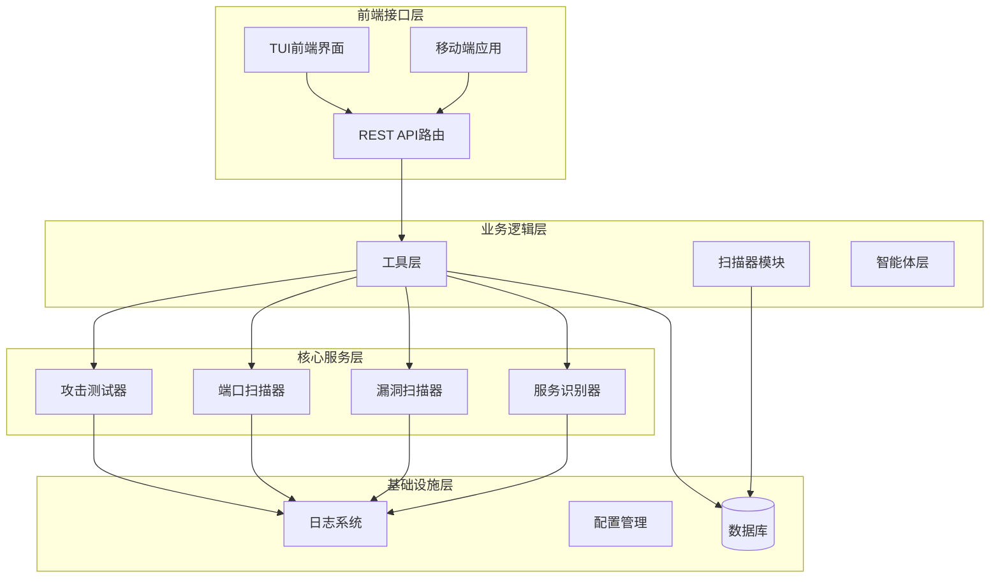

**图表来源**
- [router/tools.py:1-75](file://router/tools.py#L1-L75)
- [tools/base.py:1-36](file://tools/base.py#L1-L36)

**章节来源**
- [README.md:353-376](file://README.md#L353-L376)

## 核心组件

攻击测试器系统的核心组件包括攻击测试器、扫描器、工具层和智能体层。每个组件都有明确的职责和接口定义。

### 攻击测试器组件

攻击测试器是系统的核心执行组件，负责具体的攻击测试操作：

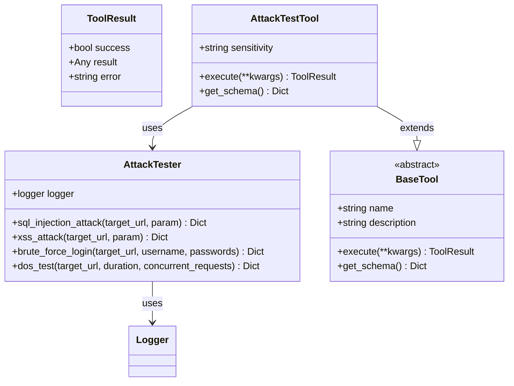

**图表来源**
- [scanner/attack_tester.py:12-265](file://scanner/attack_tester.py#L12-L265)
- [tools/base.py:9-36](file://tools/base.py#L9-L36)
- [tools/pentest/security/attack_test_tool.py:6-68](file://tools/pentest/security/attack_test_tool.py#L6-L68)

### 扫描器组件

系统提供多种扫描器来支持不同的测试需求：

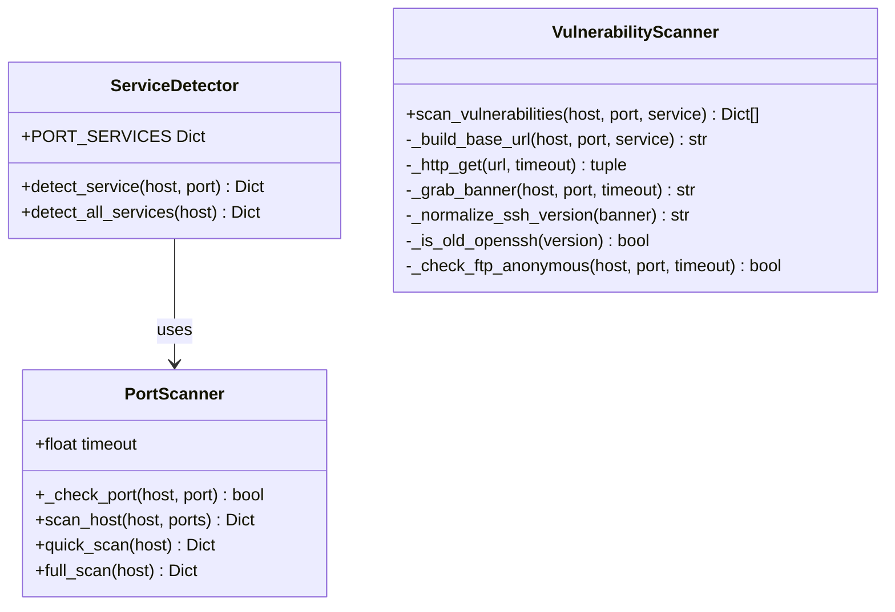

**图表来源**
- [scanner/port_scanner.py:14-63](file://scanner/port_scanner.py#L14-L63)
- [scanner/service_detector.py:29-56](file://scanner/service_detector.py#L29-L56)
- [scanner/vulnerability_scanner.py:254-289](file://scanner/vulnerability_scanner.py#L254-L289)

**章节来源**
- [scanner/attack_tester.py:12-265](file://scanner/attack_tester.py#L12-L265)
- [scanner/port_scanner.py:14-63](file://scanner/port_scanner.py#L14-L63)
- [scanner/service_detector.py:29-56](file://scanner/service_detector.py#L29-L56)
- [scanner/vulnerability_scanner.py:254-289](file://scanner/vulnerability_scanner.py#L254-L289)

## 架构概览

攻击测试器系统采用分层架构设计，确保了良好的可维护性和扩展性：

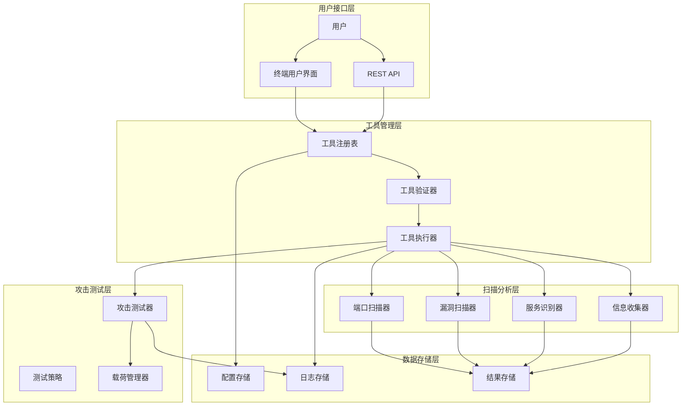

**图表来源**
- [router/tools.py:24-75](file://router/tools.py#L24-L75)
- [tools/pentest/security/attack_test_tool.py:21-51](file://tools/pentest/security/attack_test_tool.py#L21-L51)

系统架构的关键特性：
- **分层设计**：清晰的职责分离和依赖关系
- **异步处理**：充分利用asyncio提高并发性能
- **工具化**：统一的工具接口和生命周期管理
- **安全性**：高敏感度工具的确认机制
- **可扩展性**：模块化的组件设计支持功能扩展

## 详细组件分析

### 攻击测试器详细分析

攻击测试器是系统中最核心的组件，提供了多种攻击测试能力：

#### SQL注入攻击测试

SQL注入测试是攻击测试器的重要功能之一，通过构造各种SQL注入载荷来检测目标系统的安全性：

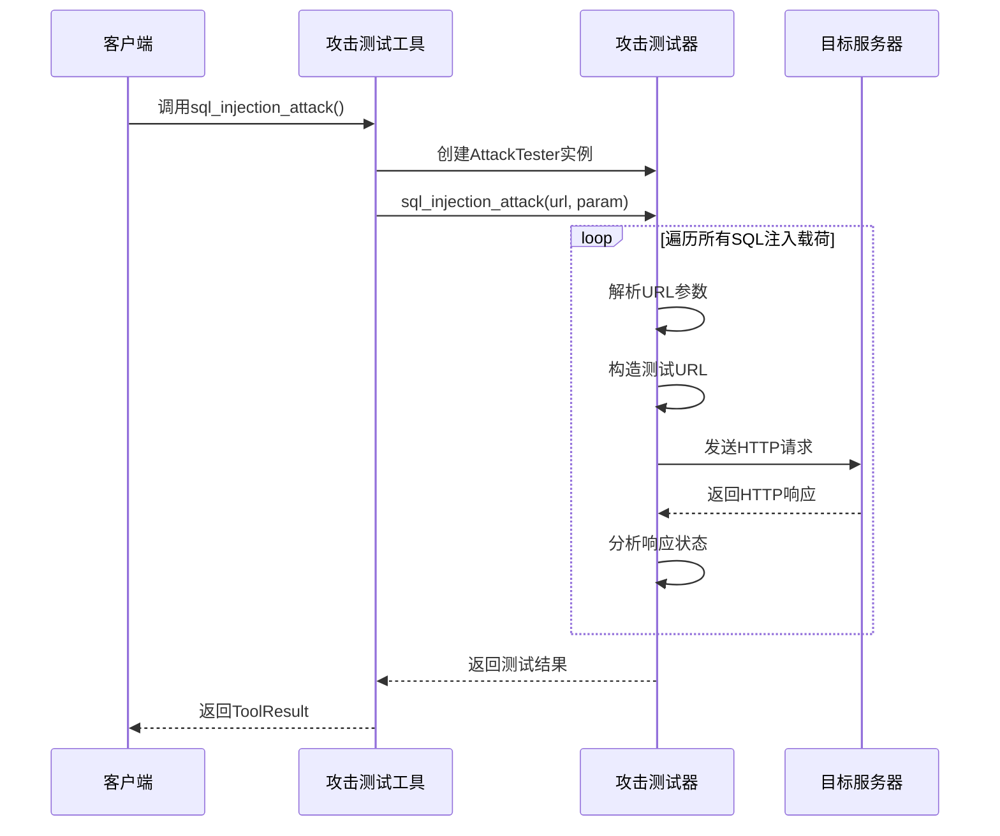

**图表来源**
- [scanner/attack_tester.py:18-87](file://scanner/attack_tester.py#L18-L87)
- [tools/pentest/security/attack_test_tool.py:31-33](file://tools/pentest/security/attack_test_tool.py#L31-L33)

SQL注入测试的特点：
- **载荷多样性**：包含多种常见的SQL注入载荷
- **参数化测试**：支持自定义测试参数
- **状态分析**：根据HTTP状态码判断脆弱性
- **错误处理**：完善的异常处理机制

#### XSS攻击测试

XSS（跨站脚本）攻击测试用于检测目标系统是否存在跨站脚本漏洞：

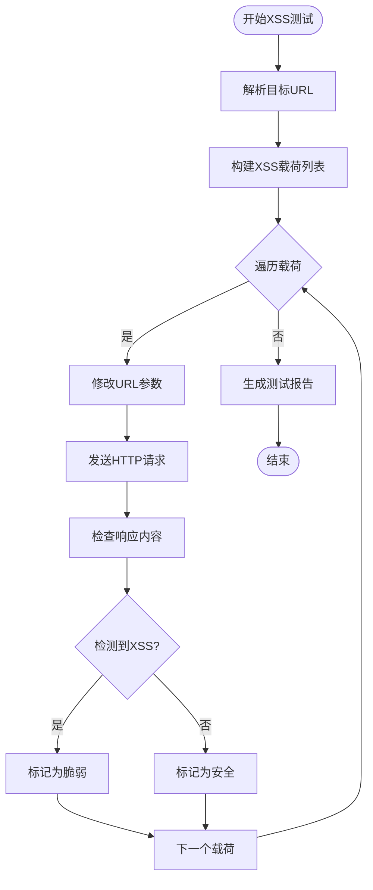

**图表来源**
- [scanner/attack_tester.py:89-156](file://scanner/attack_tester.py#L89-L156)

XSS测试的核心逻辑：
- **载荷检测**：检查响应内容中是否包含注入的载荷
- **状态码分析**：结合HTTP状态码判断测试结果
- **结果记录**：详细记录每次测试的结果和分析

#### 暴力破解测试

暴力破解测试模拟常见的密码猜测攻击：

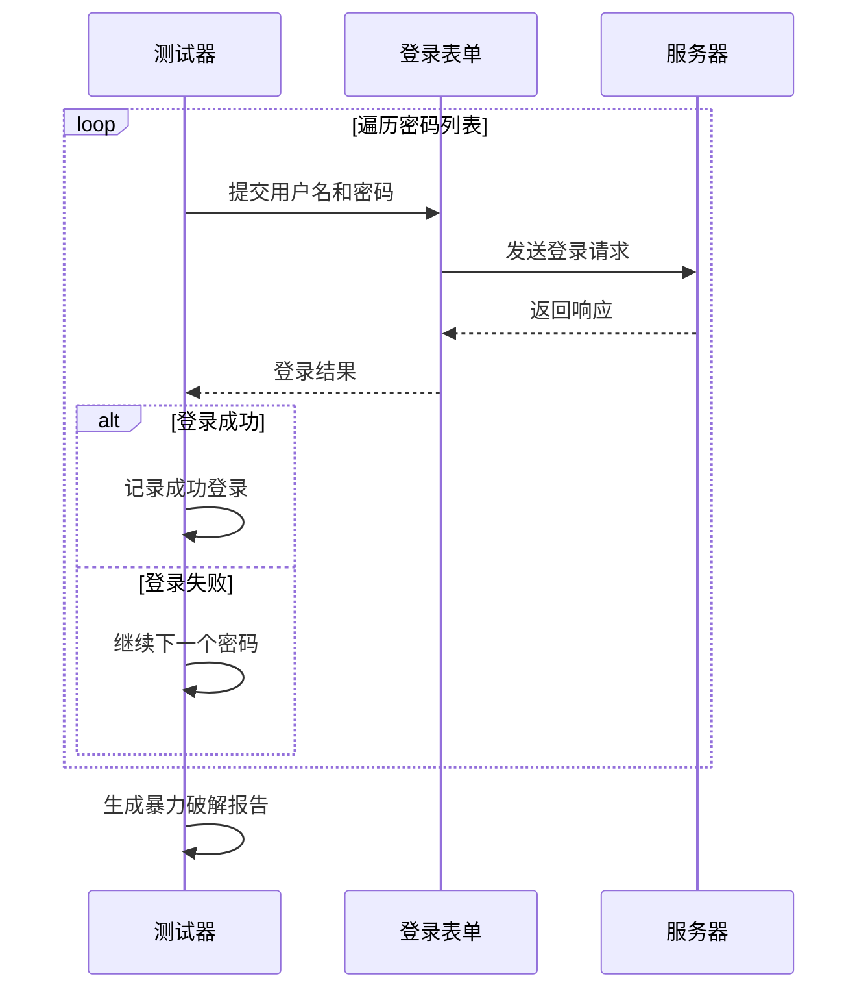

**图表来源**
- [scanner/attack_tester.py:158-221](file://scanner/attack_tester.py#L158-L221)

暴力破解测试的实现要点：
- **密码枚举**：支持自定义密码列表
- **登录参数**：模拟标准的登录表单字段
- **结果判定**：根据HTTP状态码判断成功与否

#### DoS攻击测试

DoS（拒绝服务）测试用于评估系统的抗压能力：

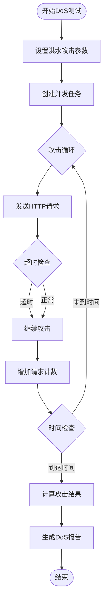

**图表来源**
- [scanner/attack_tester.py:223-265](file://scanner/attack_tester.py#L223-L265)

DoS测试的设计考虑：
- **并发控制**：限制最大并发请求数量
- **时间控制**：支持自定义测试持续时间
- **资源保护**：避免对测试系统造成过大压力

**章节来源**
- [scanner/attack_tester.py:12-265](file://scanner/attack_tester.py#L12-L265)

### 工具层详细分析

工具层提供了统一的接口来管理和执行各种安全测试工具：

#### 工具基类设计

所有工具都继承自BaseTool基类，确保了一致的接口和行为：

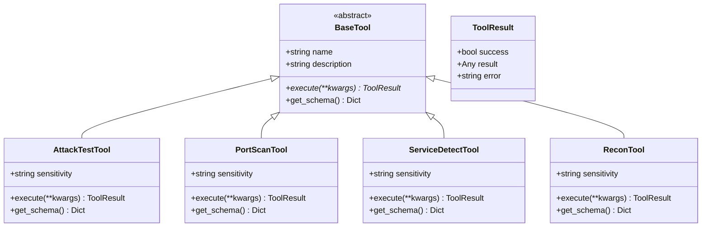

**图表来源**
- [tools/base.py:16-36](file://tools/base.py#L16-L36)
- [tools/pentest/security/attack_test_tool.py:6-68](file://tools/pentest/security/attack_test_tool.py#L6-L68)
- [tools/pentest/security/port_scan_tool.py:6-50](file://tools/pentest/security/port_scan_tool.py#L6-L50)
- [tools/pentest/security/service_detect_tool.py:6-50](file://tools/pentest/security/service_detect_tool.py#L6-L50)
- [tools/pentest/security/recon_tool.py:6-40](file://tools/pentest/security/recon_tool.py#L6-L40)

工具层的设计原则：
- **统一接口**：所有工具都实现相同的execute方法
- **结果标准化**：使用ToolResult统一返回格式
- **参数验证**：通过get_schema提供参数描述
- **敏感度分级**：支持不同级别的安全敏感度

#### 工具路由管理

系统通过router/tools.py管理所有可用的工具：

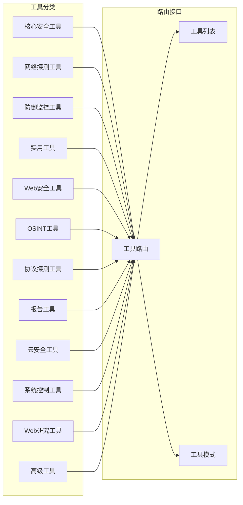

**图表来源**
- [router/tools.py:26-75](file://router/tools.py#L26-L75)

**章节来源**
- [tools/base.py:1-36](file://tools/base.py#L1-L36)
- [router/tools.py:1-75](file://router/tools.py#L1-L75)

### 信息收集组件分析

信息收集是渗透测试的第一步，系统提供了完整的侦察能力：

#### 侦察器实现

侦察器负责收集目标的基本信息：

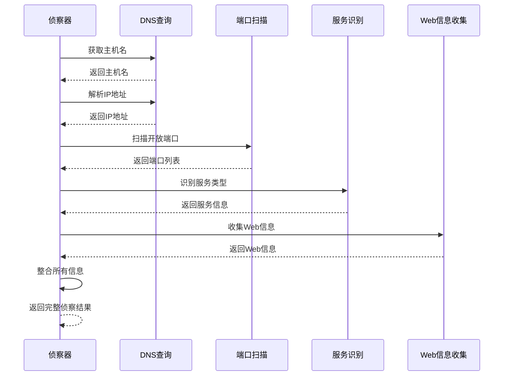

**图表来源**
- [core/attack_chain/reconnaissance.py:17-34](file://core/attack_chain/reconnaissance.py#L17-L34)

侦察器的功能特性：
- **多源信息收集**：同时收集DNS、端口、服务、Web等信息
- **异步处理**：充分利用异步I/O提高效率
- **错误恢复**：单个组件失败不影响整体流程
- **信息整合**：将分散的信息整合为完整视图

**章节来源**
- [core/attack_chain/reconnaissance.py:11-150](file://core/attack_chain/reconnaissance.py#L11-L150)

## 依赖关系分析

攻击测试器系统的依赖关系相对简单，主要体现了清晰的分层设计：

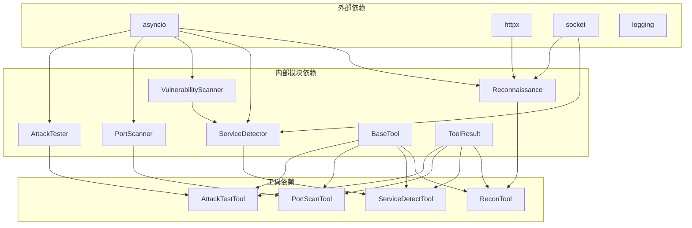

**图表来源**
- [scanner/attack_tester.py:4-9](file://scanner/attack_tester.py#L4-L9)
- [core/attack_chain/reconnaissance.py:4-8](file://core/attack_chain/reconnaissance.py#L4-L8)

依赖关系的特点：
- **单向依赖**：主要为自上而下的使用关系
- **松耦合**：组件间依赖关系清晰且有限
- **标准库优先**：优先使用Python标准库
- **异步友好**：所有依赖都支持异步操作

**章节来源**
- [scanner/attack_tester.py:1-265](file://scanner/attack_tester.py#L1-L265)
- [core/attack_chain/reconnaissance.py:1-150](file://core/attack_chain/reconnaissance.py#L1-L150)

## 性能考量

攻击测试器系统在设计时充分考虑了性能优化：

### 异步并发处理

系统广泛使用asyncio实现高并发处理：

- **端口扫描并发**：使用asyncio.gather并行扫描多个端口
- **HTTP请求并发**：支持多请求同时发送和接收
- **文件操作异步化**：减少I/O等待时间

### 内存优化策略

- **流式处理**：HTTP响应采用流式读取，避免大文件内存占用
- **结果分页**：攻击测试结果限制返回数量，防止内存溢出
- **缓存机制**：合理使用缓存减少重复计算

### 网络性能优化

- **连接复用**：在可能的情况下复用网络连接
- **超时控制**：为所有网络操作设置合理的超时时间
- **重试机制**：对临时性网络错误进行智能重试

## 故障排除指南

### 常见问题及解决方案

#### 攻击测试失败

**问题现象**：攻击测试返回错误或无响应

**可能原因**：
- 目标系统防火墙阻拦
- 网络连接不稳定
- 超时设置过短

**解决步骤**：
1. 检查网络连接状态
2. 增加超时时间设置
3. 验证目标系统可达性
4. 检查代理设置

#### 工具执行异常

**问题现象**：工具执行过程中抛出异常

**排查方法**：
1. 查看详细的错误日志
2. 验证工具参数完整性
3. 检查依赖库版本兼容性
4. 确认用户权限设置

#### 性能问题

**问题现象**：系统响应缓慢或内存占用过高

**优化措施**：
1. 调整并发数量设置
2. 增加系统资源分配
3. 优化扫描范围和频率
4. 实施适当的缓存策略

**章节来源**
- [tests/scanner/test_port_scanner.py:1-61](file://tests/scanner/test_port_scanner.py#L1-L61)
- [tests/scanner/test_service_detector.py:1-52](file://tests/scanner/test_service_detector.py#L1-L52)
- [tests/scanner/test_vulnerability_scanner.py:1-82](file://tests/scanner/test_vulnerability_scanner.py#L1-L82)

## 结论

攻击测试器系统是一个设计精良的自动化渗透测试框架，具有以下显著优势：

### 技术优势

- **模块化设计**：清晰的组件分离和职责划分
- **异步架构**：高效的并发处理能力
- **安全性考虑**：完善的权限控制和安全机制
- **可扩展性**：灵活的插件系统和工具扩展机制

### 应用价值

- **教育用途**：为安全研究人员提供学习和实验平台
- **授权测试**：支持合法的安全评估和渗透测试
- **自动化程度高**：减少重复性工作，提高测试效率
- **结果可视化**：提供清晰的测试报告和分析结果

### 发展方向

系统仍有进一步改进的空间：
- **机器学习集成**：引入AI技术提高漏洞检测准确性
- **云原生支持**：增强对容器化和云环境的支持
- **实时监控**：添加持续安全监控功能
- **合规性检查**：集成更多行业标准和法规要求

攻击测试器系统为现代网络安全测试提供了强有力的技术支撑，其设计理念和实现方式值得在相关领域推广应用。