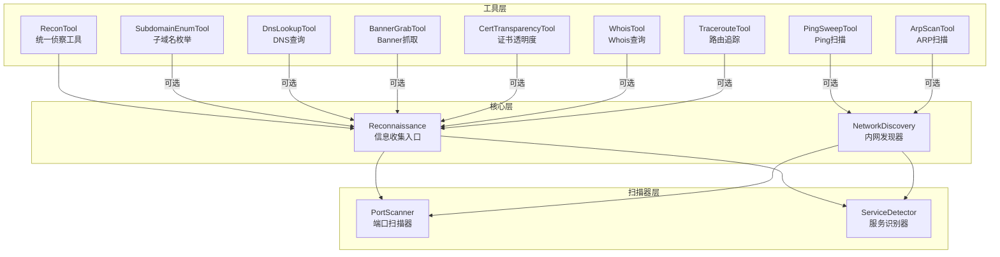
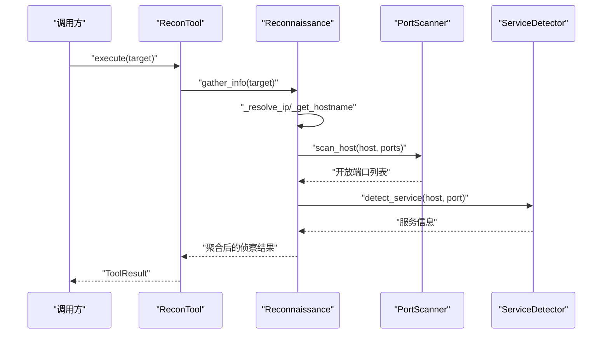
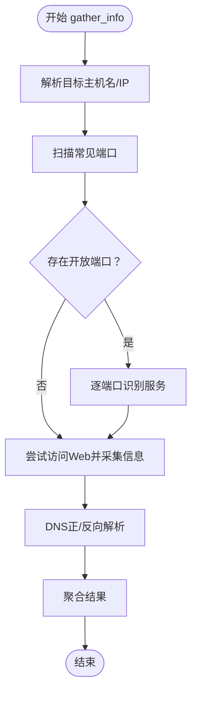
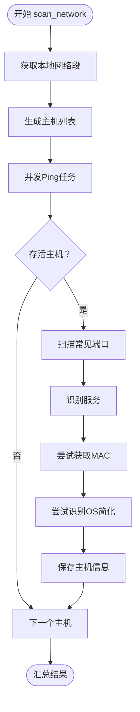
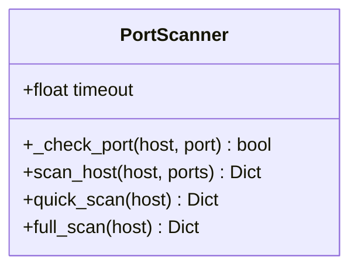
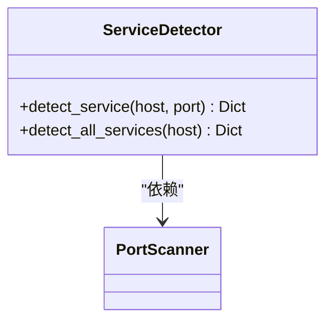
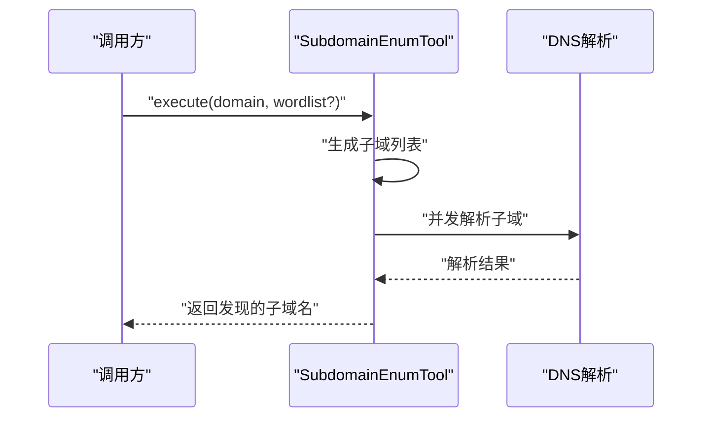
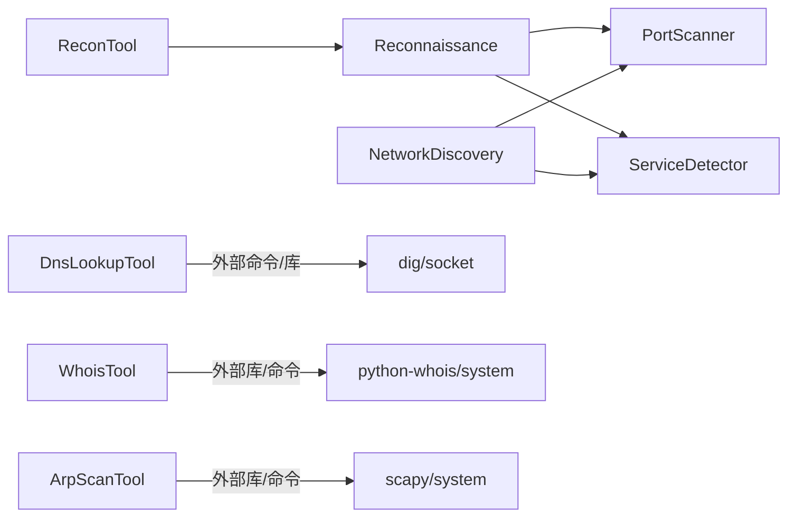

# 侦察阶段

<cite>
**本文引用的文件**
- [core/attack_chain/reconnaissance.py](file://core/attack_chain/reconnaissance.py)
- [controller/network_discovery.py](file://controller/network_discovery.py)
- [scanner/port_scanner.py](file://scanner/port_scanner.py)
- [scanner/service_detector.py](file://scanner/service_detector.py)
- [tools/pentest/security/recon_tool.py](file://tools/pentest/security/recon_tool.py)
- [tools/pentest/network/subdomain_enum_tool.py](file://tools/pentest/network/subdomain_enum_tool.py)
- [tools/pentest/network/dns_lookup_tool.py](file://tools/pentest/network/dns_lookup_tool.py)
- [tools/pentest/network/banner_grab_tool.py](file://tools/pentest/network/banner_grab_tool.py)
- [tools/osint/cert_transparency_tool.py](file://tools/osint/cert_transparency_tool.py)
- [tools/pentest/network/whois_tool.py](file://tools/pentest/network/whois_tool.py)
- [tools/pentest/network/traceroute_tool.py](file://tools/pentest/network/traceroute_tool.py)
- [tools/pentest/network/ping_sweep_tool.py](file://tools/pentest/network/ping_sweep_tool.py)
- [tools/pentest/network/arp_scan_tool.py](file://tools/pentest/network/arp_scan_tool.py)
- [utils/config_storage.py](file://utils/config_storage.py)
</cite>

## 目录
1. [引言](#引言)
2. [项目结构](#项目结构)
3. [核心组件](#核心组件)
4. [架构总览](#架构总览)
5. [详细组件分析](#详细组件分析)
6. [依赖分析](#依赖分析)
7. [性能考虑](#性能考虑)
8. [故障排查指南](#故障排查指南)
9. [结论](#结论)
10. [附录](#附录)

## 引言
本章节面向Secbot攻击链的“侦察阶段”，系统性阐述信息收集的设计理念与实现策略，覆盖主动与被动信息收集方法，并聚焦以下关键能力：
- 目标识别：域名/IP解析、主机名反查、WHOIS基础信息
- 网络拓扑发现：内网主机发现、存活探测、路由追踪
- 服务指纹识别：端口扫描、服务识别、Banner抓取
- 操作系统检测：基于特征的简要推断
- 子域名枚举：字典枚举、证书透明度查询
- 数据处理与分析：结果聚合、去重、关联分析

同时，提供配置项与参数调优建议（超时、并发、代理），并给出典型场景与数据格式说明。

## 项目结构
Secbot在多个层次提供了侦察能力：
- 核心层：统一的信息收集入口类，封装目标识别、端口扫描、服务识别、Web信息采集与DNS信息采集
- 控制器层：内网发现器，负责内网主机发现、端口扫描、服务识别、MAC与OS识别
- 扫描器层：端口扫描器与服务识别器，提供异步并发扫描与服务映射
- 工具层：面向具体侦察任务的工具集合，如子域名枚举、DNS查询、Banner抓取、证书透明度查询、Whois、Traceroute、Ping Sweep、ARP扫描等
- 工具注册与调用：通过工具基类与工具注册机制，将各侦察工具暴露给上层工作流

图表来源
- [core/attack_chain/reconnaissance.py](file://core/attack_chain/reconnaissance.py#L17-L34)
- [controller/network_discovery.py](file://controller/network_discovery.py#L121-L156)
- [scanner/port_scanner.py](file://scanner/port_scanner.py#L33-L54)
- [scanner/service_detector.py](file://scanner/service_detector.py#L42-L55)
- [tools/pentest/security/recon_tool.py](file://tools/pentest/security/recon_tool.py#L17-L29)

章节来源
- [core/attack_chain/reconnaissance.py](file://core/attack_chain/reconnaissance.py#L11-L34)
- [controller/network_discovery.py](file://controller/network_discovery.py#L15-L23)

## 核心组件
- 信息收集入口（Reconnaissance）
  - 统一对外接口，按步骤收集目标信息：主机名、IP解析、开放端口、服务识别、Web信息、DNS信息
  - 内部依赖端口扫描器与服务识别器
- 内网发现器（NetworkDiscovery）
  - 支持本地网络段识别、并发Ping、端口扫描、服务识别、MAC与OS识别（简化）
- 端口扫描器（PortScanner）
  - 异步TCP Connect扫描，支持快速扫描与全端口扫描
- 服务识别器（ServiceDetector）
  - 基于端口映射识别服务类型

章节来源
- [core/attack_chain/reconnaissance.py](file://core/attack_chain/reconnaissance.py#L17-L34)
- [controller/network_discovery.py](file://controller/network_discovery.py#L18-L23)
- [scanner/port_scanner.py](file://scanner/port_scanner.py#L17-L18)
- [scanner/service_detector.py](file://scanner/service_detector.py#L32-L40)

## 架构总览
下图展示从工具调用到核心组件再到扫描器的调用序列：

图表来源
- [tools/pentest/security/recon_tool.py](file://tools/pentest/security/recon_tool.py#L17-L29)
- [core/attack_chain/reconnaissance.py](file://core/attack_chain/reconnaissance.py#L17-L34)
- [scanner/port_scanner.py](file://scanner/port_scanner.py#L33-L54)
- [scanner/service_detector.py](file://scanner/service_detector.py#L32-L40)

## 详细组件分析

### 信息收集入口（Reconnaissance）
- 功能要点
  - 目标识别：解析域名到IP、反向解析主机名
  - 端口扫描：对常见端口执行异步扫描
  - 服务识别：基于端口映射识别服务类型
  - Web信息：HTTP请求获取状态码、响应头、Server、技术栈、页面标题
  - DNS信息：正向/反向解析，返回IP与主机名
- 处理流程
  - 输入目标字符串（域名或URL），剥离协议与路径后提取主机
  - 并行执行各子任务，最终聚合为统一结果结构
- 关键实现位置
  - 统一入口与聚合：[gather_info](file://core/attack_chain/reconnaissance.py#L17-L34)
  - 主机名解析：[_get_hostname](file://core/attack_chain/reconnaissance.py#L36-L45)
  - IP解析：[_resolve_ip](file://core/attack_chain/reconnaissance.py#L47-L55)
  - 端口扫描：[_scan_ports](file://core/attack_chain/reconnaissance.py#L57-L67)
  - 服务识别：[_identify_services](file://core/attack_chain/reconnaissance.py#L69-L84)
  - Web信息采集：[_gather_web_info](file://core/attack_chain/reconnaissance.py#L86-L103)
  - 技术栈检测：[_detect_technologies](file://core/attack_chain/reconnaissance.py#L105-L123)
  - 页面标题提取：[_extract_title](file://core/attack_chain/reconnaissance.py#L125-L131)
  - DNS信息采集：[_gather_dns_info](file://core/attack_chain/reconnaissance.py#L133-L148)

图表来源
- [core/attack_chain/reconnaissance.py](file://core/attack_chain/reconnaissance.py#L17-L34)
- [core/attack_chain/reconnaissance.py](file://core/attack_chain/reconnaissance.py#L57-L84)
- [core/attack_chain/reconnaissance.py](file://core/attack_chain/reconnaissance.py#L86-L148)

章节来源
- [core/attack_chain/reconnaissance.py](file://core/attack_chain/reconnaissance.py#L17-L148)

### 内网发现器（NetworkDiscovery）
- 功能要点
  - 自动识别本地网络段
  - 并发Ping主机，过滤存活主机
  - 对存活主机扫描常见端口并识别服务
  - 尝试获取主机名、MAC地址、OS类型（简化）
- 并发与超时
  - 使用线程池与异步I/O结合，合理设置超时与最大并发
- 关键实现位置
  - 本地网络段获取：[get_local_network](file://controller/network_discovery.py#L24-L41)
  - 并发Ping：[ping_host](file://controller/network_discovery.py#L43-L61)
  - 端口扫描：[scan_port](file://controller/network_discovery.py#L63-L72)
  - 主机发现：[discover_host](file://controller/network_discovery.py#L74-L119)
  - 网络扫描：[scan_network](file://controller/network_discovery.py#L121-L156)
  - 服务识别映射：[_identify_service](file://controller/network_discovery.py#L158-L172)
  - MAC地址解析：[_get_mac_address](file://controller/network_discovery.py#L174-L206)
  - OS识别（简化）：[_detect_os](file://controller/network_discovery.py#L208-L212)

图表来源
- [controller/network_discovery.py](file://controller/network_discovery.py#L121-L156)
- [controller/network_discovery.py](file://controller/network_discovery.py#L74-L119)

章节来源
- [controller/network_discovery.py](file://controller/network_discovery.py#L15-L233)

### 端口扫描器（PortScanner）
- 功能要点
  - 异步TCP Connect扫描，支持快速扫描与全端口扫描
  - 返回每个端口的开放状态与统计
- 关键实现位置
  - 端口检查：[_check_port](file://scanner/port_scanner.py#L20-L31)
  - 扫描主流程：[scan_host](file://scanner/port_scanner.py#L33-L54)
  - 快速扫描：[quick_scan](file://scanner/port_scanner.py#L56-L58)
  - 全端口扫描：[full_scan](file://scanner/port_scanner.py#L60-L62)

图表来源
- [scanner/port_scanner.py](file://scanner/port_scanner.py#L14-L62)

章节来源
- [scanner/port_scanner.py](file://scanner/port_scanner.py#L14-L62)

### 服务识别器（ServiceDetector）
- 功能要点
  - 基于端口映射识别服务名称（如FTP/SSH/HTTP/HTTPS等）
  - 支持批量识别并返回结构化结果
- 关键实现位置
  - 单端口识别：[detect_service](file://scanner/service_detector.py#L32-L40)
  - 批量识别：[detect_all_services](file://scanner/service_detector.py#L42-L55)

图表来源
- [scanner/service_detector.py](file://scanner/service_detector.py#L29-L55)
- [scanner/port_scanner.py](file://scanner/port_scanner.py#L56-L58)

章节来源
- [scanner/service_detector.py](file://scanner/service_detector.py#L29-L55)

### 工具层：子域名枚举（SubdomainEnumTool）
- 功能要点
  - 基于字典暴力解析与DNS查询发现子域名
  - 支持自定义字典，限制并发
- 关键实现位置
  - 字典与并发控制：[SubdomainEnumTool](file://tools/pentest/network/subdomain_enum_tool.py#L27-L91)
  - 解析逻辑：[_resolve](file://tools/pentest/network/subdomain_enum_tool.py#L38-L45)

图表来源
- [tools/pentest/network/subdomain_enum_tool.py](file://tools/pentest/network/subdomain_enum_tool.py#L47-L78)

章节来源
- [tools/pentest/network/subdomain_enum_tool.py](file://tools/pentest/network/subdomain_enum_tool.py#L27-L91)

### 工具层：DNS查询（DnsLookupTool）
- 功能要点
  - 查询A/AAAA/MX/NS/CNAME/TXT/SOA等记录
  - 支持dig命令或回退到socket解析
- 关键实现位置
  - 执行逻辑：[DnsLookupTool.execute](file://tools/pentest/network/dns_lookup_tool.py#L19-L67)

章节来源
- [tools/pentest/network/dns_lookup_tool.py](file://tools/pentest/network/dns_lookup_tool.py#L8-L79)

### 工具层：Banner抓取（BannerGrabTool）
- 功能要点
  - 连接目标端口，尝试读取Banner，必要时发送探测报文
  - 返回开放端口的Banner信息
- 关键实现位置
  - 抓取逻辑：[_grab_one](file://tools/pentest/network/banner_grab_tool.py#L19-L68)
  - 执行入口：[BannerGrabTool.execute](file://tools/pentest/network/banner_grab_tool.py#L70-L96)

章节来源
- [tools/pentest/network/banner_grab_tool.py](file://tools/pentest/network/banner_grab_tool.py#L8-L108)

### 工具层：证书透明度（CertTransparencyTool）
- 功能要点
  - 通过crt.sh查询SSL证书记录，提取唯一子域名
- 关键实现位置
  - 执行逻辑：[CertTransparencyTool.execute](file://tools/osint/cert_transparency_tool.py#L24-L70)

章节来源
- [tools/osint/cert_transparency_tool.py](file://tools/osint/cert_transparency_tool.py#L10-L84)

### 工具层：Whois查询（WhoisTool）
- 功能要点
  - 查询域名或IP的注册信息，支持库与系统命令两种方式
- 关键实现位置
  - 执行逻辑：[WhoisTool.execute](file://tools/pentest/network/whois_tool.py#L18-L70)

章节来源
- [tools/pentest/network/whois_tool.py](file://tools/pentest/network/whois_tool.py#L7-L81)

### 工具层：Traceroute（TracerouteTool）
- 功能要点
  - 跨平台追踪路由路径，解析跳数与延迟
- 关键实现位置
  - 执行逻辑：[TracerouteTool.execute](file://tools/pentest/network/traceroute_tool.py#L19-L77)

章节来源
- [tools/pentest/network/traceroute_tool.py](file://tools/pentest/network/traceroute_tool.py#L8-L89)

### 工具层：Ping扫描（PingSweepTool）
- 功能要点
  - 对单机或网段进行并发Ping，统计存活主机
- 关键实现位置
  - 执行逻辑：[PingSweepTool.execute](file://tools/pentest/network/ping_sweep_tool.py#L44-L76)

章节来源
- [tools/pentest/network/ping_sweep_tool.py](file://tools/pentest/network/ping_sweep_tool.py#L9-L90)

### 工具层：ARP扫描（ArpScanTool）
- 功能要点
  - 使用scapy或系统命令扫描局域网主机与MAC地址
- 关键实现位置
  - 执行逻辑：[ArpScanTool.execute](file://tools/pentest/network/arp_scan_tool.py#L24-L48)

章节来源
- [tools/pentest/network/arp_scan_tool.py](file://tools/pentest/network/arp_scan_tool.py#L10-L167)

## 依赖分析
- 组件耦合
  - Reconnaissance依赖PortScanner与ServiceDetector进行端口与服务识别
  - NetworkDiscovery同样依赖PortScanner与ServiceDetector，并扩展了Ping、MAC、OS识别
  - 工具层通过ReconTool统一接入Reconnaissance，便于工作流编排
- 外部依赖
  - DNS查询依赖dig或socket；若dig不可用则回退socket
  - WHOIS查询优先使用python-whois库，否则使用系统命令
  - ARP扫描优先使用scapy，否则使用系统命令+Ping触发ARP
- 循环依赖
  - 未发现循环导入；工具与核心模块通过相对导入解耦

图表来源
- [tools/pentest/security/recon_tool.py](file://tools/pentest/security/recon_tool.py#L17-L29)
- [core/attack_chain/reconnaissance.py](file://core/attack_chain/reconnaissance.py#L17-L34)
- [scanner/port_scanner.py](file://scanner/port_scanner.py#L33-L54)
- [scanner/service_detector.py](file://scanner/service_detector.py#L42-L55)
- [tools/pentest/network/dns_lookup_tool.py](file://tools/pentest/network/dns_lookup_tool.py#L27-L57)
- [tools/pentest/network/whois_tool.py](file://tools/pentest/network/whois_tool.py#L24-L42)
- [tools/pentest/network/arp_scan_tool.py](file://tools/pentest/network/arp_scan_tool.py#L38-L45)

章节来源
- [tools/pentest/security/recon_tool.py](file://tools/pentest/security/recon_tool.py#L17-L29)
- [tools/pentest/network/dns_lookup_tool.py](file://tools/pentest/network/dns_lookup_tool.py#L27-L57)
- [tools/pentest/network/whois_tool.py](file://tools/pentest/network/whois_tool.py#L24-L42)
- [tools/pentest/network/arp_scan_tool.py](file://tools/pentest/network/arp_scan_tool.py#L38-L45)

## 性能考虑
- 并发与超时
  - 端口扫描与服务识别采用异步并发，建议根据网络状况调整超时与并发度，避免被目标防火墙限流
  - 子域名枚举使用信号量限制并发，防止DNS服务器过载
- I/O与资源
  - DNS查询优先使用异步子进程；WHOIS查询可能阻塞，建议设置较短超时
  - ARP扫描建议使用scapy以获得更准确结果，系统命令方式仅支持/24或更小网段
- 结果聚合
  - 将开放端口、服务、Banner、子域名等结果统一结构化，便于后续分析与去重

## 故障排查指南
- 端口扫描失败
  - 检查目标防火墙策略与网络连通性
  - 适当增大超时或降低并发
- DNS查询异常
  - 若dig不可用，确认系统环境；或改用socket回退方案
- Whois查询失败
  - 安装python-whois库；或确保系统whois命令可用
- ARP扫描失败
  - 安装scapy；或确认系统arp命令可用且具备管理员权限
- 超时与不稳定
  - 调整工具参数中的超时与并发，避免对目标造成过大压力

章节来源
- [tools/pentest/network/dns_lookup_tool.py](file://tools/pentest/network/dns_lookup_tool.py#L48-L57)
- [tools/pentest/network/whois_tool.py](file://tools/pentest/network/whois_tool.py#L41-L42)
- [tools/pentest/network/arp_scan_tool.py](file://tools/pentest/network/arp_scan_tool.py#L40-L45)

## 结论
Secbot的侦察阶段通过统一入口与工具化能力，实现了从目标识别、网络拓扑发现、服务指纹识别到操作系统检测的闭环。其设计强调异步并发与模块化组合，既保证了效率，又便于扩展与维护。建议在实战中结合目标环境特性，合理配置超时与并发，并利用多种技术手段互补，提升信息收集的完整性与准确性。

## 附录

### 配置选项与参数调优
- 通用参数
  - 超时：建议为端口扫描与DNS查询设置适中值（如2–5秒），避免被限流
  - 并发：子域名枚举使用信号量限制并发（如50），端口扫描按CPU与网络能力调节
  - 代理：当前工具未内置代理支持，可通过系统级代理或容器网络策略间接实现
- 端口扫描
  - 快速扫描：仅扫描常见端口，适合初步侦察
  - 全端口扫描：扩大端口范围，适合深度侦察
- 子域名枚举
  - 自定义字典：根据目标行业与技术栈优化字典
- DNS查询
  - 记录类型：ALL或指定类型（A/AAAA/MX/NS/CNAME/TXT/SOA）
- Banner抓取
  - 端口列表：按需传入，避免对敏感端口产生干扰
- Whois查询
  - 优先使用库，失败回退系统命令
- Traceroute
  - 最大跳数：根据网络复杂度调整
- Ping扫描与ARP扫描
  - 网段大小：避免过大网段导致ARP风暴
  - 超时：根据网络延迟调整

章节来源
- [scanner/port_scanner.py](file://scanner/port_scanner.py#L17-L18)
- [tools/pentest/network/subdomain_enum_tool.py](file://tools/pentest/network/subdomain_enum_tool.py#L58-L66)
- [tools/pentest/network/dns_lookup_tool.py](file://tools/pentest/network/dns_lookup_tool.py#L24-L34)
- [tools/pentest/network/banner_grab_tool.py](file://tools/pentest/network/banner_grab_tool.py#L75-L78)
- [tools/pentest/network/traceroute_tool.py](file://tools/pentest/network/traceroute_tool.py#L24-L25)
- [tools/pentest/network/ping_sweep_tool.py](file://tools/pentest/network/ping_sweep_tool.py#L49-L50)
- [tools/pentest/network/arp_scan_tool.py](file://tools/pentest/network/arp_scan_tool.py#L26-L27)

### 实际侦察场景示例
- 场景一：外网目标初步侦察
  - 步骤：ReconTool → 端口扫描 → 服务识别 → Web信息采集 → DNS信息
  - 输出：目标IP、主机名、开放端口、服务类型、HTTP状态与头部、Server、技术栈、页面标题、DNS记录
- 场景二：内网渗透前探测
  - 步骤：PingSweepTool → NetworkDiscovery → ARP扫描 → Traceroute
  - 输出：存活主机列表、MAC地址、开放端口、服务、路由路径
- 场景三：子域名发现
  - 步骤：SubdomainEnumTool → CertTransparencyTool → DnsLookupTool
  - 输出：发现的子域名、证书关联子域名、解析记录

章节来源
- [tools/pentest/security/recon_tool.py](file://tools/pentest/security/recon_tool.py#L17-L29)
- [controller/network_discovery.py](file://controller/network_discovery.py#L121-L156)
- [tools/pentest/network/ping_sweep_tool.py](file://tools/pentest/network/ping_sweep_tool.py#L44-L76)
- [tools/pentest/network/arp_scan_tool.py](file://tools/pentest/network/arp_scan_tool.py#L24-L48)
- [tools/pentest/network/traceroute_tool.py](file://tools/pentest/network/traceroute_tool.py#L19-L77)
- [tools/pentest/network/subdomain_enum_tool.py](file://tools/pentest/network/subdomain_enum_tool.py#L47-L78)
- [tools/osint/cert_transparency_tool.py](file://tools/osint/cert_transparency_tool.py#L24-L70)
- [tools/pentest/network/dns_lookup_tool.py](file://tools/pentest/network/dns_lookup_tool.py#L19-L67)

### 数据格式说明
- 通用结果结构
  - 成功标志：success（布尔）
  - 结果主体：result（对象）
- 端口扫描结果
  - host：目标主机
  - ports：端口数组，每项含port、open、status
  - open_count：开放端口数量
- 服务识别结果
  - host：目标主机
  - services：服务数组，每项含port、service、name、version
- Web信息结果
  - status_code：HTTP状态码
  - headers：响应头对象
  - server：Server头
  - technologies：技术栈数组
  - title：页面标题
- DNS信息结果
  - ip：解析到的IP
  - hostname：反向解析主机名
- 子域名枚举结果
  - domain：目标域名
  - total_checked：检查总数
  - found_count：发现数量
  - subdomains：子域名数组，含subdomain、ip、alive
- Whois结果
  - target：目标（域名或IP）
  - whois：解析后的字段（如registrar、creation_date、name_servers等）
- Traceroute结果
  - target：目标
  - total_hops：跳数总数
  - hops：跳信息数组，含hop、ip、times
- Ping扫描结果
  - target：目标
  - total_scanned：扫描总数
  - alive_count：存活数量
  - dead_count：非存活数量
  - alive_hosts：存活主机数组，含host、alive、latency_ms
- ARP扫描结果
  - network：网段
  - method：扫描方式（scapy_arp或system_ping_arp）
  - hosts_found：发现主机数量
  - hosts：主机数组，含ip、mac

章节来源
- [scanner/port_scanner.py](file://scanner/port_scanner.py#L50-L54)
- [scanner/service_detector.py](file://scanner/service_detector.py#L42-L55)
- [core/attack_chain/reconnaissance.py](file://core/attack_chain/reconnaissance.py#L86-L103)
- [core/attack_chain/reconnaissance.py](file://core/attack_chain/reconnaissance.py#L133-L148)
- [tools/pentest/network/subdomain_enum_tool.py](file://tools/pentest/network/subdomain_enum_tool.py#L70-L78)
- [tools/pentest/network/whois_tool.py](file://tools/pentest/network/whois_tool.py#L28-L40)
- [tools/pentest/network/traceroute_tool.py](file://tools/pentest/network/traceroute_tool.py#L65-L72)
- [tools/pentest/network/ping_sweep_tool.py](file://tools/pentest/network/ping_sweep_tool.py#L67-L76)
- [tools/pentest/network/arp_scan_tool.py](file://tools/pentest/network/arp_scan_tool.py#L70-L78)