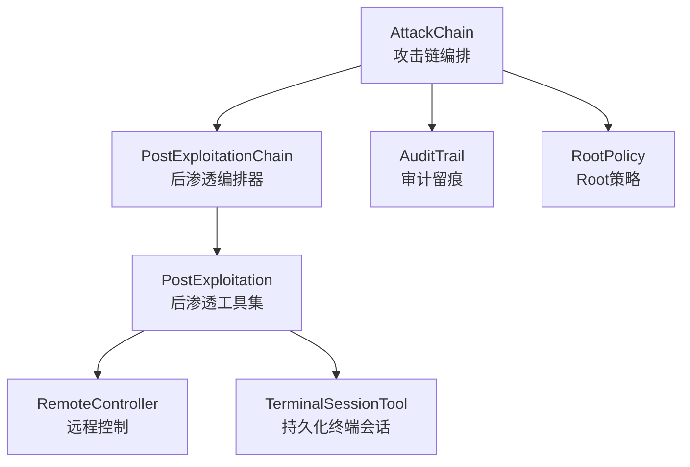
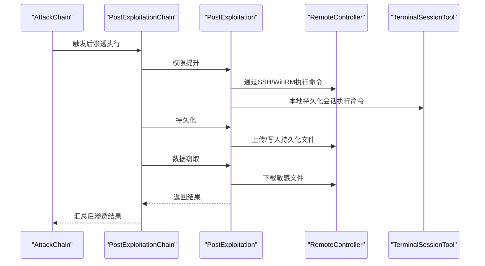
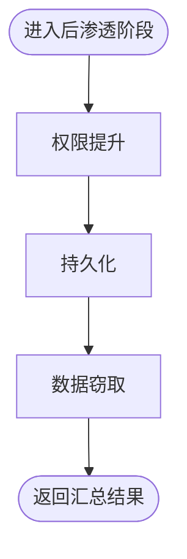
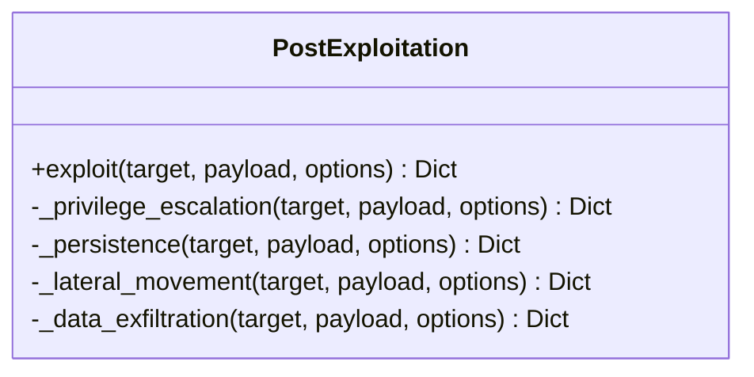
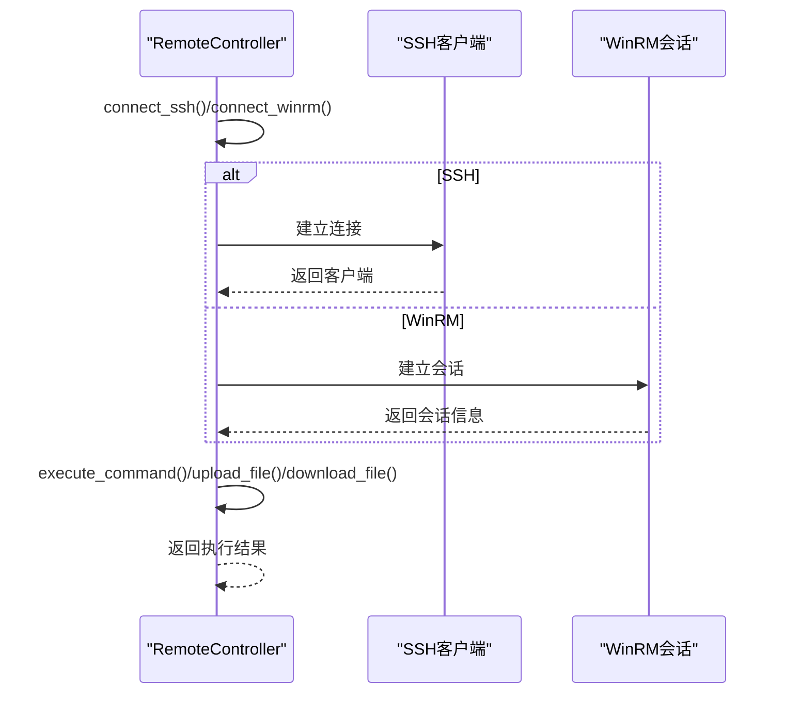
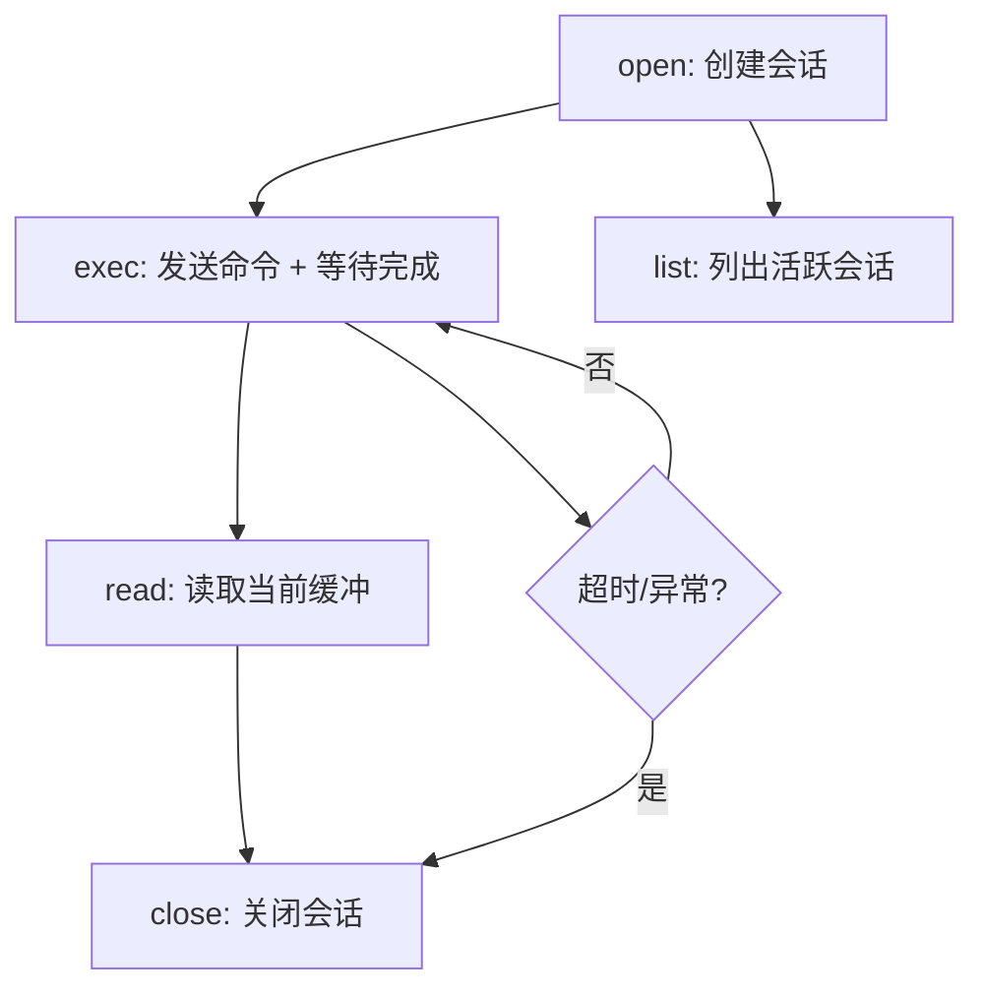
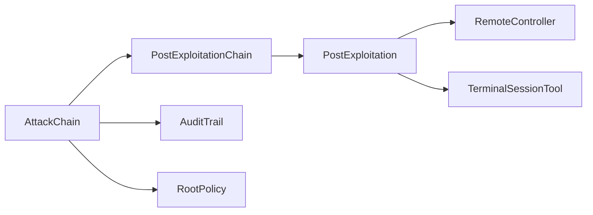

# 后渗透阶段

<cite>
**本文引用的文件**
- [core/attack_chain/post_exploitation.py](file://core/attack_chain/post_exploitation.py)
- [tools/offense/exploit/post_exploitation.py](file://tools/offense/exploit/post_exploitation.py)
- [controller/remote_control.py](file://controller/remote_control.py)
- [tools/offense/control/terminal_tool.py](file://tools/offense/control/terminal_tool.py)
- [core/agents/specialist_agents.py](file://core/agents/specialist_agents.py)
- [core/attack_chain/attack_chain.py](file://core/attack_chain/attack_chain.py)
- [utils/root_policy.py](file://utils/root_policy.py)
- [utils/audit.py](file://utils/audit.py)
- [database/manager.py](file://database/manager.py)
- [scanner/vulnerability_scanner.py](file://scanner/vulnerability_scanner.py)
- [tools/base.py](file://tools/base.py)
- [core/models.py](file://core/models.py)
</cite>

## 目录
1. [简介](#简介)
2. [项目结构](#项目结构)
3. [核心组件](#核心组件)
4. [架构总览](#架构总览)
5. [详细组件分析](#详细组件分析)
6. [依赖分析](#依赖分析)
7. [性能考量](#性能考量)
8. [故障排查指南](#故障排查指南)
9. [结论](#结论)
10. [附录](#附录)

## 简介
本文件面向Secbot的后渗透阶段，系统化阐述其设计理念与实现策略，覆盖权限提升、持久化、横向移动、数据窃取与痕迹清除等核心能力。文档从整体攻击链出发，定位后渗透阶段在完整流程中的位置与衔接方式，给出执行策略、安全与隐蔽性设计、配置选项与操作指导，并提供实际场景下的最佳实践。

## 项目结构
后渗透阶段位于“完整攻击链”的第四阶段，承接漏洞利用阶段的结果，统一由后渗透攻击链编排器调度具体子功能。核心涉及以下模块：
- 攻击链编排：负责串联各阶段并触发后渗透
- 后渗透编排器：按固定顺序执行权限提升、持久化、数据窃取
- 后渗透工具集：提供权限提升、持久化、横向移动、数据窃取的抽象与实现骨架
- 远程控制与终端会话：为后渗透阶段提供远程命令执行与本地持久化会话能力
- 审计与配置：提供操作留痕、配置持久化与最小权限策略

图表来源
- [core/attack_chain/attack_chain.py](file://core/attack_chain/attack_chain.py#L18-L61)
- [core/attack_chain/post_exploitation.py](file://core/attack_chain/post_exploitation.py#L14-L34)
- [tools/offense/exploit/post_exploitation.py](file://tools/offense/exploit/post_exploitation.py#L16-L37)
- [controller/remote_control.py](file://controller/remote_control.py#L18-L140)
- [tools/offense/control/terminal_tool.py](file://tools/offense/control/terminal_tool.py#L225-L455)
- [utils/audit.py](file://utils/audit.py#L12-L50)
- [utils/root_policy.py](file://utils/root_policy.py#L18-L54)

章节来源
- [core/attack_chain/attack_chain.py](file://core/attack_chain/attack_chain.py#L18-L61)

## 核心组件
- 后渗透攻击链编排器：负责按顺序执行权限提升、持久化、数据窃取，并汇总结果
- 后渗透工具集：提供权限提升、持久化、横向移动、数据窃取的接口与实现骨架
- 远程控制：支持SSH/WinRM等连接，执行命令、上传/下载文件
- 终端会话工具：提供本地持久化Shell会话，支持open/exec/read/close/list
- 审计留痕：记录ReAct每一步操作，支持导出报告
- Root策略：控制sudo等提权命令的执行策略

章节来源
- [core/attack_chain/post_exploitation.py](file://core/attack_chain/post_exploitation.py#L8-L34)
- [tools/offense/exploit/post_exploitation.py](file://tools/offense/exploit/post_exploitation.py#L10-L107)
- [controller/remote_control.py](file://controller/remote_control.py#L12-L252)
- [tools/offense/control/terminal_tool.py](file://tools/offense/control/terminal_tool.py#L225-L455)
- [utils/audit.py](file://utils/audit.py#L12-L105)
- [utils/root_policy.py](file://utils/root_policy.py#L18-L54)

## 架构总览
后渗透阶段在完整攻击链中作为第四阶段，仅在漏洞利用成功后触发。编排器将利用结果传递给后渗透工具集，后者按类型分派至不同子功能，并通过远程控制或本地终端会话执行具体动作。

图表来源
- [core/attack_chain/attack_chain.py](file://core/attack_chain/attack_chain.py#L207-L213)
- [core/attack_chain/post_exploitation.py](file://core/attack_chain/post_exploitation.py#L14-L34)
- [tools/offense/exploit/post_exploitation.py](file://tools/offense/exploit/post_exploitation.py#L16-L37)
- [controller/remote_control.py](file://controller/remote_control.py#L53-L140)
- [tools/offense/control/terminal_tool.py](file://tools/offense/control/terminal_tool.py#L225-L455)

## 详细组件分析

### 后渗透攻击链编排器
- 职责：在利用成功后，依次触发权限提升、持久化、数据窃取，并聚合结果
- 执行顺序：严格顺序执行，确保权限提升在前，便于后续持久化与数据窃取
- 结果格式：包含三类子结果与统一success标志

图表来源
- [core/attack_chain/post_exploitation.py](file://core/attack_chain/post_exploitation.py#L14-L34)

章节来源
- [core/attack_chain/post_exploitation.py](file://core/attack_chain/post_exploitation.py#L8-L34)

### 后渗透工具集
- 功能划分：权限提升、持久化、横向移动、数据窃取四类
- 接口设计：统一入口按payload.type分派，便于扩展新方法
- 实现现状：提供方法清单与占位实现，具体命令执行需结合远程控制或本地会话工具

图表来源
- [tools/offense/exploit/post_exploitation.py](file://tools/offense/exploit/post_exploitation.py#L10-L107)

章节来源
- [tools/offense/exploit/post_exploitation.py](file://tools/offense/exploit/post_exploitation.py#L10-L107)

### 远程控制与连接管理
- 支持协议：SSH、WinRM（默认走SSH，按端口/服务判定）
- 能力：建立会话、执行命令、上传/下载文件、断开会话、列出活动会话
- 错误处理：连接失败、命令执行异常均有日志与错误返回

图表来源
- [controller/remote_control.py](file://controller/remote_control.py#L18-L140)

章节来源
- [controller/remote_control.py](file://controller/remote_control.py#L12-L252)

### 持久化终端会话工具
- 能力：open/exec/read/close/list，会话状态持久化（工作目录、环境变量）
- 设计要点：输出哨兵机制判断命令完成、后台读取stdout、空闲超时回收
- 安全性：限制单个会话输出缓冲大小，防止内存膨胀

图表来源
- [tools/offense/control/terminal_tool.py](file://tools/offense/control/terminal_tool.py#L225-L455)

章节来源
- [tools/offense/control/terminal_tool.py](file://tools/offense/control/terminal_tool.py#L26-L455)

### 专用Agent与后渗透协作
- TerminalOpsAgent：基于TerminalSessionTool在授权主机上执行命令，强调“只在授权范围内执行”
- NetworkReconAgent/WebPentestAgent/OSINTAgent/DefenseMonitorAgent：为后渗透阶段提供情报与防御巡检支撑

章节来源
- [core/agents/specialist_agents.py](file://core/agents/specialist_agents.py#L169-L236)
- [tools/offense/control/terminal_tool.py](file://tools/offense/control/terminal_tool.py#L225-L455)

### 审计留痕与配置
- 审计留痕：记录ReAct每一步（思考/行动/观察/确认/结果），支持导出报告
- Root策略：持久化sudo等提权命令的执行策略（ask/always_allow），避免不必要的交互阻塞

章节来源
- [utils/audit.py](file://utils/audit.py#L12-L105)
- [utils/root_policy.py](file://utils/root_policy.py#L18-L54)
- [database/manager.py](file://database/manager.py#L145-L174)

## 依赖分析
- 后渗透编排器依赖后渗透工具集
- 后渗透工具集可选择性依赖远程控制或本地终端会话
- 攻击链编排器在利用成功后才触发后渗透
- 审计留痕贯穿后渗透阶段，Root策略影响提权命令执行

图表来源
- [core/attack_chain/attack_chain.py](file://core/attack_chain/attack_chain.py#L207-L213)
- [core/attack_chain/post_exploitation.py](file://core/attack_chain/post_exploitation.py#L14-L34)
- [tools/offense/exploit/post_exploitation.py](file://tools/offense/exploit/post_exploitation.py#L16-L37)
- [controller/remote_control.py](file://controller/remote_control.py#L18-L140)
- [tools/offense/control/terminal_tool.py](file://tools/offense/control/terminal_tool.py#L225-L455)
- [utils/audit.py](file://utils/audit.py#L12-L50)
- [utils/root_policy.py](file://utils/root_policy.py#L18-L54)

章节来源
- [core/attack_chain/attack_chain.py](file://core/attack_chain/attack_chain.py#L18-L61)

## 性能考量
- 异步执行：远程命令与会话读取采用异步，减少阻塞
- 输出缓冲限制：终端会话对输出缓冲进行截断，避免内存占用过高
- 超时控制：远程命令执行设置超时，避免长时间挂起
- 并发与回滚：利用链路中Rollback机制在失败时切换替代方案，提高成功率

章节来源
- [tools/offense/control/terminal_tool.py](file://tools/offense/control/terminal_tool.py#L76-L91)
- [controller/remote_control.py](file://controller/remote_control.py#L115-L127)
- [core/attack_chain/graph/nodes.py](file://core/attack_chain/graph/nodes.py#L267-L306)

## 故障排查指南
- 连接失败
  - 现象：SSH/WinRM连接失败或超时
  - 排查：确认凭据、端口、协议；查看日志错误信息
- 命令执行异常
  - 现象：命令返回非零退出码或异常
  - 排查：检查命令合法性、权限、超时设置
- 会话不可用
  - 现象：会话不存在或已关闭
  - 排查：重新open；确认会话ID；检查空闲回收策略
- 审计留痕缺失
  - 现象：导出报告为空
  - 排查：确认会话ID正确；检查数据库表是否存在；查看写入异常日志

章节来源
- [controller/remote_control.py](file://controller/remote_control.py#L31-L33)
- [controller/remote_control.py](file://controller/remote_control.py#L136-L138)
- [tools/offense/control/terminal_tool.py](file://tools/offense/control/terminal_tool.py#L317-L323)
- [utils/audit.py](file://utils/audit.py#L46-L50)
- [database/manager.py](file://database/manager.py#L641-L666)

## 结论
后渗透阶段在Secbot中通过编排器与工具集协同，形成“权限提升—持久化—数据窃取”的标准流程。配合远程控制与本地终端会话，既保证了对多平台目标的统一操作能力，也通过审计留痕与Root策略实现了安全与可控。未来可在工具集内部完善具体命令实现，并增强横向移动与痕迹清除能力，以覆盖更广泛的后渗透场景。

## 附录

### 执行策略与最佳实践
- 权限提升优先：在具备低权限时优先尝试提权，再进行持久化与数据窃取
- 最小影响范围：仅在授权范围内执行，避免破坏性动作
- 影响范围限制：通过工具schema参数限制命令超时与输出大小
- 回滚机制：利用替代方案回退，提高成功率
- 隐蔽性设计：避免频繁大体量数据传输，尽量使用加密通道与短时会话

章节来源
- [core/agents/specialist_agents.py](file://core/agents/specialist_agents.py#L173-L183)
- [core/attack_chain/graph/nodes.py](file://core/attack_chain/graph/nodes.py#L267-L306)
- [scanner/vulnerability_scanner.py](file://scanner/vulnerability_scanner.py#L193-L208)

### 配置选项与操作指导
- Root策略
  - 用途：控制sudo等提权命令的执行策略（ask/always_allow）
  - 位置：持久化配置文件，支持加载与保存
- 终端会话
  - 用途：本地持久化Shell，支持open/exec/read/close/list
  - 超时：默认30秒，最大120秒
- 审计留痕
  - 用途：记录ReAct每一步，支持导出报告
  - 存储：数据库表audit_trail

章节来源
- [utils/root_policy.py](file://utils/root_policy.py#L18-L54)
- [tools/offense/control/terminal_tool.py](file://tools/offense/control/terminal_tool.py#L225-L455)
- [utils/audit.py](file://utils/audit.py#L12-L105)
- [database/manager.py](file://database/manager.py#L145-L174)