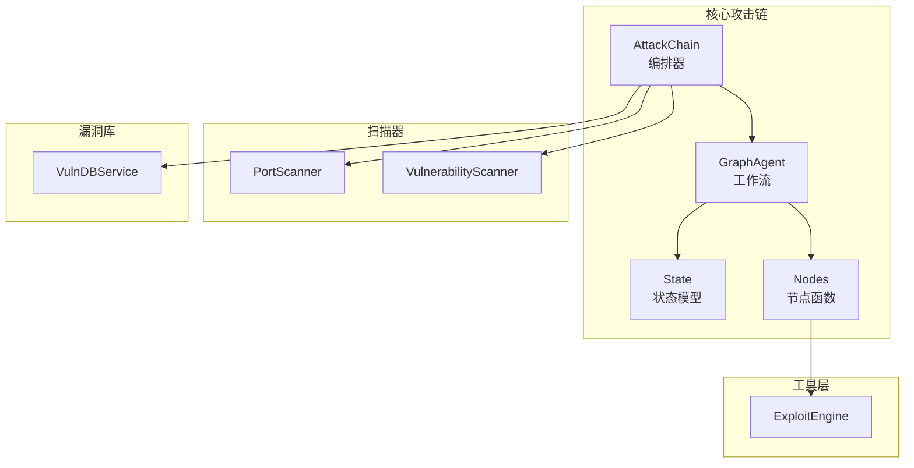
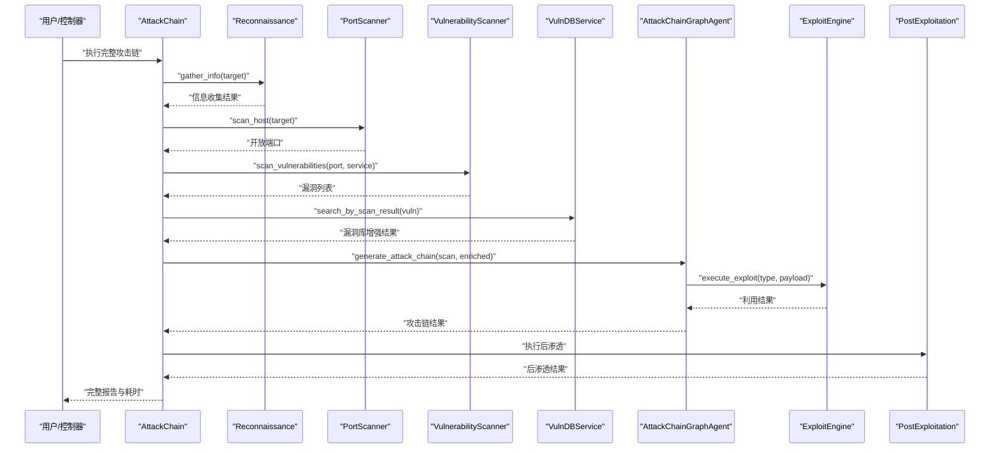
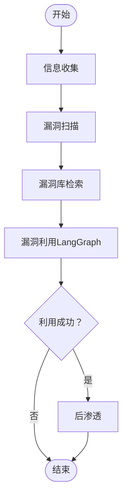
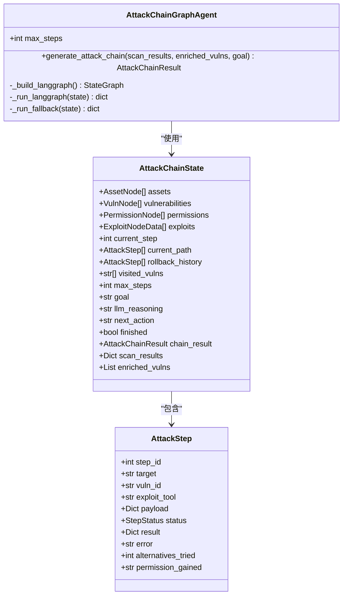
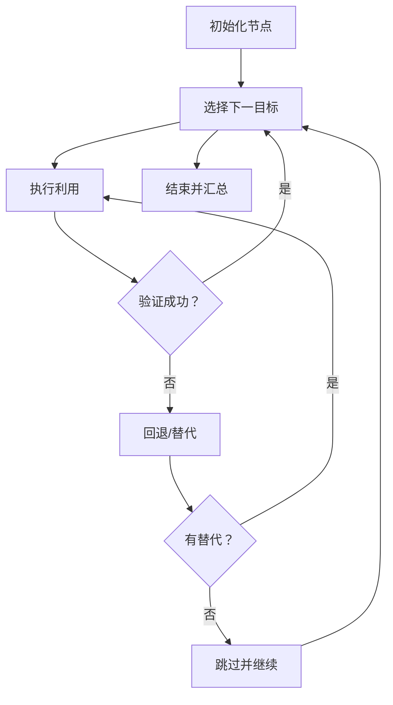
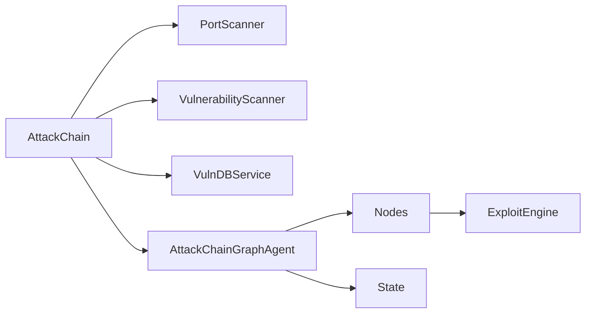

# 攻击链概览

<cite>
**本文档引用的文件**
- [core/attack_chain/attack_chain.py](file://core/attack_chain/attack_chain.py)
- [core/attack_chain/reconnaissance.py](file://core/attack_chain/reconnaissance.py)
- [core/attack_chain/exploitation.py](file://core/attack_chain/exploitation.py)
- [core/attack_chain/post_exploitation.py](file://core/attack_chain/post_exploitation.py)
- [core/attack_chain/graph/workflow.py](file://core/attack_chain/graph/workflow.py)
- [core/attack_chain/graph/nodes.py](file://core/attack_chain/graph/nodes.py)
- [core/attack_chain/graph/state.py](file://core/attack_chain/graph/state.py)
- [scanner/port_scanner.py](file://scanner/port_scanner.py)
- [scanner/vulnerability_scanner.py](file://scanner/vulnerability_scanner.py)
- [tools/offense/exploit/exploit_engine.py](file://tools/offense/exploit/exploit_engine.py)
- [core/vuln_db/vuln_db_service.py](file://core/vuln_db/vuln_db_service.py)
- [router/main.py](file://router/main.py)
</cite>

## 目录
1. [引言](#引言)
2. [项目结构](#项目结构)
3. [核心组件](#核心组件)
4. [架构总览](#架构总览)
5. [详细组件分析](#详细组件分析)
6. [依赖关系分析](#依赖关系分析)
7. [性能考量](#性能考量)
8. [故障排查指南](#故障排查指南)
9. [结论](#结论)
10. [附录](#附录)

## 引言
本文件面向Secbot攻击链系统，提供从理念到实现的全景式技术说明。系统以“自动化渗透测试”为目标，围绕“信息收集—漏洞扫描—漏洞利用—后渗透”的完整闭环展开，强调：
- 阶段化与可编排：通过明确的阶段划分与状态机控制，保证流程可控、可观测、可回退。
- 智能化与弹性：LangGraph工作流提供可编译的推理图，同时保留纯Python回退执行器，确保在不同运行环境下稳定可用。
- 可扩展与可定制：通过工具层抽象、漏洞库检索与技能加载器，支持灵活接入新工具、新策略与新攻击技术。

## 项目结构
Secbot采用分层与功能域结合的组织方式：
- 核心攻击链：位于core/attack_chain，包含阶段编排、推理图与状态定义。
- 扫描器：位于scanner，提供端口扫描与服务漏洞检测。
- 工具层：位于tools/offense/exploit，封装外部工具与内置exploit。
- 漏洞库服务：位于core/vuln_db，提供多源适配与向量检索。
- 路由与服务：位于router，提供REST+SSE服务入口。

图表来源
- [core/attack_chain/attack_chain.py](file://core/attack_chain/attack_chain.py#L18-L61)
- [core/attack_chain/graph/workflow.py](file://core/attack_chain/graph/workflow.py#L46-L96)
- [core/attack_chain/graph/state.py](file://core/attack_chain/graph/state.py#L101-L129)
- [core/attack_chain/graph/nodes.py](file://core/attack_chain/graph/nodes.py#L35-L119)
- [scanner/port_scanner.py](file://scanner/port_scanner.py#L33-L54)
- [scanner/vulnerability_scanner.py](file://scanner/vulnerability_scanner.py#L257-L288)
- [tools/offense/exploit/exploit_engine.py](file://tools/offense/exploit/exploit_engine.py#L18-L79)
- [core/vuln_db/vuln_db_service.py](file://core/vuln_db/vuln_db_service.py#L90-L145)

章节来源
- [core/attack_chain/attack_chain.py](file://core/attack_chain/attack_chain.py#L18-L61)
- [router/main.py](file://router/main.py#L19-L67)

## 核心组件
- 攻击链编排器：负责串联各阶段，记录结果与耗时，提供统一的执行入口。
- 推理工作流：LangGraph驱动的有向无环图（或回退有限状态机），实现“选择—执行—验证—回退—结束”的闭环。
- 状态模型：定义资产、漏洞、权限、利用节点与攻击步骤，承载推理过程中的数据与元信息。
- 扫描器：端口扫描与服务漏洞检测，为后续利用提供基础情报。
- 漏洞库服务：多源适配与向量检索，增强扫描结果的可解释性与可利用性。
- 工具引擎：统一封装外部工具（如Nuclei、Metasploit、Sqlmap）与内置exploit。

章节来源
- [core/attack_chain/attack_chain.py](file://core/attack_chain/attack_chain.py#L11-L61)
- [core/attack_chain/graph/workflow.py](file://core/attack_chain/graph/workflow.py#L28-L96)
- [core/attack_chain/graph/state.py](file://core/attack_chain/graph/state.py#L18-L129)
- [scanner/port_scanner.py](file://scanner/port_scanner.py#L14-L62)
- [scanner/vulnerability_scanner.py](file://scanner/vulnerability_scanner.py#L254-L288)
- [tools/offense/exploit/exploit_engine.py](file://tools/offense/exploit/exploit_engine.py#L11-L79)
- [core/vuln_db/vuln_db_service.py](file://core/vuln_db/vuln_db_service.py#L27-L145)

## 架构总览
整体架构以“阶段编排 + 推理图 + 工具执行”为核心，形成如下闭环：
- 信息收集：解析目标、扫描端口、识别服务、采集Web/DNS信息。
- 漏洞扫描：针对开放端口进行服务级漏洞检测。
- 漏洞库检索：将扫描结果映射到公开漏洞与利用信息，丰富可利用性。
- 漏洞利用：LangGraph生成最优攻击路径，逐步执行并验证，失败时回退或切换替代利用。
- 后渗透：在成功利用后执行权限提升、持久化与数据收集等动作。

图表来源
- [core/attack_chain/attack_chain.py](file://core/attack_chain/attack_chain.py#L18-L61)
- [core/attack_chain/reconnaissance.py](file://core/attack_chain/reconnaissance.py#L17-L34)
- [scanner/port_scanner.py](file://scanner/port_scanner.py#L33-L54)
- [scanner/vulnerability_scanner.py](file://scanner/vulnerability_scanner.py#L257-L288)
- [core/vuln_db/vuln_db_service.py](file://core/vuln_db/vuln_db_service.py#L90-L145)
- [core/attack_chain/graph/workflow.py](file://core/attack_chain/graph/workflow.py#L46-L96)
- [tools/offense/exploit/exploit_engine.py](file://tools/offense/exploit/exploit_engine.py#L18-L79)
- [core/attack_chain/post_exploitation.py](file://core/attack_chain/post_exploitation.py#L14-L34)

## 详细组件分析

### 攻击链编排器（AttackChain）
- 职责：统一调度信息收集、漏洞扫描、漏洞库检索、漏洞利用与后渗透阶段；聚合结果并统计耗时。
- 控制流：按顺序执行各阶段，利用LangGraph生成攻击链；若LangGraph不可用，则回退到传统模式。
- 状态管理：以字典保存各阶段结果，便于后续报告与审计。

图表来源
- [core/attack_chain/attack_chain.py](file://core/attack_chain/attack_chain.py#L18-L61)

章节来源
- [core/attack_chain/attack_chain.py](file://core/attack_chain/attack_chain.py#L11-L61)

### 信息收集（Reconnaissance）
- 能力：解析目标、解析IP、扫描常见端口、识别服务、采集Web与DNS信息。
- 输出：标准化信息字典，供后续阶段使用。

章节来源
- [core/attack_chain/reconnaissance.py](file://core/attack_chain/reconnaissance.py#L11-L150)

### 漏洞扫描（PortScanner + VulnerabilityScanner）
- 端口扫描：基于TCP connect的并发扫描，返回开放端口列表。
- 服务漏洞检测：针对HTTP/SSH/FTP等服务执行特征检测，输出漏洞清单。

章节来源
- [scanner/port_scanner.py](file://scanner/port_scanner.py#L14-L62)
- [scanner/vulnerability_scanner.py](file://scanner/vulnerability_scanner.py#L254-L288)

### 漏洞库检索（VulnDBService）
- 功能：按扫描结果进行向量检索与多源适配（CVE/NVD/ExploitDB/Mitre），补充漏洞详情、利用信息与缓解措施。
- 设计：延迟初始化嵌入器、向量存储与适配器，支持增量同步与在线关键词搜索。

章节来源
- [core/vuln_db/vuln_db_service.py](file://core/vuln_db/vuln_db_service.py#L27-L145)

### 漏洞利用（ExploitEngine）
- 能力：统一路由至外部工具（Nuclei/Metasploit/Sqlmap）或内置exploit，支持Web/Network/Post三类利用。
- 设计：异常捕获与结果标准化，记录耗时与工具信息。

章节来源
- [tools/offense/exploit/exploit_engine.py](file://tools/offense/exploit/exploit_engine.py#L11-L160)

### 推理工作流（AttackChainGraphAgent）
- LangGraph实现：构建StateGraph，节点包括初始化、选择下一目标、执行利用、验证、回退与结束。
- 回退执行器：在LangGraph不可用时，使用有限状态机循环执行相同逻辑。
- 路由函数：根据状态决定下一步动作（select/verify/rollback/finish）。

图表来源
- [core/attack_chain/graph/workflow.py](file://core/attack_chain/graph/workflow.py#L28-L96)
- [core/attack_chain/graph/state.py](file://core/attack_chain/graph/state.py#L101-L129)
- [core/attack_chain/graph/state.py](file://core/attack_chain/graph/state.py#L72-L84)

章节来源
- [core/attack_chain/graph/workflow.py](file://core/attack_chain/graph/workflow.py#L28-L96)
- [core/attack_chain/graph/nodes.py](file://core/attack_chain/graph/nodes.py#L35-L339)
- [core/attack_chain/graph/state.py](file://core/attack_chain/graph/state.py#L18-L129)

### 节点逻辑（nodes）
- 初始化：从扫描结果与增强漏洞构建资产、漏洞与利用节点，填充初始状态。
- 选择下一目标：按可利用性与CVSS排序，跳过已访问漏洞。
- 执行利用：调用ExploitEngine执行具体利用，记录结果与权限提升。
- 验证：根据结果判定成功或失败，决定继续或回退。
- 回退/替代：尝试同一漏洞的其他利用，否则移除失败步骤并继续。
- 结束：汇总成功步骤、回退次数与最终权限，生成最终结果。

图表来源
- [core/attack_chain/graph/nodes.py](file://core/attack_chain/graph/nodes.py#L35-L339)

章节来源
- [core/attack_chain/graph/nodes.py](file://core/attack_chain/graph/nodes.py#L122-L339)

### 后渗透（PostExploitationChain）
- 能力：在成功利用后执行权限提升、持久化与数据收集等动作。
- 设计：统一调用工具层的后渗透模块，返回结构化结果。

章节来源
- [core/attack_chain/post_exploitation.py](file://core/attack_chain/post_exploitation.py#L8-L36)

## 依赖关系分析
- 组件耦合：AttackChain对扫描器、漏洞库与工具引擎存在直接依赖；推理工作流对节点函数与状态模型存在强依赖。
- 外部依赖：LangGraph可选依赖，未安装时自动回退；工具层依赖外部工具（Nuclei/Metasploit/Sqlmap）。
- 数据依赖：各阶段输出作为下阶段输入，状态模型贯穿推理过程。

图表来源
- [core/attack_chain/attack_chain.py](file://core/attack_chain/attack_chain.py#L63-L212)
- [core/attack_chain/graph/workflow.py](file://core/attack_chain/graph/workflow.py#L102-L149)
- [core/attack_chain/graph/nodes.py](file://core/attack_chain/graph/nodes.py#L35-L119)
- [tools/offense/exploit/exploit_engine.py](file://tools/offense/exploit/exploit_engine.py#L18-L79)

章节来源
- [core/attack_chain/attack_chain.py](file://core/attack_chain/attack_chain.py#L63-L212)
- [core/attack_chain/graph/workflow.py](file://core/attack_chain/graph/workflow.py#L19-L26)

## 性能考量
- 并发与超时：端口扫描采用并发连接检测，合理设置超时避免阻塞；漏洞扫描对HTTP请求设置超时与线程池。
- 向量检索：嵌入器与向量存储延迟初始化，避免冷启动开销；阈值与limit控制召回质量与性能平衡。
- 回退策略：LangGraph不可用时自动切换回退执行器，保障可用性；替代利用次数限制防止无限重试。
- 日志与可观测：关键节点记录reasoning与错误信息，便于定位瓶颈与失败原因。

## 故障排查指南
- LangGraph不可用：查看日志提示并确认依赖安装；系统会自动回退到内置执行器。
- 工具不可用：外部工具（Nuclei/Metasploit/Sqlmap）未安装或不可执行时，系统回退到内置exploit或报错。
- 端口扫描失败：检查目标可达性与防火墙策略；适当增大超时或减少扫描端口范围。
- 漏洞库检索失败：网络异常或嵌入器初始化失败时，系统会降级跳过并记录警告。
- 利用失败：查看验证节点的错误信息与替代利用尝试次数；调整payload或更换工具。

章节来源
- [core/attack_chain/graph/workflow.py](file://core/attack_chain/graph/workflow.py#L20-L26)
- [tools/offense/exploit/exploit_engine.py](file://tools/offense/exploit/exploit_engine.py#L85-L103)
- [core/vuln_db/vuln_db_service.py](file://core/vuln_db/vuln_db_service.py#L52-L74)

## 结论
Secbot攻击链系统通过“阶段编排 + 推理图 + 工具执行”的架构，实现了从信息收集到后渗透的自动化闭环。其设计兼顾智能化与弹性，既能在具备LangGraph时进行复杂推理，也能在受限环境下稳定运行。通过漏洞库检索与工具层抽象，系统具备良好的可扩展性与可定制性，适合在不同场景下灵活部署与演进。

## 附录

### 攻击链执行控制与状态管理
- 执行控制：通过最大步数限制与“已完成”标志控制流程终止；节点间通过next_action传递控制信号。
- 状态管理：AttackChainState承载资产、漏洞、权限、利用与步骤历史，支持回退与替代路径追踪。

章节来源
- [core/attack_chain/graph/state.py](file://core/attack_chain/graph/state.py#L101-L129)
- [core/attack_chain/graph/nodes.py](file://core/attack_chain/graph/nodes.py#L324-L353)

### 扩展与定制指导
- 新增攻击步骤：在nodes中新增节点函数，定义状态流转与决策逻辑；在workflow中注册节点并添加边。
- 集成新攻击技术：在ExploitEngine中新增外部工具路由或内置exploit分支；在状态模型中扩展节点类型。
- 自适应调整：通过调整排序规则（如按CVSS与可利用性）、限制替代尝试次数与最大步数，实现策略自适应。

章节来源
- [core/attack_chain/graph/workflow.py](file://core/attack_chain/graph/workflow.py#L102-L149)
- [core/attack_chain/graph/nodes.py](file://core/attack_chain/graph/nodes.py#L122-L189)
- [tools/offense/exploit/exploit_engine.py](file://tools/offense/exploit/exploit_engine.py#L85-L130)

### 实际攻击场景示例与最佳实践
- 场景示例：Web应用渗透（HTTP敏感路径、安全头缺失、目录列表启用）→选择高CVSS漏洞→替代利用→权限提升与持久化。
- 最佳实践：
  - 明确目标与范围，合理设置扫描端口与超时；
  - 使用漏洞库检索增强扫描结果，优先选择高价值漏洞；
  - 在LangGraph可用时启用推理图，在受限环境使用回退执行器；
  - 记录每一步的reasoning与错误信息，便于复盘与优化。

章节来源
- [scanner/vulnerability_scanner.py](file://scanner/vulnerability_scanner.py#L13-L25)
- [core/attack_chain/graph/nodes.py](file://core/attack_chain/graph/nodes.py#L136-L149)
- [core/attack_chain/graph/nodes.py](file://core/attack_chain/graph/nodes.py#L264-L321)