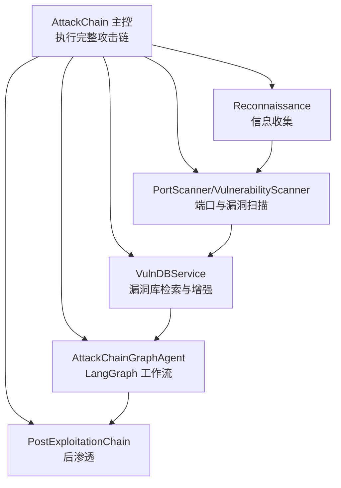
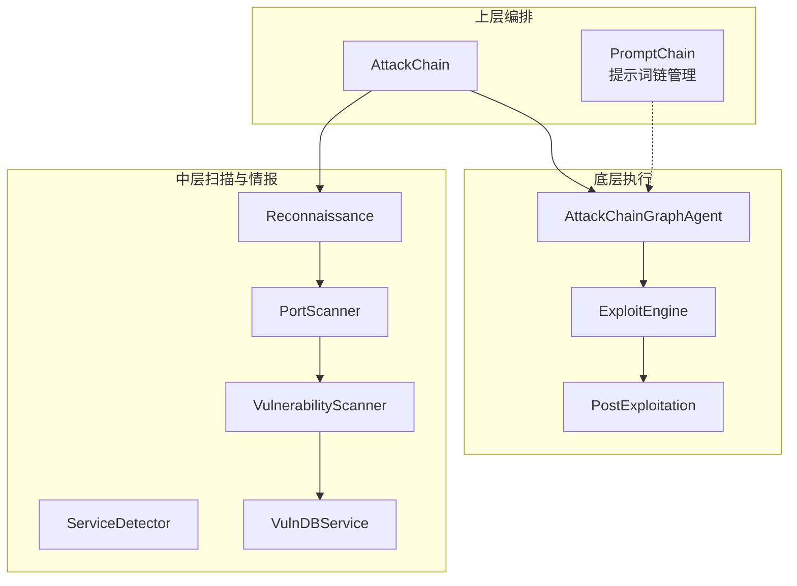
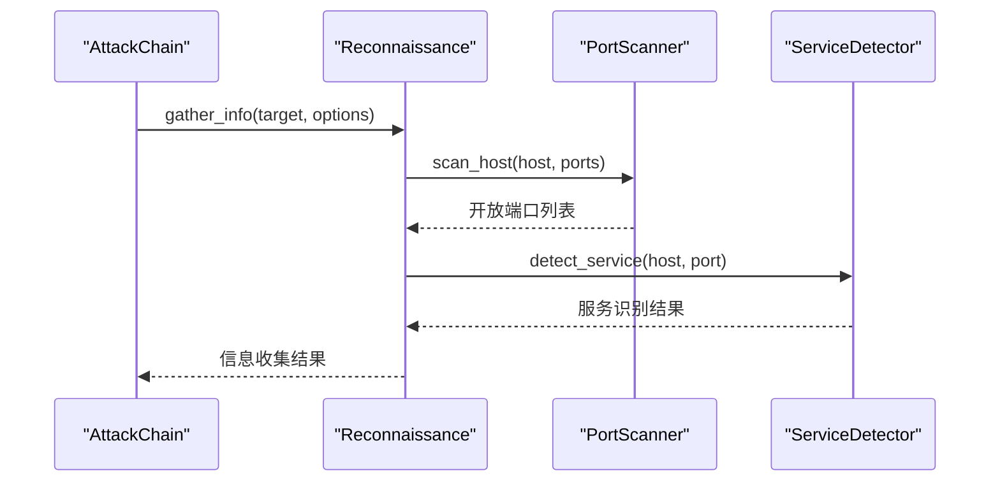
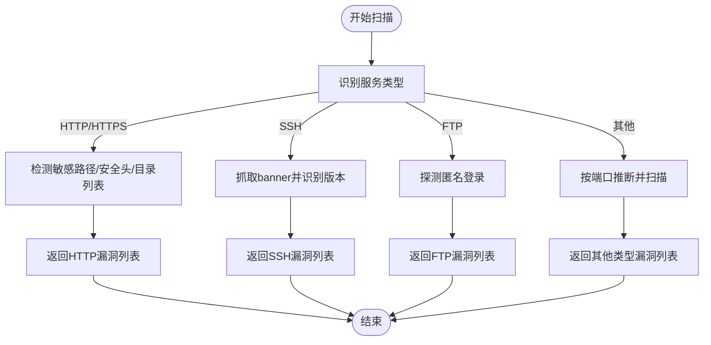
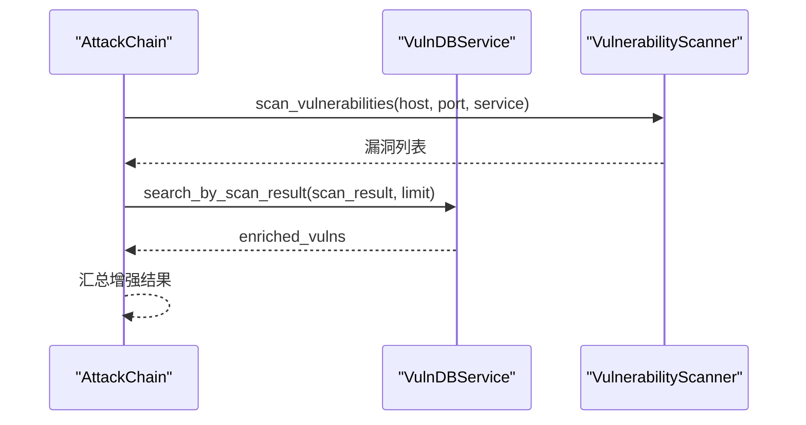
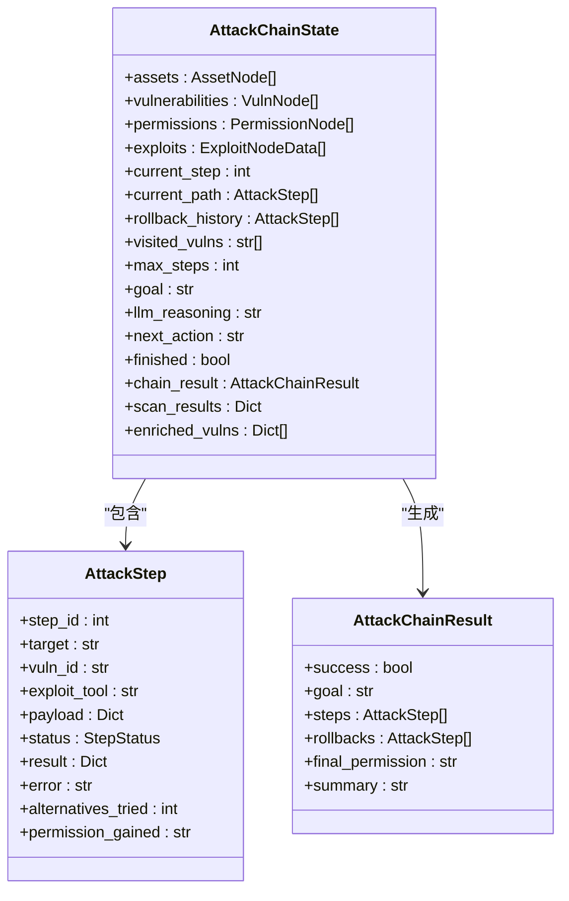
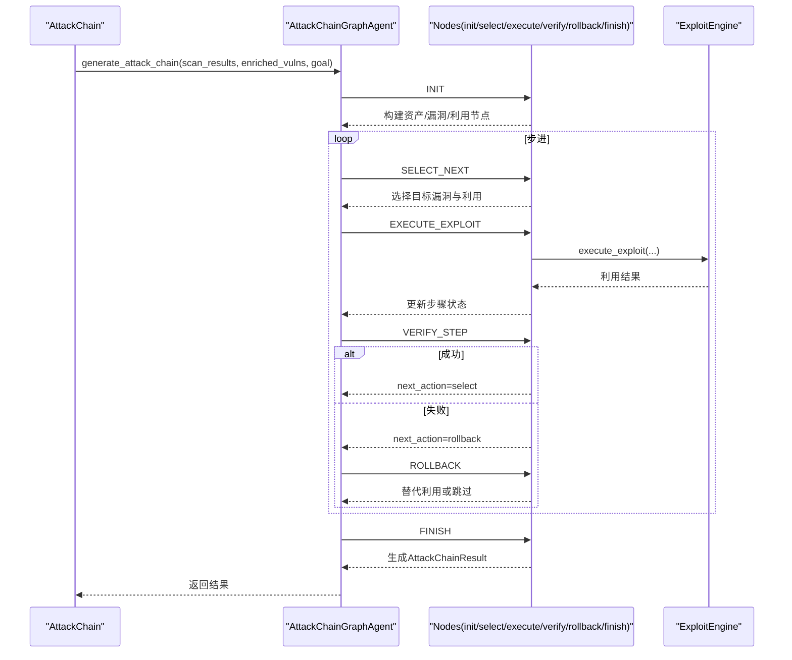
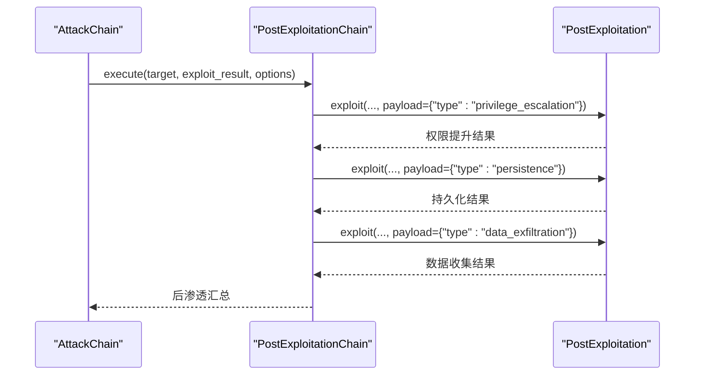
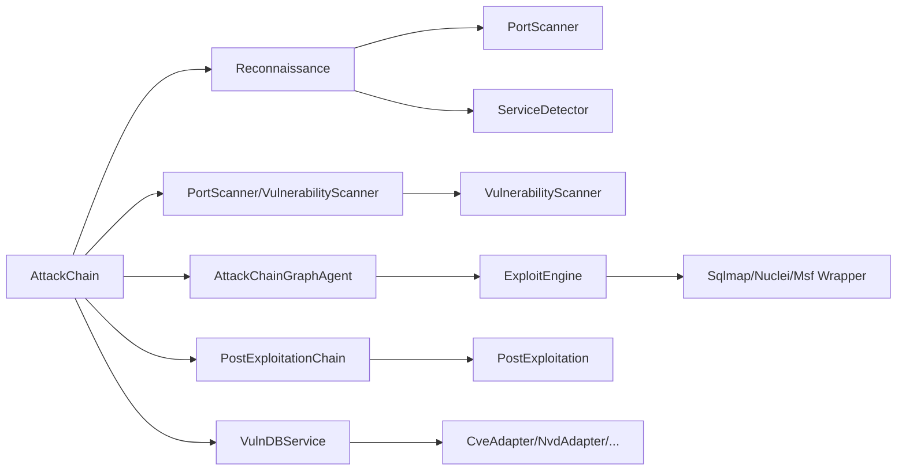

# 攻击链系统

<cite>
**本文引用的文件**
- [core/attack_chain/attack_chain.py](file://core/attack_chain/attack_chain.py)
- [core/attack_chain/reconnaissance.py](file://core/attack_chain/reconnaissance.py)
- [core/attack_chain/exploitation.py](file://core/attack_chain/exploitation.py)
- [core/attack_chain/post_exploitation.py](file://core/attack_chain/post_exploitation.py)
- [core/attack_chain/graph/workflow.py](file://core/attack_chain/graph/workflow.py)
- [core/attack_chain/graph/nodes.py](file://core/attack_chain/graph/nodes.py)
- [core/attack_chain/graph/state.py](file://core/attack_chain/graph/state.py)
- [scanner/port_scanner.py](file://scanner/port_scanner.py)
- [scanner/vulnerability_scanner.py](file://scanner/vulnerability_scanner.py)
- [scanner/service_detector.py](file://scanner/service_detector.py)
- [tools/offense/exploit/exploit_engine.py](file://tools/offense/exploit/exploit_engine.py)
- [core/vuln_db/vuln_db_service.py](file://core/vuln_db/vuln_db_service.py)
- [prompts/chain.py](file://prompts/chain.py)
</cite>

## 目录
1. [简介](#简介)
2. [项目结构](#项目结构)
3. [核心组件](#核心组件)
4. [架构总览](#架构总览)
5. [详细组件分析](#详细组件分析)
6. [依赖关系分析](#依赖关系分析)
7. [性能考量](#性能考量)
8. [故障排查指南](#故障排查指南)
9. [结论](#结论)
10. [附录](#附录)

## 简介
本文件面向Secbot的攻击链系统，系统性阐述从信息收集到后渗透的完整自动化流程。文档覆盖三大核心阶段：侦察阶段的信息收集与服务识别、漏洞扫描与检测、漏洞利用与后渗透阶段的权限提升与持久化；解释执行控制机制、阶段间依赖与状态管理；说明系统的灵活性设计与自适应调整能力；并提供扩展与定制指导，帮助读者在现有框架下添加新攻击步骤与集成新的攻击技术。

## 项目结构
攻击链系统位于core/attack_chain目录，围绕“自动化攻击链”主控类展开，配合扫描器、漏洞库服务、利用引擎与后渗透模块，形成端到端的自动化渗透流程。LangGraph图工作流提供推理与决策能力，同时保留纯Python回退执行器以保证在无LangGraph环境下的可用性。

图表来源
- [core/attack_chain/attack_chain.py](file://core/attack_chain/attack_chain.py#L18-L61)
- [core/attack_chain/reconnaissance.py](file://core/attack_chain/reconnaissance.py#L17-L34)
- [scanner/port_scanner.py](file://scanner/port_scanner.py#L33-L54)
- [scanner/vulnerability_scanner.py](file://scanner/vulnerability_scanner.py#L257-L288)
- [core/vuln_db/vuln_db_service.py](file://core/vuln_db/vuln_db_service.py#L90-L145)
- [core/attack_chain/graph/workflow.py](file://core/attack_chain/graph/workflow.py#L46-L96)
- [core/attack_chain/post_exploitation.py](file://core/attack_chain/post_exploitation.py#L14-L34)

章节来源
- [core/attack_chain/attack_chain.py](file://core/attack_chain/attack_chain.py#L18-L61)

## 核心组件
- 自动化攻击链主控：负责串联各阶段并汇总结果，包含信息收集、漏洞扫描、漏洞库增强、利用推理与后渗透。
- 信息收集模块：解析目标、解析IP、扫描端口、识别服务、收集Web与DNS信息。
- 漏洞扫描模块：按服务类型检测常见漏洞，如敏感路径暴露、安全头缺失、目录列表启用、SSH版本过旧、FTP匿名登录等。
- 漏洞库服务：多源适配与向量检索，将扫描结果映射到公开漏洞信息，补充CVSS、利用方式、缓解措施等。
- 利用引擎：支持内置与外部工具（sqlmap、nuclei、metasploit），按类型路由至对应利用器。
- 后渗透模块：权限提升、持久化、横向移动、数据收集等。
- LangGraph工作流：构建StateGraph，支持条件边与回退执行，实现可自适应的攻击链推理。

章节来源
- [core/attack_chain/attack_chain.py](file://core/attack_chain/attack_chain.py#L11-L61)
- [core/attack_chain/reconnaissance.py](file://core/attack_chain/reconnaissance.py#L11-L34)
- [scanner/vulnerability_scanner.py](file://scanner/vulnerability_scanner.py#L254-L288)
- [core/vuln_db/vuln_db_service.py](file://core/vuln_db/vuln_db_service.py#L27-L44)
- [tools/offense/exploit/exploit_engine.py](file://tools/offense/exploit/exploit_engine.py#L11-L79)
- [core/attack_chain/post_exploitation.py](file://core/attack_chain/post_exploitation.py#L8-L34)
- [core/attack_chain/graph/workflow.py](file://core/attack_chain/graph/workflow.py#L28-L96)

## 架构总览
攻击链采用分层与模块化设计：上层主控编排，中层扫描与情报增强，底层利用与后渗透，顶层LangGraph提供智能推理与回退执行。

图表来源
- [core/attack_chain/attack_chain.py](file://core/attack_chain/attack_chain.py#L18-L61)
- [core/attack_chain/reconnaissance.py](file://core/attack_chain/reconnaissance.py#L17-L34)
- [scanner/port_scanner.py](file://scanner/port_scanner.py#L33-L54)
- [scanner/vulnerability_scanner.py](file://scanner/vulnerability_scanner.py#L257-L288)
- [scanner/service_detector.py](file://scanner/service_detector.py#L32-L55)
- [core/vuln_db/vuln_db_service.py](file://core/vuln_db/vuln_db_service.py#L90-L145)
- [core/attack_chain/graph/workflow.py](file://core/attack_chain/graph/workflow.py#L46-L96)
- [tools/offense/exploit/exploit_engine.py](file://tools/offense/exploit/exploit_engine.py#L18-L79)
- [core/attack_chain/post_exploitation.py](file://core/attack_chain/post_exploitation.py#L14-L34)
- [prompts/chain.py](file://prompts/chain.py#L23-L74)

## 详细组件分析

### 信息收集阶段
- 功能要点：解析目标主机名与IP、扫描常见端口、识别服务类型、收集Web与DNS信息。
- 关键流程：端口扫描使用并发连接探测；服务识别基于端口映射；Web信息通过HTTP请求采集基础元数据；DNS信息通过解析与反查获取。
- 输出结构：包含目标、主机名、IP、开放端口、服务列表、Web信息、DNS信息等。

图表来源
- [core/attack_chain/attack_chain.py](file://core/attack_chain/attack_chain.py#L63-L67)
- [core/attack_chain/reconnaissance.py](file://core/attack_chain/reconnaissance.py#L17-L34)
- [scanner/port_scanner.py](file://scanner/port_scanner.py#L33-L54)
- [scanner/service_detector.py](file://scanner/service_detector.py#L32-L55)

章节来源
- [core/attack_chain/reconnaissance.py](file://core/attack_chain/reconnaissance.py#L17-L150)
- [scanner/port_scanner.py](file://scanner/port_scanner.py#L14-L63)
- [scanner/service_detector.py](file://scanner/service_detector.py#L29-L56)

### 漏洞扫描与检测
- 功能要点：针对HTTP/HTTPS、SSH、FTP等服务进行专项检测，涵盖敏感路径暴露、安全头缺失、目录列表启用、SSH版本过旧、FTP匿名登录等。
- 实现细节：HTTP检测通过同步GET请求与正则特征判断；SSH通过banner抓取与版本解析；FTP通过用户名/密码交互探测匿名登录。
- 输出结构：每项检测返回类型、严重性、描述、URL/路径、推荐修复等字段。

图表来源
- [scanner/vulnerability_scanner.py](file://scanner/vulnerability_scanner.py#L254-L288)
- [scanner/vulnerability_scanner.py](file://scanner/vulnerability_scanner.py#L139-L146)
- [scanner/vulnerability_scanner.py](file://scanner/vulnerability_scanner.py#L193-L208)
- [scanner/vulnerability_scanner.py](file://scanner/vulnerability_scanner.py#L241-L251)

章节来源
- [scanner/vulnerability_scanner.py](file://scanner/vulnerability_scanner.py#L12-L289)

### 漏洞库检索与增强
- 功能要点：将扫描结果映射到公开漏洞数据库，补充CVSS、利用方式、缓解措施、参考链接等。
- 实现细节：向量检索+关键词在线搜索，支持CVE ID直查与自然语言语义检索；多适配器（NVD/CVE/ExploitDB/Mitre）聚合。
- 输出结构：返回匹配的漏洞列表及统计信息，用于后续利用推理。

图表来源
- [core/attack_chain/attack_chain.py](file://core/attack_chain/attack_chain.py#L97-L138)
- [core/vuln_db/vuln_db_service.py](file://core/vuln_db/vuln_db_service.py#L90-L145)
- [scanner/vulnerability_scanner.py](file://scanner/vulnerability_scanner.py#L257-L288)

章节来源
- [core/vuln_db/vuln_db_service.py](file://core/vuln_db/vuln_db_service.py#L27-L275)

### 利用推理与执行（LangGraph）
- 功能要点：构建StateGraph，支持初始化、选择下一漏洞、执行利用、验证步骤、回退或替代、完成等节点；在LangGraph不可用时回退到纯Python有限状态机。
- 关键状态：资产节点、漏洞节点、权限节点、利用节点数据；攻击步骤状态（待定/运行/成功/失败/回退）；最终攻击链结果。
- 控制流：条件边驱动next_action（select/verify/rollback/finish），支持最大步数限制与回退历史记录。

图表来源
- [core/attack_chain/graph/state.py](file://core/attack_chain/graph/state.py#L101-L129)

图表来源
- [core/attack_chain/graph/workflow.py](file://core/attack_chain/graph/workflow.py#L46-L96)
- [core/attack_chain/graph/nodes.py](file://core/attack_chain/graph/nodes.py#L35-L119)
- [core/attack_chain/graph/nodes.py](file://core/attack_chain/graph/nodes.py#L122-L189)
- [core/attack_chain/graph/nodes.py](file://core/attack_chain/graph/nodes.py#L192-L234)
- [core/attack_chain/graph/nodes.py](file://core/attack_chain/graph/nodes.py#L237-L261)
- [core/attack_chain/graph/nodes.py](file://core/attack_chain/graph/nodes.py#L264-L321)
- [core/attack_chain/graph/nodes.py](file://core/attack_chain/graph/nodes.py#L324-L353)

章节来源
- [core/attack_chain/graph/workflow.py](file://core/attack_chain/graph/workflow.py#L28-L206)
- [core/attack_chain/graph/nodes.py](file://core/attack_chain/graph/nodes.py#L20-L376)
- [core/attack_chain/graph/state.py](file://core/attack_chain/graph/state.py#L18-L129)

### 传统漏洞利用回退
- 功能要点：当LangGraph不可用或推理失败时，回退到传统模式，按漏洞类型直接调用利用引擎执行。
- 适用场景：保持向后兼容，简化部署与运行环境要求。

章节来源
- [core/attack_chain/attack_chain.py](file://core/attack_chain/attack_chain.py#L184-L205)
- [core/attack_chain/exploitation.py](file://core/attack_chain/exploitation.py#L8-L36)

### 后渗透阶段
- 功能要点：在利用成功后执行权限提升、持久化、横向移动与数据收集等操作。
- 执行顺序：权限提升优先，随后持久化与数据收集；横向移动作为可选扩展。

图表来源
- [core/attack_chain/attack_chain.py](file://core/attack_chain/attack_chain.py#L207-L212)
- [core/attack_chain/post_exploitation.py](file://core/attack_chain/post_exploitation.py#L14-L34)
- [tools/offense/exploit/post_exploitation.py](file://tools/offense/exploit/post_exploitation.py#L16-L106)

章节来源
- [core/attack_chain/post_exploitation.py](file://core/attack_chain/post_exploitation.py#L8-L36)
- [tools/offense/exploit/post_exploitation.py](file://tools/offense/exploit/post_exploitation.py#L10-L107)

### 提示词链管理（辅助）
- 功能要点：提供提示词节点的增删改查与组合能力，便于在推理或提示工程中组织上下文、约束与示例。
- 应用场景：可与LangGraph结合，为LLM决策提供结构化提示词链。

章节来源
- [prompts/chain.py](file://prompts/chain.py#L10-L140)

## 依赖关系分析
- 组件耦合与内聚：AttackChain主控高内聚地编排各模块；LangGraph工作流与节点函数职责清晰；利用引擎与后渗透模块通过统一接口解耦。
- 直接与间接依赖：信息收集依赖端口扫描与服务识别；漏洞扫描依赖HTTP/网络探测；漏洞库服务依赖多适配器与向量存储；利用引擎依赖外部工具包装器。
- 外部依赖与集成点：LangGraph（可选）、外部工具（sqlmap/nuclei/metasploit）、嵌入模型服务（OllamaEmbeddings）。
- 接口契约：ExploitEngine的execute_exploit接口统一了利用入口；PostExploitation的exploit接口统一了后渗透入口。

图表来源
- [core/attack_chain/attack_chain.py](file://core/attack_chain/attack_chain.py#L18-L61)
- [core/attack_chain/graph/workflow.py](file://core/attack_chain/graph/workflow.py#L46-L96)
- [tools/offense/exploit/exploit_engine.py](file://tools/offense/exploit/exploit_engine.py#L85-L130)
- [core/vuln_db/vuln_db_service.py](file://core/vuln_db/vuln_db_service.py#L39-L44)

章节来源
- [core/attack_chain/attack_chain.py](file://core/attack_chain/attack_chain.py#L11-L61)
- [tools/offense/exploit/exploit_engine.py](file://tools/offense/exploit/exploit_engine.py#L11-L160)
- [core/vuln_db/vuln_db_service.py](file://core/vuln_db/vuln_db_service.py#L27-L44)

## 性能考量
- 异步I/O与并发：端口扫描与HTTP检测广泛使用异步与并发任务，降低整体等待时间。
- 资源限制：LangGraph工作流设置最大步数限制，避免无限循环；利用引擎对工具超时进行配置。
- 向量检索优化：漏洞库服务在向量库存在数据时优先进行向量检索，减少在线查询次数。
- 回退策略：LangGraph不可用时自动切换到纯Python有限状态机，确保可用性与稳定性。

## 故障排查指南
- LangGraph不可用：系统会记录日志并回退到内置执行器；检查依赖安装与版本兼容性。
- 利用执行异常：节点函数捕获异常并标记步骤失败，记录错误信息；检查目标可达性与工具可用性。
- 漏洞库检索失败：服务对异常进行降级处理并返回空结果；检查嵌入模型服务与网络连通性。
- 端口扫描超时：调整超时参数与并发度；确认防火墙与网络策略。
- 后渗透执行：当前实现为占位逻辑，需结合具体远程控制能力完善命令执行与结果回传。

章节来源
- [core/attack_chain/graph/workflow.py](file://core/attack_chain/graph/workflow.py#L20-L26)
- [core/attack_chain/graph/workflow.py](file://core/attack_chain/graph/workflow.py#L151-L158)
- [core/attack_chain/graph/nodes.py](file://core/attack_chain/graph/nodes.py#L224-L227)
- [core/attack_chain/attack_chain.py](file://core/attack_chain/attack_chain.py#L136-L138)
- [scanner/port_scanner.py](file://scanner/port_scanner.py#L17-L18)
- [tools/offense/exploit/exploit_engine.py](file://tools/offense/exploit/exploit_engine.py#L71-L79)
- [core/attack_chain/post_exploitation.py](file://core/attack_chain/post_exploitation.py#L14-L34)

## 结论
Secbot的攻击链系统通过模块化设计与LangGraph推理实现了从信息收集到后渗透的自动化闭环。系统具备良好的扩展性与自适应能力，既能在复杂环境下进行智能决策，也能在受限环境中回退到传统模式。通过统一的利用与后渗透接口，系统为后续集成更多攻击技术与策略提供了清晰的扩展路径。

## 附录

### 攻击链执行控制与状态管理
- 控制机制：通过next_action与条件边驱动状态流转；支持最大步数限制与回退历史记录。
- 状态管理：AttackChainState集中承载图状态，AttackStep记录单步执行详情，AttackChainResult汇总最终结果。
- 权限演进：根据成功步骤的权限标记计算最终权限等级。

章节来源
- [core/attack_chain/graph/workflow.py](file://core/attack_chain/graph/workflow.py#L196-L205)
- [core/attack_chain/graph/state.py](file://core/attack_chain/graph/state.py#L101-L129)
- [core/attack_chain/graph/nodes.py](file://core/attack_chain/graph/nodes.py#L324-L353)

### 攻击链的灵活性与自适应调整
- 策略适配：LangGraph节点函数可替换为LLM驱动的决策逻辑；当前实现为规则排序与回退策略。
- 参数化：支持最大步数、目标权限等参数注入；提示词链可按场景定制。
- 多工具集成：利用引擎按类型路由至不同外部工具，便于扩展新的攻击技术。

章节来源
- [core/attack_chain/graph/nodes.py](file://core/attack_chain/graph/nodes.py#L122-L189)
- [tools/offense/exploit/exploit_engine.py](file://tools/offense/exploit/exploit_engine.py#L85-L130)
- [prompts/chain.py](file://prompts/chain.py#L105-L140)

### 扩展与定制指导
- 添加新的攻击步骤：在LangGraph节点中新增节点函数，定义状态流转与动作；在状态模型中扩展字段。
- 集成新的攻击技术：在利用引擎中新增工具路由分支；在漏洞库服务中扩展适配器；在提示词链中增加上下文与示例。
- 后渗透扩展：在后渗透模块中新增payload类型与执行逻辑；完善命令执行与结果回传。

章节来源
- [core/attack_chain/graph/nodes.py](file://core/attack_chain/graph/nodes.py#L35-L119)
- [tools/offense/exploit/exploit_engine.py](file://tools/offense/exploit/exploit_engine.py#L85-L130)
- [core/vuln_db/vuln_db_service.py](file://core/vuln_db/vuln_db_service.py#L39-L44)
- [prompts/chain.py](file://prompts/chain.py#L105-L140)

### 实际攻击场景示例与最佳实践
- 场景示例：Web应用渗透（HTTP敏感路径、安全头缺失、目录列表启用）→ 漏洞库增强 → 利用推理 → 权限提升与持久化。
- 最佳实践：合理设置最大步数与超时；优先使用向量检索与CVE直查；在LangGraph不可用时启用回退执行器；对关键步骤记录详细日志以便审计。

章节来源
- [scanner/vulnerability_scanner.py](file://scanner/vulnerability_scanner.py#L12-L289)
- [core/vuln_db/vuln_db_service.py](file://core/vuln_db/vuln_db_service.py#L90-L145)
- [core/attack_chain/graph/workflow.py](file://core/attack_chain/graph/workflow.py#L163-L188)