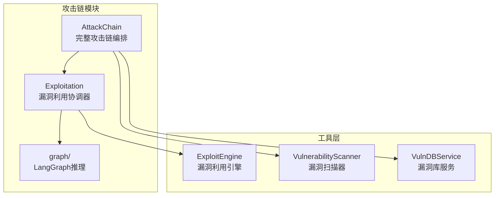
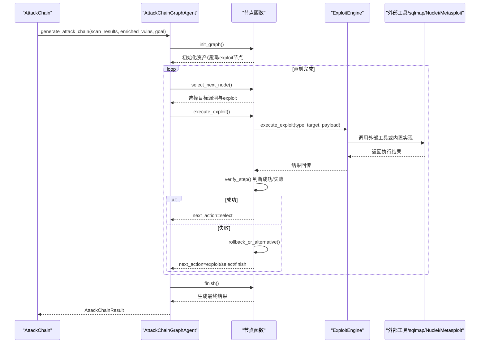
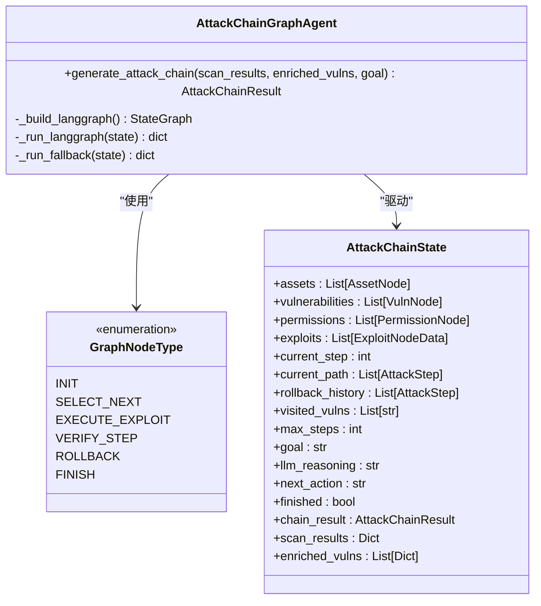
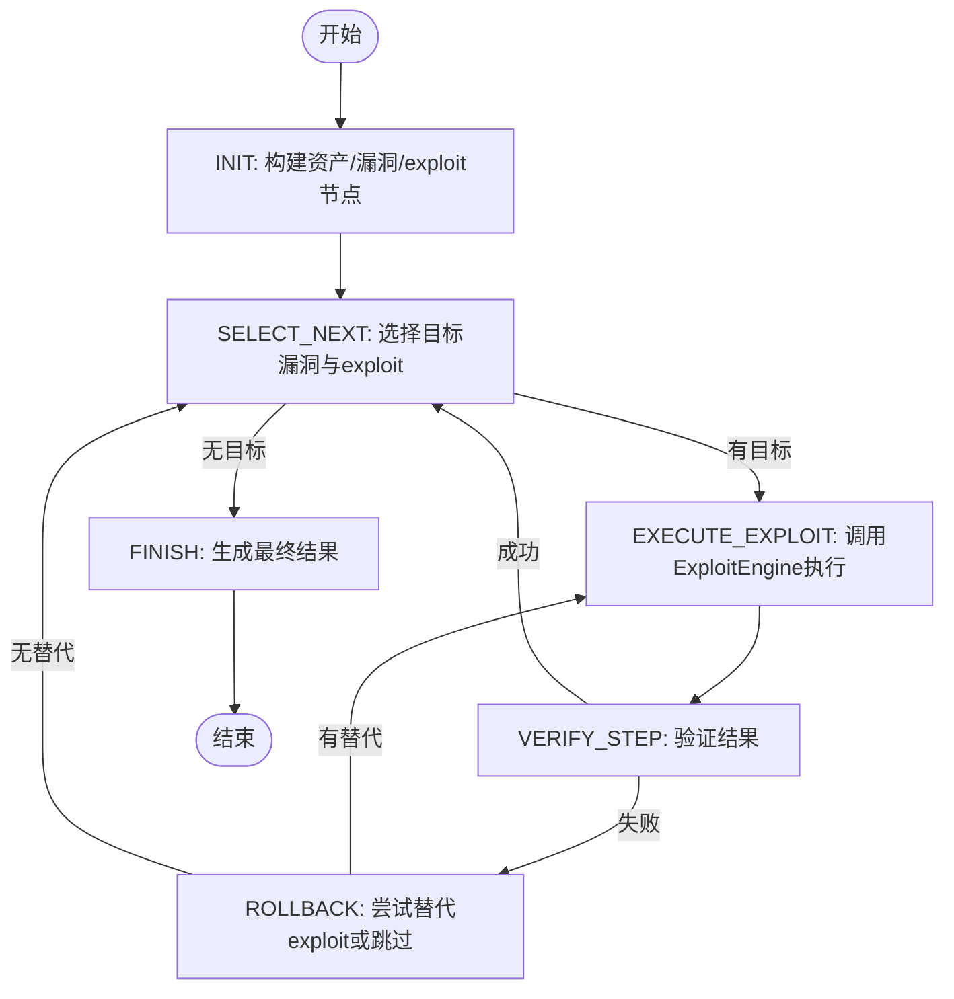
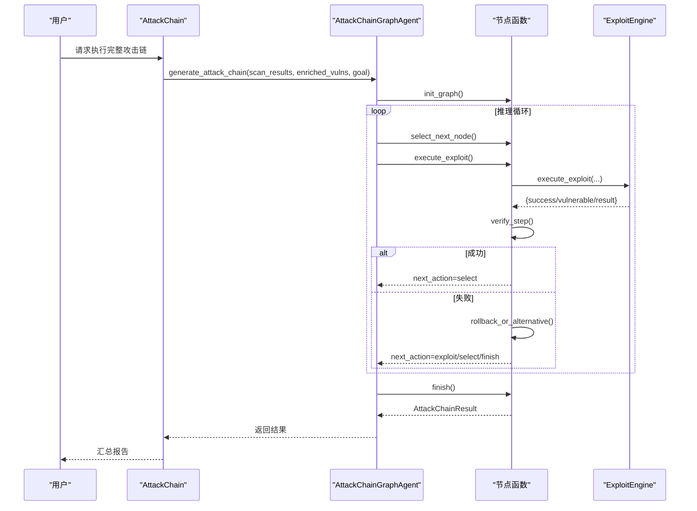
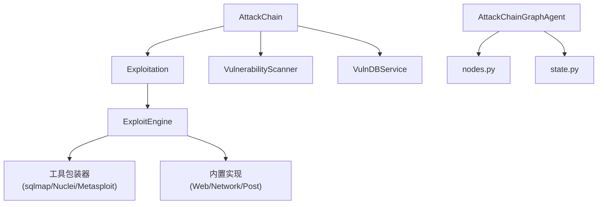

# 漏洞利用阶段

<cite>
**本文档引用的文件**
- [exploitation.py](file://core/attack_chain/exploitation.py)
- [nodes.py](file://core/attack_chain/graph/nodes.py)
- [state.py](file://core/attack_chain/graph/state.py)
- [workflow.py](file://core/attack_chain/graph/workflow.py)
- [attack_chain.py](file://core/attack_chain/attack_chain.py)
- [exploit_engine.py](file://tools/offense/exploit/exploit_engine.py)
- [vuln_db_service.py](file://core/vuln_db/vuln_db_service.py)
- [vulnerability_scanner.py](file://scanner/vulnerability_scanner.py)
- [hackbot_security.yaml](file://prompts/templates/hackbot_security.yaml)
</cite>

## 目录
1. [简介](#简介)
2. [项目结构](#项目结构)
3. [核心组件](#核心组件)
4. [架构总览](#架构总览)
5. [详细组件分析](#详细组件分析)
6. [依赖关系分析](#依赖关系分析)
7. [性能考量](#性能考量)
8. [故障排除指南](#故障排除指南)
9. [结论](#结论)
10. [附录](#附录)

## 简介
本章节概述Secbot攻击链的漏洞利用阶段，重点阐述基于LangGraph的图推理与智能攻击链生成机制。该阶段负责将扫描阶段发现的漏洞转化为可执行的攻击步骤，通过智能决策选择最优利用路径，并在失败时进行回退与替代。系统同时支持LangGraph原生执行与Python回退执行两种模式，确保在不同环境下均能稳定运行。

## 项目结构
漏洞利用阶段位于`core/attack_chain/`目录下，核心文件包括：
- `exploitation.py`：对外暴露的漏洞利用协调器，封装利用逻辑
- `graph/`：LangGraph攻击链图推理实现，包含节点定义、状态模型与工作流
- `attack_chain.py`：完整攻击链编排，串联信息收集、扫描、漏洞库检索与利用阶段

**图表来源**
- [attack_chain.py](file://core/attack_chain/attack_chain.py#L1-L213)
- [exploitation.py](file://core/attack_chain/exploitation.py#L1-L36)
- [workflow.py](file://core/attack_chain/graph/workflow.py#L1-L206)
- [exploit_engine.py](file://tools/offense/exploit/exploit_engine.py#L1-L160)
- [vulnerability_scanner.py](file://scanner/vulnerability_scanner.py#L1-L289)
- [vuln_db_service.py](file://core/vuln_db/vuln_db_service.py#L1-L275)

**章节来源**
- [attack_chain.py](file://core/attack_chain/attack_chain.py#L1-L213)
- [exploitation.py](file://core/attack_chain/exploitation.py#L1-L36)

## 核心组件
- 漏洞利用协调器（Exploitation）：负责遍历发现的漏洞并调用利用引擎执行
- LangGraph攻击链图（AttackChainGraphAgent）：以状态图形式组织推理与执行，支持条件边与回退
- 漏洞利用引擎（ExploitEngine）：统一调度内置与外部工具（sqlmap/Nuclei/Metasploit）
- 漏洞库服务（VulnDBService）：将扫描结果映射到公开漏洞信息，提供exploit元数据
- 漏洞扫描器（VulnerabilityScanner）：针对HTTP/SSH/FTP等服务执行基础漏洞检测

**章节来源**
- [exploitation.py](file://core/attack_chain/exploitation.py#L8-L36)
- [workflow.py](file://core/attack_chain/graph/workflow.py#L28-L206)
- [exploit_engine.py](file://tools/offense/exploit/exploit_engine.py#L11-L160)
- [vuln_db_service.py](file://core/vuln_db/vuln_db_service.py#L27-L275)
- [vulnerability_scanner.py](file://scanner/vulnerability_scanner.py#L254-L289)

## 架构总览
漏洞利用阶段采用“阶段编排 + 图推理 + 工具执行”的三层架构：
- 阶段编排：AttackChain在完整攻击链中调用漏洞利用阶段
- 图推理：AttackChainGraphAgent构建StateGraph，节点间通过条件边流转
- 工具执行：ExploitEngine根据漏洞类型与载荷选择合适的工具或内置实现

**图表来源**
- [attack_chain.py](file://core/attack_chain/attack_chain.py#L140-L179)
- [workflow.py](file://core/attack_chain/graph/workflow.py#L46-L96)
- [nodes.py](file://core/attack_chain/graph/nodes.py#L35-L353)
- [exploit_engine.py](file://tools/offense/exploit/exploit_engine.py#L18-L79)

## 详细组件分析

### LangGraph攻击链图设计
LangGraph攻击链图由以下节点构成：
- INIT：从扫描结果与漏洞库增强结果构建资产、漏洞与exploit节点
- SELECT_NEXT：基于CVSS分数与可利用性排序候选漏洞，选择下一个目标
- EXECUTE_EXPLOIT：调用ExploitEngine执行利用
- VERIFY_STEP：验证上一步执行结果，决定继续或回退
- ROLLBACK：尝试同一漏洞的替代exploit或跳过
- FINISH：汇总最终结果，计算最终权限与回退次数

**图表来源**
- [workflow.py](file://core/attack_chain/graph/workflow.py#L28-L149)
- [state.py](file://core/attack_chain/graph/state.py#L101-L129)

**章节来源**
- [workflow.py](file://core/attack_chain/graph/workflow.py#L102-L149)
- [state.py](file://core/attack_chain/graph/state.py#L101-L129)

### 节点功能与状态转换
- INIT：解析扫描结果与增强漏洞，构建资产、漏洞与exploit三类节点，设置初始next_action为select
- SELECT_NEXT：检查步数上限与已访问漏洞集合，按可利用性与CVSS排序候选，选择首个可用exploit并生成AttackStep
- EXECUTE_EXPLOIT：将漏洞类型映射至引擎类型，调用ExploitEngine执行，更新步骤状态与结果
- VERIFY_STEP：根据步骤状态决定继续select还是进入rollback
- ROLLBACK：尝试同一漏洞的替代exploit（最多3次），否则移除失败步骤并继续select
- FINISH：统计成功步骤数量、最终权限等级与回退次数，生成AttackChainResult

**图表来源**
- [nodes.py](file://core/attack_chain/graph/nodes.py#L35-L353)

**章节来源**
- [nodes.py](file://core/attack_chain/graph/nodes.py#L35-L353)

### 智能决策机制
- 漏洞排序：优先高可利用性（high/medium/low），其次CVSS分数降序
- 工具选择：根据漏洞类型映射到web或network，若无可用exploit则回退到builtin
- 回退策略：同一漏洞最多尝试3次替代exploit，失败后移除步骤并继续选择下一个漏洞
- 步数限制：默认最大步数为15，超过则终止并生成结果

**章节来源**
- [nodes.py](file://core/attack_chain/graph/nodes.py#L122-L189)
- [nodes.py](file://core/attack_chain/graph/nodes.py#L264-L321)
- [nodes.py](file://core/attack_chain/graph/nodes.py#L361-L375)

### 工具选择与执行控制
- ExploitEngine统一入口：根据exploit_type与tool_hint选择外部工具或内置实现
- 外部工具：sqlmap（SQL注入）、Nuclei（通用扫描）、Metasploit（模块化利用）
- 内置实现：Web/Network/Post三种类型，保持向后兼容
- 执行控制：记录开始/结束时间、耗时与错误信息，便于审计与追踪

**章节来源**
- [exploit_engine.py](file://tools/offense/exploit/exploit_engine.py#L18-L79)
- [exploit_engine.py](file://tools/offense/exploit/exploit_engine.py#L105-L129)

### 配置选项与参数调优
- 最大步数限制：通过options传入，缺省15；用于控制攻击链深度与资源消耗
- 目标权限：通过goal参数传入，默认“获取最高权限”，用于结果汇总
- 工具超时：sqlmap与Nuclei分别支持timeout参数，缺省分别为120秒与180秒
- 模块化利用：Metasploit需要module_type与module_name参数，否则返回错误
- 回退次数：同一漏洞最多尝试3次替代exploit

**章节来源**
- [attack_chain.py](file://core/attack_chain/attack_chain.py#L151-L156)
- [exploit_engine.py](file://tools/offense/exploit/exploit_engine.py#L107-L111)
- [exploit_engine.py](file://tools/offense/exploit/exploit_engine.py#L115-L119)
- [exploit_engine.py](file://tools/offense/exploit/exploit_engine.py#L125-L129)
- [nodes.py](file://core/attack_chain/graph/nodes.py#L292-L312)

### 实际示例与执行流程
- 输入：扫描结果包含目标、端口与漏洞列表；漏洞库增强结果包含CVE、CVSS与exploit元数据
- 流程：INIT构建节点 → SELECT_NEXT选择最高价值漏洞 → EXECUTE_EXPLOIT执行 → VERIFY_STEP判定 → ROLLBACK替代或跳过 → FINISH汇总
- 输出：AttackChainResult包含成功步骤数、最终权限、回退次数与摘要信息

**图表来源**
- [attack_chain.py](file://core/attack_chain/attack_chain.py#L140-L179)
- [workflow.py](file://core/attack_chain/graph/workflow.py#L46-L96)
- [nodes.py](file://core/attack_chain/graph/nodes.py#L192-L234)
- [exploit_engine.py](file://tools/offense/exploit/exploit_engine.py#L18-L79)

## 依赖关系分析
- 漏洞利用协调器依赖ExploitEngine执行具体利用
- LangGraph工作流依赖节点函数与状态模型
- 攻击链编排依赖漏洞扫描器与漏洞库服务提供输入
- ExploitEngine依赖外部工具包装器（sqlmap/Nuclei/Metasploit）与内置实现

**图表来源**
- [exploitation.py](file://core/attack_chain/exploitation.py#L16-L29)
- [exploit_engine.py](file://tools/offense/exploit/exploit_engine.py#L105-L151)
- [attack_chain.py](file://core/attack_chain/attack_chain.py#L140-L179)
- [workflow.py](file://core/attack_chain/graph/workflow.py#L102-L149)

**章节来源**
- [exploitation.py](file://core/attack_chain/exploitation.py#L16-L29)
- [exploit_engine.py](file://tools/offense/exploit/exploit_engine.py#L105-L151)
- [attack_chain.py](file://core/attack_chain/attack_chain.py#L140-L179)
- [workflow.py](file://core/attack_chain/graph/workflow.py#L102-L149)

## 性能考量
- 并发与异步：ExploitEngine与节点函数均采用异步实现，提升I/O密集场景下的吞吐
- 步数限制：通过max_steps控制推理深度，避免长时间阻塞
- 工具超时：sqlmap与Nuclei设置合理超时，防止扫描过程卡死
- 回退策略：限制替代exploit尝试次数，降低重复执行成本

[本节为通用性能讨论，无需特定文件来源]

## 故障排除指南
- LangGraph不可用：系统自动回退到Python有限状态机执行，确保基本功能可用
- 外部工具不可用：ExploitEngine在工具不可用时回退到内置实现，保证兼容性
- 未知漏洞类型：节点函数将漏洞类型映射到web或network，避免执行失败
- 执行异常：节点函数捕获异常并标记步骤失败，记录错误信息，进入回退流程

**章节来源**
- [workflow.py](file://core/attack_chain/graph/workflow.py#L20-L26)
- [workflow.py](file://core/attack_chain/graph/workflow.py#L151-L158)
- [exploit_engine.py](file://tools/offense/exploit/exploit_engine.py#L105-L103)
- [nodes.py](file://core/attack_chain/graph/nodes.py#L224-L227)

## 结论
漏洞利用阶段通过LangGraph图推理实现了智能化的攻击链生成与执行控制，结合ExploitEngine的工具调度与回退策略，能够在复杂网络环境中高效地选择最优利用路径。系统同时提供配置参数与回退机制，兼顾灵活性与稳定性，适用于授权范围内的安全测试与渗透验证。

[本节为总结性内容，无需特定文件来源]

## 附录
- 授权原则与安全规范：系统遵循授权优先、合法合规的原则，仅在授权范围内执行漏洞利用与攻击测试
- 操作指南：系统提供详细的提示词模板，指导用户在授权环境中进行安全巡检与渗透测试

**章节来源**
- [hackbot_security.yaml](file://prompts/templates/hackbot_security.yaml#L76-L104)