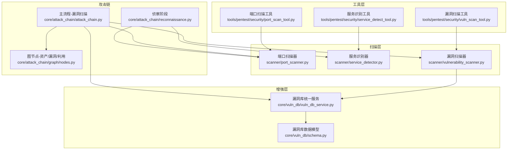
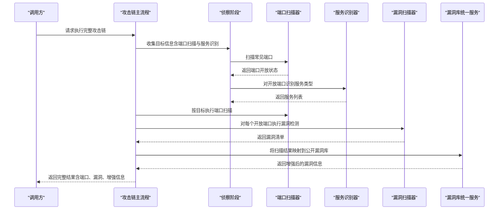
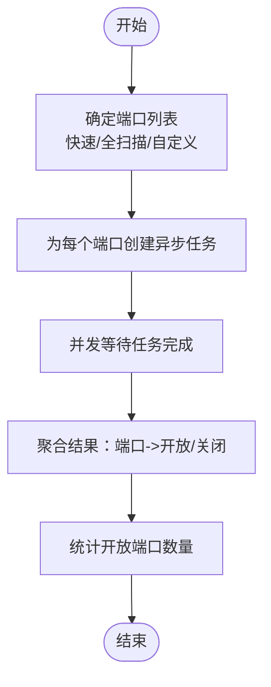
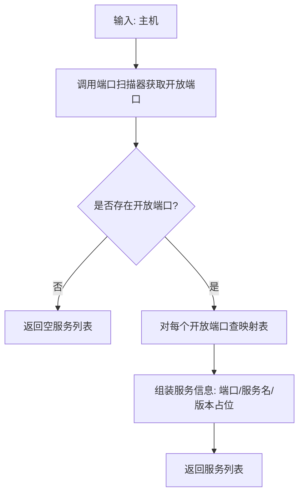
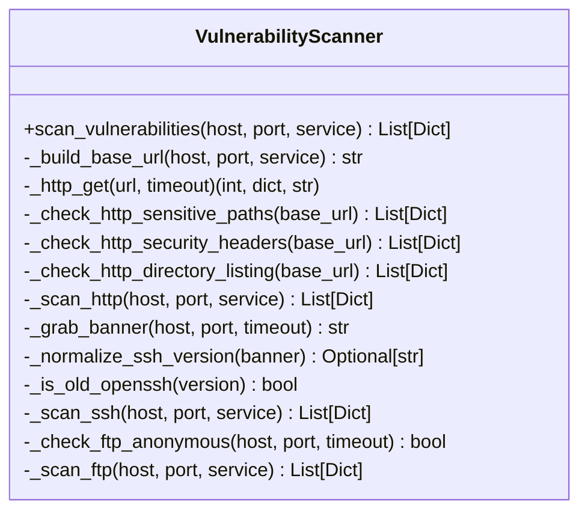
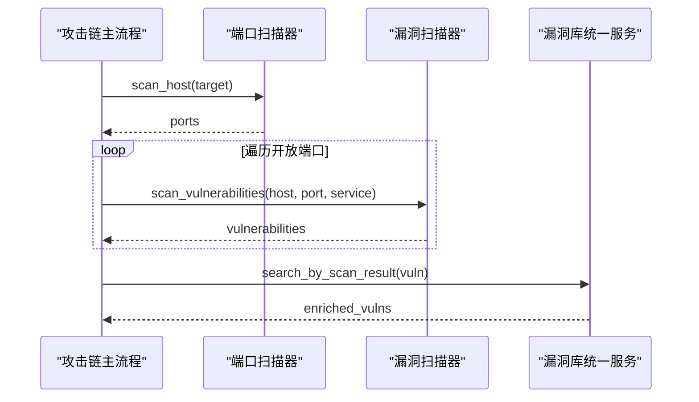
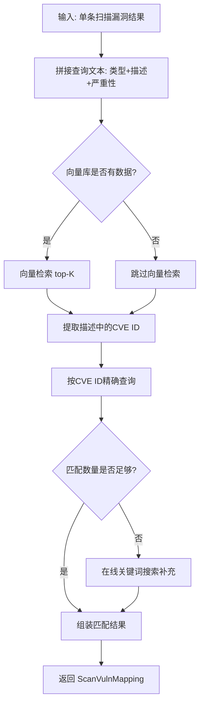
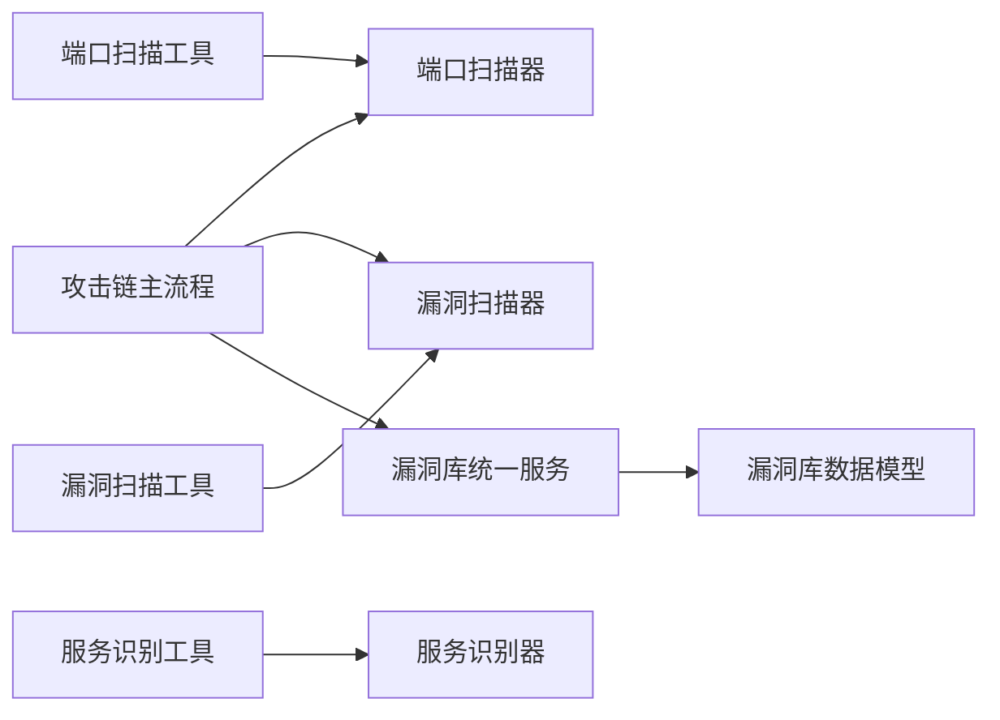

# 漏洞扫描阶段

<cite>
**本文引用的文件**
- [漏洞扫描器](file://scanner/vulnerability_scanner.py)
- [端口扫描器](file://scanner/port_scanner.py)
- [服务识别器](file://scanner/service_detector.py)
- [漏洞扫描工具](file://tools/pentest/security/vuln_scan_tool.py)
- [端口扫描工具](file://tools/pentest/security/port_scan_tool.py)
- [服务识别工具](file://tools/pentest/security/service_detect_tool.py)
- [攻击链-侦察阶段](file://core/attack_chain/reconnaissance.py)
- [攻击链-主流程](file://core/attack_chain/attack_chain.py)
- [漏洞库-统一服务](file://core/vuln_db/vuln_db_service.py)
- [漏洞库-数据模型](file://core/vuln_db/schema.py)
- [攻击链-图节点](file://core/attack_chain/graph/nodes.py)
</cite>

## 目录
1. [引言](#引言)
2. [项目结构](#项目结构)
3. [核心组件](#核心组件)
4. [架构总览](#架构总览)
5. [详细组件分析](#详细组件分析)
6. [依赖分析](#依赖分析)
7. [性能考量](#性能考量)
8. [故障排查指南](#故障排查指南)
9. [结论](#结论)
10. [附录](#附录)

## 引言
本章节面向Secbot攻击链“漏洞扫描阶段”，系统化阐述其设计理念、实现架构与协作机制。该阶段以“端口扫描+服务识别”为入口，结合“漏洞检测”形成闭环，最终通过“漏洞库检索增强”提升结果可信度与可利用性。文档覆盖端口状态检测、服务版本识别、漏洞特征匹配等核心能力；解释从端口扫描到漏洞检测的完整流程；说明准确性保障机制（多源验证、误报过滤、结果关联）；并提供配置选项与性能优化建议及结果数据格式说明。

## 项目结构
围绕漏洞扫描阶段的关键文件组织如下：
- 扫描层：端口扫描器、服务识别器、漏洞扫描器
- 工具层：端口扫描工具、服务识别工具、漏洞扫描工具
- 攻击链集成：侦察阶段产出端口与服务信息，漏洞扫描阶段消费这些信息并进行漏洞检测
- 增强层：漏洞库统一服务对接多数据源，将扫描结果映射到公开漏洞信息

图表来源
- [端口扫描器](file://scanner/port_scanner.py#L14-L63)
- [服务识别器](file://scanner/service_detector.py#L29-L56)
- [漏洞扫描器](file://scanner/vulnerability_scanner.py#L254-L289)
- [端口扫描工具](file://tools/pentest/security/port_scan_tool.py#L6-L50)
- [服务识别工具](file://tools/pentest/security/service_detect_tool.py#L6-L50)
- [漏洞扫描工具](file://tools/pentest/security/vuln_scan_tool.py#L6-L55)
- [攻击链-侦察阶段](file://core/attack_chain/reconnaissance.py#L11-L150)
- [攻击链-主流程](file://core/attack_chain/attack_chain.py#L69-L95)
- [漏洞库-统一服务](file://core/vuln_db/vuln_db_service.py#L27-L275)
- [漏洞库-数据模型](file://core/vuln_db/schema.py#L68-L140)

章节来源
- [端口扫描器](file://scanner/port_scanner.py#L14-L63)
- [服务识别器](file://scanner/service_detector.py#L29-L56)
- [漏洞扫描器](file://scanner/vulnerability_scanner.py#L254-L289)
- [端口扫描工具](file://tools/pentest/security/port_scan_tool.py#L6-L50)
- [服务识别工具](file://tools/pentest/security/service_detect_tool.py#L6-L50)
- [漏洞扫描工具](file://tools/pentest/security/vuln_scan_tool.py#L6-L55)
- [攻击链-侦察阶段](file://core/attack_chain/reconnaissance.py#L11-L150)
- [攻击链-主流程](file://core/attack_chain/attack_chain.py#L69-L95)
- [漏洞库-统一服务](file://core/vuln_db/vuln_db_service.py#L27-L275)
- [漏洞库-数据模型](file://core/vuln_db/schema.py#L68-L140)

## 核心组件
- 端口扫描器：基于TCP connect的异步端口探测，支持快速扫描与全端口扫描，返回每个端口的开放状态与计数统计。
- 服务识别器：依据端口号映射服务类型（如http/https/ssh/ftp等），并可批量识别主机上开放端口对应的服务。
- 漏洞扫描器：针对HTTP/HTTPS/SSH/FTP等服务执行特征化检测，包括敏感路径暴露、安全响应头缺失、目录列表启用、SSH版本过旧、FTP匿名登录等。
- 工具封装：将上述组件封装为可调用工具，便于在攻击链或外部系统中直接使用。
- 漏洞库检索：将扫描结果映射到公开漏洞库（CVE/NVD/Exploit-DB/MITRE），生成可利用性更强的结果。

章节来源
- [端口扫描器](file://scanner/port_scanner.py#L14-L63)
- [服务识别器](file://scanner/service_detector.py#L29-L56)
- [漏洞扫描器](file://scanner/vulnerability_scanner.py#L254-L289)
- [漏洞扫描工具](file://tools/pentest/security/vuln_scan_tool.py#L6-L55)
- [漏洞库-统一服务](file://core/vuln_db/vuln_db_service.py#L90-L146)

## 架构总览
漏洞扫描阶段在攻击链中的位置与交互如下：

图表来源
- [攻击链-主流程](file://core/attack_chain/attack_chain.py#L69-L95)
- [攻击链-侦察阶段](file://core/attack_chain/reconnaissance.py#L57-L84)
- [端口扫描器](file://scanner/port_scanner.py#L33-L62)
- [服务识别器](file://scanner/service_detector.py#L42-L55)
- [漏洞扫描器](file://scanner/vulnerability_scanner.py#L257-L289)
- [漏洞库-统一服务](file://core/vuln_db/vuln_db_service.py#L90-L146)

## 详细组件分析

### 端口扫描器
- 设计要点
  - 基于异步TCP连接探测，避免阻塞。
  - 提供快速扫描（常用端口集合）与全扫描（扩展端口集合）两种模式。
  - 统一返回结构，包含主机、端口列表、开放端口计数。
- 关键行为
  - 单端口探测：超时控制，异常即视为关闭。
  - 并发探测：使用gather并行处理多个端口。
  - 结果聚合：将布尔结果转为标准化字段（port/open/status）。
- 性能特性
  - 并发度取决于任务数量；可通过减少端口集合或降低超时提高吞吐。
  - 对外网目标建议适当增大超时，避免误判。

图表来源
- [端口扫描器](file://scanner/port_scanner.py#L33-L54)

章节来源
- [端口扫描器](file://scanner/port_scanner.py#L14-L63)

### 服务识别器
- 设计要点
  - 基于端口到服务类型的静态映射，快速判定服务类型。
  - 可对主机上所有开放端口进行批量识别。
- 关键行为
  - 单端口识别：返回端口、服务名、版本占位等。
  - 批量识别：先调用端口扫描器获取开放端口，再逐一识别。
- 准确性说明
  - 当前为端口映射，不进行深度banner识别；若需更准确的服务版本识别，可在漏洞扫描阶段结合HTTP/SSH/FTP等协议检测。

图表来源
- [服务识别器](file://scanner/service_detector.py#L42-L55)

章节来源
- [服务识别器](file://scanner/service_detector.py#L29-L56)

### 漏洞扫描器
- 设计理念
  - 面向常见服务（HTTP/HTTPS/SSH/FTP）的特征化检测，兼顾速度与覆盖面。
  - 通过异步I/O与线程池执行HTTP请求与TCP连接，避免阻塞。
- 核心能力
  - HTTP/HTTPS
    - 敏感路径暴露检测：对常见敏感路径发起GET请求，依据状态码判断风险。
    - 安全响应头缺失检测：检查关键安全头是否缺失。
    - 目录列表启用检测：基于正文特征判断。
  - SSH
    - 抓取banner并解析版本，对已知老旧版本给出风险提示。
  - FTP
    - 通过USER/PASS简单探测判断是否允许匿名登录。
  - 通用逻辑
    - 若未显式指定服务类型，则按端口推断（如80/8080/8000/8888推HTTP，22推SSH等）。
- 结果规范
  - 统一字典结构：type/severity/description/details/recommendation等字段。
  - 便于后续漏洞库检索与攻击链推理。

图表来源
- [漏洞扫描器](file://scanner/vulnerability_scanner.py#L254-L289)

章节来源
- [漏洞扫描器](file://scanner/vulnerability_scanner.py#L1-L289)

### 攻击链中的漏洞扫描阶段
- 侦察阶段产出
  - 解析目标、解析IP、扫描开放端口、识别服务类型、收集Web信息、DNS信息。
- 漏洞扫描阶段执行
  - 使用端口扫描器获取开放端口。
  - 对每个开放端口调用漏洞扫描器进行检测。
  - 将扫描结果与漏洞库统一服务对接，进行增强（CVE/NVD/Exploit-DB/MITRE）。
- 增强与推理
  - 将扫描结果映射到公开漏洞库，补充CVSS、影响软件、可利用Exploit等信息。
  - 攻击链图节点将资产、漏洞与利用进行关联，生成可执行的攻击链。

图表来源
- [攻击链-主流程](file://core/attack_chain/attack_chain.py#L69-L95)
- [漏洞库-统一服务](file://core/vuln_db/vuln_db_service.py#L90-L146)

章节来源
- [攻击链-主流程](file://core/attack_chain/attack_chain.py#L69-L95)
- [攻击链-图节点](file://core/attack_chain/graph/nodes.py#L46-L117)

### 漏洞库检索与结果增强
- 功能概述
  - 将扫描器输出的单条漏洞结果，通过向量检索与关键词在线搜索进行匹配。
  - 支持按CVE ID精确查询、自然语言语义检索、多源同步入库。
- 匹配流程
  - 向量检索：基于嵌入向量相似度匹配。
  - 关键词匹配：从描述中提取CVE ID进行精确查询。
  - 在线补充：不足时通过在线关键词搜索补充。
- 输出结构
  - ScanVulnMapping：包含扫描结果类型、描述、匹配到的漏洞列表与匹配分数。

图表来源
- [漏洞库-统一服务](file://core/vuln_db/vuln_db_service.py#L90-L146)
- [漏洞库-数据模型](file://core/vuln_db/schema.py#L134-L140)

章节来源
- [漏洞库-统一服务](file://core/vuln_db/vuln_db_service.py#L27-L275)
- [漏洞库-数据模型](file://core/vuln_db/schema.py#L68-L140)

## 依赖分析
- 组件耦合
  - 攻击链主流程依赖端口扫描器与漏洞扫描器；漏洞库统一服务作为外部增强组件参与。
  - 工具层对扫描器与识别器进行薄封装，便于统一调用。
- 外部依赖
  - 漏洞库统一服务依赖向量存储与多数据源适配器（NVD/CVE/Exploit-DB/Mitre）。
  - 攻击链图节点依赖漏洞库增强结果，将扫描漏洞与公开漏洞进行关联。

图表来源
- [攻击链-主流程](file://core/attack_chain/attack_chain.py#L69-L95)
- [漏洞库-统一服务](file://core/vuln_db/vuln_db_service.py#L27-L44)
- [漏洞库-数据模型](file://core/vuln_db/schema.py#L68-L94)
- [端口扫描工具](file://tools/pentest/security/port_scan_tool.py#L6-L50)
- [服务识别工具](file://tools/pentest/security/service_detect_tool.py#L6-L50)
- [漏洞扫描工具](file://tools/pentest/security/vuln_scan_tool.py#L6-L55)

章节来源
- [攻击链-主流程](file://core/attack_chain/attack_chain.py#L69-L95)
- [漏洞库-统一服务](file://core/vuln_db/vuln_db_service.py#L27-L44)
- [漏洞库-数据模型](file://core/vuln_db/schema.py#L68-L94)

## 性能考量
- 扫描速度控制
  - 端口扫描：优先使用快速扫描（常用端口），必要时再进行全扫描。
  - 并发数量：合理控制同时探测的端口数量，避免触发目标防护或自身资源瓶颈。
  - 超时参数：对外网目标适当增大超时，对内网目标可缩短超时以提升吞吐。
- 并发与异步
  - 端口扫描器采用异步并发；漏洞扫描器对HTTP请求使用线程池执行，避免阻塞事件循环。
- 结果聚合与过滤
  - 仅对开放端口执行漏洞检测，减少无效工作量。
  - 对HTTP敏感路径与安全头检测采用轻量HTTP请求，避免深度探测带来的性能开销。
- 增强阶段优化
  - 向量检索命中率高时可减少在线关键词搜索次数。
  - 按CVE ID精确查询优先，可快速命中已知漏洞。

[本节为通用性能建议，无需特定文件引用]

## 故障排查指南
- 端口扫描失败
  - 现象：大量端口显示为关闭或超时。
  - 排查：检查目标可达性、防火墙策略、扫描超时设置；尝试缩小端口范围或提高超时。
- 服务识别不准确
  - 现象：端口映射与实际服务不符。
  - 排查：当前服务识别依赖端口映射，建议在漏洞扫描阶段结合HTTP/SSH/FTP等协议检测进一步确认。
- 漏洞检测误报
  - 现象：敏感路径存在但未返回2xx/403导致漏报；安全头缺失检测误判。
  - 排查：调整检测阈值与特征规则；结合多源验证（如人工复核）降低误报。
- 增强阶段无结果
  - 现象：漏洞库检索未返回匹配项。
  - 排查：检查描述文本质量、CVE ID提取、向量库是否已建立；必要时增加在线关键词搜索补充。
- 工具调用错误
  - 现象：工具返回错误信息。
  - 排查：确认必填参数（host/target、port、service）齐全；检查网络连通性与权限。

章节来源
- [端口扫描器](file://scanner/port_scanner.py#L20-L31)
- [漏洞扫描器](file://scanner/vulnerability_scanner.py#L43-L54)
- [漏洞库-统一服务](file://core/vuln_db/vuln_db_service.py#L109-L145)

## 结论
漏洞扫描阶段通过“端口扫描+服务识别+漏洞检测”的协同机制，实现了对目标的快速、可观测的脆弱性评估。结合漏洞库检索增强，显著提升了结果的可信度与可利用性。在实践中，应根据目标环境调整扫描策略（端口范围、并发、超时），并通过多源验证与人工复核降低误报，确保扫描结果的质量与效率。

[本节为总结性内容，无需特定文件引用]

## 附录

### 执行流程与数据格式
- 端口扫描
  - 输入：host、可选端口列表或扫描类型（quick/full）。
  - 输出：包含host、ports（每项含port/open/status）、open_count的字典。
- 服务识别
  - 输入：host、可选端口列表。
  - 输出：包含host、services（每项含port/service/name/version）的字典。
- 漏洞扫描
  - 输入：host、port、service。
  - 输出：vulnerabilities（每项为标准字典，含type/severity/description等）。
- 漏洞库检索
  - 输入：单条扫描漏洞结果。
  - 输出：ScanVulnMapping（含scan_vuln_type、scan_description、matched_vulns、match_score）。

章节来源
- [端口扫描器](file://scanner/port_scanner.py#L33-L62)
- [服务识别器](file://scanner/service_detector.py#L42-L55)
- [漏洞扫描器](file://scanner/vulnerability_scanner.py#L257-L289)
- [漏洞库-统一服务](file://core/vuln_db/vuln_db_service.py#L90-L146)
- [漏洞库-数据模型](file://core/vuln_db/schema.py#L134-L140)

### 实际应用场景示例
- 场景一：内网主机快速巡检
  - 使用快速端口扫描定位开放端口，对开放端口执行漏洞检测，重点关注HTTP/SSH/FTP等服务的敏感路径与安全头缺失。
- 场景二：Web应用安全评估
  - 先进行Web信息收集（状态码、Server头、技术栈），再对开放端口执行HTTP相关漏洞检测，结合漏洞库检索获取CVE与可利用Exploit。
- 场景三：自动化攻击链集成
  - 在攻击链主流程中，将端口扫描与漏洞扫描结果传递给漏洞库统一服务进行增强，随后进入攻击链推理与利用阶段。

章节来源
- [攻击链-主流程](file://core/attack_chain/attack_chain.py#L69-L95)
- [攻击链-图节点](file://core/attack_chain/graph/nodes.py#L46-L117)
- [攻击链-侦察阶段](file://core/attack_chain/reconnaissance.py#L86-L132)