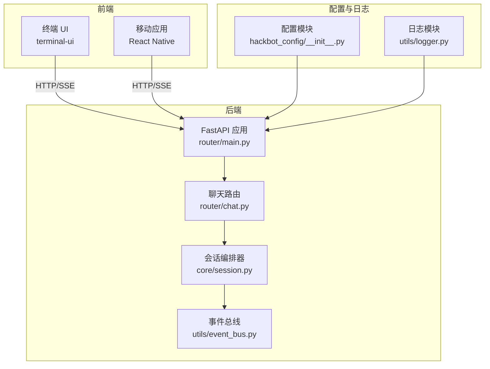
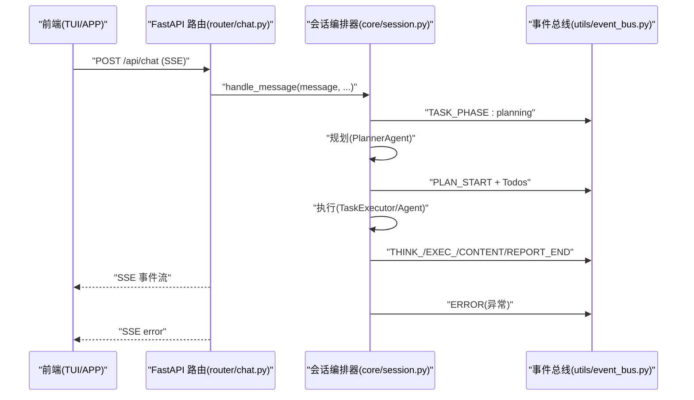
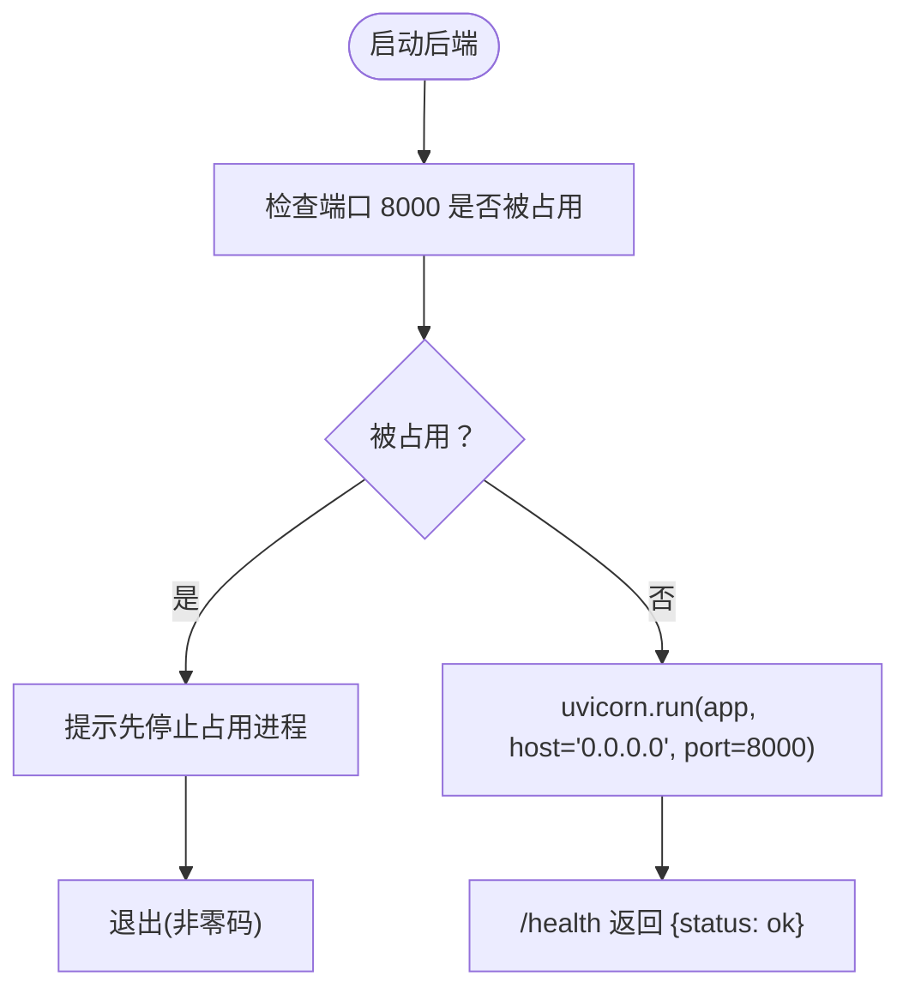
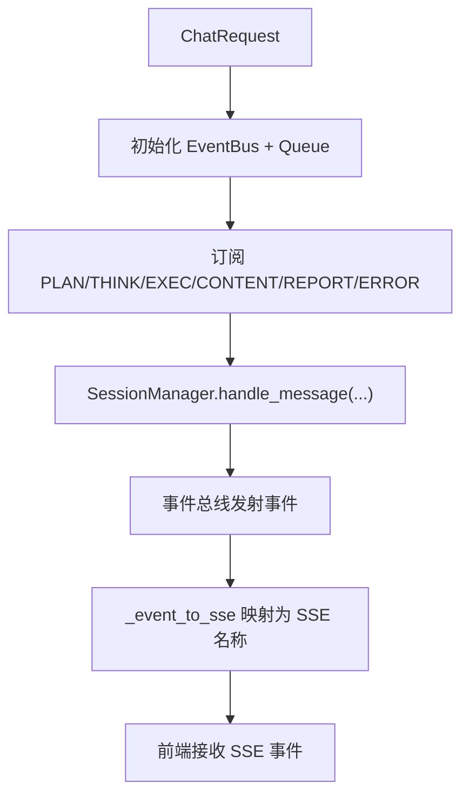
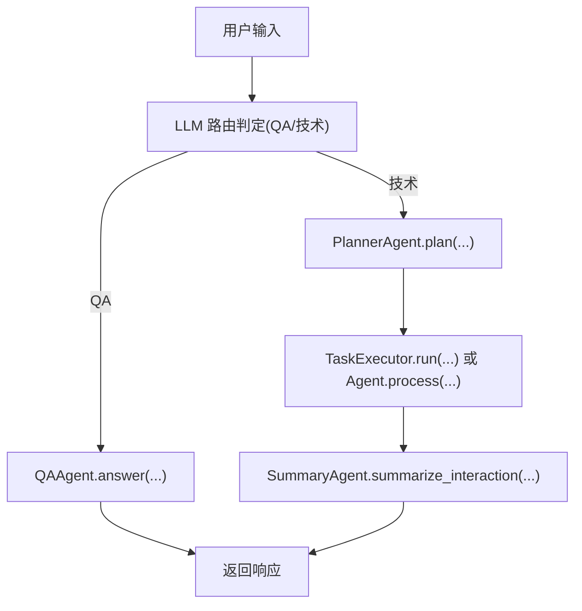
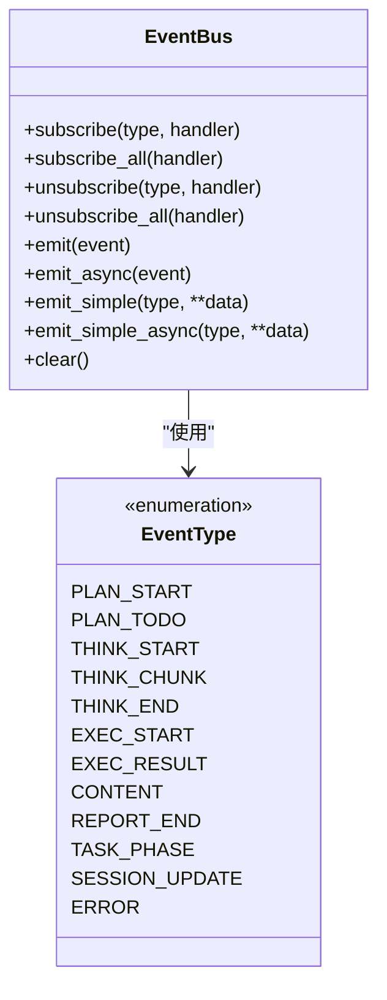
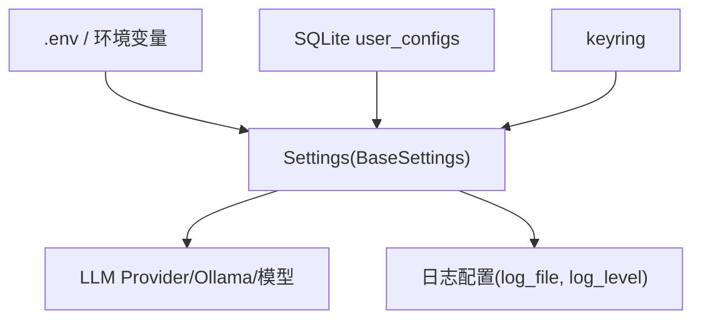
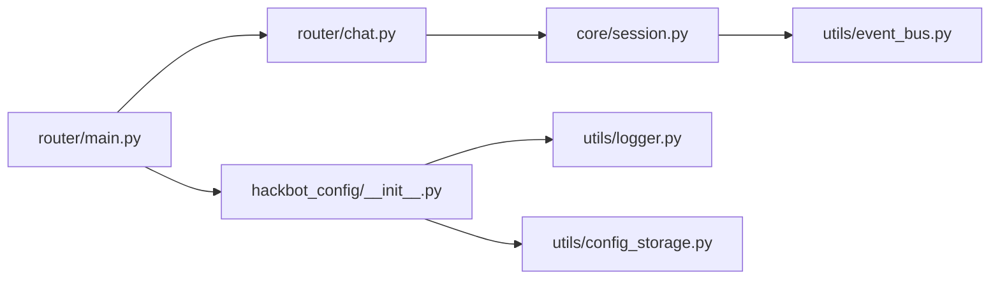

# 故障排除与常见问题

<cite>
**本文引用的文件**
- [README_CN.md](file://README_CN.md)
- [README_EN.md](file://README_EN.md)
- [main.py](file://main.py)
- [hackbot/cli.py](file://hackbot/cli.py)
- [router/main.py](file://router/main.py)
- [router/chat.py](file://router/chat.py)
- [core/session.py](file://core/session.py)
- [utils/logger.py](file://utils/logger.py)
- [hackbot_config/__init__.py](file://hackbot_config/__init__.py)
- [utils/config_storage.py](file://utils/config_storage.py)
- [utils/event_bus.py](file://utils/event_bus.py)
- [docs/RELEASE.md](file://docs/RELEASE.md)
- [docs/DOCKER_SETUP.md](file://docs/DOCKER_SETUP.md)
- [docs/OLLAMA_SETUP.md](file://docs/OLLAMA_SETUP.md)
- [tests/test_debug.py](file://tests/test_debug.py)
</cite>

## 目录
1. [简介](#简介)
2. [项目结构](#项目结构)
3. [核心组件](#核心组件)
4. [架构总览](#架构总览)
5. [详细组件分析](#详细组件分析)
6. [依赖分析](#依赖分析)
7. [性能注意事项](#性能注意事项)
8. [故障排除指南](#故障排除指南)
9. [结论](#结论)
10. [附录](#附录)

## 简介
本文件面向使用 Secbot 的用户与维护者，系统整理安装、配置、运行与升级过程中的常见问题与解决方案，提供日志分析、性能监控、错误诊断与系统状态检查的方法，帮助快速定位与解决问题。文档同时给出问题分类与解决流程、预防措施与最佳实践，并说明如何收集与报告问题。

## 项目结构
Secbot 采用前后端分离与事件驱动架构：前端（TUI/终端 UI、移动应用）通过 HTTP/SSE 与后端 FastAPI 通信；后端通过会话编排器与事件总线驱动多智能体执行与报告生成；配置与日志分别由配置模块与日志模块统一管理。

图表来源
- [router/main.py](file://router/main.py#L19-L71)
- [router/chat.py](file://router/chat.py#L27-L329)
- [core/session.py](file://core/session.py#L32-L136)
- [utils/event_bus.py](file://utils/event_bus.py#L68-L187)
- [hackbot_config/__init__.py](file://hackbot_config/__init__.py#L162-L246)
- [utils/logger.py](file://utils/logger.py#L1-L51)

章节来源
- [README_CN.md](file://README_CN.md#L75-L152)
- [README_EN.md](file://README_EN.md#L75-L152)

## 核心组件
- 后端入口与健康检查：FastAPI 应用工厂、CORS、路由注册与健康检查端点。
- 聊天路由与 SSE：将事件总线事件映射为前端可消费的 SSE 事件，支持流式输出与错误回传。
- 会话编排器：负责路由（QA/技术流）、规划、执行与摘要，桥接 Agent 事件到 UI。
- 事件总线：统一事件类型与订阅/发射机制，支持同步与异步处理器。
- 配置与日志：集中管理 LLM/OSINT/数据库/日志等配置项，提供安全存储 API Key 的能力。
- CLI 与入口：提供交互模式、后端/前端单独启动、错误日志落盘与冻结模式暂停。

章节来源
- [router/main.py](file://router/main.py#L19-L101)
- [router/chat.py](file://router/chat.py#L27-L329)
- [core/session.py](file://core/session.py#L32-L136)
- [utils/event_bus.py](file://utils/event_bus.py#L15-L187)
- [hackbot_config/__init__.py](file://hackbot_config/__init__.py#L162-L250)
- [utils/logger.py](file://utils/logger.py#L1-L51)
- [hackbot/cli.py](file://hackbot/cli.py#L32-L80)
- [main.py](file://main.py#L44-L62)

## 架构总览
Secbot 的交互流程通过 SSE 事件驱动：前端发起聊天请求，后端路由将其封装为会话事件，会话编排器按阶段推进（规划→执行→摘要），事件总线将阶段性结果与错误信息推送到前端 UI。

图表来源
- [router/chat.py](file://router/chat.py#L134-L271)
- [core/session.py](file://core/session.py#L139-L422)
- [utils/event_bus.py](file://utils/event_bus.py#L15-L53)

章节来源
- [README_CN.md](file://README_CN.md#L154-L272)
- [README_EN.md](file://README_EN.md#L154-L196)

## 详细组件分析

### 后端服务与端口占用
- 后端默认监听 8000 端口，启动前会检查端口占用；若被占用，会提示停止占用进程后再启动。
- 健康检查端点用于快速验证服务可用性。

图表来源
- [router/main.py](file://router/main.py#L74-L101)

章节来源
- [router/main.py](file://router/main.py#L74-L101)

### 聊天路由与事件映射
- 路由将 EventBus 事件映射为前端可消费的 SSE 名称（如 planning/thought/action_start 等），并透传 agent 字段。
- 支持同步与异步聊天接口，异常时返回错误事件与堆栈信息。

图表来源
- [router/chat.py](file://router/chat.py#L134-L271)

章节来源
- [router/chat.py](file://router/chat.py#L27-L329)

### 会话编排器与阶段流转
- 路由阶段：根据 LLM 判定为 QA/项目/帮助类则直走 QA；技术类进入规划。
- 规划阶段：生成 PlanResult 与 Todos，并广播规划摘要与待办。
- 执行阶段：TaskExecutor 按层级并发执行；Agent 事件通过桥接转发至 EventBus。
- 摘要阶段：汇总思考/观察/工具结果生成报告并广播。

图表来源
- [core/session.py](file://core/session.py#L139-L422)

章节来源
- [core/session.py](file://core/session.py#L139-L422)

### 事件总线与错误传播
- 事件类型涵盖规划、推理、执行、内容、报告、任务阶段、会话更新与错误。
- 事件处理器异常会被日志捕获，避免中断事件流。

图表来源
- [utils/event_bus.py](file://utils/event_bus.py#L68-L187)

章节来源
- [utils/event_bus.py](file://utils/event_bus.py#L15-L187)

### 配置与日志
- 配置模块支持多厂商 LLM 后端、Ollama、DeepSeek、OpenAI 等；API Key 可从 SQLite/环境变量/keyring 读取。
- 日志模块支持初始化阶段控制台降噪与文件日志轮转压缩。

图表来源
- [hackbot_config/__init__.py](file://hackbot_config/__init__.py#L162-L250)
- [utils/logger.py](file://utils/logger.py#L1-L51)

章节来源
- [hackbot_config/__init__.py](file://hackbot_config/__init__.py#L162-L250)
- [utils/logger.py](file://utils/logger.py#L1-L51)

## 依赖分析
- 运行时依赖：FastAPI、sse-starlette、uvicorn、loguru、pydantic-settings、python-dotenv、keyring、sqlite3。
- 开发与测试：pytest、build 工具链。
- Docker 策略：仅使用 SQLite，无需外部数据库容器。

图表来源
- [router/main.py](file://router/main.py#L5-L16)
- [router/chat.py](file://router/chat.py#L15-L25)
- [core/session.py](file://core/session.py#L14-L29)
- [hackbot_config/__init__.py](file://hackbot_config/__init__.py#L8-L14)

章节来源
- [README_CN.md](file://README_CN.md#L451-L458)
- [README_EN.md](file://README_EN.md#L357-L366)
- [docs/DOCKER_SETUP.md](file://docs/DOCKER_SETUP.md#L1-L14)

## 性能注意事项
- 日志级别与初始化阶段降噪：初始化阶段控制台仅 WARNING 及以上，交互开始后恢复为配置的日志级别，减少启动噪音。
- SSE 流式输出：前端可即时看到推理与执行过程，降低等待感。
- 并发执行：TaskExecutor 按层级并发执行 Todos，合理设置资源/风险约束，避免系统过载。
- 模型与嵌入：Ollama 模型与嵌入模型的选择影响响应速度与质量，建议按硬件能力调整。

章节来源
- [utils/logger.py](file://utils/logger.py#L14-L47)
- [README_EN.md](file://README_EN.md#L231-L241)
- [docs/OLLAMA_SETUP.md](file://docs/OLLAMA_SETUP.md#L15-L38)

## 故障排除指南

### 1. 安装与环境准备
- 发布版运行前必须配置 API Key（DeepSeek 示例）。
- 源码安装需使用 uv 安装依赖，并确保 Ollama 正常运行与模型可用。
- Docker 策略：仅使用 SQLite，无需外部数据库容器。

章节来源
- [docs/RELEASE.md](file://docs/RELEASE.md#L26-L67)
- [README_CN.md](file://README_CN.md#L319-L341)
- [docs/DOCKER_SETUP.md](file://docs/DOCKER_SETUP.md#L1-L14)

### 2. 启动与端口占用
- 后端默认监听 8000 端口，若被占用会提示先停止占用进程后再启动。
- 健康检查端点可用于快速验证服务可用性。

章节来源
- [router/main.py](file://router/main.py#L84-L97)
- [router/main.py](file://router/main.py#L63-L65)

### 3. 配置问题
- API Key 获取顺序：SQLite → 环境变量 → keyring；可通过交互式配置更新。
- 日志配置：日志文件路径与级别由配置模块统一管理，确保 logs 目录存在。
- Ollama 配置：确认 OLLAMA_BASE_URL、模型与嵌入模型配置正确。

章节来源
- [hackbot_config/__init__.py](file://hackbot_config/__init__.py#L127-L149)
- [utils/config_storage.py](file://utils/config_storage.py#L12-L29)
- [utils/logger.py](file://utils/logger.py#L24-L31)
- [docs/OLLAMA_SETUP.md](file://docs/OLLAMA_SETUP.md#L51-L67)

### 4. 运行时错误与日志分析
- 后端/CLI 异常会写入 hackbot_error.log 并打印到 stderr；冻结模式会在退出前暂停以便查看。
- SSE 错误事件：后端在异常时会通过 SSE 发送 error 事件，前端可据此提示用户。
- 事件总线异常：处理器抛出异常会被日志捕获，不影响整体事件流。

章节来源
- [main.py](file://main.py#L19-L32)
- [hackbot/cli.py](file://hackbot/cli.py#L12-L29)
- [router/chat.py](file://router/chat.py#L220-L227)
- [utils/event_bus.py](file://utils/event_bus.py#L137-L138)

### 5. 会话与事件流问题
- 未找到 Agent：检查 agents 初始化与传参，查看可用 agents 列表。
- 事件未到达前端：确认订阅的事件类型与 SSE 映射是否正确。
- 任务阶段卡住：检查 TASK_PHASE 事件是否持续发出，关注规划/执行阶段的超时与资源限制。

章节来源
- [core/session.py](file://core/session.py#L308-L314)
- [router/chat.py](file://router/chat.py#L33-L131)

### 6. Ollama 相关问题
- 连接失败：确认 Ollama 服务运行、端口未被占用、配置正确。
- 模型未找到：检查本地模型列表并按需下载。
- 性能优化：根据硬件能力调整内存、显卡加速与上下文窗口。

章节来源
- [docs/OLLAMA_SETUP.md](file://docs/OLLAMA_SETUP.md#L71-L96)

### 7. 测试与调试
- 调试 ReAct 循环：设置 LOG_LEVEL=DEBUG，运行测试脚本观察超时与异常。
- 单元测试：使用 pytest 运行测试套件，定位模块级问题。

章节来源
- [tests/test_debug.py](file://tests/test_debug.py#L8-L36)
- [README_CN.md](file://README_CN.md#L390-L394)

### 8. 升级、迁移与维护
- 发布版升级：遵循发布流程，更新版本号与变更说明，触发 CI 构建并创建 Release。
- 从源码打包：使用构建脚本或工具链生成可执行包。
- 数据与日志：确保 data/ 与 logs/ 目录可写，SQLite 数据库路径与权限正确。

章节来源
- [docs/RELEASE.md](file://docs/RELEASE.md#L7-L16)
- [docs/RELEASE.md](file://docs/RELEASE.md#L79-L86)
- [docs/DOCKER_SETUP.md](file://docs/DOCKER_SETUP.md#L1-L14)

### 9. 社区支持与问题反馈
- 安全使用：仅在授权范围内使用，遵守法律法规。
- 文档与路线图：参考项目文档与设计范式，了解功能边界与未来方向。
- 反馈渠道：通过项目主页与文档提供的联系方式进行沟通。

章节来源
- [README_CN.md](file://README_CN.md#L13-L20)
- [README_CN.md](file://README_CN.md#L423-L431)

## 结论
通过理解后端服务、聊天路由、会话编排器与事件总线的协作关系，结合配置与日志模块的统一管理，用户可以在安装、配置、运行与升级过程中快速定位问题并采取针对性措施。建议在调试阶段开启 DEBUG 日志，使用健康检查与 SSE 事件进行状态观测，并遵循发布与打包流程以确保升级稳定。

## 附录

### A. 常见问题分类与解决流程
- 安装与环境
  - 症状：无法启动/端口占用
  - 处理：释放 8000 端口；检查依赖与 Ollama
- 配置
  - 症状：API Key 未生效/模型不可用
  - 处理：优先 SQLite/keyring，其次 .env；核对 Ollama 配置
- 运行时
  - 症状：SSE 无输出/报错
  - 处理：查看 ERROR 事件与后端日志；确认订阅与映射
- 性能
  - 症状：响应慢/资源占用高
  - 处理：调整日志级别、模型与嵌入配置；优化并发层级

章节来源
- [router/main.py](file://router/main.py#L84-L97)
- [hackbot_config/__init__.py](file://hackbot_config/__init__.py#L127-L149)
- [docs/OLLAMA_SETUP.md](file://docs/OLLAMA_SETUP.md#L71-L96)
- [utils/logger.py](file://utils/logger.py#L14-L47)

### B. 收集与报告问题清单
- 环境信息
  - 操作系统版本、Python 版本、uv 版本
  - Ollama 版本与模型列表
  - 配置文件内容（脱敏敏感信息）
- 日志与事件
  - 后端日志（logs/agent.log）
  - hackbot_error.log（如有）
  - SSE 事件序列（planning/thought/action_start/report/error）
- 复现步骤
  - 具体命令/输入与期望结果
  - 复现频率与前置条件

章节来源
- [utils/logger.py](file://utils/logger.py#L24-L31)
- [router/chat.py](file://router/chat.py#L33-L131)
- [main.py](file://main.py#L19-L32)