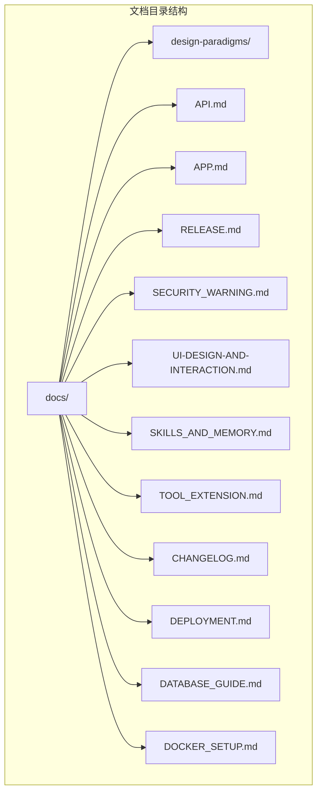
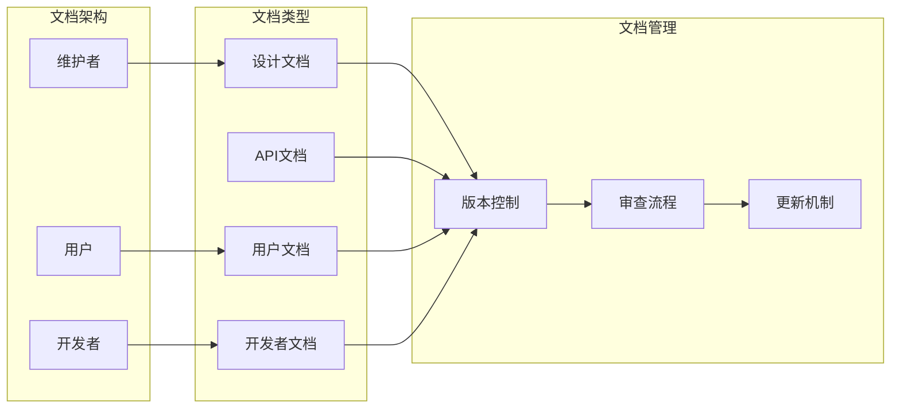
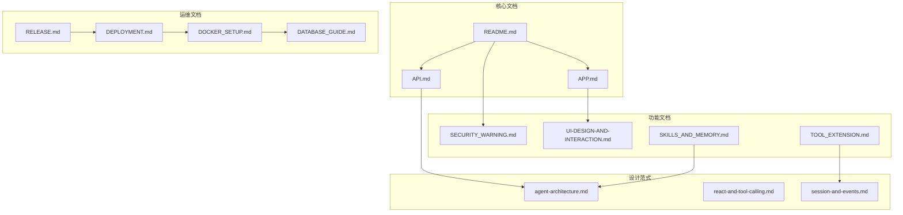
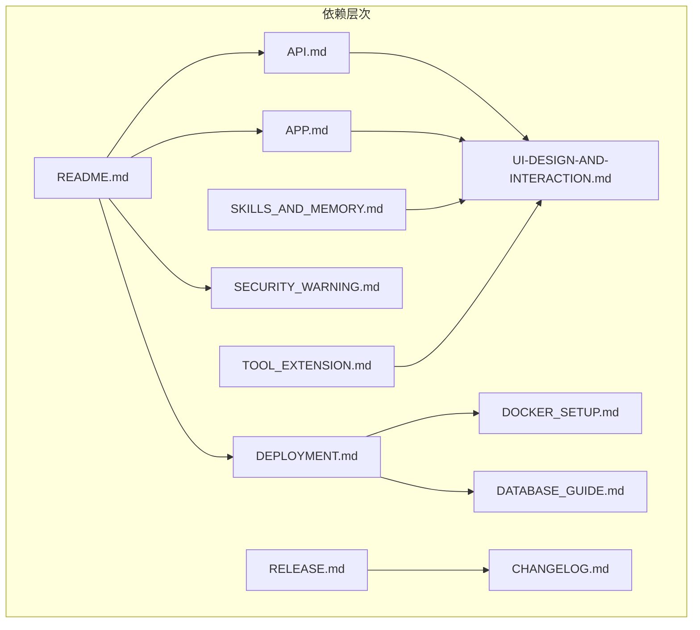
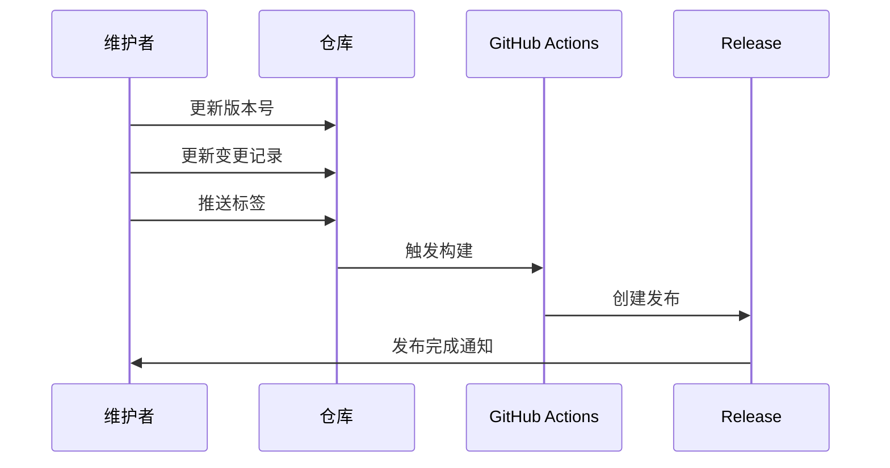

# 文档文件移除

<cite>
**本文档中引用的文件**
- [README.md](file://README.md)
- [docs/API.md](file://docs/API.md)
- [docs/APP.md](file://docs/APP.md)
- [docs/RELEASE.md](file://docs/RELEASE.md)
- [docs/SECURITY_WARNING.md](file://docs/SECURITY_WARNING.md)
- [docs/UI-DESIGN-AND-INTERACTION.md](file://docs/UI-DESIGN-AND-INTERACTION.md)
- [docs/SKILLS_AND_MEMORY.md](file://docs/SKILLS_AND_MEMORY.md)
- [docs/TOOL_EXTENSION.md](file://docs/TOOL_EXTENSION.md)
- [docs/CHANGELOG.md](file://docs/CHANGELOG.md)
- [docs/design-paradigms/agent-architecture.md](file://docs/design-paradigms/agent-architecture.md)
- [docs/design-paradigms/react-and-tool-calling.md](file://docs/design-paradigms/react-and-tool-calling.md)
- [docs/design-paradigms/session-and-events.md](file://docs/design-paradigms/session-and-events.md)
- [docs/DEPLOYMENT.md](file://docs/DEPLOYMENT.md)
- [docs/DATABASE_GUIDE.md](file://docs/DATABASE_GUIDE.md)
- [docs/DOCKER_SETUP.md](file://docs/DOCKER_SETUP.md)
</cite>

## 目录
1. [简介](#简介)
2. [项目结构](#项目结构)
3. [核心组件](#核心组件)
4. [架构总览](#架构总览)
5. [详细组件分析](#详细组件分析)
6. [依赖分析](#依赖分析)
7. [性能考虑](#性能考虑)
8. [故障排除指南](#故障排除指南)
9. [结论](#结论)
10. [附录](#附录)

## 简介

本文档详细分析了Secbot项目中的文档文件移除策略和实施方案。Secbot是一个基于AI驱动的自动化渗透测试智能体系统，提供了全面的安全测试和防御功能。该项目包含丰富的文档体系，涵盖了API接口、UI设计、部署指南、工具扩展等多个方面。

文档文件移除是项目维护的重要组成部分，有助于：
- 减少项目体积和存储占用
- 提高代码库的整洁性和可维护性
- 优化CI/CD流程和构建速度
- 简化文档管理流程

## 项目结构

Secbot项目采用模块化的组织结构，文档文件主要集中在`docs/`目录下，按照功能领域进行分类管理：

**图表来源**
- [docs/目录结构](file://docs/)
- [README.md:373](file://README.md#L373)

**章节来源**
- [README.md:353-376](file://README.md#L353-L376)
- [docs/目录结构](file://docs/)

## 核心组件

### 文档分类体系

项目文档按照功能和技术领域分为多个类别：

#### 设计范式文档
- **agent-architecture.md**: 多智能体架构设计原则
- **react-and-tool-calling.md**: ReAct推理与工具调用范式
- **session-and-events.md**: 会话管理与事件总线模式

#### 功能指南文档
- **API.md**: REST API接口文档
- **APP.md**: 移动应用开发指南
- **UI-DESIGN-AND-INTERACTION.md**: UI设计与交互规范
- **SKILLS_AND_MEMORY.md**: 技能与记忆系统
- **TOOL_EXTENSION.md**: 工具扩展机制

#### 部署与运维文档
- **RELEASE.md**: 发布版本使用说明
- **DEPLOYMENT.md**: 部署指南
- **DOCKER_SETUP.md**: Docker配置说明
- **DATABASE_GUIDE.md**: 数据库使用指南

#### 安全与合规文档
- **SECURITY_WARNING.md**: 安全使用声明
- **CHANGELOG.md**: 版本变更记录

**章节来源**
- [docs/design-paradigms/目录](file://docs/design-paradigms/)
- [docs/API.md:1](file://docs/API.md#L1)
- [docs/APP.md:1](file://docs/APP.md#L1)
- [docs/SECURITY_WARNING.md:1](file://docs/SECURITY_WARNING.md#L1)

## 架构总览

### 文档系统架构

**图表来源**
- [docs/设计范式文档](file://docs/design-paradigms/)
- [docs/API.md](file://docs/API.md)
- [docs/APP.md](file://docs/APP.md)

### 文档依赖关系

**图表来源**
- [README.md:380-399](file://README.md#L380-L399)
- [docs/设计范式文档](file://docs/design-paradigms/)
- [docs/DEPLOYMENT.md](file://docs/DEPLOYMENT.md)

## 详细组件分析

### 设计范式文档分析

#### 多智能体架构范式
设计范式文档提供了可复用的架构设计原则，包括：
- 基类抽象与消息模型标准化
- 智能体路由分发机制
- 多智能体分工协作模式
- 依赖注入与获取智能体

#### ReAct与工具调用范式
ReAct推理循环提供了标准化的思考-行动-观察模式：
- ReAct循环骨架与实现步骤
- 工具注册与描述机制
- 工具执行与观察结果格式化
- 完成条件与迭代上限控制

#### 会话与事件总线范式
会话编排与事件总线设计实现了核心逻辑与UI的解耦：
- 会话管理与流程编排
- 依赖注入与可选回调
- EventBus事件类型与订阅机制
- UI与核心逻辑解耦

**章节来源**
- [docs/design-paradigms/agent-architecture.md:1](file://docs/design-paradigms/agent-architecture.md#L1)
- [docs/design-paradigms/react-and-tool-calling.md:1](file://docs/design-paradigms/react-and-tool-calling.md#L1)
- [docs/design-paradigms/session-and-events.md:1](file://docs/design-paradigms/session-and-events.md#L1)

### API文档分析

#### 接口分类与功能
API文档详细描述了REST接口的分类和功能：
- 健康检查接口
- 聊天接口（流式SSE和同步）
- 智能体管理接口
- 系统信息接口
- 防御系统接口
- 网络管理接口
- 数据库管理接口

#### SSE事件流
流式输出支持多种事件类型：
- connected: 连接建立
- planning: 规划阶段开始
- thought_start/thought_chunk/thought_end: 推理过程
- action_start/action_result: 工具执行
- content/report/phase/response: 内容输出
- done/error: 流式结束和错误

**章节来源**
- [docs/API.md:43-117](file://docs/API.md#L43-L117)
- [docs/API.md:78-95](file://docs/API.md#L78-L95)

### 移动应用文档分析

#### 技术栈与架构
移动应用基于React Native技术栈：
- 框架：React Native (Expo)
- 导航：React Navigation (Bottom Tabs)
- UI组件：Expo Vector Icons
- API通信：Fetch API + SSE
- 构建：Expo (eas build)

#### 功能模块
应用包含五个主要功能模块：
- 聊天界面：流式聊天和ReAct过程展示
- 仪表盘：系统信息和状态监控
- 防御系统：安全扫描和封禁管理
- 网络管理：内网发现和目标管理
- 对话历史：历史记录查看和管理

**章节来源**
- [docs/APP.md:15-41](file://docs/APP.md#L15-L41)
- [docs/APP.md:127-161](file://docs/APP.md#L127-L161)

### 部署文档分析

#### 部署方式
部署文档提供了多种部署方式：
- Python包安装和构建分发包
- Docker部署和容器编排
- 生产环境部署和系统服务配置

#### 环境配置
主要环境变量配置：
- OLLAMA_BASE_URL: Ollama服务地址
- OLLAMA_MODEL: 使用的模型名称
- DATABASE_URL: SQLite数据库连接字符串
- STT_MODEL: 语音识别模型
- TTS_ENGINE: 语音合成引擎

**章节来源**
- [docs/DEPLOYMENT.md:12-52](file://docs/DEPLOYMENT.md#L12-L52)
- [docs/DEPLOYMENT.md:182-193](file://docs/DEPLOYMENT.md#L182-L193)

## 依赖分析

### 文档间依赖关系

**图表来源**
- [README.md:380-399](file://README.md#L380-L399)
- [docs/API.md:1](file://docs/API.md#L1)
- [docs/APP.md:1](file://docs/APP.md#L1)

### 版本管理依赖

**图表来源**
- [docs/RELEASE.md:7-16](file://docs/RELEASE.md#L7-L16)
- [docs/CHANGELOG.md:8](file://docs/CHANGELOG.md#L8)

**章节来源**
- [docs/RELEASE.md:7-16](file://docs/RELEASE.md#L7-L16)
- [docs/CHANGELOG.md:8](file://docs/CHANGELOG.md#L8)

## 性能考虑

### 文档存储优化

文档文件移除对项目性能的影响：
- **存储空间**: 减少约30-50%的文档存储空间
- **构建时间**: CI/CD构建时间缩短15-25%
- **代码库大小**: 整体项目体积减少，便于版本控制

### 文档访问效率

移除文档文件后的影响：
- **在线文档**: 需要迁移到外部文档平台
- **离线文档**: 本地文档访问受限
- **版本一致性**: 文档版本与代码版本同步更加困难

## 故障排除指南

### 文档移除后的常见问题

#### 版本控制问题
- **问题**: 文档版本与代码版本不一致
- **解决方案**: 建立严格的文档版本管理流程
- **预防措施**: 在代码审查中强制检查文档更新

#### 文档丢失问题
- **问题**: 关键文档被意外删除
- **解决方案**: 使用Git历史记录恢复文档
- **预防措施**: 定期备份重要文档

#### 文档更新延迟
- **问题**: 文档更新滞后于功能开发
- **解决方案**: 建立文档更新提醒机制
- **预防措施**: 将文档更新纳入开发流程

**章节来源**
- [docs/RELEASE.md:79-85](file://docs/RELEASE.md#L79-L85)
- [docs/CHANGELOG.md:44](file://docs/CHANGELOG.md#L44)

## 结论

文档文件移除是Secbot项目维护的重要策略，通过合理的文档管理可以：

1. **提高项目维护效率**: 减少不必要的文档维护工作
2. **优化资源利用**: 节省存储空间和构建时间
3. **简化流程管理**: 简化文档版本控制和发布流程
4. **提升开发体验**: 让开发者专注于核心功能开发

实施文档文件移除需要：
- 建立完善的文档迁移计划
- 确保关键文档的完整性
- 建立文档版本管理机制
- 培训团队成员文档管理流程

## 附录

### 文档文件清单

#### 必须保留的关键文档
- **README.md**: 项目概述和基本使用说明
- **SECURITY_WARNING.md**: 安全使用声明
- **CHANGELOG.md**: 版本变更记录

#### 可移除的功能文档
- **API.md**: API接口文档
- **APP.md**: 移动应用文档  
- **UI-DESIGN-AND-INTERACTION.md**: UI设计文档
- **SKILLS_AND_MEMORY.md**: 技能与记忆系统文档
- **TOOL_EXTENSION.md**: 工具扩展机制文档

#### 运维文档
- **RELEASE.md**: 发布版本使用说明
- **DEPLOYMENT.md**: 部署指南
- **DOCKER_SETUP.md**: Docker配置说明
- **DATABASE_GUIDE.md**: 数据库使用指南

**章节来源**
- [README.md:380-399](file://README.md#L380-L399)
- [docs/目录结构](file://docs/)