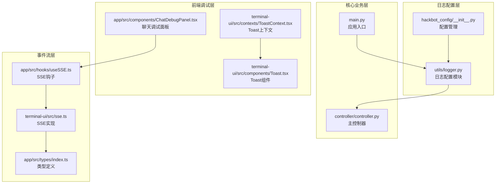
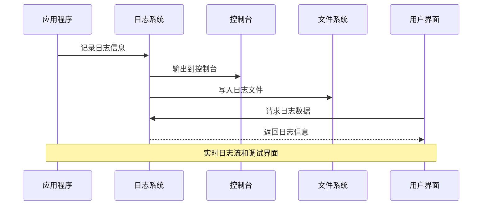
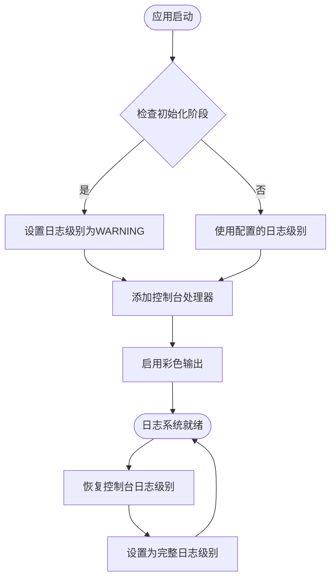
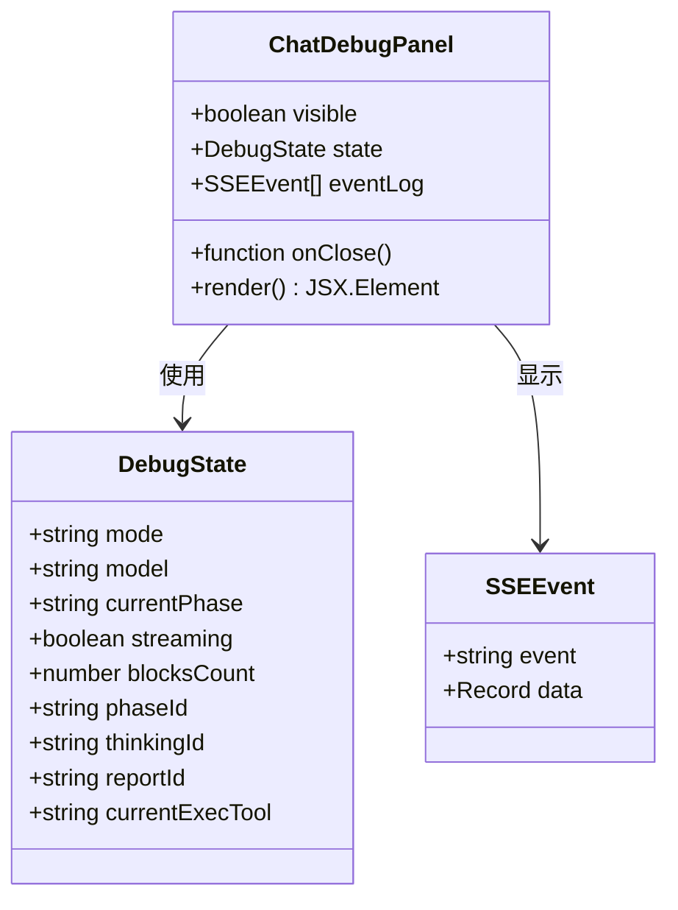
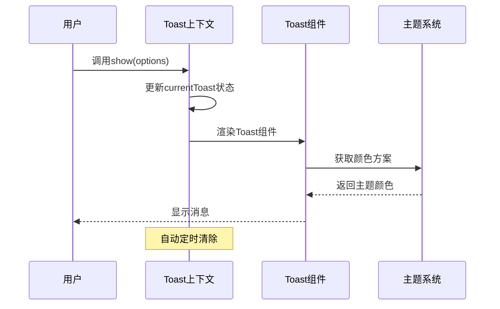
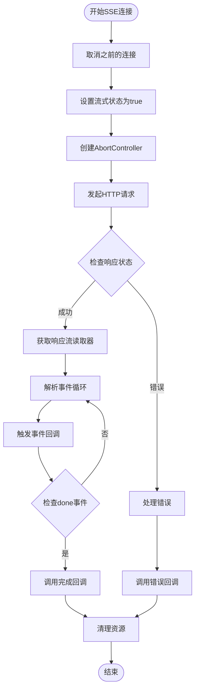
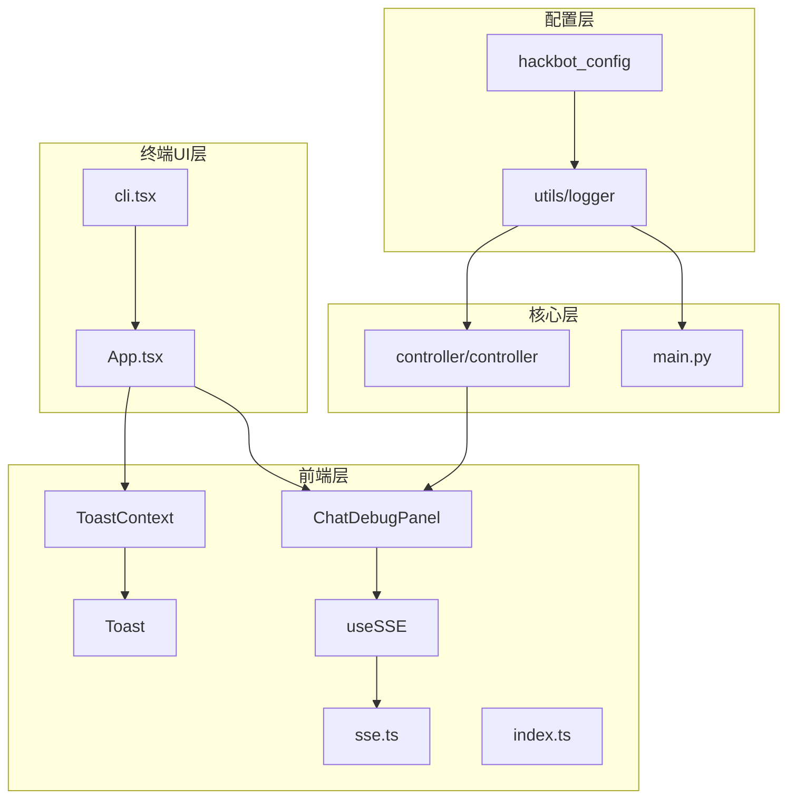

# 日志增强功能

<cite>
**本文档引用的文件**
- [utils/logger.py](file://utils/logger.py)
- [hackbot_config/__init__.py](file://hackbot_config/__init__.py)
- [controller/controller.py](file://controller/controller.py)
- [app/src/components/ChatDebugPanel.tsx](file://app/src/components/ChatDebugPanel.tsx)
- [terminal-ui/src/contexts/ToastContext.tsx](file://terminal-ui/src/contexts/ToastContext.tsx)
- [terminal-ui/src/components/Toast.tsx](file://terminal-ui/src/components/Toast.tsx)
- [app/src/hooks/useSSE.ts](file://app/src/hooks/useSSE.ts)
- [terminal-ui/src/sse.ts](file://terminal-ui/src/sse.ts)
- [app/src/types/index.ts](file://app/src/types/index.ts)
- [main.py](file://main.py)
- [terminal-ui/src/App.tsx](file://terminal-ui/src/App.tsx)
- [terminal-ui/src/cli.tsx](file://terminal-ui/src/cli.tsx)
</cite>

## 目录
1. [简介](#简介)
2. [项目结构](#项目结构)
3. [核心组件](#核心组件)
4. [架构概览](#架构概览)
5. [详细组件分析](#详细组件分析)
6. [依赖关系分析](#依赖关系分析)
7. [性能考虑](#性能考虑)
8. [故障排除指南](#故障排除指南)
9. [结论](#结论)

## 简介

日志增强功能是SecBot安全自动化平台的重要组成部分，旨在提供全面、可配置且用户友好的日志记录和调试能力。该功能通过多层次的日志系统，结合实时事件流和可视化调试界面，为用户提供从底层系统操作到高层业务逻辑的完整可观测性。

系统采用现代化的日志架构，支持初始化阶段的日志折叠、文件轮转、彩色控制台输出，并集成了多种前端调试工具来增强用户体验。日志功能不仅服务于开发调试，也为生产环境的问题诊断提供了强大的支持。

## 项目结构

SecBot的日志增强功能分布在多个层次中，形成了完整的日志生态系统：

**图表来源**
- [utils/logger.py:1-51](file://utils/logger.py#L1-L51)
- [hackbot_config/__init__.py:252-275](file://hackbot_config/__init__.py#L252-L275)
- [controller/controller.py:1-245](file://controller/controller.py#L1-L245)

**章节来源**
- [utils/logger.py:1-51](file://utils/logger.py#L1-L51)
- [hackbot_config/__init__.py:252-275](file://hackbot_config/__init__.py#L252-L275)

## 核心组件

### 日志配置系统

日志配置系统是整个日志增强功能的基础，提供了灵活且强大的日志管理能力。

**主要特性：**
- 初始化阶段日志折叠：verbose_init=false时仅显示WARNING及以上级别
- 文件日志始终记录：确保所有日志信息都不会丢失
- 彩色控制台输出：提供良好的可读性和视觉区分
- 自动文件轮转：10MB大小轮转，7天保留期，ZIP压缩
- 可配置的日志级别和文件路径

**章节来源**
- [utils/logger.py:13-31](file://utils/logger.py#L13-L31)
- [utils/logger.py:34-47](file://utils/logger.py#L34-L47)

### 配置管理系统

配置管理系统为日志功能提供了灵活的配置选项，支持多种部署场景。

**关键配置项：**
- LOG_LEVEL：日志级别（默认INFO）
- LOG_FILE：日志文件路径（默认logs/agent.log）
- VERBOSE_INIT：初始化阶段详细程度（默认false）

**章节来源**
- [hackbot_config/__init__.py:252-259](file://hackbot_config/__init__.py#L252-L259)

### 主控制器日志集成

主控制器作为系统的核心协调者，集成了丰富的日志记录点，覆盖了所有关键操作流程。

**日志覆盖范围：**
- 网络发现操作：开始、完成、错误处理
- 授权管理：授权添加、验证、过期处理
- 远程连接：SSH、WinRM连接建立和断开
- 文件传输：上传、下载操作记录
- 命令执行：远程命令执行和结果记录

**章节来源**
- [controller/controller.py:23-243](file://controller/controller.py#L23-L243)

## 架构概览

日志增强功能采用了分层架构设计，确保了功能的模块化和可维护性：

**图表来源**
- [utils/logger.py:10-31](file://utils/logger.py#L10-L31)
- [controller/controller.py:23-243](file://controller/controller.py#L23-L243)

## 详细组件分析

### 控制台日志系统

控制台日志系统实现了智能的日志级别管理，特别针对初始化阶段进行了优化。

**图表来源**
- [utils/logger.py:14-21](file://utils/logger.py#L14-L21)
- [utils/logger.py:34-47](file://utils/logger.py#L34-L47)

**章节来源**
- [utils/logger.py:14-21](file://utils/logger.py#L14-L21)
- [utils/logger.py:34-47](file://utils/logger.py#L34-L47)

### 文件日志管理

文件日志系统提供了企业级的日志管理功能，确保日志数据的持久化和可追溯性。

**核心功能：**
- 自动文件轮转：达到10MB自动创建新文件
- 保留策略：7天历史日志自动清理
- 压缩存储：ZIP格式压缩旧日志文件
- 结构化格式：统一的时间戳、级别、来源标识

**章节来源**
- [utils/logger.py:23-31](file://utils/logger.py#L23-L31)

### 前端调试面板

聊天调试面板为React Native应用提供了实时的事件监控和状态显示功能。

**图表来源**
- [app/src/components/ChatDebugPanel.tsx:20-37](file://app/src/components/ChatDebugPanel.tsx#L20-L37)

**章节来源**
- [app/src/components/ChatDebugPanel.tsx:18-37](file://app/src/components/ChatDebugPanel.tsx#L18-L37)

### 终端UI Toast系统

终端UI的Toast系统提供了非侵入式的用户反馈机制，特别适用于命令行界面。

**图表来源**
- [terminal-ui/src/contexts/ToastContext.tsx:22-50](file://terminal-ui/src/contexts/ToastContext.tsx#L22-L50)
- [terminal-ui/src/components/Toast.tsx:7-23](file://terminal-ui/src/components/Toast.tsx#L7-L23)

**章节来源**
- [terminal-ui/src/contexts/ToastContext.tsx:22-50](file://terminal-ui/src/contexts/ToastContext.tsx#L22-L50)
- [terminal-ui/src/components/Toast.tsx:7-23](file://terminal-ui/src/components/Toast.tsx#L7-L23)

### SSE事件流系统

SSE（Server-Sent Events）系统为前端提供了实时的事件推送能力，支持流式数据传输。

**图表来源**
- [app/src/hooks/useSSE.ts:13-42](file://app/src/hooks/useSSE.ts#L13-L42)
- [terminal-ui/src/sse.ts:49-133](file://terminal-ui/src/sse.ts#L49-L133)

**章节来源**
- [app/src/hooks/useSSE.ts:13-42](file://app/src/hooks/useSSE.ts#L13-L42)
- [terminal-ui/src/sse.ts:49-133](file://terminal-ui/src/sse.ts#L49-L133)

### 应用入口错误处理

应用入口提供了完善的错误处理机制，确保应用程序崩溃时能够提供有用的诊断信息。

**错误处理流程：**
- 捕获异常并生成完整的堆栈跟踪
- 将错误信息写入hackbot_error.log文件
- 在打包运行时暂停，便于用户查看控制台输出
- 提供清晰的错误提示和退出码

**章节来源**
- [main.py:19-32](file://main.py#L19-L32)

## 依赖关系分析

日志增强功能的各个组件之间形成了清晰的依赖关系，确保了系统的模块化和可维护性：

**图表来源**
- [hackbot_config/__init__.py:270-275](file://hackbot_config/__init__.py#L270-L275)
- [utils/logger.py:10-31](file://utils/logger.py#L10-L31)
- [controller/controller.py:11](file://controller/controller.py#L11)

**章节来源**
- [hackbot_config/__init__.py:270-275](file://hackbot_config/__init__.py#L270-L275)
- [utils/logger.py:10-31](file://utils/logger.py#L10-L31)

## 性能考虑

日志增强功能在设计时充分考虑了性能影响，采用了多种优化策略：

### 日志级别优化
- 初始化阶段仅记录WARNING及以上级别，减少控制台输出量
- 文件日志始终记录，确保诊断信息完整性
- 可配置的日志级别允许在不同环境下调整详细程度

### 文件轮转策略
- 10MB大小限制防止单个文件过大
- 7天保留期平衡存储空间和历史数据需求
- ZIP压缩减少磁盘占用

### 内存管理
- SSE事件流使用流式处理，避免大量内存占用
- Toast组件具有自动清理机制，防止内存泄漏
- 终端UI使用虚拟DOM优化渲染性能

## 故障排除指南

### 常见问题诊断

**日志文件无法创建**
- 检查LOG_FILE配置路径的可写权限
- 确认日志目录存在且有足够磁盘空间
- 验证文件系统权限设置

**控制台输出异常**
- 检查VERBOSE_INIT配置是否正确设置
- 确认终端支持彩色输出
- 验证日志级别配置

**SSE连接问题**
- 检查后端服务是否正常运行
- 验证网络连接和防火墙设置
- 查看浏览器开发者工具的网络面板

**章节来源**
- [hackbot_config/__init__.py:252-259](file://hackbot_config/__init__.py#L252-L259)
- [terminal-ui/src/cli.tsx:27-46](file://terminal-ui/src/cli.tsx#L27-L46)

### 调试技巧

**实时监控**
- 使用ChatDebugPanel监控SSE事件流
- 通过Toast组件查看即时状态反馈
- 利用文件日志进行事后分析

**性能分析**
- 监控日志文件大小和增长速度
- 分析SSE连接的延迟和吞吐量
- 检查内存使用情况和垃圾回收

## 结论

日志增强功能为SecBot平台提供了全面、灵活且高性能的日志解决方案。通过分层架构设计、智能的日志级别管理和丰富的前端调试工具，系统不仅满足了开发调试的需求，也为生产环境的问题诊断提供了强有力的支持。

该功能的主要优势包括：
- **模块化设计**：清晰的组件分离和依赖关系
- **可配置性**：灵活的日志级别和输出格式
- **实时性**：SSE事件流提供即时反馈
- **用户友好**：直观的调试界面和错误提示
- **性能优化**：智能的文件轮转和内存管理

未来可以考虑的功能扩展包括分布式日志聚合、更精细的过滤机制、以及与外部监控系统的集成。这些改进将进一步提升系统的可观测性和可维护性。