# Web研究智能体

<cite>
**本文引用的文件**
- [core/agents/web_research_agent.py](file://core/agents/web_research_agent.py)
- [tools/web_research/web_research_tool.py](file://tools/web_research/web_research_tool.py)
- [tools/web_research/smart_search_tool.py](file://tools/web_research/smart_search_tool.py)
- [tools/web_research/deep_crawl_tool.py](file://tools/web_research/deep_crawl_tool.py)
- [tools/web_research/page_extract_tool.py](file://tools/web_research/page_extract_tool.py)
- [tools/web_research/api_client_tool.py](file://tools/web_research/api_client_tool.py)
- [tools/web_search_ddgs.py](file://tools/web_search_ddgs.py)
- [crawler/base.py](file://crawler/base.py)
- [crawler/extractor.py](file://crawler/extractor.py)
- [crawler/realtime.py](file://crawler/realtime.py)
- [hackbot_config/__init__.py](file://hackbot_config/__init__.py)
- [README_CN.md](file://README_CN.md)
</cite>

## 目录
1. [简介](#简介)
2. [项目结构](#项目结构)
3. [核心组件](#核心组件)
4. [架构总览](#架构总览)
5. [详细组件分析](#详细组件分析)
6. [依赖关系分析](#依赖关系分析)
7. [性能考量](#性能考量)
8. [故障排查指南](#故障排查指南)
9. [结论](#结论)
10. [附录](#附录)

## 简介
本文件面向“Web研究智能体”的全面技术文档，聚焦其在信息收集与研究分析中的作用，系统阐述搜索策略、网页内容分析与关键信息提取、复杂查询与多步骤任务处理、信息整合与去重、相似内容识别与结构化抽取、上下文理解与语义分析、动态内容与交互式网页处理、渗透测试情报收集的应用场景与实践，以及搜索结果质量评估与可信度分析机制。

## 项目结构
Web研究智能体位于“工具层 + 代理层”的协同架构中：
- 代理层：WebResearchAgent 作为独立 ReAct 循环的子智能体，负责对外委托与内部推理。
- 工具层：提供智能搜索、网页提取、深度爬取、API 客户端等工具，支持直接模式与自动模式。
- 基础设施：搜索客户端、爬虫基类、AI提取器、实时监控等支撑模块。
- 配置层：统一的 LLM 提供商与模型配置，支持 Ollama 与 DeepSeek 等。

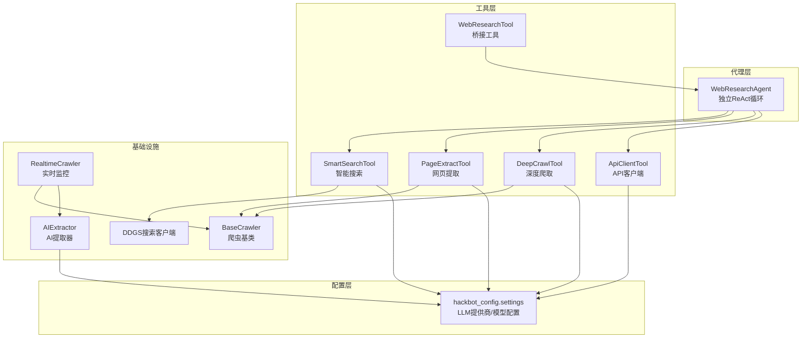

**图表来源**
- [core/agents/web_research_agent.py](file://core/agents/web_research_agent.py#L52-L190)
- [tools/web_research/web_research_tool.py](file://tools/web_research/web_research_tool.py#L23-L97)
- [tools/web_research/smart_search_tool.py](file://tools/web_research/smart_search_tool.py#L12-L80)
- [tools/web_research/deep_crawl_tool.py](file://tools/web_research/deep_crawl_tool.py#L13-L66)
- [tools/web_research/page_extract_tool.py](file://tools/web_research/page_extract_tool.py#L11-L80)
- [tools/web_research/api_client_tool.py](file://tools/web_research/api_client_tool.py#L132-L181)
- [tools/web_search_ddgs.py](file://tools/web_search_ddgs.py#L71-L112)
- [crawler/base.py](file://crawler/base.py#L45-L137)
- [crawler/extractor.py](file://crawler/extractor.py#L12-L86)
- [crawler/realtime.py](file://crawler/realtime.py#L25-L194)
- [hackbot_config/__init__.py](file://hackbot_config/__init__.py#L162-L246)

**章节来源**
- [README_CN.md](file://README_CN.md#L52-L59)

## 核心组件
- WebResearchAgent：独立 ReAct 循环的子智能体，负责思考、工具选择与调用、观察与总结。
- WebResearchTool：桥接工具，支持自动模式（委托子智能体）与直接模式（直连工具）。
- SmartSearchTool：基于 DuckDuckGo 的智能搜索，抓取结果页面并由 LLM 生成综合摘要。
- DeepCrawlTool：广度优先多页面爬取，支持深度/数量控制、URL 过滤、可选 AI 摘要。
- PageExtractTool：纯文本/结构化/自定义 schema 三种提取模式，支持 CSS 选择器聚焦。
- ApiClientTool：通用 REST API 客户端，内置常用模板与错误收集。
- DDGS搜索客户端：统一 DuckDuckGo 搜索接口，支持多后端回退。
- 基础爬虫与AI提取器：提供通用爬取、文本提取、结构化抽取与嵌入能力。
- 实时监控：基于内容哈希与可选 AI 提取的网站变化监控。

**章节来源**
- [core/agents/web_research_agent.py](file://core/agents/web_research_agent.py#L52-L190)
- [tools/web_research/web_research_tool.py](file://tools/web_research/web_research_tool.py#L23-L97)
- [tools/web_research/smart_search_tool.py](file://tools/web_research/smart_search_tool.py#L12-L80)
- [tools/web_research/deep_crawl_tool.py](file://tools/web_research/deep_crawl_tool.py#L13-L66)
- [tools/web_research/page_extract_tool.py](file://tools/web_research/page_extract_tool.py#L11-L80)
- [tools/web_research/api_client_tool.py](file://tools/web_research/api_client_tool.py#L132-L181)
- [tools/web_search_ddgs.py](file://tools/web_search_ddgs.py#L71-L112)
- [crawler/base.py](file://crawler/base.py#L45-L137)
- [crawler/extractor.py](file://crawler/extractor.py#L12-L86)
- [crawler/realtime.py](file://crawler/realtime.py#L25-L194)

## 架构总览
Web研究智能体通过 WebResearchTool 将任务委托给 WebResearchAgent，后者在 ReAct 循环中选择并调用具体工具，实现“搜索→提取→爬取→API”的一体化研究流程。工具层与基础设施层分别承担搜索、解析、抽取与监控等职责，配置层统一管理 LLM 提供商与模型。

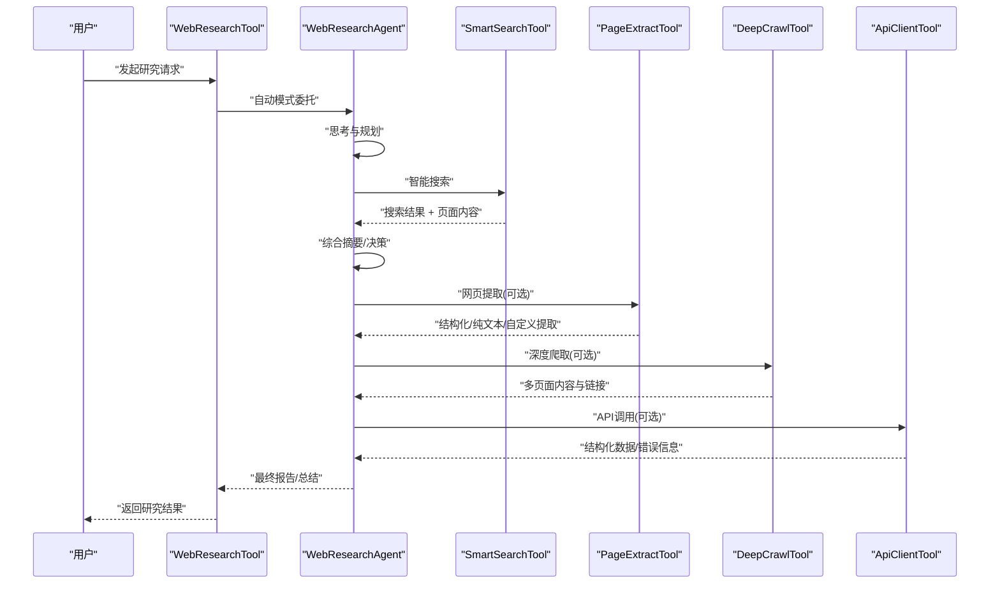

**图表来源**
- [tools/web_research/web_research_tool.py](file://tools/web_research/web_research_tool.py#L81-L97)
- [core/agents/web_research_agent.py](file://core/agents/web_research_agent.py#L114-L190)
- [tools/web_research/smart_search_tool.py](file://tools/web_research/smart_search_tool.py#L28-L80)
- [tools/web_research/page_extract_tool.py](file://tools/web_research/page_extract_tool.py#L27-L80)
- [tools/web_research/deep_crawl_tool.py](file://tools/web_research/deep_crawl_tool.py#L29-L66)
- [tools/web_research/api_client_tool.py](file://tools/web_research/api_client_tool.py#L154-L181)

## 详细组件分析

### WebResearchAgent：ReAct 循环与推理
- 系统提示词明确了核心能力（智能搜索、网页提取、深度爬取、API 交互）与工作原则（最小工具调用、精确关键词、去重与交叉验证、结构化呈现、标注来源）。
- ReAct 主循环包含“思考→解析动作→工具调用→观察→迭代”的闭环，支持在达到最大迭代次数时汇总已有观察并生成总结。
- 动作解析采用正则匹配 JSON，观察结果格式化为可读文本，最终答案提取支持大小写不敏感匹配。

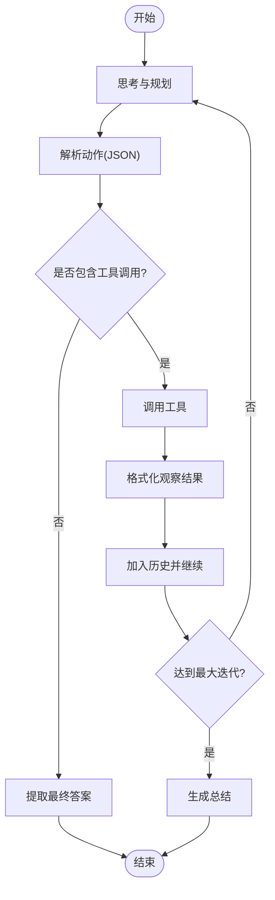

**图表来源**
- [core/agents/web_research_agent.py](file://core/agents/web_research_agent.py#L126-L190)
- [core/agents/web_research_agent.py](file://core/agents/web_research_agent.py#L255-L294)
- [core/agents/web_research_agent.py](file://core/agents/web_research_agent.py#L300-L341)

**章节来源**
- [core/agents/web_research_agent.py](file://core/agents/web_research_agent.py#L52-L190)

### WebResearchTool：桥接与模式切换
- 支持两种模式：
  - 自动模式（auto）：创建 WebResearchAgent 子智能体，完成搜索→提取→爬取→总结全流程。
  - 直接模式（search/extract/crawl/api）：跳过子智能体，直接调用对应工具。
- 参数校验与错误处理完善，支持模式参数与工具参数的灵活组合。

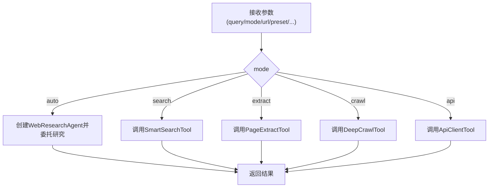

**图表来源**
- [tools/web_research/web_research_tool.py](file://tools/web_research/web_research_tool.py#L45-L75)
- [tools/web_research/web_research_tool.py](file://tools/web_research/web_research_tool.py#L81-L97)
- [tools/web_research/web_research_tool.py](file://tools/web_research/web_research_tool.py#L103-L180)

**章节来源**
- [tools/web_research/web_research_tool.py](file://tools/web_research/web_research_tool.py#L23-L97)

### SmartSearchTool：搜索→抓取→摘要
- 搜索：优先使用 ddgs，失败时回退 duckduckgo-search，再回退到 HTML 抓取。
- 抓取：并发访问搜索结果页面，使用 BeautifulSoup 去噪并提取纯文本。
- 摘要：将多页面内容合并，调用 LLM（Ollama/DeepSeek）生成综合摘要，支持开关与长度控制。

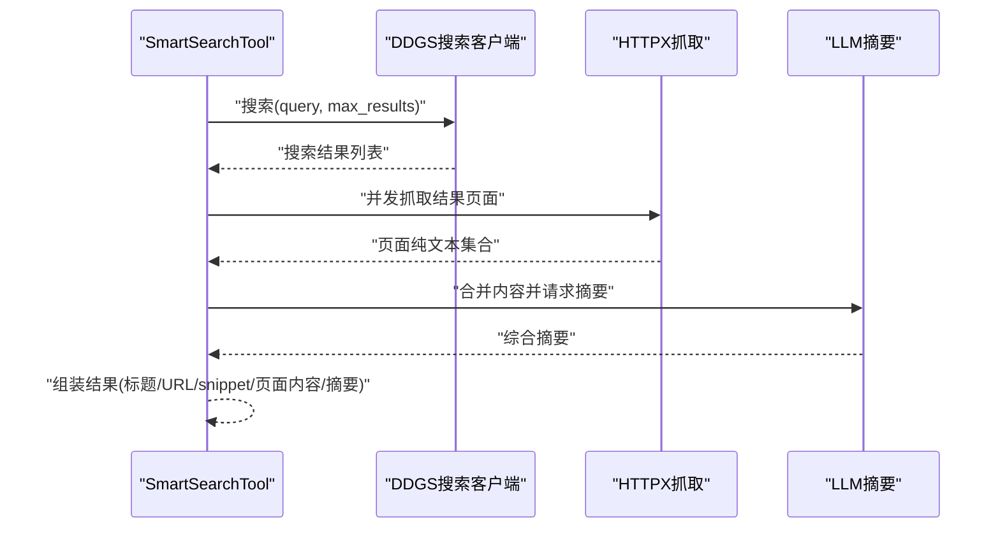

**图表来源**
- [tools/web_research/smart_search_tool.py](file://tools/web_research/smart_search_tool.py#L28-L80)
- [tools/web_search_ddgs.py](file://tools/web_search_ddgs.py#L71-L112)

**章节来源**
- [tools/web_research/smart_search_tool.py](file://tools/web_research/smart_search_tool.py#L12-L80)
- [tools/web_search_ddgs.py](file://tools/web_search_ddgs.py#L14-L112)

### DeepCrawlTool：广度优先多页面爬取
- BFS 爬取，支持最大深度、最大页面数、URL 正则过滤、同域限制与并发信号量。
- 每页提取标题、内容预览、链接列表，可选调用 LLM 生成页面摘要。
- URL 归一化避免重复访问，异常与超时处理完善。

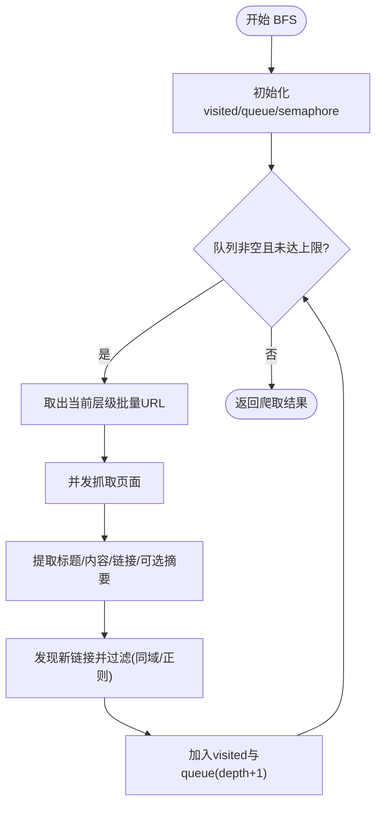

**图表来源**
- [tools/web_research/deep_crawl_tool.py](file://tools/web_research/deep_crawl_tool.py#L72-L148)
- [tools/web_research/deep_crawl_tool.py](file://tools/web_research/deep_crawl_tool.py#L150-L218)

**章节来源**
- [tools/web_research/deep_crawl_tool.py](file://tools/web_research/deep_crawl_tool.py#L13-L66)

### PageExtractTool：多模式内容提取
- 纯文本模式：移除噪音标签，提取链接与图片，限制输出长度。
- 结构化模式：提取标题层级、表格、列表、元数据等。
- 自定义模式：基于 AI schema 生成 JSON 结果，支持 CSS 选择器聚焦。
- JSON 提取鲁棒性：从 AI 输出中提取 JSON 片段并解析。

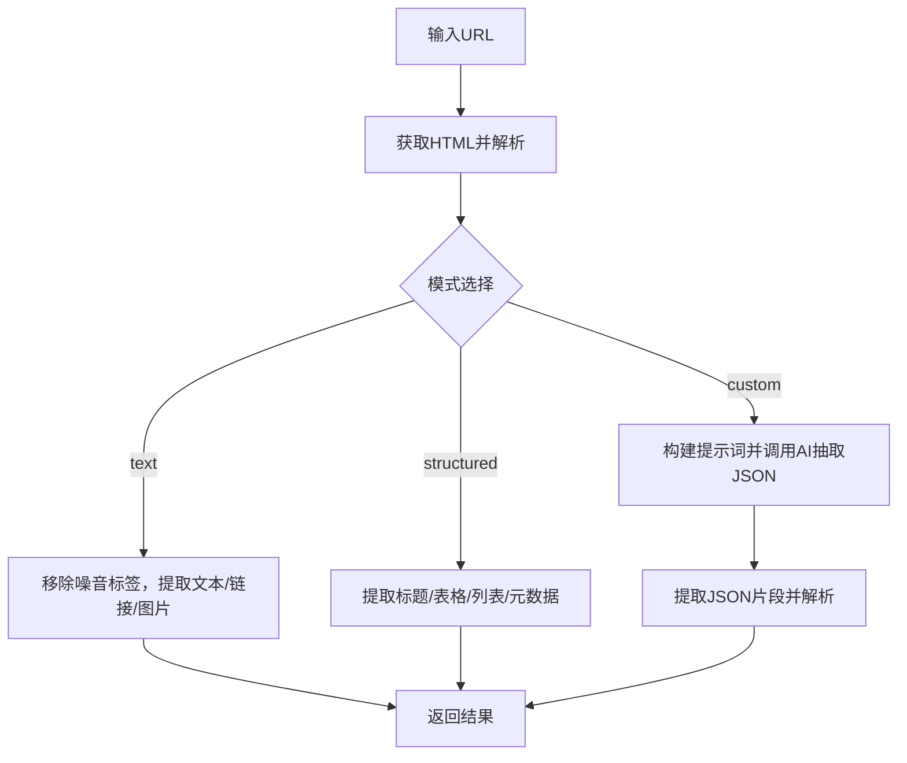

**图表来源**
- [tools/web_research/page_extract_tool.py](file://tools/web_research/page_extract_tool.py#L27-L80)
- [tools/web_research/page_extract_tool.py](file://tools/web_research/page_extract_tool.py#L114-L151)
- [tools/web_research/page_extract_tool.py](file://tools/web_research/page_extract_tool.py#L157-L209)
- [tools/web_research/page_extract_tool.py](file://tools/web_research/page_extract_tool.py#L215-L259)

**章节来源**
- [tools/web_research/page_extract_tool.py](file://tools/web_research/page_extract_tool.py#L11-L80)

### ApiClientTool：通用 REST API 客户端
- 支持内置模板（天气、IP、GitHub、汇率、DNS、短链等）与自定义请求。
- 认证支持 bearer 与 api_key，超时与重试策略，错误收集与统计。
- 响应解析：优先 JSON，失败时返回文本预览与头部信息。

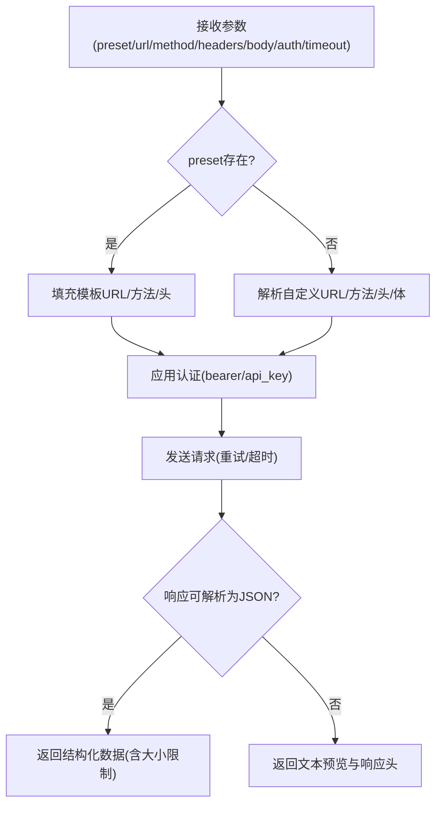

**图表来源**
- [tools/web_research/api_client_tool.py](file://tools/web_research/api_client_tool.py#L154-L181)
- [tools/web_research/api_client_tool.py](file://tools/web_research/api_client_tool.py#L263-L461)

**章节来源**
- [tools/web_research/api_client_tool.py](file://tools/web_research/api_client_tool.py#L132-L181)

### 基础爬虫与AI提取器
- BaseCrawler：提供简单 HTTP 爬取、HTML 解析、文本/链接提取与 Selenium/Playwright 支持。
- AIExtractor：基于 Ollama/DeepSeek 提供结构化抽取、实体识别、摘要与关键词提取。

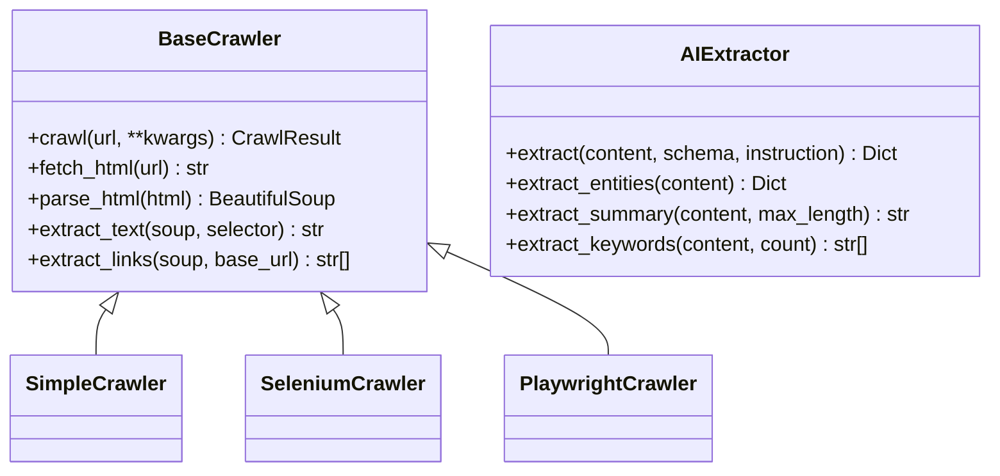

**图表来源**
- [crawler/base.py](file://crawler/base.py#L45-L137)
- [crawler/base.py](file://crawler/base.py#L140-L271)
- [crawler/extractor.py](file://crawler/extractor.py#L12-L86)

**章节来源**
- [crawler/base.py](file://crawler/base.py#L45-L137)
- [crawler/extractor.py](file://crawler/extractor.py#L12-L86)

### 实时监控：变化检测与信息抽取
- 基于内容哈希检测变化，支持回调与可选 AI 提取器配置。
- 支持启动/停止、单次检查与批量检查。

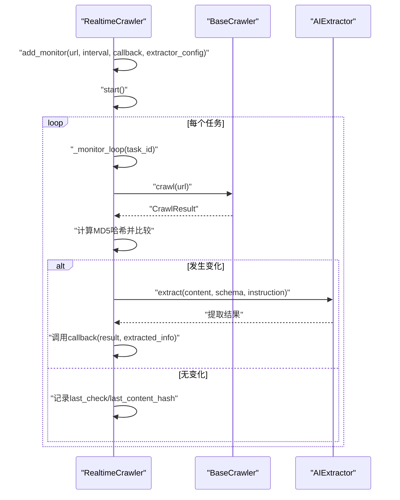

**图表来源**
- [crawler/realtime.py](file://crawler/realtime.py#L25-L194)
- [crawler/base.py](file://crawler/base.py#L18-L43)
- [crawler/extractor.py](file://crawler/extractor.py#L19-L86)

**章节来源**
- [crawler/realtime.py](file://crawler/realtime.py#L25-L194)

## 依赖关系分析
- WebResearchAgent 依赖工具层的四个工具，延迟导入避免循环依赖。
- SmartSearchTool 依赖 DDGS 搜索客户端与 LLM 配置。
- DeepCrawlTool/PageExtractTool 依赖 httpx/BeautifulSoup 与 LLM 配置。
- ApiClientTool 依赖 httpx 与 LLM 配置，内置错误收集器。
- 基础爬虫与 AI 提取器为通用能力，被多种工具复用。
- 配置层统一管理 LLM 提供商与模型，支持 Ollama/DeepSeek 等。

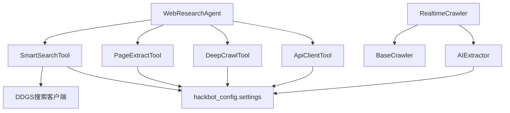

**图表来源**
- [core/agents/web_research_agent.py](file://core/agents/web_research_agent.py#L63-L79)
- [tools/web_research/smart_search_tool.py](file://tools/web_research/smart_search_tool.py#L8-L15)
- [tools/web_research/deep_crawl_tool.py](file://tools/web_research/deep_crawl_tool.py#L8-L10)
- [tools/web_research/page_extract_tool.py](file://tools/web_research/page_extract_tool.py#L6-L8)
- [tools/web_research/api_client_tool.py](file://tools/web_research/api_client_tool.py#L8-L10)
- [crawler/realtime.py](file://crawler/realtime.py#L8-L11)
- [hackbot_config/__init__.py](file://hackbot_config/__init__.py#L162-L246)

**章节来源**
- [hackbot_config/__init__.py](file://hackbot_config/__init__.py#L162-L246)

## 性能考量
- 并发与限流：SmartSearchTool 与 DeepCrawlTool 使用并发抓取与信号量，避免过度请求。
- 超时与重试：ApiClientTool 提供指数退避重试与超时控制，降低网络波动影响。
- 内容截断与长度限制：多处对文本/JSON 输出进行长度限制，避免 token 爆炸与内存压力。
- 模型选择：配置层支持多提供商与模型切换，可根据硬件能力选择合适模型。

[本节为通用指导，无需具体文件分析]

## 故障排查指南
- 搜索失败：检查 DDGS/duckduckgo-search 安装与网络连通性，确认回退到 HTML 抓取是否生效。
- 页面抓取失败：确认 URL 可访问、User-Agent 设置、SSL 验证与超时配置。
- AI 摘要失败：检查 LLM 提供商配置（Ollama/DeepSeek）与 API Key，确认模型可用性。
- API 请求错误：查看错误收集器（ApiClientTool）的错误统计与最近错误，定位超时/连接/状态码等问题。
- 实时监控异常：确认任务间隔、回调函数与提取器配置，检查哈希计算与内容变更逻辑。

**章节来源**
- [tools/web_search_ddgs.py](file://tools/web_search_ddgs.py#L82-L112)
- [tools/web_research/smart_search_tool.py](file://tools/web_research/smart_search_tool.py#L164-L208)
- [tools/web_research/api_client_tool.py](file://tools/web_research/api_client_tool.py#L384-L461)
- [crawler/realtime.py](file://crawler/realtime.py#L124-L148)

## 结论
Web研究智能体通过 ReAct 循环与工具集实现了从“搜索—提取—爬取—API”的一体化研究流程。其在复杂查询与多步骤任务中表现稳健，具备良好的并发控制、错误处理与配置灵活性。结合实时监控与 AI 提取能力，能够持续跟踪目标变化并生成结构化洞察，适用于渗透测试情报收集与安全研究场景。

[本节为总结性内容，无需具体文件分析]

## 附录

### 使用场景与实践要点
- 渗透测试情报收集：通过智能搜索与网页提取快速掌握目标暴露面与技术栈，再用深度爬取与 API 客户端补充结构化数据。
- 动态内容与交互式页面：优先使用 Playwright/Selenium 爬虫（见基础爬虫类），确保 JavaScript 渲染后的内容可抓取。
- 信息整合与去重：利用内容哈希与链接去重策略，结合 AI 提取器进行结构化抽取，减少重复与噪声。
- 质量评估与可信度：通过多来源交叉验证、摘要与实体识别、错误统计与日志审计，提升信息可信度。

[本节为概念性内容，无需具体文件分析]