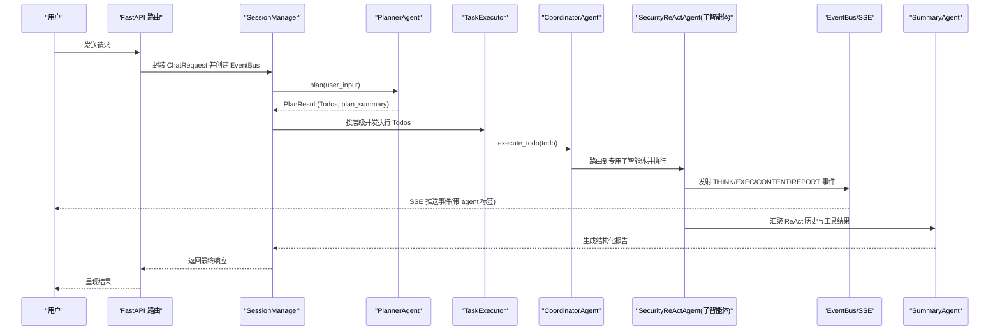
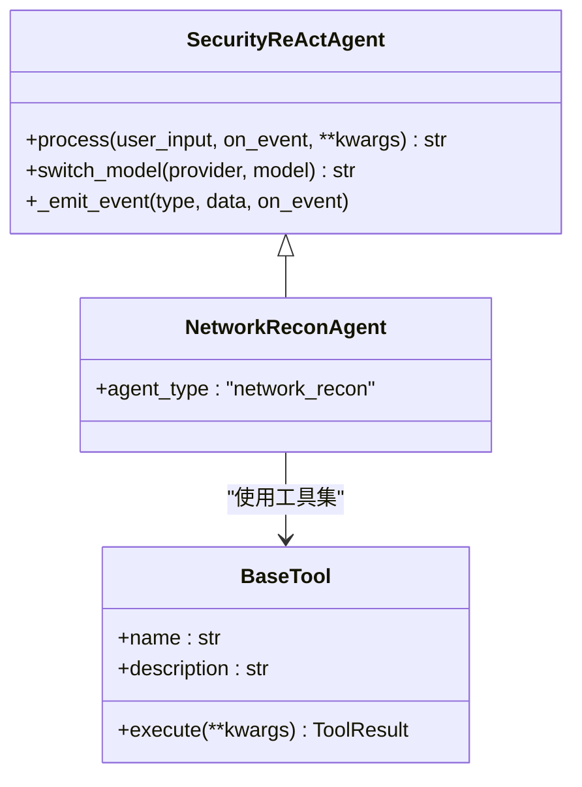
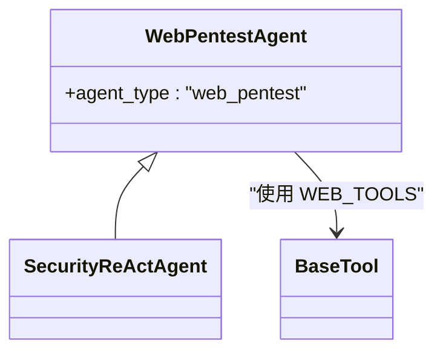
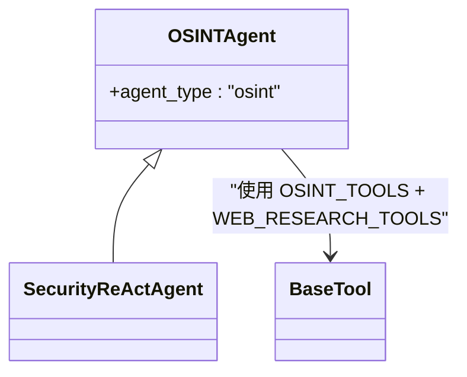
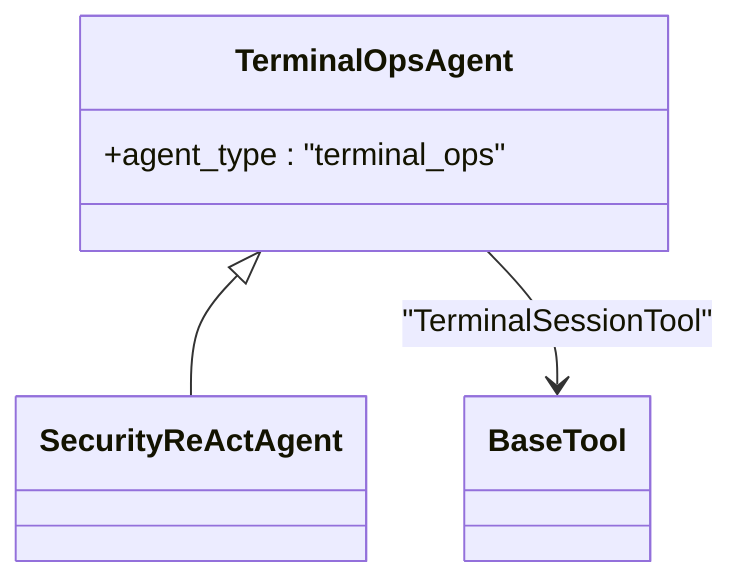
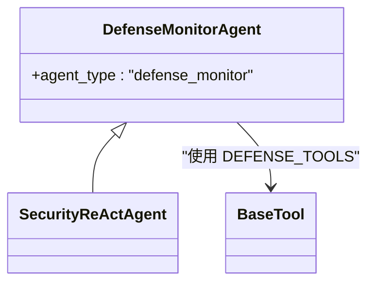
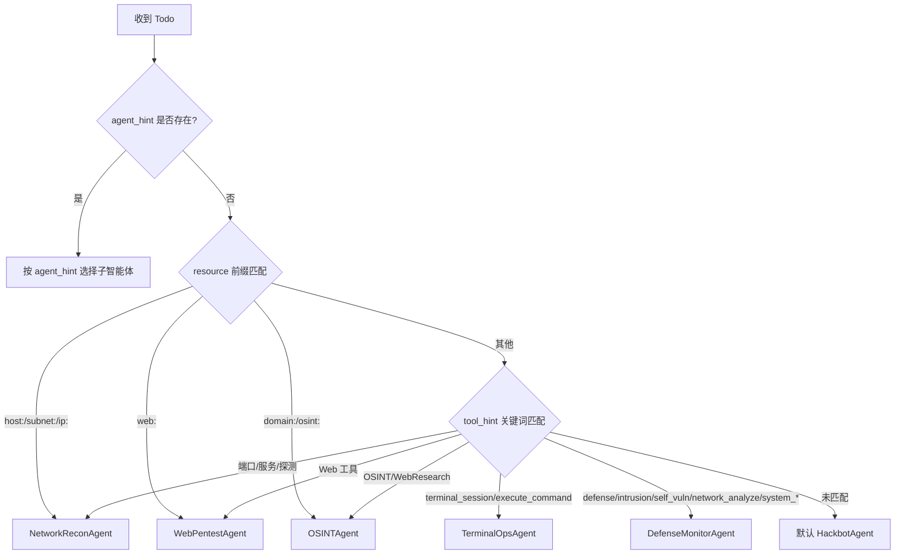
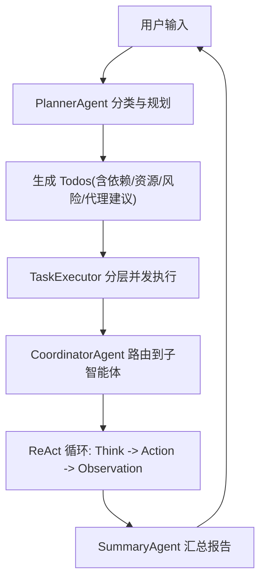
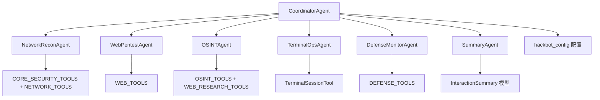

# 专用智能体

<cite>
**本文引用的文件**
- [core/agents/base.py](file://core/agents/base.py)
- [core/agents/specialist_agents.py](file://core/agents/specialist_agents.py)
- [core/agents/coordinator_agent.py](file://core/agents/coordinator_agent.py)
- [core/agents/planner_agent.py](file://core/agents/planner_agent.py)
- [core/agents/tool_calling_agent.py](file://core/agents/tool_calling_agent.py)
- [core/agents/summary_agent.py](file://core/agents/summary_agent.py)
- [core/patterns/security_react.py](file://core/patterns/security_react.py)
- [core/models.py](file://core/models.py)
- [tools/base.py](file://tools/base.py)
- [tools/pentest/security/__init__.py](file://tools/pentest/security/__init__.py)
- [tools/web_research/__init__.py](file://tools/web_research/__init__.py)
- [hackbot_config/__init__.py](file://hackbot_config/__init__.py)
- [router/agents.py](file://router/agents.py)
- [README_CN.md](file://README_CN.md)
</cite>

## 目录
1. [引言](#引言)
2. [项目结构](#项目结构)
3. [核心组件](#核心组件)
4. [架构总览](#架构总览)
5. [详细组件分析](#详细组件分析)
6. [依赖分析](#依赖分析)
7. [性能考量](#性能考量)
8. [故障排查指南](#故障排查指南)
9. [结论](#结论)
10. [附录](#附录)

## 引言
本文件围绕“专用智能体”的设计与实现，系统梳理网络侦察智能体、Web 渗透智能体、OSINT 智能体、终端操作智能体与防御监控智能体的职责边界、专业技能、工具集与协作机制。文档结合代码级实现，提供架构图、序列图与流程图，帮助读者快速理解从用户请求到多智能体协同执行再到报告生成的完整闭环。

## 项目结构
- 智能体层：基础智能体、安全 ReAct 引擎、多子智能体、协调器、规划器、工具调用智能体、摘要智能体。
- 工具层：按领域划分的工具集合（安全扫描、网络探测、Web 渗透、OSINT、协议探测、云与容器、终端会话、报告生成等）。
- 配置与路由：多厂商 LLM 配置、API 路由与智能体管理接口。
- 会话与事件：Planner 生成结构化计划，Coordinator 路由到子智能体，EventBus 与 SSE 向前端推送事件。

```mermaid
graph TB
subgraph "前端"
UI["终端/移动 UI"]
end
subgraph "后端路由"
API["FastAPI 路由<br/>router/chat.py"]
AGENTS_API["智能体管理路由<br/>router/agents.py"]
end
subgraph "会话编排"
SESSION["SessionManager<br/>core/session.py"]
PLANNER["PlannerAgent<br/>core/agents/planner_agent.py"]
EXECUTOR["TaskExecutor<br/>core/executor.py"]
end
subgraph "多智能体协调"
COORD["CoordinatorAgent<br/>core/agents/coordinator_agent.py"]
NET["NetworkReconAgent"]
WEB["WebPentestAgent"]
OSINT["OSINTAgent"]
TERM["TerminalOpsAgent"]
DEF["DefenseMonitorAgent"]
END
subgraph "工具层"
TOOLS_SEC["安全工具集<br/>tools/pentest/security/__init__.py"]
TOOLS_WEBRES["Web 研究工具集<br/>tools/web_research/__init__.py"]
end
subgraph "总结与存储"
SUMMARY["SummaryAgent<br/>core/agents/summary_agent.py"]
DB["SQLite 数据库"]
end
UI --> API
API --> SESSION
SESSION --> PLANNER
PLANNER --> EXECUTOR
EXECUTOR --> COORD
COORD --> NET
COORD --> WEB
COORD --> OSINT
COORD --> TERM
COORD --> DEF
NET --> TOOLS_SEC
WEB --> TOOLS_SEC
OSINT --> TOOLS_WEBRES
TERM --> TOOLS_SEC
DEF --> TOOLS_SEC
COORD --> SUMMARY
SUMMARY --> DB
```

图表来源
- [README_CN.md](file://README_CN.md#L77-L152)
- [router/agents.py](file://router/agents.py#L1-L57)

章节来源
- [README_CN.md](file://README_CN.md#L67-L272)

## 核心组件
- 基础智能体与消息模型：定义统一的消息结构、系统提示词与记忆管理。
- 安全 ReAct 引擎：支持自动执行与人工确认两种模式，内置事件发射与会话摘要。
- 专用子智能体：网络侦察、Web 渗透、OSINT、终端操作、防御监控，各自专属工具集与系统提示词。
- 协调器：根据 Todo 的 agent_hint/resource/tool_hint 将任务路由至对应子智能体，并聚合结果。
- 规划器：将自然语言请求转化为结构化 Todo 列表，包含依赖、资源、风险等级与代理建议。
- 工具调用智能体：桥接 LangChain 工具与自研工具，支持多厂商 LLM 与工具绑定。
- 摘要智能体：生成结构化报告，支持多 Agent 执行概览与风险评估。

章节来源
- [core/agents/base.py](file://core/agents/base.py#L10-L125)
- [core/patterns/security_react.py](file://core/patterns/security_react.py#L142-L305)
- [core/agents/specialist_agents.py](file://core/agents/specialist_agents.py#L32-L247)
- [core/agents/coordinator_agent.py](file://core/agents/coordinator_agent.py#L40-L335)
- [core/agents/planner_agent.py](file://core/agents/planner_agent.py#L20-L837)
- [core/agents/tool_calling_agent.py](file://core/agents/tool_calling_agent.py#L75-L506)
- [core/agents/summary_agent.py](file://core/agents/summary_agent.py#L53-L628)

## 架构总览
多智能体协作采用“规划-分层执行-子智能体路由-事件驱动-报告汇总”的流水线。Planner 生成 Todos，TaskExecutor 按依赖与资源/风险约束进行分层并发；Coordinator 根据 hint 将任务委派给专用子智能体；SecurityReAct 引擎驱动 ReAct 循环，事件通过 EventBus/SSE 传递到前端；最后由 SummaryAgent 汇总生成结构化报告。



图表来源
- [README_CN.md](file://README_CN.md#L154-L272)
- [core/agents/coordinator_agent.py](file://core/agents/coordinator_agent.py#L130-L182)
- [core/patterns/security_react.py](file://core/patterns/security_react.py#L393-L628)

章节来源
- [README_CN.md](file://README_CN.md#L67-L272)

## 详细组件分析

### 网络侦察智能体（NetworkReconAgent）
- 职责：对授权目标执行端口扫描、服务识别、主机/子网发现等，汇总网络攻击面。
- 工具集：核心安全工具 + 网络探测工具。
- 专业技能：端口扫描、服务指纹识别、子网发现、路由追踪、存活探测。
- 应用场景：内网/外网资产测绘、暴露面评估、为 Web 渗透提供网络情报。
- 参数与提示词：系统提示词限定“网络侧”情报输出；工具参数由 SecurityReAct 引擎解析与执行。



图表来源
- [core/agents/specialist_agents.py](file://core/agents/specialist_agents.py#L80-L96)
- [core/patterns/security_react.py](file://core/patterns/security_react.py#L142-L305)
- [tools/base.py](file://tools/base.py#L16-L36)

章节来源
- [core/agents/specialist_agents.py](file://core/agents/specialist_agents.py#L66-L96)
- [tools/pentest/security/__init__.py](file://tools/pentest/security/__init__.py#L33-L38)

### Web 渗透智能体（WebPentestAgent）
- 职责：针对授权 Web 资产执行目录枚举、指纹识别、WAF 检测、Header 分析、基础漏洞探测。
- 工具集：Web 渗透工具集（目录爆破、WAF 检测、技术栈识别、Header 分析、参数模糊测试等）。
- 专业技能：目录枚举、指纹识别、危险头检测、CORS 配置检查、JWT 分析、参数模糊测试、SSRF 检测。
- 应用场景：Web 资产基础安全检查、暴露面识别、为深入渗透提供前置信息。
- 参数与提示词：系统提示词聚焦“目标站点当前暴露面与基础风险”。



图表来源
- [core/agents/specialist_agents.py](file://core/agents/specialist_agents.py#L115-L131)
- [tools/pentest/security/__init__.py](file://tools/pentest/security/__init__.py#L49-L50)

章节来源
- [core/agents/specialist_agents.py](file://core/agents/specialist_agents.py#L102-L131)

### OSINT 智能体（OSINTAgent）
- 职责：结合 OSINT 与 WebResearch 工具，对域名、IP、组织名等进行公开情报查询，补充外部视角。
- 工具集：Shodan/VirusTotal 等外部情报工具 + WebResearch 工具（智能搜索、页面提取、深度爬取、API 客户端）。
- 专业技能：资产发现、历史泄露查询、恶意情报关联、搜索引擎与爬虫。
- 应用场景：外部情报收集、供应链风险评估、威胁情报关联分析。
- 参数与提示词：系统提示词强调“标注信息来源，区分已验证与可能性”。



图表来源
- [core/agents/specialist_agents.py](file://core/agents/specialist_agents.py#L151-L167)
- [tools/web_research/__init__.py](file://tools/web_research/__init__.py#L13-L19)

章节来源
- [core/agents/specialist_agents.py](file://core/agents/specialist_agents.py#L137-L167)

### 终端操作智能体（TerminalOpsAgent）
- 职责：在授权主机上通过持久化终端会话执行命令、收集日志、运行小脚本，严格遵循“仅在授权范围内执行”。
- 工具集：TerminalSessionTool（打开/执行/读取/关闭/列举会话）。
- 专业技能：命令执行、日志收集、脚本运行、会话管理。
- 应用场景：授权主机上的系统信息采集、临时脚本执行、取证与审计。
- 参数与提示词：系统提示词强调“简要说明执行了哪些命令、产生了哪些关键输出”。



图表来源
- [core/agents/specialist_agents.py](file://core/agents/specialist_agents.py#L186-L202)

章节来源
- [core/agents/specialist_agents.py](file://core/agents/specialist_agents.py#L173-L202)

### 防御监控智能体（DefenseMonitorAgent）
- 职责：调用防御类工具检查系统安全状态（自检漏洞、入侵检测、网络分析等），提出加固建议。
- 工具集：防御扫描、自检扫描、入侵检测、网络分析等工具。
- 专业技能：系统自检、入侵检测、网络流量分析、风险评估与建议。
- 应用场景：本机/网络侧安全巡检、威胁检测、安全基线评估。
- 参数与提示词：系统提示词强调“按发现的问题 → 风险评估 → 建议”的组织方式。



图表来源
- [core/agents/specialist_agents.py](file://core/agents/specialist_agents.py#L221-L237)

章节来源
- [core/agents/specialist_agents.py](file://core/agents/specialist_agents.py#L208-L237)

### 协调器与工具调用机制
- 协调器路由：根据 Todo.agent_hint/resource/tool_hint 选择专用子智能体；无法匹配则回退到默认 Hackbot。
- 事件与结果聚合：为每个结果附加 agent 字段，按 agent 维度聚合，供 SummaryAgent 汇总。
- 工具调用：SecurityReAct 引擎解析 LLM 的工具调用意图，执行 BaseTool 并格式化观察结果；支持自动/手动两种模式。



图表来源
- [core/agents/coordinator_agent.py](file://core/agents/coordinator_agent.py#L242-L331)

章节来源
- [core/agents/coordinator_agent.py](file://core/agents/coordinator_agent.py#L130-L182)
- [core/patterns/security_react.py](file://core/patterns/security_react.py#L393-L628)

### 规划与执行流程
- 规划器将自然语言请求分类为问候/闲聊/技术请求；技术请求生成结构化 Todo 列表，包含依赖、资源、风险等级与代理建议。
- TaskExecutor 基于依赖拓扑与资源/风险约束进行分层并发执行；Coordinator 在每轮结束后同步会话摘要，增强跨轮记忆。



图表来源
- [core/agents/planner_agent.py](file://core/agents/planner_agent.py#L86-L129)
- [core/agents/coordinator_agent.py](file://core/agents/coordinator_agent.py#L130-L182)
- [core/agents/summary_agent.py](file://core/agents/summary_agent.py#L111-L183)

章节来源
- [core/agents/planner_agent.py](file://core/agents/planner_agent.py#L170-L276)
- [core/agents/coordinator_agent.py](file://core/agents/coordinator_agent.py#L215-L237)

### 智能体间协作与信息共享
- 事件驱动：SecurityReActAgent 统一发射事件，Coordinator 附加 agent 标签，EventBus/SSE 透传到前端。
- 会话摘要：Coordinator 在每轮结束将“请求/计划/摘要/关键发现/结论”写入子智能体的会话摘要，保障跨轮上下文一致性。
- 多 Agent 汇总：Coordinator 聚合各子智能体结果，SummaryAgent 生成分节式报告，体现“外部情报/网络攻击面/Web 安全状况/本机防御”。

章节来源
- [core/patterns/security_react.py](file://core/patterns/security_react.py#L227-L278)
- [core/agents/coordinator_agent.py](file://core/agents/coordinator_agent.py#L198-L237)
- [core/agents/summary_agent.py](file://core/agents/summary_agent.py#L399-L421)

## 依赖分析
- 模块耦合：Coordinator 依赖各子智能体与 SecurityReAct 引擎；Planner 依赖工具描述生成；SummaryAgent 依赖交互摘要模型。
- 外部依赖：多厂商 LLM（Ollama、DeepSeek、OpenAI、Anthropic、Google、智谱、通义千问、月之暗面、百川、零一万物）；LangChain 工具绑定与消息模型；SQLite 持久化；EventBus/SSE 事件总线。
- 配置管理：hackbot_config 提供多后端配置、API Key 与 Base URL 管理，支持运行时切换模型。



图表来源
- [core/agents/coordinator_agent.py](file://core/agents/coordinator_agent.py#L73-L92)
- [tools/pentest/security/__init__.py](file://tools/pentest/security/__init__.py#L33-L73)
- [tools/web_research/__init__.py](file://tools/web_research/__init__.py#L13-L19)
- [core/agents/summary_agent.py](file://core/agents/summary_agent.py#L85-L101)
- [hackbot_config/__init__.py](file://hackbot_config/__init__.py#L162-L250)

章节来源
- [core/models.py](file://core/models.py#L85-L137)
- [hackbot_config/__init__.py](file://hackbot_config/__init__.py#L162-L250)

## 性能考量
- 并发与串行：TaskExecutor 基于依赖拓扑分层并发，同一资源上的高风险步骤强制串行，避免系统过载。
- LLM 与工具绑定：支持 bind_tools 与提示词方式，自动回退；模型切换与温度控制降低响应失败概率。
- 事件流与前端：SSE 事件携带 agent 标签，前端按智能体维度渲染，减少 UI 重绘成本。
- 记忆与会话：子智能体维护短记忆摘要，Coordinator 每轮同步，避免长上下文带来的延迟与截断。

## 故障排查指南
- LLM 连接失败：检查 LLM 提供商配置、API Key 与 Base URL；必要时在 .env 中设置 LLM_TOOLS_SUPPORTED=false 以禁用工具绑定。
- 工具执行失败：查看工具返回的 ToolResult.error；确认工具参数格式与权限；必要时在 SuperHackbot 模式下进行人工确认。
- 事件流异常：确认 EventBus 初始化与 SSE 路由；检查 agent 字段是否正确透传。
- 智能体管理：通过 /api/agents/clear 清空指定智能体或全部智能体的记忆，便于重置状态。

章节来源
- [core/agents/tool_calling_agent.py](file://core/agents/tool_calling_agent.py#L295-L313)
- [router/agents.py](file://router/agents.py#L34-L57)
- [hackbot_config/__init__.py](file://hackbot_config/__init__.py#L176-L180)

## 结论
专用智能体通过明确的职责边界、专属工具集与 ReAct 引擎，实现了从规划到执行再到报告的自动化闭环。Coordinator 的路由与聚合、Planner 的结构化规划、SummaryAgent 的多维汇总，共同构成了可扩展、可观测、可审计的多智能体协作体系。配合灵活的 LLM 配置与事件驱动的前端渲染，系统在复杂安全测试任务中具备良好的稳定性与可维护性。

## 附录
- 使用案例与代码示例路径（不直接展示代码）：
  - 网络侦察：参考 NetworkReconAgent 的系统提示词与工具集定义路径。
    - [core/agents/specialist_agents.py](file://core/agents/specialist_agents.py#L66-L96)
    - [tools/pentest/security/__init__.py](file://tools/pentest/security/__init__.py#L33-L38)
  - Web 渗透：参考 WebPentestAgent 的系统提示词与工具集定义路径。
    - [core/agents/specialist_agents.py](file://core/agents/specialist_agents.py#L102-L131)
    - [tools/pentest/security/__init__.py](file://tools/pentest/security/__init__.py#L49-L50)
  - OSINT：参考 OSINTAgent 的系统提示词与工具集定义路径。
    - [core/agents/specialist_agents.py](file://core/agents/specialist_agents.py#L137-L167)
    - [tools/web_research/__init__.py](file://tools/web_research/__init__.py#L13-L19)
  - 终端操作：参考 TerminalOpsAgent 的系统提示词与工具集定义路径。
    - [core/agents/specialist_agents.py](file://core/agents/specialist_agents.py#L173-L202)
  - 防御监控：参考 DefenseMonitorAgent 的系统提示词与工具集定义路径。
    - [core/agents/specialist_agents.py](file://core/agents/specialist_agents.py#L208-L237)
  - 协调与路由：参考 CoordinatorAgent 的路由逻辑与结果聚合。
    - [core/agents/coordinator_agent.py](file://core/agents/coordinator_agent.py#L242-L331)
  - 规划与执行：参考 PlannerAgent 的结构化规划与执行顺序。
    - [core/agents/planner_agent.py](file://core/agents/planner_agent.py#L180-L248)
  - 事件与摘要：参考 SecurityReAct 事件发射与 SummaryAgent 报告生成。
    - [core/patterns/security_react.py](file://core/patterns/security_react.py#L227-L278)
    - [core/agents/summary_agent.py](file://core/agents/summary_agent.py#L111-L183)
  - 配置与模型：参考 hackbot_config 的多厂商 LLM 配置。
    - [hackbot_config/__init__.py](file://hackbot_config/__init__.py#L162-L250)