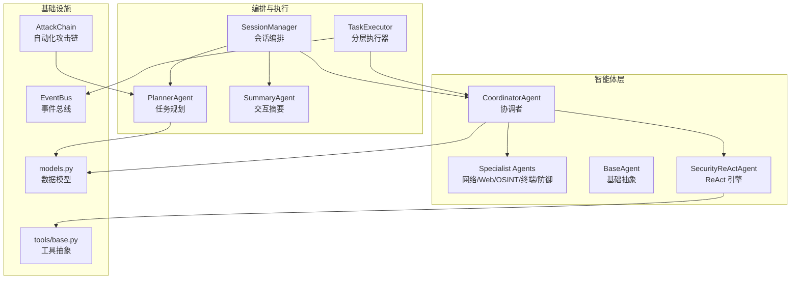
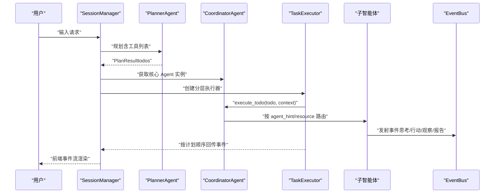
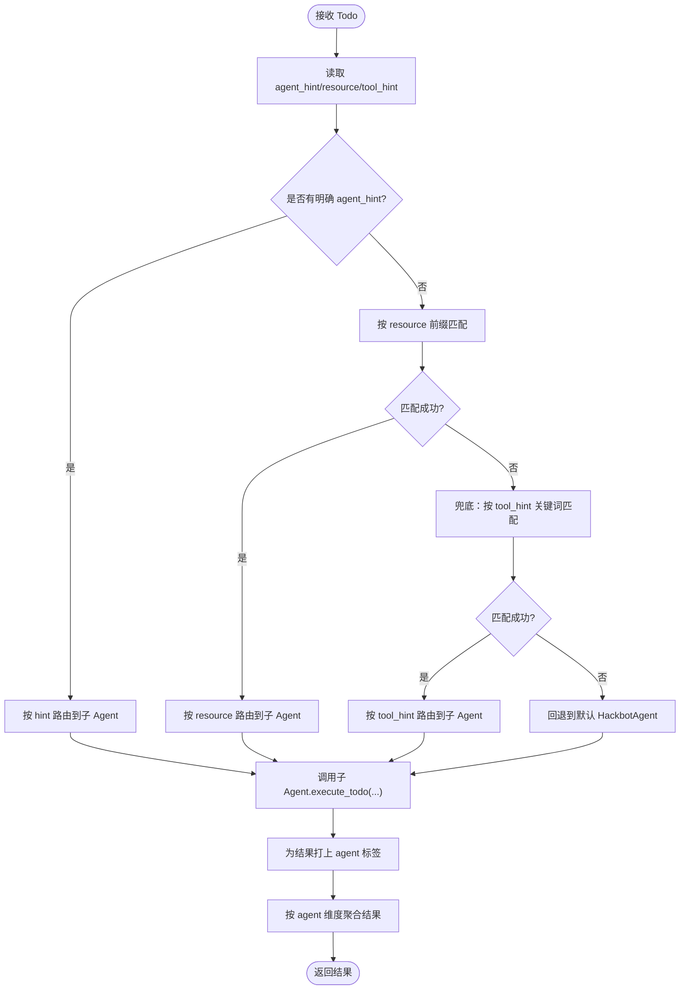
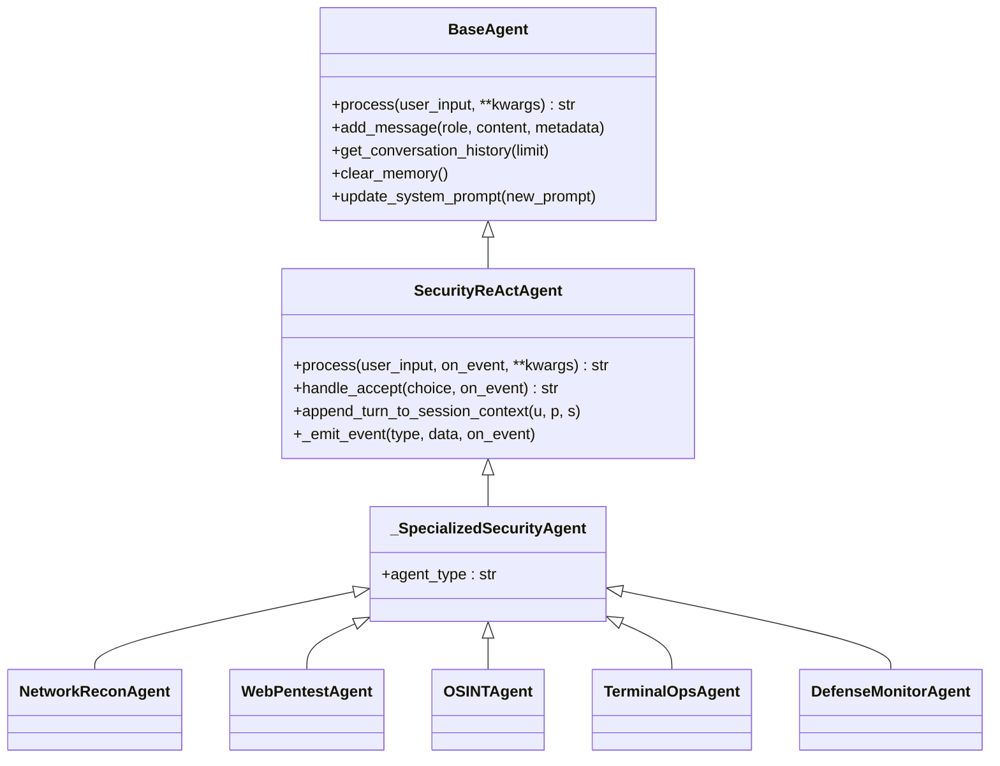
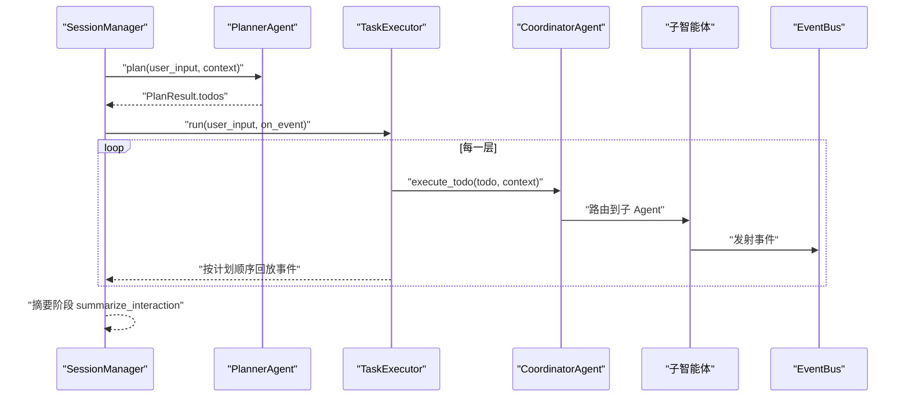
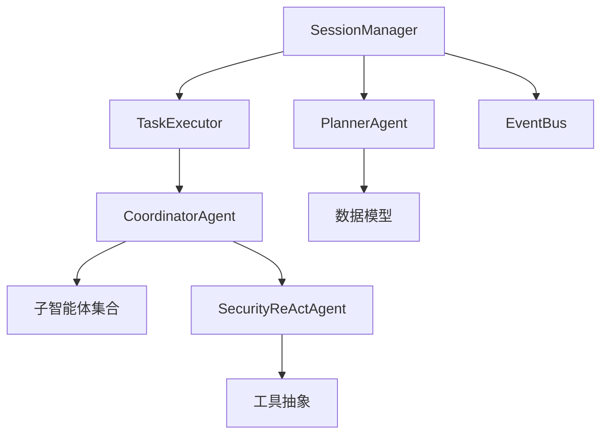

# 协调者智能体

<cite>
**本文引用的文件**
- [core/agents/coordinator_agent.py](file://core/agents/coordinator_agent.py)
- [core/agents/base.py](file://core/agents/base.py)
- [core/agents/specialist_agents.py](file://core/agents/specialist_agents.py)
- [core/patterns/security_react.py](file://core/patterns/security_react.py)
- [core/models.py](file://core/models.py)
- [core/session.py](file://core/session.py)
- [core/executor.py](file://core/executor.py)
- [core/attack_chain/attack_chain.py](file://core/attack_chain/attack_chain.py)
- [router/agents.py](file://router/agents.py)
- [tools/base.py](file://tools/base.py)
</cite>

## 目录
1. [简介](#简介)
2. [项目结构](#项目结构)
3. [核心组件](#核心组件)
4. [架构总览](#架构总览)
5. [详细组件分析](#详细组件分析)
6. [依赖分析](#依赖分析)
7. [性能考虑](#性能考虑)
8. [故障排查指南](#故障排查指南)
9. [结论](#结论)
10. [附录](#附录)

## 简介
协调者智能体（CoordinatorAgent）是 Secbot 多智能体系统中的中枢协调节点，承担以下关键职责：
- 对外以“hackbot”身份被会话管理器与路由调用；
- 在分层执行模式下，依据 Todo 的 agent_hint/resource/tool_hint 将单步执行委托给对应的专职子智能体（网络侦察、Web 渗透、OSINT、终端操作、防御监测）；
- 在每次执行后按 agent 维度聚合工具执行结果，供汇总智能体生成多 Agent 汇总报告；
- 在普通对话/同步模式下，兼容历史行为，直接委托给默认的 HackbotAgent。

协调者智能体通过统一的路由与聚合机制，将复杂的渗透测试与安全巡检任务拆解为可并行/串行的子任务，确保前端事件流与执行顺序可控，同时保持与 ReAct 执行引擎的无缝衔接。

## 项目结构
围绕协调者智能体的相关模块与文件如下图所示：

图表来源
- [core/agents/coordinator_agent.py](file://core/agents/coordinator_agent.py#L1-L335)
- [core/agents/specialist_agents.py](file://core/agents/specialist_agents.py#L1-L247)
- [core/patterns/security_react.py](file://core/patterns/security_react.py#L142-L800)
- [core/session.py](file://core/session.py#L32-L800)
- [core/executor.py](file://core/executor.py#L17-L179)
- [core/models.py](file://core/models.py#L15-L137)
- [tools/base.py](file://tools/base.py#L16-L36)
- [core/attack_chain/attack_chain.py](file://core/attack_chain/attack_chain.py#L11-L213)

章节来源
- [core/agents/coordinator_agent.py](file://core/agents/coordinator_agent.py#L1-L335)
- [core/session.py](file://core/session.py#L32-L800)
- [core/executor.py](file://core/executor.py#L17-L179)
- [core/models.py](file://core/models.py#L15-L137)

## 核心组件
- 协调者智能体（CoordinatorAgent）
  - 职责：路由单步执行、聚合子智能体结果、兼容旧版 process 接口。
  - 关键接口：process()、execute_todo()、tools_dict、get_agent_results_by_agent()、reset_agent_results()、append_turn_to_session_context()。
- 专职子智能体（NetworkReconAgent/WebPentestAgent/OSINTAgent/TerminalOpsAgent/DefenseMonitorAgent）
  - 职责：各自领域内的 ReAct 执行与工具调用，统一标记 agent_type 便于事件流识别。
- 会话编排（SessionManager）
  - 职责：路由简单请求、规划技术任务、驱动分层执行、汇总报告、事件桥接。
- 分层执行器（TaskExecutor）
  - 职责：按 Planner 的执行顺序分层串行/并行执行 Todo，聚合上下文，保证事件顺序与前端渲染一致性。
- ReAct 引擎（SecurityReActAgent）
  - 职责：思考-行动-观察循环，事件发射，工具执行，报告生成。
- 数据模型（models.py）
  - 职责：定义 TodoItem、PlanResult、交互摘要等核心数据结构。
- 工具抽象（tools/base.py）
  - 职责：统一工具接口与执行结果结构。

章节来源
- [core/agents/coordinator_agent.py](file://core/agents/coordinator_agent.py#L40-L335)
- [core/agents/specialist_agents.py](file://core/agents/specialist_agents.py#L32-L247)
- [core/session.py](file://core/session.py#L32-L800)
- [core/executor.py](file://core/executor.py#L17-L179)
- [core/patterns/security_react.py](file://core/patterns/security_react.py#L142-L800)
- [core/models.py](file://core/models.py#L15-L137)
- [tools/base.py](file://tools/base.py#L16-L36)

## 架构总览
协调者智能体在系统中的位置与交互如下：

图表来源
- [core/session.py](file://core/session.py#L306-L422)
- [core/executor.py](file://core/executor.py#L46-L133)
- [core/agents/coordinator_agent.py](file://core/agents/coordinator_agent.py#L130-L181)
- [core/patterns/security_react.py](file://core/patterns/security_react.py#L393-L628)

## 详细组件分析

### 协调者智能体（CoordinatorAgent）
- 路由策略
  - 优先使用 Planner 预填的 agent_hint；
  - 其次根据 resource 前缀（host:/subnet:/web:/domain:/osint:）匹配；
  - 最后根据 tool_hint 关键词进行兜底匹配；
  - 无法匹配时回退到默认 HackbotAgent。
- 结果聚合
  - 每次 execute_todo 后，将结果按 agent 维度追加到 _agent_results，供 SummaryAgent 做多 Agent 汇总。
- 会话上下文
  - 提供 append_turn_to_session_context，将本轮摘要写入各子智能体，增强连续任务的上下文一致性。
- 兼容性
  - process() 在普通对话/同步模式下委托给默认 HackbotAgent，保持向后兼容。

图表来源
- [core/agents/coordinator_agent.py](file://core/agents/coordinator_agent.py#L242-L330)
- [core/agents/coordinator_agent.py](file://core/agents/coordinator_agent.py#L130-L181)

章节来源
- [core/agents/coordinator_agent.py](file://core/agents/coordinator_agent.py#L40-L335)

### 专职子智能体（Specialist Agents）
- 统一继承 _SpecializedSecurityAgent（即 SecurityReActAgent），保留 ReAct 能力；
- 按领域挂载专属工具集，并约定 agent_type 作为事件流来源标记；
- 支持 max_iterations 限制与并发锁，保障稳定性。

图表来源
- [core/agents/base.py](file://core/agents/base.py#L17-L125)
- [core/patterns/security_react.py](file://core/patterns/security_react.py#L142-L800)
- [core/agents/specialist_agents.py](file://core/agents/specialist_agents.py#L32-L247)

章节来源
- [core/agents/specialist_agents.py](file://core/agents/specialist_agents.py#L32-L247)
- [core/patterns/security_react.py](file://core/patterns/security_react.py#L142-L800)

### 会话编排与分层执行
- SessionManager
  - 路由简单请求（问候/闲聊/QA）与技术请求（规划→执行→摘要）；
  - 在有计划且 Agent 支持 execute_todo 时，使用 TaskExecutor 分层执行；
  - 通过事件桥接将子智能体事件转为统一的 EventBus 事件，驱动前端渲染。
- TaskExecutor
  - 根据 Planner 的执行顺序分层：
    - 单 Todo 层：串行执行并直接推送事件；
    - 多 Todo 层：并发 gather，完成后按计划顺序线性推送事件；
  - 上下文聚合：by_todo 与 by_resource，便于后续步骤按资产维度复用前置信息。

图表来源
- [core/session.py](file://core/session.py#L428-L526)
- [core/executor.py](file://core/executor.py#L46-L133)
- [core/agents/coordinator_agent.py](file://core/agents/coordinator_agent.py#L130-L181)

章节来源
- [core/session.py](file://core/session.py#L306-L422)
- [core/executor.py](file://core/executor.py#L17-L179)

### 决策算法、优先级与冲突解决
- 决策算法（路由）
  - 优先级：agent_hint > resource 前缀 > tool_hint 关键词；
  - 无法匹配时回退到默认 HackbotAgent；
  - 该策略确保任务能被最合适的子智能体执行，减少跨域误判。
- 并发与顺序
  - Planner 的 get_execution_order 保证依赖拓扑有序；
  - TaskExecutor 在同一层内按资源与风险等级进行“安全并发”控制（同一资源的高风险步骤强制串行）；
  - 通过并发上限与层内切分，平衡吞吐与安全性。
- 冲突解决
  - 当子智能体抛出异常时，TaskExecutor 以错误对象形式记录并继续推进其他任务；
  - SessionManager 的事件桥接负责自动更新 Todo 状态，避免因个别失败阻塞整体流程。

章节来源
- [core/agents/coordinator_agent.py](file://core/agents/coordinator_agent.py#L242-L330)
- [core/executor.py](file://core/executor.py#L180-L248)
- [core/session.py](file://core/session.py#L683-L721)

### 复杂任务的分解与执行监控
- 任务分解
  - Planner 将用户请求结构化为 TodoList，包含 content、tool_hint、depends_on、resource、risk_level、agent_hint；
  - Todo 的 resource 与 risk_level 用于后续并发与安全控制。
- 执行监控
  - SecurityReActAgent 的事件发射（思考/行动/观察/报告）与 EventBus 的统一事件类型，使前端可线性渲染；
  - SessionManager 的事件桥接自动更新 Todo 状态，支持“下一个 pending”与“当前 in_progress”的回退匹配；
  - 攻击链（AttackChain）在自动化场景下串联信息收集、漏洞扫描、漏洞库增强、利用与后渗透，形成闭环。

章节来源
- [core/agents/planner_agent.py](file://core/agents/planner_agent.py#L86-L128)
- [core/patterns/security_react.py](file://core/patterns/security_react.py#L227-L278)
- [core/session.py](file://core/session.py#L532-L721)
- [core/attack_chain/attack_chain.py](file://core/attack_chain/attack_chain.py#L18-L61)

### 使用场景与代码示例路径
- 场景一：基础安全巡检（网络端口扫描→服务识别→漏洞检测→报告生成）
  - 示例路径：[core/agents/planner_agent.py](file://core/agents/planner_agent.py#L540-L627)
  - 执行路径：SessionManager → Planner → TaskExecutor → CoordinatorAgent → 子智能体 → EventBus
- 场景二：Web 渗透测试（信息收集→目录枚举→指纹识别→基础漏洞探测）
  - 示例路径：[core/agents/specialist_agents.py](file://core/agents/specialist_agents.py#L115-L130)
  - 执行路径：Planner 生成 web_pentest 的 agent_hint → CoordinatorAgent 路由 → WebPentestAgent 执行
- 场景三：自动化攻击链（信息收集→漏洞扫描→漏洞库增强→利用→后渗透）
  - 示例路径：[core/attack_chain/attack_chain.py](file://core/attack_chain/attack_chain.py#L18-L61)

章节来源
- [core/agents/planner_agent.py](file://core/agents/planner_agent.py#L444-L627)
- [core/agents/specialist_agents.py](file://core/agents/specialist_agents.py#L115-L130)
- [core/attack_chain/attack_chain.py](file://core/attack_chain/attack_chain.py#L18-L61)

## 依赖分析
- 组件耦合
  - CoordinatorAgent 依赖 Planner 的元数据（agent_hint/resource/risk_level/tool_hint）与 SecurityReActAgent 的执行接口；
  - SessionManager 依赖 Planner 的执行顺序与 TaskExecutor 的分层执行；
  - TaskExecutor 依赖 CoordinatorAgent 的 execute_todo 接口与上下文聚合策略。
- 外部依赖
  - EventBus：统一事件类型与订阅机制，前端仅订阅事件；
  - 工具抽象：统一的工具接口与执行结果结构，便于 ReAct 引擎调度。

图表来源
- [core/agents/coordinator_agent.py](file://core/agents/coordinator_agent.py#L26-L37)
- [core/session.py](file://core/session.py#L32-L800)
- [core/executor.py](file://core/executor.py#L17-L179)
- [core/patterns/security_react.py](file://core/patterns/security_react.py#L142-L800)
- [tools/base.py](file://tools/base.py#L16-L36)
- [core/models.py](file://core/models.py#L15-L137)

章节来源
- [core/agents/coordinator_agent.py](file://core/agents/coordinator_agent.py#L26-L37)
- [core/session.py](file://core/session.py#L32-L800)
- [core/executor.py](file://core/executor.py#L17-L179)
- [core/patterns/security_react.py](file://core/patterns/security_react.py#L142-L800)
- [tools/base.py](file://tools/base.py#L16-L36)
- [core/models.py](file://core/models.py#L15-L137)

## 性能考虑
- 并发控制
  - Planner 的分层并发与 TaskExecutor 的层内并发上限，避免资源争用；
  - 同一资源的高风险步骤强制串行，降低误伤概率。
- 事件流与渲染
  - 通过按计划顺序回放事件，保证前端线性渲染与用户体验；
  - EventBus 的统一事件类型减少前端分支逻辑。
- 执行效率
  - 子智能体复用同一审计与事件总线，减少重复初始化成本；
  - 工具执行结果按 agent 维度聚合，便于后续摘要与报告生成。

## 故障排查指南
- 无法路由到子智能体
  - 检查 Todo 的 agent_hint/resource/tool_hint 是否正确填写；
  - 若均为空，将回退到默认 HackbotAgent，需确认 Planner 的元数据推断逻辑。
- 工具执行失败
  - 查看 SessionManager 的事件桥接是否自动更新 Todo 状态；
  - 检查 SecurityReActAgent 的事件发射与 EventBus 的错误事件类型。
- 并发冲突或资源竞争
  - 检查 Planner 的资源与风险等级推断；
  - 确认 TaskExecutor 的层内切分逻辑是否正确。
- 会话上下文未更新
  - 确认 CoordinatorAgent 的 append_turn_to_session_context 是否被调用；
  - 检查子智能体的会话上下文拼接长度限制与截断逻辑。

章节来源
- [core/agents/coordinator_agent.py](file://core/agents/coordinator_agent.py#L242-L330)
- [core/session.py](file://core/session.py#L532-L721)
- [core/executor.py](file://core/executor.py#L180-L248)
- [core/patterns/security_react.py](file://core/patterns/security_react.py#L227-L278)

## 结论
协调者智能体在 Secbot 多智能体系统中扮演“任务路由与结果聚合”的中枢角色。它通过明确的路由策略、安全的并发控制与统一的事件流，将复杂的渗透测试与安全巡检任务拆解为可并行/串行的子任务，并确保前端渲染与报告生成的准确性与时序一致性。结合 Planner 的结构化规划、TaskExecutor 的分层执行与 SessionManager 的事件桥接，协调者智能体有效提升了系统的可扩展性与可维护性。

## 附录
- 智能体路由接口（API）
  - 列出智能体类型与说明：[router/agents.py](file://router/agents.py#L18-L31)
- 数据模型
  - TodoItem、PlanResult、交互摘要等：[core/models.py](file://core/models.py#L24-L137)
- 工具抽象
  - 工具接口与执行结果结构：[tools/base.py](file://tools/base.py#L16-L36)