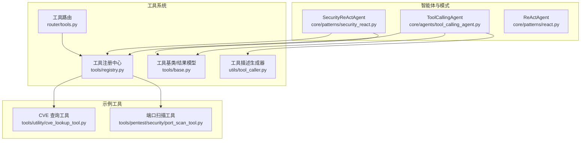
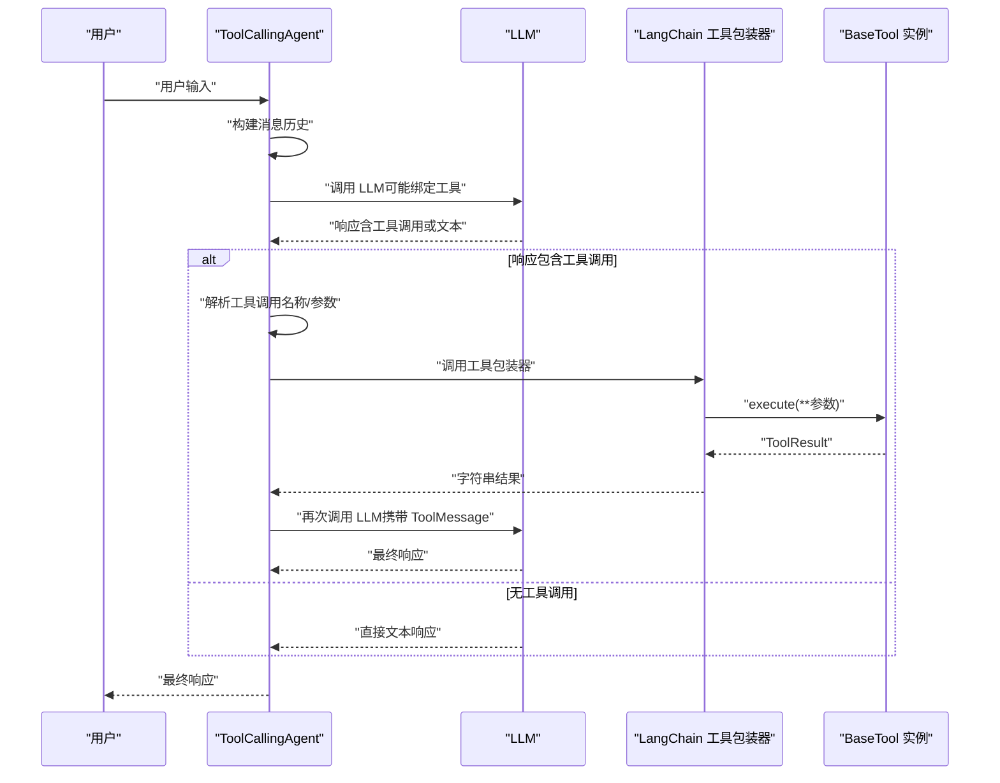
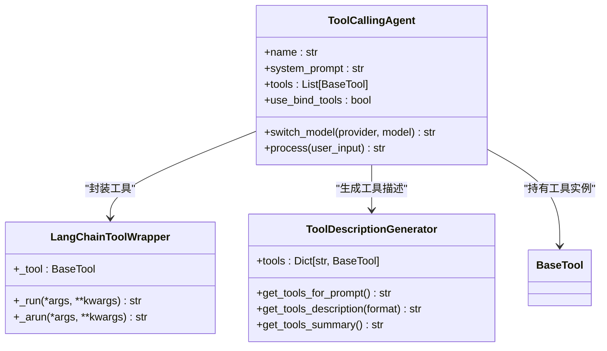
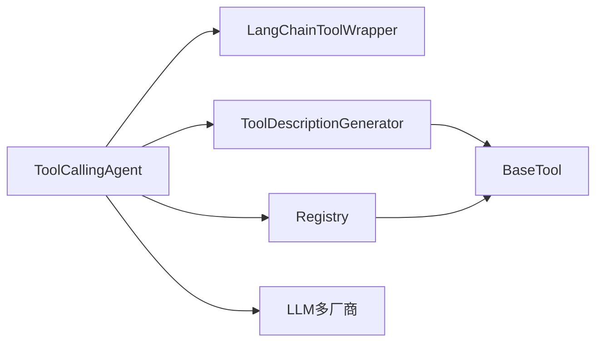

# 工具调用智能体

<cite>
**本文引用的文件**
- [core/agents/tool_calling_agent.py](file://core/agents/tool_calling_agent.py)
- [utils/tool_caller.py](file://utils/tool_caller.py)
- [tools/registry.py](file://tools/registry.py)
- [tools/base.py](file://tools/base.py)
- [core/patterns/security_react.py](file://core/patterns/security_react.py)
- [core/patterns/react.py](file://core/patterns/react.py)
- [router/tools.py](file://router/tools.py)
- [tools/utility/cve_lookup_tool.py](file://tools/utility/cve_lookup_tool.py)
- [tools/pentest/security/port_scan_tool.py](file://tools/pentest/security/port_scan_tool.py)
- [utils/logger.py](file://utils/logger.py)
- [tests/test_agents.py](file://tests/test_agents.py)
</cite>

## 目录
1. [简介](#简介)
2. [项目结构](#项目结构)
3. [核心组件](#核心组件)
4. [架构总览](#架构总览)
5. [详细组件分析](#详细组件分析)
6. [依赖关系分析](#依赖关系分析)
7. [性能考量](#性能考量)
8. [故障排查指南](#故障排查指南)
9. [结论](#结论)
10. [附录](#附录)

## 简介
本文件系统性阐述 Secbot 中“工具调用智能体”的设计与实现，重点覆盖以下方面：
- 工具调用智能体在 Secbot 系统中的角色定位与工作机制
- 工具选择策略、参数生成与执行时机判断
- 如何将自然语言指令转化为具体工具调用
- 参数验证与处理（输入校验、类型转换、错误处理）
- 结果解析与格式化（数据提取、结构化输出、错误恢复）
- 与工具注册系统的集成方式
- 使用示例与代码片段路径
- 性能优化与安全考虑

## 项目结构
围绕工具调用智能体的关键目录与文件如下：
- 智能体与模式：core/agents/tool_calling_agent.py、core/patterns/security_react.py、core/patterns/react.py
- 工具描述生成：utils/tool_caller.py
- 工具注册中心：tools/registry.py
- 工具基类与结果模型：tools/base.py
- 工具路由与示例工具：router/tools.py、tools/utility/cve_lookup_tool.py、tools/pentest/security/port_scan_tool.py
- 日志与测试：utils/logger.py、tests/test_agents.py

图表来源
- [core/agents/tool_calling_agent.py](file://core/agents/tool_calling_agent.py#L75-L141)
- [utils/tool_caller.py](file://utils/tool_caller.py#L10-L22)
- [tools/registry.py](file://tools/registry.py#L106-L134)
- [tools/base.py](file://tools/base.py#L9-L35)
- [router/tools.py](file://router/tools.py#L43-L74)
- [tools/utility/cve_lookup_tool.py](file://tools/utility/cve_lookup_tool.py#L8-L17)
- [tools/pentest/security/port_scan_tool.py](file://tools/pentest/security/port_scan_tool.py#L6-L15)

章节来源
- [core/agents/tool_calling_agent.py](file://core/agents/tool_calling_agent.py#L1-L141)
- [utils/tool_caller.py](file://utils/tool_caller.py#L1-L119)
- [tools/registry.py](file://tools/registry.py#L1-L142)
- [tools/base.py](file://tools/base.py#L1-L36)
- [router/tools.py](file://router/tools.py#L1-L75)

## 核心组件
- 工具调用智能体（ToolCallingAgent）
  - 基于 LangChain 的工具调用与任务编排
  - 支持多厂商推理后端（Ollama / DeepSeek / OpenAI / Anthropic / Google / 智谱 / 通义千问 / 月之暗面 / 百川 / 零一万物 / 自定义中转）
  - 动态绑定工具、提示词增强、工具调用解析与执行、结果整合与响应
- 工具描述生成器（ToolDescriptionGenerator）
  - 为系统提示词注入工具清单与参数说明，提升 LLM 的工具认知
- 工具注册中心（Registry）
  - 支持 entry point 与环境变量自动发现，动态装载工具
- 工具基类（BaseTool）与结果模型（ToolResult）
  - 统一的工具接口与标准化结果结构
- 安全 ReAct 智能体（SecurityReActAgent）
  - 更完整的 ReAct 循环，支持自动执行与用户确认两种模式，内置参数提取与事件发射

章节来源
- [core/agents/tool_calling_agent.py](file://core/agents/tool_calling_agent.py#L75-L141)
- [utils/tool_caller.py](file://utils/tool_caller.py#L10-L119)
- [tools/registry.py](file://tools/registry.py#L106-L134)
- [tools/base.py](file://tools/base.py#L9-L35)
- [core/patterns/security_react.py](file://core/patterns/security_react.py#L142-L190)

## 架构总览
工具调用智能体的总体流程：
- 初始化：构建 LLM、准备工具集合、生成工具描述、绑定工具（若模型支持）
- 输入处理：将用户输入与历史消息封装为 LangChain 消息序列
- 工具调用决策：通过 LLM 判断是否需要工具调用，解析工具名称与参数
- 工具执行：包装为 LangChain 工具，执行并收集结果
- 结果整合：将工具结果作为 ToolMessage 回传给 LLM，生成最终响应
- 错误处理与回退：当模型不支持工具调用时，自动回退为纯对话模式

图表来源
- [core/agents/tool_calling_agent.py](file://core/agents/tool_calling_agent.py#L271-L498)

章节来源
- [core/agents/tool_calling_agent.py](file://core/agents/tool_calling_agent.py#L271-L498)

## 详细组件分析

### 工具调用智能体（ToolCallingAgent）
- 角色与职责
  - 将自然语言指令转化为工具调用，驱动工具执行并整合结果
  - 支持模型切换与工具绑定回退（当模型不支持 tools 时）
- 关键机制
  - LangChain 工具包装：LangChainToolWrapper 将 BaseTool 封装为 LangChain 工具，支持同步与异步执行
  - 工具描述增强：通过 ToolDescriptionGenerator 生成系统提示词中的工具清单与参数说明
  - 工具绑定：优先使用 bind_tools，若模型不支持则回退为提示词方式解析工具调用
  - 工具调用解析：兼容多种格式（标准、Ollama args、function.arguments）
  - 结果整合：将工具执行结果封装为 ToolMessage，二次调用 LLM 生成最终响应
  - 错误处理：捕获模型不支持工具调用、空响应、工具执行异常等情况，输出友好提示
- 模型与工具绑定
  - 根据配置与覆盖参数动态重建 LLM 与绑定
  - 支持运行时切换推理后端与模型

图表来源
- [core/agents/tool_calling_agent.py](file://core/agents/tool_calling_agent.py#L20-L141)
- [utils/tool_caller.py](file://utils/tool_caller.py#L10-L119)
- [tools/base.py](file://tools/base.py#L16-L35)

章节来源
- [core/agents/tool_calling_agent.py](file://core/agents/tool_calling_agent.py#L20-L141)
- [utils/tool_caller.py](file://utils/tool_caller.py#L10-L119)
- [tools/base.py](file://tools/base.py#L16-L35)

### 工具描述生成器（ToolDescriptionGenerator）
- 作用：为系统提示词注入工具清单与参数说明，帮助 LLM 正确理解工具能力与参数
- 功能：
  - 文本/Markdown 格式描述
  - 摘要与完整参数说明
  - 优化后的提示词格式（用于系统提示）

章节来源
- [utils/tool_caller.py](file://utils/tool_caller.py#L10-L119)

### 工具注册中心（Registry）
- 作用：自动发现与装载工具，支持 entry point 与环境变量两种方式
- 功能：
  - 从 entry point 加载（secbot.tools.basic / secbot.tools.advanced）
  - 从环境变量加载（SECBOT_TOOL_MODULES / SECBOT_TOOL_MODULES_ADVANCED）
  - 支持多种装载方式：TOOLS / *_TOOLS / get_tools() / BaseTool 子类

章节来源
- [tools/registry.py](file://tools/registry.py#L106-L134)

### 工具基类与结果模型（BaseTool / ToolResult）
- BaseTool：统一的异步执行接口与模式描述
- ToolResult：标准化的执行结果（success、result、error）

章节来源
- [tools/base.py](file://tools/base.py#L9-L35)

### 安全 ReAct 智能体（SecurityReActAgent）
- 与工具调用智能体的区别
  - 更完整的 ReAct 循环（Think -> Action -> Observation -> ... -> Final Answer）
  - 支持自动执行与用户确认两种模式（auto_execute）
  - 内置参数提取与事件发射，适合复杂安全任务编排
- 参数提取与工具执行
  - 通过 LLM 生成 JSON 格式的工具调用
  - 执行工具并格式化观察结果
  - 支持计划步骤约束与敏感操作确认

章节来源
- [core/patterns/security_react.py](file://core/patterns/security_react.py#L142-L190)
- [core/patterns/security_react.py](file://core/patterns/security_react.py#L393-L628)

### 示例工具与路由
- 示例工具
  - CVE 查询工具：支持按 ID 查询与关键词搜索
  - 端口扫描工具：支持快速扫描、全量扫描与指定端口扫描
- 工具路由：提供 API 列出所有工具及其分类信息

章节来源
- [tools/utility/cve_lookup_tool.py](file://tools/utility/cve_lookup_tool.py#L8-L139)
- [tools/pentest/security/port_scan_tool.py](file://tools/pentest/security/port_scan_tool.py#L6-L50)
- [router/tools.py](file://router/tools.py#L43-L74)

## 依赖关系分析
- 组件耦合
  - ToolCallingAgent 依赖 LangChain 工具包装器与工具描述生成器
  - 工具描述生成器依赖工具基类的 schema
  - 工具注册中心为工具装载提供入口
- 外部依赖
  - LLM 推理后端（Ollama、DeepSeek、OpenAI、Anthropic、Google 等）
  - LangChain 1.1+ 的 bind_tools 能力
- 潜在风险
  - 模型不支持 tools 时的回退路径
  - 工具执行异常与空响应的健壮性

图表来源
- [core/agents/tool_calling_agent.py](file://core/agents/tool_calling_agent.py#L90-L141)
- [utils/tool_caller.py](file://utils/tool_caller.py#L13-L21)
- [tools/registry.py](file://tools/registry.py#L106-L134)

章节来源
- [core/agents/tool_calling_agent.py](file://core/agents/tool_calling_agent.py#L90-L141)
- [utils/tool_caller.py](file://utils/tool_caller.py#L13-L21)
- [tools/registry.py](file://tools/registry.py#L106-L134)

## 性能考量
- 工具绑定与回退
  - 优先使用 bind_tools，减少提示词解析开销
  - 模型不支持时自动回退，避免额外解析成本
- 事件循环与并发
  - LangChainToolWrapper 在已有事件循环中使用线程池执行工具，避免阻塞
- LLM 调用超时与流式输出
  - SecurityReActAgent 对 LLM 调用设置了超时，防止长时间阻塞
  - 支持流式输出并发射事件，改善用户体验
- 日志级别控制
  - 初始化阶段降低控制台日志级别，减少启动噪音

章节来源
- [core/agents/tool_calling_agent.py](file://core/agents/tool_calling_agent.py#L27-L72)
- [core/patterns/security_react.py](file://core/patterns/security_react.py#L319-L390)
- [utils/logger.py](file://utils/logger.py#L14-L31)

## 故障排查指南
- 常见问题与处理
  - 模型不支持工具调用：自动回退为纯对话模式，并记录警告
  - 工具执行失败：捕获异常并返回错误信息
  - 空响应：记录详细响应对象与元数据，返回友好提示
  - 工具名称不存在：记录可用工具列表并提示
- 调试建议
  - 启用详细日志，关注 LLM 响应类型与工具调用解析过程
  - 检查工具 schema 与参数命名一致性
  - 确认模型配置与 API Key 正确性

章节来源
- [core/agents/tool_calling_agent.py](file://core/agents/tool_calling_agent.py#L295-L498)
- [utils/logger.py](file://utils/logger.py#L1-L51)

## 结论
工具调用智能体通过 LangChain 工具绑定与提示词增强，实现了对自然语言指令到具体工具调用的高效转化。其设计兼顾了多厂商推理后端的适配、工具装载的灵活性与执行的健壮性。配合工具注册中心与安全 ReAct 智能体，Secbot 能够在复杂安全任务中实现可靠的工具编排与结果整合。

## 附录

### 使用示例与代码片段路径
- 工具调用智能体初始化与处理
  - [初始化与工具绑定](file://core/agents/tool_calling_agent.py#L78-L141)
  - [处理流程与工具调用解析](file://core/agents/tool_calling_agent.py#L271-L498)
- 工具描述生成
  - [生成系统提示词中的工具描述](file://utils/tool_caller.py#L73-L109)
- 工具注册中心
  - [基础工具装载](file://tools/registry.py#L106-L114)
  - [高级工具装载](file://tools/registry.py#L117-L125)
- 示例工具
  - [CVE 查询工具 schema](file://tools/utility/cve_lookup_tool.py#L128-L139)
  - [端口扫描工具 schema](file://tools/pentest/security/port_scan_tool.py#L39-L49)
- 工具路由
  - [列出工具 API](file://router/tools.py#L43-L74)
- 测试
  - [智能体基本测试](file://tests/test_agents.py#L10-L32)