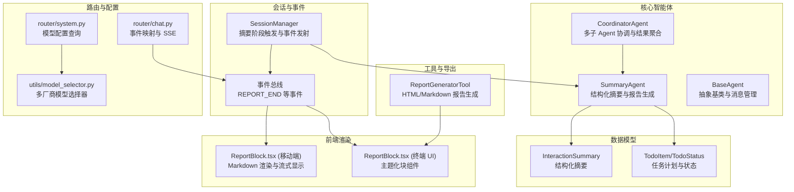
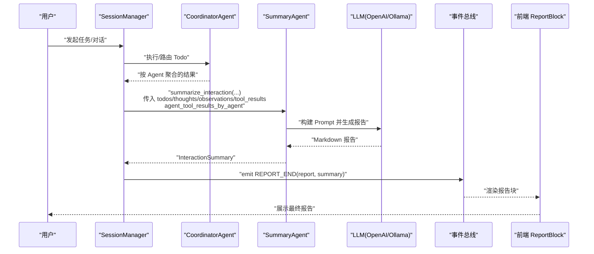
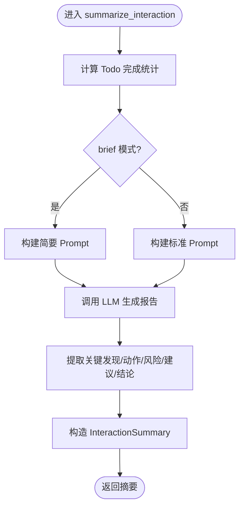
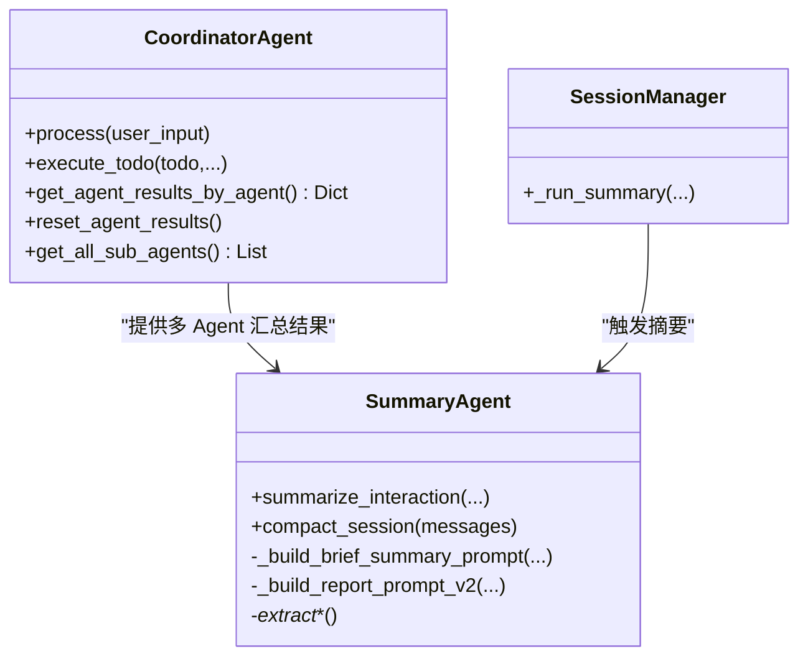
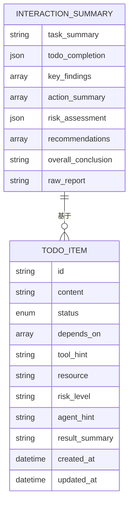
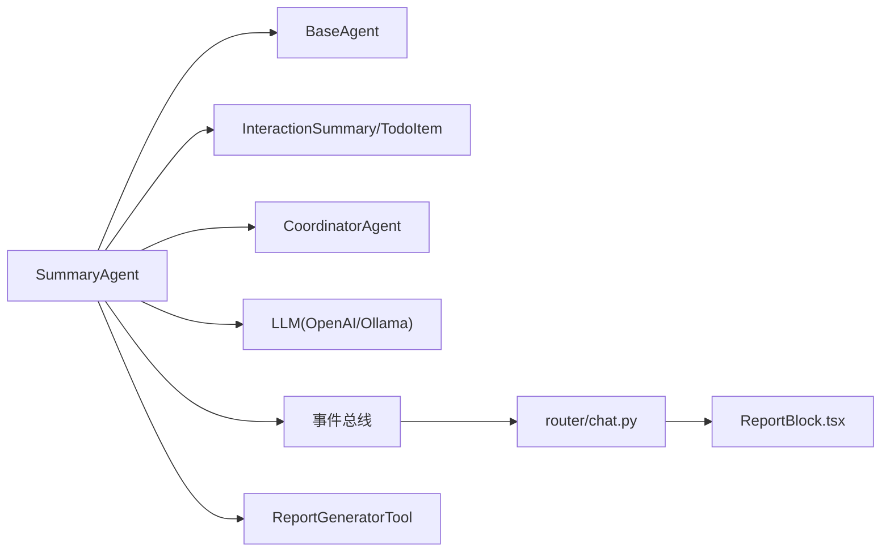

# 总结智能体

<cite>
**本文引用的文件**
- [summary_agent.py](file://core/agents/summary_agent.py)
- [base.py](file://core/agents/base.py)
- [models.py](file://core/models.py)
- [session.py](file://core/session.py)
- [coordinator_agent.py](file://core/agents/coordinator_agent.py)
- [ReportBlock.tsx（终端 UI）](file://terminal-ui/src/components/blocks/ReportBlock.tsx)
- [ReportBlock.tsx（移动端 UI）](file://app/src/components/ReportBlock.tsx)
- [report_generator_tool.py](file://tools/reporting/report_generator_tool.py)
- [chat.py](file://router/chat.py)
- [system.py](file://router/system.py)
- [model_selector.py](file://utils/model_selector.py)
</cite>

## 目录
1. [引言](#引言)
2. [项目结构](#项目结构)
3. [核心组件](#核心组件)
4. [架构总览](#架构总览)
5. [详细组件分析](#详细组件分析)
6. [依赖分析](#依赖分析)
7. [性能考虑](#性能考虑)
8. [故障排除指南](#故障排除指南)
9. [结论](#结论)
10. [附录](#附录)

## 引言
本文件系统性阐述“总结智能体”在多智能体协作中的关键角色与总结策略，覆盖以下要点：
- 多智能体协作下的结果聚合与结构化输出
- 异构结果的数据格式标准化与信息整合
- 结构化摘要生成机制（报告模板、格式化规则、内容组织）
- 复杂数据分析与洞察提取
- 摘要生成算法（关键信息抽取、冗余过滤、重点突出）
- 场景化定制报告格式
- 使用示例与代码片段路径
- 质量评估与准确性保障机制

## 项目结构
总结智能体位于后端 Python 核心模块，围绕交互摘要、多智能体结果聚合、前端渲染与工具链导出形成闭环。

图表来源
- [summary_agent.py](file://core/agents/summary_agent.py#L53-L106)
- [coordinator_agent.py](file://core/agents/coordinator_agent.py#L40-L96)
- [models.py](file://core/models.py#L85-L101)
- [session.py](file://core/session.py#L499-L521)
- [ReportBlock.tsx（移动端 UI）](file://app/src/components/ReportBlock.tsx#L19-L72)
- [ReportBlock.tsx（终端 UI）](file://terminal-ui/src/components/blocks/ReportBlock.tsx#L15-L27)
- [report_generator_tool.py](file://tools/reporting/report_generator_tool.py#L229-L383)
- [chat.py](file://router/chat.py#L101-L108)
- [system.py](file://router/system.py#L50-L63)
- [model_selector.py](file://utils/model_selector.py#L1-L24)

章节来源
- [summary_agent.py](file://core/agents/summary_agent.py#L53-L106)
- [coordinator_agent.py](file://core/agents/coordinator_agent.py#L40-L96)
- [models.py](file://core/models.py#L85-L101)
- [session.py](file://core/session.py#L499-L521)

## 核心组件
- SummaryAgent：负责收集 ReAct 历史、Todo 完成情况、工具执行结果与多 Agent 汇总，生成结构化摘要与 Markdown 报告。
- BaseAgent：提供统一的消息管理、系统提示词与内存接口，支撑多 Agent 一致性。
- InteractionSummary：结构化摘要数据模型，包含任务摘要、完成统计、关键发现、建议、结论与原始报告。
- CoordinatorAgent：在多 Agent 场景下聚合各子 Agent 的工具执行结果，供 SummaryAgent 做跨域汇总。
- 事件与前端：通过事件总线发射 REPORT_END，前端以 ReportBlock 组件渲染 Markdown 报告。
- 报告工具：ReportGeneratorTool 提供 HTML/Markdown 报告导出，适配不同场景。

章节来源
- [summary_agent.py](file://core/agents/summary_agent.py#L53-L106)
- [base.py](file://core/agents/base.py#L17-L34)
- [models.py](file://core/models.py#L85-L101)
- [coordinator_agent.py](file://core/agents/coordinator_agent.py#L187-L196)
- [ReportBlock.tsx（移动端 UI）](file://app/src/components/ReportBlock.tsx#L19-L72)
- [ReportBlock.tsx（终端 UI）](file://terminal-ui/src/components/blocks/ReportBlock.tsx#L15-L27)
- [report_generator_tool.py](file://tools/reporting/report_generator_tool.py#L229-L383)

## 架构总览
总结智能体在多智能体协作中的位置与交互如下：

图表来源
- [session.py](file://core/session.py#L499-L521)
- [summary_agent.py](file://core/agents/summary_agent.py#L111-L182)
- [coordinator_agent.py](file://core/agents/coordinator_agent.py#L187-L196)
- [chat.py](file://router/chat.py#L101-L108)
- [ReportBlock.tsx（移动端 UI）](file://app/src/components/ReportBlock.tsx#L19-L72)
- [ReportBlock.tsx（终端 UI）](file://terminal-ui/src/components/blocks/ReportBlock.tsx#L15-L27)

## 详细组件分析

### SummaryAgent：结构化摘要与报告生成
- 职责
  - 收集 ReAct 历史（thoughts/observations）、Todo 完成情况、工具执行结果与多 Agent 汇总
  - 生成结构化摘要与 Markdown 报告
  - 会话压缩（compact）
- 关键接口
  - summarize_interaction：主入口，支持 brief 模式与多 Agent 汇总
  - process：向后兼容的旧接口
  - compact_session：压缩最近对话为上下文摘要
- Prompt 构建策略
  - 简要模式：聚焦“做了什么、完成情况、主要结论”，包含失败工具与子 Agent 概览
  - 标准模式：按固定 Markdown 模板输出，包含任务总结、Todo 完成情况、关键发现、风险评估（技术类）、建议、结论、失败工具等
- 结构化提取
  - 关键发现：过滤错误/失败文本，截断过长内容，限制数量
  - 动作摘要：从工具结果提取“工具: 成功/失败”
  - 风险评估：启发式统计“高/中/低”关键词出现频次
  - 建议与结论：基于报告文本的启发式抽取
- LLM 选择与降级
  - 支持 DeepSeek/OpenAI 与 Ollama，失败时返回兜底报告

图表来源
- [summary_agent.py](file://core/agents/summary_agent.py#L111-L182)
- [summary_agent.py](file://core/agents/summary_agent.py#L280-L351)
- [summary_agent.py](file://core/agents/summary_agent.py#L353-L504)
- [summary_agent.py](file://core/agents/summary_agent.py#L540-L611)

章节来源
- [summary_agent.py](file://core/agents/summary_agent.py#L111-L182)
- [summary_agent.py](file://core/agents/summary_agent.py#L280-L351)
- [summary_agent.py](file://core/agents/summary_agent.py#L353-L504)
- [summary_agent.py](file://core/agents/summary_agent.py#L540-L611)

### 多智能体协作与结果聚合
- 协调器职责
  - 将 Todo 路由至专用子 Agent（网络/Web/OSINT/终端/防御）
  - 按 Agent 维度聚合工具执行结果，供 SummaryAgent 做跨域汇总
- 聚合接口
  - get_agent_results_by_agent：返回按 Agent 分组的执行结果
  - reset_agent_results：在新交互开始前清空聚合缓存
- 会话管理集成
  - SessionManager 在摘要阶段读取 ReAct 历史与多 Agent 汇总，调用 SummaryAgent 生成最终报告

图表来源
- [coordinator_agent.py](file://core/agents/coordinator_agent.py#L187-L200)
- [summary_agent.py](file://core/agents/summary_agent.py#L111-L182)
- [session.py](file://core/session.py#L499-L521)

章节来源
- [coordinator_agent.py](file://core/agents/coordinator_agent.py#L187-L200)
- [session.py](file://core/session.py#L499-L521)

### 数据模型与结构化输出
- InteractionSummary：统一的摘要数据结构，包含任务摘要、完成统计、关键发现、动作摘要、风险评估、建议、结论与原始报告
- TodoItem/TodoStatus：任务计划与状态枚举，支持完成/进行中/取消
- 输出格式
  - Markdown 模板化报告（标题、分节、表格、列表）
  - 前端以 ReportBlock 组件渲染，支持流式闪烁光标与完成态边框

图表来源
- [models.py](file://core/models.py#L85-L101)
- [models.py](file://core/models.py#L23-L59)

章节来源
- [models.py](file://core/models.py#L85-L101)
- [models.py](file://core/models.py#L23-L59)

### 前端渲染与事件桥接
- 事件映射
  - REPORT_END 事件映射为 "report"，携带 content 与 agent
- 前端组件
  - 移动端：ReportBlock.tsx 支持流式闪烁与 Markdown 渲染
  - 终端 UI：ReportBlock.tsx 使用主题色与强调边框
- 路由与 SSE
  - router/chat.py 将事件转换为 SSE 推送
  - router/system.py 提供模型配置查询，配合 model_selector.py 选择后端

章节来源
- [chat.py](file://router/chat.py#L101-L108)
- [ReportBlock.tsx（移动端 UI）](file://app/src/components/ReportBlock.tsx#L19-L72)
- [ReportBlock.tsx（终端 UI）](file://terminal-ui/src/components/blocks/ReportBlock.tsx#L15-L27)
- [system.py](file://router/system.py#L50-L63)
- [model_selector.py](file://utils/model_selector.py#L1-L24)

### 报告导出与定制化格式
- ReportGeneratorTool
  - 支持 markdown/html/json/pentest 等多种格式
  - 渗透测试报告包含攻击链、漏洞详情、修复建议汇总等
- 与前端联动
  - 终端 UI 的 ReportBlock.tsx 可直接渲染工具生成的 Markdown/HTML

章节来源
- [report_generator_tool.py](file://tools/reporting/report_generator_tool.py#L229-L383)
- [ReportBlock.tsx（终端 UI）](file://terminal-ui/src/components/blocks/ReportBlock.tsx#L15-L27)

## 依赖分析
- 组件耦合
  - SummaryAgent 依赖 BaseAgent 的消息管理与系统提示词
  - SessionManager 在摘要阶段依赖 CoordinatorAgent 的多 Agent 汇总
  - 前端通过事件总线与路由层解耦
- 外部依赖
  - LLM 提供商：OpenAI/DashScope/Ollama
  - 前端渲染：React Native 与 Ink 组件
  - 工具链：报告生成、系统配置查询

图表来源
- [summary_agent.py](file://core/agents/summary_agent.py#L53-L106)
- [base.py](file://core/agents/base.py#L17-L34)
- [models.py](file://core/models.py#L85-L101)
- [coordinator_agent.py](file://core/agents/coordinator_agent.py#L187-L196)
- [chat.py](file://router/chat.py#L101-L108)
- [ReportBlock.tsx（移动端 UI）](file://app/src/components/ReportBlock.tsx#L19-L72)
- [report_generator_tool.py](file://tools/reporting/report_generator_tool.py#L229-L383)

章节来源
- [summary_agent.py](file://core/agents/summary_agent.py#L53-L106)
- [base.py](file://core/agents/base.py#L17-L34)
- [models.py](file://core/models.py#L85-L101)
- [coordinator_agent.py](file://core/agents/coordinator_agent.py#L187-L196)
- [chat.py](file://router/chat.py#L101-L108)
- [ReportBlock.tsx（移动端 UI）](file://app/src/components/ReportBlock.tsx#L19-L72)
- [report_generator_tool.py](file://tools/reporting/report_generator_tool.py#L229-L383)

## 性能考虑
- Prompt 构建与 LLM 调用
  - 控制输入长度（截断过长观察结果），减少 Token 消耗
  - 简要模式优先用于最终报告，降低生成成本
- 多 Agent 汇总
  - 仅在需要时启用，避免不必要的聚合开销
- 前端渲染
  - 流式渲染与闪烁光标仅在 streaming 时启用，减少 UI 渲染压力
- LLM 选择
  - 根据配置选择合适提供商与模型，必要时使用本地 Ollama 降低延迟

## 故障排除指南
- LLM 不可用
  - 摘要阶段捕获异常并返回兜底报告，确保流程不中断
- 多 Agent 汇总失败
  - SessionManager 对获取聚合结果进行 try/catch 并记录警告，不影响主流程
- 前端不显示报告
  - 检查事件是否正确映射为 "report"，确认 SSE 连接与前端组件渲染逻辑

章节来源
- [summary_agent.py](file://core/agents/summary_agent.py#L524-L538)
- [session.py](file://core/session.py#L490-L498)
- [chat.py](file://router/chat.py#L101-L108)

## 结论
总结智能体通过结构化摘要与模板化报告，有效串联多智能体协作中的异构结果，提供统一的最终呈现。其设计兼顾灵活性与稳定性：既支持简要模式的快速反馈，也支持技术类报告的深度分析；既能在 LLM 可用时生成高质量报告，也能在异常情况下提供兜底输出。结合前端渲染与工具导出，满足不同场景下的报告需求。

## 附录

### 使用示例与代码片段路径
- 生成最终报告（简要模式）
  - 路径：[session.py](file://core/session.py#L499-L508)
  - 关键点：传入 brief=True，自动触发 SummaryAgent 的简要 Prompt 构建与报告生成
- 生成完整技术报告
  - 路径：[summary_agent.py](file://core/agents/summary_agent.py#L155-L163)
  - 关键点：标准 Prompt 包含任务总结、Todo 完成情况、关键发现、风险评估、建议、结论与失败工具
- 多 Agent 汇总
  - 路径：[coordinator_agent.py](file://core/agents/coordinator_agent.py#L187-L196)
  - 关键点：get_agent_results_by_agent 返回按 Agent 分组的执行结果
- 前端渲染报告
  - 路径：[ReportBlock.tsx（移动端 UI）](file://app/src/components/ReportBlock.tsx#L19-L72)、[ReportBlock.tsx（终端 UI）](file://terminal-ui/src/components/blocks/ReportBlock.tsx#L15-L27)
  - 关键点：支持流式闪烁与 Markdown 渲染
- 报告导出
  - 路径：[report_generator_tool.py](file://tools/reporting/report_generator_tool.py#L229-L383)
  - 关键点：支持多种格式（markdown/html/json/pentest）

### 质量评估与准确性保障机制
- 结构化摘要字段约束
  - 通过 InteractionSummary 数据模型确保输出字段完整性
- 关键信息抽取与过滤
  - 基于启发式规则抽取风险等级与建议，限制数量与长度
- LLM 降级与兜底
  - 摘要阶段异常捕获与兜底报告，保证流程连续性
- 事件驱动与前端验证
  - 通过事件总线与前端组件验证最终报告的正确呈现

章节来源
- [models.py](file://core/models.py#L85-L101)
- [summary_agent.py](file://core/agents/summary_agent.py#L565-L611)
- [summary_agent.py](file://core/agents/summary_agent.py#L524-L538)
- [chat.py](file://router/chat.py#L101-L108)
- [ReportBlock.tsx（移动端 UI）](file://app/src/components/ReportBlock.tsx#L19-L72)
- [ReportBlock.tsx（终端 UI）](file://terminal-ui/src/components/blocks/ReportBlock.tsx#L15-L27)