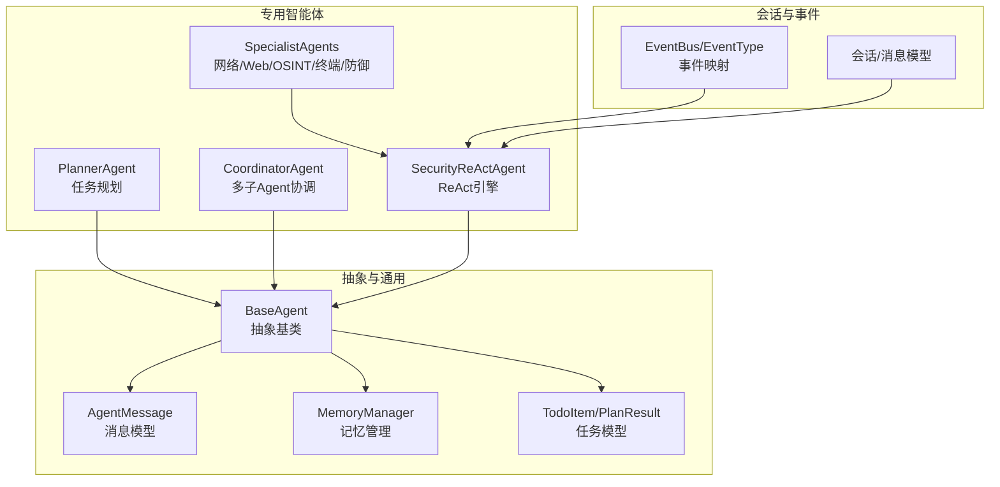
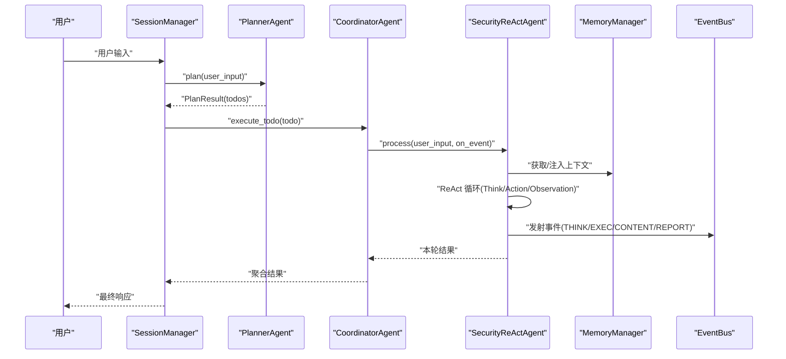
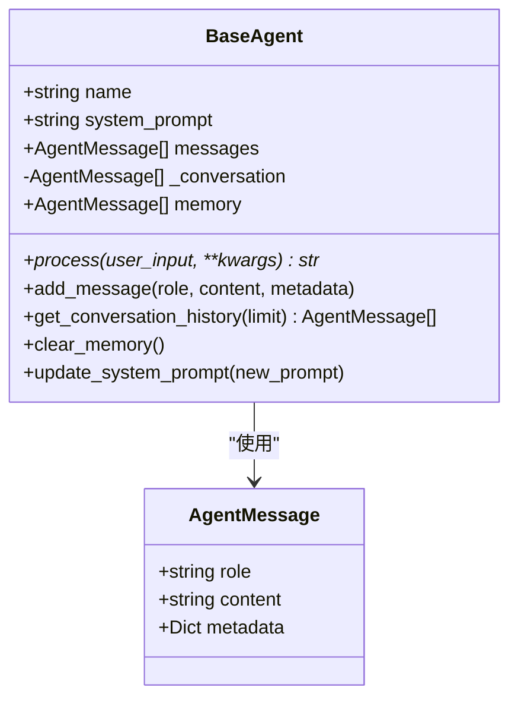
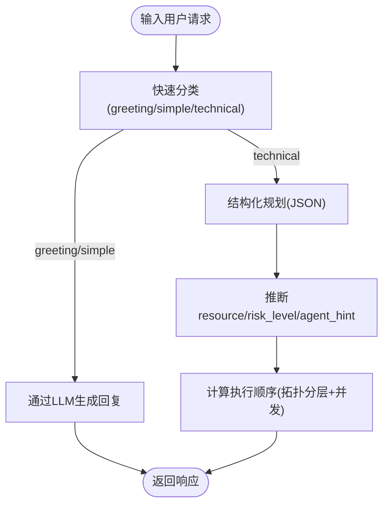
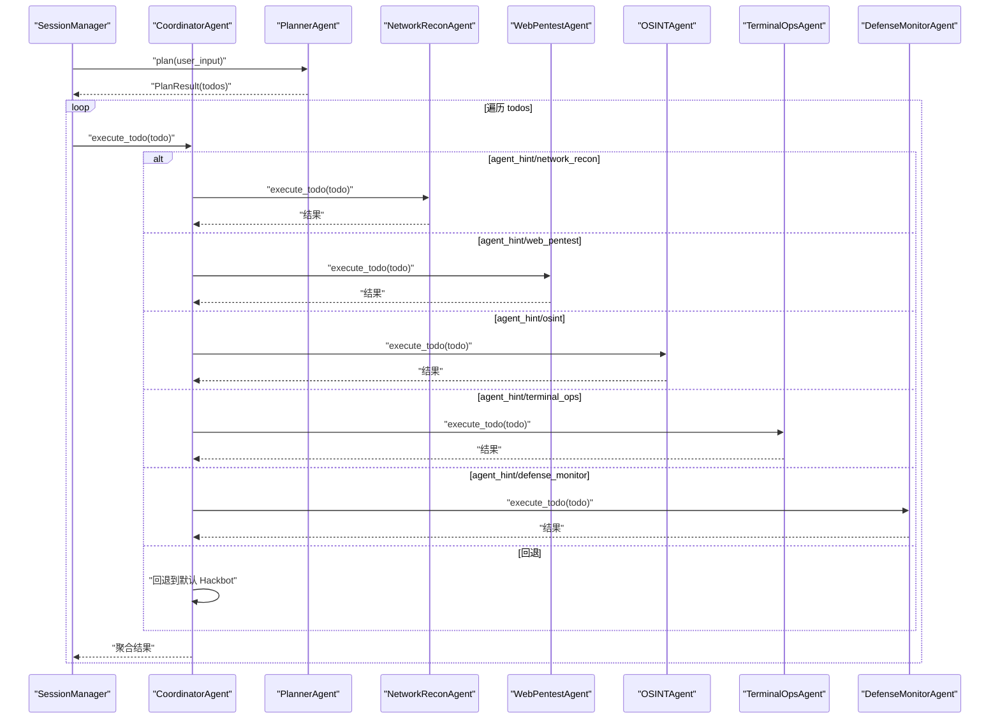
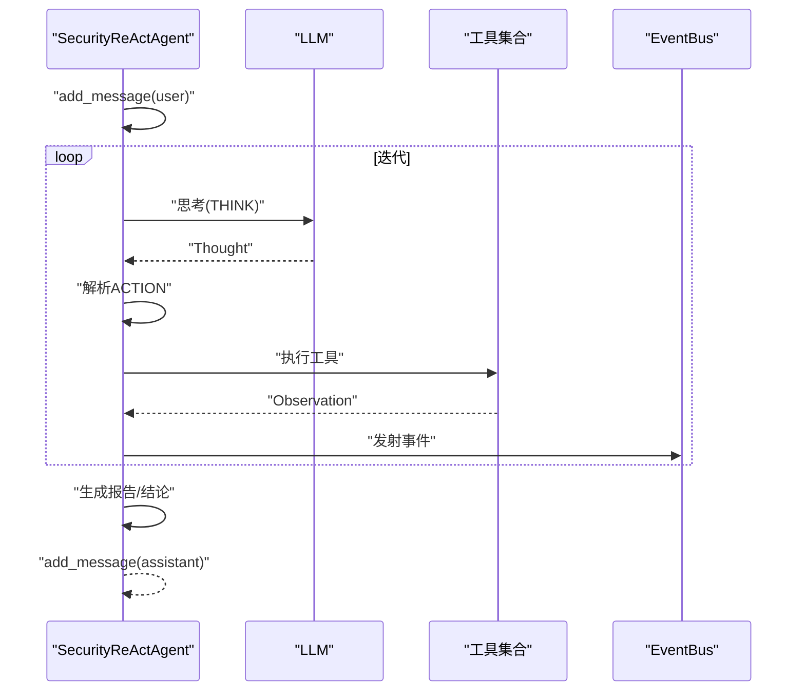
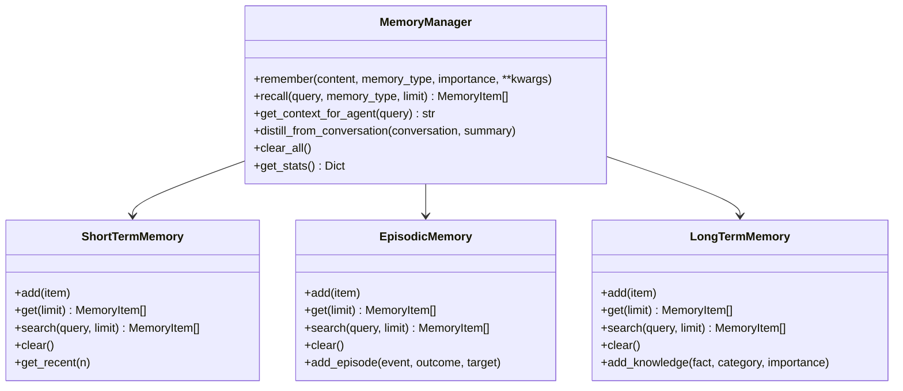
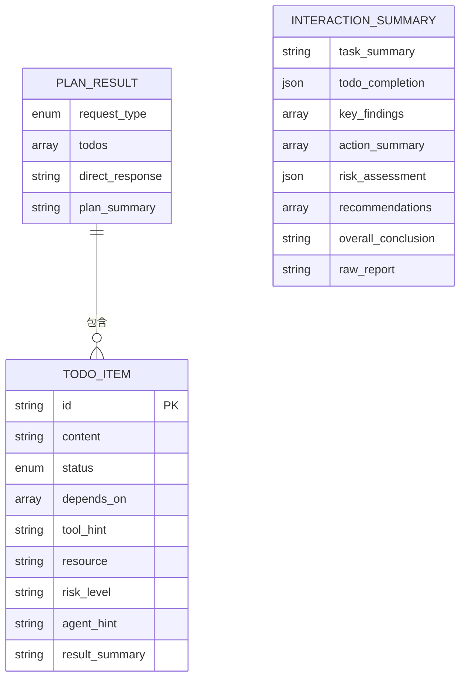
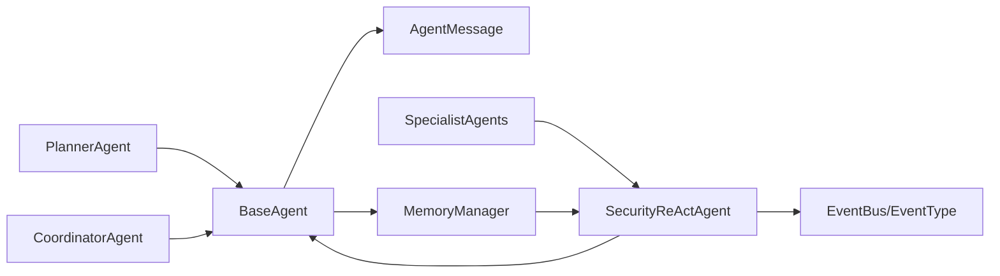

# 智能体基础架构

<cite>
**本文引用的文件**
- [core/agents/base.py](file://core/agents/base.py)
- [core/agents/coordinator_agent.py](file://core/agents/coordinator_agent.py)
- [core/agents/planner_agent.py](file://core/agents/planner_agent.py)
- [core/agents/specialist_agents.py](file://core/agents/specialist_agents.py)
- [core/patterns/security_react.py](file://core/patterns/security_react.py)
- [core/memory/manager.py](file://core/memory/manager.py)
- [core/models.py](file://core/models.py)
- [router/chat.py](file://router/chat.py)
- [app/src/types/index.ts](file://app/src/types/index.ts)
- [tests/test_interactive_response.py](file://tests/test_interactive_response.py)
</cite>

## 目录
1. [简介](#简介)
2. [项目结构](#项目结构)
3. [核心组件](#核心组件)
4. [架构总览](#架构总览)
5. [详细组件分析](#详细组件分析)
6. [依赖关系分析](#依赖关系分析)
7. [性能考量](#性能考量)
8. [故障排查指南](#故障排查指南)
9. [结论](#结论)
10. [附录](#附录)

## 简介
本文件系统性梳理 Secbot 智能体基础架构，围绕 BaseAgent 抽象类展开，深入解析其设计理念、消息模型 AgentMessage、生命周期管理、系统提示词机制、消息与记忆管理策略、抽象方法 process 的实现要求与扩展方式，并提供可操作的自定义智能体示例路径与最佳实践。

## 项目结构
Secbot 的智能体体系采用“抽象基类 + 多种具体实现”的分层设计：
- 基础抽象层：BaseAgent 定义统一的消息模型、系统提示词、对话历史与记忆接口。
- 专用智能体层：PlannerAgent、CoordinatorAgent、各类 SpecialistAgent（网络/Web/OSINT/终端/防御）等。
- ReAct 引擎层：SecurityReActAgent 提供思考-行动-观察的循环执行框架。
- 记忆管理层：MemoryManager 提供短期/情节/长期三层记忆存储与检索。
- 会话与事件层：Session/Message 模型与 EventBus 事件映射，支撑前端 TUI 与后端编排。

图表来源
- [core/agents/base.py](file://core/agents/base.py#L10-L125)
- [core/agents/planner_agent.py](file://core/agents/planner_agent.py#L20-L80)
- [core/agents/coordinator_agent.py](file://core/agents/coordinator_agent.py#L40-L97)
- [core/agents/specialist_agents.py](file://core/agents/specialist_agents.py#L32-L236)
- [core/patterns/security_react.py](file://core/patterns/security_react.py#L142-L190)
- [core/memory/manager.py](file://core/memory/manager.py#L223-L325)
- [core/models.py](file://core/models.py#L23-L137)
- [router/chat.py](file://router/chat.py#L42-L133)

章节来源
- [core/agents/base.py](file://core/agents/base.py#L10-L125)
- [core/agents/planner_agent.py](file://core/agents/planner_agent.py#L20-L80)
- [core/agents/coordinator_agent.py](file://core/agents/coordinator_agent.py#L40-L97)
- [core/agents/specialist_agents.py](file://core/agents/specialist_agents.py#L32-L236)
- [core/patterns/security_react.py](file://core/patterns/security_react.py#L142-L190)
- [core/memory/manager.py](file://core/memory/manager.py#L223-L325)
- [core/models.py](file://core/models.py#L23-L137)
- [router/chat.py](file://router/chat.py#L42-L133)

## 核心组件
- AgentMessage：统一的消息结构，包含角色、内容与可选元数据，用于构建对话历史与事件数据。
- BaseAgent：定义系统提示词、消息列表、对话历史、记忆接口与 process 抽象方法，是所有智能体的共同基座。
- MemoryManager：三层记忆（短期/情节/长期）存储与检索，支持会话上下文注入与蒸馏。
- PlannerAgent：任务规划智能体，负责将自然语言请求转化为结构化 TodoList，并提供执行顺序与状态管理。
- CoordinatorAgent：多子Agent协调器，按 Todo 的 agent_hint/resource 将任务路由到专用 Agent，并聚合结果。
- SecurityReActAgent：ReAct 执行引擎，封装 Think -> Action -> Observation 循环，支持工具调用、事件发射与会话摘要。
- 任务模型：TodoItem/PlanResult/InteractionSummary 等，支撑规划、执行与报告生成。

章节来源
- [core/agents/base.py](file://core/agents/base.py#L10-L125)
- [core/memory/manager.py](file://core/memory/manager.py#L223-L325)
- [core/agents/planner_agent.py](file://core/agents/planner_agent.py#L20-L80)
- [core/agents/coordinator_agent.py](file://core/agents/coordinator_agent.py#L40-L97)
- [core/patterns/security_react.py](file://core/patterns/security_react.py#L142-L190)
- [core/models.py](file://core/models.py#L23-L137)

## 架构总览
Secbot 的智能体架构采用“规划-执行-汇总”的流水线：
- PlannerAgent 将用户输入分类并生成结构化 TodoList；
- CoordinatorAgent 根据 Todo 的 agent_hint/resource 路由到专用 Agent；
- SecurityReActAgent 执行 ReAct 循环，调用工具并发射事件；
- MemoryManager 提供记忆注入与蒸馏；
- EventBus/EventType 将 ReAct 思考、行动、观察、报告等事件映射到前端 TUI。

图表来源
- [core/agents/planner_agent.py](file://core/agents/planner_agent.py#L86-L153)
- [core/agents/coordinator_agent.py](file://core/agents/coordinator_agent.py#L130-L182)
- [core/patterns/security_react.py](file://core/patterns/security_react.py#L393-L628)
- [core/memory/manager.py](file://core/memory/manager.py#L270-L309)
- [router/chat.py](file://router/chat.py#L42-L133)

## 详细组件分析

### BaseAgent 抽象类与 AgentMessage 消息模型
- 设计理念
  - 统一的消息模型与系统提示词管理，确保不同智能体的一致性与可替换性。
  - 对话历史与记忆分离：messages 为完整历史，_conversation 为会话级历史，memory 可替换为 MemoryManager。
  - 提供 add_message/get_conversation_history/clear_memory/update_system_prompt 等通用接口。
- AgentMessage 结构
  - role: user/assistant/system
  - content: 文本内容
  - metadata: 可选元数据（如工具调用参数、事件标签等）
- 生命周期管理
  - 初始化：设置 name、system_prompt（默认根据名称推断）、messages/_conversation/memory。
  - 系统提示词：支持默认提示词与动态更新；更新时会同步替换 messages 中的 system 消息。
  - 记忆：默认为列表，可通过外部替换为 MemoryManager；清空时仅清空对话列表，持久记忆由调用方按需处理。
- process 抽象方法
  - 子类必须实现 async def process(self, user_input: str, **kwargs) -> str，用于处理用户输入并返回响应。
  - 建议在实现中维护消息历史、触发事件、调用工具或 LLM，并在结束时将最终响应加入消息历史。

图表来源
- [core/agents/base.py](file://core/agents/base.py#L10-L125)

章节来源
- [core/agents/base.py](file://core/agents/base.py#L10-L125)

### PlannerAgent：任务规划与结构化输出
- 职责
  - 判断请求类型（问候/闲聊/非技术/技术），对技术请求生成结构化 TodoList。
  - 提供执行顺序计算（拓扑分层 + 资源/风险并发控制）、状态更新与查询。
- 关键能力
  - 请求快速分类：基于关键词规则快速判定 greeting/simple/technical。
  - 结构化规划：通过 LLM 生成 JSON 格式的 PlanResult，包含 todos、plan_summary、direct_response。
  - 元数据推断：从 Todo 内容与用户输入推断 resource/risk_level/agent_hint。
  - 并发控制：按资源与风险等级在拓扑层内进行安全并发切分。
- 与 BaseAgent 的关系
  - 继承 BaseAgent，复用消息历史与系统提示词管理。
  - 提供 plan/process 两个接口：前者返回结构化 PlanResult，后者兼容旧版返回纯文本。

图表来源
- [core/agents/planner_agent.py](file://core/agents/planner_agent.py#L86-L153)
- [core/agents/planner_agent.py](file://core/agents/planner_agent.py#L444-L538)
- [core/agents/planner_agent.py](file://core/agents/planner_agent.py#L633-L746)

章节来源
- [core/agents/planner_agent.py](file://core/agents/planner_agent.py#L20-L80)
- [core/agents/planner_agent.py](file://core/agents/planner_agent.py#L86-L153)
- [core/agents/planner_agent.py](file://core/agents/planner_agent.py#L444-L538)
- [core/agents/planner_agent.py](file://core/agents/planner_agent.py#L633-L746)

### CoordinatorAgent：多子Agent协调与路由
- 职责
  - 对外作为 hackbot 智能体被会话管理器调用。
  - 在分层执行模式下，根据 Todo.agent_hint/resource 将单步执行路由到专用子 Agent。
  - 聚合各 Agent 的工具执行结果，供 SummaryAgent 汇总。
- 路由策略
  - 优先使用 Planner 预填的 agent_hint；
  - 其次根据 resource 前缀匹配；
  - 最后依据 tool_hint 关键词兜底；
  - 无法匹配时回退到默认 Hackbot。
- 会话上下文
  - 提供 append_turn_to_session_context，将本轮摘要注入到所有子 Agent 的会话上下文中。

图表来源
- [core/agents/coordinator_agent.py](file://core/agents/coordinator_agent.py#L130-L182)
- [core/agents/coordinator_agent.py](file://core/agents/coordinator_agent.py#L242-L331)

章节来源
- [core/agents/coordinator_agent.py](file://core/agents/coordinator_agent.py#L40-L97)
- [core/agents/coordinator_agent.py](file://core/agents/coordinator_agent.py#L130-L182)
- [core/agents/coordinator_agent.py](file://core/agents/coordinator_agent.py#L242-L331)

### SecurityReActAgent：ReAct 执行引擎
- ReAct 循环
  - THINK：调用 LLM 进行推理；
  - ACTION：解析并执行工具调用；
  - OBSERVATION：格式化工具结果并记录；
  - 重复直到 LLM 输出 Final Answer 或达到最大迭代次数。
- 事件发射与前端集成
  - 通过 _emit_event 将 thought/action_result/observation/report 等事件映射为 EventBus 事件，供 TUI 组件消费。
- 会话摘要
  - append_turn_to_session_context 将本轮摘要注入到会话上下文，供后续轮次参考。

图表来源
- [core/patterns/security_react.py](file://core/patterns/security_react.py#L393-L628)
- [core/patterns/security_react.py](file://core/patterns/security_react.py#L227-L278)

章节来源
- [core/patterns/security_react.py](file://core/patterns/security_react.py#L142-L190)
- [core/patterns/security_react.py](file://core/patterns/security_react.py#L393-L628)
- [core/patterns/security_react.py](file://core/patterns/security_react.py#L227-L278)

### MemoryManager：三层记忆系统
- 三层架构
  - 短期记忆：会话内的上下文缓冲，支持最近 N 条检索与清理。
  - 情节记忆：跨会话的事件与经验，持久化存储，支持按内容检索。
  - 长期记忆：持久化的知识库，支持按类别检索与蒸馏。
- 上下文注入
  - get_context_for_agent 将短期/情节/长期记忆整合为适合注入 Agent 的上下文字符串。
- 蒸馏与清理
  - distill_from_conversation 从对话中蒸馏摘要为情节记忆；
  - clear_all 清空所有记忆。

图表来源
- [core/memory/manager.py](file://core/memory/manager.py#L223-L325)
- [core/memory/manager.py](file://core/memory/manager.py#L51-L84)
- [core/memory/manager.py](file://core/memory/manager.py#L86-L152)
- [core/memory/manager.py](file://core/memory/manager.py#L154-L221)

章节来源
- [core/memory/manager.py](file://core/memory/manager.py#L223-L325)

### 任务模型与前端事件映射
- 任务模型
  - TodoItem：包含 id/content/status/depends_on/tool_hint/resource/risk_level/agent_hint/result_summary 等。
  - PlanResult：包含 request_type/todos/direct_response/plan_summary。
  - InteractionSummary：单次交互的结构化摘要，供报告生成。
- 前端事件映射
  - router/chat.py 将内部 EventType 映射为前端 SSE 事件名（如 thought_start/thought_chunk/thought/content/report/error 等），便于 TUI 组件渲染。

图表来源
- [core/models.py](file://core/models.py#L23-L101)
- [router/chat.py](file://router/chat.py#L42-L133)

章节来源
- [core/models.py](file://core/models.py#L23-L101)
- [router/chat.py](file://router/chat.py#L42-L133)

## 依赖关系分析
- 组件耦合
  - BaseAgent 与 AgentMessage：强耦合（消息模型）。
  - PlannerAgent/CoordinatorAgent/SecurityReActAgent：均继承 BaseAgent，共享消息与系统提示词管理。
  - CoordinatorAgent 依赖 SpecialistAgents 的具体实现，形成“协调-执行”分层。
  - SecurityReActAgent 依赖工具集合与 EventBus，负责事件发射与会话摘要。
  - MemoryManager 可被任意智能体注入上下文，增强 ReAct 的决策质量。
- 外部依赖
  - LLM 提供商适配（Ollama/OpenAI/Anthropic/Google 等），通过 _create_llm 动态创建实例。
  - EventBus/EventType 用于前后端事件通信。

图表来源
- [core/agents/base.py](file://core/agents/base.py#L10-L125)
- [core/agents/planner_agent.py](file://core/agents/planner_agent.py#L20-L80)
- [core/agents/coordinator_agent.py](file://core/agents/coordinator_agent.py#L40-L97)
- [core/agents/specialist_agents.py](file://core/agents/specialist_agents.py#L32-L236)
- [core/patterns/security_react.py](file://core/patterns/security_react.py#L142-L190)
- [core/memory/manager.py](file://core/memory/manager.py#L223-L325)
- [router/chat.py](file://router/chat.py#L42-L133)

章节来源
- [core/agents/base.py](file://core/agents/base.py#L10-L125)
- [core/agents/planner_agent.py](file://core/agents/planner_agent.py#L20-L80)
- [core/agents/coordinator_agent.py](file://core/agents/coordinator_agent.py#L40-L97)
- [core/agents/specialist_agents.py](file://core/agents/specialist_agents.py#L32-L236)
- [core/patterns/security_react.py](file://core/patterns/security_react.py#L142-L190)
- [core/memory/manager.py](file://core/memory/manager.py#L223-L325)
- [router/chat.py](file://router/chat.py#L42-L133)

## 性能考量
- ReAct 迭代上限：max_iterations 控制循环次数，避免长时间运行。
- 并发控制：同一智能体同一时间只处理一个核心任务，请求自动排队，降低资源竞争。
- 事件发射：通过 EventBus 异步推送，避免阻塞主流程。
- 记忆检索：短期记忆使用双端队列，情节/长期记忆采用文件持久化，注意 I/O 开销。
- LLM 调用：提供超时与回退策略，减少因网络波动导致的失败。

## 故障排查指南
- LLM 连接失败
  - 现象：ReAct 过程中 LLM 调用失败或超时。
  - 处理：检查提供商配置、API Key、Base URL；查看 get_llm_connection_hint 提示；必要时切换模型或提供商。
- 工具不可用
  - 现象：工具不存在或执行失败。
  - 处理：确认 tools_dict 是否正确注入；检查工具敏感度与执行权限；查看工具返回的 error 字段。
- 事件未到达前端
  - 现象：TUI 无 ReAct 思考/行动/观察/报告。
  - 处理：确认 EventBus 配置与事件映射；检查 _emit_event 的 payload 是否包含 agent 字段；核对 router/chat.py 的事件映射。
- 记忆未生效
  - 现象：上下文未包含记忆。
  - 处理：确认 MemoryManager 已注入；检查 get_context_for_agent 的调用时机；核对记忆类型与检索条件。

章节来源
- [core/patterns/security_react.py](file://core/patterns/security_react.py#L319-L339)
- [core/patterns/security_react.py](file://core/patterns/security_react.py#L340-L390)
- [router/chat.py](file://router/chat.py#L42-L133)
- [core/memory/manager.py](file://core/memory/manager.py#L270-L298)

## 结论
Secbot 的智能体基础架构以 BaseAgent 为核心，结合 Planner/Coordinator/ReAct 引擎与三层记忆系统，形成了从“规划-执行-汇总”的完整闭环。通过统一的消息模型、系统提示词管理与事件驱动的前端集成，实现了高度可扩展与可维护的智能体体系。建议在扩展新智能体时遵循 BaseAgent 的抽象契约，合理使用 MemoryManager 注入上下文，并通过 EventBus 保证前后端一致的交互体验。

## 附录

### 自定义智能体示例路径与最佳实践
- 继承 BaseAgent 创建自定义智能体
  - 示例路径：[core/agents/base.py](file://core/agents/base.py#L17-L89)
  - 要点：实现 async def process(self, user_input: str, **kwargs) -> str；在构造函数中设置 name 与 system_prompt；使用 self.add_message 记录对话历史。
- 定制系统提示词
  - 示例路径：[core/agents/base.py](file://core/agents/base.py#L20-L34)、[core/agents/base.py](file://core/agents/base.py#L111-L122)
  - 要点：可通过 update_system_prompt 动态更新；默认根据名称推断提示词。
- 消息处理与事件发射
  - 示例路径：[core/patterns/security_react.py](file://core/patterns/security_react.py#L227-L278)
  - 要点：使用 _emit_event 触发 thought/action_result/observation/report 等事件；确保 payload 包含 agent 字段。
- 记忆系统集成
  - 示例路径：[core/memory/manager.py](file://core/memory/manager.py#L270-L298)
  - 要点：在 ReAct 循环中调用 get_context_for_agent 注入上下文；必要时通过 distill_from_conversation 蒸馏摘要。
- 前端事件映射
  - 示例路径：[router/chat.py](file://router/chat.py#L42-L133)
  - 要点：确认 EventType 与前端事件名的映射关系，保证 TUI 正常渲染。

章节来源
- [core/agents/base.py](file://core/agents/base.py#L17-L89)
- [core/agents/base.py](file://core/agents/base.py#L20-L34)
- [core/agents/base.py](file://core/agents/base.py#L111-L122)
- [core/patterns/security_react.py](file://core/patterns/security_react.py#L227-L278)
- [core/memory/manager.py](file://core/memory/manager.py#L270-L298)
- [router/chat.py](file://router/chat.py#L42-L133)