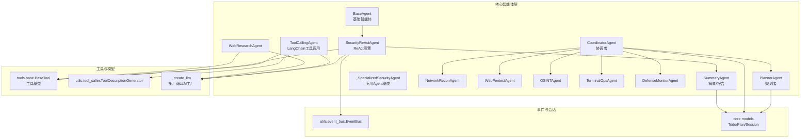
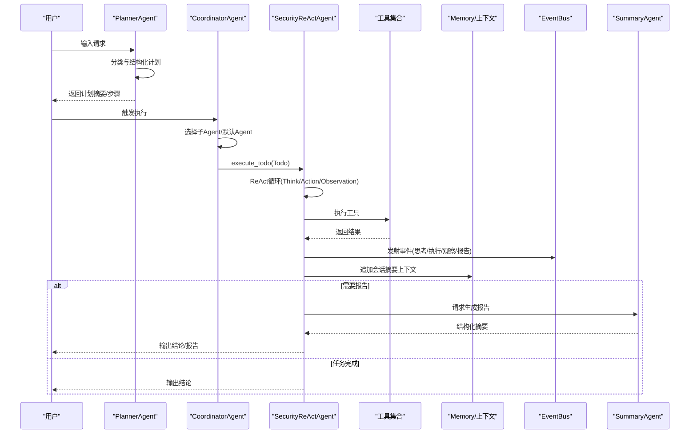
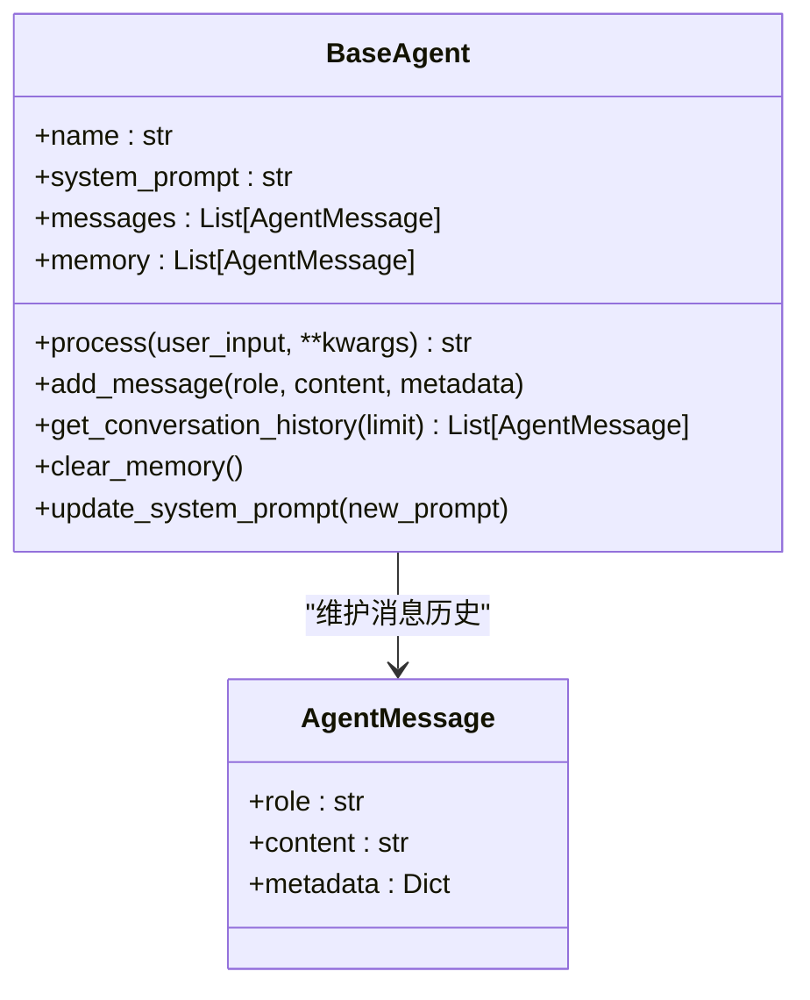
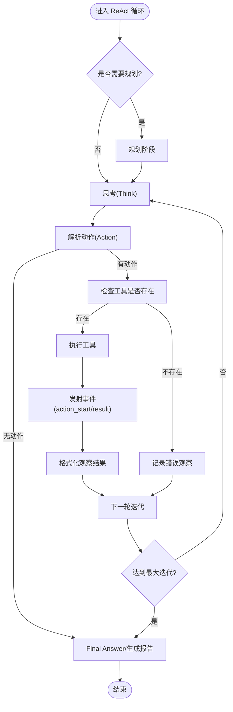
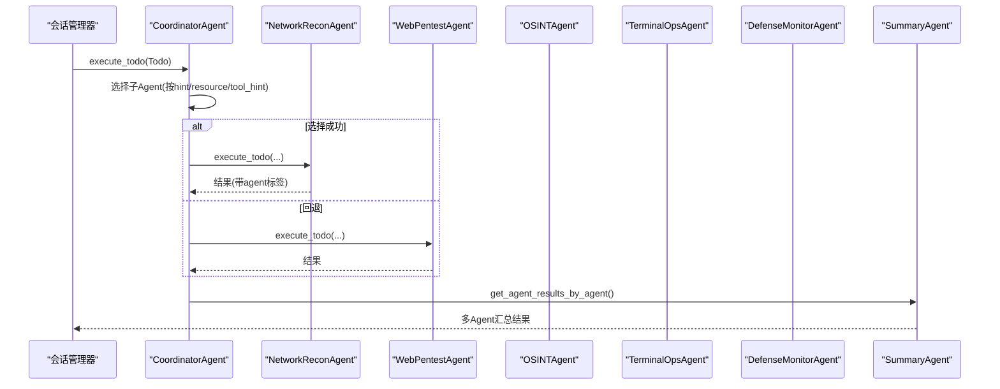
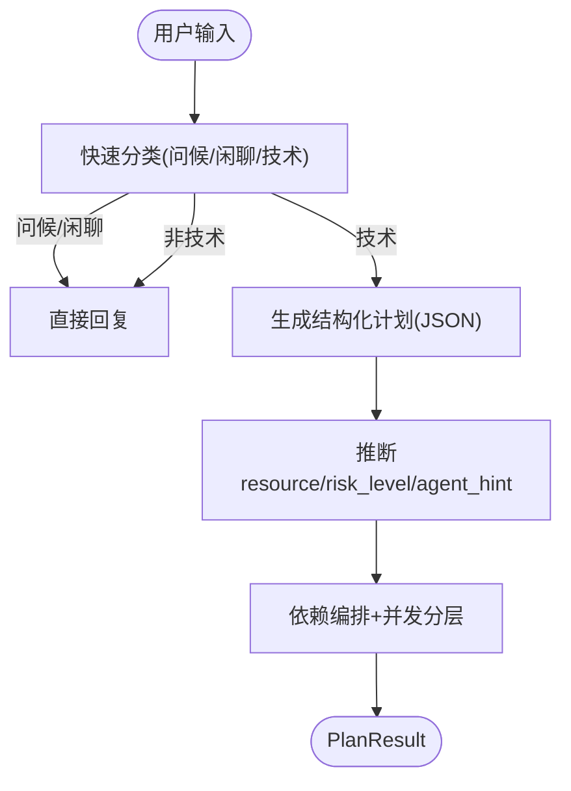
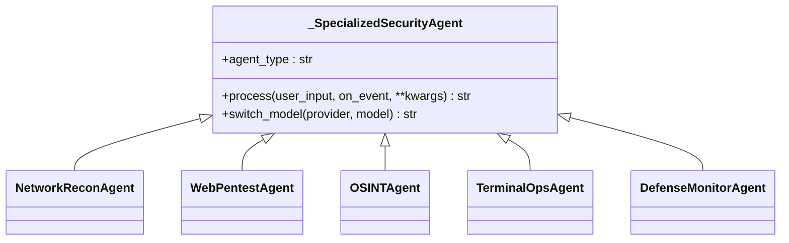
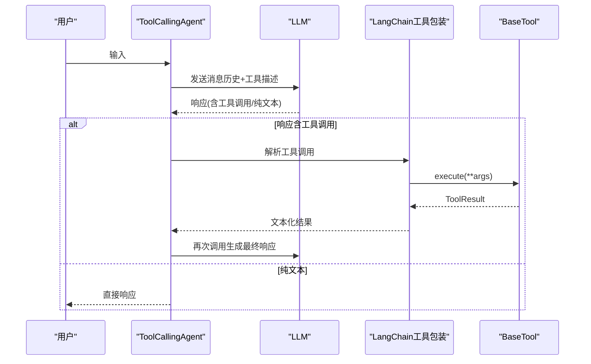
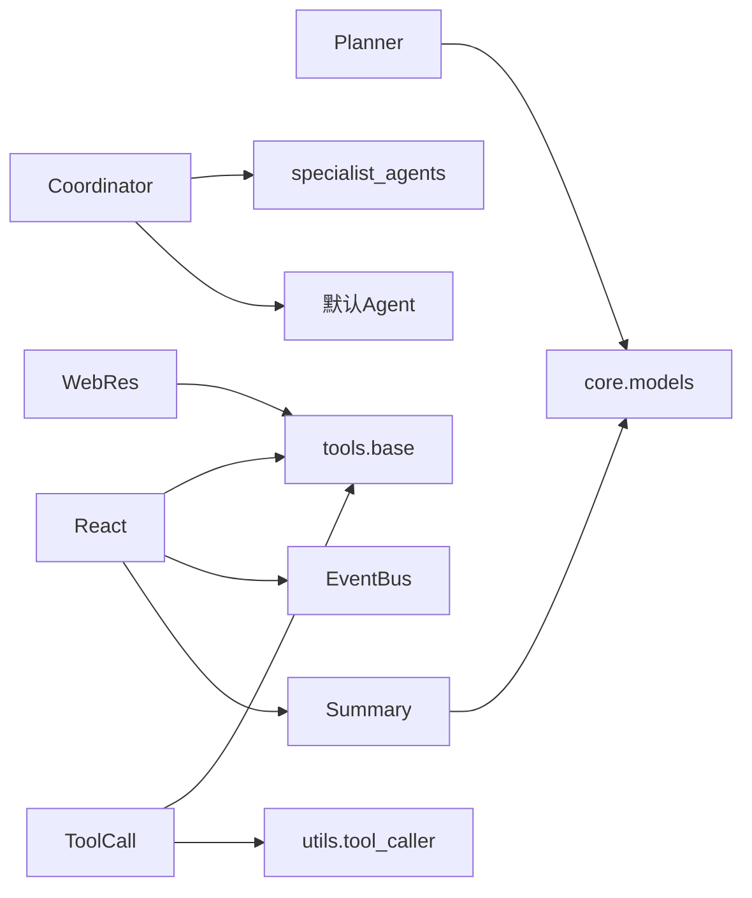

# 智能体系统

<cite>
**本文引用的文件**
- [core/agents/base.py](file://core/agents/base.py)
- [core/agents/coordinator_agent.py](file://core/agents/coordinator_agent.py)
- [core/agents/planner_agent.py](file://core/agents/planner_agent.py)
- [core/agents/specialist_agents.py](file://core/agents/specialist_agents.py)
- [core/agents/tool_calling_agent.py](file://core/agents/tool_calling_agent.py)
- [core/agents/web_research_agent.py](file://core/agents/web_research_agent.py)
- [core/agents/summary_agent.py](file://core/agents/summary_agent.py)
- [core/patterns/security_react.py](file://core/patterns/security_react.py)
- [core/models.py](file://core/models.py)
- [utils/event_bus.py](file://utils/event_bus.py)
- [tools/base.py](file://tools/base.py)
- [utils/tool_caller.py](file://utils/tool_caller.py)
- [hackbot/cli.py](file://hackbot/cli.py)
- [main.py](file://main.py)
</cite>

## 目录
1. [引言](#引言)
2. [项目结构](#项目结构)
3. [核心组件](#核心组件)
4. [架构总览](#架构总览)
5. [详细组件分析](#详细组件分析)
6. [依赖分析](#依赖分析)
7. [性能考虑](#性能考虑)
8. [故障排除指南](#故障排除指南)
9. [结论](#结论)
10. [附录](#附录)

## 引言
本文件面向Secbot智能体系统，提供从架构设计到实现细节的全面技术文档。重点涵盖：
- 基础智能体类与事件处理机制、生命周期管理
- 各类智能体职责与工作机制：协调者、规划者、专用子Agent、工具调用Agent、Web研究Agent、总结Agent
- 智能体协作模式、通信机制与结果聚合策略
- ReAct模式应用、工具调用机制、记忆与上下文处理
- 扩展与定制指南：如何开发新智能体类型与集成新工具
- 具体使用场景与流程示意

## 项目结构
Secbot采用“智能体 + 工具 + 事件总线”的分层架构，核心位于core目录，前端与后端通过FastAPI接口对接，终端TUI提供交互体验。

图示来源
- [core/agents/base.py](file://core/agents/base.py#L17-L125)
- [core/patterns/security_react.py](file://core/patterns/security_react.py#L142-L800)
- [core/agents/coordinator_agent.py](file://core/agents/coordinator_agent.py#L40-L335)
- [core/agents/planner_agent.py](file://core/agents/planner_agent.py#L20-L800)
- [core/agents/specialist_agents.py](file://core/agents/specialist_agents.py#L32-L247)
- [core/agents/tool_calling_agent.py](file://core/agents/tool_calling_agent.py#L75-L506)
- [core/agents/web_research_agent.py](file://core/agents/web_research_agent.py#L52-L372)
- [core/agents/summary_agent.py](file://core/agents/summary_agent.py#L53-L628)
- [tools/base.py](file://tools/base.py#L16-L36)
- [utils/tool_caller.py](file://utils/tool_caller.py#L10-L119)
- [utils/event_bus.py](file://utils/event_bus.py#L68-L187)
- [core/models.py](file://core/models.py#L23-L137)

章节来源
- [main.py](file://main.py#L44-L52)
- [hackbot/cli.py](file://hackbot/cli.py#L32-L80)

## 核心组件
- 基础智能体类 BaseAgent：统一的消息历史、系统提示词、对话记忆与生命周期管理
- ReAct引擎 SecurityReActAgent：Think -> Action -> Observation -> ... -> Final Answer 的自动化推理循环，支持自动/手动确认两种模式
- 协调者 CoordinatorAgent：A2A入口，将任务路由至专用子Agent，聚合工具执行结果
- 规划者 PlannerAgent：请求分类、结构化计划生成、依赖编排与并发控制
- 专用子Agent：网络侦察、Web渗透、OSINT、终端操作、防御监控
- 工具调用Agent：LangChain集成，工具描述注入与工具调用回退策略
- Web研究Agent：独立ReAct循环，专用于联网信息收集
- 摘要Agent：结构化交互摘要、风险评估、报告生成与会话压缩
- 事件总线 EventBus：解耦智能体与UI，事件驱动TUI反馈
- 工具基类 BaseTool 与描述生成器 ToolDescriptionGenerator：标准化工具接口与提示词注入

章节来源
- [core/agents/base.py](file://core/agents/base.py#L17-L125)
- [core/patterns/security_react.py](file://core/patterns/security_react.py#L142-L800)
- [core/agents/coordinator_agent.py](file://core/agents/coordinator_agent.py#L40-L335)
- [core/agents/planner_agent.py](file://core/agents/planner_agent.py#L20-L800)
- [core/agents/specialist_agents.py](file://core/agents/specialist_agents.py#L32-L247)
- [core/agents/tool_calling_agent.py](file://core/agents/tool_calling_agent.py#L75-L506)
- [core/agents/web_research_agent.py](file://core/agents/web_research_agent.py#L52-L372)
- [core/agents/summary_agent.py](file://core/agents/summary_agent.py#L53-L628)
- [utils/event_bus.py](file://utils/event_bus.py#L68-L187)
- [tools/base.py](file://tools/base.py#L16-L36)
- [utils/tool_caller.py](file://utils/tool_caller.py#L10-L119)

## 架构总览
Secbot采用“规划-执行-汇总”的流水线式交互架构：
- Planner负责请求分类与结构化计划生成
- Coordinator将Todo路由到专用子Agent或默认Agent
- SecurityReActAgent驱动ReAct循环，自动/手动执行工具
- SummaryAgent在必要时生成报告
- EventBus贯穿全程，驱动UI事件流

图示来源
- [core/agents/planner_agent.py](file://core/agents/planner_agent.py#L86-L153)
- [core/agents/coordinator_agent.py](file://core/agents/coordinator_agent.py#L130-L182)
- [core/patterns/security_react.py](file://core/patterns/security_react.py#L393-L628)
- [core/agents/summary_agent.py](file://core/agents/summary_agent.py#L111-L182)
- [utils/event_bus.py](file://utils/event_bus.py#L68-L187)

## 详细组件分析

### 基础智能体类 BaseAgent
- 职责：统一消息历史、系统提示词、对话记忆与生命周期管理
- 关键特性：
  - 消息模型 AgentMessage：role/content/metadata
  - 默认系统提示词策略（含m-bot安全提示）
  - 对话历史与记忆管理（可替换为MemoryManager）
  - 动态更新系统提示词
- 生命周期：初始化、消息添加、历史获取、清空记忆、更新提示词

图示来源
- [core/agents/base.py](file://core/agents/base.py#L17-L125)

章节来源
- [core/agents/base.py](file://core/agents/base.py#L17-L125)

### ReAct引擎 SecurityReActAgent
- 职责：ReAct循环、工具调用、事件发射、会话上下文摘要、自动/手动确认
- 关键流程：
  - 规划阶段（可跳过）
  - Think：生成推理内容
  - Action：解析并执行工具
  - Observation：格式化工具结果
  - Final Answer：生成结论或触发报告
  - 事件发射：planning/thought/action_start/action_result/observation/report/error
- 并发控制：每个智能体实例串行处理核心任务
- 模型切换：支持多厂商LLM工厂

图示来源
- [core/patterns/security_react.py](file://core/patterns/security_react.py#L393-L628)

章节来源
- [core/patterns/security_react.py](file://core/patterns/security_react.py#L142-L800)

### 协调者智能体 CoordinatorAgent
- 职责：对外作为“hackbot”被会话管理器/路由调用；在分层执行模式下将Todo路由到专用子Agent；聚合工具执行结果供SummaryAgent汇总
- 路由策略：agent_hint/resource/tool_hint三路匹配，兜底回退默认Agent
- 结果聚合：按agent维度收集工具执行结果
- 会话上下文：为所有子Agent追加摘要式上下文

图示来源
- [core/agents/coordinator_agent.py](file://core/agents/coordinator_agent.py#L130-L213)
- [core/agents/specialist_agents.py](file://core/agents/specialist_agents.py#L32-L247)
- [core/agents/summary_agent.py](file://core/agents/summary_agent.py#L180-L182)

章节来源
- [core/agents/coordinator_agent.py](file://core/agents/coordinator_agent.py#L40-L335)

### 规划智能体 PlannerAgent
- 职责：请求分类（问候/闲聊/非技术/技术）、结构化计划生成、依赖编排、并发控制、状态追踪
- 输出：PlanResult（request_type/todos/direct_response/plan_summary）
- 并发策略：拓扑分层 + 资源/风险约束 + 全局并发上限
- 元数据推断：resource/risk_level/agent_hint

图示来源
- [core/agents/planner_agent.py](file://core/agents/planner_agent.py#L86-L276)

章节来源
- [core/agents/planner_agent.py](file://core/agents/planner_agent.py#L20-L800)
- [core/models.py](file://core/models.py#L23-L80)

### 专用子Agent（网络/Web/OSINT/终端/防御）
- 统一继承 _SpecializedSecurityAgent（即SecurityReActAgent），挂载专属工具集，agent_type用于事件标记
- 网络侦察：端口扫描、服务识别、子网发现
- Web渗透：目录枚举、指纹识别、安全检查
- OSINT：Shodan/VirusTotal等情报查询与WebResearch工具
- 终端操作：持久化会话工具
- 防御监控：自检/入侵检测/网络分析

图示来源
- [core/agents/specialist_agents.py](file://core/agents/specialist_agents.py#L32-L247)

章节来源
- [core/agents/specialist_agents.py](file://core/agents/specialist_agents.py#L32-L247)

### 工具调用智能体 ToolCallingAgent
- 基于LangChain：工具包装、工具描述注入、bind_tools回退策略
- 多厂商模型支持：Ollama/DeepSeek/OpenAI/Anthropic/Google等
- 工具调用解析：统一解析不同格式的工具调用（含Ollama嵌套参数）
- 空响应兜底：模型响应异常时的友好提示

图示来源
- [core/agents/tool_calling_agent.py](file://core/agents/tool_calling_agent.py#L20-L506)
- [utils/tool_caller.py](file://utils/tool_caller.py#L10-L119)
- [tools/base.py](file://tools/base.py#L16-L36)

章节来源
- [core/agents/tool_calling_agent.py](file://core/agents/tool_calling_agent.py#L75-L506)
- [utils/tool_caller.py](file://utils/tool_caller.py#L10-L119)
- [tools/base.py](file://tools/base.py#L16-L36)

### Web研究智能体 WebResearchAgent
- 独立ReAct循环：smart_search/page_extract/deep_crawl/api_client
- 输出：最终报告或迭代终止时的汇总
- 上下文：工具描述、上下文块、历史记录

章节来源
- [core/agents/web_research_agent.py](file://core/agents/web_research_agent.py#L52-L372)

### 摘要智能体 SummaryAgent
- 职责：结构化摘要、风险评估、报告生成、会话压缩
- 输出：InteractionSummary（任务总结、完成情况、关键发现、建议、结论等）
- 简要模式：仅输出“做了什么/完成情况/主要结论”

章节来源
- [core/agents/summary_agent.py](file://core/agents/summary_agent.py#L53-L628)
- [core/models.py](file://core/models.py#L85-L137)

### 事件总线 EventBus
- 职责：解耦智能体与UI，事件驱动反馈
- 事件类型：规划/推理/执行/内容/报告/任务状态/交互控制/错误/Toast/命令
- 支持同步/异步发射与处理器注册

章节来源
- [utils/event_bus.py](file://utils/event_bus.py#L68-L187)

## 依赖分析
- 智能体间依赖：
  - Coordinator依赖各专用Agent与默认Agent
  - Planner依赖Todo/Plan数据模型
  - SecurityReAct依赖工具集合、事件总线、摘要Agent
  - SummaryAgent依赖模型与数据模型
- 工具依赖：
  - BaseTool统一接口
  - ToolDescriptionGenerator注入工具描述
- LLM工厂：
  - _create_llm统一多厂商接入

图示来源
- [core/agents/coordinator_agent.py](file://core/agents/coordinator_agent.py#L26-L92)
- [core/agents/planner_agent.py](file://core/agents/planner_agent.py#L15-L17)
- [core/agents/specialist_agents.py](file://core/agents/specialist_agents.py#L17-L29)
- [core/patterns/security_react.py](file://core/patterns/security_react.py#L14-L46)
- [core/agents/tool_calling_agent.py](file://core/agents/tool_calling_agent.py#L12-L17)
- [utils/tool_caller.py](file://utils/tool_caller.py#L10-L21)
- [core/agents/web_research_agent.py](file://core/agents/web_research_agent.py#L11-L18)
- [core/agents/summary_agent.py](file://core/agents/summary_agent.py#L13-L15)

章节来源
- [core/models.py](file://core/models.py#L23-L137)
- [tools/base.py](file://tools/base.py#L16-L36)
- [utils/tool_caller.py](file://utils/tool_caller.py#L10-L119)
- [core/patterns/security_react.py](file://core/patterns/security_react.py#L49-L140)

## 性能考虑
- 并发控制：SecurityReActAgent与Coordinator使用并发锁保证串行语义，避免竞争
- 并发分层：Planner按拓扑分层与资源/风险约束控制并发，避免高危操作在同一资源上并行
- LLM调用：超时与回退策略，避免阻塞；事件流支持增量输出
- 记忆与上下文：会话摘要上下文限制长度，防止Token爆炸
- 工具调用：LangChain工具绑定失败时自动回退为提示词方式

## 故障排除指南
- LLM连接失败：检查提供商配置、API Key与Base URL；查看连接提示
- 工具调用失败：确认工具名称与参数；检查工具返回的ToolResult
- ReAct循环卡住：检查最大迭代次数、工具执行结果与计划步骤一致性
- 事件总线无输出：确认订阅与事件类型映射；检查EventBus发射路径
- 会话摘要过长：调整摘要上下文长度限制

章节来源
- [core/patterns/security_react.py](file://core/patterns/security_react.py#L319-L390)
- [core/agents/tool_calling_agent.py](file://core/agents/tool_calling_agent.py#L295-L313)
- [utils/event_bus.py](file://utils/event_bus.py#L121-L156)
- [core/agents/summary_agent.py](file://core/agents/summary_agent.py#L222-L261)

## 结论
Secbot通过“规划-执行-汇总-事件驱动”的闭环，实现了从请求到结果的自动化与可视化。基础智能体类提供统一抽象，ReAct引擎保障推理与工具调用的稳定性，协调者与专用Agent实现任务路由与专业化执行，事件总线解耦UI与后端，形成可扩展、可观测、可维护的智能体体系。

## 附录

### ReAct模式应用与工具调用机制
- ReAct循环：Think -> Action -> Observation -> ... -> Final Answer
- 工具调用：LangChain绑定或提示词解析；参数合并与嵌套参数处理
- 事件发射：统一映射到EventBus事件类型

章节来源
- [core/patterns/security_react.py](file://core/patterns/security_react.py#L393-L628)
- [core/agents/tool_calling_agent.py](file://core/agents/tool_calling_agent.py#L360-L453)
- [utils/event_bus.py](file://utils/event_bus.py#L253-L277)

### 记忆管理与上下文处理
- BaseAgent：消息历史与对话记忆
- SecurityReActAgent：会话摘要上下文追加与长度限制
- Planner：会话压缩（compact）

章节来源
- [core/agents/base.py](file://core/agents/base.py#L91-L124)
- [core/patterns/security_react.py](file://core/patterns/security_react.py#L191-L226)
- [core/agents/summary_agent.py](file://core/agents/summary_agent.py#L222-L261)

### 智能体扩展与定制指南
- 开发新智能体类型：
  - 继承 BaseAgent 或 SecurityReActAgent
  - 实现 process 方法与必要的系统提示词
  - 如需工具调用，挂载工具集合并注入描述
- 集成新工具：
  - 实现 BaseTool 接口，提供 execute 与 schema
  - 使用 ToolDescriptionGenerator 注入提示词
  - 在智能体中注册 tools_dict

章节来源
- [core/agents/base.py](file://core/agents/base.py#L77-L89)
- [core/patterns/security_react.py](file://core/patterns/security_react.py#L152-L190)
- [tools/base.py](file://tools/base.py#L16-L36)
- [utils/tool_caller.py](file://utils/tool_caller.py#L73-L109)

### 使用场景与流程示例
- 场景1：自动化安全巡检
  - Planner生成端口扫描/服务识别/漏洞检测步骤
  - Coordinator路由至NetworkRecon/WebPentest
  - SecurityReAct执行工具，EventBus驱动UI反馈
  - Summary生成报告
- 场景2：专家模式高风险操作
  - SecurityReAct在高敏操作前触发用户确认
  - 用户确认后继续执行
- 场景3：Web研究
  - WebResearchAgent独立ReAct循环，智能搜索/页面提取/深度爬取/API交互

章节来源
- [core/agents/planner_agent.py](file://core/agents/planner_agent.py#L44-L73)
- [core/agents/coordinator_agent.py](file://core/agents/coordinator_agent.py#L242-L330)
- [core/patterns/security_react.py](file://core/patterns/security_react.py#L509-L533)
- [core/agents/web_research_agent.py](file://core/agents/web_research_agent.py#L114-L190)
- [core/agents/summary_agent.py](file://core/agents/summary_agent.py#L111-L182)