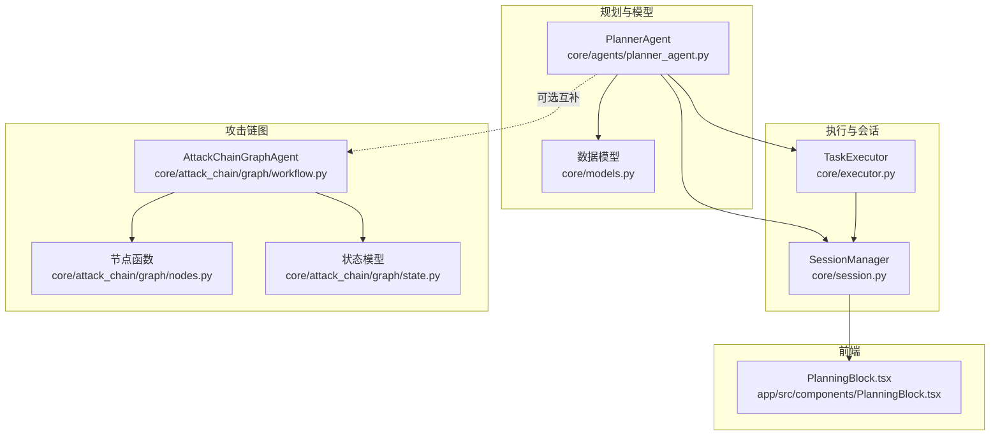
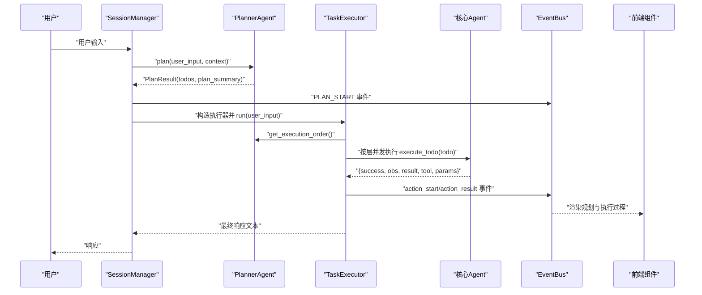
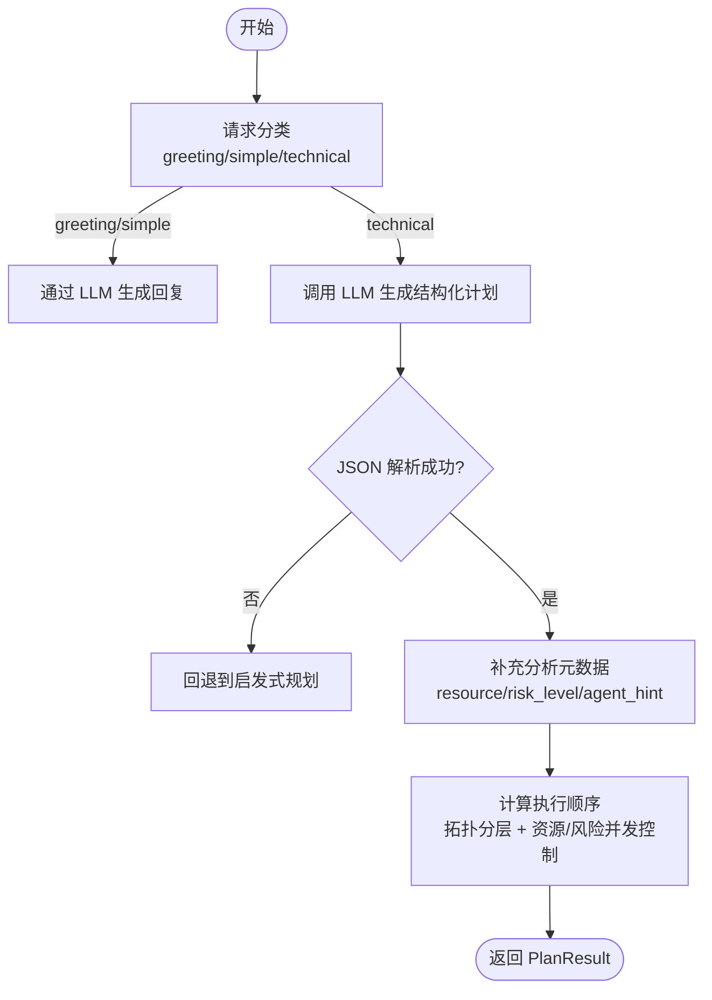
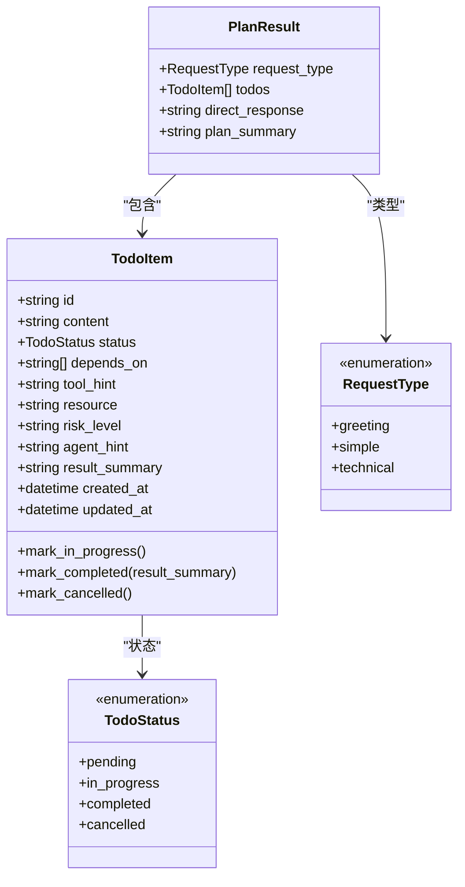
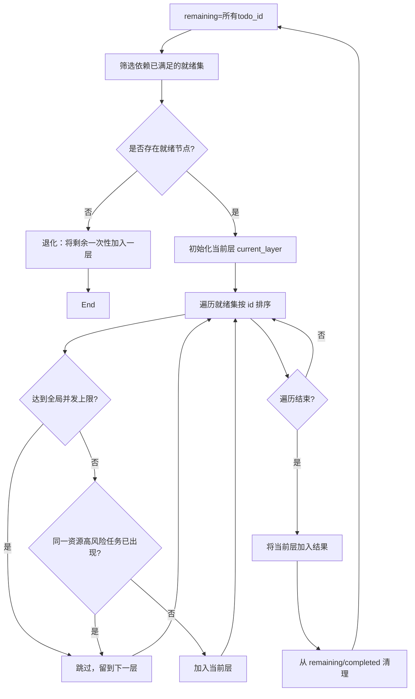
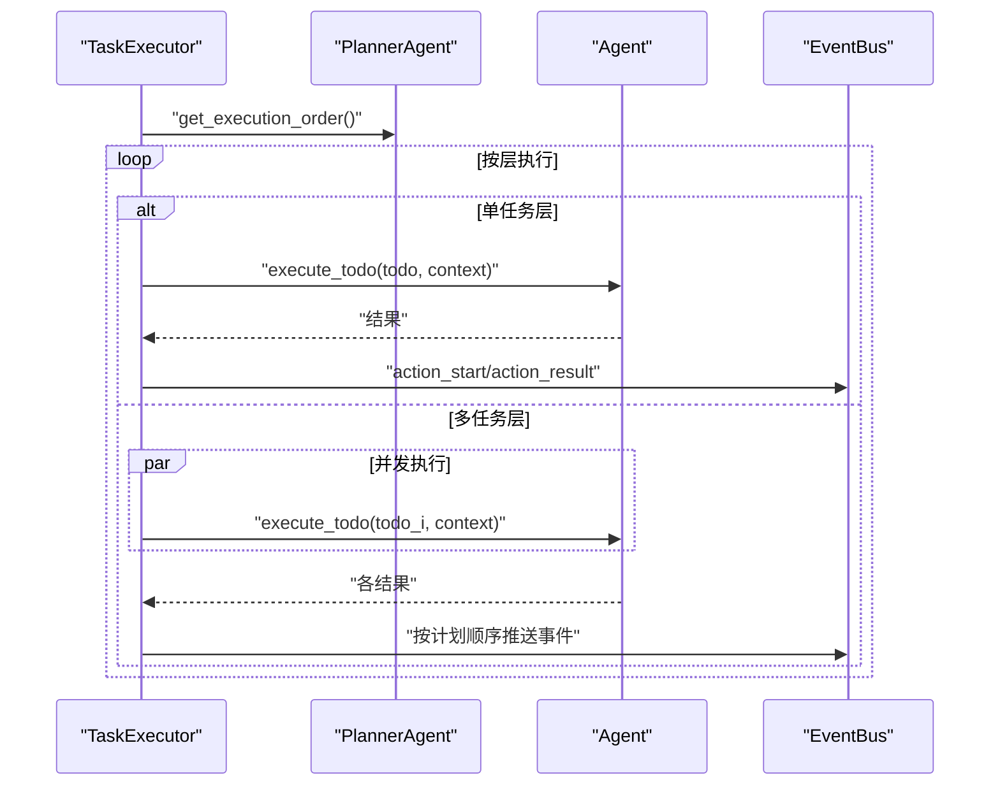
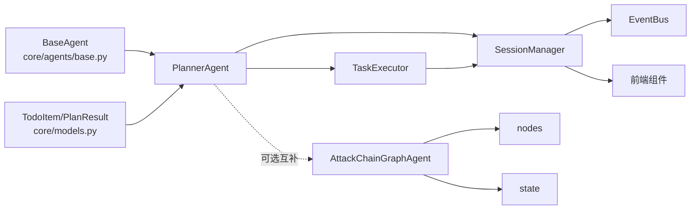

# 规划智能体

<cite>
**本文档引用的文件**
- [planner_agent.py](file://core/agents/planner_agent.py)
- [models.py](file://core/models.py)
- [executor.py](file://core/executor.py)
- [session.py](file://core/session.py)
- [nodes.py](file://core/attack_chain/graph/nodes.py)
- [workflow.py](file://core/attack_chain/graph/workflow.py)
- [state.py](file://core/attack_chain/graph/state.py)
- [base.py](file://core/agents/base.py)
- [PlanningBlock.tsx](file://app/src/components/PlanningBlock.tsx)
</cite>

## 目录
1. [简介](#简介)
2. [项目结构](#项目结构)
3. [核心组件](#核心组件)
4. [架构总览](#架构总览)
5. [详细组件分析](#详细组件分析)
6. [依赖关系分析](#依赖关系分析)
7. [性能考量](#性能考量)
8. [故障排查指南](#故障排查指南)
9. [结论](#结论)
10. [附录](#附录)

## 简介
本文件聚焦 Secbot 中的规划智能体（PlannerAgent），系统性阐述其在攻击链中的关键作用与规划算法。规划智能体负责将用户请求分类为问候/闲聊/非技术/技术四类，其中技术类请求被结构化为 TodoItem 列表，形成可执行的有向无环依赖图（DAG）。随后，规划智能体基于依赖关系与资源/风险约束生成分层并行执行顺序，交由 TaskExecutor 按层并发执行，同时通过 SessionManager 与 EventBus 将规划与执行过程可视化反馈给前端与终端界面。

## 项目结构
围绕规划智能体的关键文件组织如下：
- 规划与模型：core/agents/planner_agent.py、core/models.py
- 执行器：core/executor.py
- 会话编排：core/session.py
- 攻击链图（Secbot 攻击链中的另一条主线，与规划智能体互补）：core/attack_chain/graph/nodes.py、core/attack_chain/graph/workflow.py、core/attack_chain/graph/state.py
- 基础智能体抽象：core/agents/base.py
- 前端规划块组件：app/src/components/PlanningBlock.tsx

图表来源
- [planner_agent.py](file://core/agents/planner_agent.py#L20-L80)
- [models.py](file://core/models.py#L23-L80)
- [executor.py](file://core/executor.py#L17-L50)
- [session.py](file://core/session.py#L32-L120)
- [workflow.py](file://core/attack_chain/graph/workflow.py#L28-L96)
- [nodes.py](file://core/attack_chain/graph/nodes.py#L35-L120)
- [state.py](file://core/attack_chain/graph/state.py#L101-L129)
- [PlanningBlock.tsx](file://app/src/components/PlanningBlock.tsx#L17-L32)

章节来源
- [planner_agent.py](file://core/agents/planner_agent.py#L1-L120)
- [models.py](file://core/models.py#L1-L137)
- [executor.py](file://core/executor.py#L1-L179)
- [session.py](file://core/session.py#L1-L200)
- [workflow.py](file://core/attack_chain/graph/workflow.py#L1-L206)
- [nodes.py](file://core/attack_chain/graph/nodes.py#L1-L376)
- [state.py](file://core/attack_chain/graph/state.py#L1-L129)
- [base.py](file://core/agents/base.py#L1-L125)
- [PlanningBlock.tsx](file://app/src/components/PlanningBlock.tsx#L1-L69)

## 核心组件
- PlannerAgent：负责请求分类、结构化规划（生成 PlanResult 与 TodoItem 列表）、元数据推断（resource、risk_level、agent_hint）、执行顺序计算（分层并行）与状态更新。
- TodoItem/PlanResult：结构化任务与规划结果的数据模型，承载依赖、资源、风险、代理提示与状态。
- TaskExecutor：按 PlannerAgent 的分层执行顺序，串行或并发执行 Todo，收集结果并通过 EventBus 推送事件。
- SessionManager：会话编排入口，触发规划、执行与摘要阶段，驱动前端事件。
- 攻击链图（可选互补）：LangGraph 驱动的攻击路径推理，与规划智能体在不同层面协同（信息收集/扫描阶段与攻击链阶段）。

章节来源
- [planner_agent.py](file://core/agents/planner_agent.py#L20-L128)
- [models.py](file://core/models.py#L23-L80)
- [executor.py](file://core/executor.py#L17-L179)
- [session.py](file://core/session.py#L139-L368)
- [workflow.py](file://core/attack_chain/graph/workflow.py#L28-L96)

## 架构总览
规划智能体在 Secbot 中承担“结构化规划 + 依赖编排”的中枢角色，其与执行器、会话管理器以及前端组件的交互如下：

图表来源
- [session.py](file://core/session.py#L431-L456)
- [planner_agent.py](file://core/agents/planner_agent.py#L86-L128)
- [executor.py](file://core/executor.py#L46-L133)
- [PlanningBlock.tsx](file://app/src/components/PlanningBlock.tsx#L17-L32)

## 详细组件分析

### 规划智能体（PlannerAgent）
- 请求分类：通过关键词规则快速区分 greeting/simple/technical，避免不必要的 LLM 调用。
- 结构化规划：调用 LLM 生成 JSON 格式的 plan_summary 与 todos，解析失败时回退到启发式规划。
- 元数据推断：
  - resource：从 URL/IP/域名/工具名等线索推断目标资产类型与标识。
  - risk_level：基于工具名与关键词将风险分为 high/medium/low。
  - agent_hint：将 tool/resource 映射到 network_recon/web_pentest/osint/terminal_ops/defense_monitor。
- 执行顺序计算：基于依赖关系拓扑分层，再结合资源与风险进行“安全并发”切分，确保同一资源上的高风险任务串行，同时尊重全局并发上限。
- 状态管理：提供更新指定 todo 状态、查询当前 todos、查找下一个待执行 todo 等方法，便于执行器与 UI 实时追踪。

图表来源
- [planner_agent.py](file://core/agents/planner_agent.py#L86-L128)
- [planner_agent.py](file://core/agents/planner_agent.py#L444-L503)
- [planner_agent.py](file://core/agents/planner_agent.py#L504-L538)
- [planner_agent.py](file://core/agents/planner_agent.py#L539-L627)
- [planner_agent.py](file://core/agents/planner_agent.py#L633-L648)
- [planner_agent.py](file://core/agents/planner_agent.py#L180-L248)

章节来源
- [planner_agent.py](file://core/agents/planner_agent.py#L20-L128)
- [planner_agent.py](file://core/agents/planner_agent.py#L180-L248)
- [planner_agent.py](file://core/agents/planner_agent.py#L444-L627)
- [planner_agent.py](file://core/agents/planner_agent.py#L633-L830)

### TodoItem 模型与使用
- 字段与语义：id/content/status/depends_on/tool_hint/resource/risk_level/agent_hint/result_summary/created_at/updated_at。
- 状态管理：提供 mark_in_progress/mark_completed/mark_cancelled 等便捷方法。
- 使用场景：作为规划结果的最小执行单元，承载依赖关系与资源/风险元数据，供执行器按层并发执行。

图表来源
- [models.py](file://core/models.py#L23-L80)

章节来源
- [models.py](file://core/models.py#L15-L80)

### 执行顺序与并行策略
- 依赖拓扑：先筛选依赖已满足的就绪集合，若无就绪节点则退化为一次性取出剩余任务。
- 资源与风险控制：在同一拓扑层内，同一资源上的高风险任务强制串行；同时受全局并发上限约束。
- 返回结构：List[List[str]]，内层列表表示可在该层并发执行的 todo_id 集合。

图表来源
- [planner_agent.py](file://core/agents/planner_agent.py#L180-L248)

章节来源
- [planner_agent.py](file://core/agents/planner_agent.py#L180-L248)

### 任务执行器（TaskExecutor）
- 输入：PlanResult、Agent 实例、PlannerAgent、EventBus。
- 执行策略：
  - 单任务层：顺序执行并推送事件。
  - 多任务层：使用 asyncio.gather 并发执行，收集结果后按原计划顺序推送事件，保证 UI 线性渲染。
- 上下文聚合：将已完成任务的结果按 todo_id 与按资源维度聚合，供后续步骤引用。
- 错误处理：捕获异常并记录错误信息，保证整体执行不中断。

图表来源
- [executor.py](file://core/executor.py#L46-L133)
- [executor.py](file://core/executor.py#L135-L179)

章节来源
- [executor.py](file://core/executor.py#L17-L179)

### 会话编排（SessionManager）
- 流程编排：根据路由结果决定走 QA 简答或 Planner-Agent-总结链路。
- 规划阶段：预加载工具列表供 Planner 生成更准确的 tool_hint；发射 PLAN_START 事件。
- 执行阶段：构造 TaskExecutor 并运行，桥接事件回调；记录工具结果供摘要阶段使用。
- UI 集成：通过 EventBus 将任务阶段、规划、执行事件推送到前端组件。

章节来源
- [session.py](file://core/session.py#L139-L368)
- [session.py](file://core/session.py#L431-L456)

### 攻击链图（可选互补）
- LangGraph 工作流：INIT → SELECT_NEXT → EXECUTE_EXPLOIT → VERIFY_STEP → ROLLBACK/FINISH。
- 节点职责：初始化资产/漏洞/利用信息；选择下一步攻击目标；执行利用；验证结果；回退或继续。
- 回退策略：当某漏洞利用失败时，尝试同漏洞的替代 exploit，最多尝试若干次。

章节来源
- [workflow.py](file://core/attack_chain/graph/workflow.py#L28-L188)
- [nodes.py](file://core/attack_chain/graph/nodes.py#L35-L353)
- [state.py](file://core/attack_chain/graph/state.py#L101-L129)

## 依赖关系分析
- PlannerAgent 依赖：
  - 基础智能体抽象（继承 BaseAgent）。
  - TodoItem/PlanResult 数据模型。
  - LLM 提供者（通过 _create_llm 创建）。
  - 日志与工具选择辅助。
- TaskExecutor 依赖：
  - PlannerAgent 的执行顺序计算。
  - Agent 的 execute_todo 接口。
  - EventBus 事件推送。
- SessionManager 依赖：
  - PlannerAgent 的 plan。
  - TaskExecutor 的执行。
  - EventBus 的事件桥接。
- 攻击链图依赖：
  - nodes/state/workflow 三者协作，LangGraph 可选依赖。

图表来源
- [base.py](file://core/agents/base.py#L17-L34)
- [planner_agent.py](file://core/agents/planner_agent.py#L15-L17)
- [models.py](file://core/models.py#L23-L80)
- [executor.py](file://core/executor.py#L12-L14)
- [session.py](file://core/session.py#L14-L29)
- [workflow.py](file://core/attack_chain/graph/workflow.py#L12-L13)
- [nodes.py](file://core/attack_chain/graph/nodes.py#L12-L17)
- [state.py](file://core/attack_chain/graph/state.py#L10-L11)

章节来源
- [base.py](file://core/agents/base.py#L1-L125)
- [planner_agent.py](file://core/agents/planner_agent.py#L1-L80)
- [models.py](file://core/models.py#L1-L137)
- [executor.py](file://core/executor.py#L1-L179)
- [session.py](file://core/session.py#L1-L200)
- [workflow.py](file://core/attack_chain/graph/workflow.py#L1-L206)
- [nodes.py](file://core/attack_chain/graph/nodes.py#L1-L376)
- [state.py](file://core/attack_chain/graph/state.py#L1-L129)

## 性能考量
- 并发上限：max_parallel_per_layer 限制每层并发任务数量，避免系统过载。
- 资源串行：同一资源上的高风险任务强制串行，降低冲突与失败概率。
- 事件推送：并发执行后按原计划顺序推送事件，保证 UI 渲染一致性与可观测性。
- 回退机制：LLM 解析失败时采用启发式规划，保障系统可用性。

## 故障排查指南
- 规划阶段
  - LLM 调用失败：检查模型提供者配置与连接提示，查看日志中的错误信息。
  - JSON 解析失败：确认输出格式与规则，必要时启用回退规划。
- 执行阶段
  - Agent 不支持 execute_todo：检查 Agent 实现，确保提供该接口。
  - 并发冲突：适当降低 max_parallel_per_layer 或调整资源/风险标注。
- UI 展示
  - 规划块未显示：确认 EventBus 是否发出 PLAN_START 事件，前端组件是否订阅。

章节来源
- [planner_agent.py](file://core/agents/planner_agent.py#L494-L502)
- [planner_agent.py](file://core/agents/planner_agent.py#L504-L538)
- [executor.py](file://core/executor.py#L144-L150)
- [session.py](file://core/session.py#L444-L456)
- [PlanningBlock.tsx](file://app/src/components/PlanningBlock.tsx#L17-L32)

## 结论
规划智能体在 Secbot 中扮演“结构化规划 + 依赖编排”的关键角色，通过 TodoItem 的依赖关系与资源/风险元数据，生成可执行的分层并行计划，并与执行器、会话管理器及前端组件紧密协作，实现从用户请求到可执行任务序列的高效转化与可视化反馈。同时，攻击链图提供了另一条基于漏洞与利用的推理路径，二者在不同阶段互补，共同支撑 Secbot 的自动化安全测试与主动防御能力。

## 附录
- 规划示例与代码片段路径
  - 结构化规划 JSON 输出格式与规则：[planner_agent.py](file://core/agents/planner_agent.py#L460-L476)
  - LLM 规划调用与回退逻辑：[planner_agent.py](file://core/agents/planner_agent.py#L477-L502)
  - 启发式回退规划（端口扫描/漏洞扫描/系统信息/爬取/命令执行）：[planner_agent.py](file://core/agents/planner_agent.py#L539-L627)
  - 执行顺序计算（拓扑分层 + 资源/风险并发控制）：[planner_agent.py](file://core/agents/planner_agent.py#L180-L248)
  - 任务执行器并发执行与事件推送：[executor.py](file://core/executor.py#L64-L133)
  - 会话编排与事件发射（规划阶段）：[session.py](file://core/session.py#L444-L456)
  - 攻击链图工作流（LangGraph/回退）：[workflow.py](file://core/attack_chain/graph/workflow.py#L28-L188)
  - 攻击链节点职责与回退策略：[nodes.py](file://core/attack_chain/graph/nodes.py#L122-L353)