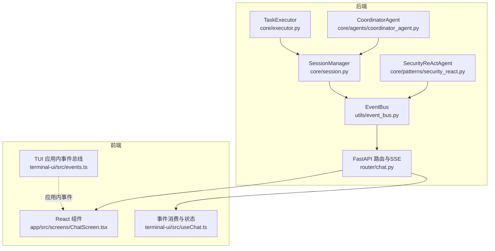
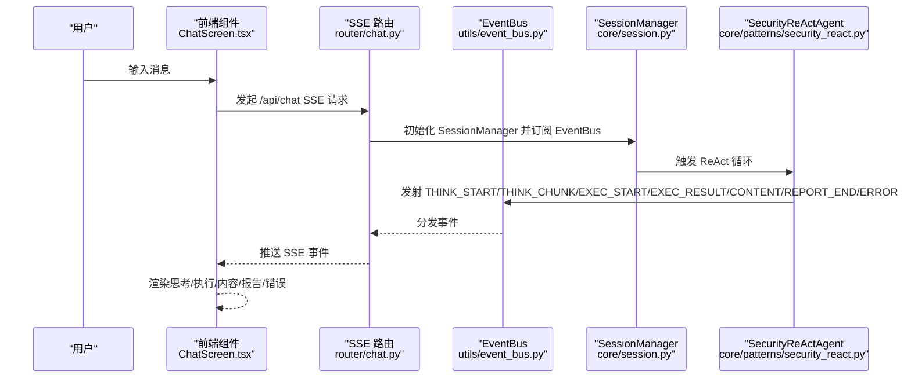
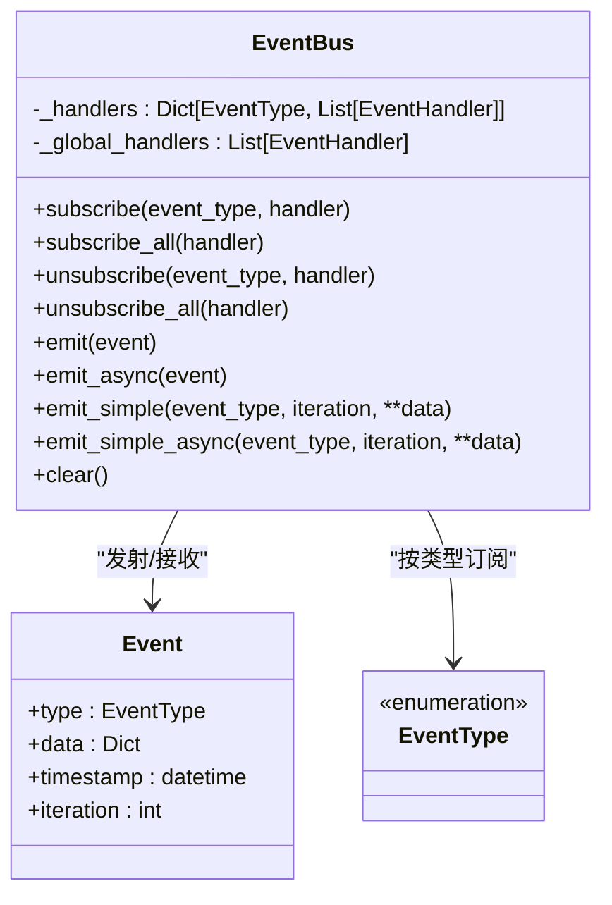
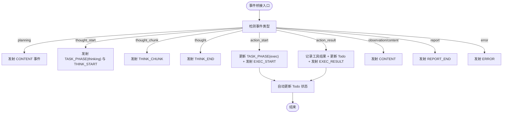
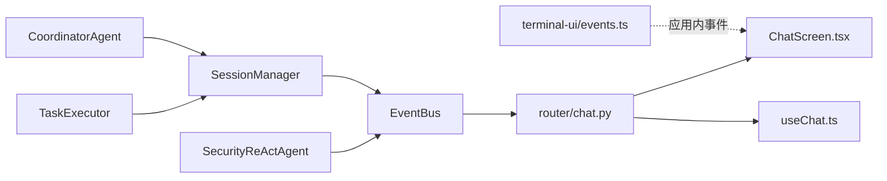

# 事件驱动架构

<cite>
**本文引用的文件**
- [utils/event_bus.py](file://utils/event_bus.py)
- [docs/design-paradigms/session-and-events.md](file://docs/design-paradigms/session-and-events.md)
- [core/session.py](file://core/session.py)
- [core/patterns/security_react.py](file://core/patterns/security_react.py)
- [core/executor.py](file://core/executor.py)
- [core/agents/coordinator_agent.py](file://core/agents/coordinator_agent.py)
- [router/chat.py](file://router/chat.py)
- [app/src/screens/ChatScreen.tsx](file://app/src/screens/ChatScreen.tsx)
- [terminal-ui/src/events.ts](file://terminal-ui/src/events.ts)
- [terminal-ui/src/useChat.ts](file://terminal-ui/src/useChat.ts)
</cite>

## 目录
1. [引言](#引言)
2. [项目结构](#项目结构)
3. [核心组件](#核心组件)
4. [架构总览](#架构总览)
5. [详细组件分析](#详细组件分析)
6. [依赖分析](#依赖分析)
7. [性能考虑](#性能考虑)
8. [故障排查指南](#故障排查指南)
9. [结论](#结论)
10. [附录](#附录)

## 引言
本文件系统化阐述 Secbot 的事件驱动架构，围绕基于 EventBus 的事件发布/订阅模式，解释事件类型定义、事件发布与订阅机制、异步事件处理流程，以及事件总线的实现原理（事件路由、处理器调度、错误隔离）。文档进一步说明智能体之间与组件之间的事件通信机制、事件生命周期管理，并给出多智能体协作场景（任务分发、状态同步、结果聚合）的事件流程与时序图。最后提供性能优化与错误恢复策略建议。

## 项目结构
Secbot 的事件驱动架构横跨后端 Python 与前端 TypeScript/TUI 两部分：
- 后端核心：事件总线、会话编排、ReAct 智能体、分层执行器、路由与 SSE。
- 前端：SSE 事件消费、UI 组件渲染、TUI 应用内事件总线。

图表来源
- [utils/event_bus.py](file://utils/event_bus.py#L68-L186)
- [core/session.py](file://core/session.py#L32-L422)
- [core/patterns/security_react.py](file://core/patterns/security_react.py#L142-L279)
- [core/executor.py](file://core/executor.py#L17-L132)
- [core/agents/coordinator_agent.py](file://core/agents/coordinator_agent.py#L40-L335)
- [router/chat.py](file://router/chat.py#L33-L131)
- [app/src/screens/ChatScreen.tsx](file://app/src/screens/ChatScreen.tsx#L131-L142)
- [terminal-ui/src/events.ts](file://terminal-ui/src/events.ts#L1-L92)
- [terminal-ui/src/useChat.ts](file://terminal-ui/src/useChat.ts#L145-L179)

章节来源
- [utils/event_bus.py](file://utils/event_bus.py#L1-L187)
- [docs/design-paradigms/session-and-events.md](file://docs/design-paradigms/session-and-events.md#L1-L36)
- [core/session.py](file://core/session.py#L32-L422)
- [router/chat.py](file://router/chat.py#L33-L131)

## 核心组件
- 事件总线 EventBus：提供同步/异步订阅与发射，支持全局处理器与按类型处理器，内置错误隔离与协程调度。
- 事件类型 EventType：集中定义所有事件类型，避免魔法字符串，统一事件载荷结构。
- 事件对象 Event：包含类型、数据、时间戳、迭代号等字段。
- 会话编排 SessionManager：驱动交互流程，桥接智能体事件到 EventBus，维护会话状态与任务阶段。
- ReAct 智能体 SecurityReActAgent：在 ReAct 循环中通过 EventBus 发射思考、执行、内容、报告、错误等事件。
- 分层执行器 TaskExecutor：按 Planner 的层级顺序并发/串行执行任务，保证前端线性渲染。
- 协调器 CoordinatorAgent：多子 Agent 协同入口，按 Todo 路由到专用 Agent，聚合结果供汇总。
- 路由与 SSE：将 EventBus 事件映射为 SSE 事件，前端组件消费并渲染。
- 前端应用内事件总线：TUI 内部类型安全事件总线，用于 UI 内部交互反馈。

章节来源
- [utils/event_bus.py](file://utils/event_bus.py#L15-L65)
- [core/session.py](file://core/session.py#L532-L721)
- [core/patterns/security_react.py](file://core/patterns/security_react.py#L142-L279)
- [core/executor.py](file://core/executor.py#L46-L132)
- [core/agents/coordinator_agent.py](file://core/agents/coordinator_agent.py#L130-L181)
- [router/chat.py](file://router/chat.py#L33-L131)
- [terminal-ui/src/events.ts](file://terminal-ui/src/events.ts#L1-L92)

## 架构总览
事件驱动架构以 EventBus 为核心，贯穿“智能体推理与执行—事件桥接—SSE 推送—前端渲染”的闭环。SessionManager 作为编排中枢，将 Planner、Agent、Summary 的事件统一映射到 EventBus；路由层将 EventBus 事件转换为前端可消费的 SSE 事件；前端组件根据事件类型与载荷更新 UI。

图表来源
- [router/chat.py](file://router/chat.py#L134-L200)
- [utils/event_bus.py](file://utils/event_bus.py#L68-L186)
- [core/session.py](file://core/session.py#L139-L422)
- [core/patterns/security_react.py](file://core/patterns/security_react.py#L253-L279)
- [app/src/screens/ChatScreen.tsx](file://app/src/screens/ChatScreen.tsx#L131-L142)

## 详细组件分析

### 事件总线 EventBus
- 设计要点
  - 事件类型：使用枚举定义，涵盖规划、推理、执行、内容、报告、任务阶段、交互控制、错误、UI 反馈等。
  - 事件结构：统一包含类型、数据字典、时间戳、迭代号。
  - 订阅：支持按事件类型订阅与全局订阅；支持取消订阅。
  - 发射：同步发射遍历处理器并尝试调度协程；异步发射等待协程完成；提供便捷方法 emit_simple/emit_simple_async。
  - 错误隔离：处理器异常被捕获并记录，避免中断事件分发。
- 实现细节
  - 同步发射：遍历全局处理器与目标类型处理器，若处理器返回协程则尝试在当前事件循环中调度。
  - 异步发射：依次调用处理器，若返回协程则 await。
  - 清理：clear 方法清空所有订阅。

图表来源
- [utils/event_bus.py](file://utils/event_bus.py#L68-L186)

章节来源
- [utils/event_bus.py](file://utils/event_bus.py#L15-L187)

### 事件类型与事件对象
- 事件类型：规划（PLAN_START/PLAN_TODO/PLAN_COMPLETE）、推理（THINK_START/THINK_CHUNK/THINK_END）、执行（EXEC_START/EXEC_PROGRESS/EXEC_RESULT）、内容（CONTENT）、报告（REPORT_START/REPORT_CHUNK/REPORT_END）、任务阶段（TASK_PHASE）、交互控制（CONFIRM_REQUIRED/ROOT_REQUIRED/SESSION_UPDATE）、错误（ERROR）、UI 反馈（TOAST_SHOW/COMMAND_EXECUTE）。
- 事件对象：包含 type、data、timestamp、iteration，便于订阅者按类型过滤与按迭代号排序。

章节来源
- [utils/event_bus.py](file://utils/event_bus.py#L15-L65)

### 会话编排与事件桥接
- SessionManager 负责：
  - 会话生命周期管理与消息历史维护。
  - 路由与编排：QA 快捷、规划、执行、摘要。
  - 事件桥接：将 SecurityReActAgent 的 on_event 回调映射为 EventBus 的标准事件类型，并自动更新 Todo 状态。
  - 任务阶段事件：TASK_PHASE 用于 UI 显示当前阶段（planning/exec/thinking/report/done）。
- 事件桥接映射：
  - planning → CONTENT；thought_start → TASK_PHASE + THINK_START；thought_chunk → THINK_CHUNK；thought → THINK_END；action_start → TASK_PHASE + EXEC_START；action_result → EXEC_RESULT；observation/content → CONTENT；report → REPORT_END；error → ERROR。

图表来源
- [core/session.py](file://core/session.py#L532-L721)

章节来源
- [core/session.py](file://core/session.py#L139-L422)

### ReAct 智能体事件发射
- SecurityReActAgent 在 ReAct 循环中根据事件类型映射到 EventBus：
  - planning → CONTENT
  - thought_start → THINK_START
  - thought_chunk → THINK_CHUNK
  - thought → THINK_END
  - action_start → EXEC_START
  - action_result → EXEC_RESULT
  - observation/content → CONTENT
  - report → REPORT_END
  - error → ERROR
- 事件携带 agent 标识，便于前端区分来源。

章节来源
- [core/patterns/security_react.py](file://core/patterns/security_react.py#L253-L279)

### 分层任务执行器
- TaskExecutor 按 Planner 的层级顺序执行：
  - 单 Todo 层：串行执行并直接发射事件。
  - 多 Todo 层：并发执行（gather），完成后按计划顺序线性发射事件，确保前端渲染顺序与规划一致。
- 事件桥接：在并发完成后，按顺序调用 on_event("action_start"/"action_result")，保证前端事件流线性。

章节来源
- [core/executor.py](file://core/executor.py#L46-L132)

### 多智能体协同与结果聚合
- CoordinatorAgent 作为 A2A 协调入口：
  - 对外以 "hackbot" 身份暴露；普通模式委托给默认 HackbotAgent；分层执行模式按 Todo.agent_hint/resource 路由到专用子 Agent。
  - 结果按 agent 维度聚合，供 SummaryAgent 做多 Agent 汇总报告。
- 专用子 Agent：继承 SecurityReActAgent，各自域内 ReAct 与工具调用，维护会话摘要并在每轮结束后同步到所有子 Agent。

章节来源
- [core/agents/coordinator_agent.py](file://core/agents/coordinator_agent.py#L40-L335)

### 路由与 SSE 事件映射
- router/chat.py 将 EventBus 事件映射为前端可消费的 SSE 事件名与数据：
  - PLAN_START → planning；THINK_START → thought_start；THINK_CHUNK → thought_chunk；THINK_END → thought；EXEC_START → action_start；EXEC_RESULT → action_result；CONTENT → content；REPORT_END → report；TASK_PHASE → phase；ROOT_REQUIRED → root_required；ERROR → error。
- SSE 事件生成器先发送 connected，再订阅 EventBus，避免前端长时间处于“连接中”。

章节来源
- [router/chat.py](file://router/chat.py#L33-L131)
- [router/chat.py](file://router/chat.py#L134-L200)

### 前端事件消费与渲染
- ChatScreen.tsx 根据 SSE 事件类型更新 UI：
  - planning → 显示规划阶段与规划块；thought_start → 切换到推理阶段；thought_chunk → 追加思考流；action_start → 切换到执行阶段；action_result → 追加执行结果；content → 追加内容块；report → 追加报告；phase → 更新任务阶段；error → 显示错误。
- terminal-ui/src/useChat.ts 消费 SSE 事件并更新流式状态。
- terminal-ui/src/events.ts 提供类型安全的应用内事件总线（Toast/CommandExecute），用于 UI 内部反馈。

章节来源
- [app/src/screens/ChatScreen.tsx](file://app/src/screens/ChatScreen.tsx#L131-L142)
- [terminal-ui/src/useChat.ts](file://terminal-ui/src/useChat.ts#L145-L179)
- [terminal-ui/src/events.ts](file://terminal-ui/src/events.ts#L1-L92)

## 依赖分析
- EventBus 是核心依赖，被 SessionManager、SecurityReActAgent、TaskExecutor、Router 等广泛使用。
- SessionManager 依赖 Planner、Agent、SummaryAgent，并通过 EventBus 与前端解耦。
- Router 依赖 EventBus，负责事件到 SSE 的映射与流式推送。
- 前端组件依赖 SSE 事件与应用内事件总线。

图表来源
- [utils/event_bus.py](file://utils/event_bus.py#L68-L186)
- [core/session.py](file://core/session.py#L32-L422)
- [core/patterns/security_react.py](file://core/patterns/security_react.py#L142-L279)
- [core/executor.py](file://core/executor.py#L17-L132)
- [core/agents/coordinator_agent.py](file://core/agents/coordinator_agent.py#L40-L335)
- [router/chat.py](file://router/chat.py#L33-L131)
- [app/src/screens/ChatScreen.tsx](file://app/src/screens/ChatScreen.tsx#L131-L142)
- [terminal-ui/src/events.ts](file://terminal-ui/src/events.ts#L1-L92)
- [terminal-ui/src/useChat.ts](file://terminal-ui/src/useChat.ts#L145-L179)

章节来源
- [utils/event_bus.py](file://utils/event_bus.py#L68-L186)
- [core/session.py](file://core/session.py#L32-L422)
- [router/chat.py](file://router/chat.py#L33-L131)

## 性能考虑
- 异步发射与协程调度
  - 同步发射：若处理器返回协程，尝试在当前事件循环中调度，避免阻塞主流程。
  - 异步发射：等待协程完成，适合耗时 IO 或并发处理。
- 并发执行与线性渲染
  - TaskExecutor 在多 Todo 层使用 gather 并发执行，完成后按计划顺序线性发射事件，兼顾吞吐与前端一致性。
- 事件订阅粒度
  - 仅订阅必要事件类型，减少处理器遍历开销；必要时使用全局处理器进行日志/监控。
- 前端渲染
  - SSE 事件按顺序到达，前端按事件类型增量渲染，避免一次性大块更新导致卡顿。
- 会话并发控制
  - 智能体内部使用 asyncio.Lock 控制并发，避免同一 Agent 同时处理多个请求。

章节来源
- [utils/event_bus.py](file://utils/event_bus.py#L121-L155)
- [core/executor.py](file://core/executor.py#L80-L132)
- [core/session.py](file://core/session.py#L351-L396)

## 故障排查指南
- 事件未到达前端
  - 检查 SessionManager 是否正确桥接事件到 EventBus；确认 Router 是否订阅了相应事件类型。
  - 检查 SSE 映射是否正确，事件名与载荷是否包含 agent 信息。
- 处理器异常导致事件中断
  - EventBus 已捕获处理器异常并记录日志；检查日志输出，定位异常处理器。
- 前端渲染异常
  - 检查 ChatScreen.tsx 的事件分支与 UI 组件映射；确认 useChat.ts 的状态更新逻辑。
- 应用内事件无效
  - 检查 terminal-ui/src/events.ts 的事件定义与运行时校验；确认监听器包装与解析逻辑。

章节来源
- [utils/event_bus.py](file://utils/event_bus.py#L137-L138)
- [router/chat.py](file://router/chat.py#L33-L131)
- [app/src/screens/ChatScreen.tsx](file://app/src/screens/ChatScreen.tsx#L131-L142)
- [terminal-ui/src/events.ts](file://terminal-ui/src/events.ts#L1-L92)

## 结论
Secbot 的事件驱动架构通过 EventBus 将智能体推理与执行、会话编排、路由与前端渲染解耦，实现了清晰的事件类型体系、可靠的异步处理与错误隔离、以及多智能体协作下的任务分发与结果聚合。该架构提升了系统的可观测性、可扩展性与可维护性，同时通过并发执行与线性渲染策略保障了良好的用户体验。

## 附录
- 事件类型一览（节选）
  - 规划：PLAN_START、PLAN_TODO、PLAN_COMPLETE
  - 推理：THINK_START、THINK_CHUNK、THINK_END
  - 执行：EXEC_START、EXEC_PROGRESS、EXEC_RESULT
  - 内容：CONTENT
  - 报告：REPORT_START、REPORT_CHUNK、REPORT_END
  - 任务阶段：TASK_PHASE
  - 交互控制：CONFIRM_REQUIRED、ROOT_REQUIRED、SESSION_UPDATE
  - 错误：ERROR
  - UI 反馈：TOAST_SHOW、COMMAND_EXECUTE

章节来源
- [utils/event_bus.py](file://utils/event_bus.py#L15-L53)