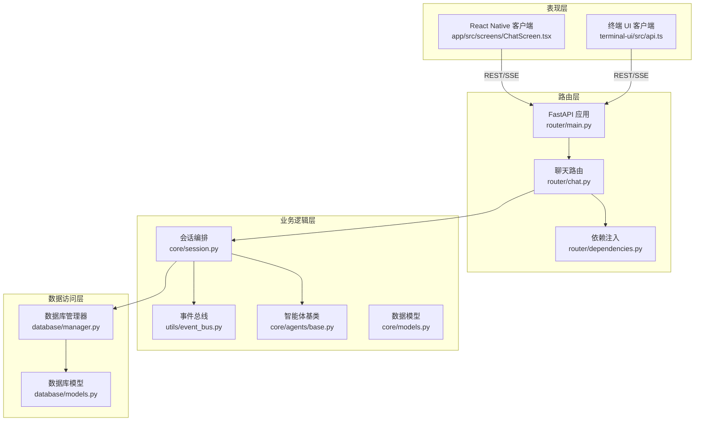
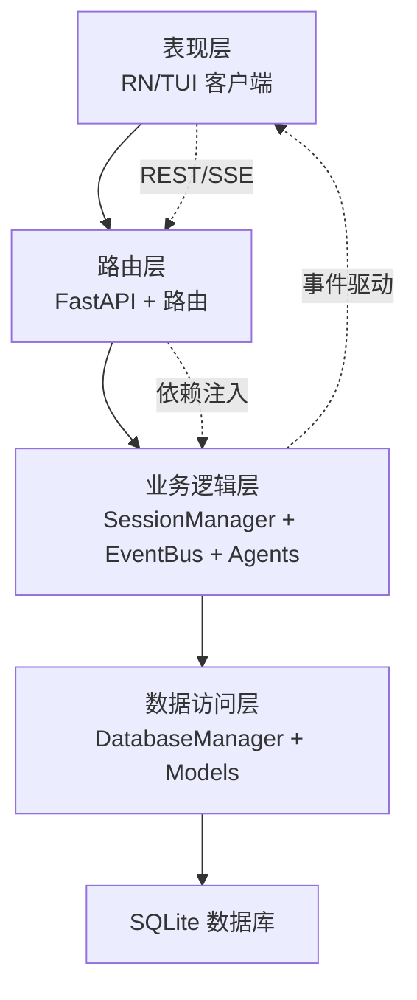
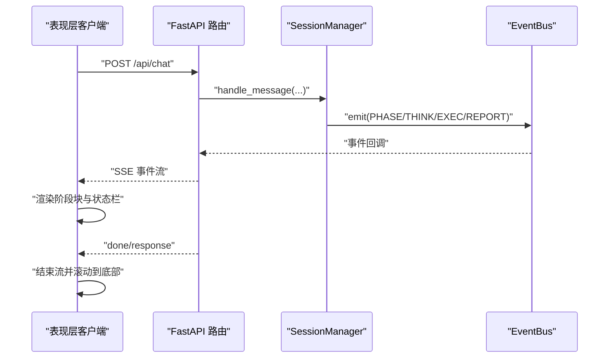
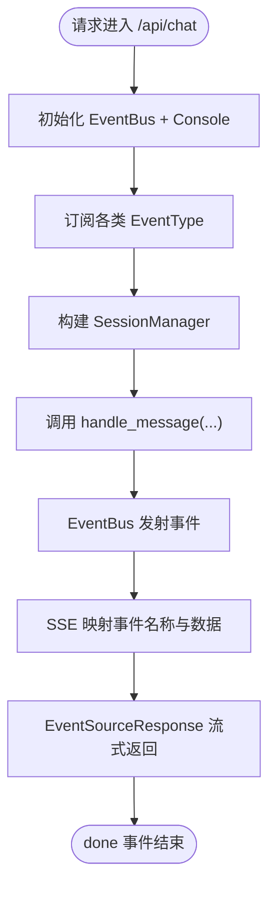
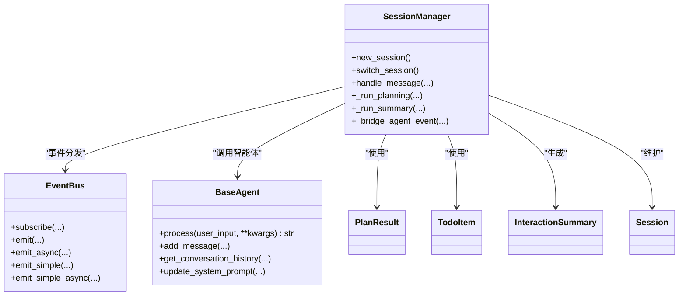
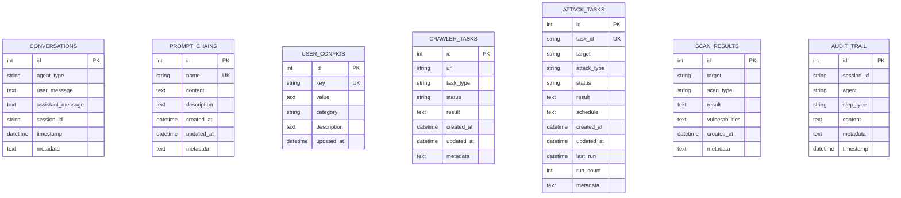
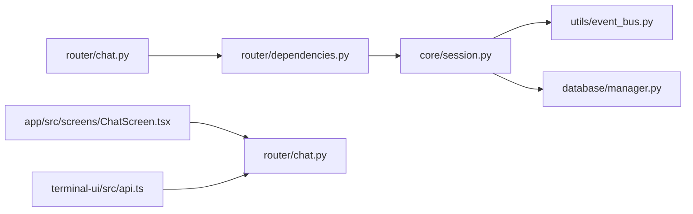

# 分层架构设计

<cite>
**本文档引用的文件**
- [main.py](file://main.py)
- [router/main.py](file://router/main.py)
- [router/chat.py](file://router/chat.py)
- [router/dependencies.py](file://router/dependencies.py)
- [core/session.py](file://core/session.py)
- [core/models.py](file://core/models.py)
- [core/agents/base.py](file://core/agents/base.py)
- [utils/event_bus.py](file://utils/event_bus.py)
- [database/manager.py](file://database/manager.py)
- [database/models.py](file://database/models.py)
- [app/src/api/client.ts](file://app/src/api/client.ts)
- [app/src/screens/ChatScreen.tsx](file://app/src/screens/ChatScreen.tsx)
- [terminal-ui/src/api.ts](file://terminal-ui/src/api.ts)
</cite>

## 目录
1. [简介](#简介)
2. [项目结构](#项目结构)
3. [核心组件](#核心组件)
4. [架构总览](#架构总览)
5. [详细组件分析](#详细组件分析)
6. [依赖分析](#依赖分析)
7. [性能考虑](#性能考虑)
8. [故障排除指南](#故障排除指南)
9. [结论](#结论)
10. [附录](#附录)

## 简介
本文件为 Secbot 项目的分层架构设计文档，围绕四层架构进行系统化说明：表现层（前端客户端）、路由层（FastAPI）、业务逻辑层（核心服务）、数据访问层（数据库）。文档重点阐述：
- 各层职责边界与接口定义
- 层间通信机制（HTTP 请求、SSE 事件流、事件总线）
- 依赖注入与控制反转的应用
- 典型请求处理流程与数据流转
- 性能优化策略与错误处理机制

## 项目结构
Secbot 采用前后端分离与模块化组织：
- 表现层：React Native（移动端）与终端 UI（TUI）两套前端客户端，通过 REST/SSE 与后端交互
- 路由层：FastAPI 提供 REST + SSE 接口，集中注册路由与中间件
- 业务逻辑层：会话编排（SessionManager）、智能体（Agent）、规划器（Planner）、摘要（Summary）等
- 数据访问层：SQLite 管理器与 Pydantic 模型，负责持久化与查询

图表来源
- [router/main.py](file://router/main.py#L19-L71)
- [router/chat.py](file://router/chat.py#L27-L271)
- [router/dependencies.py](file://router/dependencies.py#L142-L193)
- [core/session.py](file://core/session.py#L32-L122)
- [utils/event_bus.py](file://utils/event_bus.py#L68-L186)
- [database/manager.py](file://database/manager.py#L26-L74)

章节来源
- [router/main.py](file://router/main.py#L19-L71)
- [router/chat.py](file://router/chat.py#L27-L271)
- [router/dependencies.py](file://router/dependencies.py#L142-L193)
- [core/session.py](file://core/session.py#L32-L122)
- [utils/event_bus.py](file://utils/event_bus.py#L68-L186)
- [database/manager.py](file://database/manager.py#L26-L74)

## 核心组件
- 表现层客户端
  - React Native 客户端：通过 SSE 流式接收事件，渲染聊天界面与状态栏
  - 终端 UI 客户端：封装 REST 请求，供 TUI 与斜杠命令使用
- 路由层
  - FastAPI 应用工厂与健康检查
  - 聊天路由：SSE 事件映射与流式输出
  - 依赖注入：单例化核心服务（智能体、数据库、控制器等）
- 业务逻辑层
  - 会话编排：Interaction 编排（路由 -> 规划 -> 执行 -> 摘要）
  - 事件总线：解耦 Agent 与 UI，支持同步/异步事件
  - 智能体基类：统一消息模型与系统提示词
  - 数据模型：Todo/Plan/Session/InteractionSummary 等
- 数据访问层
  - SQLite 管理器：表初始化、CRUD、索引
  - Pydantic 模型：对话、提示词链、用户配置、任务、审计等

章节来源
- [app/src/screens/ChatScreen.tsx](file://app/src/screens/ChatScreen.tsx#L131-L376)
- [terminal-ui/src/api.ts](file://terminal-ui/src/api.ts#L6-L16)
- [router/main.py](file://router/main.py#L19-L71)
- [router/chat.py](file://router/chat.py#L27-L271)
- [router/dependencies.py](file://router/dependencies.py#L142-L193)
- [core/session.py](file://core/session.py#L32-L122)
- [utils/event_bus.py](file://utils/event_bus.py#L68-L186)
- [core/agents/base.py](file://core/agents/base.py#L17-L124)
- [core/models.py](file://core/models.py#L15-L136)
- [database/manager.py](file://database/manager.py#L26-L74)
- [database/models.py](file://database/models.py#L9-L89)

## 架构总览
Secbot 的四层架构遵循“关注点分离”与“依赖倒置”原则：
- 表现层只负责 UI 与交互，不直接依赖业务细节
- 路由层负责请求接入与依赖注入，屏蔽底层复杂性
- 业务逻辑层通过事件总线与数据模型解耦，实现可插拔的智能体与规划器
- 数据访问层抽象为统一的 SQLite 管理器，提供事务与索引优化

图表来源
- [router/main.py](file://router/main.py#L19-L71)
- [router/chat.py](file://router/chat.py#L27-L271)
- [core/session.py](file://core/session.py#L32-L122)
- [utils/event_bus.py](file://utils/event_bus.py#L68-L186)
- [database/manager.py](file://database/manager.py#L26-L74)

## 详细组件分析

### 表现层（前端客户端）
- React Native 客户端
  - 通过 SSE 接收事件，按阶段渲染：规划、推理、执行、报告、最终响应
  - 状态栏与 UI 组件根据 phase 事件动态更新
- 终端 UI 客户端
  - 封装 REST 请求，供 TUI 与斜杠命令调用后端接口

图表来源
- [router/chat.py](file://router/chat.py#L134-L263)
- [core/session.py](file://core/session.py#L139-L422)
- [utils/event_bus.py](file://utils/event_bus.py#L144-L181)
- [app/src/screens/ChatScreen.tsx](file://app/src/screens/ChatScreen.tsx#L131-L376)

章节来源
- [app/src/screens/ChatScreen.tsx](file://app/src/screens/ChatScreen.tsx#L131-L376)
- [terminal-ui/src/api.ts](file://terminal-ui/src/api.ts#L6-L16)

### 路由层（FastAPI）
- 应用工厂与中间件
  - CORS 中间件允许跨域访问
  - 注册多路由模块（chat、agents、sessions、system、defense、network、database、tools）
  - 启动时初始化数据库
- 聊天路由
  - SSE 事件映射：将 EventBus 事件转换为前端可消费的 SSE 名称与数据
  - 交互式流式处理：先发送 connected，再异步执行会话编排
  - 同步聊天接口：兼容旧模式，直接调用智能体
- 依赖注入
  - 单例化智能体、数据库、控制器等，避免重复初始化
  - 通过 get_agent/get_agents 等依赖函数提供服务

图表来源
- [router/main.py](file://router/main.py#L19-L71)
- [router/chat.py](file://router/chat.py#L134-L263)
- [router/dependencies.py](file://router/dependencies.py#L142-L193)

章节来源
- [router/main.py](file://router/main.py#L19-L71)
- [router/chat.py](file://router/chat.py#L27-L271)
- [router/dependencies.py](file://router/dependencies.py#L142-L193)

### 业务逻辑层（核心服务）
- 会话编排（SessionManager）
  - 职责：会话生命周期管理、消息路由、规划、执行、摘要
  - 编排流程：force_qa 或路由分类 → QAAgent 简答；否则 Planner + 核心 Agent + Summary
  - 事件桥接：将 Agent 的 on_event 转发到 EventBus，并自动更新 Todo 状态
  - 并发控制：支持 Agent 的并发锁，保证同一 Agent 的任务串行执行
- 事件总线（EventBus）
  - 支持同步/异步事件订阅与发射
  - 事件类型覆盖规划、推理、执行、内容、报告、任务阶段、错误等
- 智能体基类（BaseAgent）
  - 统一的消息模型与系统提示词
  - 支持更新系统提示词与对话历史管理
- 数据模型（core/models）
  - Todo/Plan/Session/InteractionSummary 等，支撑编排与报告

图表来源
- [core/session.py](file://core/session.py#L32-L122)
- [utils/event_bus.py](file://utils/event_bus.py#L68-L186)
- [core/agents/base.py](file://core/agents/base.py#L17-L124)
- [core/models.py](file://core/models.py#L72-L136)

章节来源
- [core/session.py](file://core/session.py#L139-L422)
- [utils/event_bus.py](file://utils/event_bus.py#L68-L186)
- [core/agents/base.py](file://core/agents/base.py#L17-L124)
- [core/models.py](file://core/models.py#L15-L136)

### 数据访问层（数据库）
- 数据库管理器（DatabaseManager）
  - SQLite 连接与上下文管理
  - 初始化表与索引，提供对话、提示词链、用户配置、任务、审计等 CRUD
  - 统一的事务与异常处理
- 数据模型（database/models）
  - Pydantic 模型封装数据库记录，便于序列化与校验

图表来源
- [database/manager.py](file://database/manager.py#L75-L202)
- [database/models.py](file://database/models.py#L9-L89)

章节来源
- [database/manager.py](file://database/manager.py#L26-L74)
- [database/manager.py](file://database/manager.py#L205-L719)
- [database/models.py](file://database/models.py#L9-L89)

## 依赖分析
- 控制反转与依赖注入
  - 路由层通过依赖函数（get_agent/get_agents/get_db_manager 等）提供服务实例
  - 单例容器延迟初始化，避免 import 时加载重型模块
- 层间耦合与解耦
  - 表现层与路由层通过 REST/SSE 解耦
  - 路由层与业务层通过依赖注入解耦
  - 业务层通过 EventBus 与 UI 解耦
- 可能的循环依赖
  - 依赖通过函数注入，未见直接循环导入
- 外部依赖与集成点
  - FastAPI、sse-starlette、uvicorn
  - SQLite（本地存储）

图表来源
- [router/chat.py](file://router/chat.py#L15-L25)
- [router/dependencies.py](file://router/dependencies.py#L142-L193)
- [core/session.py](file://core/session.py#L32-L122)
- [utils/event_bus.py](file://utils/event_bus.py#L68-L186)
- [database/manager.py](file://database/manager.py#L26-L74)
- [app/src/screens/ChatScreen.tsx](file://app/src/screens/ChatScreen.tsx#L131-L376)
- [terminal-ui/src/api.ts](file://terminal-ui/src/api.ts#L6-L16)

章节来源
- [router/dependencies.py](file://router/dependencies.py#L142-L193)
- [router/chat.py](file://router/chat.py#L15-L25)
- [core/session.py](file://core/session.py#L32-L122)

## 性能考虑
- 事件驱动与流式传输
  - SSE 事件流减少长轮询开销，前端即时渲染
- 并发控制
  - 智能体支持并发锁，避免同一 Agent 的并发竞争
- 延迟初始化
  - 依赖单例延迟初始化，降低启动时内存占用
- 数据库优化
  - 针对常用查询建立索引，事务封装与异常回滚
- 前端渲染
  - React Native 使用 FlatList 与增量更新，提升大事件流渲染性能

## 故障排除指南
- 启动与连接
  - 后端端口占用：启动前检查 8000 端口占用并提示 PID
  - 健康检查：访问 /health 确认服务可用
- SSE 连接
  - 首包 connected：前端据此解除“连接中”状态
  - 错误事件：后端抛出 error 事件，前端显示错误块
- 依赖缺失
  - 未知智能体类型：依赖函数会抛出错误，检查可用智能体列表
- 数据库异常
  - 事务回滚与日志记录，定位 SQL 错误与约束冲突

章节来源
- [router/main.py](file://router/main.py#L74-L97)
- [router/chat.py](file://router/chat.py#L134-L263)
- [router/dependencies.py](file://router/dependencies.py#L154-L161)
- [database/manager.py](file://database/manager.py#L60-L73)

## 结论
Secbot 的四层架构通过“路由层集中接入 + 业务层事件驱动 + 数据层抽象”的设计，实现了表现层与业务层的松耦合、可扩展与高可维护性。依赖注入与事件总线进一步增强了模块间的解耦与可测试性。结合 SSE 流式传输与 SQLite 本地存储，系统在易用性与性能之间取得平衡。

## 附录
- 典型请求处理流程（从 UI 到数据库）
  - UI 发送消息 → FastAPI 路由 → 依赖注入 → SessionManager 编排 → EventBus 事件 → UI 渲染 → 数据库持久化
- 接口与数据序列化
  - 前端通过 app/src/api/client.ts 与 terminal-ui/src/api.ts 发起 REST 请求
  - SSE 事件通过 router/chat.py 映射为前端可消费的数据结构