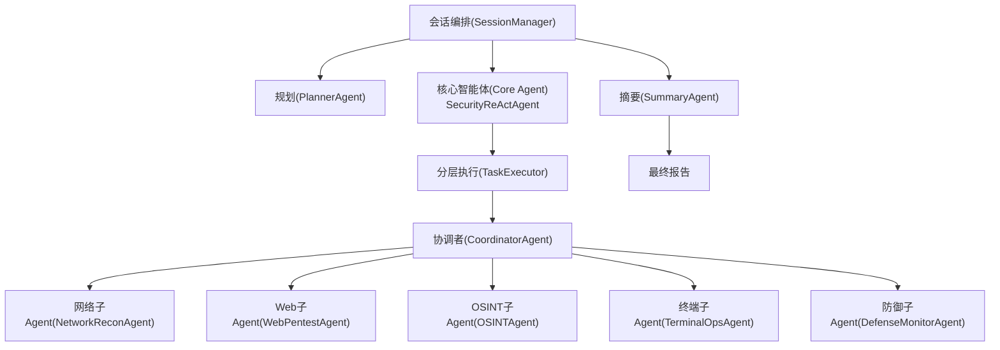
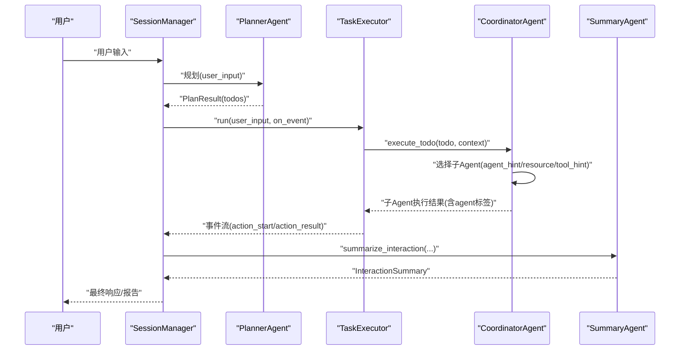
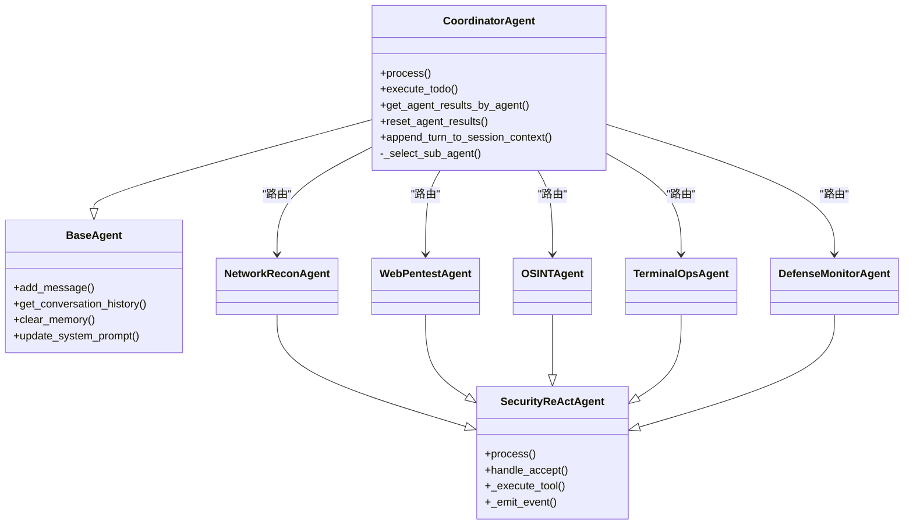
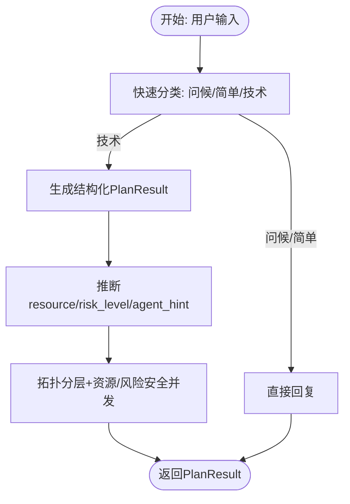
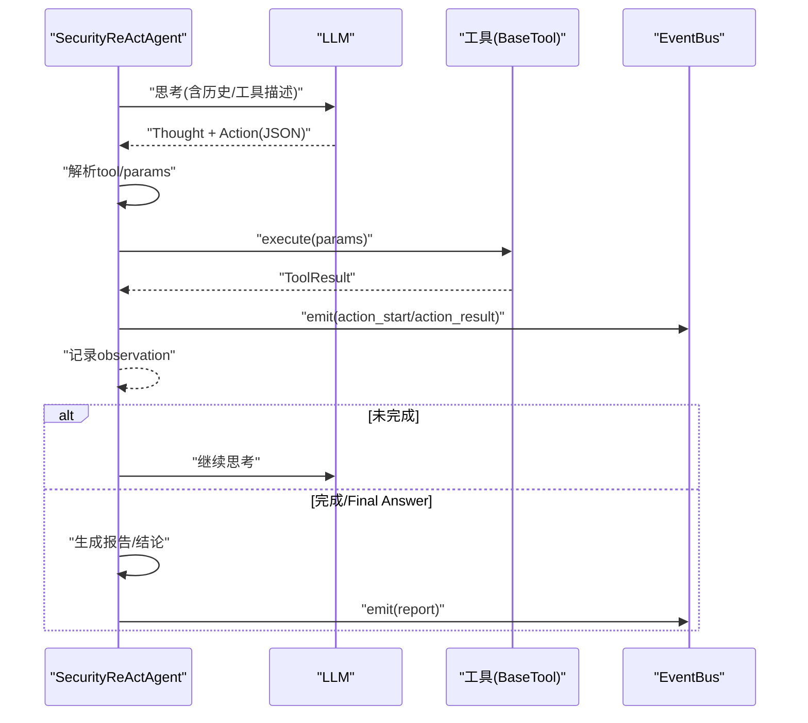
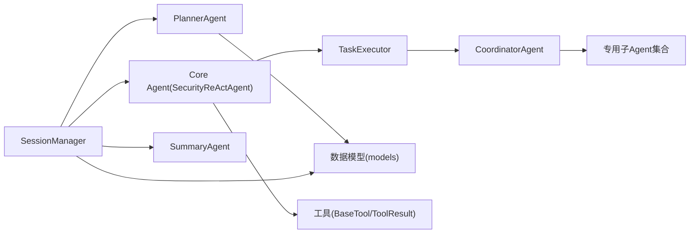

# 多智能体协作模式

<cite>
**本文引用的文件**
- [core/agents/base.py](file://core/agents/base.py)
- [core/agents/coordinator_agent.py](file://core/agents/coordinator_agent.py)
- [core/agents/planner_agent.py](file://core/agents/planner_agent.py)
- [core/agents/specialist_agents.py](file://core/agents/specialist_agents.py)
- [core/agents/tool_calling_agent.py](file://core/agents/tool_calling_agent.py)
- [core/agents/web_research_agent.py](file://core/agents/web_research_agent.py)
- [core/patterns/react.py](file://core/patterns/react.py)
- [core/patterns/security_react.py](file://core/patterns/security_react.py)
- [core/models.py](file://core/models.py)
- [core/session.py](file://core/session.py)
- [core/executor.py](file://core/executor.py)
- [tools/base.py](file://tools/base.py)
- [router/agents.py](file://router/agents.py)
</cite>

## 目录
1. [简介](#简介)
2. [项目结构](#项目结构)
3. [核心组件](#核心组件)
4. [架构总览](#架构总览)
5. [详细组件分析](#详细组件分析)
6. [依赖关系分析](#依赖关系分析)
7. [性能考量](#性能考量)
8. [故障排查指南](#故障排查指南)
9. [结论](#结论)
10. [附录](#附录)

## 简介
本文件系统化阐述Secbot项目的多智能体协作模式，重点围绕基于LangGraph思想的A2A（Agent-to-Agent）架构展开，涵盖协调者智能体、规划智能体与专用智能体的职责分工与协作机制；详解ReAct（推理+行动）模式在智能体中的应用，包括思考-行动循环、工具调用、结果评估等环节；阐明智能体之间的通信协议、任务分配策略、结果聚合机制；解释智能体生命周期管理（创建、初始化、执行、销毁）；并提供协作流程图与状态转换图，展示典型任务的执行路径，最后给出性能优化与故障处理策略。

## 项目结构
Secbot采用“会话编排 + 多智能体 + 分层执行”的分层架构：
- 会话编排层：SessionManager负责消息路由、规划、执行与摘要，串联QA、Planner、Core Agent与Summary。
- 规划层：PlannerAgent将用户请求分类为问候/简单/技术请求，生成结构化TodoList并维护依赖关系。
- 执行层：Core Agent（hackbot/superhackbot）基于ReAct引擎执行工具调用；CoordinatorAgent作为A2A入口，将单步任务路由到专用子Agent；TaskExecutor按拓扑分层并发/串行执行。
- 摘要层：SummaryAgent将ReAct历史与工具结果汇总为结构化报告。
- 工具层：统一的BaseTool与ToolResult接口，屏蔽不同工具的差异。

图表来源
- [core/session.py](file://core/session.py#L139-L422)
- [core/agents/planner_agent.py](file://core/agents/planner_agent.py#L20-L83)
- [core/patterns/security_react.py](file://core/patterns/security_react.py#L142-L628)
- [core/agents/coordinator_agent.py](file://core/agents/coordinator_agent.py#L40-L335)
- [core/agents/specialist_agents.py](file://core/agents/specialist_agents.py#L32-L247)
- [core/executor.py](file://core/executor.py#L17-L179)

章节来源
- [core/session.py](file://core/session.py#L32-L422)
- [core/agents/planner_agent.py](file://core/agents/planner_agent.py#L20-L83)
- [core/patterns/security_react.py](file://core/patterns/security_react.py#L142-L628)
- [core/agents/coordinator_agent.py](file://core/agents/coordinator_agent.py#L40-L335)
- [core/agents/specialist_agents.py](file://core/agents/specialist_agents.py#L32-L247)
- [core/executor.py](file://core/executor.py#L17-L179)

## 核心组件
- 基础智能体与消息模型：BaseAgent提供统一的消息历史、系统提示词、内存管理与事件桥接能力；AgentMessage承载role/content/metadata。
- 规划智能体：PlannerAgent负责请求分类、结构化计划生成、依赖编排与执行顺序分层。
- ReAct引擎：SecurityReActAgent实现思考-行动-观察循环，支持自动/确认两种模式，事件驱动前端渲染。
- 协调者智能体：CoordinatorAgent作为A2A入口，将单步Todo路由到专用子Agent，并聚合工具执行结果。
- 专用子Agent：Network/Web/OSINT/Terminal/Defense五类子Agent，各自挂载专属工具集，复用SecurityReAct能力。
- 任务执行器：TaskExecutor按拓扑分层并发/串行执行，保证依赖顺序与资源安全并发。
- 摘要智能体：SummaryAgent将ReAct历史与工具结果汇总为结构化报告。
- 工具抽象：BaseTool与ToolResult统一工具接口与结果格式。

章节来源
- [core/agents/base.py](file://core/agents/base.py#L10-L125)
- [core/agents/planner_agent.py](file://core/agents/planner_agent.py#L20-L83)
- [core/patterns/security_react.py](file://core/patterns/security_react.py#L142-L628)
- [core/agents/coordinator_agent.py](file://core/agents/coordinator_agent.py#L40-L335)
- [core/agents/specialist_agents.py](file://core/agents/specialist_agents.py#L32-L247)
- [core/executor.py](file://core/executor.py#L17-L179)
- [core/agents/web_research_agent.py](file://core/agents/web_research_agent.py#L52-L372)
- [tools/base.py](file://tools/base.py#L9-L36)

## 架构总览
多智能体协作遵循“路由-规划-分层执行-摘要”的闭环流程：
- SessionManager根据消息类型路由到QA或规划链路；技术请求进入Planner生成TodoList。
- TaskExecutor按拓扑分层并发/串行执行；CoordinatorAgent将单步任务路由到专用子Agent。
- SecurityReActAgent在ReAct循环中解析工具调用、执行工具、记录观察结果并触发事件。
- SummaryAgent汇总生成最终报告；CoordinatorAgent聚合子Agent结果供摘要使用。

图表来源
- [core/session.py](file://core/session.py#L139-L422)
- [core/agents/planner_agent.py](file://core/agents/planner_agent.py#L86-L129)
- [core/executor.py](file://core/executor.py#L46-L133)
- [core/agents/coordinator_agent.py](file://core/agents/coordinator_agent.py#L130-L181)
- [core/agents/summary_agent.py](file://core/agents/summary_agent.py#L111-L182)

章节来源
- [core/session.py](file://core/session.py#L139-L422)
- [core/executor.py](file://core/executor.py#L46-L133)
- [core/agents/coordinator_agent.py](file://core/agents/coordinator_agent.py#L130-L181)
- [core/agents/summary_agent.py](file://core/agents/summary_agent.py#L111-L182)

## 详细组件分析

### 协调者智能体（CoordinatorAgent）
- 职责
  - 作为A2A入口，对外暴露process与execute_todo接口。
  - 在普通对话/同步模式下委托默认HackbotAgent；在分层执行模式下将单步Todo路由到专用子Agent。
  - 聚合各子Agent的工具执行结果，供SummaryAgent做多Agent汇总。
- 路由策略
  - 优先agent_hint；其次resource前缀；再次tool_hint关键词；无法匹配则回退默认Agent。
- 结果聚合
  - 为每个结果打上agent标签，按agent维度累积，支持摘要阶段的子Agent概览。

图表来源
- [core/agents/base.py](file://core/agents/base.py#L17-L125)
- [core/agents/coordinator_agent.py](file://core/agents/coordinator_agent.py#L40-L335)
- [core/agents/specialist_agents.py](file://core/agents/specialist_agents.py#L32-L247)
- [core/patterns/security_react.py](file://core/patterns/security_react.py#L142-L628)

章节来源
- [core/agents/coordinator_agent.py](file://core/agents/coordinator_agent.py#L40-L335)
- [core/agents/specialist_agents.py](file://core/agents/specialist_agents.py#L32-L247)

### 规划智能体（PlannerAgent）
- 职责
  - 请求分类：问候/闲聊/非技术/技术。
  - 技术请求生成结构化TodoList，包含id/content/tool_hint/depends_on/resource/risk_level/agent_hint。
  - 依赖编排与分层并发：根据依赖关系与资源/风险约束生成执行顺序。
- 元数据推断
  - 从用户输入与Todo内容推断resource/risk_level/agent_hint，提升路由准确性。
- 状态管理
  - 维护当前PlanResult，支持更新todo状态、查询执行顺序、查找匹配todo。

图表来源
- [core/agents/planner_agent.py](file://core/agents/planner_agent.py#L86-L129)
- [core/agents/planner_agent.py](file://core/agents/planner_agent.py#L180-L248)
- [core/agents/planner_agent.py](file://core/agents/planner_agent.py#L633-L745)

章节来源
- [core/agents/planner_agent.py](file://core/agents/planner_agent.py#L20-L83)
- [core/agents/planner_agent.py](file://core/agents/planner_agent.py#L180-L248)
- [core/agents/planner_agent.py](file://core/agents/planner_agent.py#L633-L745)

### ReAct模式与工具调用（SecurityReActAgent）
- ReAct循环
  - 思考：基于历史与工具描述生成下一步行动。
  - 行动：解析LLM输出的工具调用（tool/params）。
  - 观察：执行工具，格式化结果并记录。
  - 终止：当LLM输出Final Answer或达到最大迭代时生成报告。
- 事件驱动
  - 通过_emit_event将planning/thought/action_result/report/error等事件推送到EventBus与上层回调。
- 工具执行
  - _execute_tool封装工具调用，记录审计与事件；支持高敏感工具的用户确认流程。
- 会话上下文
  - append_turn_to_session_context将摘要式信息写入，供后续轮次参考。

图表来源
- [core/patterns/security_react.py](file://core/patterns/security_react.py#L393-L628)
- [core/patterns/security_react.py](file://core/patterns/security_react.py#L227-L278)
- [tools/base.py](file://tools/base.py#L16-L36)

章节来源
- [core/patterns/security_react.py](file://core/patterns/security_react.py#L142-L628)
- [tools/base.py](file://tools/base.py#L16-L36)

### 专用子Agent（Network/Web/OSINT/Terminal/Defense）
- 统一继承_SpecializedSecurityAgent（即SecurityReActAgent），复用ReAct能力。
- 各自工具集与系统提示词，聚焦特定领域（网络枚举、Web测试、OSINT、终端操作、防御巡检）。
- 通过agent_type标记事件来源，便于前端按Agent维度渲染。

章节来源
- [core/agents/specialist_agents.py](file://core/agents/specialist_agents.py#L32-L247)

### 任务执行器（TaskExecutor）
- 分层执行
  - 串行层：单个Todo顺序执行。
  - 并行层：多Todo并发执行，完成后按计划顺序线性推送事件，保证前端渲染一致性。
- 上下文聚合
  - 收集已完成的by_todo与按resource聚合的结果，供后续步骤引用。
- 错误处理
  - 捕获异常并记录，保证整体执行不中断。

章节来源
- [core/executor.py](file://core/executor.py#L46-L179)

### 摘要智能体（SummaryAgent）
- 结构化摘要
  - 任务总结、Todo完成情况、关键发现、行动摘要、风险评估、建议、结论、渗透测试结果、失败工具等。
- 多Agent概览
  - 支持按agent维度聚合工具执行概览，便于高层视图。
- 会话压缩
  - compact_session将历史压缩为简洁上下文摘要。

章节来源
- [core/agents/summary_agent.py](file://core/agents/summary_agent.py#L53-L628)

### 工具调用智能体（ToolCallingAgent）
- 基于LangChain的工具调用与任务编排，支持多厂商推理后端。
- LangChainToolWrapper将BaseTool适配为LangChain工具，支持bind_tools与提示词方式。
- 模型切换：runtime切换provider/model，自动重建LLM实例。

章节来源
- [core/agents/tool_calling_agent.py](file://core/agents/tool_calling_agent.py#L75-L506)

### Web研究智能体（WebResearchAgent）
- 独立ReAct循环，专注于互联网信息收集（搜索、提取、爬取、API交互）。
- 拥有专属工具集与系统提示词，支持Final Answer输出。

章节来源
- [core/agents/web_research_agent.py](file://core/agents/web_research_agent.py#L52-L372)

### 数据模型（Todo/Plan/Session）
- TodoItem：任务项，含状态、依赖、资源、风险、代理建议等。
- PlanResult：规划结果，含请求类型、todos、直接回复、计划摘要。
- Session/SessionMessage：会话与消息，支撑会话历史与上下文。

章节来源
- [core/models.py](file://core/models.py#L24-L137)

### 会话编排（SessionManager）
- 路由：问候/闲聊/项目介绍走QAAgent；技术请求走Planner+Core Agent。
- 事件桥接：将Agent事件转发到EventBus，自动更新Todo状态。
- 摘要：汇总ReAct历史与工具结果，生成最终报告。

章节来源
- [core/session.py](file://core/session.py#L139-L422)
- [core/session.py](file://core/session.py#L532-L780)

## 依赖关系分析
- 组件耦合
  - SessionManager与PlannerAgent、Core Agent、SummaryAgent松耦合，通过事件总线与回调交互。
  - CoordinatorAgent与各专用子Agent通过agent_hint/resource/tool_hint进行路由，降低硬编码耦合。
  - TaskExecutor依赖Planner的执行顺序与Agent的execute_todo接口，形成清晰边界。
- 外部依赖
  - LLM提供商（Ollama/OpenAI/Anthropic/Google等）通过统一工厂创建，便于切换。
  - 工具层统一接口，屏蔽不同工具实现差异。

图表来源
- [core/session.py](file://core/session.py#L139-L422)
- [core/agents/planner_agent.py](file://core/agents/planner_agent.py#L86-L129)
- [core/patterns/security_react.py](file://core/patterns/security_react.py#L142-L628)
- [core/executor.py](file://core/executor.py#L17-L179)
- [core/agents/coordinator_agent.py](file://core/agents/coordinator_agent.py#L40-L335)
- [core/models.py](file://core/models.py#L24-L137)
- [tools/base.py](file://tools/base.py#L16-L36)

章节来源
- [core/session.py](file://core/session.py#L139-L422)
- [core/executor.py](file://core/executor.py#L17-L179)
- [core/agents/coordinator_agent.py](file://core/agents/coordinator_agent.py#L40-L335)
- [core/models.py](file://core/models.py#L24-L137)
- [tools/base.py](file://tools/base.py#L16-L36)

## 性能考量
- 并发与串行
  - Planner按拓扑分层与资源/风险约束控制并发，避免高危操作在同一资源上并行。
  - TaskExecutor在并行层使用gather，完成后按计划顺序推送事件，兼顾吞吐与渲染一致性。
- LLM调用
  - 统一的_LLM工厂支持多提供商，按需切换；对流式与非流式调用分别处理，减少阻塞。
  - 超时与回退：LLM调用超时与失败时提供提示与回退策略，保障稳定性。
- 工具执行
  - 工具结果统一ToolResult，便于快速判定成功/失败与后续处理。
- 事件驱动
  - 通过EventBus与on_event回调，前端可渐进式渲染，提升用户体验。

[本节为通用性能建议，无需特定文件引用]

## 故障排查指南
- LLM不可用
  - 现象：LLM调用失败、超时。
  - 处理：检查provider配置、API Key与网络；使用回退提示；必要时切换模型或后端。
- 工具执行失败
  - 现象：工具返回error或未找到工具。
  - 处理：核对工具名称与参数；查看工具描述生成；检查工具初始化与权限。
- 事件未推送
  - 现象：前端无进度显示。
  - 处理：确认EventBus配置与on_event回调；检查_emit_event调用与事件类型映射。
- 会话上下文异常
  - 现象：后续轮次上下文缺失或截断。
  - 处理：检查append_turn_to_session_context调用与长度限制；必要时压缩或清理历史。
- 模型不支持工具调用
  - 现象：bind_tools报错或返回400。
  - 处理：自动降级为提示词方式；或在环境变量中设置LLM_TOOLS_SUPPORTED=false。

章节来源
- [core/patterns/security_react.py](file://core/patterns/security_react.py#L319-L390)
- [core/agents/tool_calling_agent.py](file://core/agents/tool_calling_agent.py#L295-L321)
- [core/session.py](file://core/session.py#L532-L780)

## 结论
Secbot的多智能体协作模式以SessionManager为中枢，结合Planner的结构化规划、Coordinator的A2A路由与TaskExecutor的分层执行，实现了从“任务规划”到“工具执行”再到“报告生成”的完整闭环。ReAct模式贯穿核心执行链，事件驱动保障前端可观测性。通过专用子Agent与工具抽象，系统在可扩展性与安全性之间取得平衡，适合复杂安全测试与巡检场景。

## 附录
- 智能体生命周期
  - 创建：初始化系统提示词、工具集、LLM与事件总线。
  - 初始化：加载会话上下文摘要（如有）。
  - 执行：进入ReAct循环或分层执行，事件持续推送。
  - 销毁：会话结束或清空记忆，释放资源。
- API与路由
  - /api/agents：列出智能体类型与描述；支持清空指定或全部智能体记忆。

章节来源
- [router/agents.py](file://router/agents.py#L18-L57)
- [core/agents/base.py](file://core/agents/base.py#L20-L34)