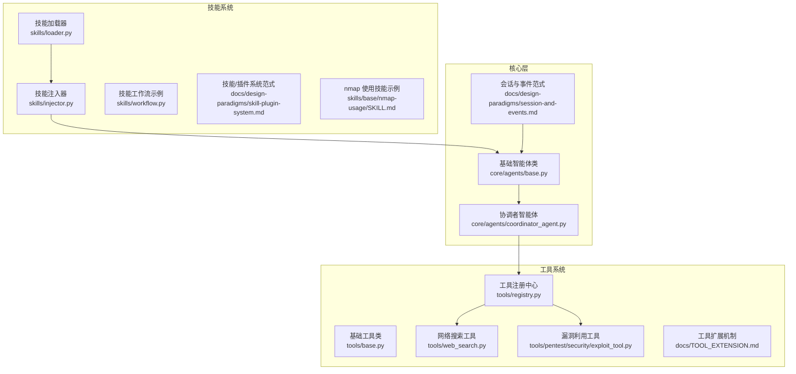
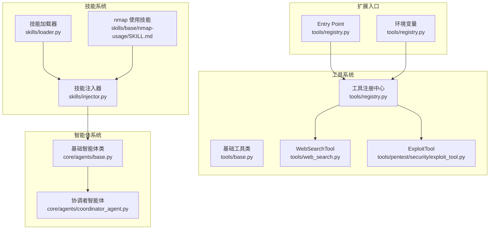
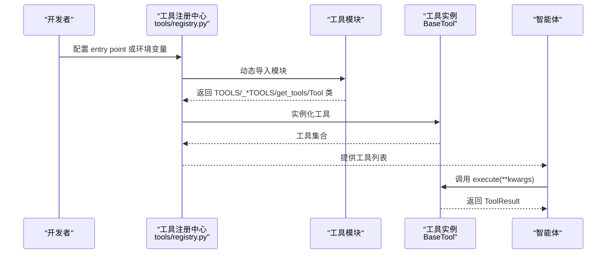
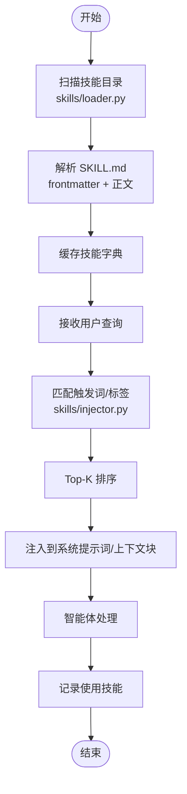
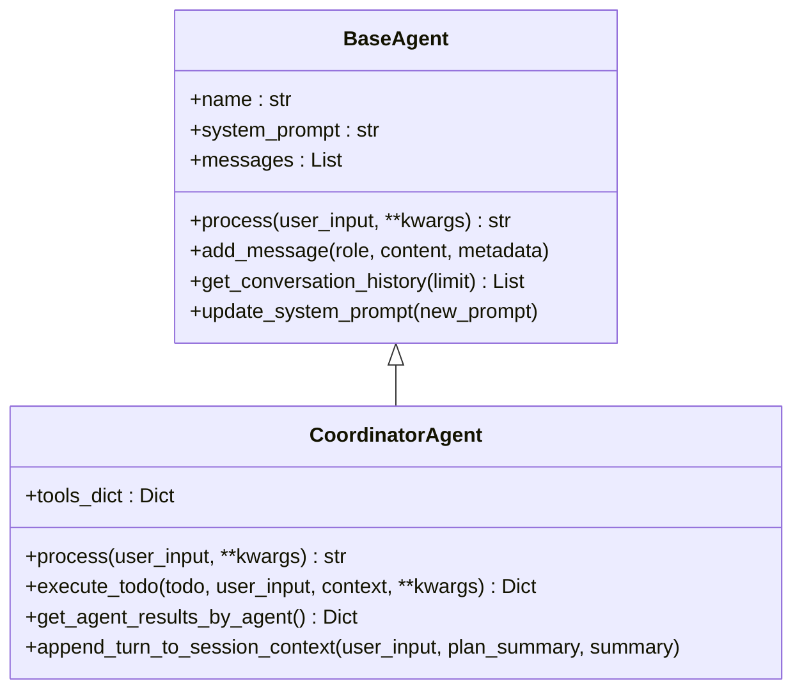
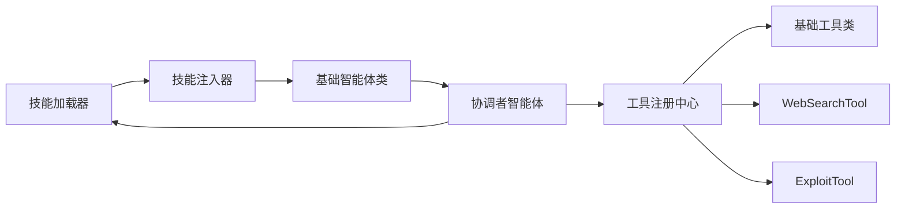

# 扩展模式设计

<cite>
**本文引用的文件**
- [技能/插件系统范式](file://docs/design-paradigms/skill-plugin-system.md)
- [技能注入器](file://skills/injector.py)
- [技能加载器](file://skills/loader.py)
- [技能工作流示例](file://skills/workflow.py)
- [工具注册中心](file://tools/registry.py)
- [基础工具类](file://tools/base.py)
- [工具扩展机制](file://docs/TOOL_EXTENSION.md)
- [网络搜索工具](file://tools/web_search.py)
- [漏洞利用工具](file://tools/pentest/security/exploit_tool.py)
- [基础智能体类](file://core/agents/base.py)
- [协调者智能体](file://core/agents/coordinator_agent.py)
- [会话与事件范式](file://docs/design-paradigms/session-and-events.md)
- [CLI 与依赖注入范式](file://docs/design-paradigms/cli-and-dependencies.md)
- [nmap 使用技能示例](file://skills/base/nmap-usage/SKILL.md)
</cite>

## 目录
1. [引言](#引言)
2. [项目结构](#项目结构)
3. [核心组件](#核心组件)
4. [架构总览](#架构总览)
5. [详细组件分析](#详细组件分析)
6. [依赖分析](#依赖分析)
7. [性能考虑](#性能考虑)
8. [故障排查指南](#故障排查指南)
9. [结论](#结论)
10. [附录](#附录)

## 引言
本文件系统化阐述 Secbot 的扩展模式设计，重点覆盖以下方面：
- 插件化架构与接口抽象：通过统一接口与工厂/注册机制实现松耦合扩展。
- 工具系统扩展：新工具的注册、发现、调用流程与安全分级。
- 技能系统扩展：新技能的加载、注入、执行机制与与智能体的集成钩子。
- 智能体系统扩展：新增智能体类型与现有智能体的定制化策略。
- 扩展点设计图与插件架构图：可视化展示扩展能力边界与交互关系。
- 最佳实践与兼容性保证策略：确保扩展开发的稳定性与可维护性。

## 项目结构
Secbot 采用“分层+插件”的组织方式：
- 核心层：抽象基类、通用模式与会话/事件框架。
- 扩展层：工具注册中心、技能加载与注入、智能体协调器。
- 文档与示例：提供扩展范式、示例技能与工具，指导开发者快速接入。

图表来源
- [基础智能体类](file://core/agents/base.py#L17-L125)
- [协调者智能体](file://core/agents/coordinator_agent.py#L40-L335)
- [工具注册中心](file://tools/registry.py#L106-L142)
- [基础工具类](file://tools/base.py#L16-L36)
- [网络搜索工具](file://tools/web_search.py#L10-L55)
- [漏洞利用工具](file://tools/pentest/security/exploit_tool.py#L6-L53)
- [技能加载器](file://skills/loader.py#L39-L182)
- [技能注入器](file://skills/injector.py#L12-L141)
- [技能工作流示例](file://skills/workflow.py#L1-L86)
- [技能/插件系统范式](file://docs/design-paradigms/skill-plugin-system.md#L1-L42)
- [nmap 使用技能示例](file://skills/base/nmap-usage/SKILL.md#L1-L102)

章节来源
- [CLI 与依赖注入范式](file://docs/design-paradigms/cli-and-dependencies.md#L1-L15)
- [会话与事件范式](file://docs/design-paradigms/session-and-events.md#L30-L36)

## 核心组件
- 工具系统
  - 工具注册中心：支持 entry point 与环境变量两种发现机制，自动加载模块中的工具集合或类实例。
  - 基础工具类：定义统一的工具接口与 Schema，便于 LLM 理解与调用。
- 技能系统
  - 技能加载器：扫描技能目录，解析 SKILL.md 的 frontmatter 与正文，构建技能清单与内容。
  - 技能注入器：根据查询匹配技能触发词与标签，按权重排序并注入到系统提示词或上下文块。
- 智能体系统
  - 基础智能体类：抽象统一的 process 接口与消息模型，支持系统提示词更新与历史管理。
  - 协调者智能体：作为多子智能体的协调入口，按任务路由到专用智能体，聚合结果供汇总。

章节来源
- [工具注册中心](file://tools/registry.py#L106-L142)
- [基础工具类](file://tools/base.py#L16-L36)
- [技能加载器](file://skills/loader.py#L39-L182)
- [技能注入器](file://skills/injector.py#L12-L141)
- [基础智能体类](file://core/agents/base.py#L17-L125)
- [协调者智能体](file://core/agents/coordinator_agent.py#L40-L335)

## 架构总览
Secbot 的扩展架构围绕“接口抽象 + 工厂/注册 + 钩子集成”展开：
- 工具扩展：通过注册中心自动发现工具，支持基础/高级两类工具的差异化加载与安全提示。
- 技能扩展：通过加载器与注入器实现技能的按需注入，与智能体生命周期钩子集成。
- 智能体扩展：通过抽象基类与协调器实现新智能体类型与现有智能体的定制化。

图表来源
- [工具注册中心](file://tools/registry.py#L106-L142)
- [基础工具类](file://tools/base.py#L16-L36)
- [网络搜索工具](file://tools/web_search.py#L10-L55)
- [漏洞利用工具](file://tools/pentest/security/exploit_tool.py#L6-L53)
- [技能加载器](file://skills/loader.py#L39-L182)
- [技能注入器](file://skills/injector.py#L12-L141)
- [nmap 使用技能示例](file://skills/base/nmap-usage/SKILL.md#L1-L102)
- [基础智能体类](file://core/agents/base.py#L17-L125)
- [协调者智能体](file://core/agents/coordinator_agent.py#L40-L335)

## 详细组件分析

### 工具系统扩展机制
- 注册与发现
  - 支持 setuptools entry point 与环境变量两种方式，自动扫描模块属性或类，实例化为工具集合。
  - 基础工具与高级工具分别从不同入口加载，高级工具需用户确认才启用。
- 工具接口与 Schema
  - 统一的工具接口与 Schema 定义，便于 LLM 理解工具能力与参数约束。
- 安全分级
  - 工具可通过敏感度标记区分低/高敏感度，影响是否需要用户确认与加载范围。

图表来源
- [工具注册中心](file://tools/registry.py#L106-L142)
- [基础工具类](file://tools/base.py#L16-L36)
- [网络搜索工具](file://tools/web_search.py#L10-L55)
- [漏洞利用工具](file://tools/pentest/security/exploit_tool.py#L6-L53)

章节来源
- [工具注册中心](file://tools/registry.py#L106-L142)
- [工具扩展机制](file://docs/TOOL_EXTENSION.md#L1-L59)
- [基础工具类](file://tools/base.py#L16-L36)
- [网络搜索工具](file://tools/web_search.py#L10-L55)
- [漏洞利用工具](file://tools/pentest/security/exploit_tool.py#L6-L53)

### 技能系统扩展机制
- 目录与清单
  - 每个技能一个目录，目录内至少包含 SKILL.md；frontmatter 定义清单字段，正文为技能说明。
- 加载与缓存
  - 加载器扫描技能根目录，解析 frontmatter 与正文，缓存为技能字典，支持按名称/标签/触发词查询。
- 注入与生命周期
  - 注入器根据查询匹配技能，按权重排序取 Top-K，注入到系统提示词或上下文块；支持在处理前后记录使用的技能。
- 与智能体集成
  - 通过 before/after 钩子或函数扩展，将技能注入无缝集成到智能体处理流程。

图表来源
- [技能加载器](file://skills/loader.py#L129-L182)
- [技能注入器](file://skills/injector.py#L20-L84)
- [技能/插件系统范式](file://docs/design-paradigms/skill-plugin-system.md#L17-L42)

章节来源
- [技能/插件系统范式](file://docs/design-paradigms/skill-plugin-system.md#L1-L42)
- [技能加载器](file://skills/loader.py#L39-L182)
- [技能注入器](file://skills/injector.py#L12-L141)
- [技能工作流示例](file://skills/workflow.py#L1-L86)
- [nmap 使用技能示例](file://skills/base/nmap-usage/SKILL.md#L1-L102)

### 智能体系统扩展策略
- 新智能体类型添加
  - 继承基础智能体类，实现统一的 process 接口与消息模型，确保与其他组件的兼容性。
- 现有智能体定制化
  - 通过系统提示词更新、会话上下文附加与事件总线集成，实现非侵入式定制。
- 协调器路由
  - 协调者智能体根据任务提示与资源信息路由到专用子智能体，支持结果聚合与摘要。

图表来源
- [基础智能体类](file://core/agents/base.py#L17-L125)
- [协调者智能体](file://core/agents/coordinator_agent.py#L40-L335)

章节来源
- [基础智能体类](file://core/agents/base.py#L17-L125)
- [协调者智能体](file://core/agents/coordinator_agent.py#L40-L335)
- [会话与事件范式](file://docs/design-paradigms/session-and-events.md#L30-L36)

## 依赖分析
- 工具系统依赖
  - 注册中心依赖基础工具类与动态导入机制，支持多种工具提供方式。
  - 工具实现依赖基础工具类的接口与 Schema。
- 技能系统依赖
  - 注入器依赖加载器提供的技能字典；与智能体通过钩子集成。
- 智能体系统依赖
  - 协调者智能体依赖各子智能体与事件总线，负责路由与结果聚合。

图表来源
- [工具注册中心](file://tools/registry.py#L106-L142)
- [基础工具类](file://tools/base.py#L16-L36)
- [网络搜索工具](file://tools/web_search.py#L10-L55)
- [漏洞利用工具](file://tools/pentest/security/exploit_tool.py#L6-L53)
- [技能加载器](file://skills/loader.py#L39-L182)
- [技能注入器](file://skills/injector.py#L12-L141)
- [基础智能体类](file://core/agents/base.py#L17-L125)
- [协调者智能体](file://core/agents/coordinator_agent.py#L40-L335)

章节来源
- [工具注册中心](file://tools/registry.py#L106-L142)
- [技能加载器](file://skills/loader.py#L39-L182)
- [技能注入器](file://skills/injector.py#L12-L141)
- [基础智能体类](file://core/agents/base.py#L17-L125)
- [协调者智能体](file://core/agents/coordinator_agent.py#L40-L335)

## 性能考虑
- 工具加载
  - 通过懒加载与缓存减少重复实例化成本；entry point 与环境变量的组合可按需启用工具集合。
- 技能注入
  - 技能按需注入，避免每次请求重新加载全部技能；Top-K 限制减少提示词长度与 LLM 调用开销。
- 智能体路由
  - 协调者智能体的路由决策基于任务提示与资源信息，减少不必要的智能体切换与上下文切换。

## 故障排查指南
- 工具未被发现
  - 检查 entry point 组名与环境变量配置是否正确；确认模块导出 TOOLS/_*TOOLS 或 get_tools。
- 工具执行异常
  - 核查工具参数与敏感度标记；检查 ToolResult 的错误信息与返回结构。
- 技能未注入
  - 确认 SKILL.md 的 frontmatter 字段与触发词/标签是否与查询匹配；检查注入位置与分隔标记。
- 智能体处理异常
  - 检查系统提示词更新与消息历史；确认事件总线与会话上下文是否正常传递。

章节来源
- [工具扩展机制](file://docs/TOOL_EXTENSION.md#L1-L59)
- [技能/插件系统范式](file://docs/design-paradigms/skill-plugin-system.md#L1-L42)
- [会话与事件范式](file://docs/design-paradigms/session-and-events.md#L30-L36)

## 结论
Secbot 的扩展模式以接口抽象为核心，结合工厂/注册与钩子集成，实现了工具、技能与智能体的高可扩展性与强兼容性。通过清晰的扩展点设计与最佳实践，开发者可以快速、安全地扩展系统能力，同时保持核心逻辑的稳定与可维护性。

## 附录
- 扩展开发最佳实践
  - 工具：遵循基础工具类接口，提供清晰的 Schema 与错误处理；必要时标注敏感度。
  - 技能：规范 SKILL.md 的 frontmatter 字段与正文内容；合理设置触发词与标签。
  - 智能体：继承基础智能体类，实现统一 process 接口；通过钩子或事件总线集成扩展能力。
- 兼容性保证策略
  - 保持接口稳定与向后兼容；通过注册中心与加载器的缓存机制降低变更影响面。
  - 使用事件总线与会话上下文实现核心层与 UI 的解耦，避免紧耦合导致的破坏性变更。