# 数据流设计

<cite>
**本文引用的文件**
- [main.py](file://main.py)
- [router/main.py](file://router/main.py)
- [router/chat.py](file://router/chat.py)
- [core/session.py](file://core/session.py)
- [utils/event_bus.py](file://utils/event_bus.py)
- [core/executor.py](file://core/executor.py)
- [utils/tool_caller.py](file://utils/tool_caller.py)
- [core/models.py](file://core/models.py)
- [terminal-ui/src/sse.ts](file://terminal-ui/src/sse.ts)
- [app/src/api/sse.ts](file://app/src/api/sse.ts)
- [tools/base.py](file://tools/base.py)
- [core/memory/manager.py](file://core/memory/manager.py)
- [database/manager.py](file://database/manager.py)
</cite>

## 目录
1. [简介](#简介)
2. [项目结构](#项目结构)
3. [核心组件](#核心组件)
4. [架构总览](#架构总览)
5. [详细组件分析](#详细组件分析)
6. [依赖关系分析](#依赖关系分析)
7. [性能考量](#性能考量)
8. [故障排查指南](#故障排查指南)
9. [结论](#结论)
10. [附录](#附录)

## 简介
本文件面向Secbot项目的“数据流设计”，系统性阐述从用户输入到最终结果返回的完整数据流转路径与处理机制，覆盖：
- 用户输入数据的接收、预处理与路由
- 智能体处理、工具调用、事件驱动的中间态数据
- SSE流式传输与前端渲染
- 数据格式标准化（JSON、事件结构）、二进制与流式响应
- 会话与记忆、审计留痕、数据库持久化
- 典型场景的数据流图与时序图
- 数据安全与隐私保护要点

## 项目结构
Secbot采用前后端分离的模块化组织：
- 后端：FastAPI应用作为统一入口，路由模块负责HTTP/SSE接口，核心业务逻辑集中在会话编排与任务执行
- 前端：React/React Native应用与终端UI分别消费SSE事件，实时渲染推理过程与结果
- 工具体系：统一的工具抽象与描述生成，支撑智能体的工具调用
- 存储与记忆：SQLite持久化与三层记忆（短期/情节/长期）协同

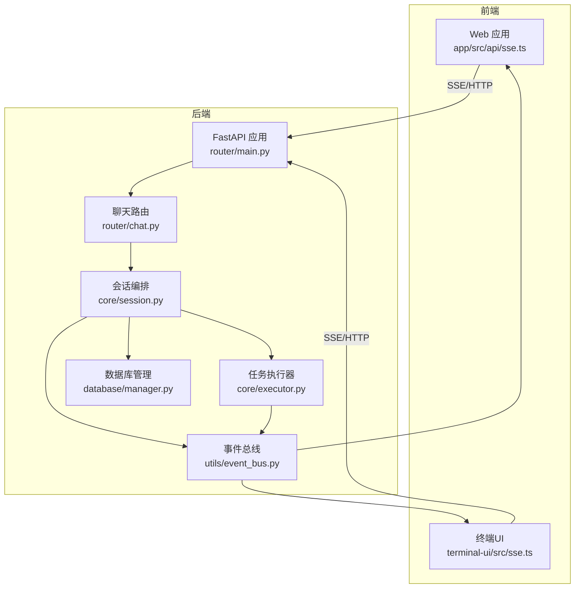

图表来源
- [router/main.py](file://router/main.py#L19-L71)
- [router/chat.py](file://router/chat.py#L27-L329)
- [core/session.py](file://core/session.py#L32-L422)
- [utils/event_bus.py](file://utils/event_bus.py#L68-L187)
- [core/executor.py](file://core/executor.py#L17-L179)
- [database/manager.py](file://database/manager.py#L26-L719)
- [app/src/api/sse.ts](file://app/src/api/sse.ts#L1-L82)
- [terminal-ui/src/sse.ts](file://terminal-ui/src/sse.ts#L33-L134)

章节来源
- [router/main.py](file://router/main.py#L19-L71)
- [router/chat.py](file://router/chat.py#L27-L329)

## 核心组件
- 事件总线（EventBus）：解耦Agent与UI，统一事件类型与数据结构，支持同步/异步发射
- 会话编排（SessionManager）：负责路由、规划、执行、摘要的完整交互流程
- 任务执行器（TaskExecutor）：按层执行计划，支持串行/并行，保障线性渲染
- 工具描述生成（ToolDescriptionGenerator）：为Agent生成工具描述与Schema
- 数据模型（models）：定义Todo/TodoStatus/PlanResult/Session等核心数据结构
- SSE客户端（前端）：解析SSE事件，驱动UI渲染与交互
- 数据库管理（DatabaseManager）：会话历史、审计留痕、配置等持久化
- 记忆管理（MemoryManager）：短期/情节/长期三层记忆，支持检索与蒸馏

章节来源
- [utils/event_bus.py](file://utils/event_bus.py#L68-L187)
- [core/session.py](file://core/session.py#L32-L422)
- [core/executor.py](file://core/executor.py#L17-L179)
- [utils/tool_caller.py](file://utils/tool_caller.py#L10-L119)
- [core/models.py](file://core/models.py#L15-L137)
- [terminal-ui/src/sse.ts](file://terminal-ui/src/sse.ts#L33-L134)
- [app/src/api/sse.ts](file://app/src/api/sse.ts#L1-L82)
- [database/manager.py](file://database/manager.py#L26-L719)
- [core/memory/manager.py](file://core/memory/manager.py#L223-L325)

## 架构总览
后端通过FastAPI统一入口，路由模块注册各类API与健康检查；聊天路由提供SSE流式接口，内部通过SessionManager驱动交互编排，借助EventBus将中间态事件推送到前端。工具调用与任务执行由TaskExecutor协调，最终由摘要Agent生成报告并持久化。

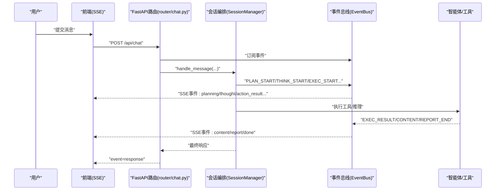

图表来源
- [router/chat.py](file://router/chat.py#L134-L263)
- [core/session.py](file://core/session.py#L139-L422)
- [utils/event_bus.py](file://utils/event_bus.py#L68-L187)

## 详细组件分析

### 1) 用户输入与路由
- 前端通过SSE客户端发起POST请求，携带消息与模式（ask/agent）
- 后端路由将请求映射为SSE事件流，先发送“connected”以避免前端长时间“连接中”
- 会话编排根据模式与LLM路由决定走QA简答或技术链路（规划→执行→摘要）

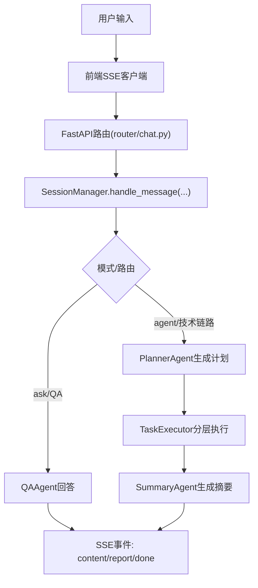

图表来源
- [router/chat.py](file://router/chat.py#L134-L263)
- [core/session.py](file://core/session.py#L139-L422)

章节来源
- [router/chat.py](file://router/chat.py#L27-L329)
- [core/session.py](file://core/session.py#L139-L242)

### 2) 事件总线与数据格式
- 事件类型枚举涵盖规划、推理、执行、内容、报告、任务阶段、错误等
- 事件数据结构统一为Event(type, data, timestamp, iteration)，便于前端解析
- SSE事件名与后端事件类型映射，保证前后端契约一致

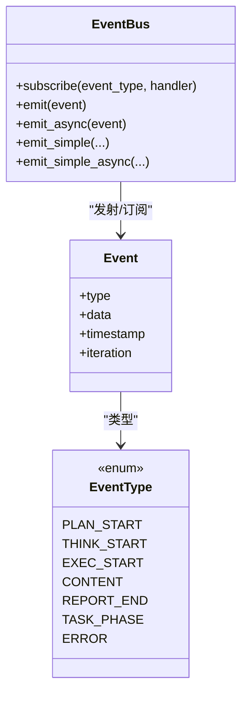

图表来源
- [utils/event_bus.py](file://utils/event_bus.py#L68-L187)

章节来源
- [utils/event_bus.py](file://utils/event_bus.py#L15-L187)

### 3) 会话编排与任务执行
- 会话编排负责消息路由、规划、执行与摘要，桥接Agent事件到EventBus
- TaskExecutor按层执行，支持串行与并行，保证事件线性推送
- 会话上下文与工具结果用于摘要阶段，形成最终报告

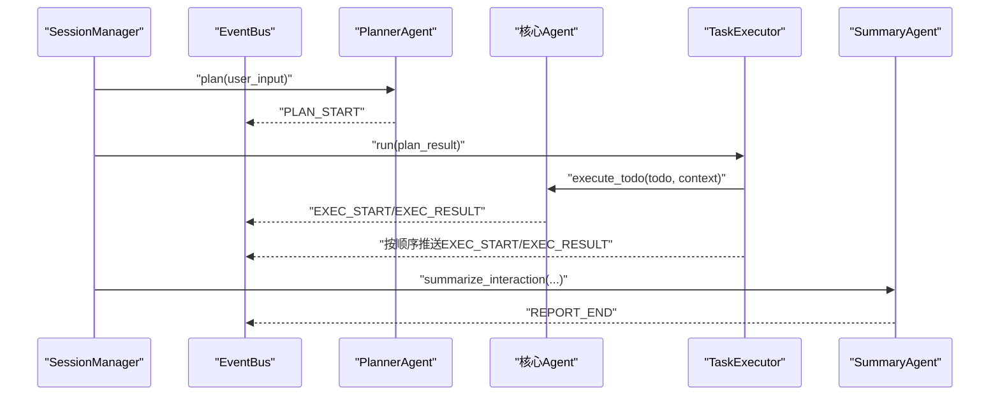

图表来源
- [core/session.py](file://core/session.py#L428-L527)
- [core/executor.py](file://core/executor.py#L46-L134)

章节来源
- [core/session.py](file://core/session.py#L428-L527)
- [core/executor.py](file://core/executor.py#L46-L134)

### 4) 工具调用与描述
- 工具抽象定义统一的ToolResult与Schema，便于Agent调用与提示词注入
- 工具描述生成器提供文本/Markdown格式的工具描述，支持参数说明与示例

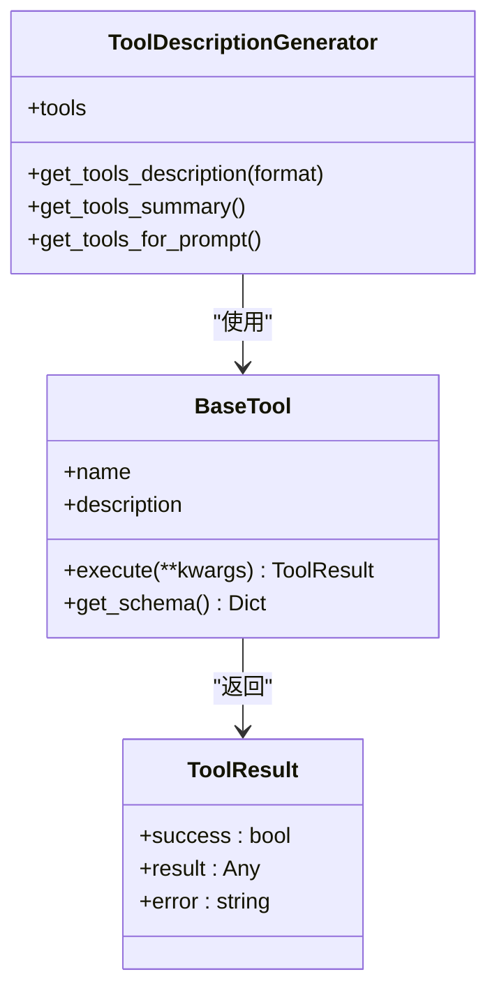

图表来源
- [tools/base.py](file://tools/base.py#L16-L36)
- [utils/tool_caller.py](file://utils/tool_caller.py#L10-L119)

章节来源
- [tools/base.py](file://tools/base.py#L16-L36)
- [utils/tool_caller.py](file://utils/tool_caller.py#L10-L119)

### 5) 数据模型与序列化
- Todo/TodoStatus/PlanResult/SessionMessage/Session等数据模型定义贯穿前端与后端
- JSON序列化用于SSE事件数据与数据库存储（metadata、result等字段）

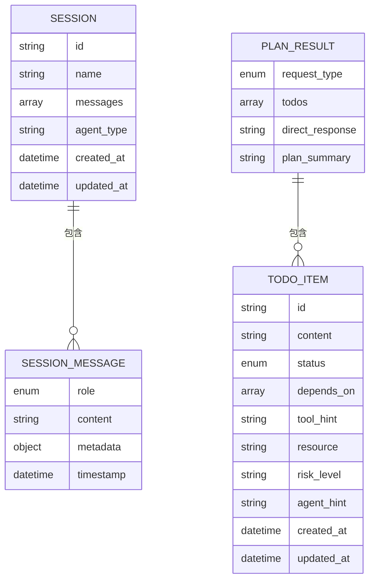

图表来源
- [core/models.py](file://core/models.py#L23-L137)

章节来源
- [core/models.py](file://core/models.py#L15-L137)

### 6) SSE流式传输与前端渲染
- 后端将EventBus事件映射为SSE事件名（planning/thought/action_result/content/report/phase/root_required/error/response/done）
- 前端SSE客户端解析事件，按事件类型更新UI状态，支持“连接超时”与“done”信号

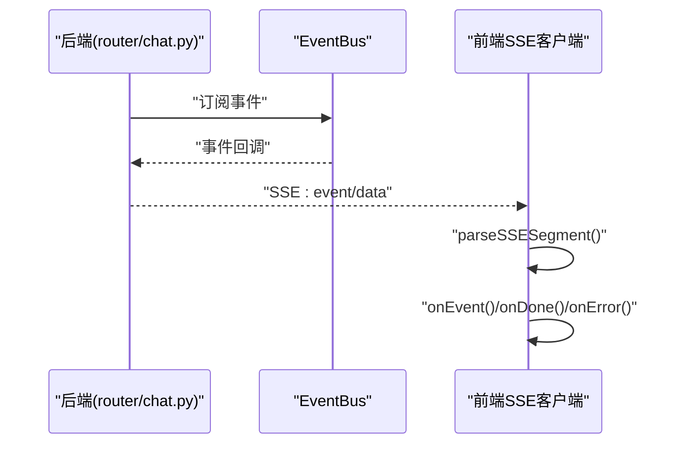

图表来源
- [router/chat.py](file://router/chat.py#L33-L132)
- [terminal-ui/src/sse.ts](file://terminal-ui/src/sse.ts#L14-L134)
- [app/src/api/sse.ts](file://app/src/api/sse.ts#L19-L82)

章节来源
- [router/chat.py](file://router/chat.py#L33-L132)
- [terminal-ui/src/sse.ts](file://terminal-ui/src/sse.ts#L33-L134)
- [app/src/api/sse.ts](file://app/src/api/sse.ts#L1-L82)

### 7) 会话数据存储与持久化
- 会话消息与摘要写入数据库（conversations、audit_trail等表）
- 数据库管理器提供统一的CRUD接口与索引，支持分页与条件查询
- 记忆管理器提供短期/情节/长期记忆，支持检索与蒸馏

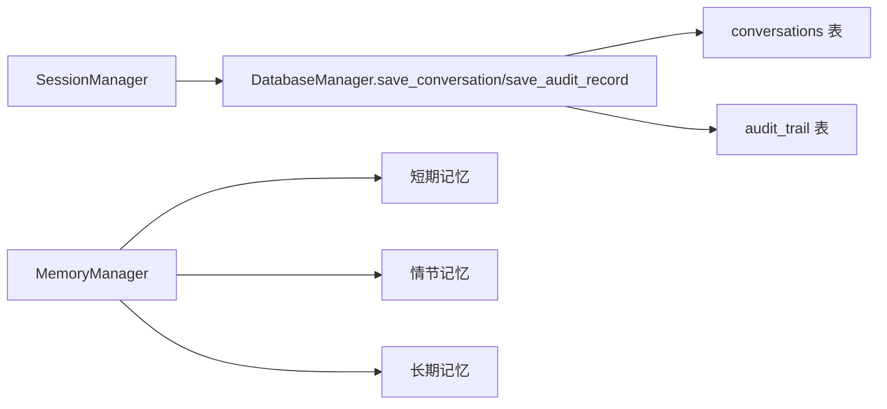

图表来源
- [database/manager.py](file://database/manager.py#L207-L228)
- [database/manager.py](file://database/manager.py#L620-L639)
- [core/memory/manager.py](file://core/memory/manager.py#L223-L325)

章节来源
- [database/manager.py](file://database/manager.py#L207-L228)
- [database/manager.py](file://database/manager.py#L620-L639)
- [core/memory/manager.py](file://core/memory/manager.py#L223-L325)

### 8) 典型场景：流式聊天（ask/agent）
- ask模式：直接走QAAgent，不进行规划与执行
- agent模式：走规划→执行→摘要，期间通过SSE事件流实时反馈

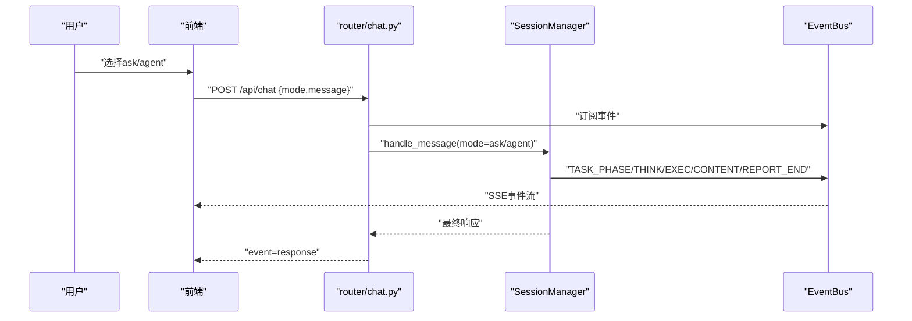

图表来源
- [router/chat.py](file://router/chat.py#L265-L329)
- [core/session.py](file://core/session.py#L139-L422)

章节来源
- [router/chat.py](file://router/chat.py#L265-L329)
- [core/session.py](file://core/session.py#L139-L422)

## 依赖关系分析
- 组件耦合度：EventBus作为核心解耦点，SessionManager与TaskExecutor均依赖其进行事件广播
- 外部依赖：FastAPI、sse-starlette、SQLite、前端SSE客户端
- 潜在风险：SSE事件过多可能导致前端解析压力；工具执行异常需在EventBus中统一上报

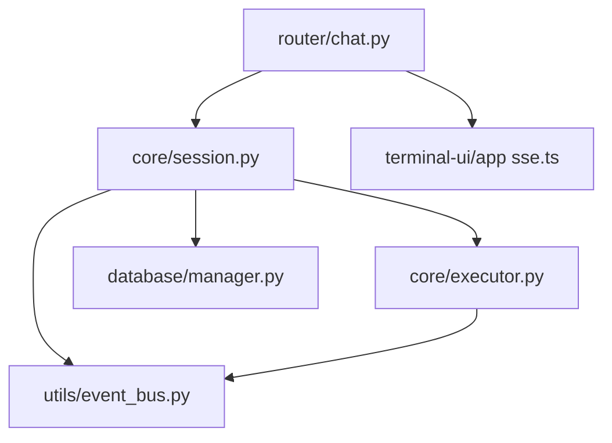

图表来源
- [router/chat.py](file://router/chat.py#L134-L263)
- [core/session.py](file://core/session.py#L32-L422)
- [utils/event_bus.py](file://utils/event_bus.py#L68-L187)
- [core/executor.py](file://core/executor.py#L17-L179)
- [database/manager.py](file://database/manager.py#L26-L719)
- [terminal-ui/src/sse.ts](file://terminal-ui/src/sse.ts#L33-L134)
- [app/src/api/sse.ts](file://app/src/api/sse.ts#L1-L82)

章节来源
- [router/chat.py](file://router/chat.py#L134-L263)
- [core/session.py](file://core/session.py#L32-L422)
- [utils/event_bus.py](file://utils/event_bus.py#L68-L187)
- [core/executor.py](file://core/executor.py#L17-L179)
- [database/manager.py](file://database/manager.py#L26-L719)
- [terminal-ui/src/sse.ts](file://terminal-ui/src/sse.ts#L33-L134)
- [app/src/api/sse.ts](file://app/src/api/sse.ts#L1-L82)

## 性能考量
- 事件驱动渲染：通过SSE事件逐步推送，避免一次性大响应导致前端阻塞
- 并行执行：TaskExecutor按层并发执行，缩短整体时延
- 缓存与记忆：短期/情节/长期记忆减少重复计算与上下文构建成本
- 数据库索引：针对会话与时间戳建立索引，提升查询效率
- 建议：对高频事件进行节流；对工具执行结果进行压缩或分片传输

## 故障排查指南
- SSE连接超时：前端SSE客户端在15秒内未收到事件会触发超时，检查后端是否正常启动与端口占用
- 事件解析异常：SSE客户端尝试JSON解析失败时，会回退为raw数据，关注前端onError回调
- 会话/审计数据缺失：确认数据库初始化与表创建是否成功，检查save_conversation/save_audit_record调用
- 工具执行失败：EventBus会发出ERROR事件，前端监听并展示；后端日志记录异常堆栈

章节来源
- [terminal-ui/src/sse.ts](file://terminal-ui/src/sse.ts#L84-L134)
- [app/src/api/sse.ts](file://app/src/api/sse.ts#L75-L82)
- [database/manager.py](file://database/manager.py#L75-L203)
- [utils/event_bus.py](file://utils/event_bus.py#L137-L156)

## 结论
Secbot通过事件驱动的会话编排与SSE流式传输，实现了从用户输入到工具执行再到结果呈现的完整闭环。统一的数据模型与数据库持久化保障了可观测性与可追溯性，三层记忆体系提升了智能体的上下文能力。建议在生产环境中强化CORS与鉴权、对敏感数据进行脱敏与加密，并对SSE事件进行限速与校验，以进一步提升安全性与稳定性。

## 附录
- 启动入口与后端/TUI组合启动逻辑参见主入口文件
- 健康检查与应用工厂参见FastAPI入口文件

章节来源
- [main.py](file://main.py#L44-L62)
- [router/main.py](file://router/main.py#L74-L101)