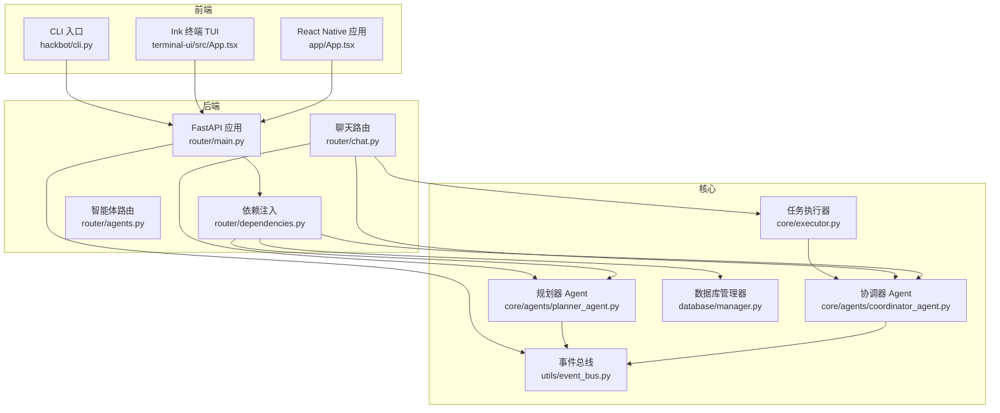
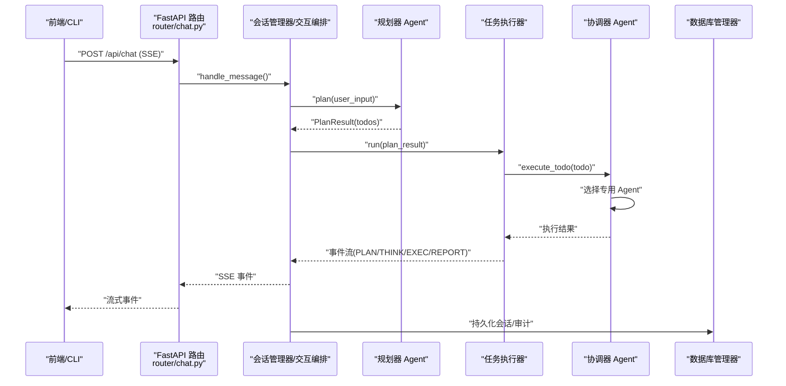
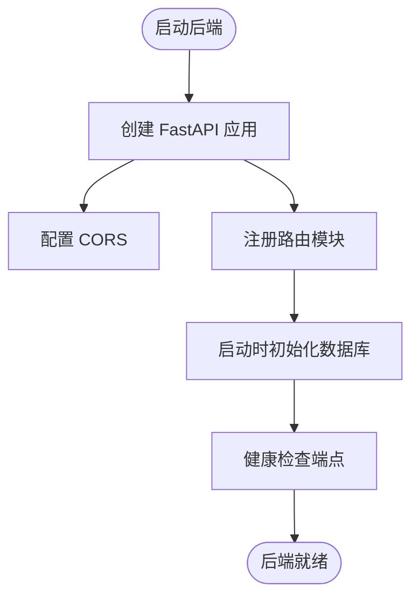
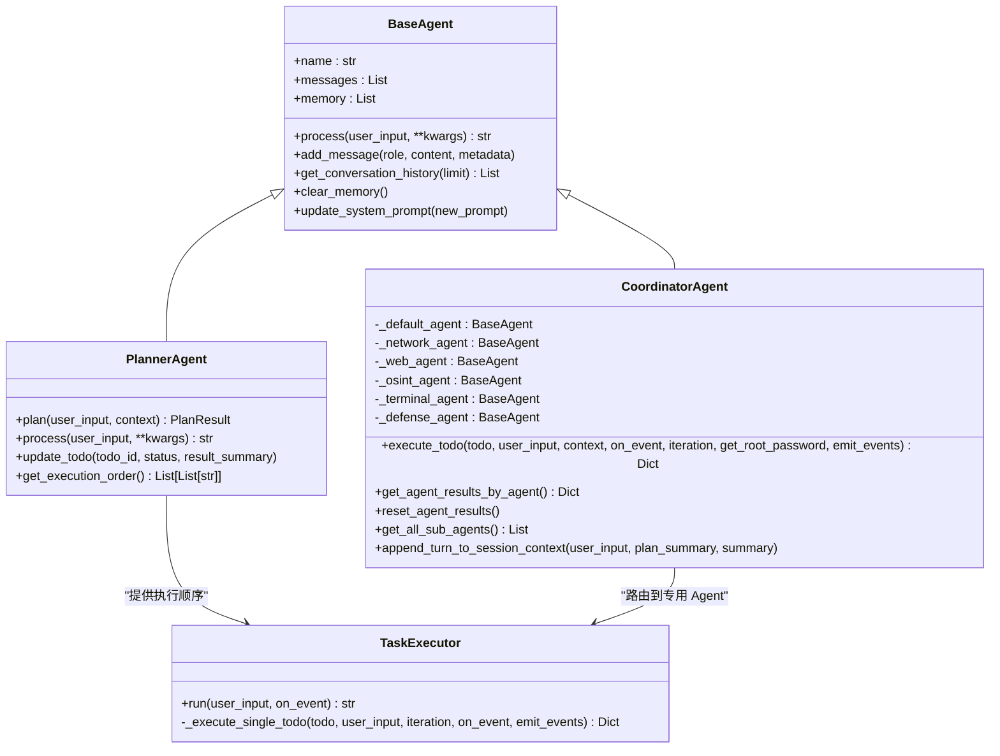
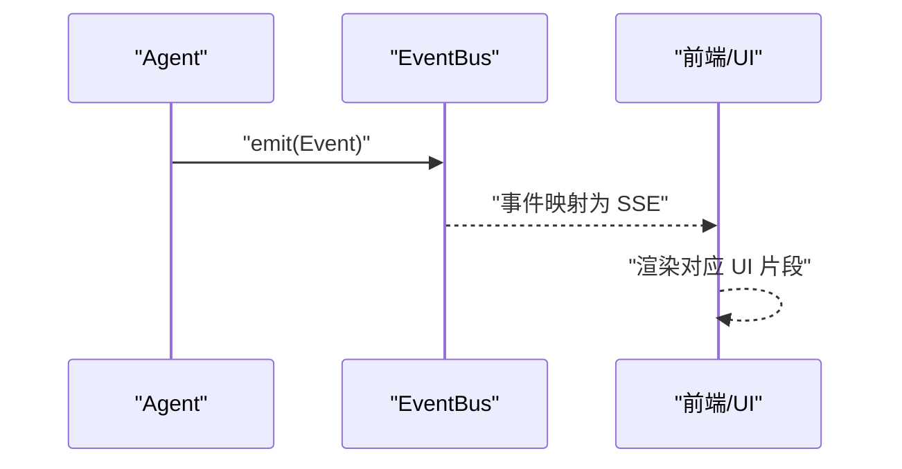
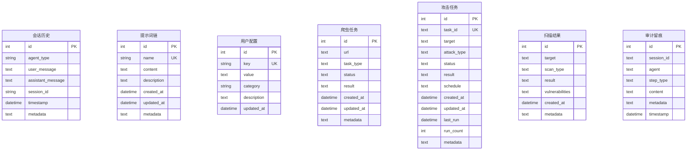
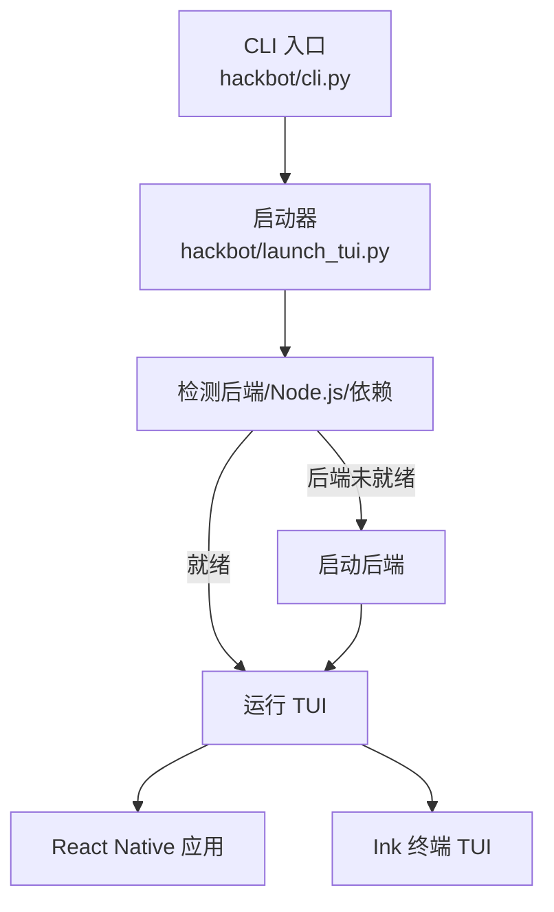
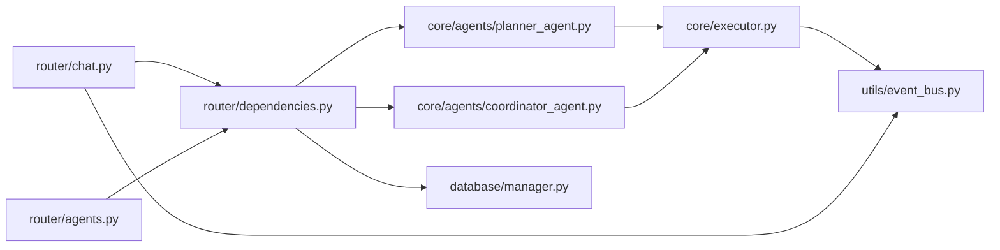

# 整体架构概览

<cite>
**本文档引用的文件**
- [main.py](file://main.py)
- [router/main.py](file://router/main.py)
- [router/dependencies.py](file://router/dependencies.py)
- [router/chat.py](file://router/chat.py)
- [router/agents.py](file://router/agents.py)
- [hackbot/cli.py](file://hackbot/cli.py)
- [hackbot/launch_tui.py](file://hackbot/launch_tui.py)
- [app/App.tsx](file://app/App.tsx)
- [terminal-ui/src/App.tsx](file://terminal-ui/src/App.tsx)
- [core/agents/base.py](file://core/agents/base.py)
- [core/agents/coordinator_agent.py](file://core/agents/coordinator_agent.py)
- [core/agents/planner_agent.py](file://core/agents/planner_agent.py)
- [core/executor.py](file://core/executor.py)
- [database/manager.py](file://database/manager.py)
- [utils/event_bus.py](file://utils/event_bus.py)
</cite>

## 目录
1. [简介](#简介)
2. [项目结构](#项目结构)
3. [核心组件](#核心组件)
4. [架构总览](#架构总览)
5. [详细组件分析](#详细组件分析)
6. [依赖关系分析](#依赖关系分析)
7. [性能考量](#性能考量)
8. [故障排除指南](#故障排除指南)
9. [结论](#结论)

## 简介
Secbot 是一个 AI 驱动的自动化渗透测试机器人，采用前后端分离架构，支持多平台接入：移动端 React Native、命令行终端 TUI、以及基于 FastAPI 的 Web 后端服务。系统通过事件总线解耦表现层与业务层，采用多智能体协作（CoordinatorAgent + 专用 Agent）实现复杂安全任务的规划、执行与汇总。后端提供 REST + SSE 接口，前端通过 SSE 流式渲染推理过程与执行结果，同时支持 CLI 与移动端应用。

## 项目结构
项目采用模块化分层组织：
- 后端服务：router/* 路由与依赖注入，FastAPI 应用工厂与健康检查
- 核心智能体：core/agents/* 基础智能体、协调器、规划器与专用 Agent
- 任务执行：core/executor 任务分层执行器，结合 Planner 的执行顺序
- 数据层：database/* SQLite 管理器与模型
- 事件总线：utils/event_bus 轻量事件总线，支撑 UI 与 Agent 解耦
- 前端与 CLI：app/* React Native 移动端，terminal-ui/* Ink 终端 TUI，hackbot/* CLI 入口
- 工具与技能：tools/* 安全工具集合，skills/* 技能加载与工作流

图表来源
- [router/main.py](file://router/main.py#L19-L71)
- [router/dependencies.py](file://router/dependencies.py#L34-L135)
- [router/chat.py](file://router/chat.py#L134-L263)
- [router/agents.py](file://router/agents.py#L18-L31)
- [core/agents/coordinator_agent.py](file://core/agents/coordinator_agent.py#L40-L98)
- [core/agents/planner_agent.py](file://core/agents/planner_agent.py#L20-L81)
- [core/executor.py](file://core/executor.py#L17-L38)
- [utils/event_bus.py](file://utils/event_bus.py#L68-L76)
- [database/manager.py](file://database/manager.py#L26-L58)

章节来源
- [router/main.py](file://router/main.py#L19-L71)
- [router/dependencies.py](file://router/dependencies.py#L34-L135)
- [router/chat.py](file://router/chat.py#L134-L263)
- [router/agents.py](file://router/agents.py#L18-L31)
- [core/agents/coordinator_agent.py](file://core/agents/coordinator_agent.py#L40-L98)
- [core/agents/planner_agent.py](file://core/agents/planner_agent.py#L20-L81)
- [core/executor.py](file://core/executor.py#L17-L38)
- [utils/event_bus.py](file://utils/event_bus.py#L68-L76)
- [database/manager.py](file://database/manager.py#L26-L58)

## 核心组件
- 后端服务入口与路由装配：FastAPI 应用工厂、CORS、路由注册、健康检查
- 依赖注入与单例容器：延迟初始化核心服务（数据库、提示词、审计、智能体、控制器）
- 聊天与会话编排：SSE 流式接口，事件映射，根权限请求处理
- 智能体体系：基础智能体抽象、协调器（多 Agent 协作）、规划器（结构化任务规划）
- 任务执行器：按拓扑分层与资源/风险约束并发执行
- 事件总线：统一事件类型与发布订阅，支持同步/异步处理器
- 数据层：SQLite 表结构与 CRUD 操作封装
- 前端与 CLI：React Native 移动端、Ink 终端 TUI、CLI 启动器

章节来源
- [router/main.py](file://router/main.py#L19-L71)
- [router/dependencies.py](file://router/dependencies.py#L34-L135)
- [router/chat.py](file://router/chat.py#L134-L263)
- [core/agents/base.py](file://core/agents/base.py#L17-L34)
- [core/agents/coordinator_agent.py](file://core/agents/coordinator_agent.py#L40-L98)
- [core/agents/planner_agent.py](file://core/agents/planner_agent.py#L20-L81)
- [core/executor.py](file://core/executor.py#L17-L38)
- [utils/event_bus.py](file://utils/event_bus.py#L68-L76)
- [database/manager.py](file://database/manager.py#L26-L58)

## 架构总览
Secbot 采用“表现层-业务逻辑层-数据访问层”的分层设计：
- 表现层：React Native（移动端）、Ink 终端 TUI、CLI，均通过 HTTP/SSE 与后端交互
- 业务逻辑层：FastAPI 路由编排 SessionManager/PlannerAgent/CoordinatorAgent/TaskExecutor，事件总线驱动 UI 渲染
- 数据访问层：SQLite 数据库管理器，提供会话、提示词链、用户配置、任务与审计留痕等表

多智能体协作采用 A2A（Agent-to-Agent）架构：规划器生成结构化 Todo，执行器按层调度，协调器根据 Todo 的 agent_hint/resource 将任务路由到专用 Agent（网络侦察、Web 渗透、OSINT、终端操作、防御监控），最终由汇总智能体生成报告。

图表来源
- [router/chat.py](file://router/chat.py#L134-L263)
- [core/agents/planner_agent.py](file://core/agents/planner_agent.py#L86-L128)
- [core/executor.py](file://core/executor.py#L46-L133)
- [core/agents/coordinator_agent.py](file://core/agents/coordinator_agent.py#L130-L181)
- [database/manager.py](file://database/manager.py#L207-L228)

## 详细组件分析

### 后端服务与路由
- 应用工厂：创建 FastAPI 实例，注册 CORS，挂载多路由模块，启动时初始化数据库，提供健康检查端点
- 依赖注入：单例容器延迟加载数据库、提示词、审计、智能体、控制器等核心服务
- 聊天路由：SSE 流式输出，事件映射到前端事件名，支持根权限请求与同步聊天接口
- 智能体路由：列出可用智能体与清空记忆

图表来源
- [router/main.py](file://router/main.py#L19-L71)

章节来源
- [router/main.py](file://router/main.py#L19-L71)
- [router/dependencies.py](file://router/dependencies.py#L34-L135)
- [router/chat.py](file://router/chat.py#L134-L263)
- [router/agents.py](file://router/agents.py#L18-L31)

### 智能体与多智能体协作
- 基础智能体：统一的消息历史、系统提示词、对话记忆管理
- 协调器 Agent：对外暴露 hackbot，内部持有默认 Agent 与专用 Agent，按 Todo 的 agent_hint/resource 路由执行，聚合结果供汇总
- 规划器 Agent：结构化任务规划，生成 TodoList，计算分层执行顺序，推断资源与风险等级
- 任务执行器：依据规划的分层顺序串行或并发执行，事件驱动 UI 渲染

图表来源
- [core/agents/base.py](file://core/agents/base.py#L17-L34)
- [core/agents/coordinator_agent.py](file://core/agents/coordinator_agent.py#L40-L98)
- [core/agents/planner_agent.py](file://core/agents/planner_agent.py#L20-L81)
- [core/executor.py](file://core/executor.py#L17-L38)

章节来源
- [core/agents/base.py](file://core/agents/base.py#L17-L34)
- [core/agents/coordinator_agent.py](file://core/agents/coordinator_agent.py#L40-L98)
- [core/agents/planner_agent.py](file://core/agents/planner_agent.py#L20-L81)
- [core/executor.py](file://core/executor.py#L17-L38)

### 事件总线与 UI 解耦
- 事件类型：规划、思考、执行、内容、报告、任务阶段、交互控制、UI 反馈等
- 发布订阅：支持同步与异步处理器，全局处理器与特定类型处理器
- UI 驱动：前端通过 SSE 接收事件，按事件类型渲染不同 UI 片段

图表来源
- [utils/event_bus.py](file://utils/event_bus.py#L68-L76)
- [router/chat.py](file://router/chat.py#L33-L131)

章节来源
- [utils/event_bus.py](file://utils/event_bus.py#L68-L76)
- [router/chat.py](file://router/chat.py#L33-L131)

### 数据层与持久化
- 数据库管理器：初始化表结构（会话、提示词链、用户配置、爬虫任务、攻击任务、扫描结果、审计留痕），提供 CRUD 与统计
- 启动时初始化：FastAPI 应用启动时触发数据库初始化，确保首次请求前表存在

图表来源
- [database/manager.py](file://database/manager.py#L75-L203)

章节来源
- [database/manager.py](file://database/manager.py#L26-L58)
- [database/manager.py](file://database/manager.py#L75-L203)

### 前端与 CLI 启动流程
- CLI 入口：提供帮助信息与启动选项（后端/终端 TUI），统一错误处理
- 启动器：检测后端运行状态、端口占用、Node.js 环境，按需启动后端与 TUI
- React Native：底部导航 Tab，集成多个功能页面
- 终端 TUI：Ink 组件化 UI，支持命令面板、对话框、会话视图与事件驱动反馈

图表来源
- [hackbot/cli.py](file://hackbot/cli.py#L32-L79)
- [hackbot/launch_tui.py](file://hackbot/launch_tui.py#L291-L342)
- [app/App.tsx](file://app/App.tsx#L28-L108)
- [terminal-ui/src/App.tsx](file://terminal-ui/src/App.tsx#L26-L201)

章节来源
- [hackbot/cli.py](file://hackbot/cli.py#L32-L79)
- [hackbot/launch_tui.py](file://hackbot/launch_tui.py#L291-L342)
- [app/App.tsx](file://app/App.tsx#L28-L108)
- [terminal-ui/src/App.tsx](file://terminal-ui/src/App.tsx#L26-L201)

## 依赖关系分析
- 路由依赖：chat/agents 路由依赖依赖注入模块提供的智能体、规划器、QA 汇总与数据库
- 协同关系：Planner 生成 PlanResult，TaskExecutor 读取执行顺序，Coordinator 路由到专用 Agent，事件总线贯穿 UI 渲染
- 数据依赖：数据库管理器在应用启动时初始化，为会话与审计留痕提供持久化

图表来源
- [router/chat.py](file://router/chat.py#L15-L21)
- [router/agents.py](file://router/agents.py#L7-L13)
- [router/dependencies.py](file://router/dependencies.py#L9-L22)
- [core/agents/coordinator_agent.py](file://core/agents/coordinator_agent.py#L26-L34)
- [core/agents/planner_agent.py](file://core/agents/planner_agent.py#L15-L17)
- [core/executor.py](file://core/executor.py#L12-L14)
- [utils/event_bus.py](file://utils/event_bus.py#L68-L76)
- [database/manager.py](file://database/manager.py#L26-L58)

章节来源
- [router/chat.py](file://router/chat.py#L15-L21)
- [router/agents.py](file://router/agents.py#L7-L13)
- [router/dependencies.py](file://router/dependencies.py#L9-L22)
- [core/agents/coordinator_agent.py](file://core/agents/coordinator_agent.py#L26-L34)
- [core/agents/planner_agent.py](file://core/agents/planner_agent.py#L15-L17)
- [core/executor.py](file://core/executor.py#L12-L14)
- [utils/event_bus.py](file://utils/event_bus.py#L68-L76)
- [database/manager.py](file://database/manager.py#L26-L58)

## 性能考量
- 并发执行：任务执行器在每层内按资源/风险约束进行安全并发，避免高风险操作在同一资源上并行
- 事件驱动渲染：前端通过 SSE 流式接收事件，减少长轮询与大体积响应
- 延迟初始化：依赖注入容器延迟加载重型模块，缩短启动时间
- SQLite 本地存储：适合开发与小规模使用，生产环境可评估替换为更健壮的数据库方案

## 故障排除指南
- 后端端口占用：启动器检测 8000 端口占用并尝试终止占用进程，必要时提示手动清理
- Node.js/依赖缺失：TUI 启动前检查 Node.js、terminal-ui 目录与 node_modules，缺失时提示安装
- SSE 连接问题：路由先发送 connected 事件，避免前端长时间处于“连接中”
- 根权限请求：当需要 root 权限时，后端发出 root_required 事件，前端弹窗等待用户选择与密码

章节来源
- [hackbot/launch_tui.py](file://hackbot/launch_tui.py#L47-L98)
- [hackbot/launch_tui.py](file://hackbot/launch_tui.py#L270-L288)
- [router/chat.py](file://router/chat.py#L141-L145)
- [router/chat.py](file://router/chat.py#L172-L187)

## 结论
Secbot 通过前后端分离与事件驱动架构，实现了多平台接入与多智能体协作。后端以 FastAPI 为核心，配合依赖注入与事件总线，将表现层与业务逻辑解耦；核心智能体体系以规划器生成结构化任务，执行器按层调度，协调器路由到专用 Agent，最终形成可观察、可审计、可扩展的自动化渗透测试框架。技术选型在易用性与可维护性之间取得平衡，适合在开发与测试环境中快速迭代与扩展。