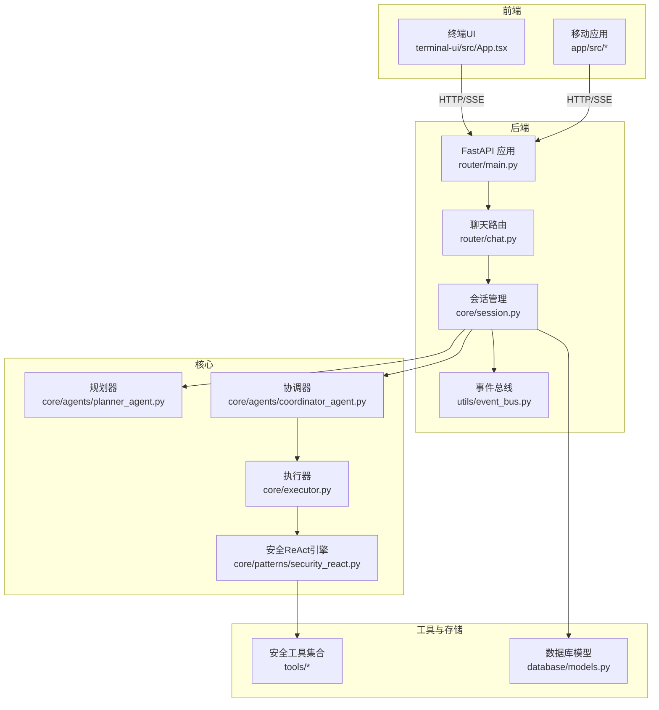
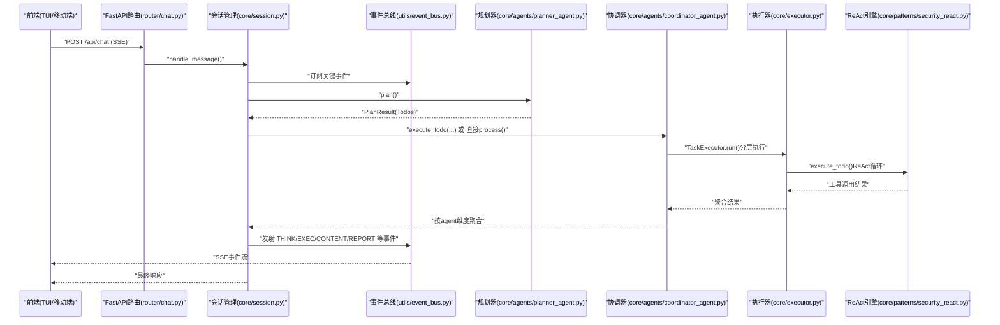
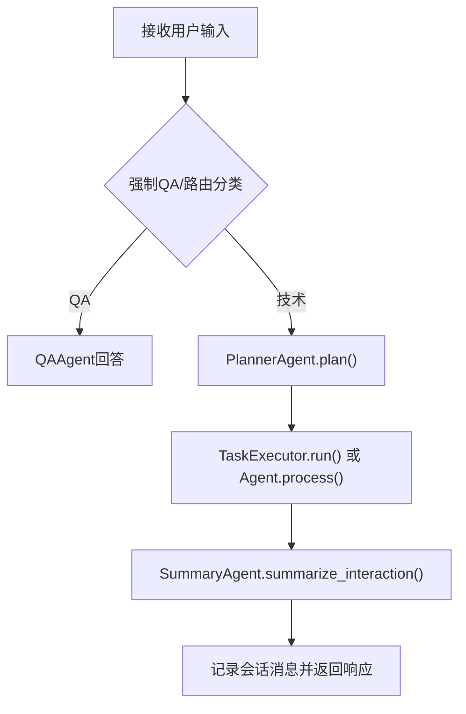
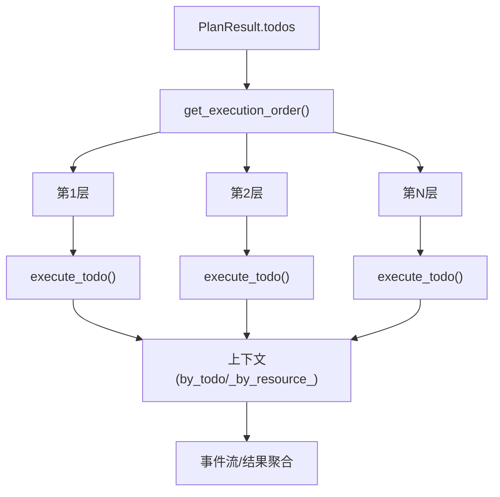
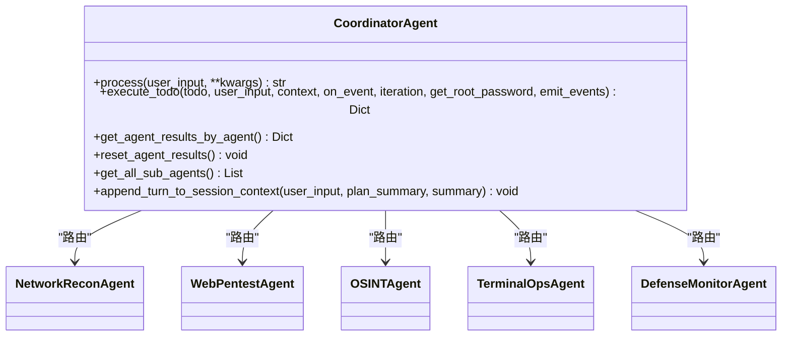
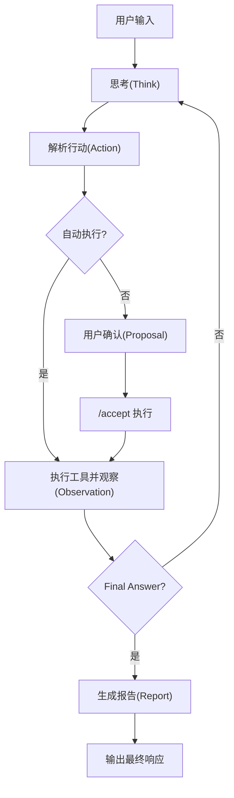
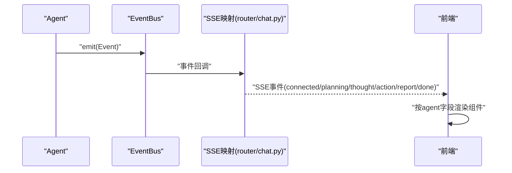
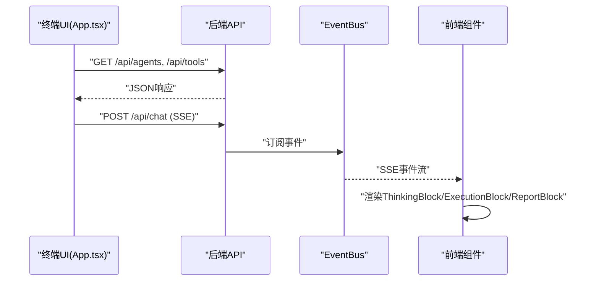
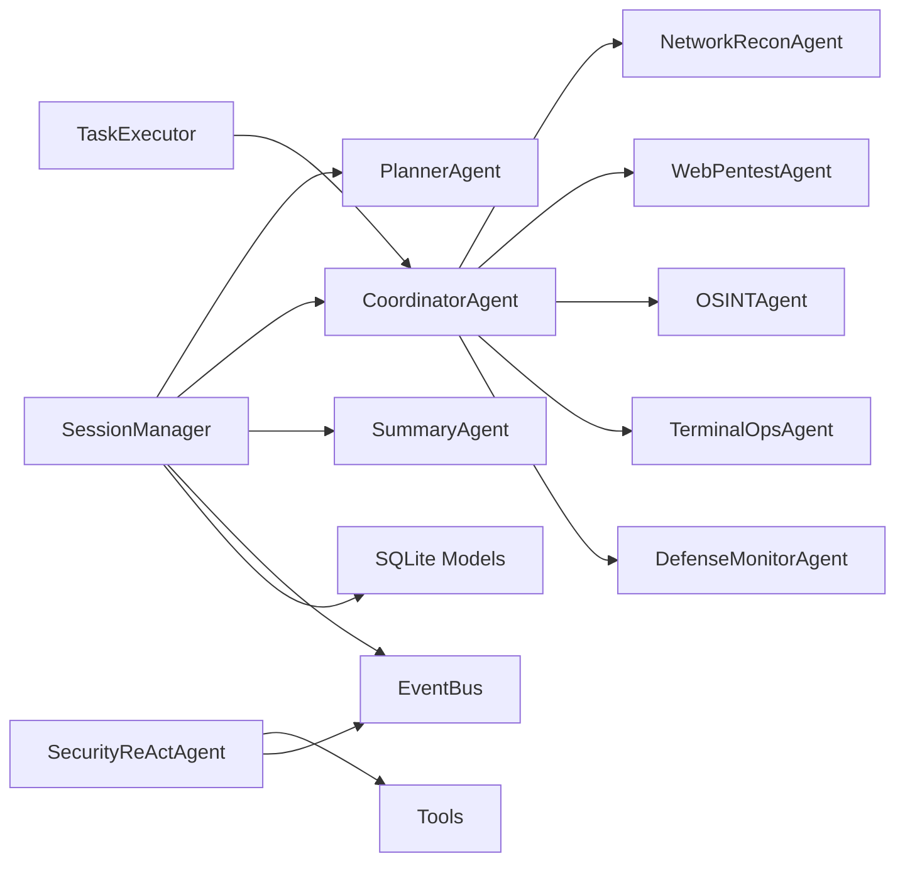

# 架构设计

<cite>
**本文引用的文件**
- [README_EN.md](file://README_EN.md)
- [main.py](file://main.py)
- [router/main.py](file://router/main.py)
- [router/chat.py](file://router/chat.py)
- [core/session.py](file://core/session.py)
- [core/models.py](file://core/models.py)
- [core/agents/base.py](file://core/agents/base.py)
- [core/agents/coordinator_agent.py](file://core/agents/coordinator_agent.py)
- [core/executor.py](file://core/executor.py)
- [utils/event_bus.py](file://utils/event_bus.py)
- [core/patterns/security_react.py](file://core/patterns/security_react.py)
- [database/models.py](file://database/models.py)
- [terminal-ui/src/App.tsx](file://terminal-ui/src/App.tsx)
</cite>

## 目录
1. [引言](#引言)
2. [项目结构](#项目结构)
3. [核心组件](#核心组件)
4. [架构总览](#架构总览)
5. [详细组件分析](#详细组件分析)
6. [依赖分析](#依赖分析)
7. [性能考量](#性能考量)
8. [故障排查指南](#故障排查指南)
9. [结论](#结论)
10. [附录](#附录)

## 引言
本文件面向Secbot项目的架构设计文档，系统化阐述其分层架构、事件驱动机制、多智能体协作模式与扩展性设计。文档以“前端客户端层 → 后端路由层 → 会话编排层 → 规划执行层 → 多智能体协调层 → 工具层 → 存储层”的视角，结合ReAct模式、事件总线模式、工厂模式等设计模式，帮助开发者快速理解系统整体设计思路与实现原理。

## 项目结构
Secbot采用前后端分离与模块化组织：
- 前端：TypeScript/React终端界面（Ink）与移动端应用（React Native），通过HTTP/SSE与后端通信。
- 后端：FastAPI服务，提供REST与SSE接口，封装会话编排、事件总线与工具调用。
- 核心业务：会话管理、规划器、执行器、多智能体协调器、安全ReAct引擎、事件总线、数据库模型等。
- 工具与插件：安全扫描、网络探测、终端会话、报告生成、OSINT与Web研究等工具集合。
- 文档与脚手架：安装、部署、模型配置、数据库与Docker等文档与脚本。

**图表来源**
- [router/main.py](file://router/main.py#L19-L71)
- [router/chat.py](file://router/chat.py#L27-L271)
- [core/session.py](file://core/session.py#L32-L122)
- [utils/event_bus.py](file://utils/event_bus.py#L68-L186)
- [core/agents/coordinator_agent.py](file://core/agents/coordinator_agent.py#L40-L98)
- [core/executor.py](file://core/executor.py#L17-L38)
- [core/patterns/security_react.py](file://core/patterns/security_react.py#L142-L190)
- [database/models.py](file://database/models.py#L9-L89)

**章节来源**
- [README_EN.md](file://README_EN.md#L67-L200)
- [router/main.py](file://router/main.py#L19-L71)

## 核心组件
- 会话编排层（SessionManager）：负责路由、规划、执行与摘要的完整交互编排，维护会话生命周期与消息历史，桥接事件总线。
- 规划执行层（PlannerAgent + TaskExecutor）：将用户请求分解为带依赖与资源约束的Todo清单，按层并行/串行执行。
- 多智能体协调层（CoordinatorAgent）：在分层执行模式下，依据Todo的agent_hint/resource将任务路由到专用子Agent，聚合结果供摘要。
- 安全ReAct引擎（SecurityReActAgent）：LLM驱动的推理-行动循环，支持自动执行与用户确认两种模式，事件化输出思考、行动与观察。
- 事件总线（EventBus）：解耦Agent与UI，统一事件类型与桥接，支撑SSE流式渲染。
- 工具层（tools/*）：涵盖网络扫描、Web渗透、终端会话、报告生成、OSINT与Web研究等工具集合。
- 存储层（SQLite）：会话、提示词链、用户配置、爬虫任务、攻击任务、扫描结果与审计记录等模型。

**章节来源**
- [core/session.py](file://core/session.py#L32-L122)
- [core/agents/coordinator_agent.py](file://core/agents/coordinator_agent.py#L40-L98)
- [core/executor.py](file://core/executor.py#L17-L38)
- [utils/event_bus.py](file://utils/event_bus.py#L68-L186)
- [core/patterns/security_react.py](file://core/patterns/security_react.py#L142-L190)
- [database/models.py](file://database/models.py#L9-L89)

## 架构总览
Secbot采用“事件驱动 + 多智能体协作”的分层架构：
- 前端通过SSE订阅后端事件，实时渲染思考、行动与报告。
- 后端路由层将请求封装为会话交互，交由会话管理器编排。
- 会话管理器根据请求类型决定走QA或技术链路，技术链路先规划再执行，最后摘要。
- 执行阶段支持分层并行与串行，协调器将任务路由到专用子Agent，ReAct引擎负责推理-行动循环。
- 事件总线贯穿Agent与UI，统一事件类型，前端按agent字段区分来源。
- 工具层提供丰富的安全能力，存储层持久化会话与审计信息。

**图表来源**
- [router/chat.py](file://router/chat.py#L134-L263)
- [core/session.py](file://core/session.py#L139-L422)
- [core/agents/coordinator_agent.py](file://core/agents/coordinator_agent.py#L130-L181)
- [core/executor.py](file://core/executor.py#L46-L133)
- [core/patterns/security_react.py](file://core/patterns/security_react.py#L393-L628)
- [utils/event_bus.py](file://utils/event_bus.py#L15-L53)

**章节来源**
- [README_EN.md](file://README_EN.md#L67-L153)

## 详细组件分析

### 会话编排层（SessionManager）
- 职责：路由（QA/技术）、规划、执行、摘要；维护会话上下文与消息历史；桥接事件总线。
- 关键流程：
  - 路由：通过LLM分类决定走QA或技术链路。
  - 规划：调用PlannerAgent生成PlanResult与Todos。
  - 执行：支持TaskExecutor分层执行或经典ReAct循环；自动更新Todo状态。
  - 摘要：汇总ReAct历史与工具结果，生成结构化报告。
- 事件桥接：将Agent回调标准化为EventBus事件，自动标注agent来源，更新Todo状态。

**图表来源**
- [core/session.py](file://core/session.py#L139-L422)

**章节来源**
- [core/session.py](file://core/session.py#L32-L122)
- [core/session.py](file://core/session.py#L139-L422)

### 规划执行层（PlannerAgent + TaskExecutor）
- PlannerAgent：将用户请求拆分为Todo清单，考虑依赖关系、资源与风险，构建可并行的安全执行序列。
- TaskExecutor：按层执行Todos，层内并行，层间串行，聚合上下文（按Todo与按资源），统一事件推送。

**图表来源**
- [core/executor.py](file://core/executor.py#L46-L133)
- [core/models.py](file://core/models.py#L23-L60)

**章节来源**
- [core/executor.py](file://core/executor.py#L17-L38)
- [core/models.py](file://core/models.py#L23-L60)

### 多智能体协调层（CoordinatorAgent）
- 职责：在分层执行模式下，根据Todo的agent_hint/resource将任务路由到专用子Agent（网络侦察、Web渗透、OSINT、终端操作、防御监控）。
- 结果聚合：按agent维度聚合工具执行结果，供摘要阶段使用。
- 兼容性：普通对话/同步模式下回退到默认HackbotAgent，保持向后兼容。

**图表来源**
- [core/agents/coordinator_agent.py](file://core/agents/coordinator_agent.py#L40-L213)

**章节来源**
- [core/agents/coordinator_agent.py](file://core/agents/coordinator_agent.py#L40-L98)
- [core/agents/coordinator_agent.py](file://core/agents/coordinator_agent.py#L130-L181)

### 安全ReAct引擎（SecurityReActAgent）
- 模式：支持自动执行（hackbot）与用户确认（superhackbot）两种模式。
- 核心：Think → Action → Observation → Final Answer，事件化输出，支持流式思考片段。
- 工具：通过工具字典选择工具，严格按计划顺序执行，高敏感工具需用户确认。
- 审计：记录每个步骤与结果，支持会话上下文摘要累积。

**图表来源**
- [core/patterns/security_react.py](file://core/patterns/security_react.py#L393-L628)

**章节来源**
- [core/patterns/security_react.py](file://core/patterns/security_react.py#L142-L190)
- [core/patterns/security_react.py](file://core/patterns/security_react.py#L393-L628)

### 事件总线（EventBus）与SSE映射
- 事件类型：规划、推理、执行、内容、报告、任务阶段、会话更新、错误等。
- SSE映射：将EventBus事件映射为SSE事件名称与数据，前端按agent字段区分来源。
- 并发：支持同步与异步事件处理，事件回调自动附加agent标签。

**图表来源**
- [utils/event_bus.py](file://utils/event_bus.py#L68-L186)
- [router/chat.py](file://router/chat.py#L33-L131)

**章节来源**
- [utils/event_bus.py](file://utils/event_bus.py#L15-L53)
- [router/chat.py](file://router/chat.py#L33-L131)

### 前端交互（终端UI）
- 终端UI基于Ink/React，通过HTTP/SSE与后端交互，支持命令面板、对话模式切换、智能体选择、模型配置与REST结果展示。
- 事件驱动：Toast、对话框与路由均通过事件总线驱动。

**图表来源**
- [terminal-ui/src/App.tsx](file://terminal-ui/src/App.tsx#L18-L201)
- [router/chat.py](file://router/chat.py#L265-L271)

**章节来源**
- [terminal-ui/src/App.tsx](file://terminal-ui/src/App.tsx#L18-L201)

## 依赖分析
- 组件耦合：
  - SessionManager依赖Planner、Coordinator、SummaryAgent与EventBus，形成编排闭环。
  - CoordinatorAgent依赖各专用子Agent与工具字典，负责路由与聚合。
  - TaskExecutor依赖Planner的执行顺序与Agent的execute_todo接口。
  - SecurityReActAgent依赖工具字典、LLM与事件总线，支持流式输出与审计。
- 外部依赖：
  - FastAPI、sse-starlette、uvicorn、rich、pydantic、sqlalchemy、langchain系列等。
- 潜在循环依赖：通过事件总线与接口契约避免直接循环引用。

**图表来源**
- [core/session.py](file://core/session.py#L14-L58)
- [core/agents/coordinator_agent.py](file://core/agents/coordinator_agent.py#L26-L92)
- [core/executor.py](file://core/executor.py#L24-L36)
- [core/patterns/security_react.py](file://core/patterns/security_react.py#L163-L176)
- [database/models.py](file://database/models.py#L9-L89)

**章节来源**
- [core/session.py](file://core/session.py#L14-L58)
- [core/agents/coordinator_agent.py](file://core/agents/coordinator_agent.py#L26-L92)
- [core/executor.py](file://core/executor.py#L24-L36)
- [core/patterns/security_react.py](file://core/patterns/security_react.py#L163-L176)
- [database/models.py](file://database/models.py#L9-L89)

## 性能考量
- 并行执行：TaskExecutor按层并行执行，显著缩短长链路任务耗时。
- 事件流式渲染：SSE与事件总线支持边执行边渲染，提升用户体验。
- LLM调用：提供流式与非流式两种调用路径，超时与错误提示增强鲁棒性。
- 并发控制：Agent内部并发锁确保同一Agent串行处理，避免资源竞争。
- 存储：SQLite轻量持久化，模型设计覆盖会话、任务与审计，满足日常使用。

[本节为通用性能讨论，无需特定文件引用]

## 故障排查指南
- SSE连接问题：确认后端端口占用与健康检查接口可用。
- LLM连接失败：检查模型提供商配置与网络连通性，查看提示信息。
- 根权限请求：当需要root权限时，前端弹窗等待用户选择与密码，后端通过/root-response接口接收。
- 事件未渲染：检查EventBus订阅与SSE映射，确认事件类型与agent字段。
- 工具不可用：核对工具字典与工具描述，确认敏感工具的确认策略。

**章节来源**
- [router/main.py](file://router/main.py#L83-L97)
- [router/chat.py](file://router/chat.py#L172-L188)
- [router/chat.py](file://router/chat.py#L274-L294)
- [utils/event_bus.py](file://utils/event_bus.py#L121-L155)

## 结论
Secbot通过“事件驱动 + 多智能体协作 + 分层执行”的架构，实现了从自然语言到安全工具调用的完整闭环。会话编排层统一调度，规划执行层保障安全并行，协调器与ReAct引擎提供灵活的智能体协作与可观测性，事件总线与SSE确保前端实时反馈。该设计兼顾扩展性、性能与安全性，适合持续演进与规模化应用。

[本节为总结性内容，无需特定文件引用]

## 附录
- 入口与启动：后端服务入口与TUI启动逻辑，支持后端/前端单独运行与联合调试。
- 文档与脚本：安装、模型配置、数据库与Docker等文档，以及构建与启动脚本。

**章节来源**
- [main.py](file://main.py#L44-L61)
- [router/main.py](file://router/main.py#L74-L101)