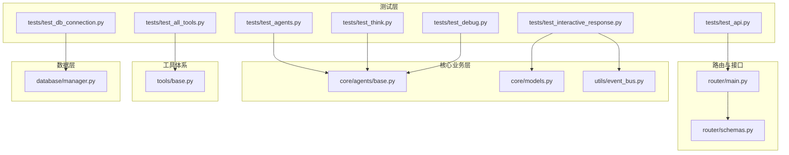
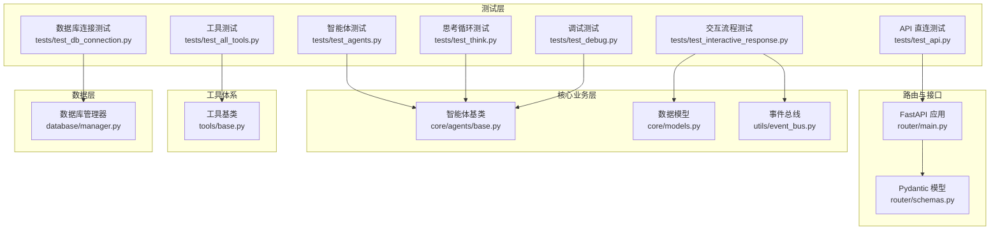
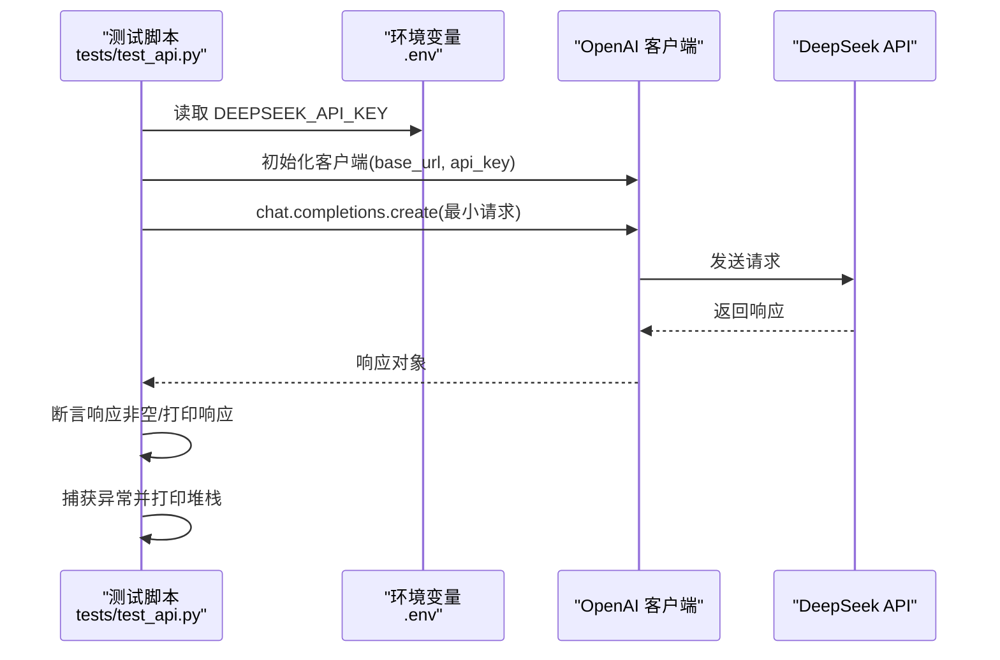
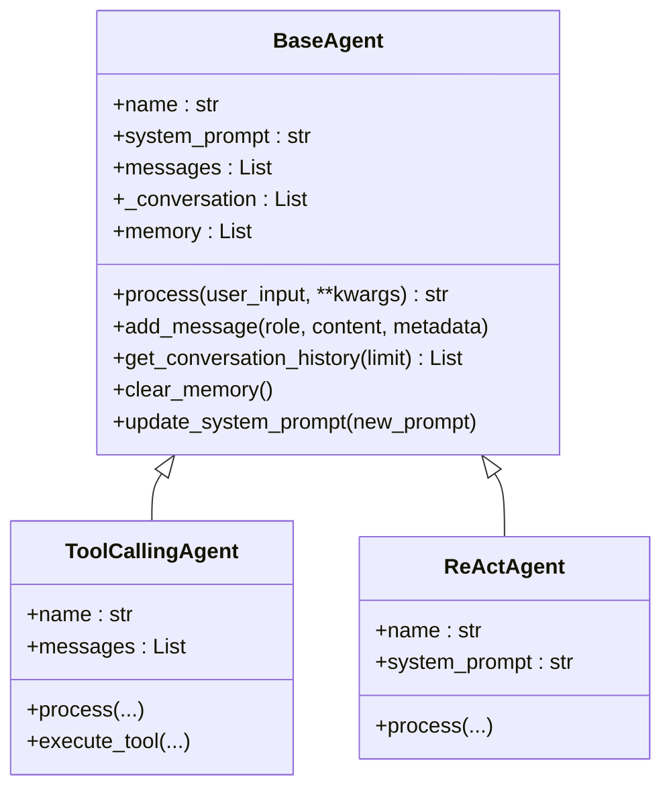
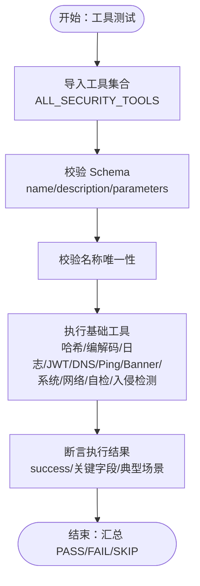
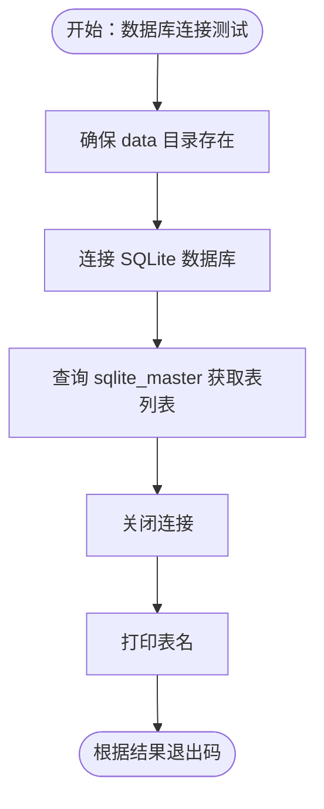
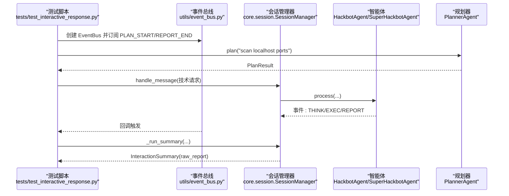
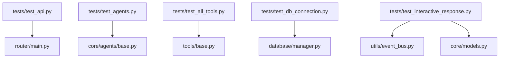

# 测试与质量保证

<cite>
**本文档引用的文件**
- [tests/__init__.py](file://tests/__init__.py)
- [tests/test_api.py](file://tests/test_api.py)
- [tests/test_agents.py](file://tests/test_agents.py)
- [tests/test_all_tools.py](file://tests/test_all_tools.py)
- [tests/test_db_connection.py](file://tests/test_db_connection.py)
- [tests/test_think.py](file://tests/test_think.py)
- [tests/test_interactive_response.py](file://tests/test_interactive_response.py)
- [tests/test_debug.py](file://tests/test_debug.py)
- [router/main.py](file://router/main.py)
- [router/schemas.py](file://router/schemas.py)
- [core/agents/base.py](file://core/agents/base.py)
- [tools/base.py](file://tools/base.py)
- [core/models.py](file://core/models.py)
- [utils/event_bus.py](file://utils/event_bus.py)
- [database/manager.py](file://database/manager.py)
</cite>

## 目录
1. [简介](#简介)
2. [项目结构](#项目结构)
3. [核心组件](#核心组件)
4. [架构总览](#架构总览)
5. [详细组件分析](#详细组件分析)
6. [依赖分析](#依赖分析)
7. [性能考虑](#性能考虑)
8. [故障排除指南](#故障排除指南)
9. [结论](#结论)
10. [附录](#附录)

## 简介
本文件系统化梳理 Secbot 的测试与质量保证体系，覆盖单元测试、集成测试、端到端测试的实施方法与最佳实践；详述 API 测试、智能体测试、工具测试的实施方案与测试用例设计；阐述测试环境搭建与管理（测试数据准备、模拟环境配置、测试自动化）；解释代码质量保证机制（代码审查流程、静态分析工具、性能测试、安全测试）；提供测试覆盖率分析与质量指标监控建议；包含测试故障排除与持续改进指导，并说明测试与开发流程的集成与自动化测试流水线构建。

## 项目结构
Secbot 的测试与质量保证涉及以下关键区域：
- 测试套件：位于 tests/，包含 API 直连测试、智能体行为测试、工具导入与执行测试、数据库连接测试、交互流程测试、调试与思考循环测试等。
- 路由与接口：router/ 提供 FastAPI 服务入口与统一的 Pydantic 模型定义，支撑 API 级别的测试与集成验证。
- 核心业务层：core/ 包含智能体基类、数据模型、事件总线、会话管理等，是单元测试与集成测试的重点对象。
- 工具体系：tools/ 提供统一的工具基类与大量安全工具，是工具测试与工具链集成测试的关键。
- 数据层：database/ 提供数据库管理器，负责初始化与维护 SQLite 表结构，是数据库连接与数据一致性测试的基础。
- 工具与实用模块：utils/ 提供事件总线、日志、模型选择等通用能力，是跨模块测试与可观测性的支撑。

图表来源
- [tests/test_api.py](file://tests/test_api.py#L1-L34)
- [tests/test_agents.py](file://tests/test_agents.py#L1-L33)
- [tests/test_all_tools.py](file://tests/test_all_tools.py#L1-L313)
- [tests/test_db_connection.py](file://tests/test_db_connection.py#L1-L73)
- [tests/test_interactive_response.py](file://tests/test_interactive_response.py#L1-L259)
- [tests/test_think.py](file://tests/test_think.py#L1-L37)
- [tests/test_debug.py](file://tests/test_debug.py#L1-L40)
- [router/main.py](file://router/main.py#L1-L101)
- [router/schemas.py](file://router/schemas.py#L1-L290)
- [core/agents/base.py](file://core/agents/base.py#L1-L125)
- [tools/base.py](file://tools/base.py#L1-L36)
- [core/models.py](file://core/models.py#L1-L137)
- [utils/event_bus.py](file://utils/event_bus.py#L1-L187)
- [database/manager.py](file://database/manager.py#L1-L719)

章节来源
- [tests/__init__.py](file://tests/__init__.py#L1-L3)
- [router/main.py](file://router/main.py#L1-L101)
- [router/schemas.py](file://router/schemas.py#L1-L290)
- [core/agents/base.py](file://core/agents/base.py#L1-L125)
- [tools/base.py](file://tools/base.py#L1-L36)
- [core/models.py](file://core/models.py#L1-L137)
- [utils/event_bus.py](file://utils/event_bus.py#L1-L187)
- [database/manager.py](file://database/manager.py#L1-L719)

## 核心组件
- 智能体基类与模型：提供统一的消息模型、系统提示词、对话历史与内存管理接口，是智能体测试与交互流程测试的基石。
- 工具基类：定义工具执行结果与模式，确保工具导入合规、Schema 合规与执行稳定性，是工具测试的核心。
- 事件总线：提供同步/异步事件发布订阅，支撑交互流程测试中的事件驱动验证。
- 数据库管理器：负责 SQLite 初始化、表结构与索引、CRUD 操作与统计查询，是数据库连接与数据一致性测试的基础。
- 路由与接口：FastAPI 应用工厂、CORS 配置、健康检查、统一 Pydantic 模型，是 API 测试与集成测试的入口与契约。

章节来源
- [core/agents/base.py](file://core/agents/base.py#L1-L125)
- [tools/base.py](file://tools/base.py#L1-L36)
- [utils/event_bus.py](file://utils/event_bus.py#L1-L187)
- [database/manager.py](file://database/manager.py#L1-L719)
- [router/main.py](file://router/main.py#L1-L101)
- [router/schemas.py](file://router/schemas.py#L1-L290)

## 架构总览
下图展示测试与质量保证在系统中的位置与交互关系：测试层通过 API、智能体、工具与数据层进行多维度验证；路由与接口作为统一入口，承载 API 级别测试；事件总线与模型为交互流程测试提供可观测性与契约保障；数据库管理器确保数据一致性与可恢复性。

图表来源
- [tests/test_api.py](file://tests/test_api.py#L1-L34)
- [tests/test_agents.py](file://tests/test_agents.py#L1-L33)
- [tests/test_all_tools.py](file://tests/test_all_tools.py#L1-L313)
- [tests/test_db_connection.py](file://tests/test_db_connection.py#L1-L73)
- [tests/test_interactive_response.py](file://tests/test_interactive_response.py#L1-L259)
- [tests/test_think.py](file://tests/test_think.py#L1-L37)
- [tests/test_debug.py](file://tests/test_debug.py#L1-L40)
- [router/main.py](file://router/main.py#L1-L101)
- [router/schemas.py](file://router/schemas.py#L1-L290)
- [core/agents/base.py](file://core/agents/base.py#L1-L125)
- [core/models.py](file://core/models.py#L1-L137)
- [utils/event_bus.py](file://utils/event_bus.py#L1-L187)
- [tools/base.py](file://tools/base.py#L1-L36)
- [database/manager.py](file://database/manager.py#L1-L719)

## 详细组件分析

### API 测试
- 目标：验证第三方大模型 API（DeepSeek）直连可用性与基本响应。
- 方法：从环境读取 API 密钥，构造客户端，发起最小化请求，捕获异常并输出堆栈。
- 关键点：环境变量读取、超时控制、异常处理与日志输出。
- 最佳实践：分离密钥管理与测试逻辑；在 CI 中使用受控的测试密钥；对响应内容做最小断言（如非空、字段存在）。

图表来源
- [tests/test_api.py](file://tests/test_api.py#L1-L34)

章节来源
- [tests/test_api.py](file://tests/test_api.py#L1-L34)

### 智能体测试
- 目标：验证智能体基类、ReAct 智能体与工具调用智能体的行为与记忆管理。
- 方法：使用 pytest 异步测试，断言智能体名称、系统提示词、消息列表与记忆清理。
- 关键点：异步装饰器、消息历史与系统消息一致性、记忆清理后保留系统消息。
- 最佳实践：为每个智能体类型编写独立用例；对消息历史与系统提示词进行结构化断言；结合事件总线验证交互阶段事件。

图表来源
- [core/agents/base.py](file://core/agents/base.py#L1-L125)
- [tests/test_agents.py](file://tests/test_agents.py#L1-L33)

章节来源
- [tests/test_agents.py](file://tests/test_agents.py#L1-L33)
- [core/agents/base.py](file://core/agents/base.py#L1-L125)

### 工具测试
- 目标：验证工具导入合规、Schema 合规、名称唯一性与基础执行能力。
- 方法：遍历安全工具集合，断言工具实例、Schema 字段完整性；执行哈希、编解码、日志分析、JWT 分析、DNS/Ping/Banner、系统信息、网络分析、自检扫描、入侵检测等工具的快速执行。
- 关键点：工具实例化、Schema 参数键完整性、执行结果 success 字段、典型场景断言（如 MD5、base64、SQLi/XSS 检测）。
- 最佳实践：为每个工具编写独立用例；对不可联网工具进行本地化断言；对可联网工具设置超时与降级策略。

图表来源
- [tests/test_all_tools.py](file://tests/test_all_tools.py#L1-L313)
- [tools/base.py](file://tools/base.py#L1-L36)

章节来源
- [tests/test_all_tools.py](file://tests/test_all_tools.py#L1-L313)
- [tools/base.py](file://tools/base.py#L1-L36)

### 数据库连接测试
- 目标：验证 SQLite 连接与表结构初始化。
- 方法：尝试连接数据库、查询系统表、打印现有表名；确保 data 目录存在。
- 关键点：路径解析、异常捕获、成功/失败退出码。
- 最佳实践：在 CI 中预置空数据库；对不同平台（Windows）进行编码适配；对表结构变更进行回归测试。

图表来源
- [tests/test_db_connection.py](file://tests/test_db_connection.py#L1-L73)
- [database/manager.py](file://database/manager.py#L1-L719)

章节来源
- [tests/test_db_connection.py](file://tests/test_db_connection.py#L1-L73)
- [database/manager.py](file://database/manager.py#L1-L719)

### 交互流程测试
- 目标：验证会话管理与事件总线在真实交互中的行为，不依赖 UI 组件。
- 方法：导入核心模块与事件总线，构造会话管理器与智能体，执行简单回复、技术请求（可跳过 LLM）、事件订阅验证、摘要生成。
- 关键点：事件类型订阅与回调、超时处理、摘要对象结构断言。
- 最佳实践：对 LLM 不可用场景进行降级与跳过；对事件驱动流程进行可观测性断言；对会话摘要进行结构化断言。

图表来源
- [tests/test_interactive_response.py](file://tests/test_interactive_response.py#L1-L259)
- [utils/event_bus.py](file://utils/event_bus.py#L1-L187)
- [core/models.py](file://core/models.py#L1-L137)

章节来源
- [tests/test_interactive_response.py](file://tests/test_interactive_response.py#L1-L259)
- [utils/event_bus.py](file://utils/event_bus.py#L1-L187)
- [core/models.py](file://core/models.py#L1-L137)

### 思考循环测试
- 目标：验证智能体内部 ReAct 循环在短超时下的行为与异常处理。
- 方法：设置日志级别，创建智能体，调用内部思考方法，捕获超时与异常。
- 关键点：超时控制、异常捕获与堆栈输出。
- 最佳实践：在 CI 中对 LLM 不可用场景进行跳过；对日志级别进行显式控制以便调试。

章节来源
- [tests/test_think.py](file://tests/test_think.py#L1-L37)

### 调试测试
- 目标：验证智能体 process 在给定输入下的响应生成与超时控制。
- 方法：设置日志级别，创建智能体，执行 process 并断言响应非空。
- 关键点：输入构造、超时与异常处理。
- 最佳实践：对不同输入场景编写用例；在 LLM 不可用时进行降级断言。

章节来源
- [tests/test_debug.py](file://tests/test_debug.py#L1-L40)

## 依赖分析
- 测试层依赖关系：API 测试依赖路由入口与环境变量；智能体测试依赖智能体基类；工具测试依赖工具基类与工具集合；数据库测试依赖数据库管理器；交互流程测试依赖事件总线与数据模型。
- 路由与接口：FastAPI 应用工厂、CORS、健康检查与统一模型定义，为 API 测试提供稳定入口与契约。
- 核心业务层：智能体基类与模型、事件总线为交互流程测试提供可观测性与结构化数据。
- 工具体系：工具基类统一了工具执行结果与模式，为工具测试提供一致断言点。
- 数据层：数据库管理器提供稳定的表结构与 CRUD 能力，为数据库测试提供基础。

图表来源
- [tests/test_api.py](file://tests/test_api.py#L1-L34)
- [tests/test_agents.py](file://tests/test_agents.py#L1-L33)
- [tests/test_all_tools.py](file://tests/test_all_tools.py#L1-L313)
- [tests/test_db_connection.py](file://tests/test_db_connection.py#L1-L73)
- [tests/test_interactive_response.py](file://tests/test_interactive_response.py#L1-L259)
- [router/main.py](file://router/main.py#L1-L101)
- [core/agents/base.py](file://core/agents/base.py#L1-L125)
- [tools/base.py](file://tools/base.py#L1-L36)
- [database/manager.py](file://database/manager.py#L1-L719)
- [utils/event_bus.py](file://utils/event_bus.py#L1-L187)
- [core/models.py](file://core/models.py#L1-L137)

章节来源
- [router/main.py](file://router/main.py#L1-L101)
- [router/schemas.py](file://router/schemas.py#L1-L290)
- [core/agents/base.py](file://core/agents/base.py#L1-L125)
- [tools/base.py](file://tools/base.py#L1-L36)
- [core/models.py](file://core/models.py#L1-L137)
- [utils/event_bus.py](file://utils/event_bus.py#L1-L187)
- [database/manager.py](file://database/manager.py#L1-L719)

## 性能考虑
- 异步测试：智能体与工具测试采用异步执行，减少阻塞，提升吞吐。
- 超时控制：对 LLM 相关测试设置超时，避免长时间等待导致测试卡死。
- 事件驱动：通过事件总线实现解耦，便于在测试中注入与断言关键事件节点。
- 数据库事务：使用上下文管理器确保事务提交与回滚，减少测试间干扰。
- 最佳实践：对可联网工具设置合理超时与重试；对数据库操作进行批量插入与索引优化；对事件流进行采样与聚合统计。

## 故障排除指南
- API 测试失败
  - 检查环境变量读取与密钥有效性；确认 base_url 正确；查看异常堆栈定位具体问题。
- 智能体测试失败
  - 核对系统提示词与消息历史结构；确认记忆清理逻辑；检查异步装饰器使用。
- 工具测试失败
  - 校验工具 Schema 完整性；对不可联网工具进行本地断言；对可联网工具设置超时。
- 数据库连接失败
  - 确认 data 目录存在与权限；检查数据库路径解析；查看连接异常日志。
- 交互流程超时
  - LLM 不可用时跳过或降级；检查事件订阅与回调；验证摘要生成逻辑。
- 日志与调试
  - 设置日志级别；在关键节点输出中间状态；对异常进行堆栈打印与分类处理。

章节来源
- [tests/test_api.py](file://tests/test_api.py#L1-L34)
- [tests/test_agents.py](file://tests/test_agents.py#L1-L33)
- [tests/test_all_tools.py](file://tests/test_all_tools.py#L1-L313)
- [tests/test_db_connection.py](file://tests/test_db_connection.py#L1-L73)
- [tests/test_interactive_response.py](file://tests/test_interactive_response.py#L1-L259)
- [tests/test_think.py](file://tests/test_think.py#L1-L37)
- [tests/test_debug.py](file://tests/test_debug.py#L1-L40)

## 结论
Secbot 的测试与质量保证体系以“测试即文档”的理念构建：API 测试确保外部依赖可用，智能体与工具测试覆盖核心业务行为与契约，数据库测试保障数据一致性，交互流程测试验证事件驱动架构的正确性。通过事件总线与统一模型，测试具备良好的可观测性与可维护性。建议在 CI 中引入覆盖率统计与质量门禁，持续完善测试用例与自动化流水线。

## 附录
- 测试环境搭建建议
  - 使用虚拟环境隔离依赖；在 CI 中预置 SQLite 数据库与最小化 LLM 配置；对敏感信息使用受控的测试密钥。
- 测试自动化
  - 将测试脚本纳入 CI/CD 流水线；对关键测试设置并行执行与超时控制；对失败用例进行归因与重试。
- 质量指标
  - 单元测试通过率、集成测试通过率、端到端测试通过率、数据库一致性检查通过率、事件驱动断言覆盖率。
- 持续改进
  - 定期评审测试用例与断言策略；对新增功能补充对应测试；对回归问题建立回归用例库。