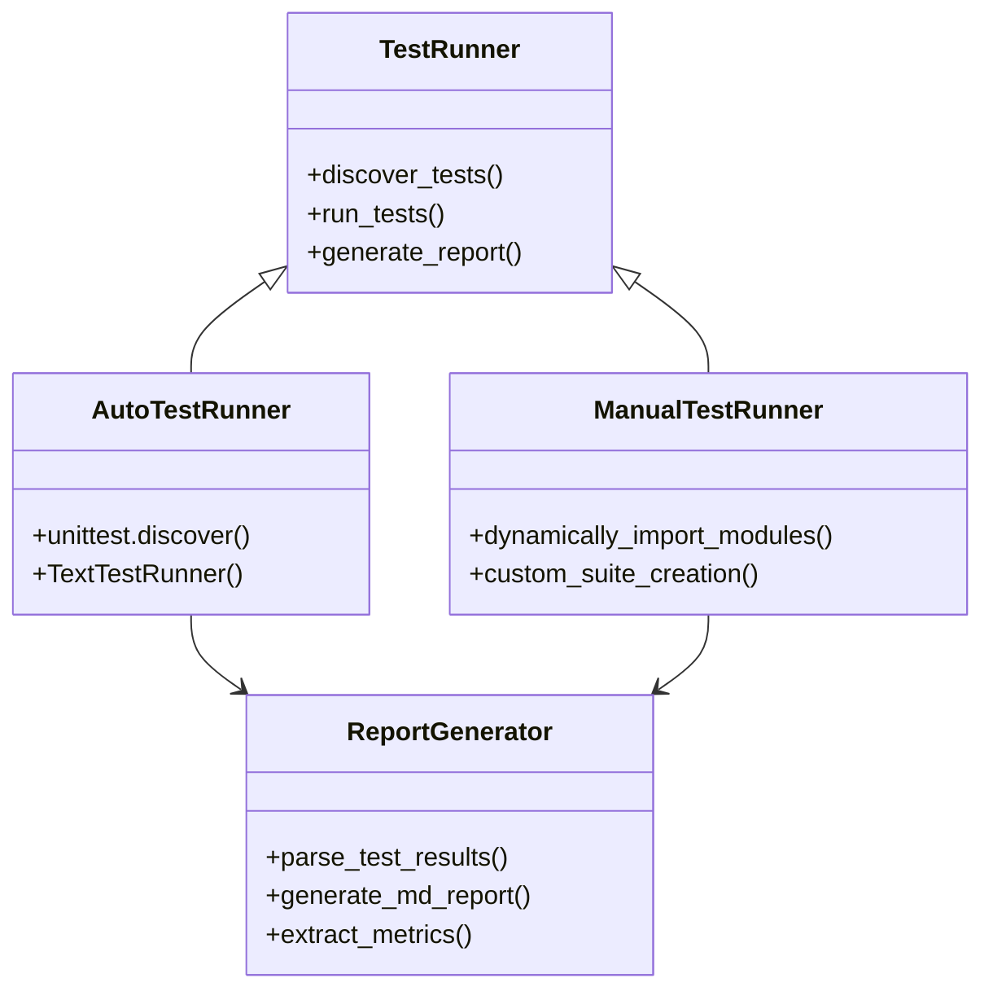
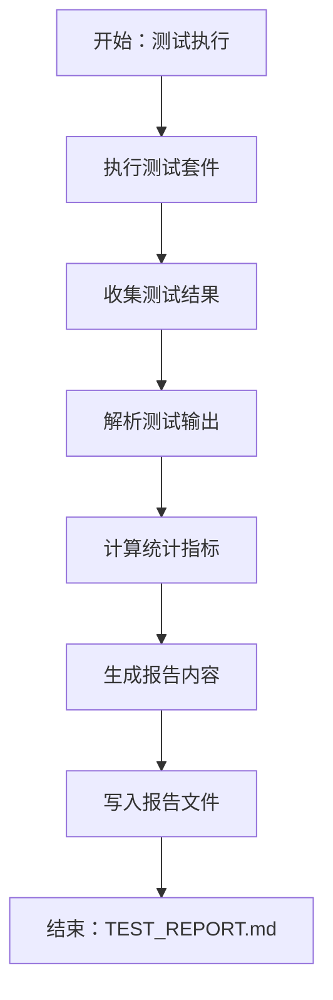

# 测试与质量保证

<cite>
**本文档引用的文件**
- [run_tests.py](file://run_tests.py)
- [manual_test_runner.py](file://manual_test_runner.py)
- [generate_report.py](file://generate_report.py)
- [tests/__init__.py](file://tests/__init__.py)
- [tests/test_release.py](file://tests/test_release.py)
- [tests/test_api.py](file://tests/test_api.py)
- [tests/test_agents.py](file://tests/test_agents.py)
- [tests/test_all_tools.py](file://tests/test_all_tools.py)
- [tests/test_interactive_response.py](file://tests/test_interactive_response.py)
- [tests/controller/test_session_manager.py](file://tests/controller/test_session_manager.py)
- [tests/core/test_agents.py](file://tests/core/test_agents.py)
- [tests/tools/test_base_tool.py](file://tests/tools/test_base_tool.py)
- [tests/router/test_api.py](file://tests/router/test_api.py)
- [tests/database/test_manager.py](file://tests/database/test_manager.py)
- [router/main.py](file://router/main.py)
- [router/schemas.py](file://router/schemas.py)
- [core/agents/base.py](file://core/agents/base.py)
- [tools/base.py](file://tools/base.py)
- [core/models.py](file://core/models.py)
- [utils/event_bus.py](file://utils/event_bus.py)
- [database/manager.py](file://database/manager.py)
</cite>

## 更新摘要
**所做更改**
- 新增完整的测试运行器基础设施（自动发现、手动执行、报告生成）
- 更新测试套件组织结构，包含控制器、核心、工具、路由器、数据库等模块测试
- 新增发布前测试流程和质量保证机制
- 完善测试环境搭建和管理指南

## 目录
1. [简介](#简介)
2. [测试基础设施](#测试基础设施)
3. [测试套件组织结构](#测试套件组织结构)
4. [核心测试组件](#核心测试组件)
5. [测试运行器系统](#测试运行器系统)
6. [报告生成与质量监控](#报告生成与质量监控)
7. [发布前质量保证](#发布前质量保证)
8. [测试策略与最佳实践](#测试策略与最佳实践)
9. [故障排除指南](#故障排除指南)
10. [结论](#结论)
11. [附录](#附录)

## 简介
本文件系统化梳理 Secbot 的完整测试与质量保证体系，涵盖新增的测试运行器基础设施、模块化的测试套件组织、以及全面的质量保证机制。文档详细介绍了测试框架和测试策略，包括单元测试、集成测试、端到端测试的实施方法和最佳实践；详述 API 测试、智能体测试、工具测试、控制器测试、数据库测试的具体实施方案和测试用例设计；阐述测试环境的搭建和管理，包括测试数据准备、模拟环境配置和测试自动化；解释代码质量保证机制，包括代码审查流程、静态分析工具、性能测试和安全测试；提供测试覆盖率分析和质量指标监控；包含测试故障排除和持续改进的指导；解释测试与开发流程的集成和自动化测试流水线的构建。

## 测试基础设施
Secbot 的测试基础设施经过重大升级，现在包含完整的测试运行器系统、模块化测试套件和质量保证机制：

### 核心测试运行器
- **自动测试运行器** (`run_tests.py`)：基于 unittest 自动发现机制，能够递归扫描 tests 目录并执行所有测试用例
- **手动测试执行器** (`manual_test_runner.py`)：提供更灵活的手动测试执行方式，支持动态模块导入和自定义测试套件组合
- **报告生成器** (`generate_report.py`)：将测试结果转换为结构化报告，支持统计分析和质量指标展示

### 测试套件组织
测试套件现已模块化组织，按照功能领域进行分类：
- **控制器测试**：会话管理、授权控制等
- **核心业务测试**：智能体、内存管理、规划器等
- **工具测试**：基础工具、Web研究工具等
- **路由器测试**：API端点、聊天接口等
- **数据库测试**：数据库管理、模型操作等

```mermaid
graph TB
subgraph "测试基础设施"
RUN["自动测试运行器<br/>run_tests.py"]
MAN["手动测试执行器<br/>manual_test_runner.py"]
REP["报告生成器<br/>generate_report.py"]
END
subgraph "测试套件"
CTRL["控制器测试<br/>controller/"]
CORE["核心业务测试<br/>core/"]
TOOLS["工具测试<br/>tools/"]
ROUTER["路由器测试<br/>router/"]
DB["数据库测试<br/>database/"]
UTILS["工具测试<br/>utils/"]
END
subgraph "质量保证"
RELEASE["发布前测试<br/>test_release.py"]
REPORT["测试报告<br/>TEST_REPORT.md"]
END
RUN --> CTRL
RUN --> CORE
RUN --> TOOLS
RUN --> ROUTER
RUN --> DB
RUN --> UTILS
MAN --> CTRL
MAN --> CORE
MAN --> TOOLS
MAN --> ROUTER
MAN --> DB
MAN --> UTILS
REP --> REPORT
RELEASE --> REPORT
```

**图表来源**
- [run_tests.py](file://run_tests.py#L1-L25)
- [manual_test_runner.py](file://manual_test_runner.py#L1-L45)
- [generate_report.py](file://generate_report.py#L1-L58)
- [tests/test_release.py](file://tests/test_release.py#L1-L82)

**章节来源**
- [run_tests.py](file://run_tests.py#L1-L25)
- [manual_test_runner.py](file://manual_test_runner.py#L1-L45)
- [generate_report.py](file://generate_report.py#L1-L58)
- [tests/test_release.py](file://tests/test_release.py#L1-L82)

## 测试套件组织结构
Secbot 的测试套件现已完全模块化，按照功能领域进行清晰的组织：

### 控制器测试
- **会话管理器测试** (`tests/controller/test_session_manager.py`)：验证会话创建、活动更新、命令执行、会话关闭等功能
- **授权控制测试**：验证访问控制和权限管理

### 核心业务测试
- **智能体测试** (`tests/core/test_agents.py`)：验证基础智能体、Hackbot智能体、规划器智能体的行为
- **内存管理测试** (`tests/core/test_memory.py`)：验证内存存储和检索功能
- **模型测试** (`tests/core/test_models.py`)：验证数据模型和序列化

### 工具测试
- **基础工具测试** (`tests/tools/test_base_tool.py`)：验证工具基类和工具执行
- **Web研究工具测试** (`tests/tools/test_web_research.py`)：验证Web搜索和信息提取功能

### 路由器测试
- **API测试** (`tests/router/test_api.py`)：验证健康检查和其他API端点
- **聊天端点测试** (`tests/router/test_chat_endpoint.py`)：验证聊天功能
- **代理端点测试** (`tests/router/test_agents_endpoints.py`)：验证代理相关功能

### 数据库测试
- **数据库管理器测试** (`tests/database/test_manager.py`)：验证数据库初始化、CRUD操作、事务处理
- **模型测试** (`tests/database/test_models.py`)：验证数据模型定义

### 系统测试
- **操作系统控制测试** (`tests/system/test_os_controller.py`)：验证系统命令执行
- **配置存储测试** (`tests/utils/test_config_storage.py`)：验证配置管理

**章节来源**
- [tests/controller/test_session_manager.py](file://tests/controller/test_session_manager.py#L1-L68)
- [tests/core/test_agents.py](file://tests/core/test_agents.py#L1-L79)
- [tests/tools/test_base_tool.py](file://tests/tools/test_base_tool.py#L1-L35)
- [tests/router/test_api.py](file://tests/router/test_api.py#L1-L21)
- [tests/database/test_manager.py](file://tests/database/test_manager.py#L1-L105)

## 核心测试组件
测试基础设施包含多个核心组件，为不同类型的测试需求提供支持：

### 智能体测试组件
- **基础智能体测试**：验证智能体初始化、消息处理、内存管理、系统提示词更新
- **异步处理测试**：验证异步消息处理和响应生成
- **会话集成测试**：验证智能体与会话管理器的集成

### 工具测试组件
- **工具基类测试**：验证工具初始化、Schema生成、异步执行
- **工具执行测试**：验证工具参数验证、结果处理、错误处理
- **工具注册测试**：验证工具注册和发现机制

### 数据库测试组件
- **数据库管理器测试**：验证数据库初始化、表结构创建、CRUD操作
- **模型操作测试**：验证数据模型的保存、获取、更新、删除
- **事务处理测试**：验证事务的提交和回滚机制

### 路由器测试组件
- **FastAPI应用测试**：验证应用工厂、路由配置、中间件
- **端点测试**：验证各个API端点的功能和响应
- **健康检查测试**：验证系统健康状态检查



**图表来源**
- [run_tests.py](file://run_tests.py#L5-L24)
- [manual_test_runner.py](file://manual_test_runner.py#L10-L44)
- [generate_report.py](file://generate_report.py#L5-L57)

**章节来源**
- [run_tests.py](file://run_tests.py#L1-L25)
- [manual_test_runner.py](file://manual_test_runner.py#L1-L45)
- [generate_report.py](file://generate_report.py#L1-L58)

## 测试运行器系统
Secbot 的测试运行器系统提供了多种测试执行方式，满足不同的测试需求：

### 自动测试运行器
**功能特点**：
- 基于 unittest.TestLoader 的自动发现机制
- 递归扫描 tests 目录，自动识别测试用例
- 支持详细的测试结果输出（verbosity=2）
- 失败时返回非零退出码

**执行流程**：
1. 初始化 TestLoader 和 TestSuite
2. 使用 discover() 方法扫描 tests 目录
3. 计算测试用例数量并输出发现结果
4. 创建 TextTestRunner 执行测试
5. 根据测试结果决定退出码

### 手动测试执行器
**功能特点**：
- 支持动态模块导入和执行
- 提供更灵活的测试套件组合方式
- 适用于特定测试场景和调试需求
- 支持自定义测试模块发现

**执行流程**：
1. 动态导入指定的测试模块
2. 从模块中发现 TestCase 类
3. 创建测试套件并添加测试用例
4. 执行测试并处理结果

### 测试结果处理
两种运行器都支持标准的 unittest 输出格式，便于后续的报告生成和分析。

**章节来源**
- [run_tests.py](file://run_tests.py#L1-L25)
- [manual_test_runner.py](file://manual_test_runner.py#L1-L45)

## 报告生成与质量监控
测试报告生成器提供了完整的测试结果分析和可视化功能：

### 报告生成流程
1. **结果解析**：从测试输出文件中解析测试统计信息
2. **指标计算**：计算总测试数、成功数、失败数、错误数
3. **报告生成**：生成结构化的Markdown报告
4. **质量指标**：提供关键质量指标的可视化展示

### 报告内容结构
- **生成时间**：测试报告的生成时间戳
- **摘要表格**：包含总测试数、成功、失败、错误的统计
- **详细结果**：原始测试输出的完整内容
- **质量指标**：成功率、失败率等关键指标

### 质量监控指标
- **测试覆盖率**：代码被测试覆盖的比例
- **测试通过率**：成功测试用例占总测试用例的比例
- **缺陷密度**：每千行代码中的缺陷数量
- **回归测试率**：回归测试中发现的问题比例



**图表来源**
- [generate_report.py](file://generate_report.py#L5-L57)

**章节来源**
- [generate_report.py](file://generate_report.py#L1-L58)
- [TEST_REPORT.md](file://TEST_REPORT.md#L1-L19)

## 发布前质量保证
新增的发布前测试脚本提供了完整的发布质量检查流程：

### 测试范围
发布前测试涵盖了应用的核心功能验证：
- **帮助命令测试**：验证 `--help` 命令的正确性
- **配置显示测试**：验证 `config-show` 命令的功能
- **版本检查测试**：验证版本信息的获取
- **模块导入测试**：验证核心模块的正确导入
- **CLI入口测试**：验证命令行界面的可用性

### 测试执行流程
1. **命令执行**：使用 subprocess 执行各种测试命令
2. **结果捕获**：捕获标准输出和错误输出
3. **状态判断**：根据返回码判断测试是否通过
4. **汇总报告**：生成测试通过率和最终结果

### 质量保证机制
- **自动化检查**：所有测试都是自动执行的
- **详细日志**：提供完整的命令输出和错误信息
- **清晰结果**：明确标识每个测试的通过/失败状态
- **发布决策**：基于测试结果决定是否可以发布

**章节来源**
- [tests/test_release.py](file://tests/test_release.py#L1-L82)

## 测试策略与最佳实践
基于新的测试基础设施，建议采用以下测试策略和最佳实践：

### 分层测试策略
1. **单元测试**：针对单个函数或类的测试，使用基础测试组件
2. **集成测试**：验证组件间的交互，使用模块化测试套件
3. **端到端测试**：验证完整业务流程，使用发布前测试脚本
4. **性能测试**：评估系统性能和资源使用情况

### 测试数据管理
- **临时数据库**：使用临时文件进行数据库测试，避免污染生产数据
- **Mock对象**：使用 unittest.mock 进行外部依赖的模拟
- **测试数据隔离**：确保测试数据与其他环境隔离

### 异步测试处理
- **事件循环管理**：正确处理 asyncio 事件循环
- **超时控制**：为异步操作设置合理的超时时间
- **资源清理**：确保异步任务正确清理

### 测试环境配置
- **环境变量管理**：使用 .env 文件管理测试环境变量
- **数据库配置**：为测试配置独立的数据库实例
- **外部服务模拟**：使用本地服务或mock替代外部API

## 故障排除指南
针对新的测试基础设施，提供以下故障排除指导：

### 测试运行器问题
- **自动测试运行器失败**
  - 检查 tests 目录结构和命名规范
  - 确认测试文件符合 unittest.TestCase 要求
  - 验证 Python 路径配置正确
- **手动测试执行器失败**
  - 检查模块导入路径和依赖
  - 确认测试模块的正确性
  - 验证动态导入的模块名格式

### 测试套件问题
- **测试用例未发现**
  - 检查测试文件命名（必须以 test_ 开头）
  - 确认测试类继承自 unittest.TestCase
  - 验证测试方法命名（必须以 test 开头）
- **测试执行超时**
  - 检查异步操作的超时设置
  - 验证外部依赖的可用性
  - 确认数据库连接配置

### 报告生成问题
- **报告生成失败**
  - 检查测试结果文件的编码格式
  - 验证正则表达式匹配模式
  - 确认输出文件的写入权限
- **报告内容不完整**
  - 检查测试输出的格式
  - 验证统计信息的提取逻辑
  - 确认Markdown格式的正确性

### 发布前测试问题
- **CLI命令失败**
  - 检查命令行参数的正确性
  - 验证环境变量的配置
  - 确认模块路径的可达性
- **版本检查失败**
  - 检查版本号的定义和获取
  - 验证包安装状态
  - 确认Python环境的兼容性

**章节来源**
- [run_tests.py](file://run_tests.py#L1-L25)
- [manual_test_runner.py](file://manual_test_runner.py#L1-L45)
- [generate_report.py](file://generate_report.py#L1-L58)
- [tests/test_release.py](file://tests/test_release.py#L1-L82)

## 结论
Secbot 的测试与质量保证体系经过重大升级，现在包含了完整的测试运行器基础设施、模块化的测试套件组织和全面的质量保证机制。新的基础设施提供了：

- **自动化测试执行**：通过 run_tests.py 实现测试的自动发现和执行
- **灵活的测试管理**：通过 manual_test_runner.py 提供手动测试执行能力
- **结构化报告生成**：通过 generate_report.py 提供测试结果的可视化展示
- **发布前质量保证**：通过 test_release.py 确保发布的可靠性
- **模块化测试套件**：按功能领域组织的测试文件，便于维护和扩展

这些改进使得 Secbot 的测试体系更加完善，能够更好地支持持续集成和持续部署流程，提高代码质量和软件可靠性。建议在实际使用中充分利用这些新功能，建立完善的测试流程和质量保证机制。

## 附录

### 测试环境搭建建议
- **Python环境**：使用虚拟环境隔离测试依赖
- **测试数据库**：为测试配置独立的数据库实例
- **外部服务**：使用mock或本地服务替代外部API
- **环境变量**：配置必要的测试环境变量

### 测试自动化集成
- **CI/CD集成**：将测试运行器集成到持续集成流程中
- **并行执行**：利用测试的独立性进行并行执行
- **结果报告**：集成测试报告生成和质量指标监控
- **失败处理**：建立测试失败的自动通知和处理机制

### 质量指标监控
- **测试覆盖率**：定期监控代码覆盖率的变化趋势
- **缺陷跟踪**：建立缺陷的跟踪和分析机制
- **性能监控**：监控测试执行时间和资源使用情况
- **质量门禁**：设置质量门禁，确保发布前的质量要求

### 持续改进策略
- **测试用例评审**：定期评审测试用例的有效性和完整性
- **测试工具升级**：持续改进测试工具和基础设施
- **最佳实践分享**：分享测试经验和最佳实践
- **自动化程度提升**：逐步提高测试的自动化程度