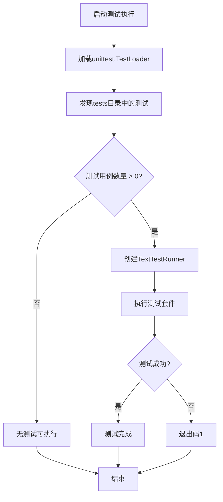
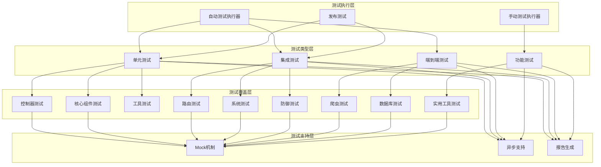
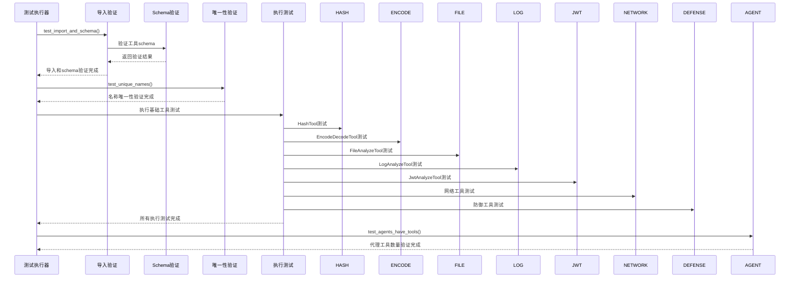
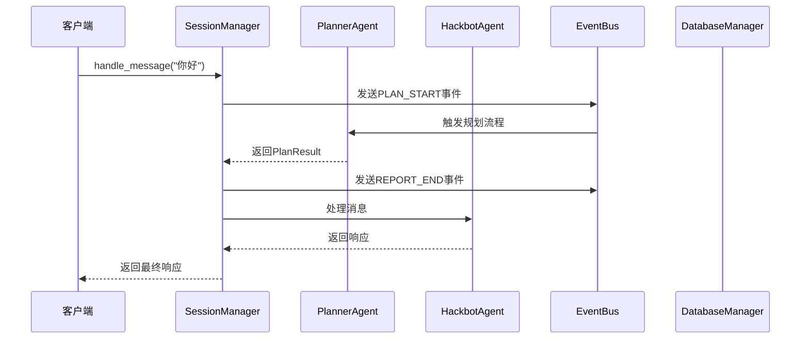
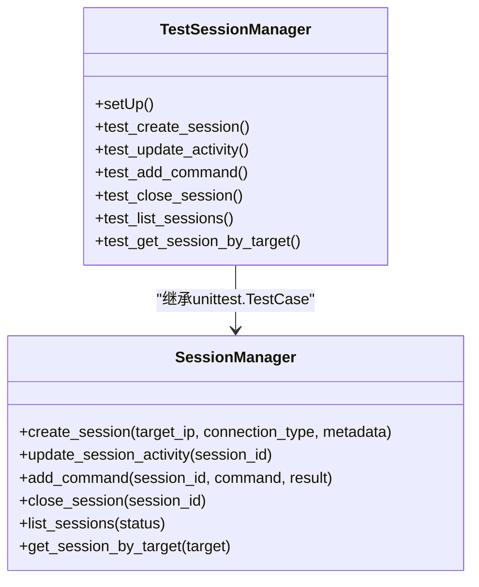
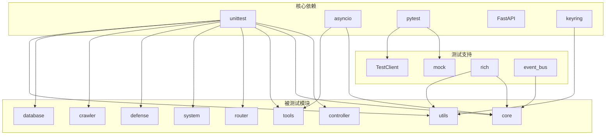

# 测试基础设施扩展

<cite>
**本文档引用的文件**
- [run_tests.py](file://run_tests.py)
- [manual_test_runner.py](file://manual_test_runner.py)
- [pyproject.toml](file://pyproject.toml)
- [TEST_REPORT.md](file://TEST_REPORT.md)
- [tests/test_all_tools.py](file://tests/test_all_tools.py)
- [tests/test_interactive_response.py](file://tests/test_interactive_response.py)
- [tests/test_release.py](file://tests/test_release.py)
- [tests/controller/test_session_manager.py](file://tests/controller/test_session_manager.py)
- [tests/core/test_hackbot_agent.py](file://tests/core/test_hackbot_agent.py)
- [tests/router/test_api.py](file://tests/router/test_api.py)
- [tests/utils/test_config_storage.py](file://tests/utils/test_config_storage.py)
- [tests/disabled_test_api.py](file://tests/disabled_test_api.py)
- [tests/disabled_test_debug.py](file://tests/disabled_test_debug.py)
- [tests/disabled_test_think.py](file://tests/disabled_test_think.py)
</cite>

## 目录
1. [简介](#简介)
2. [项目结构](#项目结构)
3. [核心组件](#核心组件)
4. [架构概览](#架构概览)
5. [详细组件分析](#详细组件分析)
6. [依赖分析](#依赖分析)
7. [性能考虑](#性能考虑)
8. [故障排除指南](#故障排除指南)
9. [结论](#结论)

## 简介

本项目是一个基于Python的AI驱动渗透测试机器人系统，包含完整的测试基础设施。测试基础设施采用多种测试策略和技术，包括单元测试、集成测试、端到端测试和发布前验证测试。

测试系统的核心特点包括：
- 多层次测试覆盖（单元、集成、端到端）
- 异步测试支持
- Mock机制用于外部依赖隔离
- 自动化测试发现和执行
- 发布前完整性验证

## 项目结构

测试基础设施主要分布在以下目录中：

```mermaid
graph TB
subgraph "测试根目录"
TST[tests/]
end
subgraph "控制器测试"
CTRL[controller/]
CTRL_SM[session_manager.py]
end
subgraph "核心组件测试"
CORE[core/]
CORE_HA[hackbot_agent.py]
CORE_PA[planner_agent.py]
CORE_MEM[memory.py]
CORE_AG[agents.py]
end
subgraph "工具测试"
TOOLS[tools/]
TOOLS_BT[test_base_tool.py]
TOOLS_WR[test_web_research.py]
end
subgraph "路由测试"
ROUTER[router/]
ROUTER_API[test_api.py]
ROUTER_CHAT[test_chat_endpoint.py]
ROUTER_AGENTS[test_agents_endpoints.py]
end
subgraph "系统测试"
SYS[system/]
SYS_OS[test_os_controller.py]
end
subgraph "防御测试"
DEF[defense/]
DEF_DM[test_defense_manager.py]
end
subgraph "爬虫测试"
CRAWL[crawler/]
CRAWL_EX[test_extractor.py]
end
subgraph "数据库测试"
DB[database/]
DB_MGR[test_manager.py]
end
subgraph "实用工具测试"
UTILS[utils/]
UTILS_CS[test_config_storage.py]
end
TST --> CTRL
TST --> CORE
TST --> TOOLS
TST --> ROUTER
TST --> SYS
TST --> DEF
TST --> CRAWL
TST --> DB
TST --> UTILS
```

**图表来源**
- [tests/controller/test_session_manager.py:1-68](file://tests/controller/test_session_manager.py#L1-L68)
- [tests/core/test_hackbot_agent.py:1-21](file://tests/core/test_hackbot_agent.py#L1-L21)
- [tests/router/test_api.py:1-21](file://tests/router/test_api.py#L1-L21)

**章节来源**
- [pyproject.toml:178-184](file://pyproject.toml#L178-L184)

## 核心组件

### 测试执行器

测试系统提供了两种主要的测试执行方式：

#### 自动测试发现执行器
`run_tests.py` 实现了基于unittest的自动测试发现功能：

**图表来源**
- [run_tests.py:5-25](file://run_tests.py#L5-L25)

#### 手动测试执行器
`manual_test_runner.py` 提供了更灵活的手动测试执行能力：

**章节来源**
- [run_tests.py:1-25](file://run_tests.py#L1-L25)
- [manual_test_runner.py:1-45](file://manual_test_runner.py#L1-L45)

### 测试配置管理

项目使用`pyproject.toml`进行统一的测试配置管理：

**章节来源**
- [pyproject.toml:178-184](file://pyproject.toml#L178-L184)

## 架构概览

测试基础设施采用分层架构设计，支持多种测试类型：

**图表来源**
- [tests/test_all_tools.py:1-313](file://tests/test_all_tools.py#L1-L313)
- [tests/test_interactive_response.py:1-259](file://tests/test_interactive_response.py#L1-L259)

## 详细组件分析

### 工具测试套件

`tests/test_all_tools.py` 提供了全面的工具测试框架：

#### 测试分类
1. **导入和Schema验证** - 确保所有工具可正常导入且符合schema规范
2. **名称唯一性验证** - 验证工具名称的唯一性
3. **基础执行测试** - 测试不依赖外部网络的工具执行
4. **代理工具数量验证** - 验证代理拥有的工具数量

#### 关键测试流程

**图表来源**
- [tests/test_all_tools.py:38-305](file://tests/test_all_tools.py#L38-L305)

**章节来源**
- [tests/test_all_tools.py:1-313](file://tests/test_all_tools.py#L1-L313)

### 交互响应测试

`tests/test_interactive_response.py` 专注于会话管理和交互响应流程：

#### 核心测试场景
1. **导入测试** - 验证关键模块的可导入性
2. **简单回复测试** - 验证基本消息处理
3. **技术流程测试** - 验证规划和处理流程
4. **代理处理跳过标志测试** - 验证process方法的跳过选项
5. **摘要生成测试** - 验证报告生成功能

#### 事件总线集成

**图表来源**
- [tests/test_interactive_response.py:32-113](file://tests/test_interactive_response.py#L32-L113)

**章节来源**
- [tests/test_interactive_response.py:1-259](file://tests/test_interactive_response.py#L1-L259)

### 发布前测试

`tests/test_release.py` 提供了发布前的完整性验证：

#### 测试内容
1. **帮助命令测试** - 验证CLI帮助功能
2. **配置显示测试** - 验证配置管理功能
3. **版本检查测试** - 验证版本信息获取
4. **模块导入测试** - 验证核心模块可导入
5. **CLI入口测试** - 验证CLI入口点

**章节来源**
- [tests/test_release.py:1-82](file://tests/test_release.py#L1-L82)

### 单元测试示例

#### 会话管理器测试
`tests/controller/test_session_manager.py` 展示了标准的unittest模式：

**图表来源**
- [tests/controller/test_session_manager.py:6-67](file://tests/controller/test_session_manager.py#L6-L67)

**章节来源**
- [tests/controller/test_session_manager.py:1-68](file://tests/controller/test_session_manager.py#L1-L68)

#### Hackbot代理测试
`tests/core/test_hackbot_agent.py` 验证代理的基本功能：

**章节来源**
- [tests/core/test_hackbot_agent.py:1-21](file://tests/core/test_hackbot_agent.py#L1-L21)

#### FastAPI路由测试
`tests/router/test_api.py` 使用TestClient进行API测试：

**章节来源**
- [tests/router/test_api.py:1-21](file://tests/router/test_api.py#L1-L21)

#### 配置存储测试
`tests/utils/test_config_storage.py` 展示了Mock的使用：

**章节来源**
- [tests/utils/test_config_storage.py:1-40](file://tests/utils/test_config_storage.py#L1-L40)

### 禁用测试文件

项目包含多个标记为"disabled"的测试文件，用于特殊场景的调试和验证：

#### API直接测试
`tests/disabled_test_api.py` 用于直接测试外部API服务

#### 调试测试
`tests/disabled_test_debug.py` 和 `tests/disabled_test_think.py` 用于调试代理的ReAct循环和思考过程

**章节来源**
- [tests/disabled_test_api.py:1-34](file://tests/disabled_test_api.py#L1-L34)
- [tests/disabled_test_debug.py:1-40](file://tests/disabled_test_debug.py#L1-L40)
- [tests/disabled_test_think.py:1-37](file://tests/disabled_test_think.py#L1-L37)

## 依赖分析

测试基础设施的依赖关系如下：

**图表来源**
- [pyproject.toml:29-69](file://pyproject.toml#L29-L69)

**章节来源**
- [pyproject.toml:1-184](file://pyproject.toml#L1-L184)

## 性能考虑

测试基础设施在性能方面采用了多项优化策略：

### 异步测试优化
- 使用`asyncio.run()`进行异步测试执行
- 支持超时机制防止测试挂起
- 异步工具测试减少外部依赖等待时间

### 测试执行优化
- 自动测试发现避免手动指定测试文件
- 动态模块导入支持灵活的测试组合
- 并行测试执行能力

### 资源管理
- Mock机制减少外部依赖
- 临时数据库连接管理
- 会话超时控制

## 故障排除指南

### 常见问题及解决方案

#### 测试无法发现
**症状**: 测试执行器报告"无测试可执行"
**解决方案**: 
- 检查测试文件命名是否符合`test_*.py`模式
- 确认测试类名符合`Test*`模式
- 验证测试函数名符合`test_*`模式

#### 异步测试超时
**症状**: 异步测试在特定操作上超时
**解决方案**:
- 检查外部服务可用性（如LLM服务）
- 调整超时参数
- 使用Mock替代外部依赖

#### Mock配置错误
**症状**: 使用Mock时出现属性访问错误
**解决方案**:
- 确保Mock对象正确配置
- 验证side_effect函数设置
- 检查Mock的return_value设置

#### 数据库连接问题
**症状**: 数据库相关测试失败
**解决方案**:
- 检查数据库连接配置
- 验证测试数据清理
- 确认事务回滚机制

**章节来源**
- [tests/test_interactive_response.py:108-112](file://tests/test_interactive_response.py#L108-L112)
- [tests/utils/test_config_storage.py:25-36](file://tests/utils/test_config_storage.py#L25-L36)

## 结论

本项目的测试基础设施展现了现代Python项目的最佳实践，具有以下特点：

### 主要优势
1. **多层次测试覆盖** - 从单元测试到端到端测试的完整覆盖
2. **异步支持完善** - 充分利用asyncio提升测试效率
3. **Mock机制成熟** - 有效隔离外部依赖
4. **自动化程度高** - 支持自动测试发现和执行
5. **扩展性强** - 易于添加新的测试类型和测试模块

### 测试策略亮点
- **工具测试套件** - 全面验证安全工具的功能
- **交互响应测试** - 确保核心业务流程的正确性
- **发布前验证** - 保证发布的软件质量
- **禁用测试文件** - 支持特殊场景的调试需求

### 改进建议
1. **增加覆盖率报告** - 集成覆盖率工具生成详细的测试报告
2. **CI/CD集成** - 将测试集成到持续集成流程中
3. **性能基准测试** - 添加性能测试确保系统性能指标
4. **测试数据管理** - 建立标准化的测试数据管理机制

测试基础设施为项目的稳定性和可靠性提供了坚实保障，是项目质量管理体系的重要组成部分。