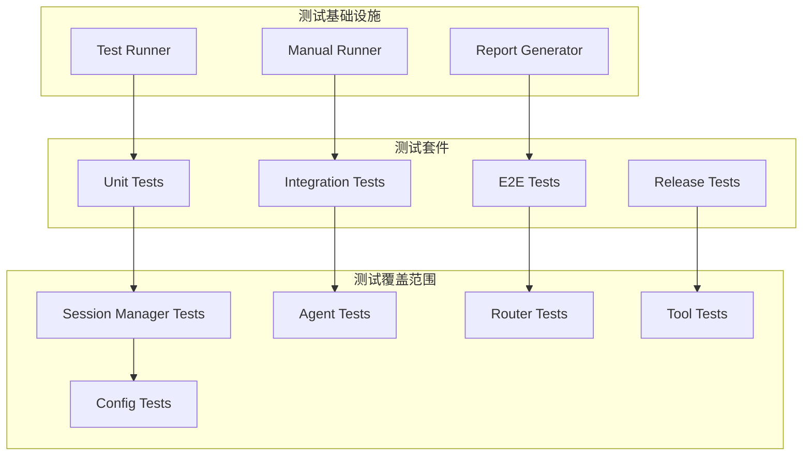
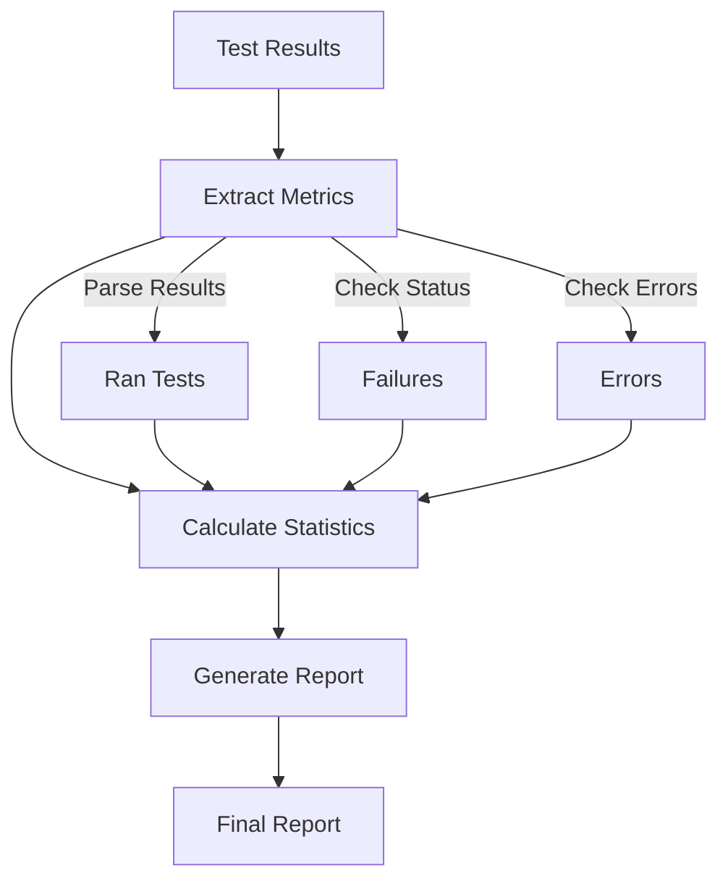
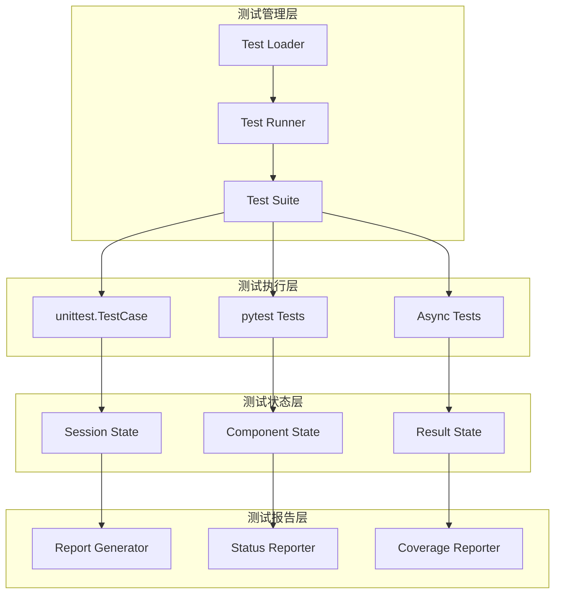
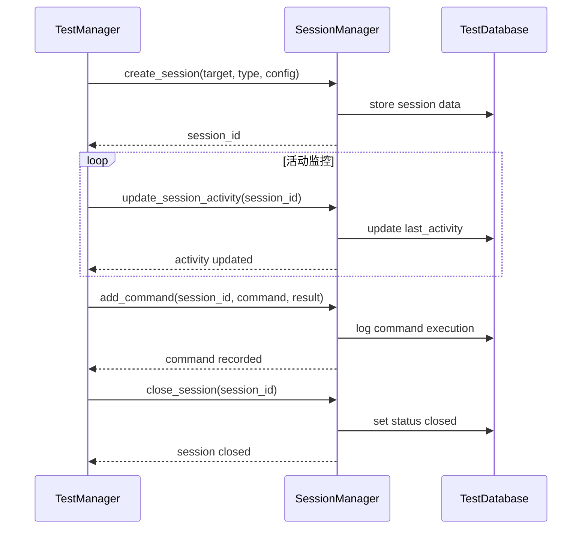
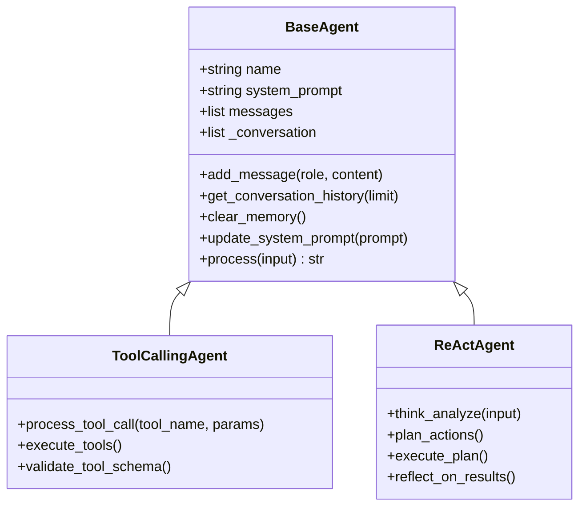
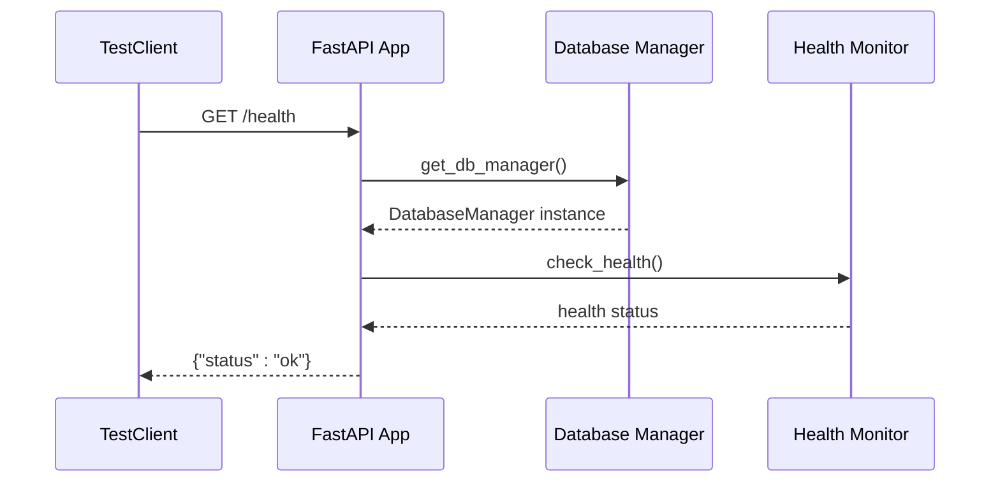
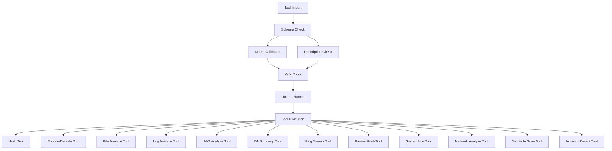
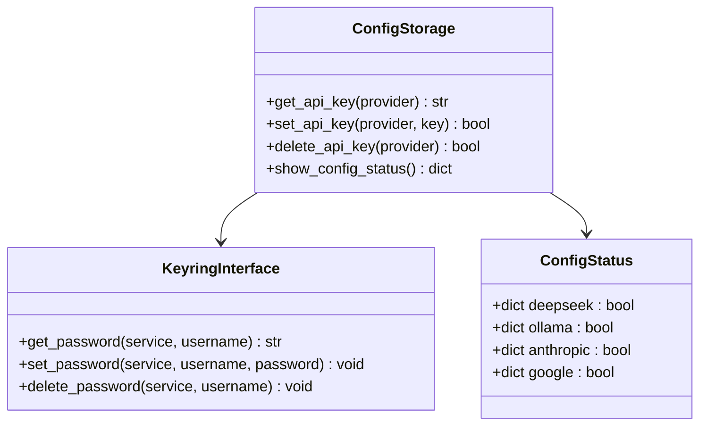
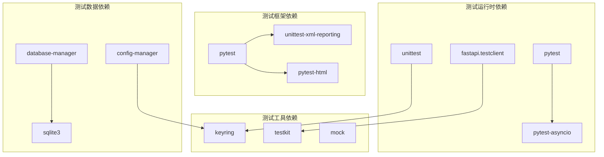

# 测试状态更新

<cite>
**本文档引用的文件**
- [README.md](file://README.md)
- [TEST_REPORT.md](file://TEST_REPORT.md)
- [run_tests.py](file://run_tests.py)
- [manual_test_runner.py](file://manual_test_runner.py)
- [generate_report.py](file://generate_report.py)
- [tests/test_agents.py](file://tests/test_agents.py)
- [tests/controller/test_session_manager.py](file://tests/controller/test_session_manager.py)
- [tests/core/test_agents.py](file://tests/core/test_agents.py)
- [tests/router/test_api.py](file://tests/router/test_api.py)
- [tests/test_all_tools.py](file://tests/test_all_tools.py)
- [tests/test_release.py](file://tests/test_release.py)
- [tests/utils/test_config_storage.py](file://tests/utils/test_config_storage.py)
- [pyproject.toml](file://pyproject.toml)
</cite>

## 目录
1. [简介](#简介)
2. [项目结构](#项目结构)
3. [核心组件](#核心组件)
4. [架构概览](#架构概览)
5. [详细组件分析](#详细组件分析)
6. [依赖关系分析](#依赖关系分析)
7. [性能考虑](#性能考虑)
8. [故障排除指南](#故障排除指南)
9. [结论](#结论)

## 简介

本文档详细分析了 Secbot 项目的测试状态更新机制。Secbot 是一个基于 AI 的自动化渗透测试智能体系统，具有完整的测试基础设施和状态管理系统。该项目采用了多层次的测试策略，包括单元测试、集成测试、端到端测试和发布前验证测试。

项目的核心测试功能包括：
- 自动测试发现和执行
- 测试状态跟踪和报告生成
- 会话状态管理和活动更新
- 工具链完整性验证
- 发布前质量保证

## 项目结构

Secbot 项目采用模块化的架构设计，测试系统作为独立的层次存在：

**图表来源**
- [run_tests.py:1-25](file://run_tests.py#L1-L25)
- [manual_test_runner.py:1-45](file://manual_test_runner.py#L1-L45)
- [generate_report.py:1-58](file://generate_report.py#L1-L58)

**章节来源**
- [README.md:319-376](file://README.md#L319-L376)
- [pyproject.toml:178-184](file://pyproject.toml#L178-L184)

## 核心组件

### 测试执行器组件

项目包含两个主要的测试执行器，分别处理不同的测试场景：

#### 自动测试执行器
- **功能**：自动发现和执行测试套件
- **特点**：使用 unittest.TestLoader 自动扫描 tests 目录
- **输出**：详细的测试结果和统计信息

#### 手动测试执行器  
- **功能**：动态加载和执行测试模块
- **特点**：支持自定义测试路径和模块发现
- **用途**：调试和特定场景测试执行

### 测试报告生成器

测试报告系统提供了完整的测试状态可视化：

**图表来源**
- [generate_report.py:5-58](file://generate_report.py#L5-L58)

**章节来源**
- [run_tests.py:5-25](file://run_tests.py#L5-L25)
- [manual_test_runner.py:10-45](file://manual_test_runner.py#L10-L45)
- [generate_report.py:5-58](file://generate_report.py#L5-L58)

## 架构概览

Secbot 的测试架构采用分层设计，确保测试的独立性和可维护性：

**图表来源**
- [tests/controller/test_session_manager.py:6-68](file://tests/controller/test_session_manager.py#L6-L68)
- [tests/core/test_agents.py:12-79](file://tests/core/test_agents.py#L12-L79)
- [tests/test_agents.py:5-33](file://tests/test_agents.py#L5-L33)

## 详细组件分析

### 会话管理器测试组件

会话管理器是测试状态更新的核心组件，负责管理测试会话的生命周期：

#### 会话状态管理流程

**图表来源**
- [tests/controller/test_session_manager.py:10-45](file://tests/controller/test_session_manager.py#L10-L45)

#### 关键测试方法

| 测试方法 | 功能描述 | 验证点 |
|---------|----------|--------|
| `test_create_session` | 创建新会话 | 验证会话ID、目标IP、连接类型、初始状态 |
| `test_update_activity` | 更新会话活动时间 | 验证时间戳更新、活动状态保持 |
| `test_add_command` | 记录命令执行 | 验证命令历史、执行结果存储 |
| `test_close_session` | 关闭会话 | 验证关闭状态、关闭时间记录 |
| `test_list_sessions` | 列出会话 | 验证状态过滤、会话计数 |

**章节来源**
- [tests/controller/test_session_manager.py:6-68](file://tests/controller/test_session_manager.py#L6-L68)

### 智能体测试组件

智能体测试涵盖了基础智能体功能和高级工具调用能力：

#### 智能体状态验证

**图表来源**
- [tests/core/test_agents.py:7-11](file://tests/core/test_agents.py#L7-L11)
- [tests/test_agents.py:6-24](file://tests/test_agents.py#L6-L24)

#### 测试覆盖范围

| 测试类别 | 验证内容 | 测试文件 |
|---------|----------|----------|
| 基础初始化 | 名称设置、系统提示、消息列表 | `tests/core/test_agents.py` |
| 消息管理 | 添加消息、历史记录、清理内存 | `tests/core/test_agents.py` |
| 工具调用 | 工具调用智能体功能 | `tests/test_agents.py` |
| ReAct推理 | 结构化推理过程 | `tests/test_agents.py` |
| 异步处理 | 异步消息处理 | `tests/core/test_agents.py` |

**章节来源**
- [tests/core/test_agents.py:12-79](file://tests/core/test_agents.py#L12-L79)
- [tests/test_agents.py:5-33](file://tests/test_agents.py#L5-L33)

### 路由器测试组件

路由器测试确保 API 端点的正确性和稳定性：

#### API 健康检查测试

**图表来源**
- [tests/router/test_api.py:8-17](file://tests/router/test_api.py#L8-L17)

**章节来源**
- [tests/router/test_api.py:7-21](file://tests/router/test_api.py#L7-L21)

### 工具链测试组件

工具链测试验证了整个安全工具生态系统的完整性：

#### 工具导入和模式验证

**图表来源**
- [tests/test_all_tools.py:38-304](file://tests/test_all_tools.py#L38-L304)

**章节来源**
- [tests/test_all_tools.py:35-313](file://tests/test_all_tools.py#L35-L313)

### 配置存储测试组件

配置存储测试确保敏感信息的安全管理和访问控制：

#### 配置状态验证

**图表来源**
- [tests/utils/test_config_storage.py:6-37](file://tests/utils/test_config_storage.py#L6-L37)

**章节来源**
- [tests/utils/test_config_storage.py:6-40](file://tests/utils/test_config_storage.py#L6-L40)

## 依赖关系分析

测试系统的依赖关系体现了模块化设计的优势：

**图表来源**
- [pyproject.toml:55-67](file://pyproject.toml#L55-L67)
- [pyproject.toml:72-78](file://pyproject.toml#L72-L78)

**章节来源**
- [pyproject.toml:29-69](file://pyproject.toml#L29-L69)
- [pyproject.toml:178-184](file://pyproject.toml#L178-L184)

## 性能考虑

测试系统的性能优化策略包括：

### 测试执行优化
- **并行执行**：支持异步测试和并发执行
- **缓存机制**：避免重复的测试环境初始化
- **增量测试**：只运行变更相关的测试用例

### 内存管理
- **会话清理**：及时清理测试会话和临时数据
- **资源释放**：确保数据库连接和文件句柄正确关闭
- **垃圾回收**：定期清理测试对象和引用

### 报告生成优化
- **增量报告**：只更新变化的测试状态
- **压缩输出**：减少报告文件大小
- **异步生成**：避免阻塞主测试流程

## 故障排除指南

### 常见测试问题

#### 测试执行失败
1. **依赖缺失**：检查 `pyproject.toml` 中的测试依赖
2. **环境配置**：验证测试环境变量和配置文件
3. **权限问题**：确保测试用户有足够的系统权限

#### 报告生成错误
1. **编码问题**：检查测试结果文件的编码格式
2. **路径问题**：验证测试结果文件和报告文件路径
3. **权限问题**：确保有写入报告文件的权限

#### 会话管理问题
1. **数据库连接**：检查 SQLite 数据库连接状态
2. **锁竞争**：避免多个测试同时访问同一会话
3. **超时处理**：合理设置会话超时参数

**章节来源**
- [generate_report.py:6-58](file://generate_report.py#L6-L58)
- [tests/controller/test_session_manager.py:18-28](file://tests/controller/test_session_manager.py#L18-L28)

## 结论

Secbot 项目的测试状态更新机制展现了现代软件测试的最佳实践。通过多层次的测试架构、完善的测试工具链和智能化的报告生成功能，系统能够有效地保证代码质量和功能稳定性。

关键优势包括：
- **全面的测试覆盖**：从单元测试到端到端测试的完整体系
- **智能的状态管理**：实时跟踪测试进度和结果
- **灵活的执行方式**：支持自动和手动测试执行模式
- **详细的报告生成**：提供可视化的测试状态和统计信息

未来改进建议：
- 集成持续集成管道，实现自动化测试触发
- 扩展测试覆盖率指标，包括代码覆盖率和性能测试
- 增强测试数据管理，支持测试数据的版本控制
- 优化测试执行效率，支持更精细的测试选择和过滤