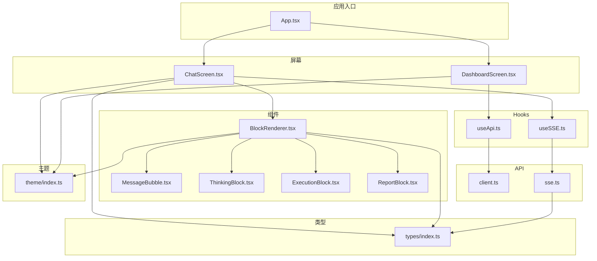
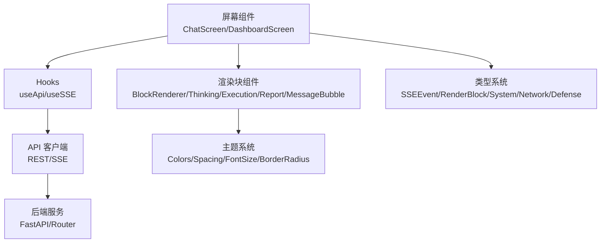
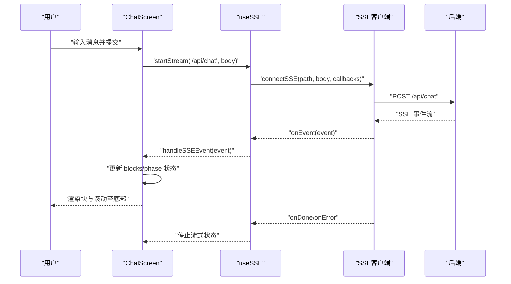
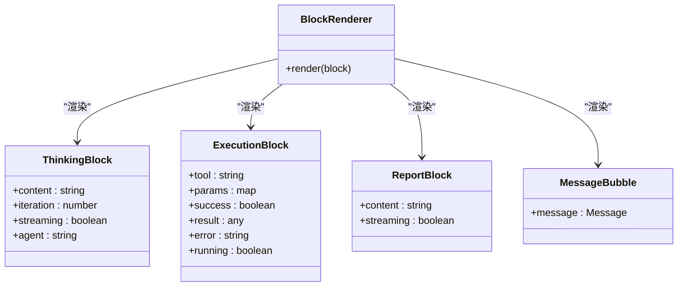
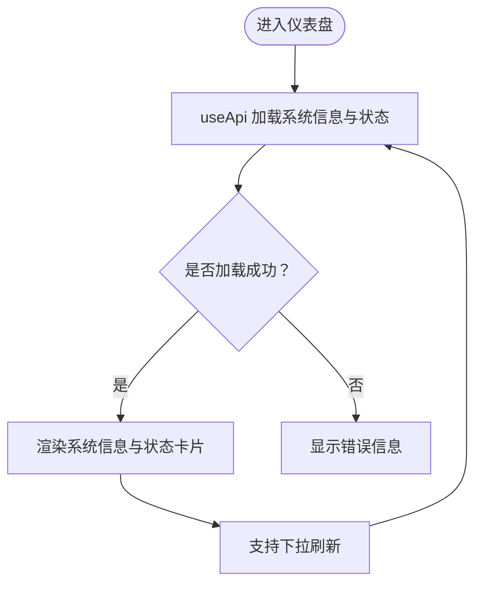
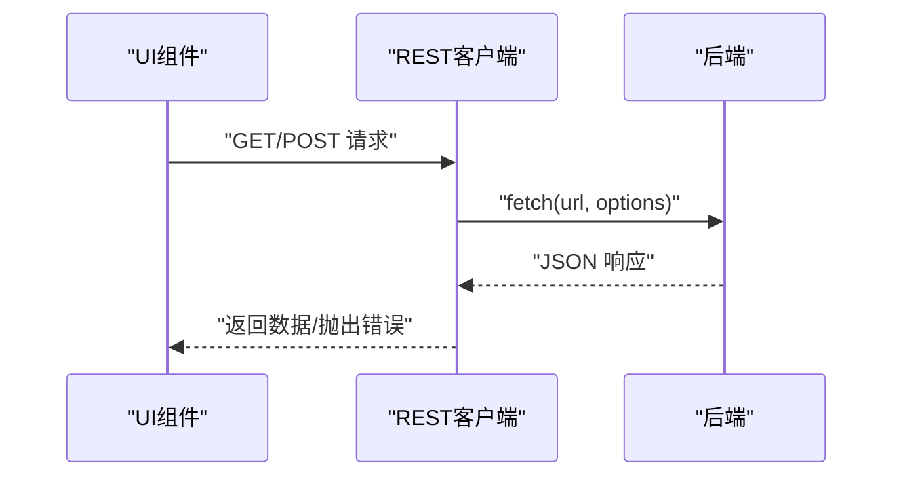
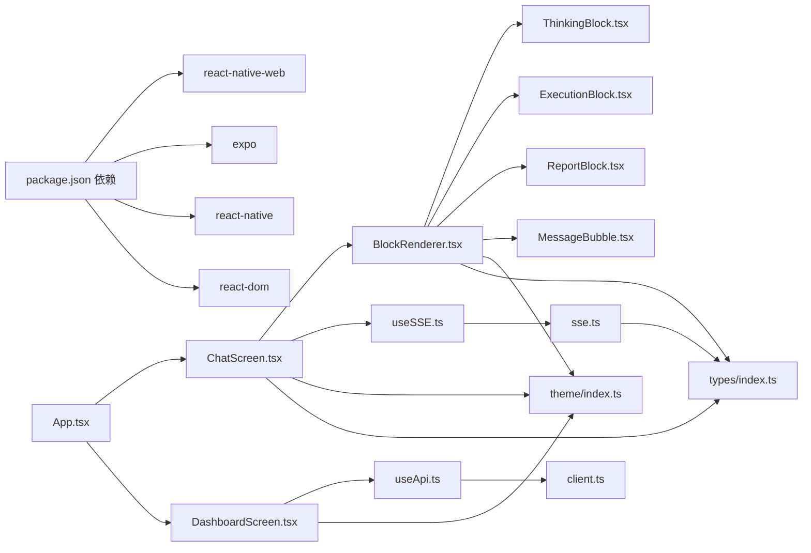

# Web界面

<cite>
**本文引用的文件**
- [主题配置 index.ts](file://app/src/theme/index.ts)
- [类型定义 index.ts](file://app/src/types/index.ts)
- [API 客户端 client.ts](file://app/src/api/client.ts)
- [SSE 客户端 sse.ts](file://app/src/api/sse.ts)
- [聊天页面 ChatScreen.tsx](file://app/src/screens/ChatScreen.tsx)
- [通用 API Hook useApi.ts](file://app/src/hooks/useApi.ts)
- [SSE Hook useSSE.ts](file://app/src/hooks/useSSE.ts)
- [消息气泡 MessageBubble.tsx](file://app/src/components/MessageBubble.tsx)
- [块渲染器 BlockRenderer.tsx](file://app/src/components/BlockRenderer.tsx)
- [推理块 ThinkingBlock.tsx](file://app/src/components/ThinkingBlock.tsx)
- [执行块 ExecutionBlock.tsx](file://app/src/components/ExecutionBlock.tsx)
- [报告块 ReportBlock.tsx](file://app/src/components/ReportBlock.tsx)
- [仪表盘页面 DashboardScreen.tsx](file://app/src/screens/DashboardScreen.tsx)
- [应用入口 App.tsx](file://app/App.tsx)
- [应用配置 package.json](file://app/package.json)
</cite>

## 目录
1. [简介](#简介)
2. [项目结构](#项目结构)
3. [核心组件](#核心组件)
4. [架构总览](#架构总览)
5. [详细组件分析](#详细组件分析)
6. [依赖关系分析](#依赖关系分析)
7. [性能考虑](#性能考虑)
8. [故障排查指南](#故障排查指南)
9. [结论](#结论)
10. [附录](#附录)

## 简介
本文件面向Secbot Web界面的技术文档，聚焦于Web端与移动端、命令行界面的一致性设计与实现。文档涵盖设计理念、响应式布局、组件交互与状态管理、与后端的API集成（含SSE流式通信）、性能优化策略、跨浏览器与无障碍支持，以及扩展与定制化能力。目标是帮助开发者与运维人员快速理解并高效维护该Web界面。

## 项目结构
Web界面位于app目录下，采用React + React Native Web技术栈，通过Expo进行开发与构建，支持iOS、Android与Web三端复用。核心模块包括：
- 主题与样式：统一的颜色、间距、字号与圆角规范
- 类型系统：前后端一致的事件与数据模型
- API层：REST客户端与SSE客户端
- 屏幕与组件：聊天、仪表盘等页面及渲染块组件
- Hooks：API与SSE的可复用逻辑

**图表来源**
- [应用入口 App.tsx](file://app/App.tsx#L1-L200)
- [聊天页面 ChatScreen.tsx](file://app/src/screens/ChatScreen.tsx#L1-L753)
- [仪表盘页面 DashboardScreen.tsx](file://app/src/screens/DashboardScreen.tsx#L1-L233)
- [块渲染器 BlockRenderer.tsx](file://app/src/components/BlockRenderer.tsx#L1-L97)
- [推理块 ThinkingBlock.tsx](file://app/src/components/ThinkingBlock.tsx#L1-L210)
- [执行块 ExecutionBlock.tsx](file://app/src/components/ExecutionBlock.tsx#L1-L300)
- [报告块 ReportBlock.tsx](file://app/src/components/ReportBlock.tsx#L1-L134)
- [消息气泡 MessageBubble.tsx](file://app/src/components/MessageBubble.tsx#L1-L112)
- [通用 API Hook useApi.ts](file://app/src/hooks/useApi.ts#L1-L35)
- [SSE Hook useSSE.ts](file://app/src/hooks/useSSE.ts#L1-L51)
- [API 客户端 client.ts](file://app/src/api/client.ts#L1-L49)
- [SSE 客户端 sse.ts](file://app/src/api/sse.ts#L1-L164)
- [主题配置 index.ts](file://app/src/theme/index.ts#L1-L64)
- [类型定义 index.ts](file://app/src/types/index.ts#L1-L200)

**章节来源**
- [应用入口 App.tsx](file://app/App.tsx#L1-L200)
- [应用配置 package.json](file://app/package.json#L1-L34)

## 核心组件
- 主题系统：提供主色调、背景、文字、状态色、边框与圆角等常量，确保Web与移动端视觉一致
- 类型系统：定义SSE事件、渲染块、系统信息、网络与防御相关接口，保障前后端契约稳定
- API层：统一REST客户端与SSE客户端，封装错误处理与JSON解析
- 屏幕组件：聊天页与仪表盘页，分别承载流式交互与静态数据展示
- 渲染块：将抽象的渲染块映射到具体组件（推理、执行、报告、消息等）
- Hooks：useApi与useSSE，封装加载、错误与流式控制状态

**章节来源**
- [主题配置 index.ts](file://app/src/theme/index.ts#L1-L64)
- [类型定义 index.ts](file://app/src/types/index.ts#L1-L200)
- [API 客户端 client.ts](file://app/src/api/client.ts#L1-L49)
- [SSE 客户端 sse.ts](file://app/src/api/sse.ts#L1-L164)
- [聊天页面 ChatScreen.tsx](file://app/src/screens/ChatScreen.tsx#L1-L753)
- [仪表盘页面 DashboardScreen.tsx](file://app/src/screens/DashboardScreen.tsx#L1-L233)
- [块渲染器 BlockRenderer.tsx](file://app/src/components/BlockRenderer.tsx#L1-L97)
- [通用 API Hook useApi.ts](file://app/src/hooks/useApi.ts#L1-L35)
- [SSE Hook useSSE.ts](file://app/src/hooks/useSSE.ts#L1-L51)

## 架构总览
Web界面遵循“屏幕-组件-Hook-API-主题-类型”的分层架构，确保职责清晰、可扩展与可维护。

**图表来源**
- [聊天页面 ChatScreen.tsx](file://app/src/screens/ChatScreen.tsx#L1-L753)
- [仪表盘页面 DashboardScreen.tsx](file://app/src/screens/DashboardScreen.tsx#L1-L233)
- [块渲染器 BlockRenderer.tsx](file://app/src/components/BlockRenderer.tsx#L1-L97)
- [推理块 ThinkingBlock.tsx](file://app/src/components/ThinkingBlock.tsx#L1-L210)
- [执行块 ExecutionBlock.tsx](file://app/src/components/ExecutionBlock.tsx#L1-L300)
- [报告块 ReportBlock.tsx](file://app/src/components/ReportBlock.tsx#L1-L134)
- [消息气泡 MessageBubble.tsx](file://app/src/components/MessageBubble.tsx#L1-L112)
- [通用 API Hook useApi.ts](file://app/src/hooks/useApi.ts#L1-L35)
- [SSE Hook useSSE.ts](file://app/src/hooks/useSSE.ts#L1-L51)
- [API 客户端 client.ts](file://app/src/api/client.ts#L1-L49)
- [SSE 客户端 sse.ts](file://app/src/api/sse.ts#L1-L164)
- [主题配置 index.ts](file://app/src/theme/index.ts#L1-L64)
- [类型定义 index.ts](file://app/src/types/index.ts#L1-L200)

## 详细组件分析

### 聊天页面（与CLI行为一致）
- 设计理念：镜像CLI TUI的交互流程，通过SSE事件驱动渲染块的创建与更新，保持Web与CLI一致的用户体验
- 关键流程：用户消息 -> 规划 -> 推理（流式/非流式）-> 执行 -> 结果 -> 报告 -> 最终响应
- 状态管理：使用本地状态与引用追踪当前流中的块ID与内容，确保流式更新与最终态切换
- 交互控件：模式选择（Ask/Agent）、子模式（自动/专家）、模型切换、状态徽章、调试面板

**图表来源**
- [聊天页面 ChatScreen.tsx](file://app/src/screens/ChatScreen.tsx#L1-L753)
- [SSE Hook useSSE.ts](file://app/src/hooks/useSSE.ts#L1-L51)
- [SSE 客户端 sse.ts](file://app/src/api/sse.ts#L1-L164)

**章节来源**
- [聊天页面 ChatScreen.tsx](file://app/src/screens/ChatScreen.tsx#L1-L753)
- [SSE Hook useSSE.ts](file://app/src/hooks/useSSE.ts#L1-L51)
- [SSE 客户端 sse.ts](file://app/src/api/sse.ts#L1-L164)

### 块渲染体系
- BlockRenderer根据RenderBlock.type分派到具体组件，确保渲染逻辑集中、易于扩展
- ThinkingBlock：支持流式闪烁光标、折叠/展开、预览摘要
- ExecutionBlock：默认折叠，展开后展示参数与结果，区分运行中、成功、失败状态
- ReportBlock：流式时使用虚线边框与闪烁光标，完成后使用实线边框
- MessageBubble：用于历史消息气泡，区分用户、助手与系统角色

**图表来源**
- [块渲染器 BlockRenderer.tsx](file://app/src/components/BlockRenderer.tsx#L1-L97)
- [推理块 ThinkingBlock.tsx](file://app/src/components/ThinkingBlock.tsx#L1-L210)
- [执行块 ExecutionBlock.tsx](file://app/src/components/ExecutionBlock.tsx#L1-L300)
- [报告块 ReportBlock.tsx](file://app/src/components/ReportBlock.tsx#L1-L134)
- [消息气泡 MessageBubble.tsx](file://app/src/components/MessageBubble.tsx#L1-L112)

**章节来源**
- [块渲染器 BlockRenderer.tsx](file://app/src/components/BlockRenderer.tsx#L1-L97)
- [推理块 ThinkingBlock.tsx](file://app/src/components/ThinkingBlock.tsx#L1-L210)
- [执行块 ExecutionBlock.tsx](file://app/src/components/ExecutionBlock.tsx#L1-L300)
- [报告块 ReportBlock.tsx](file://app/src/components/ReportBlock.tsx#L1-L134)
- [消息气泡 MessageBubble.tsx](file://app/src/components/MessageBubble.tsx#L1-L112)

### 仪表盘页面（系统信息与状态）
- 数据加载：useApi封装loading/error/data状态，支持下拉刷新
- 展示内容：系统信息网格、CPU/内存卡片、磁盘使用率进度条
- 一致性：与CLI的系统信息与状态展示保持语义一致

**图表来源**
- [仪表盘页面 DashboardScreen.tsx](file://app/src/screens/DashboardScreen.tsx#L1-L233)
- [通用 API Hook useApi.ts](file://app/src/hooks/useApi.ts#L1-L35)

**章节来源**
- [仪表盘页面 DashboardScreen.tsx](file://app/src/screens/DashboardScreen.tsx#L1-L233)
- [通用 API Hook useApi.ts](file://app/src/hooks/useApi.ts#L1-L35)

### API集成方案
- REST API：统一的fetch封装，自动JSON解析与错误抛出
- SSE流式通信：基于ReadableStream的流式读取，支持CRLF归一化、分段解析、超时控制与done事件
- WebSocket：当前仓库未发现WebSocket实现，建议后续按需引入

**图表来源**
- [API 客户端 client.ts](file://app/src/api/client.ts#L1-L49)
- [类型定义 index.ts](file://app/src/types/index.ts#L1-L200)

**章节来源**
- [API 客户端 client.ts](file://app/src/api/client.ts#L1-L49)
- [SSE 客户端 sse.ts](file://app/src/api/sse.ts#L1-L164)
- [类型定义 index.ts](file://app/src/types/index.ts#L1-L200)

## 依赖关系分析
- 应用入口App.tsx负责路由与页面挂载
- 屏幕组件依赖主题与类型系统，渲染块组件依赖主题与Markdown组件
- Hooks依赖API客户端，SSE Hook进一步依赖SSE客户端
- package.json声明了跨平台依赖（react-native-web、expo等）

**图表来源**
- [应用配置 package.json](file://app/package.json#L1-L34)
- [应用入口 App.tsx](file://app/App.tsx#L1-L200)
- [聊天页面 ChatScreen.tsx](file://app/src/screens/ChatScreen.tsx#L1-L753)
- [仪表盘页面 DashboardScreen.tsx](file://app/src/screens/DashboardScreen.tsx#L1-L233)
- [块渲染器 BlockRenderer.tsx](file://app/src/components/BlockRenderer.tsx#L1-L97)
- [推理块 ThinkingBlock.tsx](file://app/src/components/ThinkingBlock.tsx#L1-L210)
- [执行块 ExecutionBlock.tsx](file://app/src/components/ExecutionBlock.tsx#L1-L300)
- [报告块 ReportBlock.tsx](file://app/src/components/ReportBlock.tsx#L1-L134)
- [消息气泡 MessageBubble.tsx](file://app/src/components/MessageBubble.tsx#L1-L112)
- [SSE Hook useSSE.ts](file://app/src/hooks/useSSE.ts#L1-L51)
- [通用 API Hook useApi.ts](file://app/src/hooks/useApi.ts#L1-L35)
- [API 客户端 client.ts](file://app/src/api/client.ts#L1-L49)
- [SSE 客户端 sse.ts](file://app/src/api/sse.ts#L1-L164)
- [主题配置 index.ts](file://app/src/theme/index.ts#L1-L64)
- [类型定义 index.ts](file://app/src/types/index.ts#L1-L200)

**章节来源**
- [应用配置 package.json](file://app/package.json#L1-L34)
- [应用入口 App.tsx](file://app/App.tsx#L1-L200)

## 性能考虑
- 懒加载与虚拟化
  - 使用FlatList渲染聊天块，利用keyExtractor与滚动优化，减少重绘
  - 推理块与报告块在非流式状态下默认折叠，降低DOM节点数量
- 缓存机制
  - 仪表盘页面使用useApi缓存最近一次数据，避免重复请求
  - 可在业务层引入内存缓存（如最近N条消息）以提升回放体验
- 资源压缩
  - Web端启用Expo构建链的压缩与Tree Shaking
  - 将大段Markdown内容延迟渲染或分片处理
- 流式传输优化
  - SSE客户端按段解析，避免一次性拼接大字符串
  - 连接超时控制与AbortController及时释放资源
- 其他
  - 图标与样式统一从主题常量读取，减少样式计算开销
  - 避免在渲染函数中创建新对象，使用useMemo/useCallback稳定引用

[本节为通用性能指导，不直接分析具体文件]

## 故障排查指南
- SSE连接失败
  - 检查BASE_URL与后端连通性；查看SSE客户端的超时提示与错误回调
  - 确认后端SSE端点返回正确的Content-Type与事件格式
- 流式事件解析异常
  - 确保事件分段与换行符归一化处理；检查事件名与数据字段
- UI无响应或卡顿
  - 检查FlatList的keyExtractor与数据不可变更新；避免不必要的重渲染
- 错误状态显示
  - useApi与useSSE均提供error状态，可在页面中显式展示并引导重试

**章节来源**
- [SSE 客户端 sse.ts](file://app/src/api/sse.ts#L1-L164)
- [SSE Hook useSSE.ts](file://app/src/hooks/useSSE.ts#L1-L51)
- [通用 API Hook useApi.ts](file://app/src/hooks/useApi.ts#L1-L35)
- [聊天页面 ChatScreen.tsx](file://app/src/screens/ChatScreen.tsx#L1-L753)

## 结论
Secbot Web界面通过统一的主题系统、类型定义与API层，实现了与移动端和命令行界面一致的交互体验。SSE流式通信与块渲染体系确保了复杂工作流的可视化呈现。未来可在WebSocket支持、缓存策略与无障碍增强方面持续演进，以满足更复杂的使用场景。

[本节为总结性内容，不直接分析具体文件]

## 附录

### 一致性设计原则
- 主题系统：统一颜色、间距、字号与圆角，确保Web与移动端视觉一致
- 导航模式：底部标签页与屏幕划分，与CLI的面板切换保持语义一致
- 交互体验：流式事件与块渲染镜像CLI，提供一致的任务阶段与状态反馈

**章节来源**
- [主题配置 index.ts](file://app/src/theme/index.ts#L1-L64)
- [聊天页面 ChatScreen.tsx](file://app/src/screens/ChatScreen.tsx#L1-L753)
- [仪表盘页面 DashboardScreen.tsx](file://app/src/screens/DashboardScreen.tsx#L1-L233)

### 跨浏览器与无障碍支持
- 跨浏览器：基于react-native-web与Expo，确保主流浏览器可用
- 无障碍：为按钮与输入框提供可访问属性（如占位符、禁用态），建议补充ARIA标签与键盘导航

[本节为通用指导，不直接分析具体文件]

### 扩展与定制化
- 新增屏幕：遵循现有屏幕结构与主题使用方式，复用useApi/useSSE
- 新增渲染块：在BlockRenderer中注册，并在组件中实现主题与交互
- 主题定制：修改主题配置文件即可全局生效
- API扩展：在client.ts基础上新增端点，配合types定义新接口

**章节来源**
- [块渲染器 BlockRenderer.tsx](file://app/src/components/BlockRenderer.tsx#L1-L97)
- [主题配置 index.ts](file://app/src/theme/index.ts#L1-L64)
- [API 客户端 client.ts](file://app/src/api/client.ts#L1-L49)
- [类型定义 index.ts](file://app/src/types/index.ts#L1-L200)