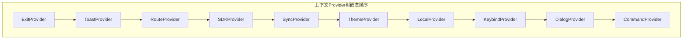
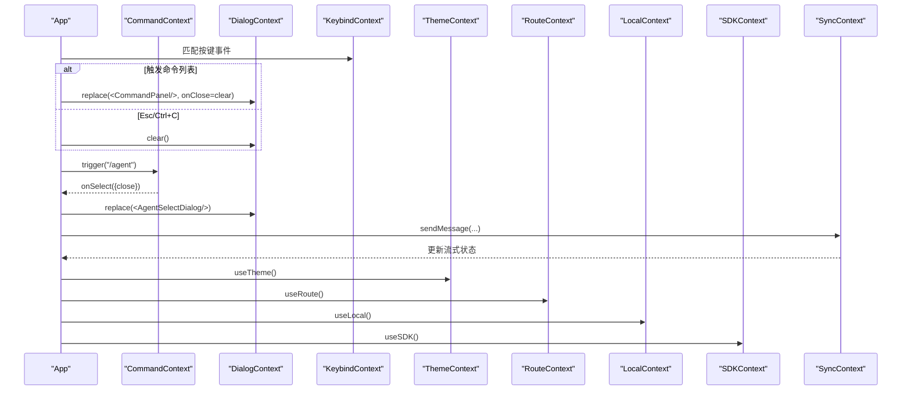
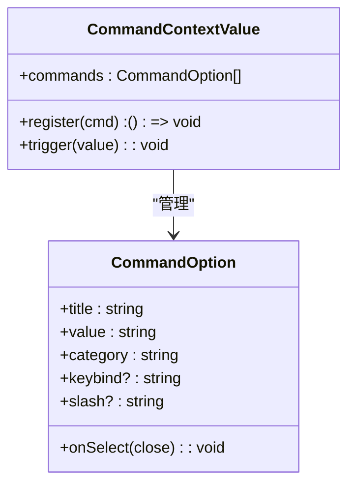
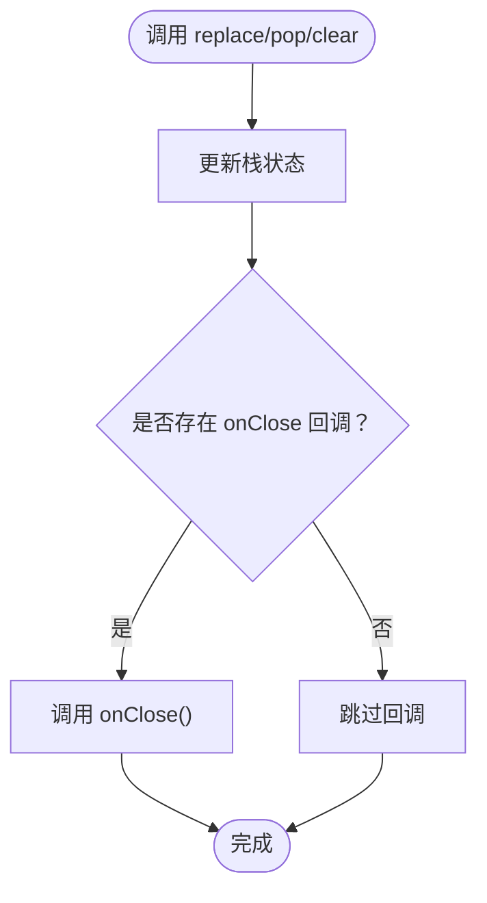
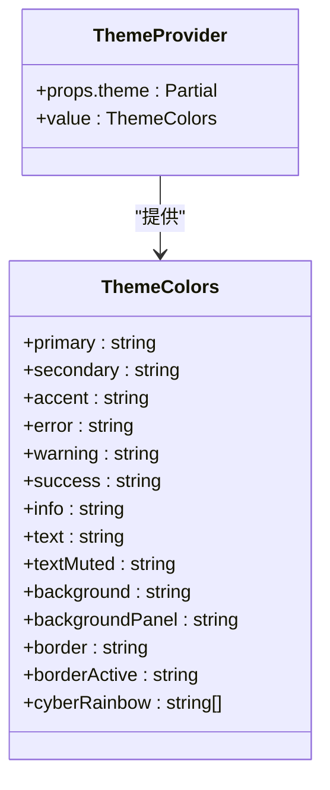
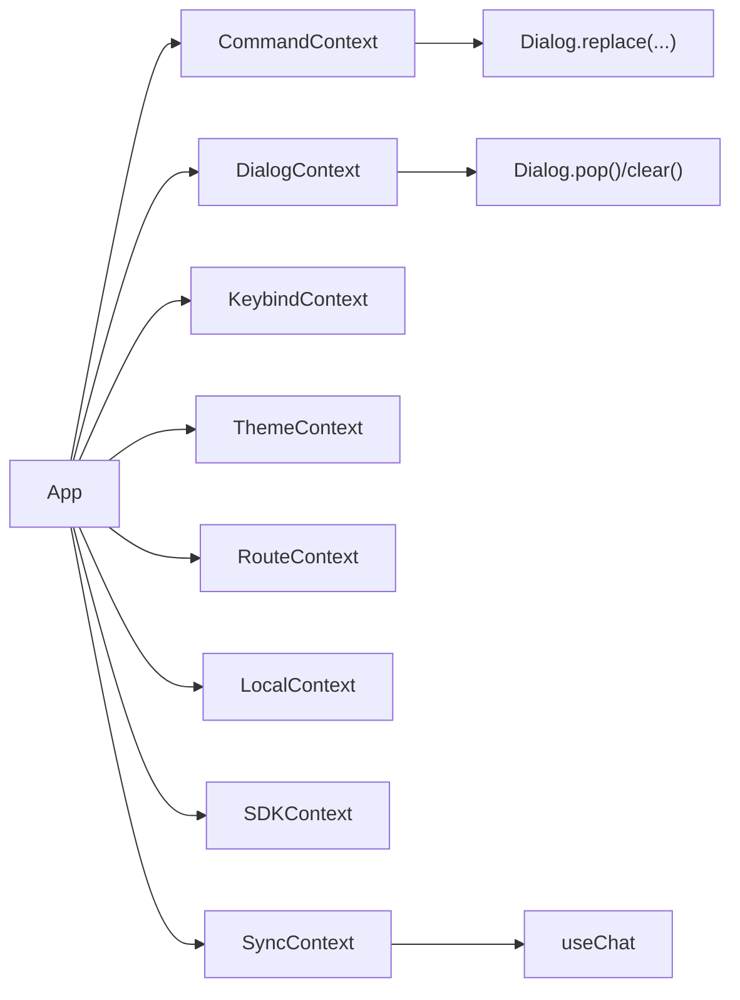

# 上下文系统

<cite>
**本文引用的文件**
- [CommandContext.tsx](file://terminal-ui/src/contexts/CommandContext.tsx)
- [DialogContext.tsx](file://terminal-ui/src/contexts/DialogContext.tsx)
- [ThemeContext.tsx](file://terminal-ui/src/contexts/ThemeContext.tsx)
- [index.tsx](file://terminal-ui/src/contexts/index.tsx)
- [App.tsx](file://terminal-ui/src/App.tsx)
- [ExitContext.tsx](file://terminal-ui/src/contexts/ExitContext.tsx)
- [ToastContext.tsx](file://terminal-ui/src/contexts/ToastContext.tsx)
- [RouteContext.tsx](file://terminal-ui/src/contexts/RouteContext.tsx)
- [SDKContext.tsx](file://terminal-ui/src/contexts/SDKContext.tsx)
- [SyncContext.tsx](file://terminal-ui/src/contexts/SyncContext.tsx)
- [LocalContext.tsx](file://terminal-ui/src/contexts/LocalContext.tsx)
- [KeybindContext.tsx](file://terminal-ui/src/contexts/KeybindContext.tsx)
- [helper.tsx](file://terminal-ui/src/contexts/helper.tsx)
- [types.ts](file://terminal-ui/src/types.ts)
- [useChat.ts](file://terminal-ui/src/useChat.ts)
</cite>

## 目录
1. [引言](#引言)
2. [项目结构](#项目结构)
3. [核心组件](#核心组件)
4. [架构总览](#架构总览)
5. [详细组件分析](#详细组件分析)
6. [依赖分析](#依赖分析)
7. [性能考虑](#性能考虑)
8. [故障排查指南](#故障排查指南)
9. [结论](#结论)
10. [附录](#附录)

## 引言
本文件面向Secbot命令行界面（TUI）中的React Context体系，系统性梳理上下文的职责、作用域与交互关系，重点覆盖以下方面：
- CommandContext命令上下文：命令注册、触发与管理机制
- DialogContext对话框上下文：对话框栈管理与状态同步
- ThemeContext主题上下文：颜色方案与样式定制
- 上下文树的嵌套顺序与依赖关系
- 数据流向与控制流
- 最佳实践、性能优化与调试技巧
- 扩展与自定义上下文系统的建议

## 项目结构
终端UI的上下文系统位于terminal-ui/src/contexts目录，采用“单一职责、按需组合”的Provider树设计。各上下文围绕UI状态、交互行为与主题进行解耦，通过统一的AllProviders进行装配。

图表来源
- [index.tsx](file://terminal-ui/src/contexts/index.tsx#L1-L63)

章节来源
- [index.tsx](file://terminal-ui/src/contexts/index.tsx#L1-L63)

## 核心组件
本节概览各上下文的核心职责与典型使用场景：
- CommandContext：集中管理命令选项与触发器，支持动态注册/注销命令
- DialogContext：维护对话框栈，提供替换、弹栈与清空能力
- ThemeContext：提供赛博朋克风格的主题色板与可定制化入口
- RouteContext：路由状态与导航方法，驱动视图切换
- SDKContext：封装基础网络访问与SSE连接
- SyncContext：会话与流式数据同步，承载useChat逻辑
- LocalContext：纯前端UI状态（如聊天模式、当前智能体）
- KeybindContext：按键绑定匹配与打印，支持默认与配置覆盖
- ExitContext：退出回调注入，便于App统一处理退出
- ToastContext：全局提示展示与错误统一处理
- helper.ts：通用上下文创建与错误抛出约定

章节来源
- [CommandContext.tsx](file://terminal-ui/src/contexts/CommandContext.tsx#L1-L50)
- [DialogContext.tsx](file://terminal-ui/src/contexts/DialogContext.tsx#L1-L63)
- [ThemeContext.tsx](file://terminal-ui/src/contexts/ThemeContext.tsx#L1-L59)
- [RouteContext.tsx](file://terminal-ui/src/contexts/RouteContext.tsx#L1-L36)
- [SDKContext.tsx](file://terminal-ui/src/contexts/SDKContext.tsx#L1-L32)
- [SyncContext.tsx](file://terminal-ui/src/contexts/SyncContext.tsx#L1-L45)
- [LocalContext.tsx](file://terminal-ui/src/contexts/LocalContext.tsx#L1-L33)
- [KeybindContext.tsx](file://terminal-ui/src/contexts/KeybindContext.tsx#L1-L137)
- [ExitContext.tsx](file://terminal-ui/src/contexts/ExitContext.tsx#L1-L26)
- [ToastContext.tsx](file://terminal-ui/src/contexts/ToastContext.tsx#L1-L57)
- [helper.tsx](file://terminal-ui/src/contexts/helper.tsx#L1-L22)

## 架构总览
上下文体系在App根组件中被统一注入，并通过useXxx钩子在各子组件中消费。命令面板、对话框、主题与路由等共同决定UI呈现与交互行为。

图表来源
- [App.tsx](file://terminal-ui/src/App.tsx#L46-L175)
- [CommandContext.tsx](file://terminal-ui/src/contexts/CommandContext.tsx#L20-L49)
- [DialogContext.tsx](file://terminal-ui/src/contexts/DialogContext.tsx#L19-L56)
- [KeybindContext.tsx](file://terminal-ui/src/contexts/KeybindContext.tsx#L102-L136)
- [ThemeContext.tsx](file://terminal-ui/src/contexts/ThemeContext.tsx#L39-L58)
- [RouteContext.tsx](file://terminal-ui/src/contexts/RouteContext.tsx#L19-L35)
- [LocalContext.tsx](file://terminal-ui/src/contexts/LocalContext.tsx#L15-L32)
- [SDKContext.tsx](file://terminal-ui/src/contexts/SDKContext.tsx#L14-L31)
- [SyncContext.tsx](file://terminal-ui/src/contexts/SyncContext.tsx#L22-L44)

## 详细组件分析

### CommandContext：命令上下文
职责与作用域
- 维护命令列表，支持动态注册与注销
- 提供trigger(value)触发命令回调
- onSelect回调接收一个闭包函数close，用于在命令执行后关闭对话框

设计要点
- 使用useState存储命令数组，useCallback稳定注册/触发函数引用
- register返回一个注销函数，确保组件卸载时清理命令
- trigger基于命令value精确匹配，避免重复执行

图表来源
- [CommandContext.tsx](file://terminal-ui/src/contexts/CommandContext.tsx#L3-L16)

章节来源
- [CommandContext.tsx](file://terminal-ui/src/contexts/CommandContext.tsx#L1-L50)
- [App.tsx](file://terminal-ui/src/App.tsx#L68-L154)

### DialogContext：对话框上下文
职责与作用域
- 维护对话框栈（DialogStackItem[]），每个元素包含React节点与可选onClose回调
- 提供replace(element, onClose?)：替换栈顶为新对话框
- 提供pop()：弹栈并调用顶层对话框的onClose
- 提供clear()：清空栈并依次调用每个对话框的onClose

实现细节
- replace将栈重置为单元素数组，保证对话框层级清晰
- pop/clear在更新栈前先调用对应onClose，确保资源释放与副作用清理
- 在开发调试阶段，内部存在向本地调试服务上报日志的代码片段（不影响功能）

图表来源
- [DialogContext.tsx](file://terminal-ui/src/contexts/DialogContext.tsx#L19-L49)

章节来源
- [DialogContext.tsx](file://terminal-ui/src/contexts/DialogContext.tsx#L1-L63)
- [App.tsx](file://terminal-ui/src/App.tsx#L156-L175)

### ThemeContext：主题上下文
职责与作用域
- 提供语义化颜色令牌（如primary、background、border等）
- 默认提供赛博朋克风格色板（主色绿+霓虹七彩）
- 支持通过ThemeProvider的theme属性进行部分覆盖

最佳实践
- 在根组件包裹ThemeProvider，确保全站样式一致性
- 通过Partial<ThemeColors>传入差异化的主题配置，避免全量覆盖

图表来源
- [ThemeContext.tsx](file://terminal-ui/src/contexts/ThemeContext.tsx#L4-L37)

章节来源
- [ThemeContext.tsx](file://terminal-ui/src/contexts/ThemeContext.tsx#L1-L59)

### RouteContext：路由上下文
职责与作用域
- 维护当前路由类型（home/session）与可选参数（如initialPrompt）
- 提供navigate(route)切换路由

与App的协作
- App根据route.type选择渲染HomeView或SessionView
- 通过initialPrompt在会话视图中预填输入

章节来源
- [RouteContext.tsx](file://terminal-ui/src/contexts/RouteContext.tsx#L1-L36)
- [App.tsx](file://terminal-ui/src/App.tsx#L190-L198)

### SDKContext：SDK上下文
职责与作用域
- 暴露baseUrl、fetch与connectSSE等SDK能力
- 作为网络访问与SSE连接的统一入口

章节来源
- [SDKContext.tsx](file://terminal-ui/src/contexts/SDKContext.tsx#L1-L32)

### SyncContext：同步上下文
职责与作用域
- 将useChat的状态与方法暴露为上下文，供App与子组件消费
- 包含streaming、streamState、history、apiOutput、pendingRootRequest以及sendMessage/setRESTOutput等

与useChat的关系
- SyncProvider内部调用useChat并将其返回值作为Provider value
- App通过useSync消费流式状态与发送消息能力

章节来源
- [SyncContext.tsx](file://terminal-ui/src/contexts/SyncContext.tsx#L1-L45)
- [useChat.ts](file://terminal-ui/src/useChat.ts#L31-L218)

### LocalContext：本地上下文
职责与作用域
- 维护纯前端UI状态：chat模式（ask/agent）与当前agent
- 提供setMode与setAgent方法

与App的协作
- App在命令切换时调用setMode，配合Toast反馈用户

章节来源
- [LocalContext.tsx](file://terminal-ui/src/contexts/LocalContext.tsx#L1-L33)
- [App.tsx](file://terminal-ui/src/App.tsx#L68-L154)

### KeybindContext：按键绑定上下文
职责与作用域
- 定义默认按键绑定集合与匹配规则
- 提供match(id, evt)判断按键是否命中指定快捷键
- 提供print(id)输出可读标签

与App的协作
- App在useInput中将原始输入转换为ParsedKey并交由Keybind.match判定
- 支持从配置覆盖默认绑定

章节来源
- [KeybindContext.tsx](file://terminal-ui/src/contexts/KeybindContext.tsx#L1-L137)
- [App.tsx](file://terminal-ui/src/App.tsx#L156-L175)

### ExitContext与ToastContext：辅助上下文
- ExitContext：提供统一退出回调，便于App在不同场景下优雅退出
- ToastContext：提供全局提示展示与错误统一处理，支持定时自动关闭

章节来源
- [ExitContext.tsx](file://terminal-ui/src/contexts/ExitContext.tsx#L1-L26)
- [ToastContext.tsx](file://terminal-ui/src/contexts/ToastContext.tsx#L1-L57)

### helper.ts：通用上下文创建
- 提供createSimpleContext(name)：统一创建Context与useHook，未在Provider内使用时抛出明确错误

章节来源
- [helper.tsx](file://terminal-ui/src/contexts/helper.tsx#L1-L22)

## 依赖分析
上下文之间的依赖关系与耦合度
- App直接依赖多个上下文：Dialog、Keybind、Command、Toast、Route、Sync、Local、SDK、Theme
- CommandContext与DialogContext存在间接协作：Command.trigger通常触发Dialog.replace以打开命令面板或具体对话框
- SyncContext与useChat紧密耦合，负责流式状态与SSE事件处理
- RouteContext与LocalContext影响App的渲染分支与UI状态
- ThemeContext独立于业务逻辑，仅提供样式令牌
- ExitContext与ToastContext为横切关注点，贯穿整个应用生命周期

图表来源
- [App.tsx](file://terminal-ui/src/App.tsx#L46-L175)
- [CommandContext.tsx](file://terminal-ui/src/contexts/CommandContext.tsx#L20-L49)
- [DialogContext.tsx](file://terminal-ui/src/contexts/DialogContext.tsx#L19-L56)
- [SyncContext.tsx](file://terminal-ui/src/contexts/SyncContext.tsx#L22-L44)
- [useChat.ts](file://terminal-ui/src/useChat.ts#L31-L218)

章节来源
- [App.tsx](file://terminal-ui/src/App.tsx#L46-L175)
- [SyncContext.tsx](file://terminal-ui/src/contexts/SyncContext.tsx#L22-L44)
- [useChat.ts](file://terminal-ui/src/useChat.ts#L31-L218)

## 性能考虑
- 函数稳定性
  - CommandContext.register/trigger与DialogContext.replace/pop/clear均使用useCallback，避免子组件不必要的重渲染
  - KeybindContext.match/print通过useMemo缓存计算结果，减少频繁匹配开销
- 状态粒度
  - SyncContext将复杂流式状态拆分为多个字段，便于局部更新与精准订阅
  - LocalContext仅保存UI相关状态，避免与后端同步造成抖动
- 渲染分支
  - App根据hasDialog与route.type进行条件渲染，减少非必要组件挂载
- 资源释放
  - DialogContext在pop/clear前调用onClose，确保SSE/定时器等资源及时清理
- 主题定制
  - ThemeProvider通过浅合并默认主题与传入配置，避免深层对象拷贝带来的性能损耗

[本节为通用指导，无需特定文件引用]

## 故障排查指南
- “必须在Provider内使用”类错误
  - 现象：调用useXxx时报错，提示必须在对应Provider内使用
  - 排查：确认AllProviders是否正确包裹App根组件
  - 参考：helper.ts中统一的错误抛出约定
- 命令无法触发
  - 现象：trigger(value)无效
  - 排查：检查命令value是否与register时一致；确认onSelect回调是否调用了close
- 对话框无法关闭
  - 现象：Esc/Ctrl+C无效或多次点击无响应
  - 排查：确认App中useInput对Esc/Ctrl+C的处理逻辑；检查DialogContext的pop/clear是否被调用
- 主题不生效
  - 现象：自定义主题未覆盖默认色板
  - 排查：确认ThemeProvider的theme传参为Partial<ThemeColors>且键名正确
- 流式状态异常
  - 现象：内容不更新或重复渲染
  - 排查：检查useChat中SSE事件映射与状态合并逻辑；确认sendMessage调用时机与AbortController使用

章节来源
- [helper.tsx](file://terminal-ui/src/contexts/helper.tsx#L10-L21)
- [CommandContext.tsx](file://terminal-ui/src/contexts/CommandContext.tsx#L20-L49)
- [DialogContext.tsx](file://terminal-ui/src/contexts/DialogContext.tsx#L19-L56)
- [ThemeContext.tsx](file://terminal-ui/src/contexts/ThemeContext.tsx#L41-L58)
- [useChat.ts](file://terminal-ui/src/useChat.ts#L62-L196)

## 结论
Secbot的上下文系统通过清晰的职责划分与稳定的Provider树实现了UI状态、交互行为与主题的解耦。CommandContext、DialogContext与ThemeContext分别承担命令管理、对话框栈与样式定制的核心职责，配合Route、Local、Sync、Keybind等上下文，形成完整的TUI交互闭环。遵循本文的最佳实践与性能建议，可在保证可维护性的前提下获得良好的用户体验。

[本节为总结性内容，无需特定文件引用]

## 附录

### 上下文与类型定义
- ChatMode、StreamState、ContentBlock等类型定义与流式渲染密切相关
- SyncContext与useChat共同承载会话与SSE事件处理

章节来源
- [types.ts](file://terminal-ui/src/types.ts#L9-L75)
- [SyncContext.tsx](file://terminal-ui/src/contexts/SyncContext.tsx#L11-L20)
- [useChat.ts](file://terminal-ui/src/useChat.ts#L18-L31)