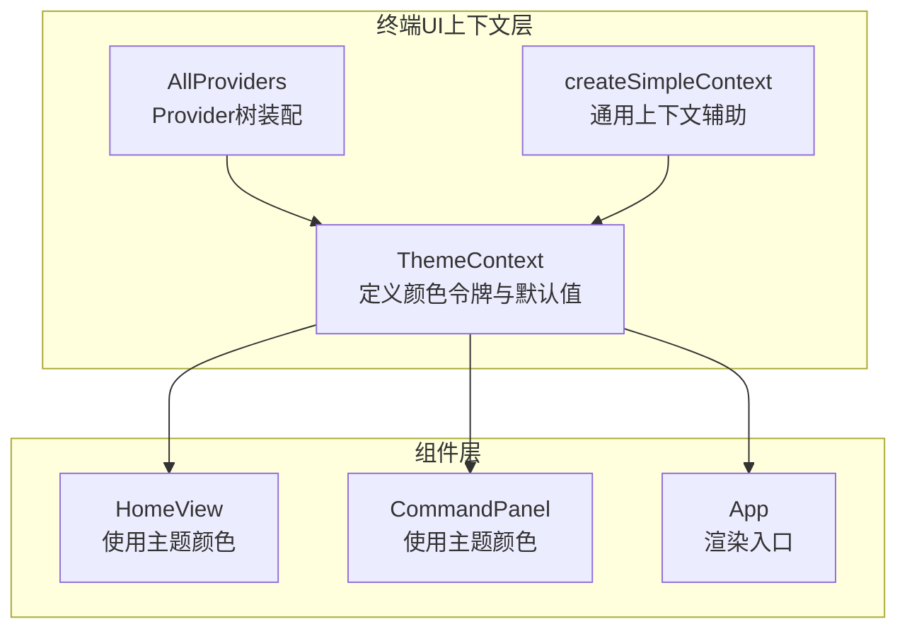
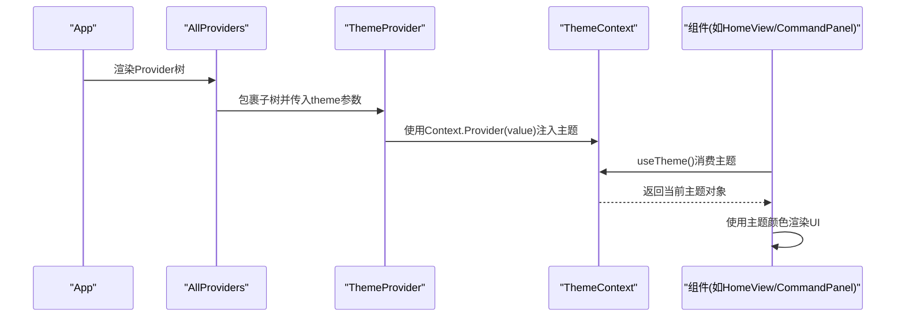
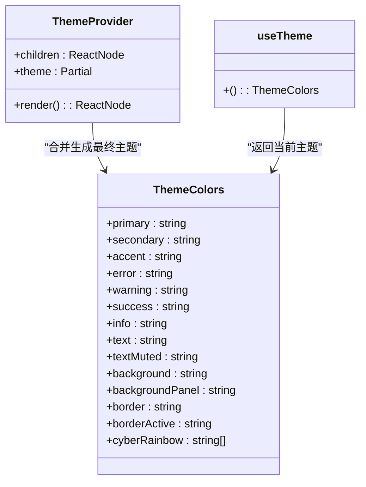
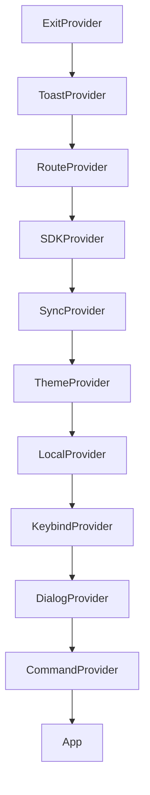
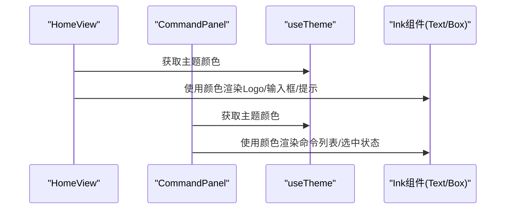
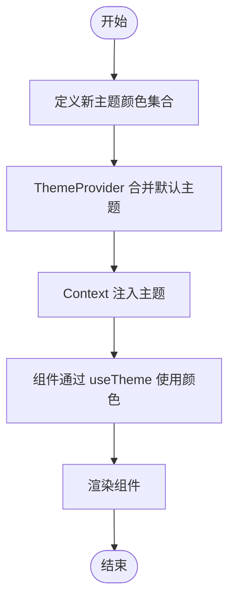
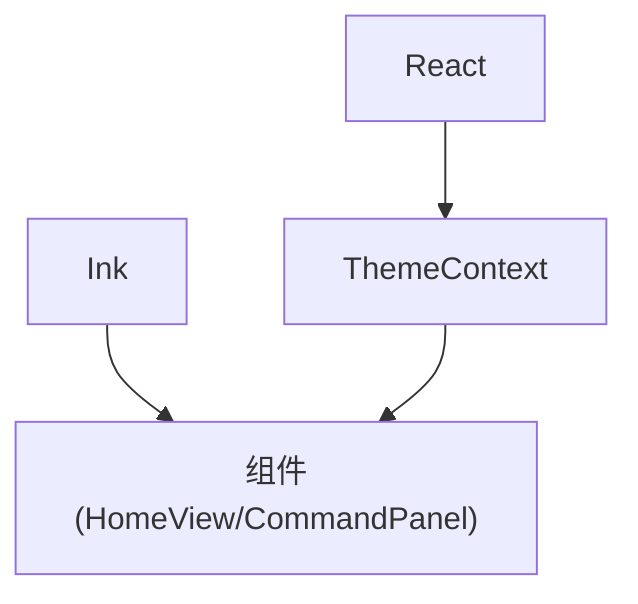

# 主题上下文 (ThemeContext)

<cite>
**本文档引用的文件**
- [ThemeContext.tsx](file://terminal-ui/src/contexts/ThemeContext.tsx)
- [index.tsx](file://terminal-ui/src/contexts/index.tsx)
- [helper.tsx](file://terminal-ui/src/contexts/helper.tsx)
- [CommandPanel.tsx](file://terminal-ui/src/components/CommandPanel.tsx)
- [HomeView.tsx](file://terminal-ui/src/views/HomeView.tsx)
- [App.tsx](file://terminal-ui/src/App.tsx)
- [index.ts](file://app/src/theme/index.ts)
- [package.json](file://terminal-ui/package.json)
</cite>

## 目录
1. [简介](#简介)
2. [项目结构](#项目结构)
3. [核心组件](#核心组件)
4. [架构总览](#架构总览)
5. [详细组件分析](#详细组件分析)
6. [依赖关系分析](#依赖关系分析)
7. [性能考虑](#性能考虑)
8. [故障排除指南](#故障排除指南)
9. [结论](#结论)
10. [附录](#附录)

## 简介
本文件系统性阐述终端用户界面（TUI）中的主题上下文（ThemeContext）设计与实现，涵盖主题定义、颜色方案、样式定制机制、主题切换与动态样式应用、响应式设计支持、状态管理（当前主题状态、主题偏好存储、全局样式注入）、与UI组件的集成方式、样式继承与覆盖机制，以及主题扩展与自定义指南。该主题系统基于React Context构建，为Ink终端组件提供语义化颜色令牌，并通过Provider树在应用范围内传播主题状态。

## 项目结构
ThemeContext位于终端UI子项目的上下文层，与其它上下文（如路由、对话框、命令等）共同构成完整的Provider树。其职责是：
- 定义语义化颜色令牌接口
- 提供默认主题值
- 合并用户传入的主题覆盖
- 通过useTheme钩子向组件暴露主题

**图表来源**
- [ThemeContext.tsx](file://terminal-ui/src/contexts/ThemeContext.tsx#L1-L59)
- [index.tsx](file://terminal-ui/src/contexts/index.tsx#L1-L63)
- [helper.tsx](file://terminal-ui/src/contexts/helper.tsx#L1-L22)
- [HomeView.tsx](file://terminal-ui/src/views/HomeView.tsx#L1-L200)
- [CommandPanel.tsx](file://terminal-ui/src/components/CommandPanel.tsx#L1-L92)
- [App.tsx](file://terminal-ui/src/App.tsx#L1-L202)

**章节来源**
- [ThemeContext.tsx](file://terminal-ui/src/contexts/ThemeContext.tsx#L1-L59)
- [index.tsx](file://terminal-ui/src/contexts/index.tsx#L1-L63)

## 核心组件
- ThemeColors接口：定义语义化颜色令牌，包括主色、辅色、强调色、状态色、文本色、背景色、边框色、激活边框色及赛博朋克彩虹色板。
- 默认主题defaultTheme：提供一套初始颜色值，确保在未显式覆盖时组件仍可正常渲染。
- ThemeProvider：合并默认主题与用户传入的局部主题，形成最终主题值并注入到React Context。
- useTheme：消费上下文，返回当前主题对象，供组件读取颜色令牌。

这些组件共同构成主题系统的核心，既保证了最小可用性，又提供了灵活的扩展能力。

**章节来源**
- [ThemeContext.tsx](file://terminal-ui/src/contexts/ThemeContext.tsx#L3-L37)
- [ThemeContext.tsx](file://terminal-ui/src/contexts/ThemeContext.tsx#L41-L58)

## 架构总览
ThemeContext采用React Context作为状态容器，结合AllProviders装配，形成稳定的Provider树。组件通过useTheme钩子读取主题令牌，实现跨组件的颜色一致性与动态切换。

**图表来源**
- [index.tsx](file://terminal-ui/src/contexts/index.tsx#L17-L47)
- [ThemeContext.tsx](file://terminal-ui/src/contexts/ThemeContext.tsx#L41-L58)
- [HomeView.tsx](file://terminal-ui/src/views/HomeView.tsx#L31-L31)
- [CommandPanel.tsx](file://terminal-ui/src/components/CommandPanel.tsx#L14-L14)

## 详细组件分析

### ThemeContext 设计与实现
- 接口设计：ThemeColors以语义化命名组织颜色令牌，便于组件按功能语义而非具体颜色值进行引用，提升可维护性与一致性。
- 默认值策略：defaultTheme提供一组合理的初始值，确保在无外部覆盖时组件仍具备良好的视觉表现。
- 合并策略：ThemeProvider通过浅合并默认主题与传入的Partial<ThemeColors>，允许部分覆盖，避免全量替换带来的复杂度。
- 访问器：useTheme返回当前主题对象，组件可直接读取所需颜色令牌。

**图表来源**
- [ThemeContext.tsx](file://terminal-ui/src/contexts/ThemeContext.tsx#L4-L37)
- [ThemeContext.tsx](file://terminal-ui/src/contexts/ThemeContext.tsx#L41-L58)

**章节来源**
- [ThemeContext.tsx](file://terminal-ui/src/contexts/ThemeContext.tsx#L1-L59)

### Provider 树与主题注入
AllProviders按照固定顺序嵌套多个上下文Provider，其中ThemeContext位于关键位置，确保其在所有依赖主题的组件之前被初始化。这种装配方式保证了：
- Provider树的稳定性与可预测性
- 主题在应用生命周期内始终可用
- 与其他上下文（路由、对话框、命令等）协同工作

**图表来源**
- [index.tsx](file://terminal-ui/src/contexts/index.tsx#L1-L63)

**章节来源**
- [index.tsx](file://terminal-ui/src/contexts/index.tsx#L1-L63)

### 组件集成与样式应用
- HomeView：在Logo、输入提示、建议行、提示信息、底部状态栏等关键区域使用主题颜色，体现一致的视觉风格。
- CommandPanel：在命令标题、分类标签、选中状态指示等处使用主题颜色，增强交互反馈与可读性。
- App：作为渲染入口，承载Provider树与视图组件，确保主题在整个应用范围内的可用性。

**图表来源**
- [HomeView.tsx](file://terminal-ui/src/views/HomeView.tsx#L107-L196)
- [CommandPanel.tsx](file://terminal-ui/src/components/CommandPanel.tsx#L64-L88)
- [ThemeContext.tsx](file://terminal-ui/src/contexts/ThemeContext.tsx#L56-L58)

**章节来源**
- [HomeView.tsx](file://terminal-ui/src/views/HomeView.tsx#L1-L200)
- [CommandPanel.tsx](file://terminal-ui/src/components/CommandPanel.tsx#L1-L92)

### 主题扩展与自定义指南
- 新主题添加：通过ThemeProvider的theme属性传入新的颜色令牌集合，即可实现主题切换或扩展。由于采用浅合并策略，只需提供需要覆盖的字段。
- 颜色变量定义：遵循ThemeColors接口的语义化命名，确保新增颜色令牌与现有组件兼容。
- 样式规则扩展：组件内部应尽量使用useTheme返回的颜色令牌，避免硬编码颜色值，从而自然地适配新主题。

**图表来源**
- [ThemeContext.tsx](file://terminal-ui/src/contexts/ThemeContext.tsx#L41-L58)

**章节来源**
- [ThemeContext.tsx](file://terminal-ui/src/contexts/ThemeContext.tsx#L41-L58)

### 与UI-DESIGN-AND-INTERACTION 的对齐
- ThemeContext明确标注与UI设计规范的对齐关系，确保颜色方案符合设计要求。
- 赛博朋克风格的主色与霓虹七彩色板体现了特定的视觉风格，便于品牌识别与一致性。

**章节来源**
- [ThemeContext.tsx](file://terminal-ui/src/contexts/ThemeContext.tsx#L3-L3)

### 与应用主题模块的关系
- app/src/theme/index.ts提供另一套主题配置（明暗主题风格），包含颜色、间距、字号、圆角等维度，服务于Web端或不同平台的样式需求。
- 终端UI的ThemeContext专注于终端渲染环境的颜色令牌，两者可并行存在，分别服务于不同的UI平台。

**章节来源**
- [index.ts](file://app/src/theme/index.ts#L1-L64)

## 依赖关系分析
- 运行时依赖：Ink组件库用于终端渲染，React用于上下文与组件体系。
- 上下文依赖：ThemeContext依赖React Context API；AllProviders依赖各上下文Provider；组件依赖useTheme钩子。
- 依赖耦合：ThemeContext与组件之间为弱耦合，组件仅依赖语义化颜色令牌，降低对具体颜色值的耦合度。

**图表来源**
- [package.json](file://terminal-ui/package.json#L17-L24)
- [ThemeContext.tsx](file://terminal-ui/src/contexts/ThemeContext.tsx#L1-L1)
- [HomeView.tsx](file://terminal-ui/src/views/HomeView.tsx#L1-L1)
- [CommandPanel.tsx](file://terminal-ui/src/components/CommandPanel.tsx#L1-L1)

**章节来源**
- [package.json](file://terminal-ui/package.json#L1-L35)

## 性能考虑
- Context更新：useTheme返回的是整个主题对象，组件订阅Context时可能触发重渲染。建议：
  - 将useTheme调用限制在需要颜色的组件层级，避免在高频渲染的父组件中频繁调用。
  - 对于不需要颜色的子组件，避免直接订阅Context。
- 浅合并成本：ThemeProvider对默认主题与传入主题进行浅合并，开销极低，适合频繁切换场景。
- 渲染优化：组件内部可使用useMemo/useCallback缓存计算结果，减少不必要的渲染。

## 故障排除指南
- 缺少Provider：若组件抛出“必须在Provider内部使用”的错误，检查AllProviders是否正确包裹应用根节点。
- 颜色不生效：确认组件是否正确调用useTheme并使用返回的颜色令牌；检查ThemeProvider的theme参数是否正确传入。
- 主题切换无效：确认切换逻辑是否重新渲染ThemeProvider或更新其theme属性；注意浅合并策略，确保传入的字段名与ThemeColors一致。

**章节来源**
- [helper.tsx](file://terminal-ui/src/contexts/helper.tsx#L13-L19)

## 结论
ThemeContext通过语义化颜色令牌、默认主题与浅合并策略，为终端UI提供了简洁而强大的主题系统。它与AllProviders装配、组件集成紧密配合，实现了跨组件的一致性与可扩展性。通过遵循本文档的扩展与自定义指南，可在不破坏现有组件的前提下引入新主题或调整颜色方案，满足多样化的视觉需求。

## 附录
- 最佳实践
  - 在组件中优先使用useTheme返回的颜色令牌，避免硬编码颜色值。
  - 将主题切换逻辑集中在单一Provider处，便于集中管理与调试。
  - 对高频渲染组件谨慎订阅Context，必要时进行性能优化。
- 参考实现
  - ThemeProvider与useTheme的实现路径：[ThemeContext.tsx](file://terminal-ui/src/contexts/ThemeContext.tsx#L41-L58)
  - Provider树装配路径：[index.tsx](file://terminal-ui/src/contexts/index.tsx#L17-L47)
  - 组件使用示例路径：[HomeView.tsx](file://terminal-ui/src/views/HomeView.tsx#L31-L31), [CommandPanel.tsx](file://terminal-ui/src/components/CommandPanel.tsx#L14-L14)