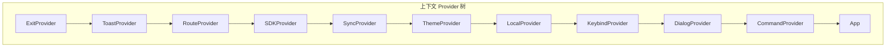
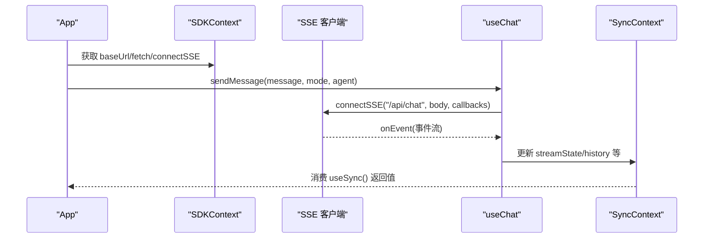
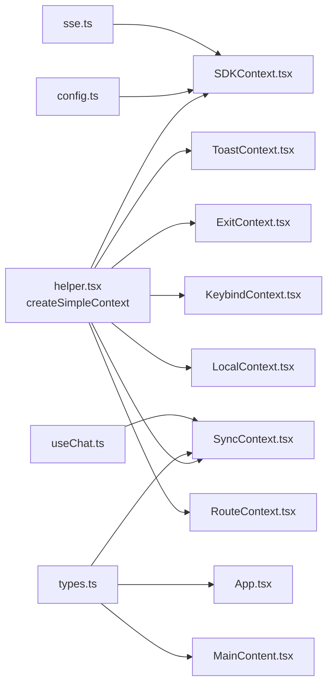
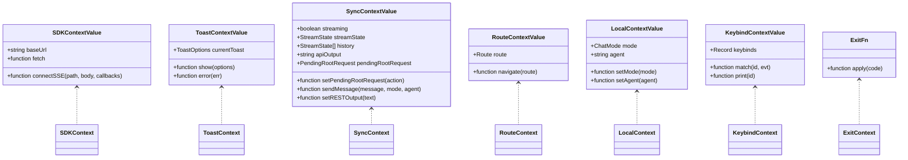
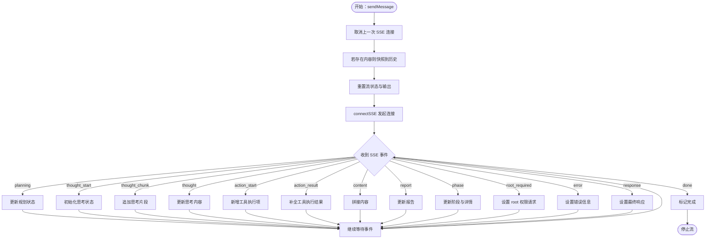

# 其他上下文组件

<cite>
**本文引用的文件**
- [SDKContext.tsx](file://terminal-ui/src/contexts/SDKContext.tsx)
- [ToastContext.tsx](file://terminal-ui/src/contexts/ToastContext.tsx)
- [SyncContext.tsx](file://terminal-ui/src/contexts/SyncContext.tsx)
- [ExitContext.tsx](file://terminal-ui/src/contexts/ExitContext.tsx)
- [KeybindContext.tsx](file://terminal-ui/src/contexts/KeybindContext.tsx)
- [LocalContext.tsx](file://terminal-ui/src/contexts/LocalContext.tsx)
- [RouteContext.tsx](file://terminal-ui/src/contexts/RouteContext.tsx)
- [helper.tsx](file://terminal-ui/src/contexts/helper.tsx)
- [types.ts](file://terminal-ui/src/types.ts)
- [useChat.ts](file://terminal-ui/src/useChat.ts)
- [sse.ts](file://terminal-ui/src/sse.ts)
- [config.ts](file://terminal-ui/src/config.ts)
- [App.tsx](file://terminal-ui/src/App.tsx)
- [MainContent.tsx](file://terminal-ui/src/MainContent.tsx)
- [index.tsx](file://terminal-ui/src/contexts/index.tsx)
</cite>

## 目录
1. [简介](#简介)
2. [项目结构](#项目结构)
3. [核心组件](#核心组件)
4. [架构总览](#架构总览)
5. [详细组件分析](#详细组件分析)
6. [依赖分析](#依赖分析)
7. [性能考虑](#性能考虑)
8. [故障排查指南](#故障排查指南)
9. [结论](#结论)
10. [附录](#附录)

## 简介
本文件系统性梳理终端 UI 中的“其他上下文组件”，包括 SDKContext、ToastContext、SyncContext、ExitContext、KeybindContext、LocalContext 和 RouteContext。围绕各上下文的职责边界、数据结构、协作关系与错误处理进行深入分析，并给出最佳实践、扩展指南与常见问题解决方案。

## 项目结构
终端 UI 的上下文体系位于 terminal-ui/src/contexts 下，采用“简单上下文创建器 + 多 Provider 嵌套”的组织方式。所有上下文通过统一的导出入口集中管理，形成清晰的 Provider 树。

图表来源
- [index.tsx](file://terminal-ui/src/contexts/index.tsx#L17-L47)

章节来源
- [index.tsx](file://terminal-ui/src/contexts/index.tsx#L1-L63)

## 核心组件
- SDKContext：封装 SDK 访问能力（基础 URL、fetch、SSE 连接），为上层组件提供统一的后端访问接口。
- ToastContext：全局提示通知管理，支持多种变体与自动隐藏。
- SyncContext：会话与流式数据同步层，承载 useChat 的状态与方法，向上游暴露统一接口。
- ExitContext：进程退出回调注入，统一处理退出行为。
- KeybindContext：键盘快捷键映射与匹配，支持默认键位与用户配置覆盖。
- LocalContext：纯前端 UI 状态（模式、智能体等），与后端解耦。
- RouteContext：页面路由状态（首页/会话），支持携带初始参数。

章节来源
- [SDKContext.tsx](file://terminal-ui/src/contexts/SDKContext.tsx#L1-L32)
- [ToastContext.tsx](file://terminal-ui/src/contexts/ToastContext.tsx#L1-L57)
- [SyncContext.tsx](file://terminal-ui/src/contexts/SyncContext.tsx#L1-L45)
- [ExitContext.tsx](file://terminal-ui/src/contexts/ExitContext.tsx#L1-L26)
- [KeybindContext.tsx](file://terminal-ui/src/contexts/KeybindContext.tsx#L1-L137)
- [LocalContext.tsx](file://terminal-ui/src/contexts/LocalContext.tsx#L1-L33)
- [RouteContext.tsx](file://terminal-ui/src/contexts/RouteContext.tsx#L1-L36)

## 架构总览
上下文之间通过 Provider 嵌套形成稳定的依赖链，App 作为顶层消费者，按需注入所需上下文。SSE 与后端交互由 SDKContext 提供，流式状态由 SyncContext 汇聚，UI 状态由 LocalContext 与 RouteContext 管理，键盘输入由 KeybindContext 解析，Toast 提供全局反馈，ExitContext 统一退出。

图表来源
- [App.tsx](file://terminal-ui/src/App.tsx#L54-L56)
- [useChat.ts](file://terminal-ui/src/useChat.ts#L62-L196)
- [sse.ts](file://terminal-ui/src/sse.ts#L33-L133)
- [SyncContext.tsx](file://terminal-ui/src/contexts/SyncContext.tsx#L24-L42)
- [SDKContext.tsx](file://terminal-ui/src/contexts/SDKContext.tsx#L14-L25)

## 详细组件分析

### SDKContext 设计与实现
- 职责
  - 提供后端基础地址、浏览器原生 fetch 与 SSE 连接函数，屏蔽底层网络细节。
  - 通过统一的 baseUrl 与环境变量对接不同部署场景。
- 关键点
  - 基于配置模块的 getBaseUrl 动态决定后端地址。
  - 将 SSE 客户端 connectSSE 注入上下文，供上层直接调用。
- 应用场景
  - 任何需要与后端进行流式通信或常规请求的组件均可使用 useSDK()。
- 最佳实践
  - 在组件中优先使用 useSDK().fetch 与 useSDK().connectSSE，避免硬编码 URL。
  - 对 SSE 错误进行统一处理，结合 Toast 提示用户。

章节来源
- [SDKContext.tsx](file://terminal-ui/src/contexts/SDKContext.tsx#L1-L32)
- [config.ts](file://terminal-ui/src/config.ts#L6-L8)
- [sse.ts](file://terminal-ui/src/sse.ts#L33-L133)

### ToastContext 设计与实现
- 职责
  - 统一管理全局提示（成功/错误/警告/信息），支持标题、消息、变体与持续时间。
  - 自动定时关闭，避免阻塞用户操作。
- 关键点
  - 使用 useRef 存储定时器，确保多次调用时正确清理旧定时器。
  - error 辅助方法可从任意异常对象提取消息。
- 应用场景
  - API 调用结果反馈、键盘快捷键提示、命令执行结果等。
- 最佳实践
  - 对关键操作（如模式切换、工具执行）提供 Toast 反馈。
  - 错误 Toast 使用 error 方法，保证消息一致性。

章节来源
- [ToastContext.tsx](file://terminal-ui/src/contexts/ToastContext.tsx#L1-L57)

### SyncContext 设计与实现
- 职责
  - 将 useChat 的流式状态与方法向上层暴露，App 与 MainContent 仅依赖 useSync()。
  - 保持与后端流式事件的对齐，支持历史记录、当前流状态、REST 输出等。
- 关键点
  - 通过 helper.tsx 的 createSimpleContext 统一创建上下文与错误提示。
  - 将 useChat 返回的状态与方法直接透传给 Provider 值。
- 应用场景
  - 主内容区渲染、滚动控制、工具执行结果展示。
- 最佳实践
  - 在渲染侧仅消费 useSync() 返回值，避免直接依赖 useChat。
  - 对 pendingRootRequest 进行统一处理，防止重复触发。

章节来源
- [SyncContext.tsx](file://terminal-ui/src/contexts/SyncContext.tsx#L1-L45)
- [helper.tsx](file://terminal-ui/src/contexts/helper.tsx#L6-L21)
- [useChat.ts](file://terminal-ui/src/useChat.ts#L31-L218)

### ExitContext 设计与实现
- 职责
  - 注入退出回调，统一处理进程退出逻辑，避免在多处散落退出代码。
- 关键点
  - 提供 useExit() 钩子，未包裹在 ExitProvider 内部时抛出明确错误。
- 应用场景
  - 用户快捷键退出、命令面板退出、异常终止等。
- 最佳实践
  - 在应用根部注入 onExit 回调，确保所有退出路径一致。

章节来源
- [ExitContext.tsx](file://terminal-ui/src/contexts/ExitContext.tsx#L1-L26)

### KeybindContext 设计与实现
- 职责
  - 管理键盘快捷键映射与匹配，支持默认键位与用户配置覆盖。
  - 提供键位打印与匹配函数，供输入事件处理器使用。
- 关键点
  - 默认键位集合覆盖常用操作（退出、命令列表、翻页、消息导航等）。
  - 支持从配置合并键位，允许后端或本地覆盖。
  - 将 Ink 输入转换为内部 ParsedKey，再与目标键位比较。
- 应用场景
  - 快捷键触发命令、切换模式、打开弹窗、滚动内容等。
- 最佳实践
  - 在 App 的 useInput 中统一处理键位匹配，减少分散逻辑。
  - 对未配置的键位提供友好提示或默认行为。

章节来源
- [KeybindContext.tsx](file://terminal-ui/src/contexts/KeybindContext.tsx#L1-L137)

### LocalContext 设计与实现
- 职责
  - 管理纯前端 UI 状态（如当前模式、当前智能体），与后端解耦。
- 关键点
  - 通过 createSimpleContext 统一创建上下文与错误提示。
  - 默认模式为智能体模式，智能体默认为 hackbot。
- 应用场景
  - 切换问答/任务模式、选择智能体、影响渲染与交互行为。
- 最佳实践
  - 仅存放 UI 状态，避免持久化到后端；如需持久化，应通过独立存储方案。

章节来源
- [LocalContext.tsx](file://terminal-ui/src/contexts/LocalContext.tsx#L1-L33)
- [helper.tsx](file://terminal-ui/src/contexts/helper.tsx#L6-L21)

### RouteContext 设计与实现
- 职责
  - 管理路由状态（首页/会话），支持携带初始输入参数。
- 关键点
  - 默认路由为首页；会话路由可携带 initialPrompt。
  - 提供 navigate 函数以驱动路由变更。
- 应用场景
  - 首页与会话视图切换、从首页跳转至会话并预填初始消息。
- 最佳实践
  - 在导航时同时更新 UI 与可能的会话参数，保持一致性。

章节来源
- [RouteContext.tsx](file://terminal-ui/src/contexts/RouteContext.tsx#L1-L36)

### 上下文协作与数据共享机制
- Provider 嵌套顺序
  - 严格遵循 UI-DESIGN-AND-INTERACTION 文档中的顺序，确保依赖链稳定。
- 数据流向
  - SDKContext 提供网络能力；SSE 事件经 useChat 聚合为流式状态；SyncContext 向上暴露；App 与 MainContent 消费。
  - KeybindContext 将输入事件转换为动作；Toast 提供反馈；Route/Local 控制视图与 UI 状态。
- 协作示例
  - App 在 useInput 中匹配键位，触发命令或切换模式；通过 Toast 提示；通过 Route 导航；通过 SDK 发起请求；通过 Sync 更新渲染。

章节来源
- [index.tsx](file://terminal-ui/src/contexts/index.tsx#L3-L4)
- [App.tsx](file://terminal-ui/src/App.tsx#L48-L175)
- [MainContent.tsx](file://terminal-ui/src/MainContent.tsx#L52-L216)

## 依赖分析
- 内部依赖
  - 各上下文均依赖 helper.tsx 的 createSimpleContext，统一错误提示与 use 钩子。
  - SyncContext 依赖 useChat.ts 的流式状态与方法。
  - SDKContext 依赖 sse.ts 与 config.ts。
  - App 与 MainContent 依赖 types.ts 的类型定义。
- 外部依赖
  - React 上下文与 Hooks。
  - 浏览器/Node 环境下的 fetch 与 AbortController。
- 耦合与内聚
  - 各上下文职责单一，内聚度高；通过 Provider 树组合，降低跨组件耦合。
  - KeybindContext 与 App 的输入处理存在弱耦合，但通过抽象接口（match/print）隔离。

图表来源
- [helper.tsx](file://terminal-ui/src/contexts/helper.tsx#L6-L21)
- [SDKContext.tsx](file://terminal-ui/src/contexts/SDKContext.tsx#L1-L32)
- [ToastContext.tsx](file://terminal-ui/src/contexts/ToastContext.tsx#L1-L57)
- [SyncContext.tsx](file://terminal-ui/src/contexts/SyncContext.tsx#L1-L45)
- [ExitContext.tsx](file://terminal-ui/src/contexts/ExitContext.tsx#L1-L26)
- [KeybindContext.tsx](file://terminal-ui/src/contexts/KeybindContext.tsx#L1-L137)
- [LocalContext.tsx](file://terminal-ui/src/contexts/LocalContext.tsx#L1-L33)
- [RouteContext.tsx](file://terminal-ui/src/contexts/RouteContext.tsx#L1-L36)
- [config.ts](file://terminal-ui/src/config.ts#L6-L8)
- [sse.ts](file://terminal-ui/src/sse.ts#L33-L133)
- [types.ts](file://terminal-ui/src/types.ts#L1-L75)
- [useChat.ts](file://terminal-ui/src/useChat.ts#L31-L218)
- [App.tsx](file://terminal-ui/src/App.tsx#L1-L202)
- [MainContent.tsx](file://terminal-ui/src/MainContent.tsx#L1-L217)

章节来源
- [helper.tsx](file://terminal-ui/src/contexts/helper.tsx#L1-L22)
- [types.ts](file://terminal-ui/src/types.ts#L1-L75)
- [useChat.ts](file://terminal-ui/src/useChat.ts#L1-L219)
- [sse.ts](file://terminal-ui/src/sse.ts#L1-L134)
- [config.ts](file://terminal-ui/src/config.ts#L1-L28)
- [App.tsx](file://terminal-ui/src/App.tsx#L1-L202)
- [MainContent.tsx](file://terminal-ui/src/MainContent.tsx#L1-L217)

## 性能考虑
- SSE 连接与事件解析
  - 使用流式读取与分段解析，避免一次性加载大文本；注意连接超时与中断处理。
- 渲染优化
  - MainContent 通过可见区域裁剪与判别器池并行处理，减少不必要的渲染开销。
- 状态更新
  - useChat 中对复杂对象使用浅拷贝与局部更新策略，避免不必要的重渲染。
- 键位匹配
  - KeybindContext 使用 useMemo 缓存合并后的键位表，减少重复计算。

章节来源
- [sse.ts](file://terminal-ui/src/sse.ts#L49-L133)
- [MainContent.tsx](file://terminal-ui/src/MainContent.tsx#L140-L148)
- [useChat.ts](file://terminal-ui/src/useChat.ts#L44-L56)
- [KeybindContext.tsx](file://terminal-ui/src/contexts/KeybindContext.tsx#L110-L124)

## 故障排查指南
- SSE 连接失败
  - 检查后端地址与环境变量配置；确认连接超时阈值与网络可达性。
  - 查看 onError 回调中的错误信息，必要时提示用户检查服务状态。
- Toast 不显示或无法自动关闭
  - 确认 ToastProvider 包裹范围；检查定时器是否被重复清除；核对变体与持续时间。
- 键位不生效
  - 核对 Ink 输入与 ParsedKey 转换；确认 keybinds 是否被正确合并与缓存。
- 路由跳转无效
  - 检查 navigate 调用与默认路由；确认初始参数是否正确传递。
- 退出异常
  - 确认 ExitProvider 注入了 onExit；在未包裹时会抛出明确错误。

章节来源
- [config.ts](file://terminal-ui/src/config.ts#L13-L27)
- [sse.ts](file://terminal-ui/src/sse.ts#L124-L129)
- [ToastContext.tsx](file://terminal-ui/src/contexts/ToastContext.tsx#L26-L38)
- [KeybindContext.tsx](file://terminal-ui/src/contexts/KeybindContext.tsx#L114-L118)
- [RouteContext.tsx](file://terminal-ui/src/contexts/RouteContext.tsx#L23-L23)
- [ExitContext.tsx](file://terminal-ui/src/contexts/ExitContext.tsx#L22-L24)

## 结论
上述上下文组件共同构成了终端 UI 的状态与交互基础设施。它们通过清晰的职责划分、统一的 Provider 树与类型约束，实现了低耦合、高内聚的架构设计。建议在扩展新功能时遵循现有模式：新增上下文遵循 helper.tsx 的创建规范，通过 index.tsx 的顺序嵌套接入，确保错误提示与使用方式一致。

## 附录

### 类图：上下文与类型关系

图表来源
- [SDKContext.tsx](file://terminal-ui/src/contexts/SDKContext.tsx#L6-L10)
- [ToastContext.tsx](file://terminal-ui/src/contexts/ToastContext.tsx#L12-L16)
- [SyncContext.tsx](file://terminal-ui/src/contexts/SyncContext.tsx#L11-L20)
- [RouteContext.tsx](file://terminal-ui/src/contexts/RouteContext.tsx#L12-L15)
- [LocalContext.tsx](file://terminal-ui/src/contexts/LocalContext.tsx#L8-L13)
- [KeybindContext.tsx](file://terminal-ui/src/contexts/KeybindContext.tsx#L59-L63)
- [ExitContext.tsx](file://terminal-ui/src/contexts/ExitContext.tsx#L3-L5)

### 流程图：SSE 事件处理与状态更新

图表来源
- [useChat.ts](file://terminal-ui/src/useChat.ts#L62-L196)
- [sse.ts](file://terminal-ui/src/sse.ts#L66-L77)

### 最佳实践清单
- 上下文创建
  - 使用 createSimpleContext 统一创建与错误提示。
  - 在 index.tsx 中按依赖顺序嵌套 Provider。
- 网络与流式
  - 使用 SDKContext 的 connectSSE 与 baseUrl；合理设置超时与错误回调。
  - 在 useChat 中对复杂事件进行幂等处理与局部更新。
- UI 状态
  - LocalContext 仅存放前端状态；RouteContext 仅负责路由与参数。
- 交互与反馈
  - KeybindContext 提供统一键位匹配；Toast 提供一致反馈。
- 扩展指南
  - 新增上下文时，先定义类型与 Provider，再在 index.tsx 中注册，最后在 App/MainContent 中消费。
  - 对外暴露 useHook 与 Context，保持与现有上下文风格一致。

章节来源
- [helper.tsx](file://terminal-ui/src/contexts/helper.tsx#L6-L21)
- [index.tsx](file://terminal-ui/src/contexts/index.tsx#L17-L47)
- [App.tsx](file://terminal-ui/src/App.tsx#L48-L175)
- [MainContent.tsx](file://terminal-ui/src/MainContent.tsx#L52-L216)