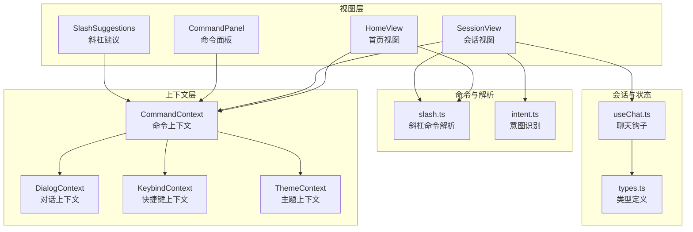
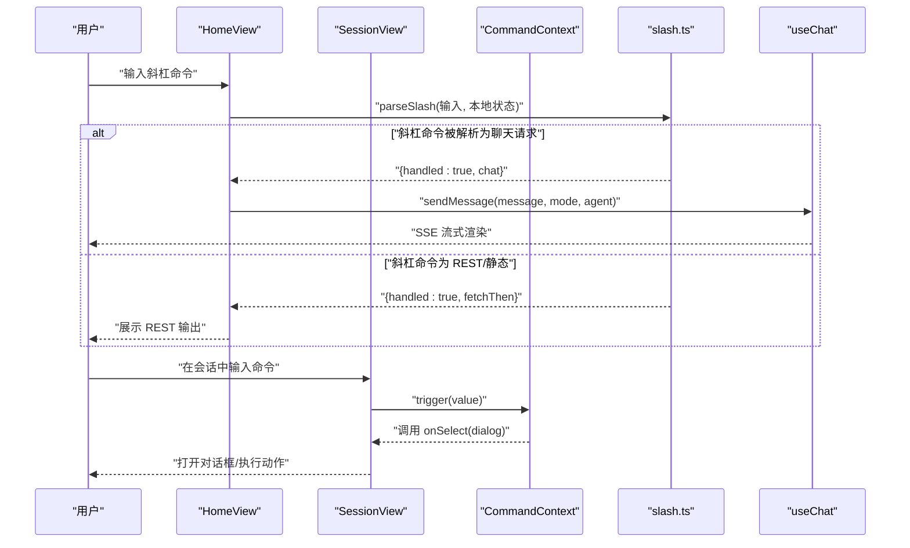
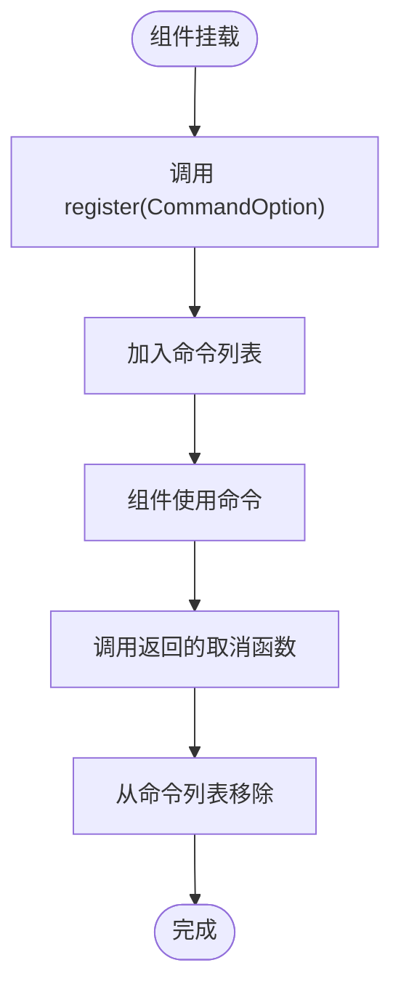
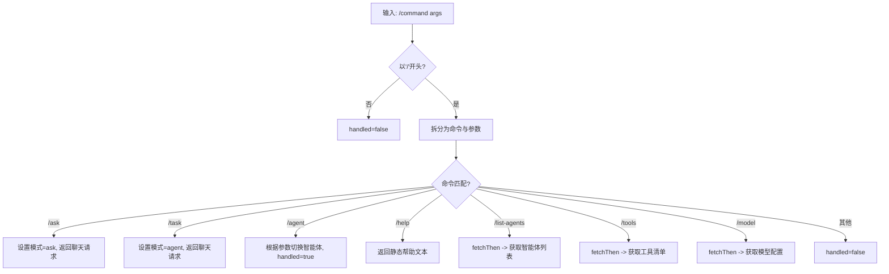
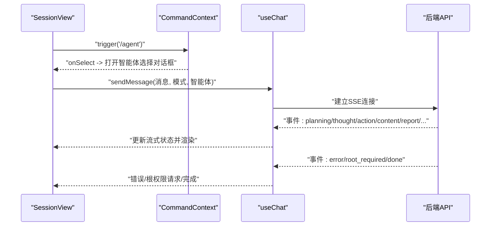
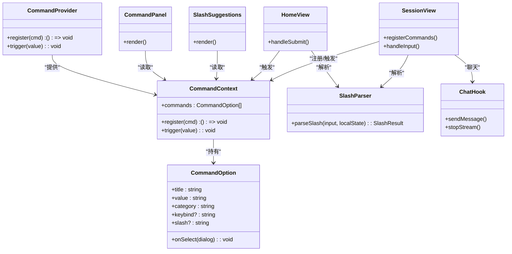

# 命令上下文（CommandContext）

<cite>
**本文引用的文件**
- [CommandContext.tsx](file://terminal-ui/src/contexts/CommandContext.tsx)
- [index.tsx](file://terminal-ui/src/contexts/index.tsx)
- [CommandPanel.tsx](file://terminal-ui/src/components/CommandPanel.tsx)
- [SlashSuggestions.tsx](file://terminal-ui/src/components/SlashSuggestions.tsx)
- [HomeView.tsx](file://terminal-ui/src/views/HomeView.tsx)
- [SessionView.tsx](file://terminal-ui/src/views/SessionView.tsx)
- [slash.ts](file://terminal-ui/src/slash.ts)
- [intent.ts](file://terminal-ui/src/intent.ts)
- [useChat.ts](file://terminal-ui/src/useChat.ts)
- [types.ts](file://terminal-ui/src/types.ts)
</cite>

## 目录
1. [简介](#简介)
2. [项目结构](#项目结构)
3. [核心组件](#核心组件)
4. [架构总览](#架构总览)
5. [详细组件分析](#详细组件分析)
6. [依赖关系分析](#依赖关系分析)
7. [性能考量](#性能考量)
8. [故障排查指南](#故障排查指南)
9. [结论](#结论)
10. [附录](#附录)

## 简介
本文件围绕终端 UI 中的“命令上下文”（CommandContext）进行系统化技术说明，涵盖命令注册机制、命令解析与路由、执行管道、状态管理、与其它上下文的交互关系、数据流向与依赖关系，并提供扩展与自定义指南、性能优化建议与调试技巧。CommandContext 以 React Context 形式提供命令集合、注册与触发能力，配合斜杠命令解析器（parseSlash）、意图识别（isSimpleGreetingOrNonTask）与会话聊天管线（useChat），共同构成一套完整的 TUI 命令体系。

## 项目结构
CommandContext 位于终端 UI 的上下文层，作为命令系统的核心容器，向上游组件提供命令注册与触发接口，向下游组件提供命令面板、斜杠建议等 UI 组件使用。其与斜杠命令解析器、意图识别、会话聊天管线、主题与键盘绑定等上下文协同工作。

图表来源
- [CommandContext.tsx](file://terminal-ui/src/contexts/CommandContext.tsx#L1-L49)
- [index.tsx](file://terminal-ui/src/contexts/index.tsx#L1-L63)
- [CommandPanel.tsx](file://terminal-ui/src/components/CommandPanel.tsx#L1-L92)
- [SlashSuggestions.tsx](file://terminal-ui/src/components/SlashSuggestions.tsx#L1-L52)
- [HomeView.tsx](file://terminal-ui/src/views/HomeView.tsx#L1-L200)
- [SessionView.tsx](file://terminal-ui/src/views/SessionView.tsx#L1-L200)
- [slash.ts](file://terminal-ui/src/slash.ts#L1-L165)
- [intent.ts](file://terminal-ui/src/intent.ts#L1-L39)
- [useChat.ts](file://terminal-ui/src/useChat.ts#L1-L219)
- [types.ts](file://terminal-ui/src/types.ts#L1-L75)

章节来源
- [CommandContext.tsx](file://terminal-ui/src/contexts/CommandContext.tsx#L1-L49)
- [index.tsx](file://terminal-ui/src/contexts/index.tsx#L1-L63)

## 核心组件
- 命令选项（CommandOption）
  - 字段：标题、值（唯一标识）、分类、可选快捷键、可选斜杠命令名、选择回调（接收一个关闭函数）。
  - 作用：描述一个可注册的命令项，包含触发行为与元信息。
- 命令上下文值（CommandContextValue）
  - 字段：命令数组、注册函数、触发函数。
  - 作用：通过 Context 暴露给子树组件使用。
- 命令提供者（CommandProvider）
  - 状态：维护命令列表。
  - 方法：register 注册命令并返回取消注册函数；trigger 根据值查找并调用命令的 onSelect 回调。
- 命令钩子（useCommand）
  - 作用：在子组件中获取命令上下文值，未包裹在 Provider 时抛出错误。

章节来源
- [CommandContext.tsx](file://terminal-ui/src/contexts/CommandContext.tsx#L3-L16)
- [CommandContext.tsx](file://terminal-ui/src/contexts/CommandContext.tsx#L20-L43)
- [CommandContext.tsx](file://terminal-ui/src/contexts/CommandContext.tsx#L45-L49)

## 架构总览
CommandContext 的架构围绕“命令注册—命令选择—命令执行—结果呈现”的闭环展开：
- 命令注册：各功能模块通过 register 将命令项注入上下文。
- 命令选择：用户通过命令面板或斜杠建议选择命令。
- 命令执行：trigger 根据命令值调用 onSelect，通常打开对话框或发起异步操作。
- 结果呈现：对于 REST 类命令，结果通过对话框或输出区域展示；对于聊天类命令，通过 useChat 的 SSE 管线流式渲染。

图表来源
- [HomeView.tsx](file://terminal-ui/src/views/HomeView.tsx#L76-L99)
- [SessionView.tsx](file://terminal-ui/src/views/SessionView.tsx#L308-L337)
- [slash.ts](file://terminal-ui/src/slash.ts#L42-L144)
- [useChat.ts](file://terminal-ui/src/useChat.ts#L62-L196)
- [CommandContext.tsx](file://terminal-ui/src/contexts/CommandContext.tsx#L28-L31)

## 详细组件分析

### 命令注册机制
- 注册入口：任意组件通过 useCommand().register 注册命令项，返回一个取消注册函数，用于清理。
- 注册时机：可在组件挂载时注册，也可在需要时动态注册。
- 注销策略：通过返回的取消函数在组件卸载或条件满足时移除命令，避免重复与内存泄漏。

图表来源
- [CommandContext.tsx](file://terminal-ui/src/contexts/CommandContext.tsx#L23-L26)

章节来源
- [CommandContext.tsx](file://terminal-ui/src/contexts/CommandContext.tsx#L20-L43)

### 命令解析流程与路由机制
- 解析器（parseSlash）
  - 输入：原始输入字符串、本地模式与智能体状态。
  - 行为：识别斜杠命令，区分本地模式切换（/ask、/task、/agent）、静态帮助（/help）、REST 查询（/list-agents、/tools、/model）。
  - 返回：handled 标记、聊天请求对象或 fetchThen 异步函数。
- 路由规则
  - 本地命令：直接更新本地状态（如模式、智能体），必要时触发 sendMessage。
  - REST 命令：返回 fetchThen，由调用方负责展示结果。
  - 其他：未匹配返回 handled=false。

图表来源
- [slash.ts](file://terminal-ui/src/slash.ts#L42-L144)

章节来源
- [slash.ts](file://terminal-ui/src/slash.ts#L42-L144)

### 执行管道与状态管理
- 命令触发（trigger）
  - 根据命令值在上下文中查找对应项，调用 onSelect(dialog)，通常打开对话框或执行副作用。
- 会话聊天（useChat）
  - 状态：流式状态（阶段、思考、行动、内容、报告、响应、错误等）、历史记录、REST 输出、根权限请求等。
  - 生命周期：sendMessage 建立 SSE 连接，按事件类型更新流式状态；stopStream 可中断；onError 设置错误状态。
- 意图识别（isSimpleGreetingOrNonTask）
  - 用于判断问候或非任务型输入，决定是否走 ask 模式而非代理执行，避免不必要的资源消耗。

图表来源
- [SessionView.tsx](file://terminal-ui/src/views/SessionView.tsx#L105-L118)
- [CommandContext.tsx](file://terminal-ui/src/contexts/CommandContext.tsx#L28-L31)
- [useChat.ts](file://terminal-ui/src/useChat.ts#L62-L196)
- [intent.ts](file://terminal-ui/src/intent.ts#L29-L38)

章节来源
- [CommandContext.tsx](file://terminal-ui/src/contexts/CommandContext.tsx#L28-L31)
- [useChat.ts](file://terminal-ui/src/useChat.ts#L31-L219)
- [intent.ts](file://terminal-ui/src/intent.ts#L29-L38)

### 与其它上下文的交互关系
- 上下文树顺序（Provider 嵌套）
  - Exit → Toast → Route → SDK → Sync → Theme → Local → Keybind → Dialog → Command → App。
  - CommandContext 位于 Dialog 之后，确保命令面板与对话框协同工作。
- 与 DialogContext 的协作
  - 命令执行通常通过 onSelect 打开对话框，DialogContext 负责栈式管理与关闭回调。
- 与 KeybindContext 的协作
  - 命令项可声明 keybind，结合快捷键匹配实现快速触发。
- 与 ThemeContext 的协作
  - 命令面板与建议组件使用主题颜色渲染高亮与选中态。

章节来源
- [index.tsx](file://terminal-ui/src/contexts/index.tsx#L1-L63)
- [CommandPanel.tsx](file://terminal-ui/src/components/CommandPanel.tsx#L1-L92)
- [SlashSuggestions.tsx](file://terminal-ui/src/components/SlashSuggestions.tsx#L1-L52)

### 数据流向与依赖关系
- 数据流
  - 用户输入 → 视图层解析（斜杠建议、命令面板）→ 命令上下文触发 → 对话框/聊天管线 → 渲染组件。
- 依赖关系
  - CommandContext 依赖 DialogContext（执行时打开对话框）、KeybindContext（快捷键）、ThemeContext（UI 渲染）。
  - 视图层依赖 CommandContext（命令列表与触发）、slash.ts（命令解析）、useChat.ts（聊天状态与事件）、intent.ts（意图识别）。

章节来源
- [CommandPanel.tsx](file://terminal-ui/src/components/CommandPanel.tsx#L1-L92)
- [SlashSuggestions.tsx](file://terminal-ui/src/components/SlashSuggestions.tsx#L1-L52)
- [HomeView.tsx](file://terminal-ui/src/views/HomeView.tsx#L1-L200)
- [SessionView.tsx](file://terminal-ui/src/views/SessionView.tsx#L1-L200)

## 依赖关系分析

图表来源
- [CommandContext.tsx](file://terminal-ui/src/contexts/CommandContext.tsx#L3-L16)
- [CommandContext.tsx](file://terminal-ui/src/contexts/CommandContext.tsx#L20-L43)
- [CommandPanel.tsx](file://terminal-ui/src/components/CommandPanel.tsx#L1-L92)
- [SlashSuggestions.tsx](file://terminal-ui/src/components/SlashSuggestions.tsx#L1-L52)
- [HomeView.tsx](file://terminal-ui/src/views/HomeView.tsx#L76-L99)
- [SessionView.tsx](file://terminal-ui/src/views/SessionView.tsx#L154-L200)
- [slash.ts](file://terminal-ui/src/slash.ts#L42-L144)
- [useChat.ts](file://terminal-ui/src/useChat.ts#L62-L196)

章节来源
- [CommandContext.tsx](file://terminal-ui/src/contexts/CommandContext.tsx#L1-L49)
- [slash.ts](file://terminal-ui/src/slash.ts#L1-L165)
- [useChat.ts](file://terminal-ui/src/useChat.ts#L1-L219)

## 性能考量
- 命令列表更新
  - register 使用不可变更新，避免深层拷贝；trigger 通过按值查找，复杂度 O(n)。建议控制命令总数或按需注册。
- 命令面板与建议
  - fuzzysort 过滤在大列表时可能成为瓶颈；可通过限制可见数量、阈值与 keys 优化。
- 解析与路由
  - parseSlash 采用线性匹配，建议对常用命令做缓存或前缀索引。
- 聊天状态
  - useChat 的事件处理频繁更新状态，注意避免不必要的重渲染；合理拆分状态与事件处理器。
- 渲染优化
  - 对命令面板与建议组件使用 useMemo/memo，减少重复渲染。

## 故障排查指南
- “useCommand 必须在 CommandProvider 内使用”
  - 现象：在未包裹 CommandProvider 的组件中调用 useCommand 抛错。
  - 排查：确认应用根节点已正确嵌套 AllProviders，其中包含 CommandProvider。
- 命令无法触发
  - 现象：输入命令后无反应。
  - 排查：检查命令是否已注册、value 是否正确、onSelect 是否存在；确认 trigger(value) 调用链路。
- 斜杠命令未生效
  - 现象：/ask、/task、/agent 等未切换模式或未发起聊天。
  - 排查：确认 parseSlash 返回 handled 为 true 且 chat 对象非空；检查本地状态更新逻辑。
- REST 命令未展示输出
  - 现象：/help、/list-agents、/tools 等返回 fetchThen 但未显示。
  - 排查：确认调用方正确处理 fetchThen 并展示结果；检查 API 响应格式。
- SSE 错误或中断
  - 现象：聊天过程中出现错误或中断。
  - 排查：检查 useChat 的 onError 与 stopStream；确认后端 SSE 事件流正常。

章节来源
- [CommandContext.tsx](file://terminal-ui/src/contexts/CommandContext.tsx#L45-L49)
- [slash.ts](file://terminal-ui/src/slash.ts#L42-L144)
- [useChat.ts](file://terminal-ui/src/useChat.ts#L187-L190)

## 结论
CommandContext 通过简洁的注册与触发机制，将命令系统与 UI、解析器、聊天管线解耦，形成清晰的数据流与职责边界。结合斜杠命令解析与意图识别，既能支持本地即时模式切换，也能对接 REST 与聊天执行通道。通过合理的性能优化与故障排查策略，可进一步提升命令系统的稳定性与用户体验。

## 附录

### 命令扩展与自定义指南
- 新增命令步骤
  - 在需要的视图或组件中调用 useCommand().register 注册命令项，设置 title、value、category、slash（可选）、keybind（可选）与 onSelect。
  - onSelect 中实现具体行为：打开对话框、发起 REST 请求、或调用 sendMessage 发起聊天。
- 参数验证与错误处理
  - 在 onSelect 内对参数进行校验，必要时通过对话框或 Toast 提示错误。
  - 对于 REST 命令，捕获异常并在 fetchThen 中统一处理。
- 最佳实践
  - 命令值（value）保持全局唯一，便于 trigger 精准定位。
  - 对高频命令优先考虑缓存与索引，优化查找性能。
  - 对复杂命令拆分为多个小命令，降低 onSelect 的复杂度。

章节来源
- [CommandContext.tsx](file://terminal-ui/src/contexts/CommandContext.tsx#L20-L43)
- [slash.ts](file://terminal-ui/src/slash.ts#L116-L141)
- [useChat.ts](file://terminal-ui/src/useChat.ts#L62-L196)