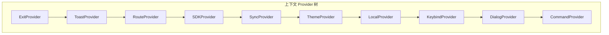
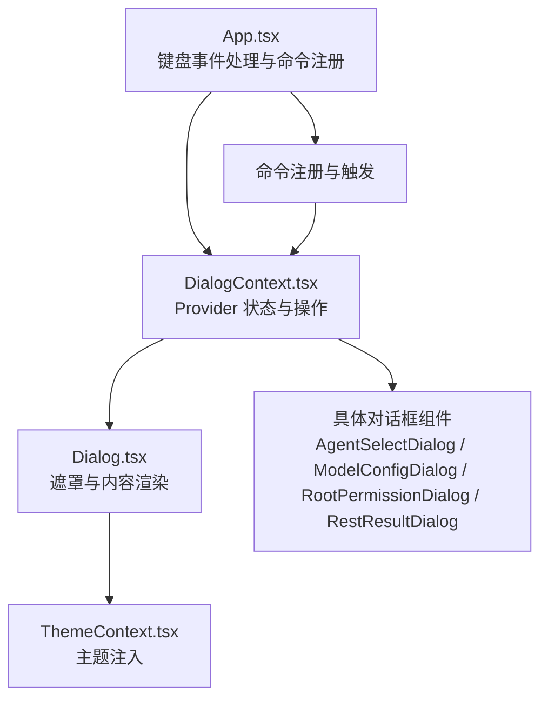
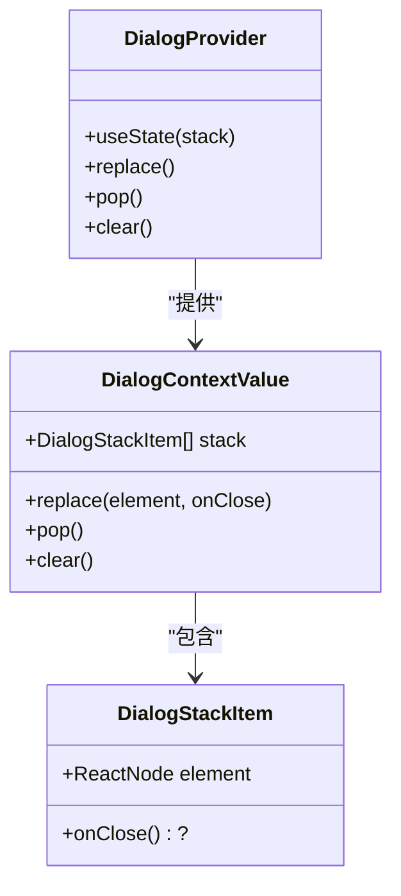
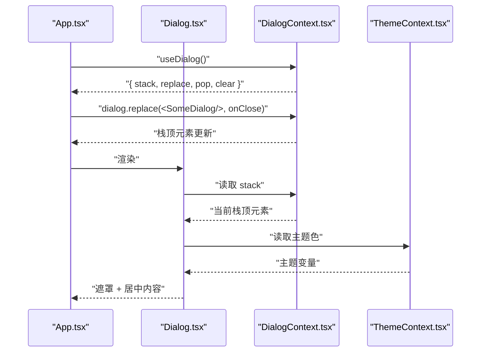
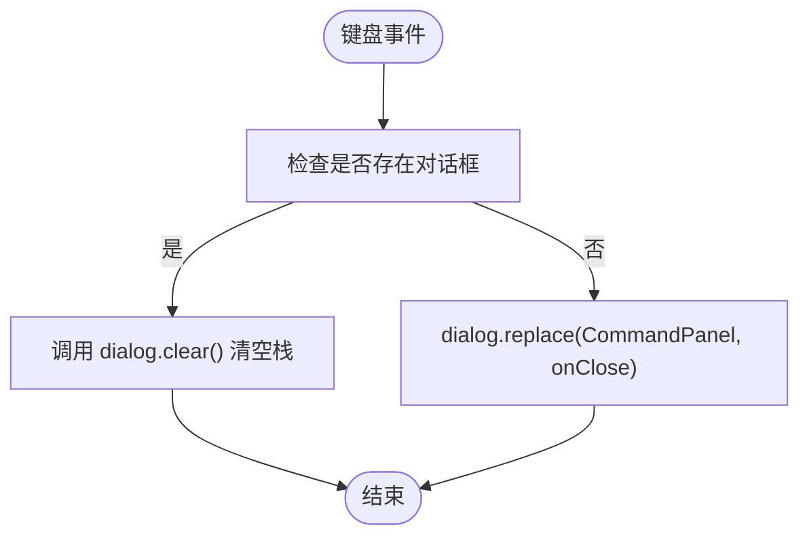
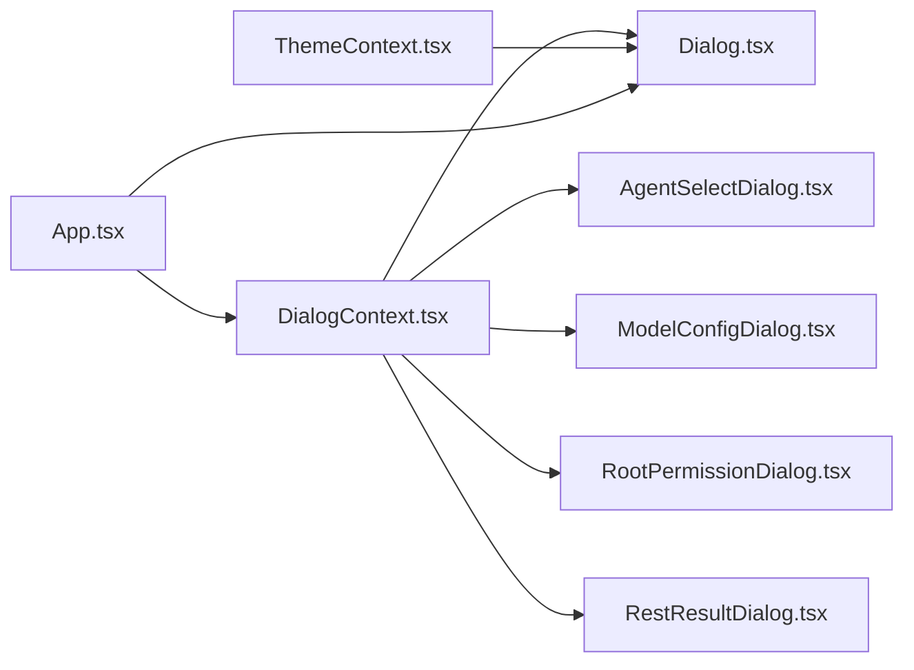

# 对话框上下文（DialogContext）

<cite>
**本文引用的文件**
- [DialogContext.tsx](file://terminal-ui/src/contexts/DialogContext.tsx)
- [Dialog.tsx](file://terminal-ui/src/components/Dialog.tsx)
- [index.tsx](file://terminal-ui/src/contexts/index.tsx)
- [App.tsx](file://terminal-ui/src/App.tsx)
- [AgentSelectDialog.tsx](file://terminal-ui/src/components/AgentSelectDialog.tsx)
- [ModelConfigDialog.tsx](file://terminal-ui/src/components/ModelConfigDialog.tsx)
- [RootPermissionDialog.tsx](file://terminal-ui/src/components/RootPermissionDialog.tsx)
- [RestResultDialog.tsx](file://terminal-ui/src/components/RestResultDialog.tsx)
</cite>

## 目录
1. [引言](#引言)
2. [项目结构](#项目结构)
3. [核心组件](#核心组件)
4. [架构总览](#架构总览)
5. [详细组件分析](#详细组件分析)
6. [依赖关系分析](#依赖关系分析)
7. [性能考量](#性能考量)
8. [故障排查指南](#故障排查指南)
9. [结论](#结论)
10. [附录](#附录)

## 引言
本文件围绕终端 UI 中的对话框上下文（DialogContext）进行系统化技术说明，涵盖设计理念、实现机制与运行流程。重点包括：
- 对话框栈管理：替换、弹栈、清空与生命周期回调
- 状态同步与渲染控制：如何通过上下文状态驱动 UI 层的遮罩与内容渲染
- 生命周期控制：onClose 回调的触发时机与竞态规避
- 架构与集成：与主题、键位绑定、命令面板等上下文的协作
- 用户交互：Esc、Ctrl+C 等按键对对话框栈的影响
- 扩展与自定义：新增对话框类型、样式与行为扩展的实践指南
- 最佳实践与性能建议

## 项目结构
DialogContext 所在的终端 UI 子项目采用上下文 Provider 树嵌套的方式组织全局状态，DialogContext 位于 Theme → Local → Keybind → Dialog 的链路中，确保在主题、本地配置与键位绑定之后被消费。

图表来源
- [index.tsx](file://terminal-ui/src/contexts/index.tsx#L1-L63)

章节来源
- [index.tsx](file://terminal-ui/src/contexts/index.tsx#L1-L63)

## 核心组件
- 上下文与 Provider
  - 提供者负责维护对话框栈（数组），暴露替换、弹栈、清空与只读栈视图
  - 替换：将新的对话框元素压入栈顶，并可传入关闭回调
  - 弹栈：移除栈顶元素并调用其 onClose 回调
  - 清空：移除所有对话框并调用最顶层 onClose 回调
- 对话框渲染组件
  - Dialog 组件基于当前栈顶元素渲染全屏遮罩与居中内容区
  - 当栈为空时不渲染任何内容，保证主界面可直接显示
- 应用入口与交互
  - App 在顶层监听键盘事件，统一处理 Esc/Ctrl+C 触发的清空逻辑
  - 命令注册处通过 dialog.replace 打开不同类型的对话框
  - 多个具体对话框组件（如智能体选择、模型配置、权限请求、REST 结果）作为栈元素使用

章节来源
- [DialogContext.tsx](file://terminal-ui/src/contexts/DialogContext.tsx#L1-L63)
- [Dialog.tsx](file://terminal-ui/src/components/Dialog.tsx#L1-L44)
- [App.tsx](file://terminal-ui/src/App.tsx#L1-L202)

## 架构总览
DialogContext 的职责是“状态中心”，它与以下组件形成清晰的分层：
- 状态层：栈数组与三个操作函数
- 渲染层：Dialog 组件负责遮罩与内容渲染
- 控制层：App 统一处理键盘事件，决定何时清空；各对话框内部处理自身交互并调用弹栈

图表来源
- [App.tsx](file://terminal-ui/src/App.tsx#L1-L202)
- [DialogContext.tsx](file://terminal-ui/src/contexts/DialogContext.tsx#L1-L63)
- [Dialog.tsx](file://terminal-ui/src/components/Dialog.tsx#L1-L44)
- [AgentSelectDialog.tsx](file://terminal-ui/src/components/AgentSelectDialog.tsx#L1-L72)
- [ModelConfigDialog.tsx](file://terminal-ui/src/components/ModelConfigDialog.tsx#L1-L385)
- [RootPermissionDialog.tsx](file://terminal-ui/src/components/RootPermissionDialog.tsx#L1-L149)
- [RestResultDialog.tsx](file://terminal-ui/src/components/RestResultDialog.tsx#L1-L38)

## 详细组件分析

### 对话框上下文（DialogContext）
- 数据结构
  - 栈项：包含可渲染元素与可选关闭回调
  - 上下文值：包含只读栈、替换、弹栈、清空四个方法
- 实现要点
  - 使用 useState 初始化空栈
  - replace 将新元素作为唯一栈项（覆盖式）
  - pop 移除栈顶并调用其 onClose
  - clear 移除全部并调用最顶层 onClose
  - 所有操作均通过不可变更新策略，确保 React 重渲染正确性
- 生命周期与回调
  - onClose 在弹栈与清空时触发，便于释放资源或取消副作用
  - 通过在 replace 时传入 onClose，可在外部控制对话框关闭后的清理逻辑

图表来源
- [DialogContext.tsx](file://terminal-ui/src/contexts/DialogContext.tsx#L1-L63)

章节来源
- [DialogContext.tsx](file://terminal-ui/src/contexts/DialogContext.tsx#L1-L63)

### 对话框渲染组件（Dialog）
- 设计目标
  - 全屏不透明遮罩 + 居中内容区，保证对话框层级高于主界面
  - 仅当栈非空时渲染，否则返回 null
- 渲染策略
  - 取栈顶元素作为当前内容
  - 根据终端尺寸计算内容区宽度与高度上限
  - 使用主题色填充背景与边框，提升可读性
- 竞态规避
  - 文档注释明确：Esc 仅由 App 统一 dialog.clear()，避免与内层弹栈产生竞态

图表来源
- [App.tsx](file://terminal-ui/src/App.tsx#L1-L202)
- [Dialog.tsx](file://terminal-ui/src/components/Dialog.tsx#L1-L44)
- [DialogContext.tsx](file://terminal-ui/src/contexts/DialogContext.tsx#L1-L63)

章节来源
- [Dialog.tsx](file://terminal-ui/src/components/Dialog.tsx#L1-L44)

### 应用入口与键盘事件（App）
- 键盘事件处理
  - Escape/Ctrl+C：若存在对话框则统一调用 clear，避免与内层弹栈竞态
  - 命令面板：通过 dialog.replace 打开命令面板，并在关闭回调中调用 clear
- 命令注册
  - 注册多个斜杠命令，点击后关闭当前对话框并打开对应对话框
  - 示例：/agent 打开智能体选择；/model 打开模型配置；/help 展示帮助内容

图表来源
- [App.tsx](file://terminal-ui/src/App.tsx#L156-L175)

章节来源
- [App.tsx](file://terminal-ui/src/App.tsx#L1-L202)

### 具体对话框组件

#### 智能体选择对话框（AgentSelectDialog）
- 功能概述
  - 支持上下键选择、回车确认，切换当前智能体
  - Esc 不立即弹栈，由 App 统一 clear，避免竞态
  - 成功切换后通过 pop 关闭自身
- 交互要点
  - 使用 useDialog().pop() 在确认后关闭
  - 使用 useLocal 读取/写入当前智能体
  - 使用 useToast 提示切换结果

章节来源
- [AgentSelectDialog.tsx](file://terminal-ui/src/components/AgentSelectDialog.tsx#L1-L72)

#### 模型配置对话框（ModelConfigDialog）
- 功能概述
  - 展示与配置推理后端（Ollama/DeepSeek 等）
  - 支持查看当前配置、查看本地模型列表、配置 API Key 与 Base URL
  - Esc 分层返回，顶层 Esc 由 App 统一 clear
- 交互要点
  - 多视图状态：列表、详情、API Key 列表、API Key 输入
  - 使用 useInput 处理方向键与回车
  - 通过 API 获取/更新配置，错误与加载状态管理完善

章节来源
- [ModelConfigDialog.tsx](file://terminal-ui/src/components/ModelConfigDialog.tsx#L1-L385)

#### 权限请求对话框（RootPermissionDialog）
- 功能概述
  - 需要 root/管理员权限时弹窗，支持“执行一次/总是允许/拒绝”
  - 首次允许时要求输入密码，通过后端接口提交响应
- 交互要点
  - Esc 在密码输入步骤返回上一步；顶层 Esc 由 App 统一 clear
  - 提交成功后调用 onResolve 回调

章节来源
- [RootPermissionDialog.tsx](file://terminal-ui/src/components/RootPermissionDialog.tsx#L1-L149)

#### REST 结果对话框（RestResultDialog）
- 功能概述
  - 通过异步获取内容并在对话框中展示，支持滚动
  - Esc 不在此弹栈，由 App 统一 clear，避免与 App 的 hasDialog 状态竞态
- 交互要点
  - 使用 useInput 处理上下箭头滚动
  - 顶部标题与最大可见行数限制

章节来源
- [RestResultDialog.tsx](file://terminal-ui/src/components/RestResultDialog.tsx#L1-L38)

## 依赖关系分析
- 组件耦合
  - Dialog 依赖 DialogContext 的只读栈与 ThemeContext 的主题变量
  - 具体对话框组件依赖 DialogContext 的弹栈能力与 ThemeContext 的主题变量
  - App 依赖 DialogContext 的替换与清空能力，以及键位绑定上下文
- 外部依赖
  - Ink 组件库（Box、useInput 等）用于终端 UI 渲染与输入处理
  - 主题上下文用于颜色与边框样式
- 潜在循环依赖
  - 当前结构为单向依赖（Provider → Consumer），无循环依赖风险

图表来源
- [DialogContext.tsx](file://terminal-ui/src/contexts/DialogContext.tsx#L1-L63)
- [Dialog.tsx](file://terminal-ui/src/components/Dialog.tsx#L1-L44)
- [AgentSelectDialog.tsx](file://terminal-ui/src/components/AgentSelectDialog.tsx#L1-L72)
- [ModelConfigDialog.tsx](file://terminal-ui/src/components/ModelConfigDialog.tsx#L1-L385)
- [RootPermissionDialog.tsx](file://terminal-ui/src/components/RootPermissionDialog.tsx#L1-L149)
- [RestResultDialog.tsx](file://terminal-ui/src/components/RestResultDialog.tsx#L1-L38)
- [App.tsx](file://terminal-ui/src/App.tsx#L1-L202)

章节来源
- [DialogContext.tsx](file://terminal-ui/src/contexts/DialogContext.tsx#L1-L63)
- [Dialog.tsx](file://terminal-ui/src/components/Dialog.tsx#L1-L44)
- [App.tsx](file://terminal-ui/src/App.tsx#L1-L202)

## 性能考量
- 渲染路径
  - Dialog 仅在栈非空时渲染，避免不必要的 DOM/布局开销
  - 遮罩层与内容区尺寸按终端窗口动态计算，减少溢出与重排
- 状态更新
  - replace 采用覆盖式栈更新，复杂度 O(1)，适合频繁切换场景
  - pop/clear 通过 slice 与不可变更新，保持 React 优化友好
- 交互开销
  - useInput 在每个对话框组件内处理按键，避免全局监听带来的额外开销
  - App 统一处理 Esc/Ctrl+C，降低重复事件处理成本

## 故障排查指南
- Esc/Ctrl+C 无效或出现竞态
  - 现象：按下 Esc 后对话框未关闭或主界面闪烁
  - 原因：内层对话框自行调用 pop，与 App 的 clear 发生竞态
  - 解决：遵循文档注释约定，Esc 仅由 App 统一 clear；内层对话框使用 pop 关闭自身，不处理 Esc
- 对话框关闭后资源未释放
  - 现象：对话框关闭但仍有网络请求或定时器未停止
  - 解决：在 replace 时传入 onClose，在 onClose 中清理副作用（如取消请求、清理定时器）
- 主题样式异常
  - 现象：对话框背景或边框颜色不符合预期
  - 解决：检查 ThemeContext 的主题变量是否正确注入，确认 Dialog 使用了正确的主题色

章节来源
- [Dialog.tsx](file://terminal-ui/src/components/Dialog.tsx#L11-L11)
- [App.tsx](file://terminal-ui/src/App.tsx#L156-L175)
- [DialogContext.tsx](file://terminal-ui/src/contexts/DialogContext.tsx#L26-L49)

## 结论
DialogContext 以简洁的栈结构与不可变更新策略，实现了终端 UI 中的对话框管理。通过 App 的统一键盘事件处理与各对话框组件的职责分离，系统在功能与性能之间取得良好平衡。遵循 onClose 回调与 Esc 竞态规避原则，可进一步提升稳定性与可维护性。

## 附录

### 新增对话框类型指南
- 步骤
  - 创建组件：编写一个 React 组件，使用 useDialog().pop() 在交互完成后关闭自身
  - 注册命令：在 App 的命令注册处，使用 dialog.replace(<YourDialog/>) 打开对话框
  - 可选 onClose：在 replace 时传入 onClose，用于清理副作用
- 样式定制
  - 使用 ThemeContext 的主题变量，确保与整体风格一致
  - 注意内容区尺寸限制，避免超出终端窗口
- 行为扩展
  - 使用 useInput 处理键盘事件，注意与 App 的 Esc/Ctrl+C 策略保持一致
  - 如需滚动或复杂交互，参考 RestResultDialog 的实现模式

章节来源
- [App.tsx](file://terminal-ui/src/App.tsx#L68-L154)
- [DialogContext.tsx](file://terminal-ui/src/contexts/DialogContext.tsx#L22-L24)
- [Dialog.tsx](file://terminal-ui/src/components/Dialog.tsx#L1-L44)