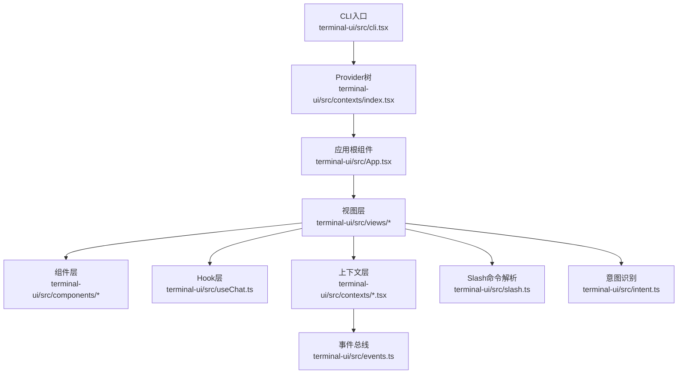
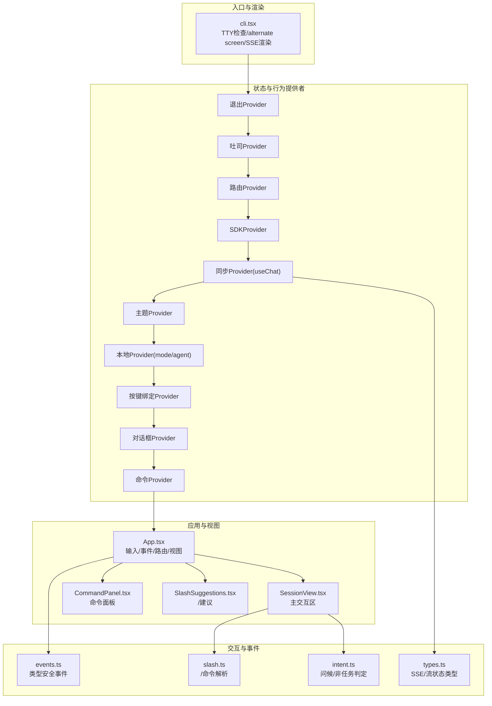
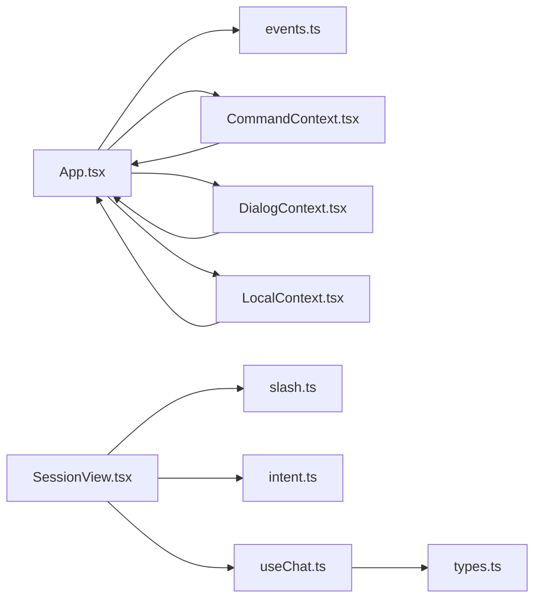

# 交互系统

<cite>
**本文引用的文件**
- [cli.tsx](file://terminal-ui/src/cli.tsx)
- [App.tsx](file://terminal-ui/src/App.tsx)
- [index.tsx](file://terminal-ui/src/contexts/index.tsx)
- [CommandContext.tsx](file://terminal-ui/src/contexts/CommandContext.tsx)
- [KeybindContext.tsx](file://terminal-ui/src/contexts/KeybindContext.tsx)
- [DialogContext.tsx](file://terminal-ui/src/contexts/DialogContext.tsx)
- [LocalContext.tsx](file://terminal-ui/src/contexts/LocalContext.tsx)
- [events.ts](file://terminal-ui/src/events.ts)
- [slash.ts](file://terminal-ui/src/slash.ts)
- [intent.ts](file://terminal-ui/src/intent.ts)
- [useChat.ts](file://terminal-ui/src/useChat.ts)
- [types.ts](file://terminal-ui/src/types.ts)
- [SessionView.tsx](file://terminal-ui/src/views/SessionView.tsx)
- [CommandPanel.tsx](file://terminal-ui/src/components/CommandPanel.tsx)
- [SlashSuggestions.tsx](file://terminal-ui/src/components/SlashSuggestions.tsx)
</cite>

## 目录
1. [简介](#简介)
2. [项目结构](#项目结构)
3. [核心组件](#核心组件)
4. [架构总览](#架构总览)
5. [详细组件分析](#详细组件分析)
6. [依赖关系分析](#依赖关系分析)
7. [性能考虑](#性能考虑)
8. [故障排查指南](#故障排查指南)
9. [结论](#结论)
10. [附录](#附录)

## 简介
本文件面向Secbot命令行界面交互系统，系统基于React Ink构建，提供全屏TTY终端内的交互体验。文档围绕以下主题展开：
- 用户交互设计与实现：键盘输入处理、命令面板、Slash命令系统、意图识别、事件总线、聊天交互、反馈机制（视觉/提示）
- 交互性能优化与可访问性支持策略
- 代码级架构图与数据流图，帮助开发者快速理解与扩展

## 项目结构
终端交互系统位于terminal-ui子工程，入口为CLI脚本，通过React Ink渲染全屏TUI界面，并以Context树组织交互状态与行为。

图表来源
- [cli.tsx](file://terminal-ui/src/cli.tsx#L67-L126)
- [index.tsx](file://terminal-ui/src/contexts/index.tsx#L17-L47)
- [App.tsx](file://terminal-ui/src/App.tsx#L26-L201)

章节来源
- [cli.tsx](file://terminal-ui/src/cli.tsx#L1-L143)
- [index.tsx](file://terminal-ui/src/contexts/index.tsx#L1-L63)

## 核心组件
- CLI入口与TTY管理：负责检测TTY、备用启动、alternate screen切换、错误日志记录与异常捕获
- Provider树：按功能分层提供状态与能力（退出、吐司、路由、SDK、同步、主题、本地、按键绑定、对话框、命令）
- App根组件：统一处理输入、事件订阅、路由与视图渲染
- 会话视图：主交互区域，包含输入、Slash建议、滚动控制、块展开、底部状态栏
- Hook：封装SSE聊天流、流状态管理、历史记录与停止流
- 事件总线：类型安全的内部事件（吐司显示、命令执行）
- Slash命令系统：本地模式切换、REST查询、帮助信息
- 意图识别：对问候与非任务型输入进行判定，决定使用问答模式
- 上下文：命令注册与触发、按键绑定匹配、对话框栈管理、本地状态（模式/智能体）

章节来源
- [cli.tsx](file://terminal-ui/src/cli.tsx#L67-L126)
- [App.tsx](file://terminal-ui/src/App.tsx#L26-L201)
- [useChat.ts](file://terminal-ui/src/useChat.ts#L31-L219)
- [events.ts](file://terminal-ui/src/events.ts#L1-L92)
- [slash.ts](file://terminal-ui/src/slash.ts#L42-L165)
- [intent.ts](file://terminal-ui/src/intent.ts#L29-L39)
- [CommandContext.tsx](file://terminal-ui/src/contexts/CommandContext.tsx#L20-L50)
- [KeybindContext.tsx](file://terminal-ui/src/contexts/KeybindContext.tsx#L102-L137)
- [DialogContext.tsx](file://terminal-ui/src/contexts/DialogContext.tsx#L19-L63)
- [LocalContext.tsx](file://terminal-ui/src/contexts/LocalContext.tsx#L20-L33)

## 架构总览
交互系统采用“入口脚本 -> Provider树 -> 根组件 -> 视图/组件/Hook”的分层架构，配合事件总线实现松耦合通信。

图表来源
- [cli.tsx](file://terminal-ui/src/cli.tsx#L67-L126)
- [index.tsx](file://terminal-ui/src/contexts/index.tsx#L17-L47)
- [App.tsx](file://terminal-ui/src/App.tsx#L26-L201)
- [SessionView.tsx](file://terminal-ui/src/views/SessionView.tsx#L30-L474)
- [CommandPanel.tsx](file://terminal-ui/src/components/CommandPanel.tsx#L11-L92)
- [SlashSuggestions.tsx](file://terminal-ui/src/components/SlashSuggestions.tsx#L19-L52)
- [events.ts](file://terminal-ui/src/events.ts#L49-L92)
- [slash.ts](file://terminal-ui/src/slash.ts#L42-L165)
- [intent.ts](file://terminal-ui/src/intent.ts#L29-L39)
- [useChat.ts](file://terminal-ui/src/useChat.ts#L31-L219)
- [types.ts](file://terminal-ui/src/types.ts#L4-L75)

## 详细组件分析

### CLI入口与TTY管理
- 功能要点
  - 检测TTY与Raw模式支持，必要时在Windows新建控制台窗口以获得TTY
  - 切换alternate screen，渲染React Ink应用，监听退出事件清理屏幕
  - 记录启动与错误日志，捕获未处理异常与拒绝
- 关键路径
  - TTY检测与备用启动：[cli.tsx](file://terminal-ui/src/cli.tsx#L67-L80)
  - alternate screen切换与渲染：[cli.tsx](file://terminal-ui/src/cli.tsx#L92-L108)
  - 错误日志与异常处理：[cli.tsx](file://terminal-ui/src/cli.tsx#L28-L36), [cli.tsx](file://terminal-ui/src/cli.tsx#L128-L140)

章节来源
- [cli.tsx](file://terminal-ui/src/cli.tsx#L1-L143)

### Provider树与上下文
- Provider嵌套顺序遵循UI设计规范，确保依赖链正确
- 关键上下文职责
  - 命令注册与触发：注册命令选项，按值触发回调
  - 按键绑定：解析Ink输入为统一键对象，匹配预设组合键
  - 对话框栈：支持替换、弹栈、清空，统一关闭回调
  - 本地状态：维护模式与智能体，影响后续交互行为
- 关键路径
  - Provider嵌套与导出：[index.tsx](file://terminal-ui/src/contexts/index.tsx#L17-L47)
  - 命令注册/触发：[CommandContext.tsx](file://terminal-ui/src/contexts/CommandContext.tsx#L20-L50)
  - 按键绑定匹配与打印：[KeybindContext.tsx](file://terminal-ui/src/contexts/KeybindContext.tsx#L102-L137)
  - 对话框栈操作：[DialogContext.tsx](file://terminal-ui/src/contexts/DialogContext.tsx#L19-L63)
  - 本地状态（模式/智能体）：[LocalContext.tsx](file://terminal-ui/src/contexts/LocalContext.tsx#L20-L33)

章节来源
- [index.tsx](file://terminal-ui/src/contexts/index.tsx#L1-L63)
- [CommandContext.tsx](file://terminal-ui/src/contexts/CommandContext.tsx#L1-L50)
- [KeybindContext.tsx](file://terminal-ui/src/contexts/KeybindContext.tsx#L1-L137)
- [DialogContext.tsx](file://terminal-ui/src/contexts/DialogContext.tsx#L1-L63)
- [LocalContext.tsx](file://terminal-ui/src/contexts/LocalContext.tsx#L1-L33)

### App根组件与事件系统
- 功能要点
  - 订阅内部事件：吐司显示、命令执行
  - 注册常用命令：模式切换、智能体选择、REST查询、帮助
  - 处理全局输入：命令面板、智能体切换、ESC关闭对话框
  - 路由与视图：根据路由类型渲染首页或会话视图
- 关键路径
  - 事件订阅与命令触发：[App.tsx](file://terminal-ui/src/App.tsx#L57-L66), [App.tsx](file://terminal-ui/src/App.tsx#L68-L154)
  - 全局输入处理与对话框控制：[App.tsx](file://terminal-ui/src/App.tsx#L156-L175)
  - 内部事件定义与发布：[events.ts](file://terminal-ui/src/events.ts#L49-L92)

章节来源
- [App.tsx](file://terminal-ui/src/App.tsx#L1-L202)
- [events.ts](file://terminal-ui/src/events.ts#L1-L92)

### 会话视图与输入处理
- 功能要点
  - 主内容区：历史与流式状态渲染为内容块，支持滚动与展开
  - Slash建议：输入以“/”开头时显示候选命令
  - 输入提交：区分普通消息、Slash命令、模式切换、REST查询
  - 意图识别：对问候与简短非任务输入走问答模式
  - 快捷键：翻页、跳转、半页移动、块展开、滚动条开关
- 关键路径
  - Slash建议生成与过滤：[SessionView.tsx](file://terminal-ui/src/views/SessionView.tsx#L86-L90)
  - Slash命令解析与执行：[SessionView.tsx](file://terminal-ui/src/views/SessionView.tsx#L308-L365)
  - 意图识别与模式选择：[SessionView.tsx](file://terminal-ui/src/views/SessionView.tsx#L367-L368)
  - 输入处理与滚动控制：[SessionView.tsx](file://terminal-ui/src/views/SessionView.tsx#L228-L295)
  - 提交处理与发送消息：[SessionView.tsx](file://terminal-ui/src/views/SessionView.tsx#L297-L373)

章节来源
- [SessionView.tsx](file://terminal-ui/src/views/SessionView.tsx#L1-L474)
- [slash.ts](file://terminal-ui/src/slash.ts#L42-L165)
- [intent.ts](file://terminal-ui/src/intent.ts#L29-L39)

### Slash命令系统
- 设计与实现
  - 本地命令：/ask、/task、/agent（切换智能体）
  - REST命令：/help、/list-agents、/model、/tools，返回文本或弹窗展示
  - 解析流程：去空白、拆分、小写匹配、参数提取、分支处理
- 关键路径
  - 命令解析与结果：[slash.ts](file://terminal-ui/src/slash.ts#L42-L144)
  - 模式与智能体推断：[slash.ts](file://terminal-ui/src/slash.ts#L146-L165)

章节来源
- [slash.ts](file://terminal-ui/src/slash.ts#L1-L165)

### 意图识别系统
- 设计与实现
  - 问候正则集合：中文/英文常见问候与时间问候
  - 短输入非任务判定：长度极短且为中文/英文字母/标点
  - 返回布尔值，驱动会话视图选择问答模式
- 关键路径
  - 问候与短输入判定：[intent.ts](file://terminal-ui/src/intent.ts#L29-L39)

章节来源
- [intent.ts](file://terminal-ui/src/intent.ts#L1-L39)

### 事件系统（内部事件总线）
- 设计与实现
  - 类型安全：事件定义包含名称、载荷校验函数、解析函数
  - 发布/订阅：Map存储监听器，emit遍历调用，parse统一校验
  - 内置事件：吐司显示、命令执行
- 关键路径
  - 事件定义与发布：[events.ts](file://terminal-ui/src/events.ts#L19-L35), [events.ts](file://terminal-ui/src/events.ts#L71-L80)
  - 订阅接口：[events.ts](file://terminal-ui/src/events.ts#L54-L69), [events.ts](file://terminal-ui/src/events.ts#L82-L92)

章节来源
- [events.ts](file://terminal-ui/src/events.ts#L1-L92)

### 聊天交互与SSE流
- 设计与实现
  - Hook封装：useChat管理流状态、历史、REST输出、挂起请求
  - SSE事件：planning/thought/action/content/report/phase/root_required/error/response/done
  - 流状态重置与历史快照：每轮开始前保存上一轮非空流状态
  - 停止流：AbortController中断当前连接
- 关键路径
  - Hook与SSE连接：[useChat.ts](file://terminal-ui/src/useChat.ts#L31-L219)
  - 流状态类型与块渲染桥接：[types.ts](file://terminal-ui/src/types.ts#L4-L75)

章节来源
- [useChat.ts](file://terminal-ui/src/useChat.ts#L1-L219)
- [types.ts](file://terminal-ui/src/types.ts#L1-L75)

### 交互反馈机制
- 视觉反馈
  - 吐司：统一的Toast组件，支持标题、变体、持续时间
  - 彩虹动效：底部“SECBOT”字符逐字彩虹色循环
  - 滚动条：可开关，支持滚动位置与范围显示
- 声音与震动反馈
  - 仓库未实现声音与震动反馈，建议通过系统通知或终端提示音扩展
- 关键路径
  - 吐司与状态栏：[SessionView.tsx](file://terminal-ui/src/views/SessionView.tsx#L440-L470)
  - 彩虹动效定时器：[SessionView.tsx](file://terminal-ui/src/views/SessionView.tsx#L100-L103)

章节来源
- [SessionView.tsx](file://terminal-ui/src/views/SessionView.tsx#L1-L474)

### 键盘输入处理与命令面板
- 设计与实现
  - 命令面板：模糊搜索过滤、上下箭头选择、回车执行
  - Slash建议：两列布局（命令/描述），高亮当前项
  - 全局快捷键：Ctrl+C退出、Ctrl+K命令列表、Esc、Tab切换智能体、翻页与跳转
- 关键路径
  - 命令面板交互：[CommandPanel.tsx](file://terminal-ui/src/components/CommandPanel.tsx#L32-L48)
  - Slash建议渲染：[SlashSuggestions.tsx](file://terminal-ui/src/components/SlashSuggestions.tsx#L19-L52)
  - 全局输入与快捷键：[SessionView.tsx](file://terminal-ui/src/views/SessionView.tsx#L228-L295), [App.tsx](file://terminal-ui/src/App.tsx#L156-L175)

章节来源
- [CommandPanel.tsx](file://terminal-ui/src/components/CommandPanel.tsx#L1-L92)
- [SlashSuggestions.tsx](file://terminal-ui/src/components/SlashSuggestions.tsx#L1-L52)
- [SessionView.tsx](file://terminal-ui/src/views/SessionView.tsx#L228-L295)
- [App.tsx](file://terminal-ui/src/App.tsx#L156-L175)

## 依赖关系分析
- 组件耦合
  - App对事件总线、命令注册、对话框、本地状态存在直接依赖
  - 会话视图对Hook、Slash、意图识别、上下文均有依赖
- 松耦合设计
  - 事件总线提供跨组件通信通道
  - 上下文提供就近状态访问，降低props传递复杂度
- 外部依赖
  - Ink提供输入与渲染能力
  - fuzzysort用于命令面板的模糊搜索
- 循环依赖
  - 未见直接循环依赖；Provider嵌套顺序保证自上而下的依赖链

图表来源
- [App.tsx](file://terminal-ui/src/App.tsx#L49-L55)
- [SessionView.tsx](file://terminal-ui/src/views/SessionView.tsx#L8-L17)
- [slash.ts](file://terminal-ui/src/slash.ts#L4-L5)
- [intent.ts](file://terminal-ui/src/intent.ts#L1-L3)
- [useChat.ts](file://terminal-ui/src/useChat.ts#L1-L3)
- [types.ts](file://terminal-ui/src/types.ts#L1-L75)

章节来源
- [App.tsx](file://terminal-ui/src/App.tsx#L1-L202)
- [SessionView.tsx](file://terminal-ui/src/views/SessionView.tsx#L1-L474)

## 性能考虑
- 渲染性能
  - 使用React.memo与useMemo减少不必要的重渲染（命令面板与块渲染）
  - 控制建议列表最大可见数，限制渲染节点数量
- 数据流性能
  - 流状态Map按迭代聚合片段，避免频繁大字符串拼接
  - 历史快照仅在有内容时保存，减少内存占用
- I/O与网络
  - SSE连接复用，一次请求多次事件推送
  - 未命中Slash命令时避免HTTP请求，减少网络开销
- 可访问性
  - 提供键盘导航与快捷键提示
  - 彩虹动效与颜色对比度需符合可访问性要求（建议引入主题变量与对比度检查）

## 故障排查指南
- TTY/终端问题
  - 现象：无法进入TTY或不支持Raw模式
  - 排查：检查是否在系统自带终端运行；Windows下尝试备用启动
  - 日志：启动日志与错误日志文件定位问题
  - 参考路径：[cli.tsx](file://terminal-ui/src/cli.tsx#L67-L80), [cli.tsx](file://terminal-ui/src/cli.tsx#L114-L125)
- 后端不可达
  - 现象：无法连接后端
  - 排查：确认后端已启动，检查地址与错误信息
  - 参考路径：[cli.tsx](file://terminal-ui/src/cli.tsx#L82-L90)
- 事件与命令
  - 现象：命令不生效或吐司不显示
  - 排查：确认事件订阅与发布调用链，检查命令注册与触发
  - 参考路径：[events.ts](file://terminal-ui/src/events.ts#L54-L92), [CommandContext.tsx](file://terminal-ui/src/contexts/CommandContext.tsx#L20-L50)
- Slash命令
  - 现象：/命令无效或未触发
  - 排查：确认命令是否在命令列表中，参数是否正确
  - 参考路径：[slash.ts](file://terminal-ui/src/slash.ts#L42-L144), [SessionView.tsx](file://terminal-ui/src/views/SessionView.tsx#L308-L365)

章节来源
- [cli.tsx](file://terminal-ui/src/cli.tsx#L67-L126)
- [events.ts](file://terminal-ui/src/events.ts#L54-L92)
- [CommandContext.tsx](file://terminal-ui/src/contexts/CommandContext.tsx#L20-L50)
- [slash.ts](file://terminal-ui/src/slash.ts#L42-L144)
- [SessionView.tsx](file://terminal-ui/src/views/SessionView.tsx#L308-L365)

## 结论
该交互系统以React Ink为基础，通过Provider树与事件总线实现清晰的职责分离与松耦合通信。Slash命令系统与意图识别为用户提供了直观的命令入口与智能模式切换。会话视图结合SSE流实现了近实时的响应展示。建议在未来版本中补充声音与震动反馈，并进一步完善可访问性与性能优化策略。

## 附录
- 术语
  - TTY：真实终端，支持Raw模式
  - SSE：服务器发送事件，用于流式传输
  - 智能体：不同角色的AI代理（如hackbot、superhackbot）
- 最佳实践
  - 命令注册时提供分类与快捷键提示
  - 对长文本与大量块渲染场景，优先使用懒加载与虚拟化
  - 事件发布前进行严格载荷校验，避免运行期错误